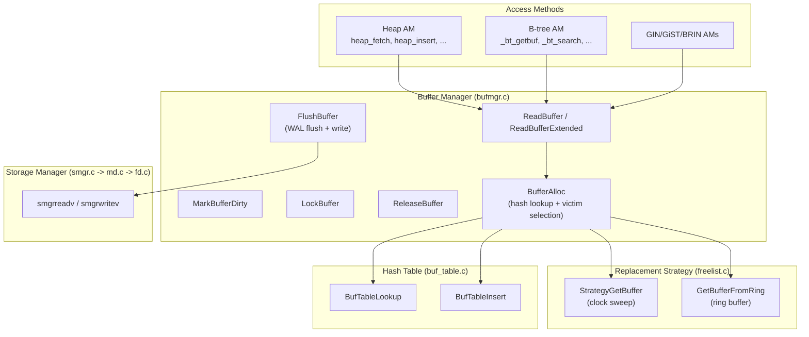

# Architecture Overview

[<< Executive Summary](01_executive_summary.md) | [Index](index.md) | [Next: Buffer Pool Architecture >>](03_buffer_pool_architecture.md)

---

## System Context

The buffer manager sits between the access methods (heap, btree, GIN, GiST, BRIN) and the storage manager. It is the single point of control for all data page access in PostgreSQL.



See the full storage stack diagram: [storage_stack.mermaid](../diagrams/storage_stack.mermaid)

## Component Responsibilities

### Buffer Manager (`src/backend/storage/buffer/bufmgr.c`)

The central module responsible for:
- **Buffer allocation**: [BufferAlloc()](05_buffer_access_protocol.md) -- hash lookup, victim selection, tag assignment
- **Read path**: [ReadBuffer()](05_buffer_access_protocol.md) -- the primary API for loading pages
- **Write path**: [FlushBuffer()](09_dirty_buffer_and_writeback.md) -- WAL enforcement, checksum, physical write
- **Dirty tracking**: [MarkBufferDirty()](09_dirty_buffer_and_writeback.md) -- CAS-based dirty flag management
- **Concurrency control**: [LockBuffer()](06_page_concurrency_control.md) -- content lock acquisition
- **Background cleaning**: [BgBufferSync()](09_dirty_buffer_and_writeback.md) -- adaptive proactive buffer cleaning
- **Checkpoint support**: [BufferSync()](09_dirty_buffer_and_writeback.md) -- bulk dirty buffer flush

### Hash Table (`src/backend/storage/buffer/buf_table.c`)

A partitioned shared-memory hash table with 128 independent lock partitions. Maps [BufferTag](03_buffer_pool_architecture.md) values (page identifiers) to buffer IDs. Provides O(1) lookup for cache hit detection. See [Buffer Lookup and Hash Table](04_buffer_lookup_and_hashtable.md).

### Replacement Strategy (`src/backend/storage/buffer/freelist.c`)

Implements the [clock sweep algorithm](07_buffer_replacement_policy.md) for victim buffer selection, the free list for startup efficiency, and ring buffers for bulk operation isolation. The [BufferStrategyControl](07_buffer_replacement_policy.md) shared structure coordinates the clock hand and background writer.

### Page Operations (`src/backend/storage/page/bufpage.c`)

Manages the internal structure of 8 KB pages: [PageHeaderData](08_page_layout_and_types.md) layout, line pointer management, tuple insertion ([PageAddItemExtended()](08_page_layout_and_types.md)), space compaction ([PageRepairFragmentation()](08_page_layout_and_types.md)), and checksum computation.

### Storage Manager (`src/backend/storage/smgr/`)

A pluggable I/O abstraction layer. Currently only the "magnetic disk" (md) backend exists. See [Storage Manager](11_storage_manager.md).

- **smgr.c**: Dispatch layer with [SMgrRelation](11_storage_manager.md) caching
- **md.c**: Segment-based file management (1 GB segments)
- **fd.c**: Virtual File Descriptor layer with LRU FD recycling

### Local Buffers (`src/backend/storage/buffer/localbuf.c`)

A per-backend buffer pool for temporary table pages. No locking, no WAL, no shared memory. See [Local Buffers](13_local_buffers.md).

## Data Flow Overview

### Read Path

```
Backend calls ReadBuffer(relation, blockNum)
    |
    v
BufferAlloc: hash lookup (shared partition lock)
    |
    +-- HIT: PinBuffer (lock-free CAS), return
    |
    +-- MISS: GetVictimBuffer (clock sweep or free list)
              |
              +-- If victim is dirty: FlushBuffer (WAL flush + write)
              |
              +-- BufTableInsert (exclusive partition lock)
              |
              +-- smgrreadv -> mdreadv -> preadv (disk read)
              |
              +-- TerminateBufferIO (set BM_VALID, wake waiters)
              |
              v
         Return pinned buffer to caller
```

See the full ReadBuffer flow diagram: [readbuffer_flow.mermaid](../diagrams/readbuffer_flow.mermaid)

### Write Path

```
Backend modifies page under exclusive content lock
    |
    v
MarkBufferDirty (CAS: set BM_DIRTY | BM_JUST_DIRTIED)
    |
    v
XLogInsert -> PageSetLSN (record WAL, stamp page with LSN)
    |
    v
[Deferred: checkpoint, bgwriter, or eviction]
    |
    v
FlushBuffer:
    1. XLogFlush(page_lsn) -- WAL-before-data enforcement
    2. PageSetChecksumCopy -- copy page with checksum
    3. smgrwrite -> mdwritev -> pwritev -- write to kernel cache
    4. ScheduleBufferTagForWriteback -- advise kernel to flush
    |
    v
[At checkpoint: smgrDoPendingSyncs -> fsync -- force to disk]
```

See the write-back pipeline diagram: [writeback_pipeline.mermaid](../diagrams/writeback_pipeline.mermaid)

## Shared Memory Layout

The buffer pool occupies a contiguous region of shared memory, organized as parallel arrays indexed by `buf_id` (0-based):

```
Shared Memory Region
|
+-- BufferDescriptors[NBuffers]    64 bytes each, cache-line aligned
|
+-- BufferBlocks[NBuffers]         8,192 bytes each, I/O aligned
|
+-- BufferIOCVArray[NBuffers]      Per-buffer I/O condition variables
|
+-- CkptBufferIds[NBuffers]        Checkpoint sort workspace
|
+-- SharedBufHash                  Partitioned hash table (128 locks)
|
+-- BufferStrategyControl          Clock sweep state and free list
```

See the buffer pool layout diagram: [buffer_pool_layout.mermaid](../diagrams/buffer_pool_layout.mermaid)

For detailed coverage: [Buffer Pool Architecture](03_buffer_pool_architecture.md)

## Lock Hierarchy

PostgreSQL uses a multi-layered locking scheme for buffer access. Locks must be acquired in this order to prevent deadlock:

1. **Relation-level lock** (transaction duration)
2. **Buffer mapping partition lock** (LWLock, 128 partitions)
3. **Buffer content lock** (LWLock per buffer, shared or exclusive)
4. **I/O lock** (BM_IO_IN_PROGRESS flag + condition variable)
5. **Buffer header spinlock** (BM_LOCKED bit, few instructions only)

See the lock hierarchy diagram: [lock_hierarchy.mermaid](../diagrams/lock_hierarchy.mermaid)

For detailed coverage: [Page Concurrency Control](06_page_concurrency_control.md)

## Key Invariants

1. **A buffer must be pinned before being accessed.** An unpinned buffer can be evicted at any time.

2. **WAL-before-data.** No dirty page is written to disk until its WAL record is flushed. Enforced in [FlushBuffer()](09_dirty_buffer_and_writeback.md).

3. **Pin before lock.** Always pin a buffer before acquiring a content lock.

4. **The `buf_id` never changes.** It represents a fixed slot in the pool.

5. **Content locks protect page data; the header spinlock protects metadata.** These are separate concerns.

6. **Partition locks in ascending order.** When multiple hash table partitions must be locked, they are acquired in partition-number order.

---

[<< Executive Summary](01_executive_summary.md) | [Index](index.md) | [Next: Buffer Pool Architecture >>](03_buffer_pool_architecture.md)
