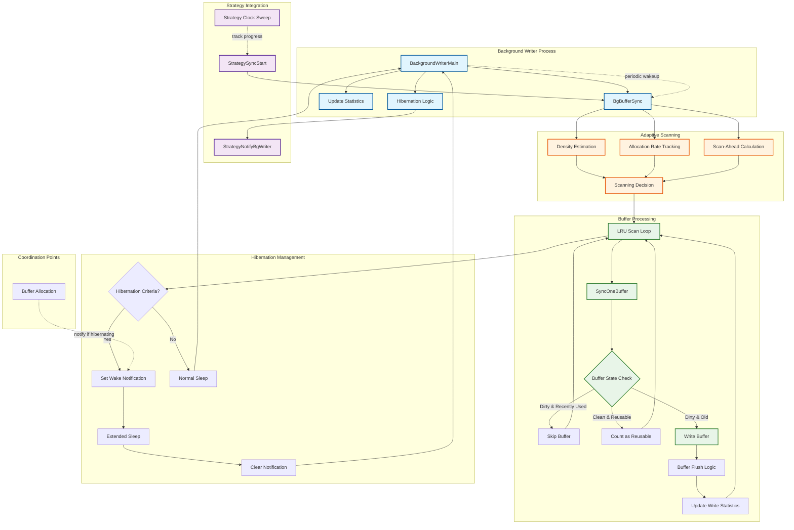
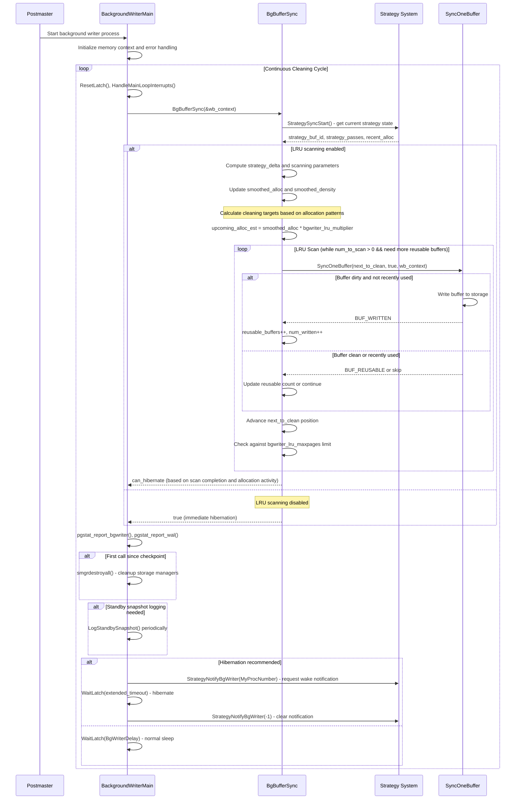

# PostgreSQL Background Writer Subsystem

## Overview

The background writer subsystem provides continuous, low-impact cleaning of dirty buffers in PostgreSQL's shared buffer pool. Unlike checkpoint-driven buffer flushing, which operates in large batches, the background writer performs incremental cleaning to reduce checkpoint I/O burden and improve overall system responsiveness. The subsystem implements sophisticated algorithms for buffer pool scanning, adaptive cleaning rates, and hibernation management, all designed to minimize interference with normal database operations while maintaining optimal buffer availability.

## Key Concepts

### LRU Strategy Integration

The background writer operates in close coordination with PostgreSQL's buffer replacement strategy, which uses a clock-sweep algorithm to identify least recently used buffers. The background writer tracks the strategy's progress and cleans buffers ahead of the replacement point to ensure clean buffers are available when needed.

### Adaptive Cleaning Rate

The subsystem employs moving averages and density estimation to automatically adjust cleaning rates based on system workload. This adaptive approach ensures cleaning resources scale appropriately with buffer allocation pressure while avoiding unnecessary I/O during idle periods.

### Hibernation Mode

When buffer allocation activity is minimal and the background writer has caught up with the strategy clock sweep, the process enters a low-power hibernation mode. This power-saving feature reduces CPU usage on lightly loaded systems while maintaining the ability to quickly resume cleaning when activity increases.

### Density-Based Scanning

The background writer estimates the density of reusable buffers in different regions of the buffer pool and uses this information to optimize scanning patterns. Areas with higher concentrations of reusable buffers receive more cleaning attention, improving overall efficiency.

## Architecture



## Core APIs

### BackgroundWriterMain

#### Purpose
Implements the main control loop for the background writer process, managing periodic buffer cleaning cycles, hibernation behavior, and coordination with other database subsystems.

#### Signature
```c
void BackgroundWriterMain(char *startup_data, size_t startup_data_len);
```

#### Detailed Description
`BackgroundWriterMain` serves as the orchestrating function for PostgreSQL's continuous buffer cleaning process. The function implements a sophisticated event-driven loop that balances cleaning effectiveness with system resource usage.

The main loop operates on a configurable timer (BgWriterDelay) but includes intelligent hibernation logic that extends sleep periods when the system is idle. This approach reduces CPU usage and power consumption on lightly loaded systems while maintaining responsiveness to changing workload conditions.

The function integrates multiple maintenance activities beyond buffer cleaning, including periodic statistics reporting, storage manager cleanup, and standby snapshot logging. This consolidation leverages the background writer's regular execution cycle to perform system-wide maintenance efficiently.

Error recovery within the main loop is comprehensive, implementing resource cleanup mechanisms that handle LWLocks, buffer pins, temporary files, and other process-local resources. The recovery approach ensures the background writer can continue operating even after encountering errors during cleaning operations.

#### Parameters
| Parameter | Type | Description | Constraints |
|-----------|------|-------------|-------------|
| startup_data | char* | Process startup data (unused) | Always NULL for background writer |
| startup_data_len | size_t | Length of startup data | Always 0 for background writer |

#### Return Value
Never returns under normal operation; runs until process termination.

#### Integration Points
- Called by: Postmaster during background writer process startup
- Calls: BgBufferSync for buffer cleaning, pgstat reporting functions, hibernation management
- Shared state: Buffer pool state, process latch for wake notifications, statistics structures

#### Main Loop Implementation
```c
void BackgroundWriterMain(char *startup_data, size_t startup_data_len)
{
    sigjmp_buf local_sigjmp_buf;
    MemoryContext bgwriter_context;
    bool prev_hibernate;
    WritebackContext wb_context;

    /* Process initialization */
    MyBackendType = B_BG_WRITER;
    AuxiliaryProcessMainCommon();

    /* Signal handler setup */
    pqsignal(SIGHUP, SignalHandlerForConfigReload);
    pqsignal(SIGTERM, SignalHandlerForShutdownRequest);
    /* ... other signal handlers ... */

    /* Memory context for error recovery */
    bgwriter_context = AllocSetContextCreate(TopMemoryContext,
                                           "Background Writer",
                                           ALLOCSET_DEFAULT_SIZES);
    MemoryContextSwitchTo(bgwriter_context);

    WritebackContextInit(&wb_context, &bgwriter_flush_after);

    /* Error recovery setup */
    if (sigsetjmp(local_sigjmp_buf, 1) != 0)
    {
        /* Comprehensive error cleanup */
        error_context_stack = NULL;
        HOLD_INTERRUPTS();
        EmitErrorReport();

        /* Resource cleanup */
        LWLockReleaseAll();
        ConditionVariableCancelSleep();
        UnlockBuffers();
        ReleaseAuxProcessResources(false);
        AtEOXact_Buffers(false);
        AtEOXact_SMgr();
        AtEOXact_Files(false);
        AtEOXact_HashTables(false);

        /* Reset context and continue */
        MemoryContextSwitchTo(bgwriter_context);
        FlushErrorState();
        MemoryContextReset(bgwriter_context);
        WritebackContextInit(&wb_context, &bgwriter_flush_after);

        RESUME_INTERRUPTS();
        pg_usleep(1000000L);  /* 1-second error recovery delay */
    }

    PG_exception_stack = &local_sigjmp_buf;
    sigprocmask(SIG_SETMASK, &UnBlockSig, NULL);

    prev_hibernate = false;

    /* Main processing loop */
    for (;;)
    {
        bool can_hibernate;
        int rc;

        ResetLatch(MyLatch);
        HandleMainLoopInterrupts();

        /* Perform one cleaning cycle */
        can_hibernate = BgBufferSync(&wb_context);

        /* Report statistics */
        pgstat_report_bgwriter();
        pgstat_report_wal(true);

        /* Post-checkpoint cleanup */
        if (FirstCallSinceLastCheckpoint())
            smgrdestroyall();

        /* Standby snapshot logging */
        if (XLogStandbyInfoActive() && !RecoveryInProgress())
        {
            /* ... standby snapshot logic ... */
        }

        /* Sleep with normal or hibernation timeout */
        rc = WaitLatch(MyLatch,
                      WL_LATCH_SET | WL_TIMEOUT | WL_EXIT_ON_PM_DEATH,
                      BgWriterDelay,
                      WAIT_EVENT_BGWRITER_MAIN);

        /* Hibernation logic */
        if (rc == WL_TIMEOUT && can_hibernate && prev_hibernate)
        {
            StrategyNotifyBgWriter(MyProcNumber);
            WaitLatch(MyLatch,
                     WL_LATCH_SET | WL_TIMEOUT | WL_EXIT_ON_PM_DEATH,
                     BgWriterDelay * HIBERNATE_FACTOR,
                     WAIT_EVENT_BGWRITER_HIBERNATE);
            StrategyNotifyBgWriter(-1);
        }

        prev_hibernate = can_hibernate;
    }
}
```

### BgBufferSync

#### Purpose
Executes the core buffer cleaning algorithm, implementing adaptive scanning based on buffer allocation patterns and density estimation to optimize cleaning efficiency.

#### Signature
```c
bool BgBufferSync(WritebackContext *wb_context);
```

#### Detailed Description
`BgBufferSync` implements PostgreSQL's most sophisticated buffer cleaning algorithm, designed to maintain optimal buffer availability while minimizing system impact. The function employs advanced statistical analysis to adapt cleaning behavior to changing workload patterns.

The algorithm maintains detailed state between invocations, tracking the strategy clock sweep's progress and computing moving averages of buffer allocation rates and reusable buffer density. This historical information enables predictive cleaning that anticipates future buffer needs rather than simply reacting to current conditions.

The density estimation mechanism is particularly sophisticated, computing the average number of buffers that must be scanned to find one reusable buffer. This metric guides scanning decisions and helps avoid wasted effort in regions of the buffer pool with few reusable buffers.

The function implements intelligent scan termination based on multiple criteria: reaching the strategy clock sweep position (avoiding "lapping"), satisfying estimated allocation requirements, or hitting administrative limits (bgwriter_lru_maxpages). This multi-criteria approach ensures cleaning efforts are well-targeted and bounded.

#### Parameters
| Parameter | Type | Description | Constraints |
|-----------|------|-------------|-------------|
| wb_context | WritebackContext* | Writeback optimization context | Non-null pointer to initialized context |

#### Return Value
Returns bool indicating whether hibernation is appropriate (true if system is idle and background writer is caught up).

#### Integration Points
- Called by: BackgroundWriterMain during each cleaning cycle
- Calls: StrategySyncStart for strategy coordination, SyncOneBuffer for individual buffer cleaning
- Shared state: Strategy clock sweep state, buffer allocation statistics, smoothed estimates

#### Adaptive Cleaning Algorithm
```c
bool BgBufferSync(WritebackContext *wb_context)
{
    /* Strategy coordination */
    int strategy_buf_id;
    uint32 strategy_passes;
    uint32 recent_alloc;

    /* Persistent state between calls */
    static bool saved_info_valid = false;
    static int prev_strategy_buf_id;
    static uint32 prev_strategy_passes;
    static int next_to_clean;
    static uint32 next_passes;

    /* Moving averages for adaptive behavior */
    static float smoothed_alloc = 0;
    static float smoothed_density = 10.0;

    /* Get current strategy state */
    strategy_buf_id = StrategySyncStart(&strategy_passes, &recent_alloc);
    PendingBgWriterStats.buf_alloc += recent_alloc;

    /* Check if LRU scanning is disabled */
    if (bgwriter_lru_maxpages <= 0)
    {
        saved_info_valid = false;
        return true;  /* Immediate hibernation */
    }

    /* Compute strategy progress since last call */
    long strategy_delta;
    int bufs_to_lap;

    if (saved_info_valid)
    {
        int32 passes_delta = strategy_passes - prev_strategy_passes;
        strategy_delta = strategy_buf_id - prev_strategy_buf_id;
        strategy_delta += (long) passes_delta * NBuffers;

        /* Determine position relative to strategy clock */
        if ((int32) (next_passes - strategy_passes) > 0)
        {
            /* We're ahead - compute distance to lap point */
            bufs_to_lap = strategy_buf_id - next_to_clean;
        }
        else if (next_passes == strategy_passes && next_to_clean >= strategy_buf_id)
        {
            /* Same pass, ahead or even */
            bufs_to_lap = NBuffers - (next_to_clean - strategy_buf_id);
        }
        else
        {
            /* We're behind - jump to strategy point */
            next_to_clean = strategy_buf_id;
            next_passes = strategy_passes;
            bufs_to_lap = NBuffers;
        }
    }
    else
    {
        /* Initialize at strategy point */
        strategy_delta = 0;
        next_to_clean = strategy_buf_id;
        next_passes = strategy_passes;
        bufs_to_lap = NBuffers;
    }

    /* Update density estimate */
    if (strategy_delta > 0 && recent_alloc > 0)
    {
        float scans_per_alloc = (float) strategy_delta / (float) recent_alloc;
        smoothed_density += (scans_per_alloc - smoothed_density) / 16.0;
    }

    /* Estimate reusable buffers ahead of strategy point */
    int bufs_ahead = NBuffers - bufs_to_lap;
    int reusable_buffers_est = (float) bufs_ahead / smoothed_density;

    /* Update allocation rate estimate */
    if (smoothed_alloc <= (float) recent_alloc)
        smoothed_alloc = recent_alloc;  /* Fast attack */
    else
        smoothed_alloc += ((float) recent_alloc - smoothed_alloc) / 16.0;  /* Slow decay */

    /* Compute target cleaning amount */
    int upcoming_alloc_est = (int) (smoothed_alloc * bgwriter_lru_multiplier);

    /* Ensure minimum progress even when idle */
    int min_scan_buffers = (int) (NBuffers / (120000.0 / BgWriterDelay));
    if (upcoming_alloc_est < (min_scan_buffers + reusable_buffers_est))
        upcoming_alloc_est = min_scan_buffers + reusable_buffers_est;

    /* Execute LRU scanning loop */
    int num_to_scan = bufs_to_lap;
    int num_written = 0;
    int reusable_buffers = reusable_buffers_est;

    while (num_to_scan > 0 && reusable_buffers < upcoming_alloc_est)
    {
        int sync_state = SyncOneBuffer(next_to_clean, true, wb_context);

        /* Advance scan position */
        if (++next_to_clean >= NBuffers)
        {
            next_to_clean = 0;
            next_passes++;
        }
        num_to_scan--;

        /* Update statistics based on buffer state */
        if (sync_state & BUF_WRITTEN)
        {
            reusable_buffers++;
            if (++num_written >= bgwriter_lru_maxpages)
            {
                PendingBgWriterStats.maxwritten_clean++;
                break;
            }
        }
        else if (sync_state & BUF_REUSABLE)
        {
            reusable_buffers++;
        }
    }

    /* Update persistent state */
    prev_strategy_buf_id = strategy_buf_id;
    prev_strategy_passes = strategy_passes;
    saved_info_valid = true;

    PendingBgWriterStats.buf_written_clean += num_written;

    /* Return hibernation recommendation */
    return (bufs_to_lap == 0 && recent_alloc == 0);
}
```

## Data Structures

### Background Writer Statistics
```c
typedef struct BgWriterStats
{
    PgStat_Counter buf_written_clean;    /* Buffers written by bgwriter */
    PgStat_Counter maxwritten_clean;     /* Times bgwriter stopped due to limit */
    PgStat_Counter buf_alloc;            /* Buffer allocations tracked */
} BgWriterStats;
```

### WritebackContext (Shared with Checkpoint)
```c
typedef struct WritebackContext
{
    int         max_pending;          /* Maximum pending writebacks */
    int         nr_pending;           /* Current pending writebacks */
    BufferTag   pending[WRITEBACK_MAX_PENDING_FLUSHES];  /* Pending tags */
} WritebackContext;
```

### Strategy Synchronization State
```c
/* Internal state maintained by BgBufferSync */
static struct {
    bool        saved_info_valid;     /* State initialization flag */
    int         prev_strategy_buf_id; /* Previous strategy position */
    uint32      prev_strategy_passes; /* Previous strategy pass count */
    int         next_to_clean;        /* Next buffer to clean */
    uint32      next_passes;          /* Pass count at next_to_clean */
    float       smoothed_alloc;       /* Moving average of allocations */
    float       smoothed_density;     /* Moving average of buffer density */
} bg_state;
```

## Processing Flow

The background writer follows a continuous cycle designed to maintain buffer availability while adapting to system workload:



## Performance Characteristics

### Adaptive Scanning Efficiency

1. **Density-Based Optimization**: Estimates reusable buffer density to focus scanning efforts
2. **Moving Average Smoothing**: Uses 16-sample moving averages to balance responsiveness and stability
3. **Strategy Clock Coordination**: Maintains position relative to buffer replacement algorithm
4. **Predictive Cleaning**: Anticipates buffer needs based on allocation patterns rather than reactive cleaning

### Resource Management

1. **Configurable Limits**: `bgwriter_lru_maxpages` prevents excessive I/O in single cycle
2. **Multiplier Tuning**: `bgwriter_lru_multiplier` allows scaling cleaning rate relative to allocation rate
3. **Hibernation Power Saving**: Reduces CPU usage during idle periods while maintaining responsiveness
4. **Writeback Batching**: Coordinates with kernel writeback for optimal I/O patterns

### Integration with System Components

1. **Checkpoint Coordination**: Reduces checkpoint I/O burden through continuous cleaning
2. **Buffer Strategy Integration**: Works with clock-sweep replacement algorithm for optimal buffer availability
3. **Statistics Integration**: Comprehensive statistics reporting for performance monitoring
4. **Storage Manager Integration**: Periodic cleanup of dropped relations and temporary structures

## Implementation Notes

### Concurrency Considerations

The background writer operates with minimal locking requirements:
- Uses the same buffer synchronization mechanisms as checkpoint operations
- Coordinates with buffer allocation through strategy notification system
- Employs lock-free hibernation signaling for minimal overhead
- Maintains per-process state to avoid shared memory contention

### Error Recovery and Robustness

Comprehensive error handling ensures continuous operation:
- Complete resource cleanup on errors (locks, buffers, files)
- Memory context reset prevents memory leaks during error recovery
- Conservative error delays prevent rapid error loops
- Process restart capability through postmaster supervision

### Configuration and Tuning

Key configuration parameters enable workload-specific optimization:
- `bgwriter_delay`: Controls cleaning cycle frequency (default 200ms)
- `bgwriter_lru_maxpages`: Limits buffers written per cycle (default 100)
- `bgwriter_lru_multiplier`: Scales cleaning rate relative to allocation (default 2.0)
- `bgwriter_flush_after`: Controls writeback batching threshold

This background writer subsystem provides essential continuous buffer maintenance that significantly improves PostgreSQL's performance characteristics by reducing checkpoint I/O spikes, maintaining buffer availability, and adapting automatically to varying workload patterns.