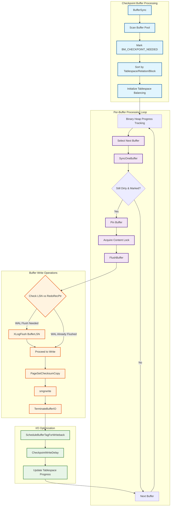
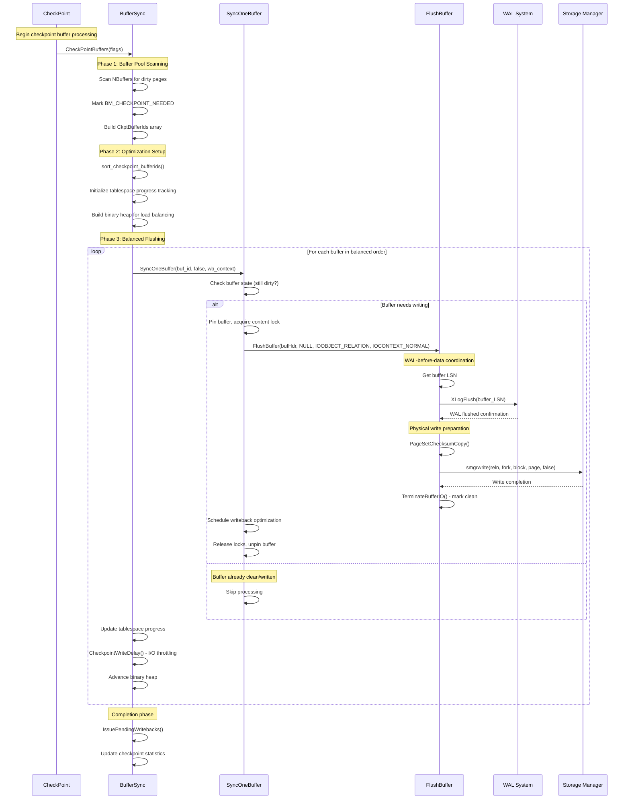

# PostgreSQL Buffer Flushing Subsystem

## Overview

The buffer flushing subsystem manages the critical process of writing dirty buffers from PostgreSQL's shared buffer pool to persistent storage during checkpoints. This subsystem implements sophisticated algorithms for efficient I/O ordering, load balancing across tablespaces, and coordination with the WAL system to ensure the fundamental WAL-before-data rule. The design prioritizes both data integrity and performance, utilizing advanced techniques like I/O throttling, writeback optimization, and checksum-based data protection.

## Key Concepts

### Buffer States and Transitions

During checkpoint operations, buffers transition through several states that coordinate flushing activities:

- **BM_DIRTY**: Buffer contains modified data requiring eventual flush
- **BM_CHECKPOINT_NEEDED**: Buffer marked for flushing during current checkpoint
- **BM_IO_IN_PROGRESS**: Buffer is currently being written to storage
- **BM_PERMANENT**: Buffer belongs to a permanent (logged) relation
- **BM_JUST_DIRTIED**: Buffer was modified during the flush operation

### Tablespace Load Balancing

The buffer flushing system implements intelligent load balancing to prevent I/O hotspots by distributing writes across tablespaces proportionally. This approach uses a binary heap to track progress per tablespace and ensures no single storage device becomes overwhelmed during checkpoint operations.

### WAL-Before-Data Rule Enforcement

Every buffer flush operation enforces PostgreSQL's fundamental consistency rule: WAL records describing changes must reach persistent storage before the corresponding data pages. This coordination prevents torn page scenarios and ensures crash recovery can reconstruct any partial writes.

## Architecture



## Core APIs

### BufferSync

#### Purpose
Orchestrates the complete buffer flushing process during checkpoints, implementing efficient scanning, sorting, and load-balanced writing of dirty buffers across all tablespaces.

#### Signature
```c
static void BufferSync(int flags);
```

#### Detailed Description
`BufferSync` represents the core algorithm for checkpoint buffer management. The function implements a sophisticated two-phase approach: first scanning the entire buffer pool to identify and mark dirty buffers, then executing a carefully orchestrated flush sequence that balances I/O load across storage devices.

The scanning phase iterates through all buffers in the shared buffer pool, examining each buffer's state under spinlock protection. Buffers that meet the dirty criteria (BM_DIRTY and potentially BM_PERMANENT for non-shutdown checkpoints) are marked with BM_CHECKPOINT_NEEDED and added to a sorted array for processing.

The sorting phase organizes buffers by tablespace, relation, and block number to optimize I/O patterns. This ordering reduces random I/O by clustering related writes and enables the load balancing algorithm to distribute work effectively across storage devices.

The flushing phase uses a binary heap to track progress across tablespaces, ensuring proportional advancement through each tablespace's buffer list. This approach prevents any single tablespace from monopolizing I/O bandwidth while maintaining overall checkpoint progress.

#### Parameters
| Parameter | Type | Description | Constraints |
|-----------|------|-------------|-------------|
| flags | int | Checkpoint behavior flags | CHECKPOINT_* constants controlling flush behavior |

#### Return Value
Returns void. The function updates global statistics and may take considerable time to complete depending on buffer pool state.

#### Integration Points
- Called by: CheckPointBuffers during core checkpoint processing
- Calls: SyncOneBuffer for individual buffer writes, sorting and heap management utilities
- Shared state: Global buffer pool, checkpoint statistics, I/O throttling state

#### Implementation Details

**Phase 1: Buffer Pool Scanning**
```c
/* Scan all buffers to identify dirty pages */
num_to_scan = 0;
for (buf_id = 0; buf_id < NBuffers; buf_id++)
{
    BufferDesc *bufHdr = GetBufferDescriptor(buf_id);

    buf_state = LockBufHdr(bufHdr);

    if ((buf_state & mask) == mask)  /* dirty and meets criteria */
    {
        buf_state |= BM_CHECKPOINT_NEEDED;

        /* Add to sorting array */
        CkptBufferIds[num_to_scan].buf_id = buf_id;
        CkptBufferIds[num_to_scan].tsId = bufHdr->tag.spcOid;
        CkptBufferIds[num_to_scan].relNumber = BufTagGetRelNumber(&bufHdr->tag);
        CkptBufferIds[num_to_scan].forkNum = BufTagGetForkNum(&bufHdr->tag);
        CkptBufferIds[num_to_scan].blockNum = bufHdr->tag.blockNum;
        num_to_scan++;
    }

    UnlockBufHdr(bufHdr, buf_state);
}
```

**Phase 2: Tablespace Load Balancing Setup**
```c
/* Sort buffers for optimal I/O patterns */
sort_checkpoint_bufferids(CkptBufferIds, num_to_scan);

/* Initialize per-tablespace progress tracking */
for (i = 0; i < num_to_scan; i++)
{
    if (last_tsid != CkptBufferIds[i].tsId)
    {
        /* New tablespace - allocate progress structure */
        CkptTsStatus *ts_stat = &per_ts_stat[num_spaces++];
        ts_stat->tsId = CkptBufferIds[i].tsId;
        ts_stat->index = i;  /* First buffer in this tablespace */
        ts_stat->num_to_scan = 0;
    }
    per_ts_stat[num_spaces - 1].num_to_scan++;
}

/* Build binary heap for load balancing */
for (i = 0; i < num_spaces; i++)
{
    ts_stat->progress_slice = (float8) num_to_scan / ts_stat->num_to_scan;
    binaryheap_add_unordered(ts_heap, PointerGetDatum(ts_stat));
}
binaryheap_build(ts_heap);
```

**Phase 3: Balanced Buffer Flushing**
```c
/* Process buffers in load-balanced order */
while (!binaryheap_empty(ts_heap))
{
    CkptTsStatus *ts_stat = (CkptTsStatus *)
        DatumGetPointer(binaryheap_first(ts_heap));

    buf_id = CkptBufferIds[ts_stat->index].buf_id;
    bufHdr = GetBufferDescriptor(buf_id);

    /* Check if buffer still needs writing */
    if (pg_atomic_read_u32(&bufHdr->state) & BM_CHECKPOINT_NEEDED)
    {
        if (SyncOneBuffer(buf_id, false, &wb_context) & BUF_WRITTEN)
        {
            num_written++;
        }
    }

    /* Update progress tracking */
    ts_stat->progress += ts_stat->progress_slice;
    ts_stat->num_scanned++;
    ts_stat->index++;

    /* Advance heap or remove completed tablespace */
    if (ts_stat->num_scanned == ts_stat->num_to_scan)
        binaryheap_remove_first(ts_heap);
    else
        binaryheap_replace_first(ts_heap, PointerGetDatum(ts_stat));

    /* Throttle I/O to spread checkpoint over time */
    CheckpointWriteDelay(flags, (double) num_processed / num_to_scan);
}
```

### SyncOneBuffer

#### Purpose
Handles the synchronization of a single buffer to storage, implementing the complete workflow from buffer validation through physical I/O completion with proper concurrency control and error handling.

#### Signature
```c
static int SyncOneBuffer(int buf_id, bool skip_recently_used, WritebackContext *wb_context);
```

#### Detailed Description
`SyncOneBuffer` encapsulates the intricate process of writing a single buffer to persistent storage while maintaining PostgreSQL's consistency guarantees. The function implements a carefully designed state machine that handles concurrent access, validates buffer state, and coordinates with the WAL system.

The buffer validation phase checks whether the buffer still requires writing, as other processes might have flushed it concurrently. The function uses atomic operations to examine buffer state without extensive locking, optimizing for the common case where buffers remain dirty throughout the checkpoint.

The function implements sophisticated concurrency control by pinning buffers during the flush operation, preventing other processes from modifying the buffer while ensuring the page remains valid throughout the write sequence. The use of shared content locks allows concurrent readers while preventing writers.

#### Parameters
| Parameter | Type | Description | Constraints |
|-----------|------|-------------|-------------|
| buf_id | int | Buffer pool index of target buffer | Must be valid buffer ID (0 to NBuffers-1) |
| skip_recently_used | bool | Skip buffers with high usage count | Used by background writer for replacement candidates |
| wb_context | WritebackContext* | Writeback optimization context | Non-null pointer to initialized context |

#### Return Value
Returns int bitmask with flags: BUF_WRITTEN (buffer was written), BUF_REUSABLE (buffer available for replacement).

#### Integration Points
- Called by: BufferSync during checkpoint processing, BgBufferSync for background cleaning
- Calls: FlushBuffer for physical I/O, buffer pinning/unpinning functions, writeback scheduling
- Shared state: Individual buffer descriptors, buffer content locks, usage statistics

#### Processing Workflow
```c
static int SyncOneBuffer(int buf_id, bool skip_recently_used, WritebackContext *wb_context)
{
    BufferDesc *bufHdr = GetBufferDescriptor(buf_id);
    int result = 0;
    uint32 buf_state;
    BufferTag tag;

    /* Prepare for buffer operations */
    ReservePrivateRefCountEntry();
    ResourceOwnerEnlarge(CurrentResourceOwner);

    /* Check buffer state under spinlock */
    buf_state = LockBufHdr(bufHdr);

    /* Determine if buffer is reusable (unpinned, low usage) */
    if (BUF_STATE_GET_REFCOUNT(buf_state) == 0 &&
        BUF_STATE_GET_USAGECOUNT(buf_state) == 0)
    {
        result |= BUF_REUSABLE;
    }
    else if (skip_recently_used)
    {
        /* Background writer skips recently used buffers */
        UnlockBufHdr(bufHdr, buf_state);
        return result;
    }

    /* Check if buffer actually needs writing */
    if (!(buf_state & BM_VALID) || !(buf_state & BM_DIRTY))
    {
        UnlockBufHdr(bufHdr, buf_state);
        return result;
    }

    /* Pin buffer and acquire content lock for writing */
    PinBuffer_Locked(bufHdr);
    LWLockAcquire(BufferDescriptorGetContentLock(bufHdr), LW_SHARED);

    /* Perform the actual flush operation */
    FlushBuffer(bufHdr, NULL, IOOBJECT_RELATION, IOCONTEXT_NORMAL);

    /* Release locks and schedule writeback optimization */
    LWLockRelease(BufferDescriptorGetContentLock(bufHdr));
    tag = bufHdr->tag;
    UnpinBuffer(bufHdr);

    ScheduleBufferTagForWriteback(wb_context, IOCONTEXT_NORMAL, &tag);

    return result | BUF_WRITTEN;
}
```

### FlushBuffer

#### Purpose
Executes the physical write of a buffer to storage with comprehensive WAL coordination, checksum calculation, and I/O completion handling. Implements the core WAL-before-data rule enforcement.

#### Signature
```c
static void FlushBuffer(BufferDesc *buf, SMgrRelation reln, IOObject io_object, IOContext io_context);
```

#### Detailed Description
`FlushBuffer` represents the culmination of PostgreSQL's buffer management system, where dirty pages are physically written to persistent storage. The function implements critical data integrity mechanisms including WAL-before-data rule enforcement, page checksum calculation, and atomic I/O state management.

The WAL coordination logic ensures that any WAL records describing changes to the buffer are durably written before the buffer itself reaches storage. This fundamental rule prevents scenarios where data changes are visible on disk without the corresponding WAL records needed for crash recovery.

The function handles both logged and unlogged relations appropriately. For permanent relations, WAL flushing is mandatory. For unlogged relations (which don't participate in crash recovery), WAL flushing is skipped to avoid unnecessary I/O, but special handling prevents fake LSNs from causing WAL flush failures.

Page checksum calculation provides additional data protection by detecting torn page writes and storage corruption. The function uses `PageSetChecksumCopy` to create a checksummed copy of the page, ensuring the original buffer remains unchanged during the write operation.

#### Parameters
| Parameter | Type | Description | Constraints |
|-----------|------|-------------|-------------|
| buf | BufferDesc* | Buffer descriptor for target buffer | Must be pinned with content lock held |
| reln | SMgrRelation | Optional storage manager relation | NULL triggers automatic lookup |
| io_object | IOObject | I/O object type for statistics | Typically IOOBJECT_RELATION |
| io_context | IOContext | I/O context for performance tracking | Context appropriate for caller |

#### Return Value
Returns void. Errors during I/O result in ereport() calls with appropriate error handling.

#### Integration Points
- Called by: SyncOneBuffer during buffer flushing operations
- Calls: XLogFlush for WAL coordination, smgrwrite for physical I/O, checksum calculation functions
- Shared state: Buffer content, WAL system state, storage manager relations

#### WAL-Before-Data Implementation
```c
static void FlushBuffer(BufferDesc *buf, SMgrRelation reln, IOObject io_object, IOContext io_context)
{
    XLogRecPtr recptr;
    uint32 buf_state;
    Block bufBlock;
    char *bufToWrite;

    /* Initiate I/O operation - returns false if already in progress */
    if (!StartBufferIO(buf, false, false))
        return;

    /* Setup error context for debugging */
    errcallback.callback = shared_buffer_write_error_callback;
    errcallback.arg = (void *) buf;
    error_context_stack = &errcallback;

    /* Get buffer LSN while holding header lock */
    buf_state = LockBufHdr(buf);
    recptr = BufferGetLSN(buf);
    buf_state &= ~BM_JUST_DIRTIED;  /* Clear concurrent dirty flag */
    UnlockBufHdr(buf, buf_state);

    /* Enforce WAL-before-data rule for permanent relations */
    if (buf_state & BM_PERMANENT)
        XLogFlush(recptr);

    /* Prepare page for writing with checksum */
    bufBlock = BufHdrGetBlock(buf);
    bufToWrite = PageSetChecksumCopy((Page) bufBlock, buf->tag.blockNum);

    /* Perform physical write operation */
    io_start = pgstat_prepare_io_time(track_io_timing);
    smgrwrite(reln,
              BufTagGetForkNum(&buf->tag),
              buf->tag.blockNum,
              bufToWrite,
              false);

    /* Update I/O statistics */
    pgstat_count_io_op_time(IOOBJECT_RELATION, io_context,
                           IOOP_WRITE, io_start, 1);
    pgBufferUsage.shared_blks_written++;

    /* Complete I/O operation and clean buffer state */
    TerminateBufferIO(buf, true, 0, true);

    error_context_stack = errcallback.previous;
}
```

## Data Structures

### CkptSortItem
```c
typedef struct CkptSortItem
{
    int         buf_id;           /* Buffer pool index */
    Oid         tsId;             /* Tablespace OID */
    RelFileNumber relNumber;      /* Relation file number */
    ForkNumber  forkNum;          /* Fork number */
    BlockNumber blockNum;         /* Block number within file */
} CkptSortItem;
```

### CkptTsStatus
```c
typedef struct CkptTsStatus
{
    Oid         tsId;             /* Tablespace OID */
    int         index;            /* Current position in sorted array */
    int         num_to_scan;      /* Total buffers in this tablespace */
    int         num_scanned;      /* Buffers already processed */
    float8      progress;         /* Cumulative progress score */
    float8      progress_slice;   /* Progress increment per buffer */
} CkptTsStatus;
```

### WritebackContext
```c
typedef struct WritebackContext
{
    int         max_pending;      /* Maximum pending writebacks */
    int         nr_pending;       /* Current pending count */
    /* Internal arrays for batching writeback operations */
} WritebackContext;
```

## Processing Flow

The buffer flushing subsystem implements a carefully orchestrated sequence designed to maximize I/O efficiency while maintaining strict consistency guarantees:



## Performance Characteristics

### I/O Optimization Strategies

1. **Sequential Access Patterns**: Buffer sorting by tablespace, relation, and block number minimizes random I/O
2. **Load Balancing**: Binary heap ensures proportional progress across tablespaces, preventing hotspots
3. **Writeback Batching**: Kernel writeback hints optimize OS-level I/O scheduling
4. **Adaptive Throttling**: checkpoint_completion_target spreads I/O over time to reduce system impact

### Concurrency Optimizations

1. **Minimal Lock Duration**: Buffer header locks held only during state examination
2. **Shared Content Locks**: Allow concurrent readers during buffer writing
3. **Atomic State Checks**: Reduce locking overhead for buffer state validation
4. **Background Coordination**: Background writer reduces checkpoint burden through continuous cleaning

### Memory Management

1. **Efficient Sorting**: In-place sorting algorithms minimize memory allocation
2. **Progress Tracking**: Compact per-tablespace structures track flushing progress
3. **Writeback Context**: Reusable context structures avoid per-buffer allocations

## Implementation Notes

### Error Recovery
The buffer flushing subsystem implements comprehensive error recovery:
- Buffer I/O state cleanup on write failures
- Resource cleanup through error context callbacks
- Automatic retry mechanisms for transient I/O errors
- Graceful degradation under storage pressure

### Integration with WAL System
Close coordination with the WAL system ensures consistency:
- LSN-based flush ordering prevents torn page scenarios
- Fake LSN handling for unlogged relations avoids unnecessary WAL flushes
- Timeline coordination during recovery operations

### Storage Manager Integration
The subsystem leverages storage manager capabilities:
- Relation caching for efficient file handle management
- Fork-aware I/O for different relation components
- Integration with tablespace management for distributed storage

This buffer flushing subsystem provides the critical link between PostgreSQL's memory-resident data and persistent storage, implementing sophisticated algorithms that balance performance, consistency, and system resource utilization.