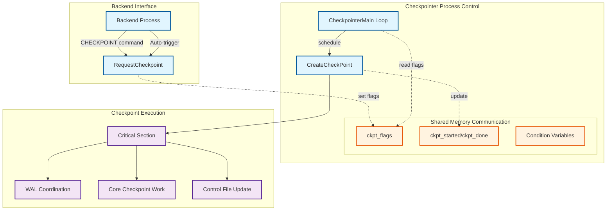
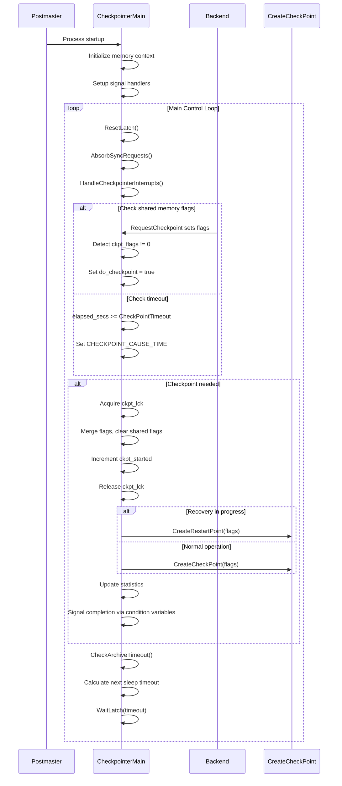

# PostgreSQL Checkpoint Control Subsystem

## Overview

The checkpoint control subsystem forms the central coordination mechanism for PostgreSQL's checkpoint operations. It manages the scheduling, triggering, and execution of checkpoints across the database system, ensuring data consistency and enabling efficient recovery. The subsystem orchestrates the complex interplay between WAL (Write-Ahead Logging), buffer management, and storage systems to provide atomic, durable checkpoint operations.

## Key Concepts

### Checkpoint Types and Flags

- **CHECKPOINT_IS_SHUTDOWN**: Triggered during database shutdown for clean termination
- **CHECKPOINT_END_OF_RECOVERY**: Executed at the end of WAL recovery to establish a new baseline
- **CHECKPOINT_IMMEDIATE**: Bypasses normal throttling for urgent completion
- **CHECKPOINT_FORCE**: Forces execution even without significant WAL activity
- **CHECKPOINT_WAIT**: Makes requesters wait for completion before proceeding
- **CHECKPOINT_CAUSE_XLOG**: Triggered by WAL volume thresholds (max_wal_size)
- **CHECKPOINT_CAUSE_TIME**: Triggered by timeout (checkpoint_timeout)

### Process Coordination

The checkpoint control subsystem operates through a dedicated checkpointer process that coordinates with backend processes via shared memory structures and condition variables. This design isolates checkpoint I/O from normal transaction processing, preventing checkpoint operations from blocking user queries.

## Architecture



## Core APIs

### RequestCheckpoint

#### Purpose
Provides the primary interface for backend processes to request checkpoint operations from the checkpointer process. Handles flag coordination and ensures requests are properly communicated via shared memory.

#### Signature
```c
void RequestCheckpoint(int flags);
```

#### Detailed Description
`RequestCheckpoint` serves as the synchronization point between backend processes and the dedicated checkpointer process. It uses atomic operations on shared memory to communicate checkpoint requests without requiring direct process-to-process communication.

The function implements a sophisticated flag merging mechanism where multiple concurrent requests are combined using bitwise OR operations. This ensures that the "strongest" checkpoint requirements from all requesters are preserved. For example, if one backend requests a normal checkpoint while another requests an immediate checkpoint, the resulting operation will be immediate.

For standalone backends (single-user mode), the function bypasses the normal process coordination and executes the checkpoint directly, always with CHECKPOINT_IMMEDIATE to avoid unnecessary delays.

#### Parameters
| Parameter | Type | Description | Constraints |
|-----------|------|-------------|-------------|
| flags | int | Bitwise OR of checkpoint flags defining behavior | Must include valid CHECKPOINT_* constants |

#### Return Value
Returns void. The function may block if CHECKPOINT_WAIT is specified in flags, waiting for checkpoint completion before returning.

#### Integration Points
- Called by: SQL CHECKPOINT commands, automatic checkpoint triggers, shutdown procedures
- Calls: CreateCheckPoint (in standalone mode), shared memory flag updates
- Shared state: CheckpointerShmem structure for cross-process communication

#### Implementation Details
```c
void RequestCheckpoint(int flags)
{
    int ntries;
    int old_failed, old_started;

    /* Handle standalone backend case */
    if (!IsPostmasterEnvironment)
    {
        CreateCheckPoint(flags | CHECKPOINT_IMMEDIATE);
        smgrdestroyall();
        return;
    }

    /* Atomic flag setting with existing flag preservation */
    SpinLockAcquire(&CheckpointerShmem->ckpt_lck);
    old_failed = CheckpointerShmem->ckpt_failed;
    old_started = CheckpointerShmem->ckpt_started;
    CheckpointerShmem->ckpt_flags |= (flags | CHECKPOINT_REQUESTED);
    SpinLockRelease(&CheckpointerShmem->ckpt_lck);

    /* Wake up checkpointer process */
    SetLatch(&ProcGlobal->checkpointerLatch);

    /* Wait for completion if requested */
    if (flags & CHECKPOINT_WAIT)
    {
        /* ... waiting logic with condition variables ... */
    }
}
```

### CheckpointerMain

#### Purpose
Implements the main control loop for the dedicated checkpointer process, handling checkpoint scheduling, execution coordination, and error recovery. Manages the process lifecycle from startup through shutdown.

#### Signature
```c
void CheckpointerMain(char *startup_data, size_t startup_data_len);
```

#### Detailed Description
`CheckpointerMain` represents the heart of PostgreSQL's checkpoint management system. The function implements a sophisticated event-driven control loop that balances multiple checkpoint triggers while maintaining system responsiveness.

The main loop operates on a priority system where explicit requests (via RequestCheckpoint) take precedence over time-based triggers. This ensures that urgent operations like shutdown checkpoints or immediate checkpoints are processed without delay.

The function implements adaptive sleeping behavior where the process calculates appropriate wait times based on the next expected checkpoint time, archive timeout requirements, and pending signals. This approach minimizes CPU usage while maintaining checkpoint timing accuracy.

Error handling within the main loop is particularly robust, implementing a comprehensive cleanup mechanism that releases locks, cleans up resources, and signals waiting processes about checkpoint failures before continuing operation.

#### Parameters
| Parameter | Type | Description | Constraints |
|-----------|------|-------------|-------------|
| startup_data | char* | Process startup data (unused) | Always NULL for checkpointer |
| startup_data_len | size_t | Length of startup data | Always 0 for checkpointer |

#### Return Value
Never returns under normal operation; runs until process termination.

#### Integration Points
- Called by: Postmaster during checkpointer process startup
- Calls: CreateCheckPoint, CreateRestartPoint, signal handlers, condition variable operations
- Shared state: CheckpointerShmem for process coordination, buffer pool state monitoring

#### Processing Flow


### CreateCheckPoint

#### Purpose
Orchestrates the complete checkpoint process including WAL coordination, buffer synchronization, metadata updates, and control file persistence. Represents the core checkpoint execution engine with comprehensive error handling and consistency guarantees.

#### Signature
```c
void CreateCheckPoint(int flags);
```

#### Detailed Description
`CreateCheckPoint` implements PostgreSQL's most critical data consistency operation. The function coordinates a complex sequence of operations that must be executed atomically to ensure database integrity.

The checkpoint process operates within a critical section to prevent system panic during checkpoint operations. This design ensures that any errors during checkpoint execution result in a controlled system restart rather than data corruption.

The function implements sophisticated transaction synchronization by waiting for commit critical sections to complete before proceeding with core checkpoint work. This prevents race conditions where transaction commits might occur after the checkpoint's redo point but before the transaction state is properly flushed.

WAL coordination is particularly complex, with different behavior for online vs shutdown checkpoints. Online checkpoints insert a CHECKPOINT_REDO record to establish the recovery starting point, while shutdown checkpoints compute the redo point directly since no concurrent WAL insertion is possible.

#### Parameters
| Parameter | Type | Description | Constraints |
|-----------|------|-------------|-------------|
| flags | int | Checkpoint behavior control flags | Combination of CHECKPOINT_* constants |

#### Return Value
Returns void. Errors during execution result in ereport(ERROR) calls within the critical section, causing system restart.

#### Integration Points
- Called by: CheckpointerMain, RequestCheckpoint (standalone mode), recovery processes
- Calls: CheckPointGuts, XLogFlush, UpdateControlFile, transaction synchronization functions
- Shared state: Control file, WAL system state, buffer pool management structures

#### Checkpoint Phases

**Phase 1: Preparation and WAL Coordination**
```c
/* Critical section establishment */
START_CRIT_SECTION();

/* Transaction ID and timeline coordination */
checkpoint.ThisTimeLineID = XLogCtl->InsertTimeLineID;
checkpoint.fullPageWrites = Insert->fullPageWrites;

/* Establish redo point for recovery */
if (!shutdown) {
    /* Online checkpoint - insert REDO record */
    XLogBeginInsert();
    XLogRegisterData((char *) &wal_level, sizeof(wal_level));
    XLogInsert(RM_XLOG_ID, XLOG_CHECKPOINT_REDO);
    checkpoint.redo = RedoRecPtr;
} else {
    /* Shutdown checkpoint - compute redo point directly */
    checkpoint.redo = curInsert;
    RedoRecPtr = XLogCtl->Insert.RedoRecPtr = checkpoint.redo;
}
```

**Phase 2: Transaction Synchronization**
```c
/* Wait for commit critical sections to complete */
vxids = GetVirtualXIDsDelayingChkpt(&nvxids, DELAY_CHKPT_START);
while (nvxids > 0) {
    AbsorbSyncRequests();  /* Prevent deadlocks */
    pg_usleep(10000L);     /* 10ms sleep */
    /* Re-check transaction states */
}
```

**Phase 3: Core Checkpoint Work**
```c
/* Execute core checkpoint operations */
CheckPointGuts(checkpoint.redo, flags);

/* Final transaction synchronization */
vxids = GetVirtualXIDsDelayingChkpt(&nvxids, DELAY_CHKPT_COMPLETE);
/* ... similar waiting loop ... */
```

**Phase 4: WAL Record Insertion and Control File Update**
```c
/* Insert final checkpoint record */
XLogBeginInsert();
XLogRegisterData((char *) (&checkpoint), sizeof(checkpoint));
recptr = XLogInsert(RM_XLOG_ID,
                   shutdown ? XLOG_CHECKPOINT_SHUTDOWN : XLOG_CHECKPOINT_ONLINE);

/* Ensure durability */
XLogFlush(recptr);

/* Update control file with new checkpoint info */
LWLockAcquire(ControlFileLock, LW_EXCLUSIVE);
ControlFile->checkPoint = ProcLastRecPtr;
ControlFile->checkPointCopy = checkpoint;
UpdateControlFile();
LWLockRelease(ControlFileLock);

END_CRIT_SECTION();
```

#### Performance Characteristics

- **I/O Throttling**: Implements checkpoint_completion_target to spread I/O over time
- **WAL Segment Management**: Includes automatic cleanup of old WAL segments post-checkpoint
- **Buffer Pool Coordination**: Ensures all dirty buffers are flushed before checkpoint completion
- **Replication Slot Coordination**: Synchronizes with replication slots to determine WAL retention requirements

## Data Structures

### CheckpointerShmemStruct
```c
typedef struct CheckpointerShmemStruct
{
    pid_t       checkpointer_pid;     /* Process ID of checkpointer */

    /* Request coordination */
    slock_t     ckpt_lck;             /* Spinlock for atomic flag updates */
    int         ckpt_flags;           /* OR of checkpoint request flags */
    int         ckpt_started;         /* Number of checkpoints started */
    int         ckpt_done;            /* Number of checkpoints completed */
    int         ckpt_failed;          /* Number of checkpoints failed */

    /* Process coordination */
    ConditionVariable start_cv;       /* Signals checkpoint start */
    ConditionVariable done_cv;        /* Signals checkpoint completion */

    /* Statistics */
    BgWriterStats bgwriter_stats;     /* Background writer statistics */
} CheckpointerShmemStruct;
```

### CheckPoint Structure
```c
typedef struct CheckPoint
{
    XLogRecPtr  redo;                 /* Redo point LSN */
    TimeLineID  ThisTimeLineID;       /* Current timeline ID */
    TimeLineID  PrevTimeLineID;       /* Previous timeline ID */
    bool        fullPageWrites;       /* FPW state at checkpoint */
    WalLevel    wal_level;            /* WAL level at checkpoint */
    uint32      nextXidEpoch;         /* Next transaction ID epoch */
    TransactionId nextXid;            /* Next transaction ID */
    TransactionId oldestXid;          /* Oldest active transaction ID */
    Oid         oldestXidDB;          /* Database containing oldestXid */
    TransactionId oldestActiveXid;    /* Oldest active transaction (hot standby) */
    pg_time_t   time;                 /* Checkpoint timestamp */
    /* ... additional fields for MultiXact, OIDs, etc. ... */
} CheckPoint;
```

## Processing Flow

The checkpoint control subsystem follows a well-defined sequence of operations designed to maintain consistency while minimizing system impact:

1. **Request Reception**: Backend processes signal checkpoint needs via shared memory
2. **Request Validation**: Checkpointer process validates and merges concurrent requests
3. **Preparation Phase**: WAL state capture and transaction synchronization setup
4. **Execution Phase**: Core checkpoint work including buffer and metadata synchronization
5. **Completion Phase**: Control file updates and process notification
6. **Cleanup Phase**: WAL segment management and resource cleanup

## Implementation Notes

### Concurrency Control
The checkpoint control subsystem uses a multi-layered approach to concurrency control:
- Spinlocks for atomic shared memory updates
- Condition variables for efficient process coordination
- Critical sections for checkpoint atomicity
- WAL insertion locks for timeline coordination

### Error Handling
Comprehensive error handling ensures system integrity:
- Critical sections prevent system panic during checkpoint operations
- Resource cleanup mechanisms handle partial checkpoint failures
- Process notification ensures waiting backends are informed of failures
- Automatic retry mechanisms for transient errors

### Performance Optimization
Several mechanisms optimize checkpoint performance:
- Adaptive I/O throttling based on checkpoint_completion_target
- Background writer coordination to reduce checkpoint burden
- Intelligent WAL segment preallocation
- Efficient buffer pool scanning algorithms

This checkpoint control subsystem provides the foundation for PostgreSQL's data durability guarantees while maintaining high performance through sophisticated coordination mechanisms and optimized I/O patterns.