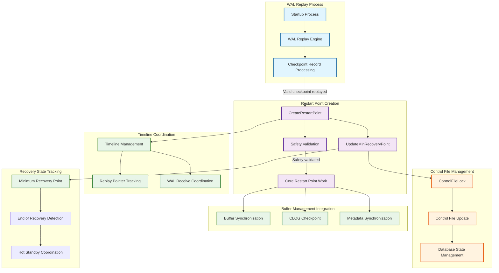
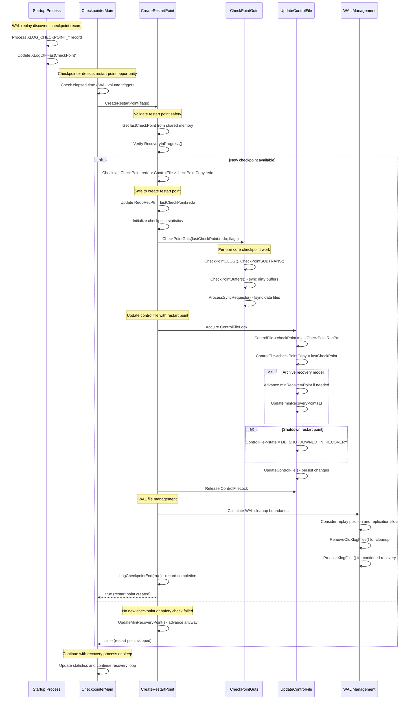

# PostgreSQL Recovery Points Subsystem

## Overview

The recovery points subsystem manages checkpoint-like operations during PostgreSQL's WAL replay phase, establishing safe points from which recovery can resume without replaying the entire recovery log. Recovery points (also called restart points) serve a dual purpose: they enable incremental recovery progress and provide consistent points for backup operations during standby database operation. The subsystem coordinates closely with WAL replay, buffer management, and control file updates to ensure recovery consistency while optimizing recovery performance.

## Key Concepts

### Restart Points vs Checkpoints

Restart points are the recovery-time equivalent of regular checkpoints, but with important differences:
- Created during WAL replay rather than normal operation
- Based on replayed checkpoint records rather than current system state
- Cannot advance beyond the last safely replayed checkpoint
- Must maintain timeline consistency during recovery scenarios

### Recovery Consistency Requirements

The subsystem ensures that any restart point represents a consistent database state by:
- Only advancing based on completely replayed checkpoint records
- Coordinating with minimum recovery point tracking
- Ensuring all prerequisite WAL has been applied before creating restart points
- Maintaining proper timeline relationships during recovery

### Hot Standby Coordination

During hot standby operation, restart points must coordinate with read-only query processing to ensure:
- Consistent snapshots for running queries
- Proper visibility of changes across restart point boundaries
- Timeline advancement that doesn't invalidate ongoing transactions

## Architecture



## Core APIs

### CreateRestartPoint

#### Purpose
Establishes a restart point during WAL recovery, creating a consistent checkpoint-like state that enables recovery to resume from a more recent position without replaying the entire recovery log.

#### Signature
```c
bool CreateRestartPoint(int flags);
```

#### Detailed Description
`CreateRestartPoint` implements the core logic for creating recovery checkpoints during WAL replay. Unlike regular checkpoints that capture the current system state, restart points are based on checkpoint records encountered during WAL replay, ensuring consistency with the recovery timeline.

The function performs extensive validation to ensure restart point safety. It verifies that a new valid checkpoint record has been replayed since the last restart point, preventing redundant or unsafe restart point creation. This validation is crucial for maintaining recovery progress without compromising consistency.

The restart point creation process closely mirrors regular checkpoint operations but with recovery-specific adaptations. The function reuses core checkpoint infrastructure (`CheckPointGuts`) while handling recovery-specific concerns like timeline management and minimum recovery point advancement.

Timeline coordination is particularly complex during restart point creation. The function must handle scenarios where recovery might be promoted to a new timeline, ensuring that WAL segment management and preallocation decisions reflect the current operational state rather than the historical recovery timeline.

#### Parameters
| Parameter | Type | Description | Constraints |
|-----------|------|-------------|-------------|
| flags | int | Restart point behavior control flags | Combination of CHECKPOINT_* constants |

#### Return Value
Returns bool indicating whether a restart point was successfully created (true) or if creation was skipped due to safety constraints (false).

#### Integration Points
- Called by: CheckpointerMain during recovery, automatic restart point triggers
- Calls: CheckPointGuts for core work, UpdateMinRecoveryPoint for recovery coordination, control file management
- Shared state: WAL replay state, control file, buffer pool management, replication slot coordination

#### Restart Point Creation Process
```c
bool CreateRestartPoint(int flags)
{
    XLogRecPtr lastCheckPointRecPtr;
    XLogRecPtr lastCheckPointEndPtr;
    CheckPoint lastCheckPoint;
    XLogRecPtr PriorRedoPtr;
    XLogRecPtr receivePtr, replayPtr, endptr;
    TimeLineID replayTLI;
    XLogSegNo _logSegNo;

    /* Ensure this is only called by checkpointer during recovery */
    Assert(!IsUnderPostmaster || MyBackendType == B_CHECKPOINTER);

    /* Get last valid checkpoint record from shared memory */
    SpinLockAcquire(&XLogCtl->info_lck);
    lastCheckPointRecPtr = XLogCtl->lastCheckPointRecPtr;
    lastCheckPointEndPtr = XLogCtl->lastCheckPointEndPtr;
    lastCheckPoint = XLogCtl->lastCheckPoint;
    SpinLockRelease(&XLogCtl->info_lck);

    /* Verify we're still in recovery */
    if (!RecoveryInProgress())
    {
        ereport(DEBUG2, (errmsg_internal(
            "skipping restartpoint, recovery has already ended")));
        return false;
    }

    /* Safety check - ensure we have a new checkpoint to base restart point on */
    if (XLogRecPtrIsInvalid(lastCheckPointRecPtr) ||
        lastCheckPoint.redo <= ControlFile->checkPointCopy.redo)
    {
        ereport(DEBUG2, (errmsg_internal(
            "skipping restartpoint, already performed at %X/%X",
            LSN_FORMAT_ARGS(lastCheckPoint.redo))));

        /* Update minimum recovery point even if skipping restart point */
        UpdateMinRecoveryPoint(InvalidXLogRecPtr, true);

        /* Handle shutdown state transition */
        if (flags & CHECKPOINT_IS_SHUTDOWN)
        {
            LWLockAcquire(ControlFileLock, LW_EXCLUSIVE);
            ControlFile->state = DB_SHUTDOWNED_IN_RECOVERY;
            UpdateControlFile();
            LWLockRelease(ControlFileLock);
        }
        return false;
    }

    /* Update shared RedoRecPtr for recovery progress tracking */
    WALInsertLockAcquireExclusive();
    RedoRecPtr = XLogCtl->Insert.RedoRecPtr = lastCheckPoint.redo;
    WALInsertLockRelease();

    /* Update info_lck-protected copy */
    SpinLockAcquire(&XLogCtl->info_lck);
    XLogCtl->RedoRecPtr = lastCheckPoint.redo;
    SpinLockRelease(&XLogCtl->info_lck);

    /* Initialize statistics collection */
    MemSet(&CheckpointStats, 0, sizeof(CheckpointStats));
    CheckpointStats.ckpt_start_t = GetCurrentTimestamp();

    /* Get replication slot minimum LSN for WAL cleanup decisions */
    XLogRecPtr slotsMinReqLSN = XLogGetReplicationSlotMinimumLSN();

    if (log_checkpoints)
        LogCheckpointStart(flags, true);

    update_checkpoint_display(flags, true, false);

    /* Perform core restart point work */
    CheckPointGuts(lastCheckPoint.redo, flags);

    /* Update control file with restart point information */
    PriorRedoPtr = ControlFile->checkPointCopy.redo;

    LWLockAcquire(ControlFileLock, LW_EXCLUSIVE);
    if (ControlFile->checkPointCopy.redo < lastCheckPoint.redo)
    {
        /* Update checkpoint information */
        ControlFile->checkPoint = lastCheckPointRecPtr;
        ControlFile->checkPointCopy = lastCheckPoint;

        /* Advance minimum recovery point for backup consistency */
        if (ControlFile->state == DB_IN_ARCHIVE_RECOVERY)
        {
            if (ControlFile->minRecoveryPoint < lastCheckPointEndPtr)
            {
                ControlFile->minRecoveryPoint = lastCheckPointEndPtr;
                ControlFile->minRecoveryPointTLI = lastCheckPoint.ThisTimeLineID;

                /* Update local cached copies */
                LocalMinRecoveryPoint = ControlFile->minRecoveryPoint;
                LocalMinRecoveryPointTLI = ControlFile->minRecoveryPointTLI;
            }

            /* Handle shutdown during recovery */
            if (flags & CHECKPOINT_IS_SHUTDOWN)
                ControlFile->state = DB_SHUTDOWNED_IN_RECOVERY;
        }
        UpdateControlFile();
    }
    LWLockRelease(ControlFileLock);

    /* Update checkpoint distance estimate for preallocation */
    if (PriorRedoPtr != InvalidXLogRecPtr)
        UpdateCheckPointDistanceEstimate(RedoRecPtr - PriorRedoPtr);

    /* WAL segment cleanup and management */
    XLByteToSeg(RedoRecPtr, _logSegNo, wal_segment_size);

    /* Coordinate with WAL receiver for cleanup decisions */
    receivePtr = GetWalRcvFlushRecPtr(NULL, NULL);
    replayPtr = GetXLogReplayRecPtr(&replayTLI);
    endptr = (receivePtr < replayPtr) ? replayPtr : receivePtr;

    KeepLogSeg(endptr, slotsMinReqLSN, &_logSegNo);

    /* Handle replication slot invalidation and recalculation */
    if (InvalidateObsoleteReplicationSlots(RS_INVAL_WAL_REMOVED,
                                          _logSegNo, InvalidOid,
                                          InvalidTransactionId))
    {
        /* Recalculate after slot invalidation */
        slotsMinReqLSN = XLogGetReplicationSlotMinimumLSN();
        CheckPointReplicationSlots(flags & CHECKPOINT_IS_SHUTDOWN);

        XLByteToSeg(RedoRecPtr, _logSegNo, wal_segment_size);
        KeepLogSeg(endptr, slotsMinReqLSN, &_logSegNo);
    }
    _logSegNo--;

    /* Timeline-aware WAL file management */
    if (!RecoveryInProgress())
        replayTLI = XLogCtl->InsertTimeLineID;  /* Promoted during restart point */

    RemoveOldXlogFiles(_logSegNo, RedoRecPtr, endptr, replayTLI);

    /* Preallocate WAL files for continued recovery */
    PreallocXlogFiles(endptr, replayTLI);

    /* SUBTRANS cleanup during hot standby */
    if (EnableHotStandby)
        TruncateSUBTRANS(GetOldestTransactionIdConsideredRunning());

    /* Log completion and update statistics */
    LogCheckpointEnd(true);
    update_checkpoint_display(flags, true, true);

    TimestampTz xtime = GetLatestXTime();
    ereport((log_checkpoints ? LOG : DEBUG2), (errmsg(
        "recovery restart point at %X/%X",
        LSN_FORMAT_ARGS(lastCheckPoint.redo)),
        xtime ? errdetail("Last completed transaction was at log time %s.",
                         timestamptz_to_str(xtime)) : 0));

    /* Execute archive cleanup command if configured */
    if (archiveCleanupCommand && strcmp(archiveCleanupCommand, "") != 0)
        ExecuteRecoveryCommand(archiveCleanupCommand,
                              "archive_cleanup_command",
                              false,
                              WAIT_EVENT_ARCHIVE_CLEANUP_COMMAND);

    return true;
}
```

## Data Structures

### Recovery State Tracking
```c
/* Global variables for recovery coordination */
extern XLogRecPtr LocalMinRecoveryPoint;
extern TimeLineID LocalMinRecoveryPointTLI;
extern bool updateMinRecoveryPoint;

/* Control file recovery state */
typedef struct ControlFileData
{
    /* Recovery-specific fields */
    XLogRecPtr  minRecoveryPoint;        /* Must reach this point for consistency */
    TimeLineID  minRecoveryPointTLI;     /* Timeline for minRecoveryPoint */
    DBState     state;                   /* DB_IN_ARCHIVE_RECOVERY, etc. */

    /* Last valid restart point */
    XLogRecPtr  checkPoint;              /* Restart point record location */
    CheckPoint  checkPointCopy;          /* Restart point data */
} ControlFileData;
```

### Recovery Progress Tracking
```c
/* Shared memory state for recovery coordination */
typedef struct XLogCtlData
{
    /* Recovery state */
    XLogRecPtr  lastCheckPointRecPtr;    /* Last valid checkpoint record */
    XLogRecPtr  lastCheckPointEndPtr;    /* End of last checkpoint record */
    CheckPoint  lastCheckPoint;          /* Copy of last checkpoint data */

    /* Recovery progress */
    XLogRecPtr  replayRecPtr;            /* Last replayed record */
    TimeLineID  replayTimeLineID;        /* Current replay timeline */
    XLogRecPtr  receivedUpto;            /* WAL received from primary */
} XLogCtlData;
```

## Processing Flow

The recovery points subsystem operates within the broader context of WAL replay and recovery management:



## Performance Characteristics

### Recovery Optimization

1. **Incremental Progress**: Restart points enable recovery to resume from recent points rather than replaying entire logs
2. **Parallel Operations**: Core checkpoint work reuses optimized buffer and metadata synchronization algorithms
3. **Timeline Efficiency**: Proper timeline management during promotion scenarios minimizes restart overhead
4. **WAL Cleanup**: Aggressive WAL file cleanup during recovery reduces storage requirements

### Backup Consistency

1. **Minimum Recovery Point**: Ensures backups taken during recovery include sufficient WAL for consistency
2. **Timeline Coordination**: Proper timeline tracking enables backups across timeline changes
3. **Archive Integration**: Coordinates with archive cleanup commands for external backup tools
4. **Hot Standby Support**: Maintains consistency for read-only queries during restart point creation

### Resource Management

1. **Adaptive Triggering**: Restart points triggered by time and WAL volume thresholds rather than fixed intervals
2. **Safety Validation**: Comprehensive safety checks prevent unsafe restart points during edge cases
3. **Replication Coordination**: Integration with replication slots prevents premature WAL cleanup
4. **Storage Optimization**: Aggressive cleanup of obsolete WAL files and transaction metadata

## Implementation Notes

### Recovery Safety

The recovery points subsystem implements multiple safety mechanisms:

- **Checkpoint Validation**: Only advances based on completely replayed, valid checkpoint records
- **Timeline Consistency**: Maintains proper timeline relationships during recovery and promotion
- **Minimum Recovery Point**: Ensures forward progress without regression to earlier states
- **State Coordination**: Proper database state transitions during shutdown and promotion scenarios

### Hot Standby Integration

Special considerations for hot standby operation:

- **Query Consistency**: Ensures running queries remain consistent across restart point boundaries
- **SUBTRANS Management**: Proper cleanup of transaction metadata while maintaining query visibility
- **Snapshot Coordination**: Integration with standby snapshot management for read consistency
- **Promotion Handling**: Smooth transition from recovery to normal operation during promotion

### Error Handling and Edge Cases

Comprehensive handling of recovery scenarios:

- **Incomplete Checkpoints**: Proper handling of checkpoint records that span multiple WAL segments
- **Timeline Switches**: Correct behavior during timeline changes and recovery target scenarios
- **Replication Slot Conflicts**: Coordination with replication slots that might prevent WAL cleanup
- **Archive Recovery**: Special handling for archive recovery vs streaming replication scenarios

### Configuration and Monitoring

Key configuration parameters for restart point behavior:

- **checkpoint_timeout**: Controls time-based restart point triggering during recovery
- **max_wal_size**: Influences WAL volume-based restart point decisions
- **archive_cleanup_command**: Integration with external archive management tools
- **log_checkpoints**: Enables detailed restart point logging for monitoring and debugging

This recovery points subsystem provides essential infrastructure for efficient PostgreSQL recovery operations, enabling incremental recovery progress while maintaining strict consistency guarantees and supporting advanced features like hot standby and point-in-time recovery.