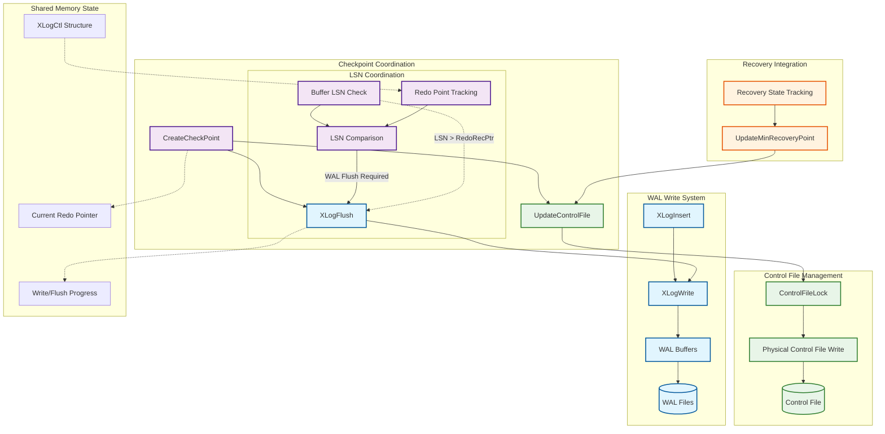
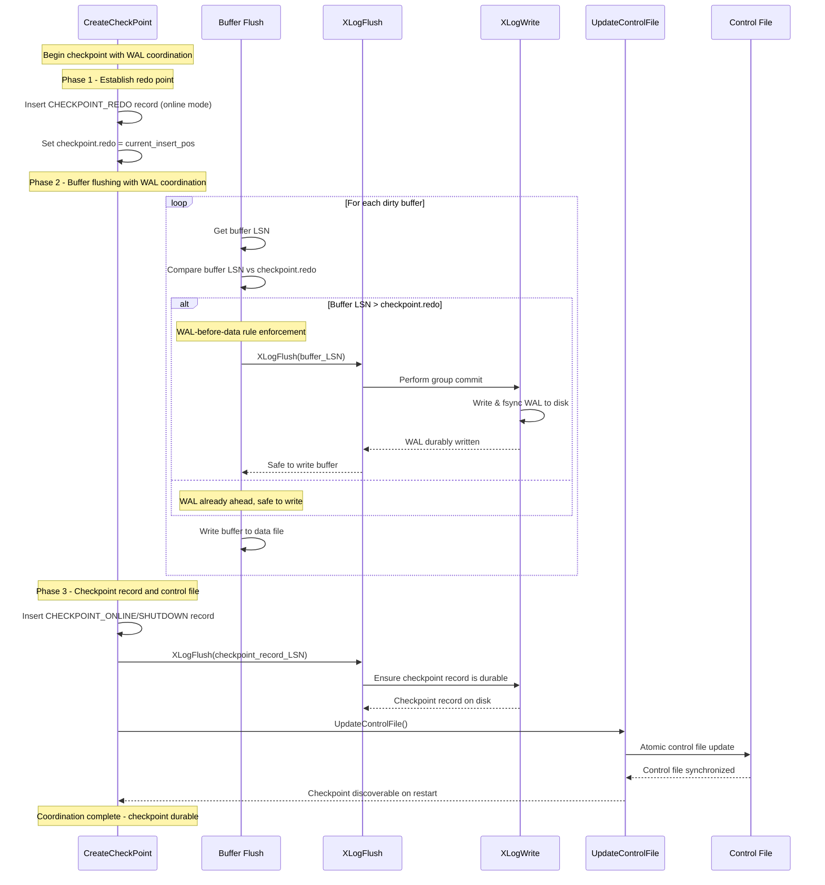

# PostgreSQL WAL-Checkpoint Coordination Subsystem

## Overview

The WAL-Checkpoint coordination subsystem implements the critical interface between PostgreSQL's Write-Ahead Logging (WAL) system and checkpoint operations. This subsystem ensures the fundamental consistency guarantee that WAL records describing data changes reach persistent storage before the corresponding data pages, enabling reliable crash recovery. The coordination mechanisms include sophisticated LSN tracking, timeline management, control file synchronization, and recovery point advancement during both normal operations and crash recovery scenarios.

## Key Concepts

### WAL-Before-Data Rule

The foundational principle ensuring that WAL records are durably written before any data page changes they describe reach disk. This rule enables PostgreSQL to reconstruct any torn page writes or incomplete transactions during crash recovery.

### LSN (Log Sequence Number) Coordination

Every data page carries an LSN indicating the most recent WAL record affecting that page. During checkpoint buffer flushing, this LSN is compared against the checkpoint's redo point to determine if additional WAL flushing is required before the page can be safely written.

### Timeline Management

PostgreSQL uses timeline IDs to track different branches of WAL history, particularly important during recovery scenarios. The coordination subsystem manages timeline transitions and ensures checkpoint records properly reference the correct timeline context.

### Control File Integration

The control file serves as the authoritative source for checkpoint and recovery information. The coordination subsystem ensures atomic updates to control file state, making new checkpoint information discoverable after database restart.

## Architecture



## Core APIs

### XLogFlush

#### Purpose
Ensures that all WAL data through a specified LSN is durably written to storage, implementing the critical WAL-before-data guarantee with optimized group commit and piggyback flushing mechanisms.

#### Signature
```c
void XLogFlush(XLogRecPtr record);
```

#### Detailed Description
`XLogFlush` represents the primary interface for enforcing WAL durability requirements throughout PostgreSQL. The function implements sophisticated optimization strategies while maintaining strict ordering guarantees essential for crash recovery correctness.

The function's group commit optimization allows multiple concurrent flush requests to be satisfied by a single physical I/O operation. When a process finds that another process is already performing a WAL write that will satisfy its requirements, it simply waits for that operation to complete rather than initiating redundant I/O.

During recovery operations, the function automatically delegates to `UpdateMinRecoveryPoint` instead of performing actual WAL flushes, since the system is reading rather than writing WAL. This delegation ensures that recovery progress tracking remains accurate without unnecessary I/O operations.

The piggyback mechanism extends flush operations to include any additional WAL data that has become available since the flush request was initiated. This optimization reduces the total number of fsync operations by batching more data into each flush cycle.

#### Parameters
| Parameter | Type | Description | Constraints |
|-----------|------|-------------|-------------|
| record | XLogRecPtr | Target LSN that must be durably flushed | Must be valid LSN, InvalidXLogRecPtr causes immediate return |

#### Return Value
Returns void. The function blocks until the specified LSN is guaranteed to be on stable storage.

#### Integration Points
- Called by: Buffer flushing operations, transaction commit processing, checkpoint coordination
- Calls: XLogWrite for physical I/O, UpdateMinRecoveryPoint during recovery
- Shared state: LogwrtResult for flush progress tracking, WAL buffer management structures

#### Group Commit Implementation
```c
void XLogFlush(XLogRecPtr record)
{
    XLogRecPtr WriteRqstPtr;
    XLogwrtRqst WriteRqst;
    TimeLineID insertTLI = XLogCtl->InsertTimeLineID;

    /* Handle recovery mode differently */
    if (!XLogInsertAllowed())
    {
        UpdateMinRecoveryPoint(record, false);
        return;
    }

    /* Quick exit if already flushed */
    if (record <= LogwrtResult.Flush)
        return;

    START_CRIT_SECTION();

    /* Piggyback optimization - flush additional data if available */
    WriteRqstPtr = record;

    for (;;)
    {
        XLogRecPtr insertpos;

        /* Check if someone else satisfied our request */
        RefreshXLogWriteResult(LogwrtResult);
        if (record <= LogwrtResult.Flush)
            break;

        /* Wait for in-flight insertions to complete */
        SpinLockAcquire(&XLogCtl->info_lck);
        if (WriteRqstPtr < XLogCtl->LogwrtRqst.Write)
            WriteRqstPtr = XLogCtl->LogwrtRqst.Write;
        SpinLockRelease(&XLogCtl->info_lck);
        insertpos = WaitXLogInsertionsToFinish(WriteRqstPtr);

        /* Try to acquire write lock for group commit */
        if (!LWLockAcquireOrWait(WALWriteLock, LW_EXCLUSIVE))
            continue;  /* Someone else got it, recheck if our flush is done */

        /* Got the lock - perform group commit */
        RefreshXLogWriteResult(LogwrtResult);
        if (record <= LogwrtResult.Flush)
        {
            LWLockRelease(WALWriteLock);
            break;
        }

        /* Optional commit delay for additional group commit opportunities */
        if (CommitDelay > 0 && enableFsync &&
            MinimumActiveBackends(CommitSiblings))
        {
            pg_usleep(CommitDelay);
            insertpos = WaitXLogInsertionsToFinish(insertpos);
        }

        /* Execute the physical write operation */
        WriteRqst.Write = insertpos;
        WriteRqst.Flush = insertpos;
        XLogWrite(WriteRqst, insertTLI, false);

        LWLockRelease(WALWriteLock);
        break;
    }

    END_CRIT_SECTION();

    /* Wake up any waiting walsenders */
    WalSndWakeupProcessRequests(true, !RecoveryInProgress());

    /* Verify flush completion */
    if (LogwrtResult.Flush < record)
        elog(ERROR, "xlog flush request %X/%X is not satisfied --- flushed only to %X/%X",
             LSN_FORMAT_ARGS(record), LSN_FORMAT_ARGS(LogwrtResult.Flush));
}
```

### UpdateControlFile

#### Purpose
Provides a streamlined interface for updating the control file with current checkpoint and recovery state information, ensuring atomic persistence of critical database metadata.

#### Signature
```c
static void UpdateControlFile(void);
```

#### Detailed Description
`UpdateControlFile` serves as the primary mechanism for making checkpoint progress persistent across database restarts. The function is deliberately simple, serving as a wrapper around the lower-level `update_controlfile` function while ensuring consistent parameter handling.

The control file update operation is atomic at the filesystem level, ensuring that partially written control file updates cannot occur. This atomicity is crucial for database integrity, as the control file contains the authoritative checkpoint information needed for recovery startup.

The function always forces immediate synchronization to storage, ensuring that control file updates are immediately durable. This design choice prioritizes correctness over performance, as control file updates are relatively infrequent compared to other database operations.

#### Parameters
None. The function operates on the global ControlFile structure that contains current checkpoint and recovery state.

#### Return Value
Returns void. Errors during control file writing result in PANIC-level errors causing database restart.

#### Integration Points
- Called by: CreateCheckPoint, CreateRestartPoint, UpdateMinRecoveryPoint
- Calls: update_controlfile for actual I/O operations
- Shared state: Global ControlFile structure containing checkpoint metadata

#### Usage Pattern
```c
/* Typical usage within checkpoint operations */
LWLockAcquire(ControlFileLock, LW_EXCLUSIVE);

/* Update control file fields */
ControlFile->checkPoint = checkpoint_record_lsn;
ControlFile->checkPointCopy = checkpoint_data;
ControlFile->state = DB_SHUTDOWNED;  /* or appropriate state */

/* Atomically persist changes */
UpdateControlFile();

LWLockRelease(ControlFileLock);
```

### UpdateMinRecoveryPoint

#### Purpose
Advances the minimum recovery point in the control file during WAL replay, ensuring that crash recovery will replay sufficient WAL to reach a consistent database state.

#### Signature
```c
static void UpdateMinRecoveryPoint(XLogRecPtr lsn, bool force);
```

#### Detailed Description
`UpdateMinRecoveryPoint` implements a critical safety mechanism for crash recovery consistency. The function ensures that if the database crashes during recovery, the subsequent recovery attempt will replay WAL at least as far as previously achieved, preventing regression to earlier (potentially inconsistent) states.

The function implements intelligent update logic that minimizes control file I/O while ensuring correctness. Updates are skipped if the requested LSN is not greater than the current minimum recovery point, avoiding unnecessary disk writes during normal recovery progression.

The force parameter enables unconditional updates, typically used during shutdown operations where the minimum recovery point must be advanced regardless of the LSN comparison result. This capability ensures proper state transitions during controlled shutdown scenarios.

The function includes protection against bogus LSN values that might originate from corrupted heap pages. Rather than accepting potentially invalid LSNs, it uses the current replay position as the authoritative advancement point, logging warnings about suspicious requests.

#### Parameters
| Parameter | Type | Description | Constraints |
|-----------|------|-------------|-------------|
| lsn | XLogRecPtr | Requested minimum recovery point | May be ignored if not greater than current point |
| force | bool | Force update regardless of LSN comparison | Used during shutdown and special recovery scenarios |

#### Return Value
Returns void. The function may skip updates based on internal logic but does not signal this to callers.

#### Integration Points
- Called by: XLogFlush during recovery, CreateRestartPoint, checkpoint operations during recovery
- Calls: UpdateControlFile for control file persistence, GetCurrentReplayRecPtr for current position
- Shared state: LocalMinRecoveryPoint cache, ControlFile minimum recovery point fields

#### Recovery Point Management
```c
static void UpdateMinRecoveryPoint(XLogRecPtr lsn, bool force)
{
    /* Quick check using cached copy */
    if (!updateMinRecoveryPoint || (!force && lsn <= LocalMinRecoveryPoint))
        return;

    /* Handle crash recovery special case */
    if (XLogRecPtrIsInvalid(LocalMinRecoveryPoint) && InRecovery)
    {
        updateMinRecoveryPoint = false;  /* Disable further updates */
        return;
    }

    LWLockAcquire(ControlFileLock, LW_EXCLUSIVE);

    /* Refresh local copy from control file */
    LocalMinRecoveryPoint = ControlFile->minRecoveryPoint;
    LocalMinRecoveryPointTLI = ControlFile->minRecoveryPointTLI;

    if (XLogRecPtrIsInvalid(LocalMinRecoveryPoint))
        updateMinRecoveryPoint = false;
    else if (force || LocalMinRecoveryPoint < lsn)
    {
        XLogRecPtr newMinRecoveryPoint;
        TimeLineID newMinRecoveryPointTLI;

        /* Use current replay position for safety */
        newMinRecoveryPoint = GetCurrentReplayRecPtr(&newMinRecoveryPointTLI);

        /* Validate LSN sanity */
        if (!force && newMinRecoveryPoint < lsn)
            elog(WARNING, "xlog min recovery request %X/%X is past current point %X/%X",
                 LSN_FORMAT_ARGS(lsn), LSN_FORMAT_ARGS(newMinRecoveryPoint));

        /* Update control file if advancement needed */
        if (ControlFile->minRecoveryPoint < newMinRecoveryPoint)
        {
            ControlFile->minRecoveryPoint = newMinRecoveryPoint;
            ControlFile->minRecoveryPointTLI = newMinRecoveryPointTLI;
            UpdateControlFile();

            /* Update local cache */
            LocalMinRecoveryPoint = newMinRecoveryPoint;
            LocalMinRecoveryPointTLI = newMinRecoveryPointTLI;

            ereport(DEBUG2, (errmsg_internal(
                "updated min recovery point to %X/%X on timeline %u",
                LSN_FORMAT_ARGS(newMinRecoveryPoint), newMinRecoveryPointTLI)));
        }
    }

    LWLockRelease(ControlFileLock);
}
```

## Data Structures

### XLogwrtRqst
```c
typedef struct XLogwrtRqst
{
    XLogRecPtr  Write;      /* Last byte + 1 to write out */
    XLogRecPtr  Flush;      /* Last byte + 1 to flush */
} XLogwrtRqst;
```

### XLogwrtResult
```c
typedef struct XLogwrtResult
{
    XLogRecPtr  Write;      /* Last byte + 1 written out */
    XLogRecPtr  Flush;      /* Last byte + 1 flushed */
} XLogwrtResult;
```

### ControlFileData (Key Fields)
```c
typedef struct ControlFileData
{
    /* Checkpoint information */
    XLogRecPtr  checkPoint;         /* Last valid checkpoint record */
    CheckPoint  checkPointCopy;     /* Copy of last valid checkpoint */

    /* Recovery state */
    XLogRecPtr  minRecoveryPoint;   /* Minimum recovery point for consistency */
    TimeLineID  minRecoveryPointTLI; /* Timeline for minimum recovery point */

    /* Database state */
    DBState     state;              /* Database state (running, shutdown, etc.) */

    /* Timeline information */
    TimeLineID  checkPointCopy.ThisTimeLineID;  /* Current timeline */

    /* WAL configuration */
    bool        checkPointCopy.fullPageWrites;  /* FPW state at checkpoint */
    WalLevel    checkPointCopy.wal_level;       /* WAL level at checkpoint */

    /* Transaction state snapshot */
    FullTransactionId checkPointCopy.nextFullXid;     /* Next transaction ID */
    TransactionId checkPointCopy.oldestXid;           /* Oldest active XID */
    Oid         checkPointCopy.oldestXidDB;           /* DB containing oldest XID */
} ControlFileData;
```

## Processing Flow

The WAL-checkpoint coordination follows a carefully orchestrated sequence ensuring consistency while optimizing performance:



## Performance Characteristics

### Group Commit Optimization

The coordination subsystem implements sophisticated group commit mechanisms that significantly reduce I/O overhead:

1. **Batch Flushing**: Multiple concurrent flush requests are satisfied by single I/O operations
2. **Piggyback Writes**: Additional WAL data is included in flush operations when available
3. **Commit Delay**: Configurable delays allow more transactions to join group commits
4. **Lock-Free Fast Path**: Quick exits when required data is already flushed

### LSN Tracking Efficiency

1. **Atomic LSN Operations**: Lockless LSN comparisons for common-case buffer flush decisions
2. **Cached Recovery Points**: Local caching reduces control file access frequency
3. **Batch Control File Updates**: Multiple changes accumulated before persistence
4. **Timeline-Aware Coordination**: Efficient timeline tracking during recovery operations

### I/O Minimization Strategies

1. **Conditional Updates**: Control file updates skipped when no advancement needed
2. **Force-Only Updates**: Explicit force parameter prevents unnecessary updates
3. **Recovery Mode Optimization**: WAL flushing bypassed during recovery replay
4. **Validation-Based Updates**: Bogus LSN detection prevents invalid control file states

## Implementation Notes

### Concurrency Control

The WAL coordination subsystem uses multiple synchronization mechanisms:

- **WALWriteLock**: Serializes physical WAL write operations for group commit efficiency
- **ControlFileLock**: Ensures atomic control file updates across processes
- **Spinlocks**: Protect shared WAL state for brief atomic operations
- **Memory Barriers**: Ensure proper ordering of shared memory updates

### Error Handling

Comprehensive error handling maintains system integrity:

- **Critical Sections**: WAL flush operations within critical sections ensure system restart on failure
- **LSN Validation**: Detection and handling of corrupted LSN values from data pages
- **Recovery Degradation**: Graceful handling of control file update failures during recovery
- **Panic Recovery**: PANIC-level errors for unrecoverable WAL write failures

### Recovery Integration

The subsystem integrates seamlessly with crash recovery:

- **Minimum Recovery Point**: Ensures forward progress during multi-stage recovery
- **Timeline Coordination**: Proper timeline handling during recovery and promotion
- **State Transitions**: Accurate database state tracking through recovery phases
- **Backup Consistency**: Support for consistent backup operations during recovery

This WAL-checkpoint coordination subsystem provides the critical foundation for PostgreSQL's durability guarantees, implementing sophisticated optimization strategies while maintaining the strict consistency requirements essential for reliable crash recovery.