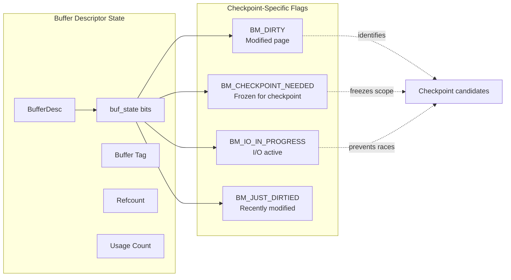
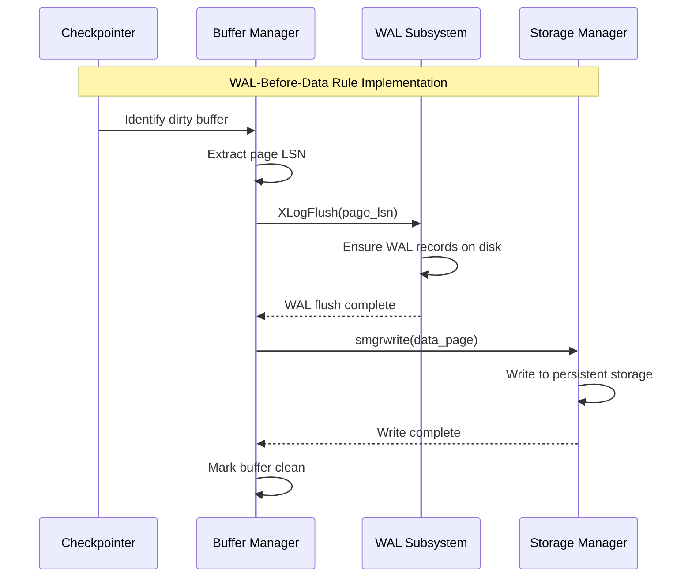
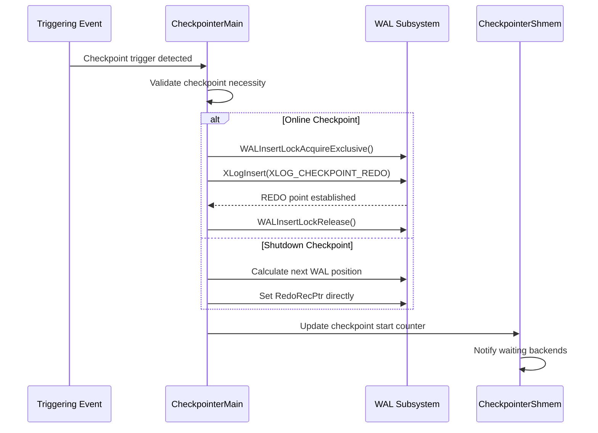
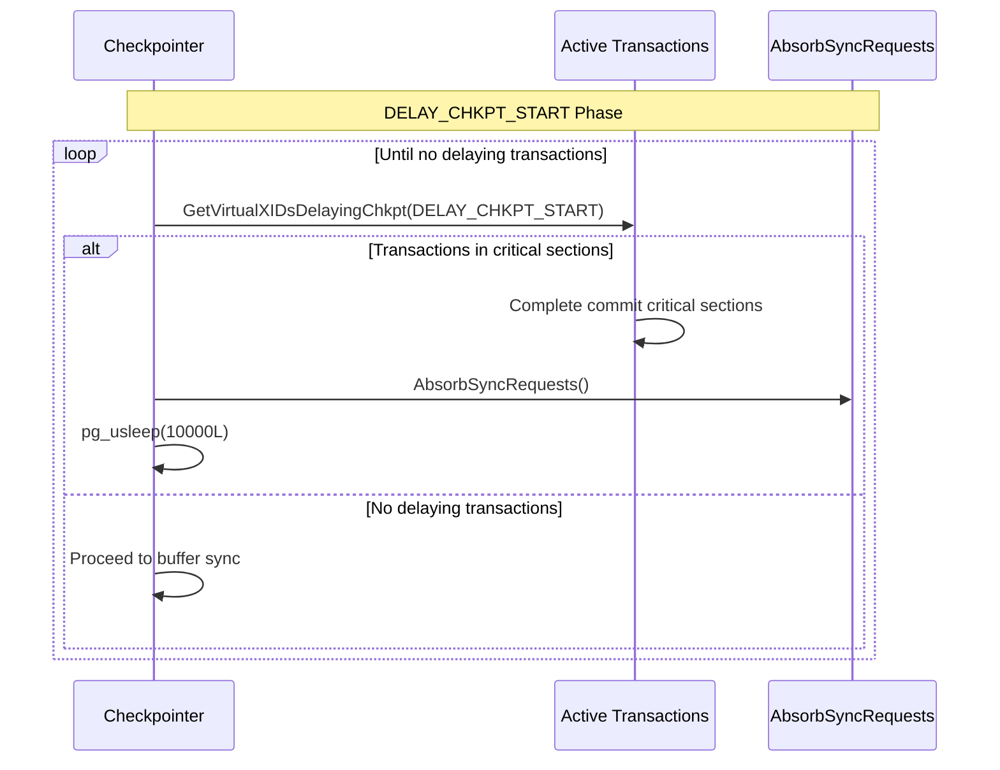
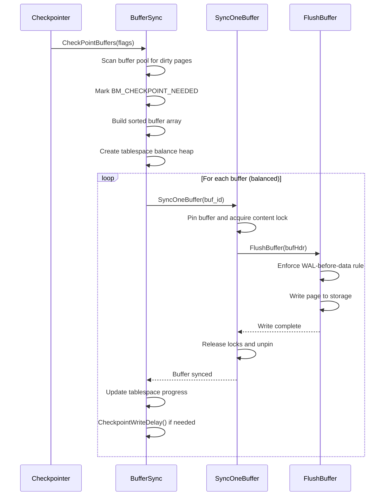
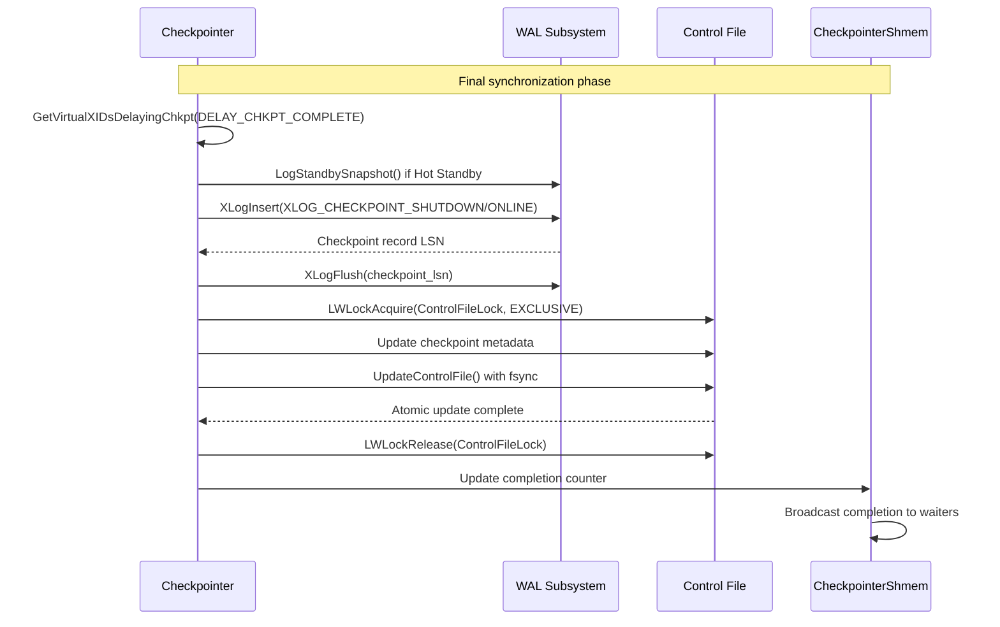
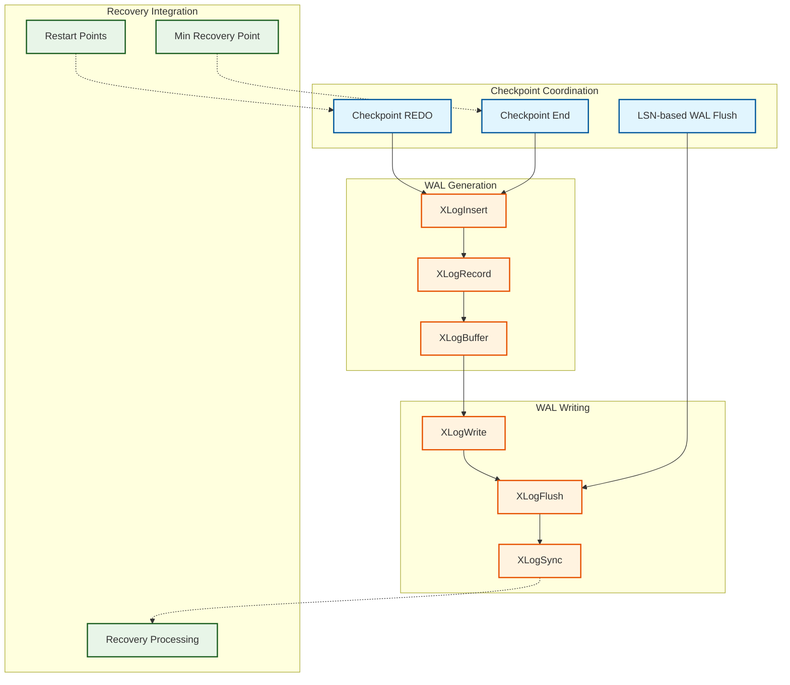
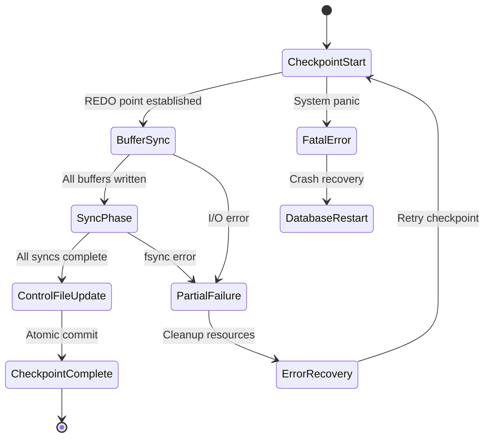

# PostgreSQL Checkpointing Architecture Overview

## System-Wide Perspective

The PostgreSQL checkpointing subsystem is a sophisticated multi-process coordination system that ensures database durability while maintaining high performance. This document provides a comprehensive architectural view of how checkpointing integrates with other PostgreSQL subsystems.

## High-Level Architecture

```mermaid
graph TB
    subgraph "PostgreSQL Process Architecture"
        PM[Postmaster<br/>Process Manager]
        CP[Checkpointer<br/>Background Process]
        BW[Background Writer<br/>Background Process]
        WW[WAL Writer<br/>Background Process]
        BE[Backend Processes<br/>User Sessions]
    end

    subgraph "Shared Memory Structures"
        SB[Shared Buffers<br/>Buffer Pool]
        CS[CheckpointerShmem<br/>Coordination Structure]
        WB[WAL Buffers<br/>WAL Write Cache]
        CF[Control File<br/>Metadata Storage]
    end

    subgraph "Storage Subsystems"
        DS[Data Storage<br/>Tablespaces]
        WS[WAL Storage<br/>WAL Segments]
        TS[Temporary Storage<br/>Work Files]
    end

    subgraph "Checkpoint Triggering"
        TT[Time-based Triggers<br/>checkpoint_timeout]
        WT[WAL-based Triggers<br/>max_wal_size]
        MT[Manual Triggers<br/>CHECKPOINT command]
        ST[Shutdown Triggers<br/>Smart/Fast shutdown]
    end

    %% Process interactions
    PM -->|spawns| CP
    PM -->|spawns| BW
    PM -->|spawns| WW
    PM -->|spawns| BE

    %% Checkpoint coordination
    BE -->|RequestCheckpoint| CS
    TT --> CP
    WT --> CP
    MT --> BE
    ST --> BE

    %% Shared memory access
    CP <--> SB
    BW <--> SB
    BE <--> SB
    CP <--> CS
    CP <--> WB
    WW <--> WB

    %% Storage operations
    CP --> DS
    CP --> WS
    CP --> CF
    BW --> DS
    WW --> WS
    BE --> DS
    BE --> WS

    classDef processNode fill:#e1f5fe,stroke:#01579b,stroke-width:2px
    classDef memoryNode fill:#e8f5e8,stroke:#1b5e20,stroke-width:2px
    classDef storageNode fill:#fff3e0,stroke:#e65100,stroke-width:2px
    classDef triggerNode fill:#f3e5f5,stroke:#4a148c,stroke-width:2px

    class PM,CP,BW,WW,BE processNode
    class SB,CS,WB,CF memoryNode
    class DS,WS,TS storageNode
    class TT,WT,MT,ST triggerNode
```



## Core Subsystem Integration

### 1. Process Architecture

#### Checkpointer Process (`CheckpointerMain`)
- **Purpose**: Dedicated background process for checkpoint scheduling and execution
- **Lifecycle**: Spawned by postmaster during cluster startup, runs until shutdown
- **Responsibilities**:
  - Checkpoint timing and trigger evaluation
  - Buffer pool synchronization coordination
  - WAL record insertion for checkpoint metadata
  - Control file atomic updates
  - Post-checkpoint cleanup (WAL segment management)

#### Background Writer Process (`BackgroundWriterMain`)
- **Purpose**: Continuous buffer cleaning to reduce checkpoint I/O spikes
- **Strategy**: LRU-based scanning with adaptive algorithms
- **Coordination**: Works independently but reduces checkpointer workload
- **Hibernation**: Energy-efficient mode during low-activity periods

#### WAL Writer Process
- **Purpose**: Asynchronous WAL buffer flushing
- **Integration**: Coordinates with checkpointer for WAL-before-data rule
- **Independence**: Operates on separate schedule from checkpoint timing

### 2. Shared Memory Architecture

#### CheckpointerShmem Structure
```c
typedef struct CheckpointerShmemStruct {
    pid_t           checkpointer_pid;      // Process identification
    slock_t         ckpt_lck;             // Spinlock for coordination

    int             ckpt_flags;           // Pending checkpoint flags
    int             ckpt_started;         // Checkpoint start counter
    int             ckpt_done;            // Checkpoint completion counter
    int             ckpt_failed;          // Checkpoint failure counter

    ConditionVariable start_cv;          // Start coordination
    ConditionVariable done_cv;           // Completion notification

    uint32          num_backend_writes;   // Backend-triggered writes
    uint32          num_backend_fsync;    // Backend-triggered fsyncs
} CheckpointerShmemStruct;
```

**Coordination Patterns**:
- **Lock-free counters** for checkpoint lifecycle tracking
- **Condition variables** for efficient process synchronization
- **Spinlocks** for atomic flag updates

#### Buffer Pool Integration


### 3. Storage Layer Integration

#### Data Page Coordination


#### Control File Management
The control file serves as the single point of truth for checkpoint state:

```c
typedef struct ControlFileData {
    uint64          system_identifier;
    uint32          pg_control_version;
    uint32          catalog_version_no;
    DBState         state;                    // Database state

    XLogRecPtr      checkPoint;              // Latest checkpoint record
    CheckPoint      checkPointCopy;          // Checkpoint record copy
    XLogRecPtr      minRecoveryPoint;        // Minimum recovery point
    TimeLineID      minRecoveryPointTLI;     // Timeline ID

    XLogRecPtr      backupStartPoint;        // Backup start location
    XLogRecPtr      backupEndPoint;          // Backup end location
    bool            backupEndRequired;       // Backup end required flag

    int             MaxConnections;          // Configuration parameters
    int             max_worker_processes;
    int             max_wal_senders;
    int             max_prepared_xacts;
    int             max_locks_per_xact;
    bool            track_commit_timestamp;
    uint32          maxAlign;
    double          floatFormat;
    uint32          blcksz;
    uint32          relseg_size;
    uint32          xlog_blcksz;
    uint32          xlog_seg_size;
    uint32          nameDataLen;
    uint32          indexMaxKeys;
    uint32          toast_max_chunk_size;
    uint32          loblksize;
    bool            float8ByVal;
    bool            data_checksum_version;

    char            mock_authentication_nonce[MOCK_AUTH_NONCE_LEN];

    uint32          crc;                     // CRC for validation
} ControlFileData;
```

## Checkpoint Execution Flow

### Phase 1: Initialization and REDO Point Establishment



### Phase 2: Transaction Synchronization



### Phase 3: Buffer Pool Synchronization



### Phase 4: Completion and Control File Update



## Performance and Scalability Characteristics

### Computational Complexity

| Operation | Time Complexity | Space Complexity | Notes |
|-----------|----------------|------------------|-------|
| **Buffer Pool Scan** | O(N) | O(D) | N = total buffers, D = dirty buffers |
| **Buffer Sorting** | O(D log D) | O(D) | Optimizes I/O patterns |
| **Tablespace Balancing** | O(D log T) | O(T) | T = tablespace count |
| **WAL Coordination** | O(log W) | O(1) | W = concurrent WAL insertions |
| **Control File Update** | O(1) | O(1) | Single atomic write |

### Scalability Bottlenecks

1. **I/O Subsystem Bandwidth**: Primary limiting factor for large buffer pools
2. **WAL Flush Serialization**: Single-threaded WAL writing limits concurrency
3. **Control File Lock**: Brief but exclusive lock during checkpoint completion
4. **Buffer Content Locks**: Fine-grained but can accumulate under high concurrency

### Memory Efficiency

```c
// Checkpoint memory allocation patterns
CkptSortItem *CkptBufferIds = palloc(NBuffers * sizeof(CkptSortItem));
CkptTsStatus *per_ts_stat = palloc(num_tablespaces * sizeof(CkptTsStatus));
BinaryHeap *ts_heap = binaryheap_allocate(num_tablespaces, comparator, NULL);
```

**Memory Requirements**:
- **Base overhead**: ~24 bytes per buffer descriptor
- **Checkpoint array**: 20 bytes per dirty buffer
- **Tablespace tracking**: 32 bytes per tablespace
- **Peak allocation**: During buffer sorting phase

## Integration with PostgreSQL Subsystems

### WAL Subsystem Coordination



### Transaction Manager Integration

The checkpointing subsystem coordinates with the transaction manager to ensure consistency:

1. **Virtual Transaction ID Tracking**: Prevents commit races during checkpoints
2. **Lock Manager Coordination**: Ensures predicate locks are checkpointed
3. **Two-Phase Commit Handling**: Coordinates with prepared transaction state
4. **MVCC Snapshot Management**: Logs transaction snapshots for Hot Standby

### Statistics and Monitoring Integration

```c
// Statistics structure for monitoring
typedef struct PgStat_CheckpointerStats {
    PgStat_Counter checkpoints_timed;    // Time-triggered checkpoints
    PgStat_Counter checkpoints_req;      // Requested checkpoints
    PgStat_Counter buffers_written;      // Buffers written by checkpointer

    double         checkpoint_write_time; // Time spent writing buffers
    double         checkpoint_sync_time;  // Time spent in sync phase
} PgStat_CheckpointerStats;
```

## Error Handling and Recovery

### Checkpoint Failure Recovery



### Consistency Guarantees

1. **Atomic Checkpoint Commitment**: Control file update commits entire checkpoint
2. **Partial Failure Handling**: Incomplete checkpoints are detected and retried
3. **WAL-Before-Data Enforcement**: Prevents torn page reads during recovery
4. **Transaction Barrier Coordination**: Eliminates commit race conditions

## Future Architecture Evolution

### Planned Enhancements

1. **Incremental Checkpointing**: Reduce full checkpoint overhead through change tracking
2. **Parallel Buffer Writing**: Utilize multiple I/O threads for large buffer pools
3. **Cloud Storage Integration**: Optimize for object storage characteristics
4. **NVRAM Integration**: Leverage persistent memory for checkpoint acceleration

### Compatibility Considerations

The checkpointing architecture maintains backward compatibility through:
- **Control file version management**: Allows upgrade/downgrade scenarios
- **WAL record compatibility**: Ensures recovery across versions
- **Configuration parameter stability**: Preserves tuning investments

---

*This architecture overview provides the foundation for understanding PostgreSQL's checkpointing subsystem. For detailed implementation information, see the [Core Components](core_components/README.md) documentation.*