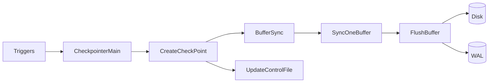

# PostgreSQL Checkpointing Quick Reference

*This is a 2-page summary for experienced developers. For complete documentation, see [index.md](index.md).*

## Key Concepts at a Glance

| Concept | Purpose | Key Functions |
|---------|---------|---------------|
| **Checkpoint Control** | Process management and scheduling | `CheckpointerMain`, `RequestCheckpoint` |
| **Buffer Synchronization** | Write dirty pages to disk | `BufferSync`, `SyncOneBuffer`, `FlushBuffer` |
| **WAL Coordination** | Enforce WAL-before-data rule | `XLogFlush`, `LogCheckpointStart/End` |
| **I/O Throttling** | Spread checkpoint load over time | `CheckpointWriteDelay`, `IsCheckpointOnSchedule` |

## Core Process Flow

```
Trigger → CheckpointerMain → CreateCheckPoint → CheckPointGuts → BufferSync → SyncOneBuffer → FlushBuffer
```

### Critical Path Functions

1. **`CheckpointerMain`** - Main checkpoint process loop
2. **`CreateCheckPoint`** - Core checkpoint execution
3. **`BufferSync`** - Scan and write dirty buffers
4. **`FlushBuffer`** - WAL-before-data + disk write
5. **`UpdateControlFile`** - Atomic checkpoint commit

## Architecture Overview



## Key Data Structures

### CheckpointerShmem (Process coordination)
```c
typedef struct CheckpointerShmemStruct {
    int ckpt_flags;           // Pending checkpoint flags
    int ckpt_started;         // Start sequence number
    int ckpt_done;           // Completion sequence number
    ConditionVariable done_cv; // Completion notification
} CheckpointerShmemStruct;
```

### CkptSortItem (I/O optimization)
```c
typedef struct CkptSortItem {
    int buf_id;              // Buffer pool index
    Oid tsId;               // Tablespace (for I/O balancing)
    RelFileNumber relNumber; // Relation (for sequential I/O)
    BlockNumber blockNum;    // Block (for sequential I/O)
} CkptSortItem;
```

## Critical Configuration Parameters

| Parameter | Default | Purpose | Tuning Guidelines |
|-----------|---------|---------|-------------------|
| `checkpoint_timeout` | 300s | Time-based trigger | Increase for fewer checkpoints |
| `max_wal_size` | 1GB | WAL volume trigger | Increase to prevent WAL-based storms |
| `checkpoint_completion_target` | 0.9 | I/O spreading factor | 0.8-0.95 for most workloads |
| `bgwriter_delay` | 200ms | Background cleaner cycle | Lower = more aggressive cleaning |
| `checkpoint_flush_after` | 256kB | OS writeback threshold | Higher for better batching |

## Buffer State Flags (Critical for Understanding)

| Flag | Purpose | Set When | Cleared When |
|------|---------|----------|-------------|
| `BM_DIRTY` | Page modified | Write operation | Buffer written to disk |
| `BM_CHECKPOINT_NEEDED` | Frozen for checkpoint | BufferSync scan | Checkpoint completion |
| `BM_IO_IN_PROGRESS` | I/O operation active | StartBufferIO | TerminateBufferIO |
| `BM_PERMANENT` | Requires WAL flush | Buffer creation | Never (relation property) |

## Checkpoint Triggers

| Trigger Type | Condition | Flag Set | Priority |
|--------------|-----------|----------|----------|
| **Time-based** | `elapsed_time >= checkpoint_timeout` | `CHECKPOINT_CAUSE_TIME` | Normal |
| **WAL-based** | `WAL_size >= max_wal_size` | `CHECKPOINT_CAUSE_XLOG` | High |
| **Manual** | `CHECKPOINT` command | `CHECKPOINT_REQUESTED` | Immediate |
| **Shutdown** | Database shutdown | `CHECKPOINT_IS_SHUTDOWN` | Critical |

## Performance Bottlenecks and Solutions

### Problem: Checkpoint I/O Spikes
**Symptoms**: Periodic performance degradation
**Root Cause**: Too much dirty data written at once
**Solutions**:
```postgresql
-- Increase I/O spreading
ALTER SYSTEM SET checkpoint_completion_target = 0.95;
-- More aggressive background writer
ALTER SYSTEM SET bgwriter_lru_maxpages = 200;
ALTER SYSTEM SET bgwriter_delay = 100;
```

### Problem: Checkpoint Storms
**Symptoms**: "checkpoints occurring too frequently" warnings
**Root Cause**: WAL generation exceeds max_wal_size before timeout
**Solutions**:
```postgresql
-- Increase WAL threshold
ALTER SYSTEM SET max_wal_size = '4GB';
-- Extend time interval
ALTER SYSTEM SET checkpoint_timeout = 900; -- 15 minutes
```

### Problem: Long Recovery Times
**Symptoms**: Slow startup after crashes
**Root Cause**: Infrequent checkpoints allow large WAL accumulation
**Solutions**:
```postgresql
-- More frequent checkpoints
ALTER SYSTEM SET checkpoint_timeout = 300; -- 5 minutes
ALTER SYSTEM SET max_wal_size = '2GB';
```

## WAL-Before-Data Rule Implementation

**Core Principle**: WAL records must be on disk before corresponding data pages

```c
// In FlushBuffer()
buf_state = LockBufHdr(buf);
recptr = BufferGetLSN(buf);  // Get page's WAL requirement
UnlockBufHdr(buf, buf_state);

if (buf_state & BM_PERMANENT)
    XLogFlush(recptr);  // Ensure WAL is flushed first

// Only now write the data page
smgrwrite(reln, fork, block, bufToWrite, false);
```

## I/O Optimization Strategies

### Tablespace Balancing
```c
// Maintains proportional progress across tablespaces
ts_stat->progress_slice = (float8) total_buffers / ts_buffers;
// Always select tablespace with least progress
min_progress_ts = binaryheap_first(ts_heap);
```

### Buffer Sorting Order
1. **Tablespace** (distribute across devices)
2. **Relation** (sequential within tablespace)
3. **Fork** (main, FSM, VM)
4. **Block** (sequential within relation)

## Monitoring and Diagnostics

### Key Statistics Query
```sql
SELECT
    checkpoints_timed,        -- Time-triggered (good)
    checkpoints_req,          -- WAL/manual triggered (minimize)
    checkpoint_write_time,    -- Time spent writing buffers
    checkpoint_sync_time,     -- Time spent in fsync phase
    buffers_checkpoint,       -- Buffers written by checkpointer
    buffers_clean,           -- Buffers written by bgwriter
    buffers_backend,         -- Buffers written by backends (bad)
    maxwritten_clean         -- Bgwriter stopped due to limit
FROM pg_stat_bgwriter;
```

### Health Indicators
- **checkpoints_req/checkpoints_timed < 0.1**: Good scheduling
- **buffers_clean > buffers_checkpoint**: Background writer effective
- **buffers_backend ≈ 0**: Backends not doing checkpoint work
- **checkpoint_write_time < checkpoint_sync_time**: Good I/O spreading

## Common Code Patterns

### Requesting a Checkpoint
```c
// Asynchronous request
RequestCheckpoint(CHECKPOINT_CAUSE_XLOG);

// Synchronous request (wait for completion)
RequestCheckpoint(CHECKPOINT_WAIT | CHECKPOINT_FORCE);

// Shutdown checkpoint
RequestCheckpoint(CHECKPOINT_IS_SHUTDOWN | CHECKPOINT_IMMEDIATE | CHECKPOINT_WAIT);
```

### Error Handling Pattern
```c
PG_TRY();
{
    // Checkpoint operations
    StartBufferIO(buf, false, false);
    // ... I/O operations ...
    TerminateBufferIO(buf, true, 0, true);
}
PG_CATCH();
{
    // Cleanup on failure
    TerminateBufferIO(buf, false, 0, true);
    PG_RE_THROW();
}
PG_END_TRY();
```

## Workload-Specific Tuning

### OLTP Workloads
```postgresql
-- Frequent small checkpoints
ALTER SYSTEM SET checkpoint_timeout = 300;
ALTER SYSTEM SET checkpoint_completion_target = 0.9;
ALTER SYSTEM SET max_wal_size = '2GB';
```

### Batch/ETL Workloads
```postgresql
-- Less frequent large checkpoints
ALTER SYSTEM SET checkpoint_timeout = 900;
ALTER SYSTEM SET max_wal_size = '8GB';
ALTER SYSTEM SET checkpoint_completion_target = 0.95;
```

### Read-Heavy Workloads
```postgresql
-- Minimal checkpoint overhead
ALTER SYSTEM SET bgwriter_delay = 100;
ALTER SYSTEM SET bgwriter_lru_maxpages = 50;
```

## Integration Points

| Subsystem | Integration | Key Functions |
|-----------|-------------|---------------|
| **WAL** | REDO points, WAL-before-data | `XLogFlush`, `LogCheckpointStart` |
| **Buffer Manager** | Dirty buffer tracking | `GetBufferDescriptor`, `LockBufHdr` |
| **Storage Manager** | Actual I/O operations | `smgrwrite`, `smgropen` |
| **Transaction Manager** | Commit coordination | `GetVirtualXIDsDelayingChkpt` |
| **Statistics** | Performance monitoring | `pgstat_report_checkpointer` |

---

**For complete details**: See full documentation at [checkpointing_documentation/index.md](index.md)

**Common Issues**: [Troubleshooting Guide](performance_tuning.md#troubleshooting-performance-issues)

**API Reference**: [Function Signatures](checkpointing_api_reference.md)