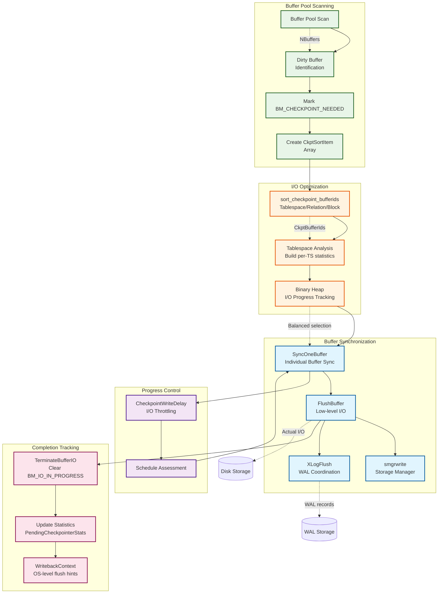
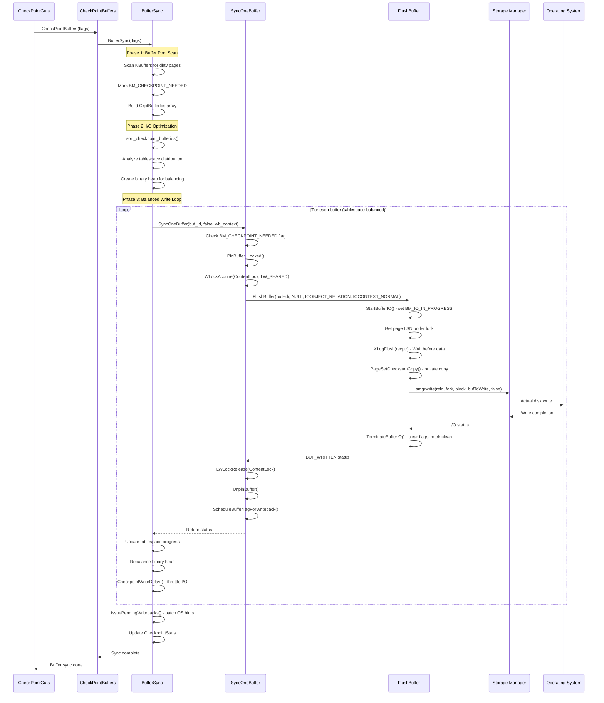
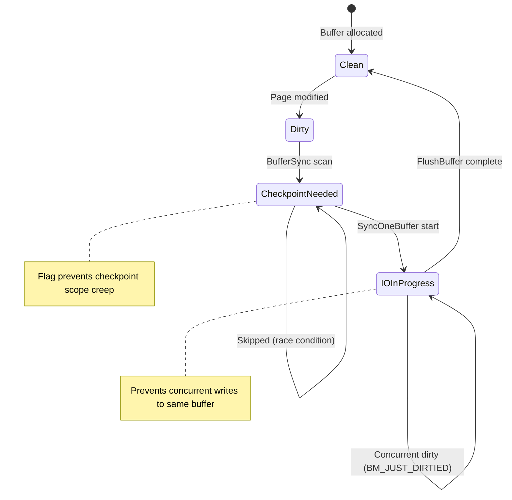

# Buffer Flushing Subsystem

## Overview

The buffer flushing subsystem is responsible for writing dirty buffers from shared memory to persistent storage during checkpoints. It implements sophisticated I/O scheduling algorithms to balance performance with consistency requirements, ensuring all dirty pages reach disk while minimizing system impact through intelligent ordering and throttling mechanisms.

## Key Concepts

- **Dirty Buffer Management**: Tracking and identification of modified pages requiring write-out
- **Tablespace I/O Balancing**: Distributing writes across multiple tablespaces to optimize hardware utilization
- **WAL-Before-Data Rule**: Ensuring WAL records hit disk before corresponding data pages
- **Checkpoint-Specific Marking**: Using BM_CHECKPOINT_NEEDED flag to freeze dirty buffer set
- **I/O Scheduling**: Sophisticated algorithms for optimal disk access patterns

## Architecture



## Core APIs

### BufferSync

#### Purpose
Primary function for checkpoint buffer synchronization. Implements a sophisticated two-phase algorithm: first scanning the entire buffer pool to identify dirty pages, then writing them out in optimized order with tablespace balancing.

#### Signature
```c
static void BufferSync(int flags);
```

#### Parameters
| Parameter | Type | Description | Constraints |
|-----------|------|-------------|-------------|
| flags | int | Checkpoint control flags determining write behavior | Bitwise OR of CHECKPOINT_* flags |

#### Detailed Implementation Flow

1. **Buffer Scanning Phase**:
   ```c
   // Determine which buffers to write
   int mask = BM_DIRTY;
   if (!(flags & (CHECKPOINT_IS_SHUTDOWN | CHECKPOINT_END_OF_RECOVERY | CHECKPOINT_FLUSH_ALL)))
       mask |= BM_PERMANENT;

   // Scan all buffers
   for (buf_id = 0; buf_id < NBuffers; buf_id++) {
       BufferDesc *bufHdr = GetBufferDescriptor(buf_id);
       buf_state = LockBufHdr(bufHdr);

       if ((buf_state & mask) == mask) {
           buf_state |= BM_CHECKPOINT_NEEDED;
           // Add to CkptBufferIds array
           item = &CkptBufferIds[num_to_scan++];
           item->buf_id = buf_id;
           item->tsId = bufHdr->tag.spcOid;
           item->relNumber = BufTagGetRelNumber(&bufHdr->tag);
           item->forkNum = BufTagGetForkNum(&bufHdr->tag);
           item->blockNum = bufHdr->tag.blockNum;
       }
       UnlockBufHdr(bufHdr, buf_state);
   }
   ```

2. **I/O Optimization Phase**:
   ```c
   // Sort for optimal I/O patterns
   sort_checkpoint_bufferids(CkptBufferIds, num_to_scan);

   // Build per-tablespace statistics
   for (i = 0; i < num_to_scan; i++) {
       if (last_tsid != CkptBufferIds[i].tsId) {
           // New tablespace encountered
           num_spaces++;
           per_ts_stat = repalloc(per_ts_stat, sizeof(CkptTsStatus) * num_spaces);
           s = &per_ts_stat[num_spaces - 1];
           s->tsId = CkptBufferIds[i].tsId;
           s->index = i;
       }
       s->num_to_scan++;
   }
   ```

3. **Tablespace Balancing Setup**:
   ```c
   // Create min-heap for balanced I/O
   ts_heap = binaryheap_allocate(num_spaces, ts_ckpt_progress_comparator, NULL);

   for (i = 0; i < num_spaces; i++) {
       CkptTsStatus *ts_stat = &per_ts_stat[i];
       ts_stat->progress_slice = (float8) num_to_scan / ts_stat->num_to_scan;
       binaryheap_add_unordered(ts_heap, PointerGetDatum(ts_stat));
   }
   binaryheap_build(ts_heap);
   ```

4. **Balanced Write Execution**:
   ```c
   while (!binaryheap_empty(ts_heap)) {
       // Get next tablespace to write from
       CkptTsStatus *ts_stat = (CkptTsStatus *) DatumGetPointer(binaryheap_first(ts_heap));
       buf_id = CkptBufferIds[ts_stat->index].buf_id;
       bufHdr = GetBufferDescriptor(buf_id);

       // Check if buffer still needs writing
       if (pg_atomic_read_u32(&bufHdr->state) & BM_CHECKPOINT_NEEDED) {
           if (SyncOneBuffer(buf_id, false, &wb_context) & BUF_WRITTEN) {
               PendingCheckpointerStats.buffers_written++;
               num_written++;
           }
       }

       // Update progress and rebalance heap
       ts_stat->progress += ts_stat->progress_slice;
       ts_stat->index++;

       if (ts_stat->num_scanned == ts_stat->num_to_scan)
           binaryheap_remove_first(ts_heap);
       else
           binaryheap_replace_first(ts_heap, PointerGetDatum(ts_stat));

       // Throttle I/O rate
       CheckpointWriteDelay(flags, (double) num_processed / num_to_scan);
   }
   ```

#### Integration Points
- **Called by**: CheckPointBuffers (checkpoint wrapper)
- **Calls**: SyncOneBuffer, CheckpointWriteDelay, sort_checkpoint_bufferids
- **Shared state**: CkptBufferIds array, PendingCheckpointerStats

#### Performance Characteristics
- **Complexity**: O(N log T) where N = buffer count, T = tablespace count
- **Memory**: Linear in number of dirty buffers for sorting array
- **I/O Pattern**: Optimized for sequential access within tablespaces
- **Throttling**: Adaptive rate control based on checkpoint_completion_target

### SyncOneBuffer

#### Purpose
Synchronizes a single buffer to disk with appropriate locking and error handling. Serves as the core primitive for both checkpoint and background writer buffer flushing operations.

#### Signature
```c
static int SyncOneBuffer(int buf_id, bool skip_recently_used, WritebackContext *wb_context);
```

#### Parameters
| Parameter | Type | Description | Constraints |
|-----------|------|-------------|-------------|
| buf_id | int | Buffer identifier in shared buffer pool | 0 <= buf_id < NBuffers |
| skip_recently_used | bool | Skip buffers with high usage count | Used by background writer |
| wb_context | WritebackContext* | Writeback scheduling context | Non-NULL for batch operations |

#### Return Value
Bitmask containing:
- **BUF_WRITTEN**: Buffer was successfully written to disk
- **BUF_REUSABLE**: Buffer is available for immediate replacement (pin count 0, usage count 0)

#### Detailed Implementation Logic

1. **Buffer State Examination**:
   ```c
   BufferDesc *bufHdr = GetBufferDescriptor(buf_id);

   // Prepare for potential buffer pin
   ReservePrivateRefCountEntry();
   ResourceOwnerEnlarge(CurrentResourceOwner);

   // Check buffer state under lock
   buf_state = LockBufHdr(bufHdr);

   // Determine reusability
   if (BUF_STATE_GET_REFCOUNT(buf_state) == 0 &&
       BUF_STATE_GET_USAGECOUNT(buf_state) == 0) {
       result |= BUF_REUSABLE;
   }
   ```

2. **Skip Logic for Background Writer**:
   ```c
   if (skip_recently_used &&
       (BUF_STATE_GET_REFCOUNT(buf_state) > 0 || BUF_STATE_GET_USAGECOUNT(buf_state) > 0)) {
       UnlockBufHdr(bufHdr, buf_state);
       return result;  // Skip this buffer
   }
   ```

3. **Dirty/Valid State Check**:
   ```c
   if (!(buf_state & BM_VALID) || !(buf_state & BM_DIRTY)) {
       // Buffer is clean or invalid, nothing to do
       UnlockBufHdr(bufHdr, buf_state);
       return result;
   }
   ```

4. **Buffer Flushing Sequence**:
   ```c
   // Pin buffer to prevent replacement
   PinBuffer_Locked(bufHdr);

   // Acquire content lock for read consistency
   LWLockAcquire(BufferDescriptorGetContentLock(bufHdr), LW_SHARED);

   // Perform actual flush
   FlushBuffer(bufHdr, NULL, IOOBJECT_RELATION, IOCONTEXT_NORMAL);

   // Release locks and unpin
   LWLockRelease(BufferDescriptorGetContentLock(bufHdr));
   tag = bufHdr->tag;  // Save tag before unpinning
   UnpinBuffer(bufHdr);

   // Schedule writeback hint for OS
   ScheduleBufferTagForWriteback(wb_context, IOCONTEXT_NORMAL, &tag);
   ```

#### Concurrency Considerations
- Buffer header lock protects state examination
- Content lock ensures page consistency during I/O
- Pin prevents buffer replacement during flush operation
- Race conditions handled gracefully (dirty bit may be cleared by other processes)

#### Integration Points
- **Called by**: BufferSync, BgBufferSync
- **Calls**: FlushBuffer, ScheduleBufferTagForWriteback
- **Shared state**: Buffer descriptor state, writeback context

### FlushBuffer

#### Purpose
Low-level buffer flushing function that handles WAL coordination, checksum calculation, and actual disk I/O. Implements the critical WAL-before-data consistency rule.

#### Signature
```c
static void FlushBuffer(BufferDesc *buf, SMgrRelation reln, IOObject io_object, IOContext io_context);
```

#### Parameters
| Parameter | Type | Description | Constraints |
|-----------|------|-------------|-------------|
| buf | BufferDesc* | Buffer descriptor to flush | Must be pinned and locked |
| reln | SMgrRelation | Storage manager relation handle | NULL to open automatically |
| io_object | IOObject | I/O object type for statistics | IOOBJECT_RELATION for data pages |
| io_context | IOContext | I/O context for performance tracking | IOCONTEXT_NORMAL for checkpoints |

#### Critical Implementation Details

1. **I/O Operation Initiation**:
   ```c
   // Start I/O operation (sets BM_IO_IN_PROGRESS)
   if (!StartBufferIO(buf, false, false))
       return;  // Someone else flushed it

   // Setup error context for debugging
   errcallback.callback = shared_buffer_write_error_callback;
   errcallback.arg = (void *) buf;
   error_context_stack = &errcallback;
   ```

2. **Storage Manager Resolution**:
   ```c
   if (reln == NULL)
       reln = smgropen(BufTagGetRelFileLocator(&buf->tag), INVALID_PROC_NUMBER);
   ```

3. **WAL-Before-Data Enforcement**:
   ```c
   // Get page LSN under buffer header lock
   buf_state = LockBufHdr(buf);
   recptr = BufferGetLSN(buf);
   buf_state &= ~BM_JUST_DIRTIED;  // Clear concurrent dirty flag
   UnlockBufHdr(buf, buf_state);

   // Enforce WAL-before-data rule for permanent relations
   if (buf_state & BM_PERMANENT)
       XLogFlush(recptr);
   ```

4. **Checksum and Write Operation**:
   ```c
   bufBlock = BufHdrGetBlock(buf);

   // Calculate checksum on private copy to handle concurrent hint bit updates
   bufToWrite = PageSetChecksumCopy((Page) bufBlock, buf->tag.blockNum);

   // Perform actual write
   io_start = pgstat_prepare_io_time(track_io_timing);
   smgrwrite(reln,
             BufTagGetForkNum(&buf->tag),
             buf->tag.blockNum,
             bufToWrite,
             false);

   // Update I/O statistics
   pgstat_count_io_op_time(IOOBJECT_RELATION, io_context, IOOP_WRITE, io_start, 1);
   pgBufferUsage.shared_blks_written++;
   ```

5. **I/O Completion**:
   ```c
   // Mark buffer clean and end I/O operation
   TerminateBufferIO(buf, true, 0, true);
   ```

#### WAL Coordination Details
The WAL-before-data rule implementation:
- Obtains page LSN while holding buffer header lock
- Flushes WAL up to that LSN before writing data
- Handles unlogged relations specially (skip WAL flush)
- Prevents torn page reads during crash recovery

#### Error Handling
- Comprehensive error context for crash debugging
- Automatic I/O cleanup on exception
- Proper resource release in all code paths

#### Performance Optimizations
- Checksum calculation on private copy allows concurrent hint bit updates
- I/O timing statistics for performance monitoring
- Efficient storage manager caching

## Data Structures

### CkptSortItem
```c
typedef struct CkptSortItem {
    int         buf_id;      // Buffer pool index
    Oid         tsId;        // Tablespace OID
    RelFileNumber relNumber; // Relation file number
    ForkNumber  forkNum;     // Fork number (main, fsm, vm)
    BlockNumber blockNum;    // Block number within relation
} CkptSortItem;
```

**Purpose**: Sorting key for optimal I/O ordering during checkpoint buffer writes.

**Sort Order**: Tablespace → Relation → Fork → Block (promotes sequential I/O)

### CkptTsStatus
```c
typedef struct CkptTsStatus {
    Oid         tsId;           // Tablespace identifier
    int         num_to_scan;    // Total buffers in this tablespace
    int         num_scanned;    // Buffers processed so far
    int         index;          // Current position in CkptBufferIds
    float8      progress_slice; // Progress increment per buffer
    float8      progress;       // Current progress score
} CkptTsStatus;
```

**Purpose**: Per-tablespace progress tracking for balanced I/O scheduling.

**Algorithm**: Maintains proportional progress across tablespaces to prevent I/O hotspots.

### WritebackContext
```c
typedef struct WritebackContext {
    int         max_pending;     // Maximum pending writebacks
    int         nr_pending;      // Current pending count
    WritebackRequest pending[WRITEBACK_MAX_PENDING_FLUSHES];
} WritebackContext;
```

**Purpose**: Batches writeback hints to the operating system for efficient I/O scheduling.

## Processing Flow



## Buffer State Management

### Buffer State Flags
- **BM_DIRTY**: Page has been modified and needs write-out
- **BM_CHECKPOINT_NEEDED**: Marked for current checkpoint (prevents new dirty pages from expanding checkpoint scope)
- **BM_IO_IN_PROGRESS**: I/O operation currently active (prevents concurrent writes)
- **BM_JUST_DIRTIED**: Recently dirtied (used for concurrent dirty detection)
- **BM_PERMANENT**: Permanent relation (requires WAL flush before write)

### State Transitions


## Performance Optimizations

### Tablespace I/O Balancing
The sophisticated tablespace balancing algorithm prevents I/O hotspots:

1. **Progress Tracking**: Each tablespace gets a progress score proportional to buffer count
2. **Min-Heap Selection**: Always choose tablespace with least progress for next write
3. **Proportional Advancement**: Progress increments by `total_buffers / tablespace_buffers`

```c
// Progress calculation example
ts_stat->progress_slice = (float8) num_to_scan / ts_stat->num_to_scan;

// Selection algorithm
while (!binaryheap_empty(ts_heap)) {
    ts_stat = (CkptTsStatus *) DatumGetPointer(binaryheap_first(ts_heap));
    // Write next buffer from this tablespace
    // Update progress and rebalance
    ts_stat->progress += ts_stat->progress_slice;
    binaryheap_replace_first(ts_heap, PointerGetDatum(ts_stat));
}
```

### Sorting Optimization
Buffer sorting promotes sequential I/O patterns:
- **Primary**: Tablespace (distribute across devices)
- **Secondary**: Relation number (locality within tablespace)
- **Tertiary**: Fork number (main, FSM, visibility map)
- **Quaternary**: Block number (sequential within relation)

### Writeback Integration
Operating system writeback hints optimize kernel I/O scheduling:
- Batched writeback requests reduce system call overhead
- OS-level write combining improves sequential I/O performance
- Configurable flush thresholds (`checkpoint_flush_after`)

### Checksum Optimization
Page checksum calculation uses private copy strategy:
- Allows concurrent hint bit updates during I/O
- Prevents checksum validation failures
- Maintains data integrity without excessive locking

## Integration with Other Subsystems

### WAL Subsystem
- **XLogFlush()**: Ensures WAL-before-data consistency rule
- **Page LSN**: Determines required WAL flush point
- **Unlogged Relations**: Special handling to avoid fake LSN issues

### Background Writer
- **Shared SyncOneBuffer()**: Common buffer flushing primitive
- **Different Selection**: Background writer uses LRU, checkpoint uses dirty set
- **Cooperation**: Background writer reduces checkpoint I/O burden

### Storage Manager
- **smgrwrite()**: Actual disk I/O interface
- **Relation Caching**: Efficient file handle management
- **Fork Management**: Handles main, FSM, and visibility map writes

### Statistics Subsystem
- **pgBufferUsage**: Global I/O counters
- **CheckpointStats**: Detailed checkpoint timing and volume metrics
- **I/O Timing**: Optional detailed I/O performance tracking

## Error Handling and Recovery

### I/O Error Handling
```c
// Error context setup
errcallback.callback = shared_buffer_write_error_callback;
errcallback.arg = (void *) buf;
error_context_stack = &errcallback;

// Automatic cleanup in all paths
PG_TRY();
    // I/O operations
PG_CATCH();
    TerminateBufferIO(buf, false, 0, true);  // Clean up on error
    PG_RE_THROW();
PG_END_TRY();
```

### Partial Checkpoint Recovery
- BM_CHECKPOINT_NEEDED flags remain set on failed buffers
- Next checkpoint attempt will retry failed buffers
- No checkpoint completion until all marked buffers are written

### Concurrent Modification Handling
- BM_JUST_DIRTIED flag detects concurrent page modifications
- Race conditions handled gracefully (extra writes are acceptable)
- Buffer content locks prevent mid-write modifications

## Configuration and Tuning

### Key Parameters
- **checkpoint_flush_after**: Writeback batching threshold
- **checkpoint_completion_target**: I/O spreading target percentage
- **track_io_timing**: Enable detailed I/O performance monitoring

### Performance Monitoring
- **pg_stat_checkpointer**: High-level checkpoint statistics
- **pg_stat_io**: Detailed I/O operation statistics
- **pg_stat_bgwriter**: Background writer coordination metrics

### Tuning Guidelines
- Increase `checkpoint_flush_after` for better OS write combining
- Adjust `checkpoint_completion_target` based on I/O capacity
- Monitor tablespace balance for optimal device utilization