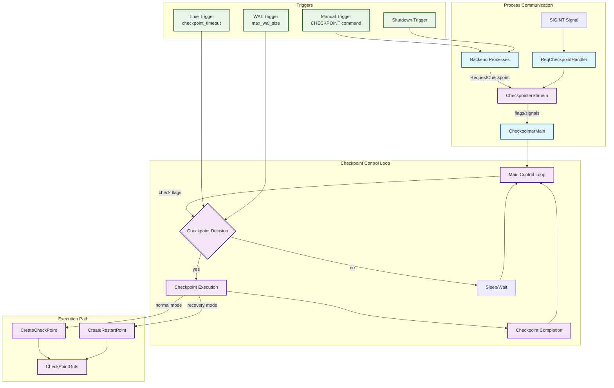
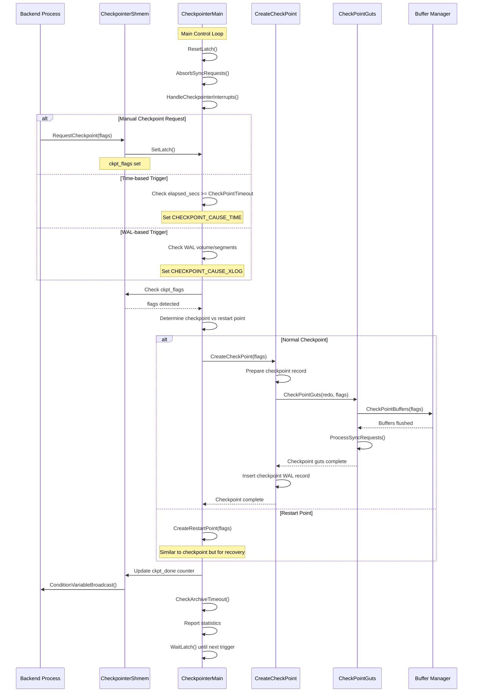

# Checkpoint Control Subsystem

## Overview

The checkpoint control subsystem manages the orchestration and scheduling of checkpoints in PostgreSQL. It coordinates between the checkpointer background process, backend processes requesting checkpoints, and the actual checkpoint execution logic. This subsystem ensures database consistency by forcing all dirty buffers to disk at regular intervals or upon specific triggers.

## Key Concepts

- **Checkpoint Process**: Dedicated background process (`CheckpointerMain`) that handles checkpoint scheduling and execution
- **Request Interface**: Mechanism (`RequestCheckpoint`) for backend processes to trigger checkpoints
- **Checkpoint Flags**: Control parameters that determine checkpoint behavior and urgency
- **Shared Memory Coordination**: Communication between processes via `CheckpointerShmem` structure
- **Signal Handling**: Interrupt-driven checkpoint triggering via SIGINT

## Architecture



## Core APIs

### CheckpointerMain

#### Purpose
Main entry point for the checkpointer background process. Manages the complete lifecycle of checkpoint scheduling, coordination, and execution.

#### Signature
```c
void CheckpointerMain(char *startup_data, size_t startup_data_len);
```

#### Detailed Description
CheckpointerMain operates as an infinite loop that:

1. **Initialization Phase**:
   - Sets up process type as `B_CHECKPOINTER`
   - Configures signal handlers for checkpoint requests and shutdown
   - Initializes memory context and error handling
   - Sets up shared memory coordination structures

2. **Main Control Loop**:
   - Absorbs sync requests to prevent queue overflow
   - Handles interrupts and signals
   - Evaluates checkpoint triggers (time-based, WAL-based, manual)
   - Executes checkpoints or restart points as appropriate
   - Reports statistics and manages archive timeouts

3. **Error Recovery**:
   - Implements robust error handling with setjmp/longjmp
   - Cleans up resources on checkpoint failure
   - Notifies waiting backends of checkpoint status

#### Key Internal Logic Flow

1. **Trigger Evaluation**:
   ```c
   // Check for pending checkpoint request
   if (CheckpointerShmem->ckpt_flags) {
       do_checkpoint = true;
       chkpt_or_rstpt_requested = true;
   }

   // Time-based checkpoint trigger
   elapsed_secs = now - last_checkpoint_time;
   if (elapsed_secs >= CheckPointTimeout) {
       do_checkpoint = true;
       flags |= CHECKPOINT_CAUSE_TIME;
   }
   ```

2. **Checkpoint Execution Decision**:
   ```c
   // Determine checkpoint vs restart point
   do_restartpoint = RecoveryInProgress();
   if (flags & CHECKPOINT_END_OF_RECOVERY)
       do_restartpoint = false;

   // Execute appropriate checkpoint type
   if (!do_restartpoint)
       CreateCheckPoint(flags);
   else
       ckpt_performed = CreateRestartPoint(flags);
   ```

3. **Completion Notification**:
   ```c
   // Update shared memory state
   SpinLockAcquire(&CheckpointerShmem->ckpt_lck);
   CheckpointerShmem->ckpt_done = CheckpointerShmem->ckpt_started;
   SpinLockRelease(&CheckpointerShmem->ckpt_lck);

   // Wake up waiting backends
   ConditionVariableBroadcast(&CheckpointerShmem->done_cv);
   ```

#### Integration Points
- **Called by**: AuxiliaryProcessMain during postmaster startup
- **Calls**: CreateCheckPoint, CreateRestartPoint, AbsorbSyncRequests
- **Shared state**: CheckpointerShmem structure for inter-process communication

#### Performance Characteristics
- Sleeps between checkpoints using WaitLatch for efficient CPU usage
- Balances checkpoint frequency with system load
- Adaptive timing based on WAL generation rate and configuration

### RequestCheckpoint

#### Purpose
Interface for backend processes to request checkpoints. Provides synchronous and asynchronous checkpoint initiation with various urgency levels.

#### Signature
```c
void RequestCheckpoint(int flags);
```

#### Parameters
| Parameter | Type | Description | Constraints |
|-----------|------|-------------|-------------|
| flags | int | Bitwise OR of checkpoint control flags | See flag definitions below |

#### Checkpoint Flags
- **CHECKPOINT_IS_SHUTDOWN**: Database shutdown checkpoint
- **CHECKPOINT_END_OF_RECOVERY**: End-of-recovery checkpoint
- **CHECKPOINT_IMMEDIATE**: Skip completion target, finish ASAP
- **CHECKPOINT_FORCE**: Force checkpoint even without WAL activity
- **CHECKPOINT_WAIT**: Wait for completion before returning
- **CHECKPOINT_CAUSE_XLOG**: Triggered by WAL volume

#### Internal Logic

1. **Standalone Backend Path**:
   ```c
   if (!IsPostmasterEnvironment) {
       CreateCheckPoint(flags | CHECKPOINT_IMMEDIATE);
       smgrdestroyall();
       return;
   }
   ```

2. **Shared Memory Request**:
   ```c
   SpinLockAcquire(&CheckpointerShmem->ckpt_lck);
   old_failed = CheckpointerShmem->ckpt_failed;
   old_started = CheckpointerShmem->ckpt_started;
   CheckpointerShmem->ckpt_flags |= (flags | CHECKPOINT_REQUESTED);
   SpinLockRelease(&CheckpointerShmem->ckpt_lck);
   ```

3. **Checkpointer Notification**:
   ```c
   SetLatch(&ProcGlobal->checkpointerLatch);
   ```

4. **Wait Logic** (if CHECKPOINT_WAIT specified):
   - Monitors ckpt_started counter to confirm request acknowledgment
   - Waits on condition variable for checkpoint completion
   - Handles timeout and error scenarios

#### Integration Points
- **Called by**: Backend processes, CHECKPOINT SQL command, shutdown procedures
- **Calls**: CreateCheckPoint (standalone mode), SetLatch
- **Shared state**: CheckpointerShmem for request queuing and status tracking

### CreateCheckPoint

#### Purpose
Core checkpoint execution function that coordinates buffer synchronization, WAL record insertion, and control file updates to create a consistent recovery point.

#### Signature
```c
void CreateCheckPoint(int flags);
```

#### Detailed Implementation Flow

1. **Preparation Phase**:
   ```c
   // Determine checkpoint type
   shutdown = (flags & (CHECKPOINT_IS_SHUTDOWN | CHECKPOINT_END_OF_RECOVERY));

   // Initialize statistics collection
   MemSet(&CheckpointStats, 0, sizeof(CheckpointStats));
   CheckpointStats.ckpt_start_t = GetCurrentTimestamp();

   // Prepare storage manager
   SyncPreCheckpoint();
   ```

2. **Critical Section Entry**:
   ```c
   START_CRIT_SECTION();

   // Update control file state for shutdown
   if (shutdown) {
       LWLockAcquire(ControlFileLock, LW_EXCLUSIVE);
       ControlFile->state = DB_SHUTDOWNING;
       UpdateControlFile();
       LWLockRelease(ControlFileLock);
   }
   ```

3. **WAL Record Preparation**:
   ```c
   // Initialize checkpoint record
   MemSet(&checkPoint, 0, sizeof(checkPoint));
   checkPoint.time = (pg_time_t) time(NULL);

   // Set transaction state for Hot Standby
   if (!shutdown && XLogStandbyInfoActive())
       checkPoint.oldestActiveXid = GetOldestActiveTransactionId();
   ```

4. **REDO Point Establishment**:
   - For shutdown checkpoints: Compute next XLOG record position
   - For online checkpoints: Insert XLOG_CHECKPOINT_REDO record

5. **Buffer and Transaction State Capture**:
   ```c
   // Capture current transaction IDs
   LWLockAcquire(XidGenLock, LW_SHARED);
   checkPoint.nextXid = TransamVariables->nextXid;
   checkPoint.oldestXid = TransamVariables->oldestXid;
   LWLockRelease(XidGenLock);
   ```

6. **Core Checkpoint Work**:
   ```c
   END_CRIT_SECTION();

   // Wait for commit critical sections
   vxids = GetVirtualXIDsDelayingChkpt(&nvxids, DELAY_CHKPT_START);
   while (HaveVirtualXIDsDelayingChkpt(vxids, nvxids, DELAY_CHKPT_START)) {
       AbsorbSyncRequests();
       pg_usleep(10000L);
   }

   // Execute main checkpoint work
   CheckPointGuts(checkPoint.redo, flags);
   ```

7. **WAL Record Completion**:
   ```c
   START_CRIT_SECTION();

   // Insert final checkpoint record
   XLogBeginInsert();
   XLogRegisterData((char *) (&checkPoint), sizeof(checkPoint));
   recptr = XLogInsert(RM_XLOG_ID,
                      shutdown ? XLOG_CHECKPOINT_SHUTDOWN : XLOG_CHECKPOINT_ONLINE);
   XLogFlush(recptr);
   ```

8. **Control File Update**:
   ```c
   // Update control file with new checkpoint
   LWLockAcquire(ControlFileLock, LW_EXCLUSIVE);
   if (shutdown)
       ControlFile->state = DB_SHUTDOWNED;
   ControlFile->checkPoint = ProcLastRecPtr;
   ControlFile->checkPointCopy = checkPoint;
   UpdateControlFile();
   LWLockRelease(ControlFileLock);
   ```

#### Error Handling
- Critical sections protect against system panic during essential operations
- Cleanup procedures handle partial checkpoint failures
- Transaction delay handling prevents consistency violations

#### Performance Considerations
- Strategic critical section placement minimizes lock contention
- Parallel execution with ongoing transactions where safe
- I/O throttling integration for system load management

### CheckPointGuts

#### Purpose
Shared implementation for both regular checkpoints and restart points. Orchestrates the flushing of all dirty data structures and performs necessary maintenance operations.

#### Signature
```c
static void CheckPointGuts(XLogRecPtr checkPointRedo, int flags);
```

#### Implementation Sequence

1. **Metadata Checkpoints**:
   ```c
   CheckPointRelationMap();      // Relation mapping files
   CheckPointReplicationSlots(flags & CHECKPOINT_IS_SHUTDOWN);
   CheckPointSnapBuild();        // Snapshot building state
   CheckPointLogicalRewriteHeap(); // Logical replication state
   CheckPointReplicationOrigin(); // Replication origin state
   ```

2. **SLRU and Buffer Flushing**:
   ```c
   TRACE_POSTGRESQL_BUFFER_CHECKPOINT_START(flags);
   CheckpointStats.ckpt_write_t = GetCurrentTimestamp();

   CheckPointCLOG();             // Commit log
   CheckPointCommitTs();         // Commit timestamp
   CheckPointSUBTRANS();         // Subtransaction state
   CheckPointMultiXact();        // MultiXact state
   CheckPointPredicate();        // Predicate lock state
   CheckPointBuffers(flags);     // Main buffer pool
   ```

3. **Synchronization Phase**:
   ```c
   TRACE_POSTGRESQL_BUFFER_CHECKPOINT_SYNC_START();
   CheckpointStats.ckpt_sync_t = GetCurrentTimestamp();
   ProcessSyncRequests();        // Process all queued fsync requests
   CheckpointStats.ckpt_sync_end_t = GetCurrentTimestamp();
   ```

4. **Two-Phase Commit Checkpoint**:
   ```c
   // Deliberately delayed to minimize lock time
   CheckPointTwoPhase(checkPointRedo);
   ```

#### Integration Points
- **Called by**: CreateCheckPoint, CreateRestartPoint
- **Calls**: CheckPointBuffers, ProcessSyncRequests, various subsystem checkpoint functions
- **Shared state**: Global checkpoint statistics, buffer pool state

## Processing Flow



## Implementation Notes

### Signal Handling Strategy
The checkpointer process uses a sophisticated signal handling approach:
- **SIGINT**: Triggers checkpoint requests via `ReqCheckpointHandler`
- **SIGUSR2**: Handles shutdown requests
- **SIGTERM**: Deliberately ignored to allow graceful shutdown coordination

### Memory Management
- Dedicated memory context (`checkpointer_context`) for checkpoint operations
- Context reset on error recovery to prevent memory leaks
- Strategic memory allocation patterns for large data structures

### Concurrency Control
- Spinlocks protect critical shared memory updates
- Condition variables coordinate process synchronization
- Lock-free atomic operations for performance-critical paths

### Error Recovery
- Setjmp/longjmp exception handling at the process level
- Comprehensive resource cleanup on checkpoint failure
- Graceful degradation and retry mechanisms

## Configuration Integration

### Key Parameters
- **checkpoint_timeout**: Time-based checkpoint interval
- **max_wal_size**: WAL volume checkpoint trigger
- **checkpoint_completion_target**: I/O spreading target
- **checkpoint_warning**: Log threshold for frequent checkpoints

### Adaptive Behavior
- Dynamic adjustment of checkpoint timing based on system load
- WAL generation rate influences checkpoint scheduling
- Background writer coordination reduces checkpoint I/O spikes

## Performance Characteristics

### Scalability Factors
- Linear scaling with buffer pool size
- Tablespace parallelization for I/O distribution
- Checkpoint spreading algorithms minimize performance impact

### Bottleneck Identification
- I/O subsystem typically limits checkpoint performance
- Lock contention during critical sections
- WAL flush performance affects checkpoint completion time

### Optimization Strategies
- Background writer pre-cleaning reduces checkpoint work
- Intelligent buffer sorting minimizes random I/O
- Adaptive throttling balances performance and consistency requirements