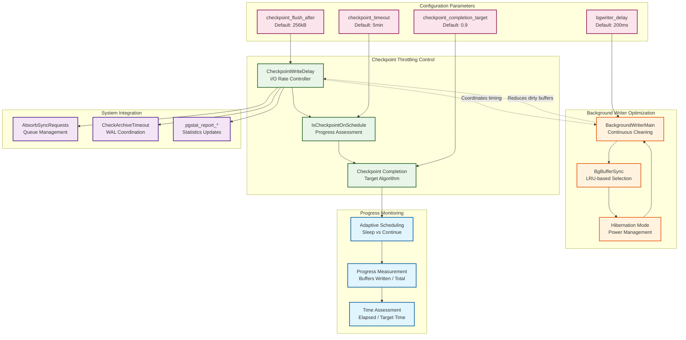

# Checkpoint Performance Tuning and Throttling

## Overview

The checkpoint performance tuning subsystem implements sophisticated algorithms to balance database consistency requirements with system performance. It provides adaptive I/O throttling, intelligent scheduling, and coordination mechanisms to minimize the performance impact of checkpoints while ensuring data durability. This subsystem is critical for maintaining predictable database performance in production environments.

## Key Concepts

- **Checkpoint Completion Target**: Configurable parameter controlling how checkpoint I/O is spread across the checkpoint interval
- **Adaptive Throttling**: Dynamic adjustment of I/O rate based on progress vs. time elapsed
- **I/O Spreading**: Distribution of checkpoint writes across time to avoid performance spikes
- **Background Writer Coordination**: Continuous buffer cleaning to reduce checkpoint workload
- **Hibernation Mode**: Energy-efficient operation during low-activity periods

## Architecture



## Core APIs

### CheckpointWriteDelay

#### Purpose
Central I/O throttling function called after each buffer write during checkpoint. Implements adaptive scheduling to meet completion targets while maintaining system responsiveness.

#### Signature
```c
void CheckpointWriteDelay(int flags, double progress);
```

#### Parameters
| Parameter | Type | Description | Constraints |
|-----------|------|-------------|-------------|
| flags | int | Checkpoint control flags | CHECKPOINT_IMMEDIATE disables delays |
| progress | double | Completion percentage | 0.0 = start, 1.0 = complete |

#### Detailed Implementation Logic

1. **Process Type Validation**:
   ```c
   if (!AmCheckpointerProcess())
       return;  // Only checkpointer process should throttle
   ```

2. **Immediate Mode Check**:
   ```c
   if (!(flags & CHECKPOINT_IMMEDIATE) &&
       !ShutdownRequestPending &&
       !ImmediateCheckpointRequested() &&
       IsCheckpointOnSchedule(progress)) {
       // Enter throttled mode
   }
   ```

3. **Throttled Mode Operations**:
   ```c
   // Configuration reload
   if (ConfigReloadPending) {
       ConfigReloadPending = false;
       ProcessConfigFile(PGC_SIGHUP);
       UpdateSharedMemoryConfig();
   }

   // Prevent fsync queue overflow
   AbsorbSyncRequests();
   absorb_counter = WRITES_PER_ABSORB;

   // Archive management
   CheckArchiveTimeout();

   // Statistics reporting
   pgstat_report_checkpointer();

   // Core throttling delay
   WaitLatch(MyLatch, WL_LATCH_SET | WL_EXIT_ON_PM_DEATH | WL_TIMEOUT,
             100, WAIT_EVENT_CHECKPOINT_WRITE_DELAY);
   ResetLatch(MyLatch);
   ```

4. **Catch-up Mode**:
   ```c
   else if (--absorb_counter <= 0) {
       // Minimal overhead when behind schedule
       AbsorbSyncRequests();
       absorb_counter = WRITES_PER_ABSORB;
   }
   ```

#### Performance Characteristics
- **Fixed Sleep**: 100ms delay when on schedule (previously tied to bgwriter_delay)
- **Adaptive Behavior**: Skips delays when behind schedule
- **Queue Management**: Periodic absorption prevents fsync queue overflow
- **System Integration**: Handles configuration reloads and archive timeouts

### IsCheckpointOnSchedule

#### Purpose
Determines whether checkpoint progress is meeting the completion target timeline, enabling adaptive throttling decisions.

#### Algorithm
```c
static bool IsCheckpointOnSchedule(double progress) {
    int checkpoint_elapsed;
    double expected_progress;

    // Calculate time elapsed since checkpoint start
    checkpoint_elapsed = (int) (time(NULL) - ckpt_start_time);

    // Handle cached elapsed time for performance
    if (ckpt_cached_elapsed != checkpoint_elapsed) {
        ckpt_cached_elapsed = checkpoint_elapsed;
        ckpt_time_target = ((double) CheckPointTimeout) * CheckpointCompletionTarget;
    }

    // Calculate expected progress based on completion target
    if (ckpt_time_target > 0)
        expected_progress = (double) checkpoint_elapsed / ckpt_time_target;
    else
        expected_progress = 0.0;

    // Allow some tolerance for timing variations
    return progress >= expected_progress * 0.9;
}
```

#### Key Features
- **Time-based Assessment**: Compares actual vs. expected progress over time
- **Completion Target Integration**: Uses `checkpoint_completion_target` parameter
- **Tolerance Factor**: 10% margin prevents excessive sensitivity to timing variations
- **Caching**: Optimizes repeated calls within same second

### Background Writer Integration

#### BackgroundWriterMain

**Purpose**: Continuous buffer cleaning process that reduces checkpoint I/O spikes by proactively writing dirty buffers.

**Main Loop Structure**:
```c
for (;;) {
    ResetLatch(MyLatch);
    HandleMainLoopInterrupts();

    // Core cleaning operation
    can_hibernate = BgBufferSync(&wb_context);

    // Statistics and maintenance
    pgstat_report_bgwriter();
    pgstat_report_wal(true);

    // Post-checkpoint cleanup
    if (FirstCallSinceLastCheckpoint()) {
        smgrdestroyall();
    }

    // Replication snapshot logging
    if (XLogStandbyInfoActive() && !RecoveryInProgress()) {
        // Log xl_running_xacts periodically for replication
        if (now >= timeout && last_snapshot_lsn <= GetLastImportantRecPtr()) {
            last_snapshot_lsn = LogStandbySnapshot();
            last_snapshot_ts = now;
        }
    }

    // Adaptive sleep with hibernation
    rc = WaitLatch(MyLatch, WL_LATCH_SET | WL_TIMEOUT | WL_EXIT_ON_PM_DEATH,
                   BgWriterDelay, WAIT_EVENT_BGWRITER_MAIN);

    // Hibernation mode for energy efficiency
    if (rc == WL_TIMEOUT && can_hibernate && prev_hibernate) {
        StrategyNotifyBgWriter(MyProcNumber);  // Request notification
        WaitLatch(MyLatch, WL_LATCH_SET | WL_TIMEOUT | WL_EXIT_ON_PM_DEATH,
                  BgWriterDelay * HIBERNATE_FACTOR, WAIT_EVENT_BGWRITER_HIBERNATE);
        StrategyNotifyBgWriter(-1);  // Cancel notification
    }
}
```

#### BgBufferSync Algorithm

**LRU-based Buffer Selection**:
```c
bool BgBufferSync(WritebackContext *wb_context) {
    int num_to_scan;
    int num_written;
    int reusable_buffers;

    // Calculate scan target based on recent allocation rate
    num_to_scan = (int) (NBuffers * bgwriter_lru_maxpages / 100);

    // Scan clock sweep for candidates
    for (buf_id = StrategySyncStart(); num_to_scan-- > 0; buf_id = next_to_clean) {
        // Skip if someone else cleaned it
        if (++next_to_clean >= NBuffers)
            next_to_clean = 0;

        // Try to write buffer if appropriate
        if (SyncOneBuffer(buf_id, true, wb_context) & BUF_WRITTEN) {
            num_written++;
            if (num_written >= bgwriter_lru_maxpages)
                break;  // Written enough for this cycle
        }

        if (SyncOneBuffer(buf_id, true, wb_context) & BUF_REUSABLE)
            reusable_buffers++;
    }

    // Return hibernation eligibility
    return (num_written == 0 && reusable_buffers == 0);
}
```

#### Hibernation Mode
**Energy Efficiency Features**:
- Extends sleep periods when no buffer activity detected
- Requires two consecutive idle cycles to activate
- Uses `StrategyNotifyBgWriter()` for demand-driven wakeup
- Balances power savings with responsiveness

## Configuration Parameters

### checkpoint_completion_target

**Purpose**: Controls how much of the checkpoint interval should be used for spreading checkpoint I/O.

**Default Value**: 0.9 (90% of checkpoint_timeout)

**Impact on Performance**:
```c
// Time allocation calculation
checkpoint_spread_time = checkpoint_timeout * checkpoint_completion_target;
target_write_rate = dirty_buffers / checkpoint_spread_time;
```

**Tuning Guidelines**:
- **Higher values (0.9-0.95)**: More spreading, lower peak I/O, longer checkpoint completion
- **Lower values (0.5-0.8)**: Less spreading, higher peak I/O, faster checkpoint completion
- **Extreme values**: Values near 1.0 may cause checkpoint timeout issues

### checkpoint_timeout

**Purpose**: Maximum time between automatic checkpoints.

**Default Value**: 300 seconds (5 minutes)

**Performance Trade-offs**:
- **Longer intervals**: Fewer checkpoint interruptions, more WAL accumulation, longer recovery
- **Shorter intervals**: More frequent checkpoints, less WAL accumulation, faster recovery

### bgwriter_delay

**Purpose**: Sleep time between background writer cycles.

**Default Value**: 200 milliseconds

**Impact**:
- **Shorter delays**: More aggressive cleaning, higher CPU usage, smoother checkpoints
- **Longer delays**: Less aggressive cleaning, lower CPU usage, larger checkpoint spikes

### bgwriter_lru_maxpages

**Purpose**: Maximum number of buffers the background writer can write per cycle.

**Default Value**: 100

**Calculation**:
```c
num_to_scan = (int) (NBuffers * bgwriter_lru_maxpages / 100);
```

### checkpoint_flush_after

**Purpose**: Amount of data after which checkpoint writes trigger OS-level flush hints.

**Default Value**: 256kB (32 pages)

**Performance Impact**:
- **Smaller values**: More frequent OS coordination, better write ordering
- **Larger values**: Less OS coordination overhead, more bursty writes

## Adaptive Algorithms

### Progress-Based Throttling

**Algorithm Overview**:
```c
double time_elapsed = (current_time - checkpoint_start_time);
double time_target = checkpoint_timeout * checkpoint_completion_target;
double expected_progress = time_elapsed / time_target;

if (actual_progress >= expected_progress * 0.9) {
    // On schedule - can afford to sleep
    WaitLatch(MyLatch, ..., 100, ...);
} else {
    // Behind schedule - skip delays
    continue_immediately();
}
```

### Dynamic Buffer Selection

**Background Writer Adaptation**:
```c
// Adjust scan rate based on buffer pool pressure
if (recent_alloc_rate > threshold) {
    scan_more_aggressively();
} else if (recent_alloc_rate == 0) {
    consider_hibernation();
}
```

### Tablespace I/O Balancing

**Multi-device Optimization**:
```c
// Maintain per-tablespace progress tracking
for each tablespace {
    progress_ratio = buffers_written / total_buffers_in_tablespace;
    // Select tablespace with lowest progress ratio
    if (progress_ratio < min_progress) {
        next_write_target = this_tablespace;
    }
}
```

## Performance Monitoring

### Key Metrics

#### Checkpoint Statistics
```c
typedef struct CheckpointStatsData {
    TimestampTz ckpt_start_t;        // Checkpoint start time
    TimestampTz ckpt_write_t;        // Buffer write start time
    TimestampTz ckpt_sync_t;         // Sync phase start time
    TimestampTz ckpt_sync_end_t;     // Sync phase end time
    TimestampTz ckpt_end_t;          // Checkpoint completion time

    int         ckpt_bufs_written;   // Buffers written by checkpoint
    int         ckpt_segs_added;     // WAL segments added
    int         ckpt_segs_removed;   // WAL segments removed
    int         ckpt_segs_recycled;  // WAL segments recycled

    int         ckpt_sync_rels;      // Relations fsync'd
    uint64      ckpt_longest_sync;   // Longest individual fsync time
    uint64      ckpt_agg_sync_time;  // Total fsync time
} CheckpointStatsData;
```

#### Background Writer Statistics
```c
typedef struct BgWriterStatsData {
    PgStat_Counter buf_written_clean;    // Buffers written by bgwriter
    PgStat_Counter maxwritten_clean;     // Times bgwriter stopped due to limit
    PgStat_Counter buf_alloc;            // Buffer allocations
} BgWriterStatsData;
```

### Monitoring Queries
```sql
-- Checkpoint performance monitoring
SELECT
    checkpoints_timed,
    checkpoints_req,
    checkpoint_write_time,
    checkpoint_sync_time,
    buffers_checkpoint,
    buffers_clean,
    maxwritten_clean,
    buffers_backend,
    buffers_backend_fsync,
    buffers_alloc
FROM pg_stat_bgwriter;

-- I/O timing statistics (if track_io_timing enabled)
SELECT
    object,
    context,
    writes,
    write_time
FROM pg_stat_io
WHERE backend_type = 'checkpointer' OR backend_type = 'background writer';
```

## Optimization Strategies

### Checkpoint Spike Reduction

1. **Background Writer Tuning**:
   ```postgresql
   -- More aggressive background cleaning
   ALTER SYSTEM SET bgwriter_delay = 100;           -- More frequent cycles
   ALTER SYSTEM SET bgwriter_lru_maxpages = 200;    -- More pages per cycle
   ALTER SYSTEM SET bgwriter_lru_multiplier = 3.0;  -- Adaptive scaling
   ```

2. **Checkpoint Spreading**:
   ```postgresql
   -- Spread checkpoint I/O over longer period
   ALTER SYSTEM SET checkpoint_completion_target = 0.9;
   ALTER SYSTEM SET checkpoint_timeout = 600;  -- 10 minutes
   ```

### I/O Subsystem Optimization

1. **Writeback Coordination**:
   ```postgresql
   -- Optimize OS-level write batching
   ALTER SYSTEM SET checkpoint_flush_after = 512;  -- 4MB batches
   ALTER SYSTEM SET bgwriter_flush_after = 256;    -- 2MB batches
   ```

2. **WAL Coordination**:
   ```postgresql
   -- Balance WAL and checkpoint I/O
   ALTER SYSTEM SET wal_buffers = 16384;     -- 128MB WAL buffer
   ALTER SYSTEM SET wal_writer_delay = 200;  -- Coordinate with bgwriter
   ```

### Memory Management

1. **Shared Buffer Sizing**:
   ```c
   // Larger buffer pools reduce checkpoint frequency
   shared_buffers = min(0.25 * RAM, effective_cache_size * 0.75);
   ```

2. **Effective Cache Coordination**:
   ```postgresql
   -- Help optimizer understand I/O characteristics
   ALTER SYSTEM SET effective_cache_size = '8GB';  -- Available OS cache
   ALTER SYSTEM SET random_page_cost = 1.1;        -- SSD-optimized
   ```

## Troubleshooting Performance Issues

### Checkpoint Storm Prevention

**Symptoms**:
- Frequent "checkpoints are occurring too frequently" warnings
- High checkpoint_req vs checkpoint_timed ratio

**Solutions**:
```postgresql
-- Increase WAL volume threshold
ALTER SYSTEM SET max_wal_size = 4096;    -- 4GB

-- Reduce checkpoint sensitivity
ALTER SYSTEM SET checkpoint_timeout = 900;  -- 15 minutes
ALTER SYSTEM SET checkpoint_completion_target = 0.95;
```

### I/O Bottleneck Resolution

**Identification**:
```sql
-- Check for I/O waits
SELECT wait_event_type, wait_event, count(*)
FROM pg_stat_activity
WHERE state = 'active'
GROUP BY wait_event_type, wait_event;
```

**Optimization**:
```postgresql
-- Reduce checkpoint I/O pressure
ALTER SYSTEM SET checkpoint_completion_target = 0.95;
ALTER SYSTEM SET bgwriter_lru_maxpages = 300;

-- Improve I/O scheduling
ALTER SYSTEM SET checkpoint_flush_after = 1024;  -- 8MB batches
```

### Memory Pressure Management

**Buffer Pool Optimization**:
```c
// Calculate optimal shared_buffers
if (workload_type == OLTP) {
    shared_buffers = RAM * 0.15;  // Conservative for many connections
} else if (workload_type == OLAP) {
    shared_buffers = RAM * 0.40;  // Aggressive for analytical workloads
}
```

## Advanced Configuration

### Workload-Specific Tuning

#### OLTP Workloads
```postgresql
-- Optimize for transaction throughput
ALTER SYSTEM SET checkpoint_timeout = 300;
ALTER SYSTEM SET checkpoint_completion_target = 0.9;
ALTER SYSTEM SET bgwriter_delay = 100;
ALTER SYSTEM SET bgwriter_lru_maxpages = 100;
```

#### Batch Processing
```postgresql
-- Optimize for large data loads
ALTER SYSTEM SET checkpoint_timeout = 900;
ALTER SYSTEM SET checkpoint_completion_target = 0.95;
ALTER SYSTEM SET max_wal_size = 8192;    -- 8GB
ALTER SYSTEM SET bgwriter_lru_maxpages = 500;
```

#### Mixed Workloads
```postgresql
-- Balanced configuration
ALTER SYSTEM SET checkpoint_timeout = 600;
ALTER SYSTEM SET checkpoint_completion_target = 0.9;
ALTER SYSTEM SET bgwriter_delay = 200;
ALTER SYSTEM SET bgwriter_lru_maxpages = 200;
```

### Hardware-Specific Optimizations

#### SSD Storage
```postgresql
-- Optimize for flash storage characteristics
ALTER SYSTEM SET random_page_cost = 1.1;
ALTER SYSTEM SET seq_page_cost = 1.0;
ALTER SYSTEM SET checkpoint_flush_after = 2048;  -- Larger batches
```

#### Traditional Spindle Drives
```postgresql
-- Optimize for rotational storage
ALTER SYSTEM SET random_page_cost = 4.0;
ALTER SYSTEM SET seq_page_cost = 1.0;
ALTER SYSTEM SET checkpoint_flush_after = 256;   -- Smaller batches
```

#### NVMe/High-Performance Storage
```postgresql
-- Minimal throttling for high-speed storage
ALTER SYSTEM SET checkpoint_completion_target = 0.8;
ALTER SYSTEM SET checkpoint_flush_after = 4096;  -- Very large batches
ALTER SYSTEM SET bgwriter_lru_maxpages = 1000;
```