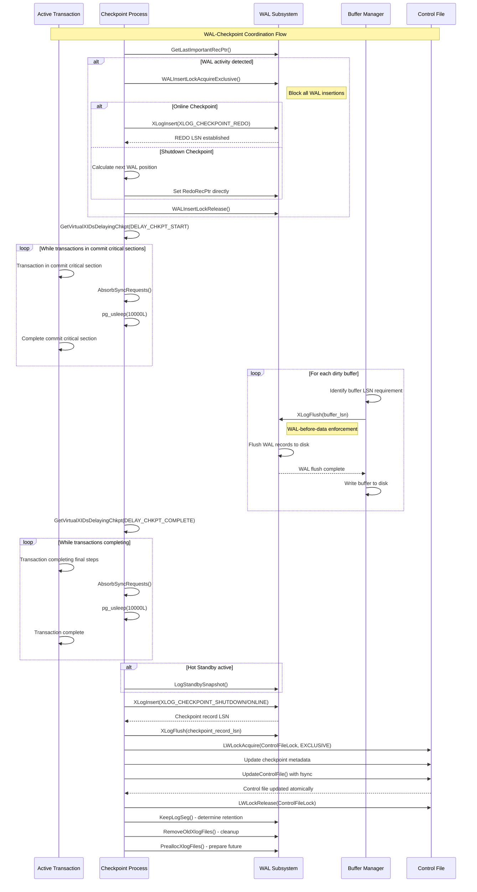

# WAL-Checkpoint Coordination Subsystem

## Overview

The WAL-checkpoint coordination subsystem ensures database consistency by implementing the fundamental WAL-before-data rule and managing the complex interactions between write-ahead logging and checkpoint operations. This subsystem handles REDO point establishment, transaction synchronization, control file management, and post-checkpoint WAL maintenance to guarantee recovery correctness.

## Key Concepts

- **WAL-Before-Data Rule**: Critical consistency guarantee that WAL records reach disk before corresponding data pages
- **REDO Point**: WAL location from which recovery must begin if the system crashes after checkpoint completion
- **Transaction Delay Points**: Synchronization barriers that prevent commit race conditions during checkpoints
- **Control File Atomicity**: Single-point-of-truth for checkpoint metadata with atomic updates
- **WAL Segment Management**: Cleanup and pre-allocation of WAL files based on checkpoint advancement

## Architecture

```mermaid
graph TB
    subgraph "REDO Point Management"
        LI[GetLastImportantRecPtr<br/>Check WAL Activity]
        WAX[WALInsertLockAcquireExclusive<br/>Block Concurrent Inserts]
        CRP[Calculate REDO Point]
        IRR[Insert REDO Record<br/>XLOG_CHECKPOINT_REDO]
        URR[Update RedoRecPtr<br/>Global State]
    end

    subgraph "Transaction Synchronization"
        GVX[GetVirtualXIDsDelayingChkpt<br/>DELAY_CHKPT_START]
        WCS[Wait for Commit<br/>Critical Sections]
        ASR[AbsorbSyncRequests<br/>Prevent Queue Overflow]
        GVX2[GetVirtualXIDsDelayingChkpt<br/>DELAY_CHKPT_COMPLETE]
    end

    subgraph "Buffer-WAL Coordination"
        BLS[Buffer LSN Check<br/>Per-page WAL requirements]
        XLF[XLogFlush<br/>Enforce WAL-before-data]
        BWR[Buffer Write<br/>After WAL flush]
    end

    subgraph "Checkpoint Record Management"
        LSS[LogStandbySnapshot<br/>Hot Standby state]
        ICR[Insert Checkpoint Record<br/>SHUTDOWN/ONLINE]
        XLF2[XLogFlush<br/>Ensure record on disk]
    end

    subgraph "Control File Operations"
        LAC[LWLockAcquire<br/>ControlFileLock EXCLUSIVE]
        UCF[UpdateControlFile<br/>Atomic metadata update]
        FSY[fsync Control File<br/>Ensure durability]
    end

    subgraph "Post-Checkpoint Maintenance"
        SWL[SetWalSummarizerLatch<br/>Signal cleanup]
        KLS[KeepLogSeg<br/>Determine retention]
        ROX[RemoveOldXlogFiles<br/>Cleanup obsolete WAL]
        PAX[PreallocXlogFiles<br/>Prepare future segments]
    end

    %% Flow connections
    LI --> WAX
    WAX --> CRP
    CRP --> IRR
    IRR --> URR

    URR --> GVX
    GVX --> WCS
    WCS --> ASR
    ASR --> GVX2

    GVX2 --> BLS
    BLS --> XLF
    XLF --> BWR

    BWR --> LSS
    LSS --> ICR
    ICR --> XLF2

    XLF2 --> LAC
    LAC --> UCF
    UCF --> FSY

    FSY --> SWL
    SWL --> KLS
    KLS --> ROX
    ROX --> PAX

    classDef redoNode fill:#e8f5e8,stroke:#1b5e20,stroke-width:2px
    classDef syncNode fill:#fff3e0,stroke:#e65100,stroke-width:2px
    classDef bufferNode fill:#e1f5fe,stroke:#01579b,stroke-width:2px
    classDef recordNode fill:#f3e5f5,stroke:#4a148c,stroke-width:2px
    classDef controlNode fill:#fce4ec,stroke:#880e4f,stroke-width:2px
    classDef maintNode fill:#f1f8e9,stroke:#33691e,stroke-width:2px

    class LI,WAX,CRP,IRR,URR redoNode
    class GVX,WCS,ASR,GVX2 syncNode
    class BLS,XLF,BWR bufferNode
    class LSS,ICR,XLF2 recordNode
    class LAC,UCF,FSY controlNode
    class SWL,KLS,ROX,PAX maintNode
```



## Core APIs

### REDO Point Management

#### GetLastImportantRecPtr

**Purpose**: Determines the most recent WAL location that contains data requiring checkpoint protection.

**Usage in Checkpoint Context**:
```c
// Check if checkpoint is needed
last_important_lsn = GetLastImportantRecPtr();
if ((flags & (CHECKPOINT_IS_SHUTDOWN | CHECKPOINT_END_OF_RECOVERY | CHECKPOINT_FORCE)) == 0) {
    if (last_important_lsn == ControlFile->checkPoint) {
        ereport(DEBUG1, (errmsg_internal("checkpoint skipped because system is idle")));
        return;
    }
}
```

**Integration Points**:
- Prevents unnecessary checkpoints when no WAL activity has occurred
- Coordinates with WAL insertion and buffer management
- Influences checkpoint scheduling decisions

#### REDO Point Establishment

**Shutdown vs Online Checkpoints**:

1. **Shutdown Checkpoint REDO Point**:
   ```c
   // Compute next XLOG record position since no concurrent insertions
   XLogRecPtr curInsert = XLogBytePosToRecPtr(Insert->CurrBytePos);
   freespace = INSERT_FREESPACE(curInsert);
   if (freespace == 0) {
       if (XLogSegmentOffset(curInsert, wal_segment_size) == 0)
           curInsert += SizeOfXLogLongPHD;
       else
           curInsert += SizeOfXLogShortPHD;
   }
   checkPoint.redo = curInsert;
   RedoRecPtr = XLogCtl->Insert.RedoRecPtr = checkPoint.redo;
   ```

2. **Online Checkpoint REDO Point**:
   ```c
   // Insert special REDO record to mark checkpoint start
   XLogBeginInsert();
   XLogRegisterData((char *) &wal_level, sizeof(wal_level));
   (void) XLogInsert(RM_XLOG_ID, XLOG_CHECKPOINT_REDO);

   // The LSN of this record becomes the REDO point
   checkPoint.redo = RedoRecPtr;
   ```

**Critical Differences**:
- Shutdown: REDO point calculated precisely (no concurrent activity)
- Online: REDO record insertion establishes point and allows concurrent WAL activity

### Transaction Synchronization

#### Transaction Delay Mechanisms

**DELAY_CHKPT_START Phase**:
```c
vxids = GetVirtualXIDsDelayingChkpt(&nvxids, DELAY_CHKPT_START);
if (nvxids > 0) {
    do {
        AbsorbSyncRequests();  // Prevent deadlock
        pgstat_report_wait_start(WAIT_EVENT_CHECKPOINT_DELAY_START);
        pg_usleep(10000L);     // wait for 10 msec
        pgstat_report_wait_end();
    } while (HaveVirtualXIDsDelayingChkpt(vxids, nvxids, DELAY_CHKPT_START));
}
```

**DELAY_CHKPT_COMPLETE Phase**:
```c
vxids = GetVirtualXIDsDelayingChkpt(&nvxids, DELAY_CHKPT_COMPLETE);
if (nvxids > 0) {
    do {
        AbsorbSyncRequests();
        pgstat_report_wait_start(WAIT_EVENT_CHECKPOINT_DELAY_COMPLETE);
        pg_usleep(10000L);
        pgstat_report_wait_end();
    } while (HaveVirtualXIDsDelayingChkpt(vxids, nvxids, DELAY_CHKPT_COMPLETE));
}
```

**Critical Race Condition Prevention**:
- **Start Delay**: Prevents transactions from committing between REDO point and buffer flushing
- **Complete Delay**: Ensures all transaction state is stable before checkpoint completion
- **Deadlock Prevention**: AbsorbSyncRequests prevents fsync queue overflow during waits

### WAL-Before-Data Rule Implementation

#### FlushBuffer WAL Coordination

**LSN Extraction and WAL Flush**:
```c
// Get page LSN under buffer header lock
buf_state = LockBufHdr(buf);
recptr = BufferGetLSN(buf);
buf_state &= ~BM_JUST_DIRTIED;  // Clear concurrent dirty flag
UnlockBufHdr(buf, buf_state);

// Enforce WAL-before-data rule for permanent relations
if (buf_state & BM_PERMANENT)
    XLogFlush(recptr);
```

**Special Cases**:
- **Unlogged Relations**: Skip WAL flush (no WAL records exist)
- **Fake LSNs**: GiST indexes use internal LSNs that must be handled carefully
- **Concurrent Modifications**: BM_JUST_DIRTIED handling for race conditions

#### XLogFlush Implementation Details

**Flush Coordination**:
- Ensures all WAL records up to specified LSN are on disk
- Coordinates with WAL writer process for efficient batching
- Handles flush requests from multiple concurrent buffer writes

### Control File Management

#### UpdateControlFile

**Purpose**: Atomically updates PostgreSQL control file with checkpoint metadata.

**Implementation Flow**:
```c
static void UpdateControlFile(void) {
    update_controlfile(DataDir, ControlFile, true);
}
```

#### update_controlfile Details

**Atomic Update Process**:
```c
void update_controlfile(const char *DataDir, ControlFileData *ControlFile, bool do_sync) {
    // Update timestamp
    ControlFile->time = (pg_time_t) time(NULL);

    // Recalculate CRC
    INIT_CRC32C(ControlFile->crc);
    COMP_CRC32C(ControlFile->crc, (char *) ControlFile, offsetof(ControlFileData, crc));
    FIN_CRC32C(ControlFile->crc);

    // Zero-pad buffer for consistent writes
    memset(buffer, 0, PG_CONTROL_FILE_SIZE);
    memcpy(buffer, ControlFile, sizeof(ControlFileData));

    // Atomic write
    fd = BasicOpenFile(ControlFilePath, O_RDWR | PG_BINARY);
    write(fd, buffer, PG_CONTROL_FILE_SIZE);

    if (do_sync) {
        pg_fsync(fd);  // Force to disk
    }
    close(fd);
}
```

**Critical Properties**:
- **Atomic**: Single write operation for entire control file
- **CRC Protected**: Detects corruption during recovery
- **Zero Padded**: Consistent file size prevents partial reads
- **Fsync Enforced**: Guaranteed disk persistence

#### Control File Update in Checkpoint

**Checkpoint Context**:
```c
LWLockAcquire(ControlFileLock, LW_EXCLUSIVE);

if (shutdown)
    ControlFile->state = DB_SHUTDOWNED;

ControlFile->checkPoint = ProcLastRecPtr;           // Checkpoint record LSN
ControlFile->checkPointCopy = checkPoint;          // Complete checkpoint data
ControlFile->minRecoveryPoint = InvalidXLogRecPtr; // Reset for crash recovery
ControlFile->minRecoveryPointTLI = 0;

// Store unlogged LSN for debugging
ControlFile->unloggedLSN = pg_atomic_read_membarrier_u64(&XLogCtl->unloggedLSN);

UpdateControlFile();
LWLockRelease(ControlFileLock);
```

### Sync Request Management

#### ProcessSyncRequests

**Purpose**: Processes all queued fsync requests to ensure data durability during checkpoint.

**Implementation Strategy**:
```c
void ProcessSyncRequests(void) {
    static bool sync_in_progress = false;
    HASH_SEQ_STATUS hstat;
    PendingFsyncEntry *entry;

    // Absorb all pending requests first
    AbsorbSyncRequests();

    // Handle incomplete previous attempts
    if (sync_in_progress) {
        hash_seq_init(&hstat, pendingOps);
        while ((entry = (PendingFsyncEntry *) hash_seq_search(&hstat)) != NULL) {
            entry->cycle_ctr = sync_cycle_ctr;  // Reset stale entries
        }
    }

    // Advance cycle counter to distinguish new requests
    sync_cycle_ctr++;
    sync_in_progress = true;

    // Process all current requests
    absorb_counter = FSYNCS_PER_ABSORB;
    hash_seq_init(&hstat, pendingOps);
    while ((entry = (PendingFsyncEntry *) hash_seq_search(&hstat)) != NULL) {
        // Skip new requests (added after cycle increment)
        if (entry->cycle_ctr == sync_cycle_ctr)
            continue;

        // Periodic absorption to prevent queue overflow
        if (--absorb_counter <= 0) {
            AbsorbSyncRequests();
            absorb_counter = FSYNCS_PER_ABSORB;
        }

        // Perform actual fsync with retry logic
        for (failures = 0; !entry->canceled; failures++) {
            if (syncsw[entry->tag.handler].sync_syncfiletag(&entry->tag, path) == 0) {
                // Success - update statistics
                break;
            }

            // Handle deleted files gracefully
            if (!FILE_POSSIBLY_DELETED(errno) || failures > 0) {
                ereport(data_sync_elevel(ERROR),
                        (errcode_for_file_access(),
                         errmsg("could not fsync file \"%s\": %m", path)));
            }

            // Retry after absorbing new requests
            AbsorbSyncRequests();
        }

        // Remove processed entry
        hash_search(pendingOps, &entry->tag, HASH_REMOVE, NULL);
    }

    sync_in_progress = false;
}
```

**Key Features**:
- **Cycle Counter**: Prevents processing of requests added during execution
- **Retry Logic**: Handles temporarily deleted files gracefully
- **Queue Management**: Periodic absorption prevents overflow
- **Error Handling**: Distinguishes between recoverable and fatal errors

#### AbsorbSyncRequests

**Purpose**: Transfers fsync requests from shared memory queue to process-local hash table.

**Critical Timing**: Called frequently during checkpoint to prevent shared memory queue overflow.

## WAL Segment Management

### Post-Checkpoint Cleanup

#### KeepLogSeg
**Purpose**: Determines oldest WAL segment that must be retained.

**Factors Considered**:
- Current checkpoint REDO point
- Replication slot requirements (slotsMinReqLSN)
- Archive recovery needs
- Timeline considerations

#### RemoveOldXlogFiles
**Purpose**: Removes or recycles WAL segments no longer needed for recovery.

**Implementation**:
```c
XLByteToSeg(RedoRecPtr, _logSegNo, wal_segment_size);
KeepLogSeg(recptr, slotsMinReqLSN, &_logSegNo);

if (InvalidateObsoleteReplicationSlots(RS_INVAL_WAL_REMOVED, _logSegNo, InvalidOid, InvalidTransactionId)) {
    // Recalculate after slot invalidation
    slotsMinReqLSN = XLogGetReplicationSlotMinimumLSN();
    CheckPointReplicationSlots(shutdown);
    XLByteToSeg(RedoRecPtr, _logSegNo, wal_segment_size);
    KeepLogSeg(recptr, slotsMinReqLSN, &_logSegNo);
}

_logSegNo--;
RemoveOldXlogFiles(_logSegNo, RedoRecPtr, recptr, checkPoint.ThisTimeLineID);
```

#### PreallocXlogFiles
**Purpose**: Pre-creates WAL segments to avoid allocation delays during normal operation.

**Benefits**:
- Reduces WAL write latency
- Prevents filesystem fragmentation
- Improves predictable performance

## Processing Flow



## Critical Consistency Guarantees

### WAL-Before-Data Rule
- **Guarantee**: All WAL records describing page changes must reach disk before the page itself
- **Implementation**: XLogFlush(page_lsn) before buffer write
- **Exception Handling**: Unlogged relations bypass WAL flush requirements

### Transaction Consistency
- **Start Barrier**: Prevents commits between REDO point establishment and buffer flush start
- **Completion Barrier**: Ensures all transaction state is stable before checkpoint completion
- **Deadlock Prevention**: Continuous fsync request absorption during waits

### Atomic Checkpoint Commitment
- **Single Point**: Control file update atomically commits entire checkpoint
- **CRC Protection**: Corruption detection for control file integrity
- **Recovery Coordination**: minRecoveryPoint management for standby servers

## Error Handling and Recovery

### Partial Checkpoint Recovery
```c
if (sync_in_progress) {
    // Previous ProcessSyncRequests failed
    hash_seq_init(&hstat, pendingOps);
    while ((entry = (PendingFsyncEntry *) hash_seq_search(&hstat)) != NULL) {
        entry->cycle_ctr = sync_cycle_ctr;  // Reset for retry
    }
}
```

### File Deletion Race Conditions
```c
for (failures = 0; !entry->canceled; failures++) {
    if (sync_syncfiletag(&entry->tag, path) == 0)
        break;

    if (!FILE_POSSIBLY_DELETED(errno) || failures > 0) {
        ereport(ERROR, ...);  // Fatal error
    }

    // Absorb potential cancel message and retry
    AbsorbSyncRequests();
}
```

### WAL Flush Failures
- Critical section protection prevents system panic
- Automatic retry mechanisms for transient errors
- Comprehensive error reporting with context

## Performance Characteristics

### WAL Flush Optimization
- **Batching**: Multiple buffer flushes can share WAL flush operations
- **LSN Ordering**: Higher LSN flushes satisfy lower LSN requirements
- **Group Commit**: Transaction commits batch WAL flushes efficiently

### Control File Efficiency
- **Single Write**: Entire control file updated in one operation
- **Fsync Batching**: Coordinated with other filesystem sync operations
- **Lock Duration**: Minimal ControlFileLock hold time

### Fsync Request Management
- **Hash Table**: O(1) lookup and insertion for sync requests
- **Periodic Absorption**: Prevents shared memory queue overflow
- **Cycle Counting**: Efficient distinction between old and new requests

## Configuration Impact

### WAL-Related Parameters
- **wal_level**: Affects content of WAL records and checkpoint coordination
- **wal_sync_method**: Influences WAL flush performance characteristics
- **wal_buffers**: Impacts WAL write batching efficiency

### Checkpoint-Specific Settings
- **checkpoint_timeout**: Frequency of time-based checkpoints
- **max_wal_size**: WAL volume trigger for checkpoints
- **log_checkpoints**: Detailed checkpoint timing information

### Performance Tuning
- **fsync**: Global setting affecting all sync operations
- **synchronous_commit**: Per-transaction WAL flush requirements
- **full_page_writes**: Torn page protection overhead