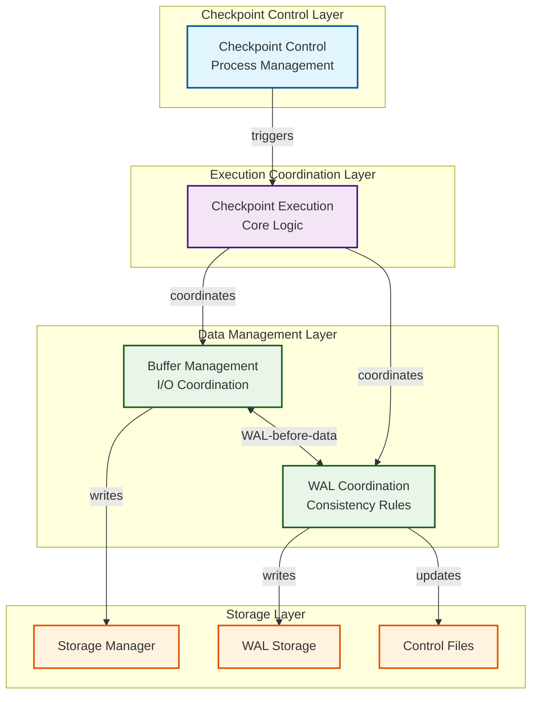

# Core Components Overview

The PostgreSQL checkpointing subsystem is organized into four primary functional areas, each handling distinct aspects of the checkpoint process. This modular architecture enables sophisticated coordination while maintaining clear separation of concerns.

## Functional Areas

### 1. [Checkpoint Control](checkpoint_control.md)
**Purpose**: Process management, scheduling, and coordination

**Key Components**:
- `CheckpointerMain` - Main checkpointer process entry point
- `RequestCheckpoint` - Backend interface for checkpoint requests
- `HandleCheckpointerInterrupts` - Signal handling and coordination

**Responsibilities**:
- Checkpoint trigger evaluation (time-based, WAL-based, manual)
- Inter-process communication and synchronization
- Background process lifecycle management
- Error handling and recovery coordination

**Integration Points**: Postmaster spawning, shared memory coordination, signal handling

---

### 2. [Checkpoint Execution](checkpoint_execution.md)
**Purpose**: Core checkpoint logic and orchestration

**Key Components**:
- `CreateCheckPoint` - Main checkpoint execution function
- `CreateRestartPoint` - Recovery checkpoint variant
- `CheckPointGuts` - Shared checkpoint implementation
- `CheckPointBuffers` - Buffer synchronization wrapper

**Responsibilities**:
- REDO point establishment and WAL record insertion
- Transaction synchronization barrier management
- Subsystem checkpoint coordination (CLOG, MultiXact, etc.)
- Control file atomic updates

**Integration Points**: WAL subsystem, transaction manager, storage manager

---

### 3. [Buffer Management](buffer_management.md)
**Purpose**: Dirty buffer identification, sorting, and synchronization

**Key Components**:
- `BufferSync` - Main buffer synchronization algorithm
- `SyncOneBuffer` - Individual buffer flush primitive
- `FlushBuffer` - Low-level I/O coordination
- `sort_checkpoint_bufferids` - I/O optimization

**Responsibilities**:
- Dirty buffer pool scanning and identification
- Tablespace-balanced I/O scheduling
- WAL-before-data rule enforcement
- Checksum calculation and writeback coordination

**Integration Points**: Shared buffer pool, storage manager, WAL flushing

---

### 4. [WAL Coordination](wal_coordination.md)
**Purpose**: Write-ahead log integration and consistency enforcement

**Key Components**:
- `LogCheckpointStart`/`LogCheckpointEnd` - WAL record generation
- `UpdateControlFile` - Metadata persistence
- `ProcessSyncRequests` - fsync coordination
- `RemoveOldXlogFiles` - WAL cleanup

**Responsibilities**:
- WAL-before-data consistency rule enforcement
- Checkpoint metadata WAL record generation
- Post-checkpoint WAL segment management
- Control file atomic updates

**Integration Points**: WAL writer, storage manager, replication

## Component Interaction Flow



## Cross-Component Dependencies

### Checkpoint Control → Execution
- Process lifecycle management
- Trigger event evaluation
- Error handling coordination

### Execution → Buffer Management
- Dirty buffer set freezing
- I/O throttling coordination
- Progress monitoring

### Execution → WAL Coordination
- REDO point establishment
- Checkpoint metadata recording
- Transaction synchronization

### Buffer Management ↔ WAL Coordination
- WAL-before-data rule enforcement
- Page LSN validation
- fsync request coordination

## Key Data Structures

### CheckpointStatsData
```c
typedef struct CheckpointStatsData {
    TimestampTz ckpt_start_t;      // Checkpoint start time
    TimestampTz ckpt_write_t;      // Buffer write phase start
    TimestampTz ckpt_sync_t;       // Sync phase start
    TimestampTz ckpt_sync_end_t;   // Sync phase completion
    TimestampTz ckpt_end_t;        // Checkpoint completion

    int ckpt_bufs_written;         // Buffers written
    int ckpt_segs_added;           // WAL segments added
    int ckpt_segs_removed;         // WAL segments removed
    int ckpt_segs_recycled;        // WAL segments recycled
} CheckpointStatsData;
```

### CheckpointerShmem
```c
typedef struct CheckpointerShmemStruct {
    pid_t           checkpointer_pid;  // Process ID
    slock_t         ckpt_lck;         // Coordination lock

    int             ckpt_flags;       // Pending checkpoint flags
    int             ckpt_started;     // Start sequence number
    int             ckpt_done;        // Completion sequence number
    int             ckpt_failed;      // Failure sequence number

    ConditionVariable start_cv;      // Start notification
    ConditionVariable done_cv;       // Completion notification
} CheckpointerShmemStruct;
```

### CkptSortItem
```c
typedef struct CkptSortItem {
    int             buf_id;        // Buffer pool index
    Oid             tsId;          // Tablespace OID
    RelFileNumber   relNumber;     // Relation file number
    ForkNumber      forkNum;       // Fork number
    BlockNumber     blockNum;      // Block number
} CkptSortItem;
```

## Performance Characteristics by Component

| Component | Time Complexity | Memory Usage | I/O Pattern |
|-----------|----------------|--------------|-------------|
| **Checkpoint Control** | O(1) | Minimal | None |
| **Checkpoint Execution** | O(log T) | O(T) | Sequential WAL |
| **Buffer Management** | O(N log N) | O(D) | Random→Sequential |
| **WAL Coordination** | O(log W) | O(F) | Sequential WAL |

Where:
- N = Total buffer count
- D = Dirty buffer count
- T = Transaction count
- W = WAL insertion rate
- F = File count for fsync

## Error Handling Strategy

### Component-Level Recovery
Each component implements specific error recovery:

1. **Control**: Process restart and signal handling
2. **Execution**: Transaction rollback and resource cleanup
3. **Buffer Management**: I/O retry and buffer state recovery
4. **WAL Coordination**: WAL segment recovery and fsync retry

### System-Level Coordination
- Critical section protection prevents system panic
- Shared memory consistency maintained across failures
- Checkpoint restart logic handles partial completions

## Configuration Impact by Component

### Checkpoint Control
- `checkpoint_timeout` - Time-based trigger interval
- `checkpoint_warning` - Frequent checkpoint detection

### Checkpoint Execution
- `checkpoint_completion_target` - I/O spreading target
- `max_wal_size` - WAL volume trigger

### Buffer Management
- `shared_buffers` - Buffer pool size
- `checkpoint_flush_after` - Writeback hint threshold

### WAL Coordination
- `wal_sync_method` - WAL flush method
- `fsync` - Global sync behavior

## Next Steps

Choose a component area to explore in detail:

- **[Checkpoint Control](checkpoint_control.md)** - Start with process management
- **[Checkpoint Execution](checkpoint_execution.md)** - Core checkpoint logic
- **[Buffer Management](buffer_management.md)** - I/O optimization details
- **[WAL Coordination](wal_coordination.md)** - Consistency mechanisms

Each component document provides detailed API documentation, implementation analysis, and integration guidance.