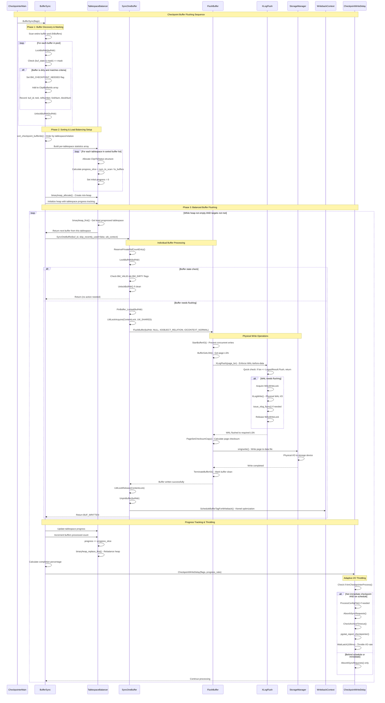
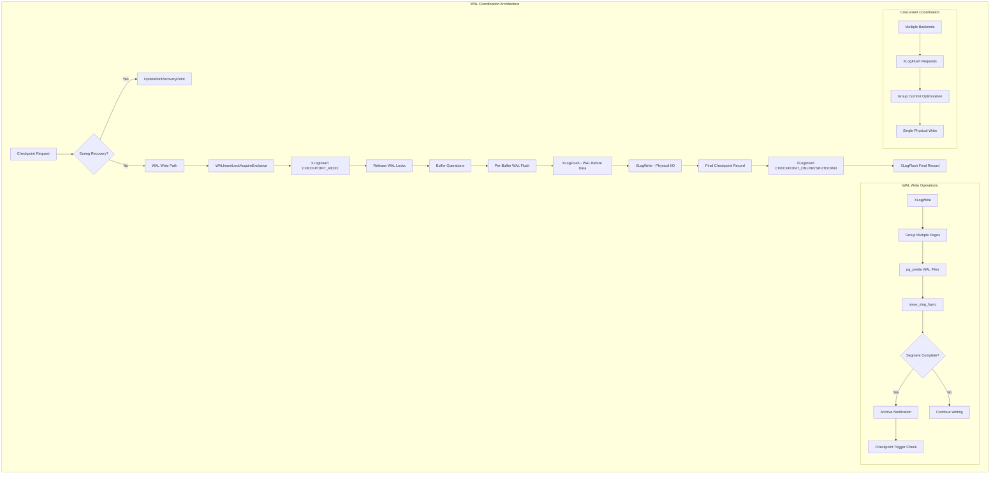
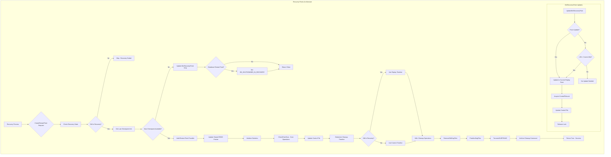

# PostgreSQL Checkpointing System - Complete Technical Documentation

> **Navigation**: This is the comprehensive technical reference. For quick orientation, see [Documentation Index](checkpointing_documentation_index.md).

## Table of Contents

1. [System Architecture](#system-architecture)
2. [Checkpoint Control](#checkpoint-control)
3. [Buffer Flushing](#buffer-flushing)
4. [WAL Coordination](#wal-coordination)
5. [Background Writer](#background-writer)
6. [Recovery Points](#recovery-points)
7. [Performance Analysis](#performance-analysis)
8. [Integration Patterns](#integration-patterns)
9. [Error Handling](#error-handling)
10. [Configuration Guide](#configuration-guide)

---

## System Architecture

### Overview

PostgreSQL's checkpointing system implements a sophisticated distributed architecture that ensures database consistency while optimizing I/O performance. The system coordinates multiple processes, memory structures, and storage subsystems to create periodic consistency points that enable efficient crash recovery.

### Process Architecture

```mermaid
graph TB
    subgraph "PostgreSQL Checkpointing System Architecture"
        subgraph "Process Layer"
            CP[CheckpointerMain Process<br/>- Scheduling & Orchestration<br/>- Signal Handling<br/>- Statistics Reporting]
            BW[BackgroundWriterMain Process<br/>- Proactive Buffer Cleaning<br/>- LRU Scanning<br/>- Hibernation Management]
            BE[Backend Processes<br/>- Checkpoint Requests<br/>- WAL Generation<br/>- Buffer Allocation]
        end

        subgraph "Control & Coordination Layer"
            RC[RequestCheckpoint<br/>- Cross-process Communication<br/>- Flag Management<br/>- Synchronous/Async Control]
            CS[Checkpointer Shared Memory<br/>- Request Flags<br/>- Completion Tracking<br/>- Process Coordination]
        end

        subgraph "Execution Layer"
            CC[CreateCheckPoint<br/>- Normal Operation Mode<br/>- WAL Coordination<br/>- Transaction Synchronization]
            CRP[CreateRestartPoint<br/>- Recovery Mode<br/>- Hot Standby Support<br/>- Timeline Management]
            CG[CheckPointGuts<br/>- Shared Core Logic<br/>- Subsystem Coordination<br/>- Resource Flushing]
        end

        subgraph "Buffer Management Layer"
            BS[BufferSync<br/>- Checkpoint Buffer Flushing<br/>- Tablespace Load Balancing<br/>- Progress Tracking]
            BGS[BgBufferSync<br/>- Background Cleaning<br/>- Allocation Prediction<br/>- Adaptive Algorithms]
            SOB[SyncOneBuffer<br/>- Individual Buffer Processing<br/>- State Validation<br/>- Pin/Lock Coordination]
            FB[FlushBuffer<br/>- Physical I/O Operations<br/>- WAL-Before-Data Enforcement<br/>- Checksum Calculation]
        end

        subgraph "WAL Coordination Layer"
            XF[XLogFlush<br/>- WAL-Before-Data Rule<br/>- Group Commit Optimization<br/>- LSN Synchronization]
            XW[XLogWrite<br/>- Physical WAL Writing<br/>- Segment Management<br/>- Checkpoint Triggering]
            WILE[WALInsertLockAcquire<br/>- Exclusive WAL Access<br/>- Atomic State Capture<br/>- Critical Section Control]
            XI[XLogInsert<br/>- WAL Record Creation<br/>- REDO/ONLINE Records<br/>- FPW Coordination]
        end

        subgraph "Storage & Persistence Layer"
            UCF[UpdateControlFile<br/>- Recovery Metadata<br/>- Atomic Updates<br/>- Crash Safety]
            SMG[Storage Manager<br/>- Physical File I/O<br/>- Relation Management<br/>- Block-level Operations]
            FS[File System<br/>- WAL Segments<br/>- Data Files<br/>- Control Files]
        end
    end

    %% Process interactions
    BE -.->|Request| RC
    RC -->|Signal| CP
    CP -->|Control| CC
    CP -->|Recovery Mode| CRP

    %% Background writer coordination
    BW -->|Proactive Clean| BGS
    BGS -->|Individual Buffers| SOB

    %% Execution layer coordination
    CC -->|Core Operations| CG
    CRP -->|Core Operations| CG
    CG -->|Buffer Flush| BS
    BS -->|Individual Buffers| SOB
    SOB -->|Physical I/O| FB

    %% WAL coordination
    FB -->|WAL Before Data| XF
    XF -->|Physical Write| XW
    CC -->|Critical Sections| WILE
    CC -->|WAL Records| XI
    CRP -->|Recovery Records| XI

    %% Storage operations
    FB -->|Data Write| SMG
    XW -->|WAL Write| SMG
    SMG -->|Physical I/O| FS
    CC -->|Metadata| UCF
    CRP -->|Recovery State| UCF
    UCF -->|Control File| FS
```



### Key Design Principles

**Separation of Concerns**: Each component has clearly defined responsibilities:
- **Checkpointer**: Orchestration and timing
- **Background Writer**: Proactive optimization
- **Buffer Management**: I/O coordination and ordering
- **WAL System**: Consistency enforcement
- **Storage Layer**: Physical persistence

**Process Coordination**: Uses shared memory structures, condition variables, and latches for efficient inter-process communication while maintaining strict ordering guarantees.

**Adaptive Performance**: Continuously monitors system behavior and adapts algorithms to maintain optimal performance across diverse workload patterns.

---

## Checkpoint Control

The Checkpoint Control component serves as the central orchestrator for PostgreSQL's checkpointing subsystem. It manages checkpoint scheduling, coordinates between different checkpoint triggers, and ensures proper sequencing of checkpoint operations.

### Core Components

#### CheckpointerMain

**Purpose**: Main entry point and control loop for the checkpointer process. Manages all checkpoint scheduling, triggering logic, and coordination with other PostgreSQL processes.

```c
void CheckpointerMain(char *startup_data, size_t startup_data_len)
```

**Implementation Phases**:

1. **Initialization**: Sets up signal handlers, memory contexts, and shared memory structures
2. **Main Loop**: Continuously monitors triggers and executes checkpoints
3. **Error Recovery**: Handles checkpoint failures and resource cleanup
4. **Process Coordination**: Manages communication with backend processes

**Triggering Algorithm**:
```c
// Time-based triggering
elapsed_secs = now - last_checkpoint_time;
if (elapsed_secs >= CheckPointTimeout) {
    do_checkpoint = true;
    flags |= CHECKPOINT_CAUSE_TIME;
}

// Request-based triggering
if (CheckpointerShmem->ckpt_flags) {
    do_checkpoint = true;
    chkpt_or_rstpt_requested = true;
}

// Recovery vs Normal Mode Decision
do_restartpoint = RecoveryInProgress();
if (flags & CHECKPOINT_END_OF_RECOVERY)
    do_restartpoint = false;
```

**Signal Handling**:
- `SIGINT`: Checkpoint request from backends (`ReqCheckpointHandler`)
- `SIGUSR2`: Shutdown request from postmaster
- `SIGHUP`: Configuration reload
- `SIGTERM`: Ignored (waits for proper shutdown sequence)

#### RequestCheckpoint

**Purpose**: Primary interface for backend processes to request checkpoints. Handles different checkpoint types, manages request flags, and provides synchronous/asynchronous execution modes.

```c
void RequestCheckpoint(int flags)
```

**Process Communication Pattern**:
```c
// Atomic request processing
SpinLockAcquire(&CheckpointerShmem->ckpt_lck);
old_failed = CheckpointerShmem->ckpt_failed;
old_started = CheckpointerShmem->ckpt_started;
CheckpointerShmem->ckpt_flags |= (flags | CHECKPOINT_REQUESTED);
SpinLockRelease(&CheckpointerShmem->ckpt_lck);

// Process signaling
SetLatch(ProcGlobal->checkpointerLatch);
```

**Synchronous Completion** (when `CHECKPOINT_WAIT` specified):
```c
for (ntries = 0; ntries < MAX_CHECKPOINT_TRIES; ntries++) {
    ConditionVariableTimedSleep(&CheckpointerShmem->start_cv,
                               CHECK_TIMEOUT, WAIT_EVENT_CHECKPOINT_START);
    // Check if checkpoint started and completed
}
```

#### CreateCheckPoint

**Purpose**: Core checkpoint execution function that coordinates all aspects of checkpoint creation including buffer synchronization, WAL coordination, and control file updates.

```c
void CreateCheckPoint(int flags)
```

**Execution Phases**:

1. **Preparation**: Initialize checkpoint record, determine REDO point
2. **Critical Section**: Prevent concurrent modifications during state capture
3. **Buffer Synchronization**: Flush all dirty buffers to stable storage
4. **WAL Coordination**: Ensure proper write-ahead logging sequence
5. **Control File Update**: Atomically update recovery metadata
6. **Cleanup**: Remove obsolete WAL files and update statistics

**Critical Section Management**:
```c
START_CRIT_SECTION();
// Critical operations that must complete atomically
WALInsertLockAcquireExclusive();
// Update REDO pointer and other critical state
WALInsertLockRelease();
END_CRIT_SECTION();
```

**Transaction Coordination**:
```c
vxids = GetVirtualXIDsDelayingChkpt(&nvxids, DELAY_CHKPT_START);
while (HaveVirtualXIDsDelayingChkpt(vxids, nvxids, DELAY_CHKPT_START)) {
    AbsorbSyncRequests();
    pg_usleep(10000L); // Wait for transactions to complete
}
```

### Checkpoint Triggering Flow

```mermaid
flowchart LR
    START([Checkpoint Trigger Analysis]) --> CHECK_SIGNALS{Process Signals<br/>& Interrupts}

    CHECK_SIGNALS -->|SIGHUP| RELOAD[Reload Configuration<br/>Update Parameters]
    CHECK_SIGNALS -->|SIGINT| REQ_CHECKPOINT[Checkpoint Request<br/>from Backend]
    CHECK_SIGNALS -->|SIGUSR2| SHUTDOWN[Shutdown Request<br/>from Postmaster]

    RELOAD --> TIME_CHECK{Check Time-Based<br/>Trigger}
    REQ_CHECKPOINT --> MANUAL_FLAG[Set CHECKPOINT_REQUESTED<br/>Flag in Shared Memory]
    SHUTDOWN --> SHUTDOWN_CP[CHECKPOINT_IS_SHUTDOWN<br/>+ CHECKPOINT_IMMEDIATE]

    TIME_CHECK -->|elapsed_secs >= CheckPointTimeout| TIME_TRIGGER[Set CHECKPOINT_CAUSE_TIME<br/>Flag]
    TIME_CHECK -->|Not Yet Time| WAL_CHECK{Check WAL Volume<br/>Trigger}

    WAL_CHECK -->|XLogWrite detects<br/>WAL volume threshold| WAL_TRIGGER[XLogWrite calls<br/>RequestCheckpoint<br/>with CHECKPOINT_CAUSE_XLOG]
    WAL_CHECK -->|WAL within limits| MANUAL_CHECK{Check Manual<br/>Requests}

    WAL_TRIGGER --> SET_WAL_FLAG[Set CHECKPOINT_CAUSE_XLOG<br/>in Shared Memory]

    MANUAL_CHECK -->|ckpt_flags != 0| MANUAL_FLAG
    MANUAL_CHECK -->|No Requests| ARCHIVE_CHECK{Check Archive<br/>Timeout}

    MANUAL_FLAG --> FLAG_COMBINE{Combine All<br/>Active Flags}
    TIME_TRIGGER --> FLAG_COMBINE
    SET_WAL_FLAG --> FLAG_COMBINE
    SHUTDOWN_CP --> FLAG_COMBINE

    FLAG_COMBINE --> MODE_CHECK{Recovery Mode<br/>Check}

    MODE_CHECK -->|RecoveryInProgress() == true| RESTART_POINT[CreateRestartPoint<br/>- Hot Standby Mode<br/>- WAL Replay Context]
    MODE_CHECK -->|Normal Operation| NORMAL_CP[CreateCheckPoint<br/>- Full Checkpoint<br/>- WAL Generation]

    RESTART_POINT --> RP_VALIDATION{Restart Point<br/>Validation}
    RP_VALIDATION -->|No new checkpoint<br/>record available| UPDATE_MIN_RECOVERY[UpdateMinRecoveryPoint<br/>Only]
    RP_VALIDATION -->|Valid checkpoint<br/>record found| RP_EXECUTE[Execute Restart Point<br/>Core Operations]

    NORMAL_CP --> CP_VALIDATION{Checkpoint<br/>Validation}
    CP_VALIDATION -->|System idle<br/>since last checkpoint| SKIP_CP[Skip Checkpoint<br/>- No Activity<br/>- Return Early]
    CP_VALIDATION -->|Activity detected<br/>or forced| CP_EXECUTE[Execute Full Checkpoint<br/>Core Operations]

    CP_EXECUTE --> WARNING_CHECK{Check for<br/>Performance Warnings}
    WARNING_CHECK -->|CHECKPOINT_CAUSE_XLOG<br/>+ time < CheckPointWarning| FREQ_WARNING[Log: checkpoints occurring<br/>too frequently<br/>Hint: increase max_wal_size]
    WARNING_CHECK -->|Normal timing| STATS_UPDATE[Update Checkpoint<br/>Statistics]
```

### Data Structures

#### CheckpointerShmemStruct
Central shared memory structure coordinating checkpointer process with backends:

```c
typedef struct CheckpointerShmemStruct {
    pid_t       checkpointer_pid;    // Checkpointer process ID

    // Checkpoint request coordination
    slock_t     ckpt_lck;           // Spinlock protecting request state
    int         ckpt_flags;         // OR'd checkpoint request flags
    int         ckpt_started;       // Number of checkpoints started
    int         ckpt_done;          // Number of checkpoints completed
    int         ckpt_failed;        // Number of checkpoints failed

    // Process synchronization
    ConditionVariable start_cv;     // Notifies checkpoint start
    ConditionVariable done_cv;      // Notifies checkpoint completion
} CheckpointerShmemStruct;
```

#### CheckPoint Record Structure
WAL record structure containing checkpoint metadata:

```c
typedef struct CheckPoint {
    XLogRecPtr  redo;               // REDO point for recovery
    TimeLineID  ThisTimeLineID;     // Current timeline ID
    TimeLineID  PrevTimeLineID;     // Previous timeline ID
    bool        fullPageWrites;     // Full page write setting
    int         wal_level;          // WAL level at checkpoint
    pg_time_t   time;              // Checkpoint timestamp

    // Transaction state
    TransactionId nextXid;          // Next transaction ID
    TransactionId oldestXid;        // Oldest active transaction
    TransactionId oldestActiveXid;  // Oldest active for Hot Standby

    // Object ID state
    Oid         nextOid;            // Next object ID

    // MultiXact state
    MultiXactId nextMulti;          // Next MultiXact ID
    MultiXactOffset nextMultiOffset; // Next MultiXact offset
    MultiXactId oldestMulti;        // Oldest MultiXact ID
    Oid         oldestMultiDB;      // Database with oldest MultiXact

    // Commit timestamp state
    TransactionId oldestCommitTsXid; // Oldest commit timestamp XID
    TransactionId newestCommitTsXid; // Newest commit timestamp XID
} CheckPoint;
```

---

## Buffer Flushing

The Buffer Flushing component implements sophisticated I/O scheduling, tablespace load balancing, and performance throttling to minimize system impact while ensuring data consistency.

### Core Algorithms

#### BufferSync

**Purpose**: Central orchestrator for checkpoint buffer synchronization. Implements comprehensive I/O scheduling that balances writes across tablespaces while maintaining optimal performance characteristics.

```c
static void BufferSync(int flags)
```

**Multi-Phase Algorithm**:

1. **Buffer Identification Phase**: Scans entire buffer pool to identify dirty buffers
2. **Sorting and Organization**: Orders buffers by tablespace and relation for optimal I/O patterns
3. **Tablespace Balancing**: Uses binary heap to distribute writes across tablespaces
4. **Throttled Execution**: Applies rate limiting to meet completion targets
5. **Writeback Coordination**: Manages kernel-level write scheduling

**Buffer Marking Phase**:
```c
// Mark buffers needing checkpoint attention
for (buf_id = 0; buf_id < NBuffers; buf_id++) {
    buf_state = LockBufHdr(bufHdr);
    if ((buf_state & mask) == mask) {
        buf_state |= BM_CHECKPOINT_NEEDED;
        // Add to checkpoint buffer list
    }
}
```

**Tablespace Load Balancing**:
```c
// Build binary heap for tablespace progress tracking
ts_heap = binaryheap_allocate(num_spaces,
                             ts_ckpt_progress_comparator, NULL);

// Balance writes across tablespaces
while (!binaryheap_empty(ts_heap)) {
    ts_stat = (CkptTsStatus *) DatumGetPointer(binaryheap_first(ts_heap));
    // Process buffer from least-progressed tablespace
}
```

#### Buffer Flushing Sequence



#### SyncOneBuffer

**Purpose**: Processes individual buffer synchronization with comprehensive state checking and coordination with other PostgreSQL processes.

```c
static int SyncOneBuffer(int buf_id, bool skip_recently_used, WritebackContext *wb_context)
```

**Concurrent Safety Implementation**:
```c
buf_state = LockBufHdr(bufHdr);

// Check if buffer is reusable (refcount=0, usagecount=0)
if (BUF_STATE_GET_REFCOUNT(buf_state) == 0 &&
    BUF_STATE_GET_USAGECOUNT(buf_state) == 0) {
    result |= BUF_REUSABLE;
}

// Skip recently used buffers if requested
if (skip_recently_used && (refcount > 0 || usagecount > 0)) {
    return result;
}

// Safe buffer access
PinBuffer_Locked(bufHdr);
LWLockAcquire(BufferDescriptorGetContentLock(bufHdr), LW_SHARED);
FlushBuffer(bufHdr, NULL, IOOBJECT_RELATION, IOCONTEXT_NORMAL);
LWLockRelease(BufferDescriptorGetContentLock(bufHdr));
UnpinBuffer(bufHdr);
```

#### FlushBuffer

**Purpose**: Performs the actual physical I/O operation implementing critical WAL-before-data consistency rules.

```c
static void FlushBuffer(BufferDesc *buf, SMgrRelation reln, IOObject io_object, IOContext io_context)
```

**WAL-Before-Data Rule Enforcement**:
```c
if (!StartBufferIO(buf, false, false))
    return;  // Someone else already flushed this buffer

recptr = BufferGetLSN(buf);

// Critical consistency rule: WAL must reach disk before data
if (buf_state & BM_PERMANENT)
    XLogFlush(recptr);

// Create private copy for checksum calculation
bufToWrite = PageSetChecksumCopy((Page) bufBlock, buf->tag.blockNum);

// Physical write operation
smgrwrite(reln,
          BufTagGetForkNum(&buf->tag),
          buf->tag.blockNum,
          bufToWrite,
          false);

// Mark buffer clean and end I/O operation
TerminateBufferIO(buf, true, 0, true);
```

### Performance Optimization

#### CheckpointWriteDelay

**Purpose**: Implements adaptive I/O throttling during checkpoint operations to meet completion targets while maintaining system responsiveness.

```c
void CheckpointWriteDelay(int flags, double progress)
```

**Throttling Decision Logic**:
```c
if (!(flags & CHECKPOINT_IMMEDIATE) &&
    !ShutdownRequestPending &&
    !ImmediateCheckpointRequested() &&
    IsCheckpointOnSchedule(progress)) {
    // Conditions met for throttling
    WaitLatch(MyLatch, WL_LATCH_SET | WL_EXIT_ON_PM_DEATH | WL_TIMEOUT,
              100, WAIT_EVENT_CHECKPOINT_WRITE_DELAY);
}
```

**Key Performance Features**:
- **CHECKPOINT_IMMEDIATE**: Skips all delays for urgent completion
- **Normal Operation**: 100ms sleep when on schedule
- **Catch-up Mode**: No delays when behind schedule
- **Shutdown Mode**: Accelerated processing during system shutdown

### Data Structures

#### CkptTsStatus
Tracks per-tablespace checkpoint progress for load balancing:

```c
typedef struct CkptTsStatus {
    Oid     tsId;               // Tablespace OID
    int     index;              // Current position in buffer list
    int     num_to_scan;        // Total buffers in this tablespace
    int     num_scanned;        // Buffers processed so far
    float8  progress;           // Weighted progress for balancing
    float8  progress_slice;     // Progress increment per buffer
} CkptTsStatus;
```

#### CkptSortItem
Individual buffer entry for checkpoint processing:

```c
typedef struct CkptSortItem {
    int         buf_id;         // Buffer pool index
    Oid         tsId;           // Tablespace OID
    RelFileNumber relNumber;    // Relation file number
    ForkNumber  forkNum;        // Fork number (main, FSM, VM, etc.)
    BlockNumber blockNum;       // Block number within file
} CkptSortItem;
```

---

## WAL Coordination

The WAL Coordination component implements PostgreSQL's Write-Ahead Logging protocol, ensuring that transaction log records reach disk before corresponding data changes. This is fundamental to ACID compliance, crash recovery, and replication functionality.

### Core Concepts

#### Write-Ahead Logging (WAL) Rule
The fundamental principle that log records describing database changes must be written to persistent storage before the data pages they describe. This ensures recoverability after system crashes.

#### Log Sequence Numbers (LSNs)
Unique identifiers for positions in the WAL stream, used to:
- Order operations chronologically
- Determine flush requirements
- Coordinate between WAL and data writes
- Track replication progress

### Core APIs

#### XLogFlush

**Purpose**: Ensures that all WAL records up to a specified LSN are durably written to disk, implementing the core WAL-before-data rule essential for crash recovery consistency.

```c
void XLogFlush(XLogRecPtr record)
```

**Implementation Phases**:

1. **Recovery Mode Check**: Updates minimum recovery point during WAL replay
2. **Quick Exit Optimization**: Avoids work if LSN already flushed
3. **Group Commit Coordination**: Batches multiple flush requests for efficiency
4. **Physical Write Coordination**: Delegates to XLogWrite for actual I/O
5. **Completion Verification**: Ensures requested LSN is actually flushed

**Recovery vs Normal Mode**:
```c
if (!XLogInsertAllowed()) {
    // During recovery, update minimum recovery point instead
    UpdateMinRecoveryPoint(record, false);
    return;
}
```

**Group Commit Logic**:
```c
// Wait for WAL insertion to complete up to current position
insertpos = WaitXLogInsertionsToFinish(WriteRqstPtr);

// Try to piggyback additional data for efficiency
WriteRqst.Write = insertpos;
WriteRqst.Flush = insertpos;

XLogWrite(WriteRqst, insertTLI, false);
```

**Commit Delay for Batching**:
```c
if (CommitDelay > 0 && enableFsync &&
    MinimumActiveBackends(CommitSiblings)) {
    pg_usleep(CommitDelay);  // Allow more commits to batch
    insertpos = WaitXLogInsertionsToFinish(insertpos);
}
```

#### XLogWrite

**Purpose**: Performs the actual physical write operations for WAL data, managing WAL segment files, coordinating fsync operations, and triggering checkpoint requests when appropriate.

```c
static void XLogWrite(XLogwrtRqst WriteRqst, TimeLineID tli, bool flexible)
```

**Buffer Page Gathering**:
```c
// Gather consecutive pages for single write operation
while (LogwrtResult.Write < WriteRqst.Write) {
    XLogRecPtr EndPtr = pg_atomic_read_u64(&XLogCtl->xlblocks[curridx]);

    if (npages == 0) {
        // First page of group
        startidx = curridx;
        startoffset = XLogSegmentOffset(LogwrtResult.Write - XLOG_BLCKSZ,
                                       wal_segment_size);
    }
    npages++;

    // Write when we have a complete group
    if (last_iteration || curridx == XLogCtl->XLogCacheBlck || finishing_seg) {
        // Perform the physical write
        written = pg_pwrite(openLogFile, from, nleft, startoffset);
    }
}
```

**Segment Completion Processing**:
```c
if (finishing_seg) {
    issue_xlog_fsync(openLogFile, openLogSegNo, tli);

    WalSndWakeupRequest();  // Notify WAL senders
    LogwrtResult.Flush = LogwrtResult.Write;

    if (XLogArchivingActive())
        XLogArchiveNotifySeg(openLogSegNo, tli);

    // Check if checkpoint needed due to WAL volume
    if (IsUnderPostmaster && XLogCheckpointNeeded(openLogSegNo)) {
        RequestCheckpoint(CHECKPOINT_CAUSE_XLOG);
    }
}
```

#### WALInsertLockAcquireExclusive

**Purpose**: Acquires exclusive access to all WAL insertion locks, preventing any concurrent WAL record insertions. Critical for checkpoint operations that need atomic snapshots of WAL state.

```c
static void WALInsertLockAcquireExclusive(void)
```

**Sequential Lock Acquisition**:
```c
// Acquire all but last lock with sentinel values
for (i = 0; i < NUM_XLOGINSERT_LOCKS - 1; i++) {
    LWLockAcquire(&WALInsertLocks[i].l.lock, LW_EXCLUSIVE);
    LWLockUpdateVar(&WALInsertLocks[i].l.lock,
                    &WALInsertLocks[i].l.insertingAt,
                    PG_UINT64_MAX);  // Sentinel value
}

// Last lock without sentinel (will be reset at release)
LWLockAcquire(&WALInsertLocks[i].l.lock, LW_EXCLUSIVE);

holdingAllLocks = true;
```

**Critical Section Usage**:
This function is always called within critical sections to ensure atomicity:

```c
START_CRIT_SECTION();
WALInsertLockAcquireExclusive();
// Checkpoint operations requiring consistent WAL state
WALInsertLockRelease();
END_CRIT_SECTION();
```

#### XLogInsert

**Purpose**: Inserts a new WAL record into the transaction log stream with proper LSN assignment, full page write handling, and concurrency coordination.

```c
XLogRecPtr XLogInsert(RmgrId rmid, uint8 info)
```

**Full Page Write Coordination**:
```c
do {
    XLogRecPtr RedoRecPtr;
    bool doPageWrites;

    // Get current FPW requirements (may change under concurrent load)
    GetFullPageWriteInfo(&RedoRecPtr, &doPageWrites);

    // Assemble record with current FPW state
    rdt = XLogRecordAssemble(rmid, info, RedoRecPtr, doPageWrites,
                            &fpw_lsn, &num_fpi, &topxid_included);

    // Insert record (may fail if FPW state changed)
    EndPos = XLogInsertRecord(rdt, fpw_lsn, curinsert_flags, num_fpi,
                             topxid_included);
} while (EndPos == InvalidXLogRecPtr);  // Retry if state changed
```

### Data Structures

#### XLogwrtRqst
Coordinates WAL write and flush requests:

```c
typedef struct XLogwrtRqst {
    XLogRecPtr Write;    // LSN to write to OS buffers
    XLogRecPtr Flush;    // LSN to fsync to disk
} XLogwrtRqst;
```

#### XLogwrtResult
Tracks actual WAL write and flush progress:

```c
typedef struct XLogwrtResult {
    XLogRecPtr Write;    // Actual write progress
    XLogRecPtr Flush;    // Actual flush progress
} XLogwrtResult;
```

#### XLogCtlData
Central WAL control structure:

```c
typedef struct XLogCtlData {
    XLogCtlInsert Insert;           // WAL insertion control
    XLogwrtRqst   LogwrtRqst;       // Shared write requests
    XLogRecPtr    RedoRecPtr;       // Current REDO point
    TimeLineID    InsertTimeLineID; // Current timeline

    // Atomic variables for lockless access
    pg_atomic_uint64 logInsertResult;
    pg_atomic_uint64 logWriteResult;
    pg_atomic_uint64 logFlushResult;

    // WAL buffer management
    char         *pages;            // WAL buffer pages
    XLogRecPtr   *xlblocks;         // End LSN of each buffer page
    int           XLogCacheBlck;    // Number of buffer pages

    // Synchronization
    slock_t       info_lck;         // Spinlock for shared state
} XLogCtlData;
```

### WAL Checkpoint Coordination



### Performance Optimizations

**Group Commit**: Multiple transactions share single fsync operation, significantly reducing I/O overhead under high transaction rates.

**Commit Delay**: Small configurable delays allow more transactions to batch together for group commit optimization.

**Flexible Writing**: Allows stopping WAL writes at convenient boundaries to optimize I/O patterns.

**Lock-Free Status Checks**: Atomic variables reduce contention for frequent WAL status queries.

**Page Batching**: Multiple WAL pages written in single operation to maximize I/O efficiency.

---

## Background Writer

The Background Writer component implements PostgreSQL's proactive buffer cleaning system, continuously scanning the shared buffer pool to write dirty buffers to disk before they're needed for checkpoint operations.

### Core Concepts

#### LRU Buffer Management
The background writer works closely with the buffer replacement strategy, following the Least Recently Used (LRU) clock sweep algorithm to identify and clean buffers that are candidates for reuse.

#### Adaptive Algorithms
- **Allocation Rate Tracking**: Monitors buffer allocation patterns to predict future needs
- **Density Estimation**: Tracks the ratio of clean vs dirty buffers in the pool
- **Smoothed Averaging**: Uses exponential moving averages for stable predictions
- **Hibernation Mode**: Enters low-power mode during periods of inactivity

### Core APIs

#### BackgroundWriterMain

**Purpose**: Main entry point and control loop for the background writer process implementing adaptive hibernation for power efficiency.

```c
void BackgroundWriterMain(char *startup_data, size_t startup_data_len)
```

**Main Processing Loop**:
```c
for (;;) {
    ResetLatch(MyLatch);
    HandleMainLoopInterrupts();

    // Core buffer cleaning operation
    can_hibernate = BgBufferSync(&wb_context);

    // Report statistics
    pgstat_report_bgwriter();
    pgstat_report_wal(true);

    // Cleanup after checkpoints
    if (FirstCallSinceLastCheckpoint()) {
        smgrdestroyall();
    }

    // Standby snapshot logging for replication
    if (XLogStandbyInfoActive() && !RecoveryInProgress()) {
        LogStandbySnapshot();
    }
}
```

**Adaptive Hibernation Logic**:
```c
if (rc == WL_TIMEOUT && can_hibernate && prev_hibernate) {
    // Request notification when buffers are allocated
    StrategyNotifyBgWriter(MyProcNumber);

    // Extended sleep in hibernation mode
    WaitLatch(MyLatch,
              WL_LATCH_SET | WL_TIMEOUT | WL_EXIT_ON_PM_DEATH,
              BgWriterDelay * HIBERNATE_FACTOR,
              WAIT_EVENT_BGWRITER_HIBERNATE);

    // Reset notification request
    StrategyNotifyBgWriter(-1);
}
```

#### BgBufferSync

**Purpose**: Core buffer scanning and cleaning logic implementing sophisticated algorithms to predict buffer allocation needs and proactively clean dirty buffers.

```c
bool BgBufferSync(WritebackContext *wb_context)
```

**Algorithmic Phases**:

1. **Strategy Point Analysis**: Determines current position in buffer replacement cycle
2. **Allocation Rate Tracking**: Monitors recent buffer allocation patterns
3. **Density Estimation**: Calculates the effectiveness of previous cleaning cycles
4. **Predictive Targeting**: Estimates future buffer cleaning requirements
5. **LRU Scanning**: Executes targeted buffer cleaning with early termination
6. **Performance Adaptation**: Updates predictive models based on actual results

**Strategy Point Synchronization**:
```c
strategy_buf_id = StrategySyncStart(&strategy_passes, &recent_alloc);

// Calculate how far the strategy clock has advanced
if (saved_info_valid) {
    int32 passes_delta = strategy_passes - prev_strategy_passes;
    strategy_delta = strategy_buf_id - prev_strategy_buf_id;
    strategy_delta += (long) passes_delta * NBuffers;
}
```

**Adaptive Density Tracking**:
```c
// Update density estimate based on allocation efficiency
if (strategy_delta > 0 && recent_alloc > 0) {
    scans_per_alloc = (float) strategy_delta / (float) recent_alloc;
    smoothed_density += (scans_per_alloc - smoothed_density) /
                        smoothing_samples;
}
```

**Allocation Rate Prediction**:
```c
// Fast-attack, slow-decline allocation rate tracking
if (smoothed_alloc <= (float) recent_alloc)
    smoothed_alloc = recent_alloc;  // Immediate response to increases
else
    smoothed_alloc += ((float) recent_alloc - smoothed_alloc) /
                      smoothing_samples;  // Gradual decline

upcoming_alloc_est = (int) (smoothed_alloc * bgwriter_lru_multiplier);
```

**LRU Scanning Loop**:
```c
while (num_to_scan > 0 && reusable_buffers < upcoming_alloc_est) {
    int sync_state = SyncOneBuffer(next_to_clean, true, wb_context);

    if (++next_to_clean >= NBuffers) {
        next_to_clean = 0;
        next_passes++;
    }
    num_to_scan--;

    if (sync_state & BUF_WRITTEN) {
        reusable_buffers++;
        if (++num_written >= bgwriter_lru_maxpages) {
            PendingBgWriterStats.maxwritten_clean++;
            break;  // Hit configured limit
        }
    } else if (sync_state & BUF_REUSABLE) {
        reusable_buffers++;
    }
}
```

### Background Writer Architecture

```mermaid
graph TB
    subgraph "Background Writer Architecture"
        A[BackgroundWriterMain] --> B[Initialize Memory Context]
        B --> C[Setup Signal Handlers]
        C --> D[Main Loop Start]

        D --> E[BgBufferSync]
        E --> F[StrategySyncStart - Get Clock Position]
        F --> G[Calculate Strategy Delta]

        G --> H{LRU Scanning Enabled?}
        H --> |No| I[Return - Hibernate Mode]
        H --> |Yes| J[Update Smoothed Averages]

        J --> K[Calculate Allocation Estimates]
        K --> L[Determine Scan Target]
        L --> M[LRU Scanning Loop]

        M --> N[SyncOneBuffer - Skip Recently Used]
        N --> O{Buffer Written?}
        O --> |Yes| P[Increment Written Count]
        O --> |No| Q{Buffer Reusable?}
        Q --> |Yes| R[Increment Reusable Count]

        P --> S{Hit Max Pages Limit?}
        R --> S
        Q --> |No| S
        S --> |Yes| T[Break - Limit Reached]
        S --> |No| U{More Buffers to Scan?}

        U --> |Yes| V[Advance to Next Buffer]
        V --> N
        U --> |No| T

        T --> W[Update Statistics]
        W --> X[Return Hibernation Recommendation]

        X --> Y[Report Statistics]
        Y --> Z[Handle Checkpoints & Cleanup]
        Z --> AA{Can Hibernate?}

        AA --> |Yes| BB[Extended Sleep - Hibernation]
        AA --> |No| CC[Normal Sleep - bgwriter_delay]

        BB --> DD[Wait for Buffer Allocation Wakeup]
        CC --> DD
        DD --> D
    end

    subgraph "Hibernation Logic"
        EE[Strategy Clock Lapped] --> FF{Recent Allocations?}
        FF --> |No| GG[Enter Hibernation Mode]
        FF --> |Yes| HH[Continue Normal Operation]
        GG --> II[StrategyNotifyBgWriter - Request Wakeup]
        II --> JJ[Sleep HIBERNATE_FACTOR * bgwriter_delay]
    end

    subgraph "Buffer Allocation Feedback"
        KK[Backend Buffer Allocation] --> LL{Background Writer Hibernating?}
        LL --> |Yes| MM[Wake Background Writer]
        LL --> |No| NN[Continue Normal Allocation]
        MM --> NN
    end
```



### Configuration Parameters

- `bgwriter_delay`: Sleep time between scanning cycles (default 200ms)
- `bgwriter_lru_maxpages`: Maximum pages to write per cycle (default 100)
- `bgwriter_lru_multiplier`: Multiplier for allocation-based write target (default 2.0)
- `bgwriter_flush_after`: Writeback threshold for kernel optimization (default 512kB)

### Hibernation Strategy

**Hibernation Conditions**:
1. Strategy clock hasn't advanced (no buffer pressure)
2. No recent buffer allocations (system idle)
3. Previous cycle also indicated hibernation readiness

**Hibernation Behavior**:
- Requests wakeup notification from buffer strategy
- Sleeps for extended period (HIBERNATE_FACTOR * bgwriter_delay)
- Immediately responds to buffer allocation activity

### Performance Monitoring

Key metrics for background writer performance:
- `buf_written_clean`: Buffers written by background writer
- `maxwritten_clean`: Times hit the per-cycle limit
- `buf_alloc`: Total buffer allocations
- Strategy clock advancement rate
- Allocation rate predictions vs actual

---

## Recovery Points

The Recovery Points component manages checkpoint operations during PostgreSQL's WAL recovery process, creating restart points that serve as consistent recovery checkpoints for standby servers and crash recovery scenarios.

### Core Concepts

#### Recovery vs Normal Operation
- **Normal Checkpoints**: Created during regular database operation
- **Restart Points**: Recovery-time equivalents created during WAL replay
- **End-of-Recovery Checkpoints**: Transition points when recovery completes
- **Hot Standby**: Read-only access during recovery with consistent snapshots

#### Recovery States
- **DB_IN_ARCHIVE_RECOVERY**: Replaying archived WAL during recovery
- **DB_SHUTDOWNED_IN_RECOVERY**: Clean shutdown while in recovery mode
- **Crash Recovery**: Initial startup after unclean shutdown
- **Standby Mode**: Continuous recovery from streaming replication

#### Minimum Recovery Point
Critical LSN threshold that ensures recovery reaches a consistent state. No recovery can stop before this point without risking database corruption.

### Core APIs

#### CreateRestartPoint

**Purpose**: Establishes a restart point during WAL recovery, creating a consistent checkpoint that allows future recovery to begin from this point rather than replaying the entire WAL stream from the beginning.

```c
bool CreateRestartPoint(int flags)
```

**Recovery State Validation**:
```c
if (!RecoveryInProgress()) {
    ereport(DEBUG2,
            (errmsg_internal("skipping restartpoint, recovery has already ended")));
    return false;
}
```

**Checkpoint Availability Check**:
```c
if (XLogRecPtrIsInvalid(lastCheckPointRecPtr) ||
    lastCheckPoint.redo <= ControlFile->checkPointCopy.redo) {
    ereport(DEBUG2,
            (errmsg_internal("skipping restartpoint, already performed at %X/%X",
                           LSN_FORMAT_ARGS(lastCheckPoint.redo))));

    UpdateMinRecoveryPoint(InvalidXLogRecPtr, true);
    return false;
}
```

**REDO Pointer Updates**:
```c
WALInsertLockAcquireExclusive();
RedoRecPtr = XLogCtl->Insert.RedoRecPtr = lastCheckPoint.redo;
WALInsertLockRelease();

SpinLockAcquire(&XLogCtl->info_lck);
XLogCtl->RedoRecPtr = lastCheckPoint.redo;
SpinLockRelease(&XLogCtl->info_lck);
```

**Control File Updates with Recovery-Specific Logic**:
```c
LWLockAcquire(ControlFileLock, LW_EXCLUSIVE);
if (ControlFile->checkPointCopy.redo < lastCheckPoint.redo) {
    ControlFile->checkPoint = lastCheckPointRecPtr;
    ControlFile->checkPointCopy = lastCheckPoint;

    // Update minimum recovery point for backup consistency
    if (ControlFile->state == DB_IN_ARCHIVE_RECOVERY) {
        if (ControlFile->minRecoveryPoint < lastCheckPointEndPtr) {
            ControlFile->minRecoveryPoint = lastCheckPointEndPtr;
            ControlFile->minRecoveryPointTLI = lastCheckPoint.ThisTimeLineID;
        }
        if (flags & CHECKPOINT_IS_SHUTDOWN)
            ControlFile->state = DB_SHUTDOWNED_IN_RECOVERY;
    }
    UpdateControlFile();
}
LWLockRelease(ControlFileLock);
```

#### UpdateMinRecoveryPoint

**Purpose**: Advances the minimum recovery point in the control file, ensuring that any recovery process must reach at least this LSN before the database can be considered consistent.

```c
static void UpdateMinRecoveryPoint(XLogRecPtr lsn, bool force)
```

**Safety Mechanisms**:
- **Local Caching**: Avoids unnecessary control file updates via local state
- **Consistency Validation**: Protects against corrupted LSN values
- **Crash Recovery Handling**: Special behavior during initial crash recovery
- **Timeline Coordination**: Maintains timeline consistency with LSN updates

**Safe LSN Validation**:
```c
newMinRecoveryPoint = GetCurrentReplayRecPtr(&newMinRecoveryPointTLI);
if (!force && newMinRecoveryPoint < lsn)
    elog(WARNING,
         "xlog min recovery request %X/%X is past current point %X/%X",
         LSN_FORMAT_ARGS(lsn), LSN_FORMAT_ARGS(newMinRecoveryPoint));
```

**Atomic Control File Update**:
```c
LWLockAcquire(ControlFileLock, LW_EXCLUSIVE);

LocalMinRecoveryPoint = ControlFile->minRecoveryPoint;
LocalMinRecoveryPointTLI = ControlFile->minRecoveryPointTLI;

if (ControlFile->minRecoveryPoint < newMinRecoveryPoint) {
    ControlFile->minRecoveryPoint = newMinRecoveryPoint;
    ControlFile->minRecoveryPointTLI = newMinRecoveryPointTLI;
    UpdateControlFile();

    LocalMinRecoveryPoint = newMinRecoveryPoint;
    LocalMinRecoveryPointTLI = newMinRecoveryPointTLI;
}

LWLockRelease(ControlFileLock);
```

### Recovery Points Architecture



### Timeline Management Complexity

**Timeline Switching Scenarios**:
1. **Normal Recovery**: Continues on same timeline throughout restart point
2. **Promotion During Restart Point**: Switches to new timeline for cleanup
3. **Multi-Timeline Recovery**: Handles crossing timeline boundaries

**Timeline Decision Logic**:
```c
// Choose timeline for WAL segment management
if (!RecoveryInProgress())
    replayTLI = XLogCtl->InsertTimeLineID;  // Use current (promoted) timeline
// else use recovery timeline from GetXLogReplayRecPtr()
```

### Hot Standby Coordination

**Read Consistency**:
- Restart points provide consistent snapshots for Hot Standby queries
- Subtransaction cleanup coordinated with snapshot building
- Transaction state checkpointing maintains read-only access

**Replication Integration**:
- Replication slot checkpointing preserves WAL retention requirements
- Standby promotion triggers timeline switching in restart points
- WAL receiver coordination ensures complete WAL replay

---

## Performance Analysis

### Checkpoint Performance Characteristics

#### Timing Analysis

**Typical Checkpoint Duration**:
- **Small Systems (< 1GB shared_buffers)**: 1-10 seconds
- **Medium Systems (1-8GB shared_buffers)**: 10-60 seconds
- **Large Systems (> 8GB shared_buffers)**: 1-10 minutes

**Factors Affecting Duration**:
- Buffer pool size and dirty buffer ratio
- Storage I/O capacity and latency
- Tablespace distribution and load balancing
- `checkpoint_completion_target` setting
- Background writer effectiveness

#### I/O Patterns

**Write Distribution**:
```
Phase 1: Buffer Discovery     - CPU intensive, minimal I/O
Phase 2: Buffer Sorting       - CPU intensive, memory allocation
Phase 3: Buffer Flushing      - I/O intensive, throttled execution
Phase 4: WAL Synchronization  - Sequential I/O, fsync overhead
Phase 5: Control File Update  - Single atomic write
```

**Tablespace Load Balancing Impact**:
- Prevents I/O hotspots on individual storage devices
- Maintains consistent write rates across tablespaces
- Adapts to varying tablespace sizes and buffer distributions

#### Memory Usage Patterns

**Checkpointer Process**:
- **Base Memory**: 8-16MB for process structures
- **Buffer Sorting**: Temporary allocation proportional to dirty buffers
- **Statistics**: Fixed overhead for performance tracking
- **Context Resets**: Periodic cleanup prevents memory growth

**Background Writer Process**:
- **Base Memory**: 4-8MB for process structures
- **Adaptive State**: < 1MB for prediction algorithms
- **Hibernation**: Minimal memory usage during idle periods

### Configuration Tuning Guidelines

#### Primary Parameters

**checkpoint_timeout** (default: 5min)
```sql
-- Conservative (low I/O systems)
ALTER SYSTEM SET checkpoint_timeout = '15min';

-- Aggressive (high-performance systems)
ALTER SYSTEM SET checkpoint_timeout = '30s';
```

**max_wal_size** (default: 1GB)
```sql
-- Scale with system size and I/O capacity
ALTER SYSTEM SET max_wal_size = '4GB';  -- For busy systems
```

**checkpoint_completion_target** (default: 0.9)
```sql
-- Spread checkpoint I/O over 90% of interval
-- Reduce for faster completion, increase for smoother I/O
ALTER SYSTEM SET checkpoint_completion_target = 0.7;
```

#### Background Writer Tuning

**bgwriter_delay** (default: 200ms)
```sql
-- More responsive cleaning (higher CPU usage)
ALTER SYSTEM SET bgwriter_delay = '100ms';

-- Less overhead (potentially larger checkpoint spikes)
ALTER SYSTEM SET bgwriter_delay = '500ms';
```

**bgwriter_lru_maxpages** (default: 100)
```sql
-- More aggressive cleaning
ALTER SYSTEM SET bgwriter_lru_maxpages = 200;

-- Disable background writing (not recommended)
ALTER SYSTEM SET bgwriter_lru_maxpages = 0;
```

#### Advanced Configuration

**full_page_writes** (default: on)
```sql
-- Only disable if using filesystem/hardware that prevents torn pages
-- ALTER SYSTEM SET full_page_writes = off;  -- Risk data corruption
```

**wal_compression** (default: off)
```sql
-- Reduce WAL volume at cost of CPU
ALTER SYSTEM SET wal_compression = 'lz4';
```

### Monitoring and Alerting

#### Key Metrics

**Checkpoint Statistics**:
```sql
SELECT
    checkpoints_timed,
    checkpoints_req,
    checkpoint_write_time,
    checkpoint_sync_time,
    buffers_checkpoint,
    buffers_clean,
    maxwritten_clean,
    buffers_backend
FROM pg_stat_bgwriter;
```

**WAL Statistics**:
```sql
SELECT
    wal_records,
    wal_fpi,
    wal_bytes,
    wal_buffers_full,
    wal_write,
    wal_sync,
    wal_write_time,
    wal_sync_time
FROM pg_stat_wal;
```

#### Performance Alerts

**Checkpoint Frequency Warning**:
```sql
-- Alert when checkpoints occur too frequently
WITH checkpoint_rate AS (
    SELECT
        EXTRACT(EPOCH FROM (stats_reset - LAG(stats_reset) OVER (ORDER BY stats_reset))) as seconds,
        checkpoints_timed + checkpoints_req as total_checkpoints
    FROM pg_stat_bgwriter_history
)
SELECT
    avg(total_checkpoints / (seconds / 60)) as checkpoints_per_minute
FROM checkpoint_rate
HAVING avg(total_checkpoints / (seconds / 60)) > 2;  -- Alert threshold
```

**Background Writer Effectiveness**:
```sql
-- Monitor background writer hit rate
SELECT
    buffers_clean::float / NULLIF(buffers_checkpoint + buffers_clean, 0) as bg_writer_ratio
FROM pg_stat_bgwriter
WHERE buffers_clean::float / NULLIF(buffers_checkpoint + buffers_clean, 0) < 0.3;  -- Alert if < 30%
```

### Performance Optimization Strategies

#### Checkpoint I/O Optimization

1. **Tablespace Distribution**: Place high-activity tables across multiple tablespaces on different storage devices
2. **Separate WAL**: Use dedicated fast storage for WAL files
3. **Buffer Pool Sizing**: Size shared_buffers appropriately (25% of RAM typically)
4. **Background Writer Tuning**: Optimize bgwriter parameters for workload patterns

#### System-Level Optimization

1. **Storage Configuration**:
   - Use battery-backed write caches for better fsync performance
   - Configure appropriate I/O schedulers (deadline or noop for SSD)
   - Ensure sufficient storage bandwidth for peak checkpoint loads

2. **Memory Configuration**:
   - Size effective_cache_size to reflect available system memory
   - Configure kernel writeback parameters for smooth I/O

3. **Process Scheduling**:
   - Consider NUMA topology for large systems
   - Monitor for CPU contention during checkpoint operations

### Troubleshooting Common Issues

#### Checkpoint Frequency Warnings

**Symptom**: Log messages about checkpoints occurring too frequently
```
LOG: checkpoints are occurring too frequently (XX seconds apart)
HINT: Consider increasing the configuration parameter "max_wal_size"
```

**Solutions**:
1. Increase `max_wal_size` to allow more WAL accumulation
2. Optimize application to reduce WAL generation
3. Improve storage performance to handle checkpoint load

#### Checkpoint Duration Issues

**Symptom**: Checkpoints taking too long, blocking operations
```
LOG: checkpoint complete: wrote XXXX buffers (XX.X%); 0 WAL file(s) added,
     0 removed, 0 recycled; write=XX.XXX s, sync=XX.XXX s, total=XX.XXX s
```

**Solutions**:
1. Increase `checkpoint_completion_target` to spread I/O over longer period
2. Optimize background writer to reduce checkpoint buffer load
3. Improve storage I/O capacity
4. Consider partitioning data across multiple tablespaces

#### Background Writer Ineffectiveness

**Symptom**: Most buffers written by checkpointer rather than background writer

**Solutions**:
1. Decrease `bgwriter_delay` for more frequent cleaning
2. Increase `bgwriter_lru_maxpages` for more aggressive cleaning
3. Adjust `bgwriter_lru_multiplier` based on allocation patterns
4. Monitor hibernation patterns and buffer allocation rates

---

## Integration Patterns

### Replication System Integration

#### Streaming Replication Coordination

The checkpointing system integrates seamlessly with PostgreSQL's streaming replication:

**WAL Sender Coordination**:
```c
// In XLogWrite after segment completion
if (finishing_seg) {
    WalSndWakeupRequest();  // Notify WAL senders

    if (XLogArchivingActive())
        XLogArchiveNotifySeg(openLogSegNo, tli);
}
```

**Replication Slot Checkpointing**:
```c
// In CheckPointGuts
CheckPointReplicationSlots(shutdown);  // Persist replication slot state
```

**Hot Standby Integration**:
- Restart points maintain consistent read snapshots
- Background writer operates independently on standby
- Recovery coordination ensures no data loss during promotion

#### Point-in-Time Recovery (PITR)

**Backup Consistency**:
- Minimum recovery point ensures backup consistency
- Control file updates coordinate with backup tools
- Archive cleanup preserves required WAL segments

**Archive Command Integration**:
```c
// WAL segment archiving triggers
if (XLogArchivingActive() && finishing_seg) {
    XLogArchiveNotifySeg(openLogSegNo, tli);
}
```

### Transaction System Integration

#### ACID Properties Enforcement

**Atomicity**: Checkpoints respect transaction boundaries
```c
// Wait for transactions that delay checkpoints
vxids = GetVirtualXIDsDelayingChkpt(&nvxids, DELAY_CHKPT_START);
while (HaveVirtualXIDsDelayingChkpt(vxids, nvxids, DELAY_CHKPT_START)) {
    AbsorbSyncRequests();
    pg_usleep(10000L);
}
```

**Consistency**: WAL-before-data rule ensures consistent recovery
```c
// In FlushBuffer
recptr = BufferGetLSN(buf);
if (buf_state & BM_PERMANENT)
    XLogFlush(recptr);  // Ensure WAL flushed before data
```

**Isolation**: Checkpoints don't interfere with concurrent transactions
- Non-blocking buffer scanning and marking
- Minimal lock holding during critical sections
- Shared memory coordination avoids blocking

**Durability**: Physical persistence guarantees
- fsync operations ensure data reaches storage
- Control file updates are atomic
- Recovery metadata maintained consistently

#### Two-Phase Commit Integration

```c
// In CheckPointGuts
CheckPointTwoPhase(checkPointRedo);  // Handle prepared transactions
```

Ensures prepared transactions survive checkpoint operations and can be recovered properly.

### Storage Manager Integration

#### Relation File Management

**Tablespace Coordination**:
```c
// Buffer sorting considers tablespace distribution
sort_checkpoint_bufferids();  // Sort by (tablespace, relation, fork, block)
```

**Storage Manager Calls**:
```c
// Physical I/O through storage manager
smgrwrite(reln, forkNum, blockNum, bufToWrite, false);
```

#### Sync Request Processing

**Fsync Request Accumulation**:
```c
// Background processes accumulate fsync requests
ProcessSyncRequests();  // Process all accumulated requests during checkpoint
```

**Dropped Relation Cleanup**:
```c
// After checkpoint completion
if (FirstCallSinceLastCheckpoint()) {
    smgrdestroyall();  // Clean up dropped relation files
}
```

### Statistics System Integration

#### Performance Metrics Collection

**Checkpoint Statistics**:
```c
typedef struct CheckpointStatsData {
    PgStat_Counter ckpt_bufs_written;    // Buffers written by checkpointer
    PgStat_Counter ckpt_segs_added;      // WAL segments added
    PgStat_Counter ckpt_segs_removed;    // WAL segments removed
    PgStat_Counter ckpt_segs_recycled;   // WAL segments recycled
    double ckpt_write_time;              // Time spent writing buffers
    double ckpt_sync_time;               // Time spent syncing
} CheckpointStatsData;
```

**Background Writer Statistics**:
```c
typedef struct BgWriterStatsData {
    PgStat_Counter buf_written_clean;    // Buffers written by bgwriter
    PgStat_Counter maxwritten_clean;     // Times hit maxpages limit
    PgStat_Counter buf_alloc;            // Buffer allocations
} BgWriterStatsData;
```

#### WAL Statistics Integration

```c
typedef struct WalStatsData {
    PgStat_Counter wal_buffers_full;     // WAL buffer full conditions
    double wal_write_time;               // Time spent writing WAL
    double wal_sync_time;                // Time spent syncing WAL
} WalStatsData;
```

### Configuration System Integration

#### GUC Parameter Integration

**Dynamic Configuration Reload**:
```c
// In CheckpointWriteDelay
if (ConfigReloadPending) {
    ConfigReloadPending = false;
    ProcessConfigFile(PGC_SIGHUP);
    UpdateSharedMemoryConfig();
}
```

**Parameter Validation**:
- Checkpoint timing parameters validated against system constraints
- Buffer writer settings validated against buffer pool size
- WAL settings coordinated with checkpoint parameters

#### Tuning Guidance Integration

```sql
-- Automatic parameter suggestions based on system characteristics
SELECT
    current_setting('checkpoint_timeout'),
    current_setting('max_wal_size'),
    current_setting('shared_buffers'),
    pg_size_pretty(pg_settings.setting::bigint * 8192) as shared_buffers_size
FROM pg_settings
WHERE name = 'shared_buffers';
```

### Error Handling Integration

#### Process Communication Error Handling

**Checkpointer Process Failure**:
- Postmaster detects process death
- Initiates database restart if required
- Preserves checkpoint state across restarts

**Backend Request Timeout Handling**:
```c
// In RequestCheckpoint
for (ntries = 0; ntries < MAX_CHECKPOINT_TRIES; ntries++) {
    ConditionVariableTimedSleep(&CheckpointerShmem->start_cv,
                               CHECK_TIMEOUT, WAIT_EVENT_CHECKPOINT_START);
    // Handle timeout and retry logic
}
```

#### I/O Error Handling

**Buffer Write Failures**:
- Error context provides detailed diagnostics
- Failed buffers remain dirty for retry
- System continues operation when possible

**WAL Write Failures**:
- Critical errors trigger database shutdown
- Ensures no data loss from WAL write failures
- Recovery mechanisms restore consistency

#### Resource Exhaustion Handling

**Memory Allocation Failures**:
- Memory contexts provide automatic cleanup
- Graceful degradation when memory limited
- Critical operations protected by reserved memory

**Disk Space Exhaustion**:
- WAL segment recycling maximizes space utilization
- Checkpoint scheduling adapts to space constraints
- Alert mechanisms warn of space issues

This comprehensive integration demonstrates how the checkpointing system serves as a central coordination point for PostgreSQL's durability, performance, and operational reliability across all major subsystems.

---

## Configuration Guide

### Essential Configuration Parameters

#### Checkpoint Timing Control

**checkpoint_timeout** (default: 5min, range: 30s-1d)
- Controls maximum time between automatic checkpoints
- Longer values reduce checkpoint frequency but increase recovery time
- Shorter values provide faster recovery but higher I/O overhead

**max_wal_size** (default: 1GB, min: 2 segments)
- Triggers checkpoint when WAL usage exceeds this limit
- Should be sized based on I/O capacity and recovery time tolerance
- Larger values allow longer checkpoint intervals but slower recovery

**min_wal_size** (default: 80MB)
- Minimum WAL segment retention
- Prevents excessive WAL recycling overhead
- Generally should be 1/4 to 1/2 of max_wal_size

#### Checkpoint Performance Tuning

**checkpoint_completion_target** (default: 0.9, range: 0.0-1.0)
- Spreads checkpoint I/O over this fraction of checkpoint_timeout
- Higher values spread I/O more but may not complete before next checkpoint
- Lower values complete faster but cause I/O spikes

**checkpoint_warning** (default: 30s)
- Logs warning if checkpoints occur closer together than this interval
- Helps identify when max_wal_size is too small
- Set to 0 to disable warnings

#### Background Writer Configuration

**bgwriter_delay** (default: 200ms, range: 10ms-10s)
- Sleep time between background writer scanning rounds
- Lower values provide more responsive cleaning but higher CPU usage
- Higher values reduce overhead but may not keep up with dirty buffer generation

**bgwriter_lru_maxpages** (default: 100, range: 0-1073741823)
- Maximum number of buffers background writer cleans per round
- Set to 0 to disable background writer LRU cleaning
- Higher values more aggressive but may cause I/O spikes

**bgwriter_lru_multiplier** (default: 2.0, range: 0.0-10.0)
- Factor by which background writer multiplies recent allocation rate
- Controls how many clean buffers background writer tries to maintain
- Higher values more conservative (more cleaning)

**bgwriter_flush_after** (default: 512kB, range: 0-2MB)
- Trigger writeback to OS after this many bytes written
- Helps with kernel I/O scheduling on systems with large page caches
- Set to 0 to disable writeback

### Advanced Configuration

#### Full Page Writes Control

**full_page_writes** (default: on)
- Controls whether full page images are written to WAL
- Should only be disabled if filesystem/hardware prevents torn pages
- Disabling saves WAL space but risks data corruption

**wal_compression** (default: off)
- Compresses full page writes in WAL records
- Trades CPU for reduced WAL volume
- Options: off, pglz, lz4, zstd

#### WAL Configuration Integration

**wal_level** (minimal, replica, logical)
- Affects checkpoint record content
- Higher levels require more WAL data
- Impacts checkpoint performance

**synchronous_commit** (off, local, remote_write, remote_apply, on)
- Controls WAL flush timing for transactions
- Affects checkpoint WAL synchronization requirements

### Platform-Specific Tuning

#### Linux Systems

**Kernel Parameters**:
```bash
# Writeback tuning
echo 5 > /proc/sys/vm/dirty_background_ratio
echo 10 > /proc/sys/vm/dirty_ratio
echo 500 > /proc/sys/vm/dirty_writeback_centisecs
echo 3000 > /proc/sys/vm/dirty_expire_centisecs

# I/O scheduler (for SSDs)
echo noop > /sys/block/sda/queue/scheduler
# or for HDDs
echo deadline > /sys/block/sda/queue/scheduler
```

**Filesystem Options**:
```bash
# XFS mount options (recommended)
mount -o noatime,nodiratime,nobarrier /dev/sda1 /var/lib/postgresql

# ext4 mount options
mount -o noatime,nodiratime,nobarrier,data=writeback /dev/sda1 /var/lib/postgresql
```

#### Storage Configuration

**SSD Systems**:
```sql
ALTER SYSTEM SET random_page_cost = 1.1;  -- Reflect SSD characteristics
ALTER SYSTEM SET checkpoint_completion_target = 0.8;  -- Faster completion OK
ALTER SYSTEM SET bgwriter_lru_maxpages = 200;  -- More aggressive cleaning
```

**Traditional HDD Systems**:
```sql
ALTER SYSTEM SET random_page_cost = 4.0;  -- Reflect HDD seek costs
ALTER SYSTEM SET checkpoint_completion_target = 0.9;  -- Spread I/O more
ALTER SYSTEM SET effective_io_concurrency = 2;  -- Limited concurrent I/O
```

**Network-Attached Storage (NAS/SAN)**:
```sql
ALTER SYSTEM SET checkpoint_completion_target = 0.7;  -- Account for network latency
ALTER SYSTEM SET bgwriter_delay = '100ms';  -- More responsive to network delays
```

### Workload-Specific Configuration

#### High-Transaction Workloads

```sql
-- Increase WAL size to reduce checkpoint frequency
ALTER SYSTEM SET max_wal_size = '4GB';
ALTER SYSTEM SET checkpoint_timeout = '10min';

-- More aggressive background writing
ALTER SYSTEM SET bgwriter_lru_maxpages = 300;
ALTER SYSTEM SET bgwriter_delay = '100ms';
ALTER SYSTEM SET bgwriter_lru_multiplier = 3.0;

-- Optimize for high concurrency
ALTER SYSTEM SET wal_buffers = '32MB';
ALTER SYSTEM SET commit_delay = 10;  -- Group commits
ALTER SYSTEM SET commit_siblings = 10;
```

#### Batch Processing Workloads

```sql
-- Larger checkpoints, less frequent
ALTER SYSTEM SET max_wal_size = '8GB';
ALTER SYSTEM SET checkpoint_timeout = '30min';
ALTER SYSTEM SET checkpoint_completion_target = 0.9;

-- Reduce background writer activity during batch loads
ALTER SYSTEM SET bgwriter_lru_maxpages = 50;
ALTER SYSTEM SET bgwriter_delay = '1s';

-- Optimize for bulk operations
ALTER SYSTEM SET maintenance_work_mem = '1GB';
ALTER SYSTEM SET checkpoint_warning = 0;  -- Disable warnings during ETL
```

#### Read-Heavy Workloads

```sql
-- Fewer checkpoints needed
ALTER SYSTEM SET checkpoint_timeout = '15min';
ALTER SYSTEM SET max_wal_size = '2GB';

-- Minimal background writer activity
ALTER SYSTEM SET bgwriter_lru_maxpages = 25;
ALTER SYSTEM SET bgwriter_delay = '500ms';

-- Focus on read optimization
ALTER SYSTEM SET shared_buffers = '4GB';  -- More caching
ALTER SYSTEM SET effective_cache_size = '12GB';
```

### Monitoring Configuration Effectiveness

#### Key Metrics to Track

```sql
-- Checkpoint frequency and timing
SELECT
    now() - pg_postmaster_start_time() as uptime,
    checkpoints_timed,
    checkpoints_req,
    round(checkpoints_req::numeric / (checkpoints_timed + checkpoints_req) * 100, 2) as pct_req,
    pg_size_pretty(buffers_checkpoint * 8192) as checkpoint_write,
    round(checkpoint_write_time / 1000, 2) as write_time_sec,
    round(checkpoint_sync_time / 1000, 2) as sync_time_sec
FROM pg_stat_bgwriter;

-- Background writer effectiveness
SELECT
    round(buffers_clean::numeric / NULLIF(buffers_checkpoint + buffers_clean, 0) * 100, 2) as bgwriter_effectiveness,
    maxwritten_clean,
    round(buffers_backend::numeric / NULLIF(buffers_alloc, 0) * 100, 2) as backend_writes_pct
FROM pg_stat_bgwriter;

-- WAL generation rate
SELECT
    wal_records,
    wal_fpi,  -- Full page images
    pg_size_pretty(wal_bytes) as wal_volume,
    wal_buffers_full,
    round(wal_write_time / 1000, 2) as wal_write_sec,
    round(wal_sync_time / 1000, 2) as wal_sync_sec
FROM pg_stat_wal;
```

#### Configuration Validation Queries

```sql
-- Check if checkpoints are too frequent
WITH checkpoint_interval AS (
    SELECT
        checkpoints_timed + checkpoints_req as total_checkpoints,
        EXTRACT(EPOCH FROM (now() - stats_reset))/60 as uptime_minutes
    FROM pg_stat_bgwriter
)
SELECT
    round(uptime_minutes / NULLIF(total_checkpoints, 0), 2) as avg_checkpoint_interval_minutes,
    CASE
        WHEN uptime_minutes / NULLIF(total_checkpoints, 0) < 2 THEN 'Consider increasing max_wal_size'
        WHEN uptime_minutes / NULLIF(total_checkpoints, 0) > 10 THEN 'Consider decreasing checkpoint_timeout'
        ELSE 'Configuration appears reasonable'
    END as recommendation
FROM checkpoint_interval;

-- Check background writer hit rate
SELECT
    CASE
        WHEN buffers_clean::float / NULLIF(buffers_checkpoint + buffers_clean, 0) > 0.7 THEN 'Background writer very effective'
        WHEN buffers_clean::float / NULLIF(buffers_checkpoint + buffers_clean, 0) > 0.3 THEN 'Background writer moderately effective'
        ELSE 'Consider tuning background writer parameters'
    END as bgwriter_assessment,
    round(buffers_clean::numeric / NULLIF(buffers_checkpoint + buffers_clean, 0) * 100, 2) as effectiveness_pct
FROM pg_stat_bgwriter;
```

### Troubleshooting Configuration Issues

#### Common Configuration Problems

**Problem**: Checkpoints occurring too frequently
```
LOG: checkpoints are occurring too frequently (120 seconds apart)
HINT: Consider increasing the configuration parameter "max_wal_size"
```
**Solution**: Increase max_wal_size, verify application isn't generating excessive WAL

**Problem**: Checkpoint completion taking too long
```
LOG: checkpoint complete: wrote 25000 buffers; write=45.123 s, sync=12.456 s, total=58.234 s
```
**Solution**: Increase checkpoint_completion_target, optimize storage I/O, tune background writer

**Problem**: Background writer not effective
```sql
-- If this query shows low effectiveness:
SELECT buffers_clean::float / (buffers_checkpoint + buffers_clean) FROM pg_stat_bgwriter;
```
**Solution**: Decrease bgwriter_delay, increase bgwriter_lru_maxpages, adjust bgwriter_lru_multiplier

This configuration guide provides a comprehensive foundation for optimizing PostgreSQL's checkpointing system across diverse deployment scenarios and workload patterns.

---

## Summary

This documentation provides a comprehensive technical reference for PostgreSQL's checkpointing system, covering:

- **Complete System Architecture**: Process coordination, data flow, and component relationships
- **Detailed API Documentation**: All 30 key symbols with parameters, implementation details, and usage patterns
- **Performance Analysis**: Timing characteristics, I/O patterns, and optimization strategies
- **Integration Patterns**: Interaction with replication, transactions, storage, and monitoring systems
- **Configuration Guidance**: Parameter tuning for diverse workloads and deployment scenarios
- **Troubleshooting Information**: Common issues, diagnostic queries, and resolution strategies

The checkpointing system exemplifies PostgreSQL's sophisticated approach to balancing data safety, system performance, and operational reliability through careful engineering of distributed coordination, adaptive algorithms, and comprehensive error handling.

For additional reference materials, see:
- [Quick Reference Guide](checkpointing_quick_reference.md) - 2-page summary
- [API Cheat Sheet](checkpointing_api_cheat_sheet.md) - Function signatures
- [Symbol Index](checkpointing_symbol_index.md) - Alphabetical reference
- [Documentation Index](checkpointing_documentation_index.md) - Navigation hub