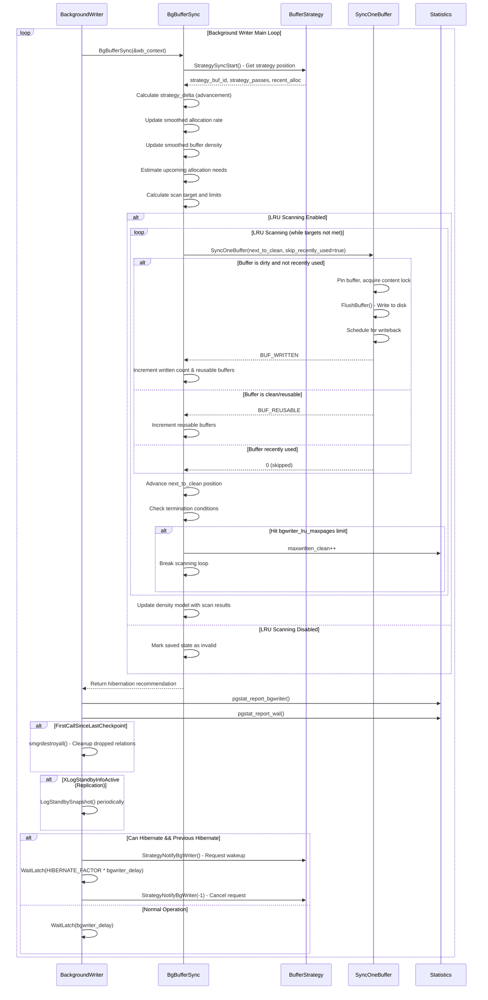

# Background Writer Component

## Overview

The Background Writer component implements PostgreSQL's proactive buffer cleaning system, continuously scanning the shared buffer pool to write dirty buffers to disk before they're needed for checkpoint operations. This component serves as a critical performance optimization mechanism, reducing checkpoint I/O spikes and improving overall system responsiveness by spreading write operations across time.

## Key Concepts

### LRU Buffer Management
The background writer works closely with the buffer replacement strategy, following the Least Recently Used (LRU) clock sweep algorithm to identify and clean buffers that are candidates for reuse.

### Adaptive Algorithms
- **Allocation Rate Tracking**: Monitors buffer allocation patterns to predict future needs
- **Density Estimation**: Tracks the ratio of clean vs dirty buffers in the pool
- **Smoothed Averaging**: Uses exponential moving averages for stable predictions
- **Hibernation Mode**: Enters low-power mode during periods of inactivity

### Buffer States
- **Reusable Buffers**: Clean buffers with zero reference count and usage count
- **Recently Used Buffers**: Buffers with non-zero usage counts (skipped by background writer)
- **Dirty Buffers**: Modified buffers requiring write-back to storage
- **Pinned Buffers**: Actively used buffers (cannot be written by background writer)

### Configuration Parameters
- `bgwriter_delay`: Sleep time between scanning cycles (default 200ms)
- `bgwriter_lru_maxpages`: Maximum pages to write per cycle (default 100)
- `bgwriter_lru_multiplier`: Multiplier for allocation-based write target (default 2.0)
- `bgwriter_flush_after`: Writeback threshold for kernel optimization (default 512kB)

## Architecture

```mermaid
graph TB
    subgraph "Background Writer Architecture"
        A[BackgroundWriterMain] --> B[Initialize Memory Context]
        B --> C[Setup Signal Handlers]
        C --> D[Main Loop Start]

        D --> E[BgBufferSync]
        E --> F[StrategySyncStart - Get Clock Position]
        F --> G[Calculate Strategy Delta]

        G --> H{LRU Scanning Enabled?}
        H --> |No| I[Return - Hibernate Mode]
        H --> |Yes| J[Update Smoothed Averages]

        J --> K[Calculate Allocation Estimates]
        K --> L[Determine Scan Target]
        L --> M[LRU Scanning Loop]

        M --> N[SyncOneBuffer - Skip Recently Used]
        N --> O{Buffer Written?}
        O --> |Yes| P[Increment Written Count]
        O --> |No| Q{Buffer Reusable?}
        Q --> |Yes| R[Increment Reusable Count]

        P --> S{Hit Max Pages Limit?}
        R --> S
        Q --> |No| S
        S --> |Yes| T[Break - Limit Reached]
        S --> |No| U{More Buffers to Scan?}

        U --> |Yes| V[Advance to Next Buffer]
        V --> N
        U --> |No| T

        T --> W[Update Statistics]
        W --> X[Return Hibernation Recommendation]

        X --> Y[Report Statistics]
        Y --> Z[Handle Checkpoints & Cleanup]
        Z --> AA{Can Hibernate?}

        AA --> |Yes| BB[Extended Sleep - Hibernation]
        AA --> |No| CC[Normal Sleep - bgwriter_delay]

        BB --> DD[Wait for Buffer Allocation Wakeup]
        CC --> DD
        DD --> D
    end

    subgraph "Hibernation Logic"
        EE[Strategy Clock Lapped] --> FF{Recent Allocations?}
        FF --> |No| GG[Enter Hibernation Mode]
        FF --> |Yes| HH[Continue Normal Operation]
        GG --> II[StrategyNotifyBgWriter - Request Wakeup]
        II --> JJ[Sleep HIBERNATE_FACTOR * bgwriter_delay]
    end

    subgraph "Buffer Allocation Feedback"
        KK[Backend Buffer Allocation] --> LL{Background Writer Hibernating?}
        LL --> |Yes| MM[Wake Background Writer]
        LL --> |No| NN[Continue Normal Allocation]
        MM --> NN
    end
```



## Core APIs

### BackgroundWriterMain

#### Purpose
Main entry point and control loop for the background writer process. Manages the continuous cycle of buffer scanning, cleaning, and system coordination while implementing adaptive hibernation for power efficiency.

#### Signature
```c
void BackgroundWriterMain(char *startup_data, size_t startup_data_len)
```

#### Detailed Description
BackgroundWriterMain implements a sophisticated background cleaning system that balances performance optimization with system resource usage. The process continuously monitors buffer pool activity and proactively cleans dirty buffers to reduce checkpoint impact.

The function operates in several phases:

1. **Initialization**: Sets up process environment and signal handling
2. **Main Loop**: Continuously cycles through buffer scanning operations
3. **Adaptive Sleeping**: Implements hibernation mode during idle periods
4. **Statistics Reporting**: Provides metrics for monitoring and tuning
5. **Error Recovery**: Handles failures with appropriate cleanup and restart

#### Key Implementation Details

**Signal Handler Setup:**
```c
pqsignal(SIGHUP, SignalHandlerForConfigReload);
pqsignal(SIGINT, SIG_IGN);  // Ignore interrupt signals
pqsignal(SIGTERM, SignalHandlerForShutdownRequest);
pqsignal(SIGUSR1, procsignal_sigusr1_handler);
```

**Main Processing Loop:**
```c
for (;;) {
    ResetLatch(MyLatch);
    HandleMainLoopInterrupts();

    // Core buffer cleaning operation
    can_hibernate = BgBufferSync(&wb_context);

    // Report statistics
    pgstat_report_bgwriter();
    pgstat_report_wal(true);

    // Cleanup after checkpoints
    if (FirstCallSinceLastCheckpoint()) {
        smgrdestroyall();
    }

    // Standby snapshot logging for replication
    if (XLogStandbyInfoActive() && !RecoveryInProgress()) {
        // Log running transactions periodically
        LogStandbySnapshot();
    }
}
```

**Adaptive Hibernation Logic:**
```c
if (rc == WL_TIMEOUT && can_hibernate && prev_hibernate) {
    // Request notification when buffers are allocated
    StrategyNotifyBgWriter(MyProcNumber);

    // Extended sleep in hibernation mode
    WaitLatch(MyLatch,
              WL_LATCH_SET | WL_TIMEOUT | WL_EXIT_ON_PM_DEATH,
              BgWriterDelay * HIBERNATE_FACTOR,
              WAIT_EVENT_BGWRITER_HIBERNATE);

    // Reset notification request
    StrategyNotifyBgWriter(-1);
}
```

#### Parameters
| Parameter | Type | Description | Constraints |
|-----------|------|-------------|-------------|
| startup_data | char* | Initialization data from postmaster | Must be NULL |
| startup_data_len | size_t | Length of startup data | Must be 0 |

#### Return Value
Function never returns under normal operation. Process termination occurs only during PostgreSQL shutdown.

#### Integration Points
- **Called by**: `AuxiliaryProcessMain` during PostgreSQL startup
- **Calls**: `BgBufferSync`, `pgstat_report_bgwriter`, `LogStandbySnapshot`
- **Shared state**: Shared buffer pool, statistics collectors
- **Coordination**: Buffer allocation strategy, checkpointer process, WAL system

#### Performance Characteristics
- **CPU Usage**: Low baseline with periodic spikes during scanning
- **I/O Pattern**: Smooth, distributed writes across time
- **Memory Usage**: Fixed working set with periodic context resets
- **Responsiveness**: Sub-second response to configuration changes

#### Error Recovery
- **Resource Cleanup**: Comprehensive cleanup of locks, buffers, and files
- **State Reset**: Memory context and writeback context reinitialization
- **Error Throttling**: Minimum 1-second sleep after errors
- **Statistics Consistency**: Proper wait event reporting during recovery

---

### BgBufferSync

#### Purpose
Core buffer scanning and cleaning logic implementing sophisticated algorithms to predict buffer allocation needs and proactively clean dirty buffers while maintaining optimal performance balance.

#### Signature
```c
bool BgBufferSync(WritebackContext *wb_context)
```

#### Detailed Description
BgBufferSync represents the algorithmic heart of PostgreSQL's background cleaning system. It implements complex predictive algorithms that analyze buffer allocation patterns, track cleaning effectiveness, and adapt behavior to maintain optimal buffer pool health.

The function operates through several algorithmic phases:

1. **Strategy Point Analysis**: Determines current position in buffer replacement cycle
2. **Allocation Rate Tracking**: Monitors recent buffer allocation patterns
3. **Density Estimation**: Calculates the effectiveness of previous cleaning cycles
4. **Predictive Targeting**: Estimates future buffer cleaning requirements
5. **LRU Scanning**: Executes targeted buffer cleaning with early termination
6. **Performance Adaptation**: Updates predictive models based on actual results

#### Key Implementation Details

**Strategy Point Synchronization:**
```c
strategy_buf_id = StrategySyncStart(&strategy_passes, &recent_alloc);

// Calculate how far the strategy clock has advanced
if (saved_info_valid) {
    int32 passes_delta = strategy_passes - prev_strategy_passes;
    strategy_delta = strategy_buf_id - prev_strategy_buf_id;
    strategy_delta += (long) passes_delta * NBuffers;
}
```

**Adaptive Density Tracking:**
```c
// Update density estimate based on allocation efficiency
if (strategy_delta > 0 && recent_alloc > 0) {
    scans_per_alloc = (float) strategy_delta / (float) recent_alloc;
    smoothed_density += (scans_per_alloc - smoothed_density) /
                        smoothing_samples;
}
```

**Allocation Rate Prediction:**
```c
// Fast-attack, slow-decline allocation rate tracking
if (smoothed_alloc <= (float) recent_alloc)
    smoothed_alloc = recent_alloc;  // Immediate response to increases
else
    smoothed_alloc += ((float) recent_alloc - smoothed_alloc) /
                      smoothing_samples;  // Gradual decline

upcoming_alloc_est = (int) (smoothed_alloc * bgwriter_lru_multiplier);
```

**Minimum Progress Guarantee:**
```c
// Ensure minimum progress even during idle periods
min_scan_buffers = (int) (NBuffers /
                         (scan_whole_pool_milliseconds / BgWriterDelay));

if (upcoming_alloc_est < (min_scan_buffers + reusable_buffers_est)) {
    upcoming_alloc_est = min_scan_buffers + reusable_buffers_est;
}
```

**LRU Scanning Loop:**
```c
while (num_to_scan > 0 && reusable_buffers < upcoming_alloc_est) {
    int sync_state = SyncOneBuffer(next_to_clean, true, wb_context);

    if (++next_to_clean >= NBuffers) {
        next_to_clean = 0;
        next_passes++;
    }
    num_to_scan--;

    if (sync_state & BUF_WRITTEN) {
        reusable_buffers++;
        if (++num_written >= bgwriter_lru_maxpages) {
            PendingBgWriterStats.maxwritten_clean++;
            break;  // Hit configured limit
        }
    } else if (sync_state & BUF_REUSABLE) {
        reusable_buffers++;
    }
}
```

#### Parameters
| Parameter | Type | Description | Constraints |
|-----------|------|-------------|-------------|
| wb_context | WritebackContext* | Writeback coordination context | Must be initialized |

#### Return Value
Returns `true` if background writer should enter hibernation mode (strategy clock lapped and no recent allocations), `false` for continued normal operation.

#### Integration Points
- **Called by**: `BackgroundWriterMain` in main processing loop
- **Calls**: `StrategySyncStart`, `SyncOneBuffer`
- **Shared state**: Buffer replacement strategy state, allocation statistics
- **Coordination**: Buffer allocation strategy, checkpoint operations

#### Algorithm Parameters

**Moving Average Control:**
- `smoothing_samples = 16`: Controls averaging period for adaptation
- `scan_whole_pool_milliseconds = 120000`: Target for complete pool scan

**Behavioral Thresholds:**
- `bgwriter_lru_maxpages`: Maximum buffers to clean per cycle
- `bgwriter_lru_multiplier`: Scaling factor for allocation prediction

#### Performance Optimization

**Early Termination Conditions:**
1. **Buffer Limit**: Stops at `bgwriter_lru_maxpages` to prevent excessive work
2. **Target Achievement**: Stops when sufficient reusable buffers are available
3. **Strategy Lap**: Stops when catching up to replacement strategy
4. **Configuration Disable**: Returns immediately if `bgwriter_lru_maxpages <= 0`

**Prediction Accuracy:**
- Tracks actual vs predicted buffer requirements
- Adjusts models based on observed cleaning effectiveness
- Maintains separate estimates for allocation rate and buffer density

#### Hibernation Logic

The function implements sophisticated hibernation detection:

```c
// Hibernate when:
// 1. Strategy clock hasn't advanced (bufs_to_lap == 0)
// 2. No recent buffer allocations (recent_alloc == 0)
return (bufs_to_lap == 0 && recent_alloc == 0);
```

This allows power-efficient operation during idle periods while ensuring rapid response when activity resumes.

## Data Structures

### Buffer Scanning State
Static variables maintaining state between BgBufferSync calls:

```c
static bool saved_info_valid = false;       // State validity flag
static int  prev_strategy_buf_id;           // Previous strategy position
static uint32 prev_strategy_passes;        // Previous strategy pass count
static int  next_to_clean;                 // Next buffer to examine
static uint32 next_passes;                 // Pass count for next_to_clean

static float smoothed_alloc = 0;            // Moving average allocation rate
static float smoothed_density = 10.0;      // Moving average buffer density
```

### WritebackContext
Kernel-level I/O optimization structure:

```c
typedef struct WritebackContext {
    int     max_pending;        // Maximum pending writebacks
    int     nr_pending;         // Current pending count
    BlockNumber *pending;       // Array of pending block numbers
    // Additional fields for optimization
} WritebackContext;
```

### Background Writer Statistics
Performance metrics collected during operation:

```c
typedef struct BgWriterStats {
    PgStat_Counter buf_written_clean;      // Buffers written by bgwriter
    PgStat_Counter maxwritten_clean;       // Times hit bgwriter_lru_maxpages
    PgStat_Counter buf_alloc;              // Buffer allocations
} BgWriterStats;
```

## Processing Flow



## Implementation Notes

### Adaptive Algorithm Design

The background writer implements sophisticated adaptive algorithms:

**Allocation Rate Tracking:**
- Fast-attack response: immediately follows allocation increases
- Slow-decline behavior: gradually reduces estimates during idle periods
- Prevents underflow: resets to zero when predictions reach zero

**Density Estimation:**
- Tracks scans-per-allocation ratio as measure of buffer pool health
- Uses exponential moving average for stability
- Updates based on both strategy advancement and bgwriter scanning

**Prediction Integration:**
- Combines allocation rate and density estimates
- Scales by `bgwriter_lru_multiplier` for tuning
- Ensures minimum progress during idle periods

### Hibernation Strategy

The background writer implements power-efficient hibernation:

**Hibernation Conditions:**
1. Strategy clock hasn't advanced (no buffer pressure)
2. No recent buffer allocations (system idle)
3. Previous cycle also indicated hibernation readiness

**Hibernation Behavior:**
- Requests wakeup notification from buffer strategy
- Sleeps for extended period (HIBERNATE_FACTOR * bgwriter_delay)
- Immediately responds to buffer allocation activity

**Wake-up Mechanism:**
- Backend processes notify bgwriter when allocating buffers
- Ensures rapid response when system becomes active
- Avoids unnecessary CPU usage during idle periods

### Buffer Scanning Strategy

The LRU scanning implements several optimizations:

**Skip Recently Used Buffers:**
```c
SyncOneBuffer(next_to_clean, true, wb_context);
// skip_recently_used = true prevents writing hot pages
```

**Early Termination:**
- Stops when sufficient reusable buffers are available
- Respects `bgwriter_lru_maxpages` limit to prevent I/O spikes
- Avoids lapping the strategy clock (scanning already-clean buffers)

**Progress Tracking:**
- Maintains position across multiple cycles
- Handles wraparound at buffer pool boundaries
- Adapts to changes in strategy clock advancement

### Configuration Tuning Guidelines

**bgwriter_delay (default 200ms):**
- Lower values: More responsive cleaning, higher CPU usage
- Higher values: Less overhead, potentially larger checkpoint spikes

**bgwriter_lru_maxpages (default 100):**
- Higher values: More aggressive cleaning, potential I/O spikes
- Lower values: Less cleaning, larger checkpoint impact
- Zero: Disables LRU scanning entirely

**bgwriter_lru_multiplier (default 2.0):**
- Higher values: More conservative cleaning (more buffers cleaned)
- Lower values: More aggressive allocation assumptions

### Integration with Checkpointing

The background writer coordinates with checkpointing:

**Checkpoint Interaction:**
- Reduces checkpoint I/O load by pre-cleaning dirty buffers
- Continues operation during checkpoints (different buffer selection)
- Cleans up resources after checkpoint completion

**Shared Buffer Coordination:**
- Uses same `SyncOneBuffer` function as checkpoint system
- Respects buffer pin counts and usage statistics
- Coordinates with writeback system for kernel optimization

### Performance Monitoring

Key metrics for background writer performance:

**Buffer Statistics:**
- `buf_written_clean`: Buffers written by background writer
- `maxwritten_clean`: Times hit the per-cycle limit
- `buf_alloc`: Total buffer allocations

**Operational Metrics:**
- Strategy clock advancement rate
- Allocation rate predictions vs actual
- Buffer density estimates
- Hibernation frequency and duration

This background writer component serves as a critical performance optimization system, implementing sophisticated predictive algorithms that maintain optimal buffer pool health while minimizing system resource usage through adaptive hibernation and intelligent scanning strategies.