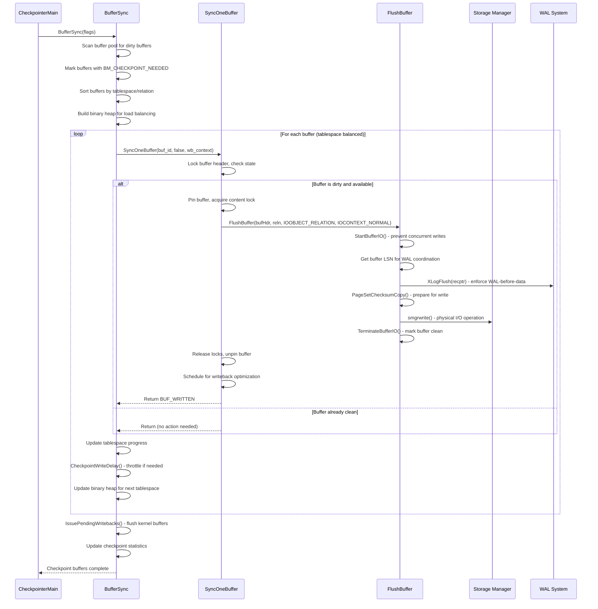

# Buffer Flushing Component

## Overview

The Buffer Flushing component is responsible for efficiently writing dirty buffers from PostgreSQL's shared buffer pool to persistent storage during checkpoint operations. This component implements sophisticated I/O scheduling, tablespace load balancing, and performance throttling to minimize system impact while ensuring data consistency. It serves as the critical bridge between in-memory buffer management and physical storage operations.

## Key Concepts

### Buffer States and Flags
- **BM_DIRTY**: Buffer contains modified data that needs to be written
- **BM_PERMANENT**: Buffer belongs to a permanent (logged) relation
- **BM_CHECKPOINT_NEEDED**: Buffer marked for checkpoint processing
- **BM_IO_IN_PROGRESS**: Buffer is currently being written to disk
- **BM_JUST_DIRTIED**: Buffer was modified during write operation

### I/O Scheduling Strategy
- **Tablespace Balancing**: Distributes writes across tablespaces to avoid hotspots
- **Progress-Based Throttling**: Uses completion targets to spread I/O load
- **Priority Queuing**: Binary heap structures optimize write ordering
- **Write Coalescing**: Groups related writes for improved efficiency

### WAL-Before-Data Rule
Critical consistency requirement that ensures WAL records reach disk before corresponding data pages, preventing torn page scenarios and maintaining crash recovery integrity.

## Architecture

```mermaid
graph TB
    subgraph "Buffer Flushing Architecture"
        A[BufferSync] --> B[Mark BM_CHECKPOINT_NEEDED]
        B --> C[Sort by Tablespace/Relation]
        C --> D[Build Binary Heap]

        D --> E{Tablespace Balancing}
        E --> F[Select Next Buffer]
        F --> G[SyncOneBuffer]

        G --> H{Buffer Still Dirty?}
        H --> |Yes| I[FlushBuffer]
        H --> |No| J[Skip - Already Clean]

        I --> K[XLogFlush - WAL Before Data]
        K --> L[PageSetChecksumCopy]
        L --> M[smgrwrite - Physical I/O]
        M --> N[ScheduleBufferTagForWriteback]

        N --> O[CheckpointWriteDelay]
        O --> P{More Buffers?}
        P --> |Yes| E
        P --> |No| Q[IssuePendingWritebacks]
    end

    subgraph "I/O Throttling"
        R[CheckpointWriteDelay] --> S{On Schedule?}
        S --> |Yes| T[Sleep 100ms]
        S --> |No| U[Catch Up Quickly]
        T --> V[AbsorbSyncRequests]
        U --> V
    end
```



## Core APIs

### BufferSync

#### Purpose
Central orchestrator for checkpoint buffer synchronization. Implements comprehensive I/O scheduling that balances writes across tablespaces while maintaining optimal performance characteristics.

#### Signature
```c
static void BufferSync(int flags)
```

#### Detailed Description
BufferSync represents the most sophisticated part of PostgreSQL's checkpoint system, implementing a multi-phase algorithm that balances competing requirements:

1. **Buffer Identification Phase**: Scans entire buffer pool to identify dirty buffers
2. **Sorting and Organization**: Orders buffers by tablespace and relation for optimal I/O patterns
3. **Tablespace Balancing**: Uses binary heap to distribute writes across tablespaces
4. **Throttled Execution**: Applies rate limiting to meet completion targets
5. **Writeback Coordination**: Manages kernel-level write scheduling

#### Key Implementation Details

**Buffer Marking Phase:**
```c
// Mark buffers needing checkpoint attention
for (buf_id = 0; buf_id < NBuffers; buf_id++) {
    buf_state = LockBufHdr(bufHdr);
    if ((buf_state & mask) == mask) {
        buf_state |= BM_CHECKPOINT_NEEDED;
        // Add to checkpoint buffer list
    }
}
```

**Tablespace Load Balancing:**
```c
// Build binary heap for tablespace progress tracking
ts_heap = binaryheap_allocate(num_spaces,
                             ts_ckpt_progress_comparator, NULL);

// Balance writes across tablespaces
while (!binaryheap_empty(ts_heap)) {
    ts_stat = (CkptTsStatus *) DatumGetPointer(binaryheap_first(ts_heap));
    // Process buffer from least-progressed tablespace
}
```

**Progress-Based Throttling:**
```c
CheckpointWriteDelay(flags, (double) num_processed / num_to_scan);
```

#### Parameters
| Parameter | Type | Description | Constraints |
|-----------|------|-------------|-------------|
| flags | int | Checkpoint control flags | CHECKPOINT_* constants |

#### Key Flags Impact
- `CHECKPOINT_IMMEDIATE`: Disables throttling for urgent checkpoints
- `CHECKPOINT_IS_SHUTDOWN`: Forces writing of unlogged relation buffers
- `CHECKPOINT_FLUSH_ALL`: Includes normally-skipped buffer types

#### Return Value
No return value. Modifies buffer pool state and writes dirty buffers to storage.

#### Integration Points
- **Called by**: `CheckPointBuffers` during checkpoint execution
- **Calls**: `SyncOneBuffer`, `CheckpointWriteDelay`, `IssuePendingWritebacks`
- **Shared state**: Global buffer pool, tablespace I/O statistics
- **Coordination**: WAL system for LSN-based ordering

#### Performance Characteristics
- **Time Complexity**: O(N log K) where N=buffers, K=tablespaces
- **I/O Pattern**: Optimized sequential access within relations
- **Memory Usage**: O(N) for buffer sorting plus O(K) for tablespace tracking
- **Scalability**: Linear scaling with buffer pool size

---

### SyncOneBuffer

#### Purpose
Processes individual buffer synchronization with comprehensive state checking and coordination with other PostgreSQL processes. Serves as the atomic unit of buffer flushing operations.

#### Signature
```c
static int SyncOneBuffer(int buf_id, bool skip_recently_used, WritebackContext *wb_context)
```

#### Detailed Description
SyncOneBuffer implements the core logic for individual buffer processing, handling the complex interaction between buffer state management, concurrency control, and physical I/O operations. It must coordinate safely with concurrent buffer usage by other processes.

The function operates in several phases:

1. **State Validation**: Checks if buffer needs writing and is available
2. **Buffer Pinning**: Safely acquires exclusive access to buffer
3. **Write Coordination**: Delegates to FlushBuffer for physical I/O
4. **Writeback Scheduling**: Queues buffer for kernel-level optimization
5. **Resource Cleanup**: Releases pins and locks properly

#### Key Implementation Details

**Concurrent Safety Checks:**
```c
buf_state = LockBufHdr(bufHdr);

// Check if buffer is reusable (refcount=0, usagecount=0)
if (BUF_STATE_GET_REFCOUNT(buf_state) == 0 &&
    BUF_STATE_GET_USAGECOUNT(buf_state) == 0) {
    result |= BUF_REUSABLE;
}

// Skip recently used buffers if requested
if (skip_recently_used && (refcount > 0 || usagecount > 0)) {
    return result;
}
```

**Buffer State Validation:**
```c
if (!(buf_state & BM_VALID) || !(buf_state & BM_DIRTY)) {
    // Buffer is clean, nothing to do
    UnlockBufHdr(bufHdr, buf_state);
    return result;
}
```

**Safe Buffer Access:**
```c
// Pin buffer to prevent eviction during I/O
PinBuffer_Locked(bufHdr);
LWLockAcquire(BufferDescriptorGetContentLock(bufHdr), LW_SHARED);

FlushBuffer(bufHdr, NULL, IOOBJECT_RELATION, IOCONTEXT_NORMAL);

LWLockRelease(BufferDescriptorGetContentLock(bufHdr));
UnpinBuffer(bufHdr);
```

#### Parameters
| Parameter | Type | Description | Constraints |
|-----------|------|-------------|-------------|
| buf_id | int | Buffer pool index | Must be valid buffer ID (0 to NBuffers-1) |
| skip_recently_used | bool | Skip buffers with active usage | Used by background writer |
| wb_context | WritebackContext* | Writeback coordination context | Must be initialized |

#### Return Value
Bitmask containing:
- `BUF_WRITTEN`: Buffer was successfully written to storage
- `BUF_REUSABLE`: Buffer is available for immediate reuse

#### Integration Points
- **Called by**: `BufferSync`, `BgBufferSync` (background writer)
- **Calls**: `FlushBuffer`, `ScheduleBufferTagForWriteback`
- **Shared state**: Individual buffer descriptors, writeback context
- **Coordination**: Buffer replacement strategy, I/O scheduling

#### Concurrency Handling
- **Lock Ordering**: Header lock → Content lock to prevent deadlocks
- **Pin Management**: Prevents buffer eviction during I/O operations
- **Race Conditions**: Handles concurrent buffer modifications gracefully

---

### FlushBuffer

#### Purpose
Performs the actual physical I/O operation to write buffer contents to disk, implementing critical WAL-before-data consistency rules and coordinating with the storage manager subsystem.

#### Signature
```c
static void FlushBuffer(BufferDesc *buf, SMgrRelation reln, IOObject io_object, IOContext io_context)
```

#### Detailed Description
FlushBuffer represents the lowest level of PostgreSQL's buffer flushing hierarchy, implementing the actual physical write operations while maintaining strict consistency guarantees. This function is critical for database durability and crash recovery.

The function implements the complete write sequence:

1. **I/O State Management**: Prevents concurrent writes to same buffer
2. **WAL Consistency**: Ensures WAL records precede data writes
3. **Checksum Handling**: Computes and validates page checksums
4. **Physical I/O**: Delegates to storage manager for disk operations
5. **State Cleanup**: Updates buffer state and statistics

#### Key Implementation Details

**I/O Coordination:**
```c
if (!StartBufferIO(buf, false, false))
    return;  // Someone else already flushed this buffer
```

**WAL-Before-Data Rule Enforcement:**
```c
recptr = BufferGetLSN(buf);

// Critical consistency rule: WAL must reach disk before data
if (buf_state & BM_PERMANENT)
    XLogFlush(recptr);
```

**Checksum Handling:**
```c
// Create private copy for checksum calculation
// (prevents interference from concurrent hint bit updates)
bufToWrite = PageSetChecksumCopy((Page) bufBlock, buf->tag.blockNum);
```

**Physical Write Operation:**
```c
smgrwrite(reln,
          BufTagGetForkNum(&buf->tag),
          buf->tag.blockNum,
          bufToWrite,
          false);
```

**I/O Statistics and State Cleanup:**
```c
pgstat_count_io_op_time(IOOBJECT_RELATION, io_context,
                        IOOP_WRITE, io_start, 1);
pgBufferUsage.shared_blks_written++;

// Mark buffer clean and end I/O operation
TerminateBufferIO(buf, true, 0, true);
```

#### Parameters
| Parameter | Type | Description | Constraints |
|-----------|------|-------------|-------------|
| buf | BufferDesc* | Buffer descriptor to flush | Must be pinned and content-locked |
| reln | SMgrRelation | Storage manager relation handle | NULL for auto-open |
| io_object | IOObject | I/O object type for statistics | Usually IOOBJECT_RELATION |
| io_context | IOContext | I/O context for statistics | Context-specific for tracking |

#### Return Value
No return value. Buffer state is updated to reflect successful write operation.

#### Integration Points
- **Called by**: `SyncOneBuffer`, various buffer management functions
- **Calls**: `XLogFlush`, `smgrwrite`, `PageSetChecksumCopy`
- **Shared state**: Buffer descriptor state, I/O statistics
- **Coordination**: WAL system, storage manager, statistics collector

#### Error Handling
- **I/O Errors**: Uses error callback for detailed diagnostics
- **Consistency Violations**: Panics on WAL-before-data violations
- **Resource Cleanup**: Automatic via StartBufferIO/TerminateBufferIO pairing

#### Performance Impact
- **WAL Flushing**: May block on WAL I/O completion
- **Checksum Calculation**: CPU overhead for data integrity
- **Storage I/O**: Primary source of checkpoint latency

---

### CheckpointWriteDelay

#### Purpose
Implements adaptive I/O throttling during checkpoint operations to meet completion targets while maintaining system responsiveness. Controls the rate of buffer writes to spread checkpoint load over the configured time period.

#### Signature
```c
void CheckpointWriteDelay(int flags, double progress)
```

#### Detailed Description
CheckpointWriteDelay implements PostgreSQL's checkpoint throttling algorithm, balancing the competing requirements of checkpoint completion timeliness and system performance impact. It uses sophisticated scheduling logic to determine when to pause checkpoint progress.

The function considers multiple factors:

1. **Progress Assessment**: Compares actual vs. target completion rate
2. **System Load**: Monitors for shutdown or immediate requests
3. **Configuration Updates**: Handles dynamic parameter changes
4. **Resource Management**: Processes pending fsync requests
5. **Archive Management**: Coordinates with WAL archiving

#### Key Implementation Details

**Throttling Decision Logic:**
```c
if (!(flags & CHECKPOINT_IMMEDIATE) &&
    !ShutdownRequestPending &&
    !ImmediateCheckpointRequested() &&
    IsCheckpointOnSchedule(progress)) {
    // Conditions met for throttling
    WaitLatch(MyLatch, WL_LATCH_SET | WL_EXIT_ON_PM_DEATH | WL_TIMEOUT,
              100, WAIT_EVENT_CHECKPOINT_WRITE_DELAY);
}
```

**Configuration Management:**
```c
if (ConfigReloadPending) {
    ConfigReloadPending = false;
    ProcessConfigFile(PGC_SIGHUP);
    UpdateSharedMemoryConfig();
}
```

**Resource Absorption:**
```c
// Prevent fsync request queue overflow
AbsorbSyncRequests();
CheckArchiveTimeout();
pgstat_report_checkpointer();
```

#### Parameters
| Parameter | Type | Description | Constraints |
|-----------|------|-------------|-------------|
| flags | int | Checkpoint control flags | CHECKPOINT_* constants affect behavior |
| progress | double | Completion fraction (0.0 to 1.0) | Used for schedule assessment |

#### Key Behavioral Modes
- **CHECKPOINT_IMMEDIATE**: Skips all delays for urgent completion
- **Normal Operation**: 100ms sleep when on schedule
- **Catch-up Mode**: No delays when behind schedule
- **Shutdown Mode**: Accelerated processing during system shutdown

#### Return Value
No return value. Function may block caller for specified delay period.

#### Integration Points
- **Called by**: `BufferSync` after each buffer write
- **Calls**: `IsCheckpointOnSchedule`, `AbsorbSyncRequests`, `WaitLatch`
- **Shared state**: Checkpointer process state, configuration variables
- **Coordination**: Archive timeout management, statistics reporting

#### Performance Tuning
- **checkpoint_completion_target**: Primary tuning parameter (0.1 to 0.9)
- **Dynamic Adjustment**: Responds to system load and progress rate
- **Feedback Loop**: Uses actual progress to adjust future delays

## Data Structures

### CkptTsStatus
Tracks per-tablespace checkpoint progress for load balancing:

```c
typedef struct CkptTsStatus {
    Oid     tsId;               // Tablespace OID
    int     index;              // Current position in buffer list
    int     num_to_scan;        // Total buffers in this tablespace
    int     num_scanned;        // Buffers processed so far
    float8  progress;           // Weighted progress for balancing
    float8  progress_slice;     // Progress increment per buffer
} CkptTsStatus;
```

### CkptSortItem
Individual buffer entry for checkpoint processing:

```c
typedef struct CkptSortItem {
    int         buf_id;         // Buffer pool index
    Oid         tsId;           // Tablespace OID
    RelFileNumber relNumber;    // Relation file number
    ForkNumber  forkNum;        // Fork number (main, FSM, VM, etc.)
    BlockNumber blockNum;       // Block number within file
} CkptSortItem;
```

### WritebackContext
Coordinates kernel-level write optimization:

```c
typedef struct WritebackContext {
    int     max_pending;        // Maximum pending writebacks
    int     nr_pending;         // Current pending count
    // ... additional fields for writeback management
} WritebackContext;
```

## Processing Flow



## Implementation Notes

### Tablespace Load Balancing Algorithm

The buffer flushing system implements sophisticated load balancing to prevent I/O hotspots:

```c
// Progress-based selection ensures even distribution
ts_stat->progress_slice = (float8) num_to_scan / ts_stat->num_to_scan;

// Binary heap maintains tablespace ordering by progress
while (!binaryheap_empty(ts_heap)) {
    ts_stat = (CkptTsStatus *) DatumGetPointer(binaryheap_first(ts_heap));
    // Process buffer from least-progressed tablespace
    // Update progress and rebalance heap
}
```

### WAL-Before-Data Consistency

Critical consistency rule implementation:

1. **LSN Capture**: Record buffer's LSN before any modifications
2. **WAL Flushing**: Force WAL to disk up to buffer's LSN
3. **Data Writing**: Only then proceed with buffer write to storage
4. **Exception Handling**: Skip WAL flush for unlogged relations (fake LSNs)

### I/O Optimization Strategies

Several techniques minimize checkpoint performance impact:

- **Write Sorting**: Orders buffers by (tablespace, relation, fork, block) for sequential I/O
- **Writeback Coordination**: Groups writes for kernel-level optimization
- **Throttling**: Spreads I/O load across `checkpoint_completion_target` timeframe
- **Progress Tracking**: Adapts rate based on actual vs. target progress

### Error Recovery and Edge Cases

The buffer flushing system handles numerous edge cases:

- **Concurrent Buffer Cleaning**: Gracefully handles buffers cleaned by other processes
- **Buffer Replacement**: Coordinates with buffer eviction during high memory pressure
- **I/O Errors**: Provides detailed error context for failed write operations
- **Shutdown Coordination**: Accelerates flushing during system shutdown

### Performance Monitoring

Key metrics tracked during buffer flushing:

- `CheckpointStats.ckpt_bufs_written`: Buffers written by checkpoint
- `pgBufferUsage.shared_blks_written`: Total shared buffer writes
- `PendingCheckpointerStats.buffers_written`: Incremental write counts
- Per-tablespace progress tracking for load balancing assessment

This buffer flushing component serves as the performance-critical heart of PostgreSQL's checkpoint system, implementing sophisticated algorithms that balance data consistency, system performance, and I/O efficiency across diverse workload patterns and storage configurations.