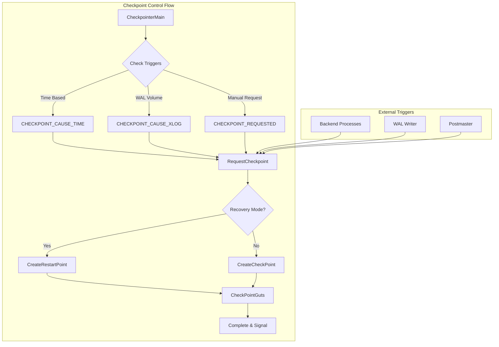
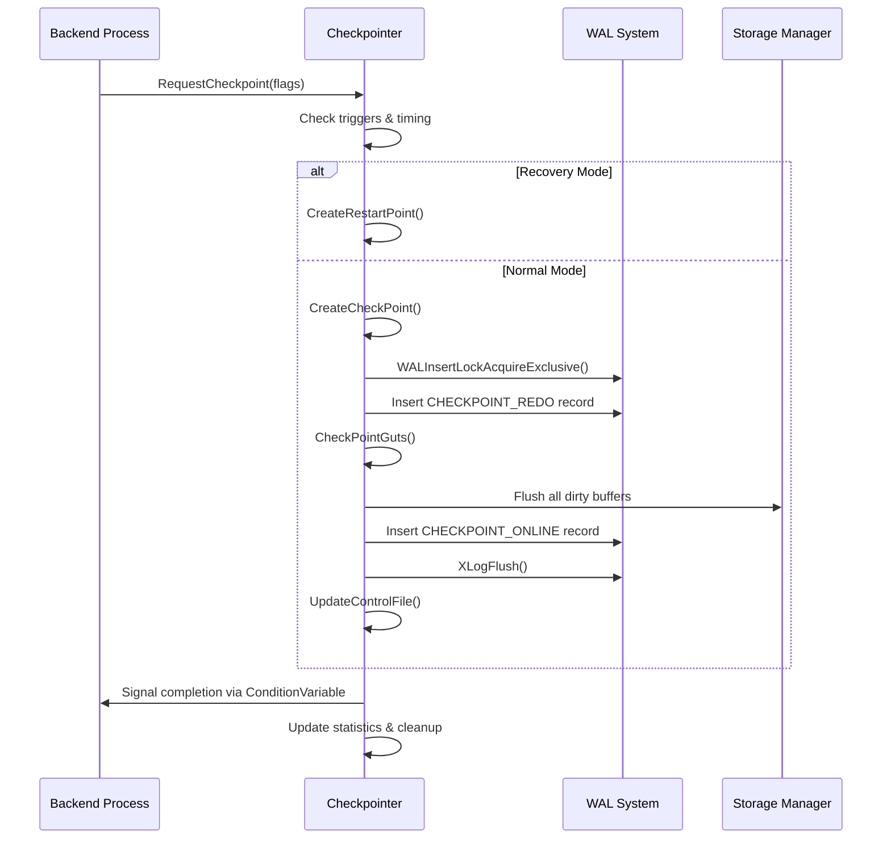

# Checkpoint Control Component

## Overview

The Checkpoint Control component serves as the central orchestrator for PostgreSQL's checkpointing subsystem. It manages checkpoint scheduling, coordinates between different checkpoint triggers, and ensures proper sequencing of checkpoint operations. This component is critical for maintaining database consistency, crash recovery capability, and optimal I/O performance.

## Key Concepts

### Checkpoint Types
- **Regular Checkpoints**: Periodic consistency points driven by time or WAL volume
- **Shutdown Checkpoints**: Final checkpoint during clean database shutdown
- **End-of-Recovery Checkpoints**: Transition point from recovery to normal operation
- **Restart Points**: Recovery-time equivalents created during WAL replay

### Checkpoint Flags
- `CHECKPOINT_IS_SHUTDOWN`: Clean shutdown checkpoint
- `CHECKPOINT_END_OF_RECOVERY`: Recovery completion checkpoint
- `CHECKPOINT_IMMEDIATE`: Skip completion target throttling
- `CHECKPOINT_FORCE`: Force checkpoint even if no activity
- `CHECKPOINT_WAIT`: Block caller until completion
- `CHECKPOINT_CAUSE_XLOG`: Triggered by WAL volume
- `CHECKPOINT_CAUSE_TIME`: Triggered by timeout

## Architecture



## Core APIs

### CheckpointerMain

#### Purpose
Main entry point and control loop for the checkpointer process. Manages all checkpoint scheduling, triggering logic, and coordination with other PostgreSQL processes.

#### Signature
```c
void CheckpointerMain(char *startup_data, size_t startup_data_len)
```

#### Detailed Description
CheckpointerMain implements the core scheduling and orchestration logic for PostgreSQL's checkpointing system. It runs as a continuous loop in a dedicated background process, monitoring multiple checkpoint triggers and coordinating checkpoint execution.

The function operates in several phases:

1. **Initialization**: Sets up signal handlers, memory contexts, and shared memory structures
2. **Main Loop**: Continuously monitors triggers and executes checkpoints
3. **Error Recovery**: Handles checkpoint failures and resource cleanup
4. **Process Coordination**: Manages communication with backend processes

#### Key Implementation Details

**Signal Handling:**
- `SIGINT`: Checkpoint request from backends (`ReqCheckpointHandler`)
- `SIGUSR2`: Shutdown request from postmaster
- `SIGHUP`: Configuration reload
- `SIGTERM`: Ignored (waits for proper shutdown sequence)

**Checkpoint Triggering Logic:**
```c
// Time-based triggering
elapsed_secs = now - last_checkpoint_time;
if (elapsed_secs >= CheckPointTimeout) {
    do_checkpoint = true;
    flags |= CHECKPOINT_CAUSE_TIME;
}

// Request-based triggering
if (CheckpointerShmem->ckpt_flags) {
    do_checkpoint = true;
    chkpt_or_rstpt_requested = true;
}
```

**Recovery vs Normal Mode Decision:**
```c
do_restartpoint = RecoveryInProgress();
if (flags & CHECKPOINT_END_OF_RECOVERY)
    do_restartpoint = false;
```

#### Parameters
| Parameter | Type | Description | Constraints |
|-----------|------|-------------|-------------|
| startup_data | char* | Initialization data from postmaster | Must be NULL |
| startup_data_len | size_t | Length of startup data | Must be 0 |

#### Return Value
Function never returns under normal operation. Process exit occurs only during PostgreSQL shutdown.

#### Integration Points
- **Called by**: `AuxiliaryProcessMain` during PostgreSQL startup
- **Calls**: `CreateCheckPoint`, `CreateRestartPoint`, `AbsorbSyncRequests`
- **Shared state**: `CheckpointerShmem` for process coordination
- **Signals**: Communicates with backends via condition variables and shared memory flags

#### Performance Characteristics
- **CPU Usage**: Low during idle periods, moderate during active checkpointing
- **Memory**: Fixed working set in dedicated memory context with periodic resets
- **I/O Impact**: Indirect through checkpoint execution coordination
- **Latency**: Sub-second response to checkpoint requests

---

### RequestCheckpoint

#### Purpose
Primary interface for backend processes to request checkpoints. Handles different checkpoint types, manages request flags, and provides synchronous/asynchronous execution modes.

#### Signature
```c
void RequestCheckpoint(int flags)
```

#### Detailed Description
RequestCheckpoint serves as the coordination point between backend processes and the checkpointer process. It uses shared memory structures and condition variables to safely communicate checkpoint requests across process boundaries.

The function implements a request/response pattern with the following sequence:

1. **Standalone Mode Check**: Direct execution if not in multi-process environment
2. **Atomic Flag Setting**: Uses spinlocks to safely update request flags
3. **Process Signaling**: Wakes checkpointer process via latch mechanism
4. **Optional Waiting**: Blocks until completion if `CHECKPOINT_WAIT` specified

#### Key Implementation Details

**Atomic Request Processing:**
```c
SpinLockAcquire(&CheckpointerShmem->ckpt_lck);
old_failed = CheckpointerShmem->ckpt_failed;
old_started = CheckpointerShmem->ckpt_started;
CheckpointerShmem->ckpt_flags |= (flags | CHECKPOINT_REQUESTED);
SpinLockRelease(&CheckpointerShmem->ckpt_lck);
```

**Process Signaling:**
```c
SetLatch(ProcGlobal->checkpointerLatch);
```

**Synchronous Completion (CHECKPOINT_WAIT):**
```c
for (ntries = 0; ntries < MAX_CHECKPOINT_TRIES; ntries++) {
    ConditionVariableTimedSleep(&CheckpointerShmem->start_cv,
                               CHECK_TIMEOUT, WAIT_EVENT_CHECKPOINT_START);
    // Check if checkpoint started and completed
}
```

#### Parameters
| Parameter | Type | Description | Constraints |
|-----------|------|-------------|-------------|
| flags | int | Bitwise OR of checkpoint flags | Must be valid flag combination |

#### Checkpoint Flag Details
- `CHECKPOINT_IS_SHUTDOWN`: Forces immediate completion, sets database state
- `CHECKPOINT_IMMEDIATE`: Bypasses `checkpoint_completion_target` throttling
- `CHECKPOINT_FORCE`: Executes even without WAL activity since last checkpoint
- `CHECKPOINT_WAIT`: Blocks caller until checkpoint completion
- `CHECKPOINT_CAUSE_XLOG`: Indicates WAL volume trigger (affects logging)

#### Return Value
Returns when checkpoint request is submitted (asynchronous) or completed (synchronous with `CHECKPOINT_WAIT`).

#### Integration Points
- **Called by**: Backend processes, WAL writer, shutdown sequences
- **Calls**: `CreateCheckPoint` (in standalone mode), `SetLatch`
- **Shared state**: `CheckpointerShmem` for cross-process communication
- **Synchronization**: Condition variables for completion notification

#### Error Handling
- **Timeout Handling**: Retries with exponential backoff if checkpointer busy
- **Process Failure**: Detects checkpointer death and handles gracefully
- **Resource Cleanup**: Automatic cleanup on process termination

---

### CreateCheckPoint

#### Purpose
Core checkpoint execution function that coordinates all aspects of checkpoint creation including buffer synchronization, WAL coordination, and control file updates.

#### Signature
```c
void CreateCheckPoint(int flags)
```

#### Detailed Description
CreateCheckPoint implements the complete checkpoint algorithm, orchestrating all subsystems involved in creating a consistent database state. It follows a carefully designed sequence to maintain ACID properties while minimizing system impact.

The checkpoint process follows these major phases:

1. **Preparation**: Initialize checkpoint record, determine REDO point
2. **Critical Section**: Prevent concurrent modifications during state capture
3. **Buffer Synchronization**: Flush all dirty buffers to stable storage
4. **WAL Coordination**: Ensure proper write-ahead logging sequence
5. **Control File Update**: Atomically update recovery metadata
6. **Cleanup**: Remove obsolete WAL files and update statistics

#### Key Implementation Details

**Checkpoint Record Initialization:**
```c
checkPoint.time = (pg_time_t) time(NULL);
checkPoint.ThisTimeLineID = XLogCtl->InsertTimeLineID;
checkPoint.fullPageWrites = Insert->fullPageWrites;
checkPoint.wal_level = wal_level;
```

**REDO Point Determination:**
- **Shutdown Checkpoints**: REDO point = current insertion point
- **Online Checkpoints**: REDO point = location of CHECKPOINT_REDO record

**Critical Section Management:**
```c
START_CRIT_SECTION();
// Critical operations that must complete atomically
WALInsertLockAcquireExclusive();
// Update REDO pointer and other critical state
WALInsertLockRelease();
END_CRIT_SECTION();
```

**Transaction Coordination:**
```c
vxids = GetVirtualXIDsDelayingChkpt(&nvxids, DELAY_CHKPT_START);
while (HaveVirtualXIDsDelayingChkpt(vxids, nvxids, DELAY_CHKPT_START)) {
    AbsorbSyncRequests();
    pg_usleep(10000L); // Wait for transactions to complete
}
```

#### Parameters
| Parameter | Type | Description | Constraints |
|-----------|------|-------------|-------------|
| flags | int | Checkpoint control flags | Combination of CHECKPOINT_* constants |

#### Return Value
No return value. Throws ERROR on failure, ensuring checkpoint completion or process termination.

#### Integration Points
- **Called by**: `CheckpointerMain`, `RequestCheckpoint` (standalone mode)
- **Calls**: `CheckPointGuts`, `XLogFlush`, `UpdateControlFile`
- **Shared state**: Control file, shared buffer pool, WAL insertion state
- **Coordination**: Transaction system, replication slots, background processes

#### Performance Characteristics
- **Duration**: Seconds to minutes depending on buffer pool size and I/O capacity
- **I/O Impact**: Major - flushes all dirty buffers and synchronizes WAL
- **CPU Usage**: Moderate during execution, minimal during I/O waits
- **Memory Usage**: Temporary allocations for buffer sorting and metadata

#### Error Recovery
- **Partial Completion**: Uses critical sections to ensure atomicity
- **Resource Cleanup**: Automatic cleanup via process exit handlers
- **Failure Notification**: Signals waiting processes about checkpoint failure

## Data Structures

### CheckpointerShmemStruct
Central shared memory structure coordinating checkpointer process with backends:

```c
typedef struct CheckpointerShmemStruct {
    pid_t       checkpointer_pid;    // Checkpointer process ID

    // Checkpoint request coordination
    slock_t     ckpt_lck;           // Spinlock protecting request state
    int         ckpt_flags;         // OR'd checkpoint request flags
    int         ckpt_started;       // Number of checkpoints started
    int         ckpt_done;          // Number of checkpoints completed
    int         ckpt_failed;        // Number of checkpoints failed

    // Process synchronization
    ConditionVariable start_cv;     // Notifies checkpoint start
    ConditionVariable done_cv;      // Notifies checkpoint completion
} CheckpointerShmemStruct;
```

### CheckPoint
WAL record structure containing checkpoint metadata:

```c
typedef struct CheckPoint {
    XLogRecPtr  redo;               // REDO point for recovery
    TimeLineID  ThisTimeLineID;     // Current timeline ID
    TimeLineID  PrevTimeLineID;     // Previous timeline ID
    bool        fullPageWrites;     // Full page write setting
    int         wal_level;          // WAL level at checkpoint
    pg_time_t   time;              // Checkpoint timestamp

    // Transaction state
    TransactionId nextXid;          // Next transaction ID
    TransactionId oldestXid;        // Oldest active transaction
    TransactionId oldestActiveXid;  // Oldest active for Hot Standby

    // Object ID state
    Oid         nextOid;            // Next object ID

    // MultiXact state
    MultiXactId nextMulti;          // Next MultiXact ID
    MultiXactOffset nextMultiOffset; // Next MultiXact offset
    MultiXactId oldestMulti;        // Oldest MultiXact ID
    Oid         oldestMultiDB;      // Database with oldest MultiXact

    // Commit timestamp state
    TransactionId oldestCommitTsXid; // Oldest commit timestamp XID
    TransactionId newestCommitTsXid; // Newest commit timestamp XID
} CheckPoint;
```

## Processing Flow



## Implementation Notes

### Checkpoint Scheduling Algorithm

The checkpointer uses a sophisticated scheduling algorithm that balances multiple competing requirements:

1. **Time-Based Scheduling**: Ensures regular checkpoints via `checkpoint_timeout`
2. **WAL Volume Scheduling**: Prevents excessive WAL accumulation via `max_wal_size`
3. **Request-Based Scheduling**: Handles explicit checkpoint requests from backends
4. **Load Balancing**: Considers system load and I/O capacity

### Process Communication

Communication between the checkpointer and backend processes uses several mechanisms:

- **Shared Memory Flags**: Atomic flag updates for request coordination
- **Condition Variables**: Efficient waiting and notification
- **Latches**: Process wakeup mechanism
- **Spinlocks**: Brief critical sections for flag updates

### Error Handling Strategy

The checkpoint control system implements multiple layers of error handling:

1. **Process Level**: Checkpointer process restart on fatal errors
2. **Operation Level**: Individual checkpoint retry with exponential backoff
3. **Transaction Level**: Coordination with active transactions during failure
4. **System Level**: Graceful degradation during resource exhaustion

### Performance Optimization

Several optimizations minimize checkpoint impact:

- **Completion Target**: Spreads checkpoint I/O over configurable time period
- **Background Writer Integration**: Proactive cleaning reduces checkpoint load
- **I/O Scheduling**: Balances checkpoint I/O across tablespaces
- **WAL Coordination**: Minimizes lock contention during checkpoint

This checkpoint control component serves as the foundation for PostgreSQL's crash recovery and consistency guarantees, coordinating complex interactions between multiple subsystems while maintaining optimal performance characteristics.