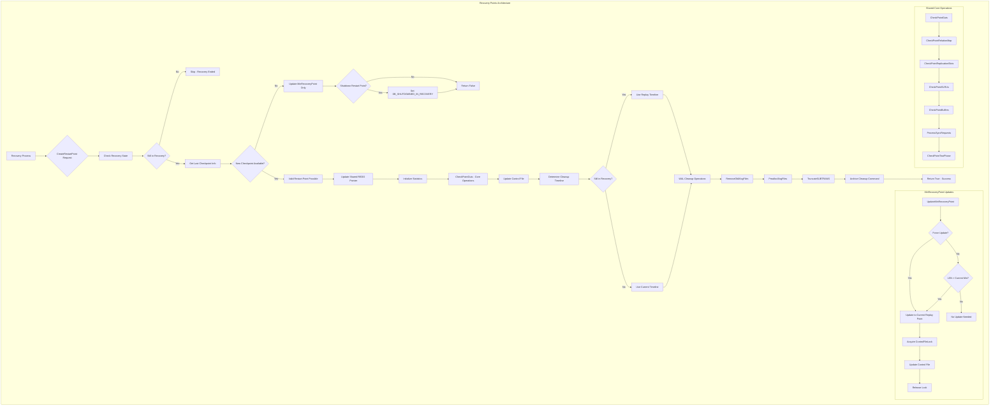
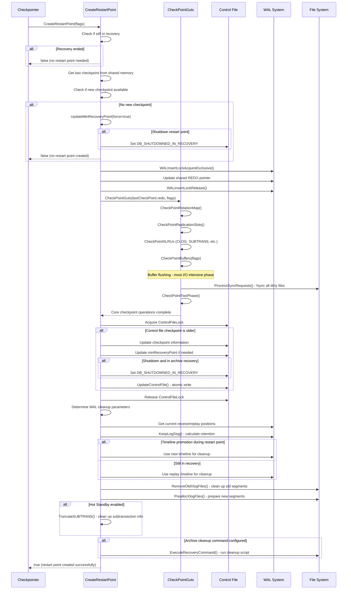

# Recovery Points Component

## Overview

The Recovery Points component manages checkpoint operations during PostgreSQL's WAL recovery process, creating restart points that serve as consistent recovery checkpoints for standby servers and crash recovery scenarios. This component ensures that recovery can efficiently resume from known-good states without replaying the entire WAL stream, while maintaining strict consistency guarantees required for database integrity.

## Key Concepts

### Recovery vs Normal Operation
- **Normal Checkpoints**: Created during regular database operation
- **Restart Points**: Recovery-time equivalents created during WAL replay
- **End-of-Recovery Checkpoints**: Transition points when recovery completes
- **Hot Standby**: Read-only access during recovery with consistent snapshots

### Recovery States
- **DB_IN_ARCHIVE_RECOVERY**: Replaying archived WAL during recovery
- **DB_SHUTDOWNED_IN_RECOVERY**: Clean shutdown while in recovery mode
- **Crash Recovery**: Initial startup after unclean shutdown
- **Standby Mode**: Continuous recovery from streaming replication

### Minimum Recovery Point
Critical LSN threshold that ensures recovery reaches a consistent state. No recovery can stop before this point without risking database corruption.

### Timeline Management
- **Recovery Timeline**: Timeline being replayed during recovery
- **Current Timeline**: Timeline after promotion or end of recovery
- **Timeline Switching**: Handling timeline changes during recovery

## Architecture



## Core APIs

### CreateRestartPoint

#### Purpose
Establishes a restart point during WAL recovery, creating a consistent checkpoint that allows future recovery to begin from this point rather than replaying the entire WAL stream from the beginning.

#### Signature
```c
bool CreateRestartPoint(int flags)
```

#### Detailed Description
CreateRestartPoint implements the recovery-time equivalent of normal checkpointing, with specialized logic for WAL replay scenarios. Unlike regular checkpoints, restart points can only be created when a safe checkpoint record has been replayed, ensuring consistency.

The function operates through several phases:

1. **Safety Validation**: Ensures recovery is active and new checkpoint available
2. **State Capture**: Records current recovery checkpoint information
3. **Core Checkpoint Operations**: Executes shared checkpoint logic via CheckPointGuts
4. **Control File Updates**: Updates recovery metadata and minimum recovery point
5. **WAL Management**: Cleans up old segments and preallocates new ones
6. **Timeline Coordination**: Handles timeline switching during recovery

#### Key Implementation Details

**Recovery State Validation:**
```c
if (!RecoveryInProgress()) {
    ereport(DEBUG2,
            (errmsg_internal("skipping restartpoint, recovery has already ended")));
    return false;
}
```

**Checkpoint Availability Check:**
```c
if (XLogRecPtrIsInvalid(lastCheckPointRecPtr) ||
    lastCheckPoint.redo <= ControlFile->checkPointCopy.redo) {
    ereport(DEBUG2,
            (errmsg_internal("skipping restartpoint, already performed at %X/%X",
                           LSN_FORMAT_ARGS(lastCheckPoint.redo))));

    UpdateMinRecoveryPoint(InvalidXLogRecPtr, true);
    return false;
}
```

**REDO Pointer Updates:**
```c
WALInsertLockAcquireExclusive();
RedoRecPtr = XLogCtl->Insert.RedoRecPtr = lastCheckPoint.redo;
WALInsertLockRelease();

SpinLockAcquire(&XLogCtl->info_lck);
XLogCtl->RedoRecPtr = lastCheckPoint.redo;
SpinLockRelease(&XLogCtl->info_lck);
```

**Control File Updates with Recovery-Specific Logic:**
```c
LWLockAcquire(ControlFileLock, LW_EXCLUSIVE);
if (ControlFile->checkPointCopy.redo < lastCheckPoint.redo) {
    ControlFile->checkPoint = lastCheckPointRecPtr;
    ControlFile->checkPointCopy = lastCheckPoint;

    // Update minimum recovery point for backup consistency
    if (ControlFile->state == DB_IN_ARCHIVE_RECOVERY) {
        if (ControlFile->minRecoveryPoint < lastCheckPointEndPtr) {
            ControlFile->minRecoveryPoint = lastCheckPointEndPtr;
            ControlFile->minRecoveryPointTLI = lastCheckPoint.ThisTimeLineID;
        }
        if (flags & CHECKPOINT_IS_SHUTDOWN)
            ControlFile->state = DB_SHUTDOWNED_IN_RECOVERY;
    }
    UpdateControlFile();
}
LWLockRelease(ControlFileLock);
```

**Recovery-Aware WAL Cleanup:**
```c
// Use current replay position for cleanup decisions
receivePtr = GetWalRcvFlushRecPtr(NULL, NULL);
replayPtr = GetXLogReplayRecPtr(&replayTLI);
endptr = (receivePtr < replayPtr) ? replayPtr : receivePtr;

KeepLogSeg(endptr, slotsMinReqLSN, &_logSegNo);

// Choose appropriate timeline for segment recycling
if (!RecoveryInProgress())
    replayTLI = XLogCtl->InsertTimeLineID;  // Promoted during restart point

RemoveOldXlogFiles(_logSegNo, RedoRecPtr, endptr, replayTLI);
```

#### Parameters
| Parameter | Type | Description | Constraints |
|-----------|------|-------------|-------------|
| flags | int | Restart point control flags | CHECKPOINT_* flag combination |

#### Key Flag Handling
- `CHECKPOINT_IS_SHUTDOWN`: Sets `DB_SHUTDOWNED_IN_RECOVERY` state
- Other checkpoint flags: Passed through to `CheckPointGuts` for processing

#### Return Value
- `true`: Restart point successfully created
- `false`: No restart point needed or possible (already current, recovery ended)

#### Integration Points
- **Called by**: `CheckpointerMain` during recovery mode
- **Calls**: `CheckPointGuts`, `UpdateMinRecoveryPoint`, `RemoveOldXlogFiles`
- **Shared state**: Control file, WAL replay state, replication slots
- **Coordination**: Startup process, WAL receiver, replication systems

#### Recovery-Specific Behavior
- Only creates restart points when new checkpoint records have been replayed
- Updates minimum recovery point to ensure backup consistency
- Handles timeline switches that may occur during recovery
- Coordinates with Hot Standby for consistent read-only access

---

### UpdateMinRecoveryPoint

#### Purpose
Advances the minimum recovery point in the control file, ensuring that any recovery process must reach at least this LSN before the database can be considered consistent.

#### Signature
```c
static void UpdateMinRecoveryPoint(XLogRecPtr lsn, bool force)
```

#### Detailed Description
UpdateMinRecoveryPoint manages the critical consistency threshold that prevents incomplete recovery. The minimum recovery point ensures that if recovery stops (due to crash, shutdown, etc.), the next startup will continue recovery to a consistent state.

The function implements several safety mechanisms:

1. **Local Caching**: Avoids unnecessary control file updates via local state
2. **Consistency Validation**: Protects against corrupted LSN values
3. **Crash Recovery Handling**: Special behavior during initial crash recovery
4. **Timeline Coordination**: Maintains timeline consistency with LSN updates

#### Key Implementation Details

**Quick Exit Optimizations:**
```c
if (!updateMinRecoveryPoint || (!force && lsn <= LocalMinRecoveryPoint))
    return;  // No update needed
```

**Crash Recovery Protection:**
```c
if (XLogRecPtrIsInvalid(LocalMinRecoveryPoint) && InRecovery) {
    updateMinRecoveryPoint = false;  // Don't update during crash recovery
    return;
}
```

**Safe LSN Validation:**
```c
newMinRecoveryPoint = GetCurrentReplayRecPtr(&newMinRecoveryPointTLI);
if (!force && newMinRecoveryPoint < lsn)
    elog(WARNING,
         "xlog min recovery request %X/%X is past current point %X/%X",
         LSN_FORMAT_ARGS(lsn), LSN_FORMAT_ARGS(newMinRecoveryPoint));
```

**Atomic Control File Update:**
```c
LWLockAcquire(ControlFileLock, LW_EXCLUSIVE);

LocalMinRecoveryPoint = ControlFile->minRecoveryPoint;
LocalMinRecoveryPointTLI = ControlFile->minRecoveryPointTLI;

if (ControlFile->minRecoveryPoint < newMinRecoveryPoint) {
    ControlFile->minRecoveryPoint = newMinRecoveryPoint;
    ControlFile->minRecoveryPointTLI = newMinRecoveryPointTLI;
    UpdateControlFile();

    LocalMinRecoveryPoint = newMinRecoveryPoint;
    LocalMinRecoveryPointTLI = newMinRecoveryPointTLI;
}

LWLockRelease(ControlFileLock);
```

#### Parameters
| Parameter | Type | Description | Constraints |
|-----------|------|-------------|-------------|
| lsn | XLogRecPtr | Requested minimum recovery LSN | May be invalid for force updates |
| force | bool | Force update regardless of current value | Used for recovery boundaries |

#### Safety Mechanisms
- **Corrupted LSN Protection**: Uses current replay position instead of potentially corrupted requested LSN
- **Crash Recovery Awareness**: Avoids updates during initial crash recovery
- **Timeline Consistency**: Maintains timeline information with LSN updates
- **Local Caching**: Reduces control file I/O through local state tracking

#### Integration Points
- **Called by**: WAL replay functions, `CreateRestartPoint`, buffer flushing
- **Calls**: `GetCurrentReplayRecPtr`, `UpdateControlFile`
- **Shared state**: Control file minimum recovery point
- **Coordination**: Recovery startup process, backup operations

---

### CheckPointGuts

#### Purpose
Executes the core checkpoint operations shared between regular checkpoints and recovery restart points, coordinating flushing across all database subsystems.

#### Signature
```c
static void CheckPointGuts(XLogRecPtr checkPointRedo, int flags)
```

#### Detailed Description
CheckPointGuts implements the common checkpoint logic used by both normal checkpoints and recovery restart points. It coordinates checkpoint operations across all PostgreSQL subsystems in a carefully ordered sequence.

#### Implementation Phases

**Metadata and State Checkpointing:**
```c
CheckPointRelationMap();           // Relation file mapping
CheckPointReplicationSlots(shutdown); // Replication slot state
CheckPointSnapBuild();             // Snapshot building state
CheckPointLogicalRewriteHeap();    // Logical replication state
CheckPointReplicationOrigin();     // Replication origin tracking
```

**Data Flushing Phase:**
```c
CheckpointStats.ckpt_write_t = GetCurrentTimestamp();
CheckPointCLOG();                  // Transaction status (commit log)
CheckPointCommitTs();              // Commit timestamps
CheckPointSUBTRANS();              // Subtransaction status
CheckPointMultiXact();             // MultiXact status
CheckPointPredicate();             // Predicate locks for SSI
CheckPointBuffers(flags);          // Main buffer pool
```

**Synchronization Phase:**
```c
CheckpointStats.ckpt_sync_t = GetCurrentTimestamp();
ProcessSyncRequests();             // Process all accumulated fsync requests
CheckpointStats.ckpt_sync_end_t = GetCurrentTimestamp();
```

**Two-Phase Commit Coordination:**
```c
CheckPointTwoPhase(checkPointRedo); // Two-phase commit state
```

#### Parameters
| Parameter | Type | Description | Constraints |
|-----------|------|-------------|-------------|
| checkPointRedo | XLogRecPtr | REDO point for this checkpoint | Valid LSN for recovery coordination |
| flags | int | Checkpoint control flags | Passed to individual checkpoint functions |

#### Subsystem Coordination
Each checkpoint operation is carefully ordered to maintain consistency:

1. **Metadata First**: Relation maps and replication state
2. **SLRU Systems**: Transaction status and related metadata
3. **Buffer Pool**: Main data pages (most I/O intensive)
4. **Sync Coordination**: Ensure all writes reach storage
5. **Two-Phase Commit**: Handle distributed transaction state

## Data Structures

### Recovery Control State
Global variables managing recovery point behavior:

```c
static XLogRecPtr LocalMinRecoveryPoint = InvalidXLogRecPtr;
static TimeLineID LocalMinRecoveryPointTLI = 0;
static bool updateMinRecoveryPoint = true;
```

### CheckPoint Record Structure
WAL record containing checkpoint metadata:

```c
typedef struct CheckPoint {
    XLogRecPtr  redo;               // REDO point LSN
    TimeLineID  ThisTimeLineID;     // Current timeline
    TimeLineID  PrevTimeLineID;     // Previous timeline (for recovery)

    pg_time_t   time;               // Checkpoint timestamp

    // Transaction ID state
    TransactionId nextXid;          // Next XID to assign
    TransactionId oldestXid;        // Oldest active XID
    TransactionId oldestActiveXid;  // For Hot Standby

    // Object ID state
    Oid         nextOid;            // Next OID to assign

    // MultiXact state
    MultiXactId nextMulti;          // Next MultiXact ID
    MultiXactOffset nextMultiOffset;// Next MultiXact offset
    MultiXactId oldestMulti;        // Oldest active MultiXact
    Oid         oldestMultiDB;      // Database with oldest MultiXact

    // Commit timestamp state
    TransactionId oldestCommitTsXid;// Oldest commit timestamp XID
    TransactionId newestCommitTsXid;// Newest commit timestamp XID

    // WAL configuration
    bool        fullPageWrites;     // FPW enabled at checkpoint
    int         wal_level;          // WAL level setting
} CheckPoint;
```

### Control File Recovery Fields
Recovery-specific fields in the control file:

```c
typedef struct ControlFileData {
    // ... other fields ...

    // Recovery coordination
    XLogRecPtr  minRecoveryPoint;       // Minimum point for consistent recovery
    TimeLineID  minRecoveryPointTLI;    // Timeline for minRecoveryPoint

    // Checkpoint information
    XLogRecPtr  checkPoint;             // Last checkpoint record location
    CheckPoint  checkPointCopy;         // Copy of last checkpoint record

    // Database state during recovery
    DBState     state;                  // Current database state
    // DB_IN_ARCHIVE_RECOVERY, DB_SHUTDOWNED_IN_RECOVERY, etc.

    // ... other fields ...
} ControlFileData;
```

## Processing Flow



## Implementation Notes

### Recovery vs Normal Operation Differences

**Restart Points vs Checkpoints:**
- Restart points can only be created when safe checkpoint records are available
- No new WAL records are written during restart point creation
- Timeline handling is more complex due to potential promotion scenarios
- Minimum recovery point coordination is critical for backup consistency

**WAL Coordination:**
- During recovery, WAL insertion locks are acquired pro forma (no concurrent insertion)
- REDO point comes from replayed checkpoint record, not current insertion point
- Timeline may switch during restart point creation if promotion occurs

### Timeline Management Complexity

**Timeline Switching Scenarios:**
1. **Normal Recovery**: Continues on same timeline throughout restart point
2. **Promotion During Restart Point**: Switches to new timeline for cleanup
3. **Multi-Timeline Recovery**: Handles crossing timeline boundaries

**Timeline Decision Logic:**
```c
// Choose timeline for WAL segment management
if (!RecoveryInProgress())
    replayTLI = XLogCtl->InsertTimeLineID;  // Use current (promoted) timeline
// else use recovery timeline from GetXLogReplayRecPtr()
```

### Minimum Recovery Point Management

**Consistency Guarantees:**
- Backups taken during recovery must include all WAL up to minimum recovery point
- Recovery cannot stop before minimum recovery point without risking corruption
- Updates are atomic with control file writes

**Update Triggers:**
- Buffer flushing operations
- Restart point creation
- End of recovery transitions
- Force updates from upper-level operations

### Hot Standby Coordination

**Read Consistency:**
- Restart points provide consistent snapshots for Hot Standby queries
- Subtransaction cleanup coordinated with snapshot building
- Transaction state checkpointing maintains read-only access

**Replication Integration:**
- Replication slot checkpointing preserves WAL retention requirements
- Standby promotion triggers timeline switching in restart points
- WAL receiver coordination ensures complete WAL replay

### Performance Optimization

**I/O Distribution:**
- Shared CheckPointGuts logic spreads I/O across subsystems
- Same throttling mechanisms as normal checkpoints
- Background writer coordination reduces restart point impact

**Resource Management:**
- Statistics collection identical to normal checkpoints
- Memory context management for error recovery
- Process title updates for monitoring

### Error Handling and Edge Cases

**Recovery State Transitions:**
- Handles recovery ending during restart point creation
- Manages promotion scenarios gracefully
- Protects against inconsistent control file states

**WAL Segment Management:**
- Coordinates with archive recovery processes
- Handles missing or corrupted WAL segments
- Manages segment recycling across timeline boundaries

**Corruption Protection:**
- Validates LSN values before control file updates
- Protects against advancing beyond available WAL
- Maintains timeline consistency across restart points

This recovery points component ensures that PostgreSQL can efficiently handle crash recovery and standby server operations, providing the same consistency guarantees as normal checkpoints while adapting to the unique requirements of WAL replay scenarios.