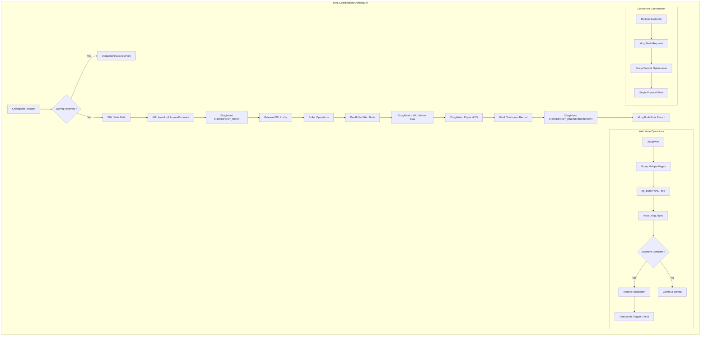
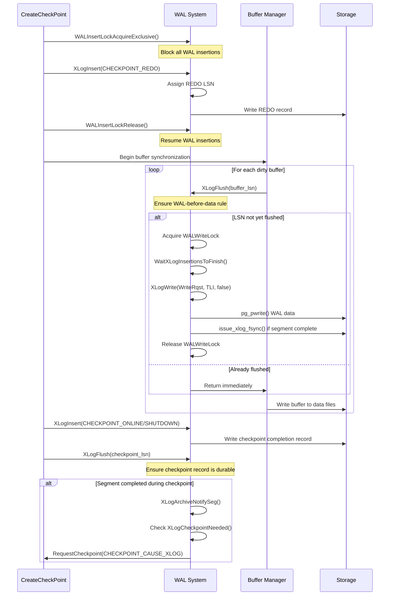

# WAL Coordination Component

## Overview

The WAL Coordination component implements PostgreSQL's Write-Ahead Logging protocol, ensuring that transaction log records reach disk before corresponding data changes. This component is fundamental to ACID compliance, crash recovery, and replication functionality. During checkpoints, WAL coordination becomes critical for maintaining consistency points and enabling efficient recovery operations.

## Key Concepts

### Write-Ahead Logging (WAL) Rule
The fundamental principle that log records describing database changes must be written to persistent storage before the data pages they describe. This ensures recoverability after system crashes.

### Log Sequence Numbers (LSNs)
Unique identifiers for positions in the WAL stream, used to:
- Order operations chronologically
- Determine flush requirements
- Coordinate between WAL and data writes
- Track replication progress

### WAL Record Types
- **XLOG_CHECKPOINT_REDO**: Marks the beginning of a checkpoint operation
- **XLOG_CHECKPOINT_ONLINE**: Indicates successful online checkpoint completion
- **XLOG_CHECKPOINT_SHUTDOWN**: Marks clean database shutdown checkpoint
- **Data Records**: Transaction operations requiring recovery

### Full Page Writes (FPW)
Complete page images stored in WAL to protect against torn page writes during system crashes, particularly important during checkpoint operations.

## Architecture



## Core APIs

### XLogFlush

#### Purpose
Ensures that all WAL records up to a specified LSN are durably written to disk, implementing the core WAL-before-data rule essential for crash recovery consistency.

#### Signature
```c
void XLogFlush(XLogRecPtr record)
```

#### Detailed Description
XLogFlush represents the critical synchronization point between WAL and data operations. It implements sophisticated group commit optimization while maintaining strict ordering guarantees required for crash recovery.

The function operates through several phases:

1. **Recovery Mode Check**: Updates minimum recovery point during WAL replay
2. **Quick Exit Optimization**: Avoids work if LSN already flushed
3. **Group Commit Coordination**: Batches multiple flush requests for efficiency
4. **Physical Write Coordination**: Delegates to XLogWrite for actual I/O
5. **Completion Verification**: Ensures requested LSN is actually flushed

#### Key Implementation Details

**Recovery vs Normal Mode:**
```c
if (!XLogInsertAllowed()) {
    // During recovery, update minimum recovery point instead
    UpdateMinRecoveryPoint(record, false);
    return;
}
```

**Quick Exit Optimization:**
```c
if (record <= LogwrtResult.Flush)
    return;  // Already flushed to disk
```

**Group Commit Logic:**
```c
// Wait for WAL insertion to complete up to current position
insertpos = WaitXLogInsertionsToFinish(WriteRqstPtr);

// Try to piggyback additional data for efficiency
WriteRqst.Write = insertpos;
WriteRqst.Flush = insertpos;

XLogWrite(WriteRqst, insertTLI, false);
```

**Commit Delay for Batching:**
```c
if (CommitDelay > 0 && enableFsync &&
    MinimumActiveBackends(CommitSiblings)) {
    pg_usleep(CommitDelay);  // Allow more commits to batch
    insertpos = WaitXLogInsertionsToFinish(insertpos);
}
```

#### Parameters
| Parameter | Type | Description | Constraints |
|-----------|------|-------------|-------------|
| record | XLogRecPtr | Target LSN to flush to disk | Must be valid LSN position |

#### Return Value
No return value. Function blocks until requested LSN is durably flushed or throws ERROR on failure.

#### Integration Points
- **Called by**: `FlushBuffer`, `CreateCheckPoint`, transaction commit operations
- **Calls**: `XLogWrite`, `UpdateMinRecoveryPoint`, `WaitXLogInsertionsToFinish`
- **Shared state**: `LogwrtResult`, WAL insertion state
- **Coordination**: Multiple backends via group commit, WAL writers

#### Performance Characteristics
- **Group Commit**: Batches multiple requests to amortize fsync cost
- **Lock Contention**: Uses careful lock ordering to minimize contention
- **I/O Optimization**: Writes multiple WAL pages in single operation
- **Latency**: Dominated by storage fsync performance

#### Error Handling
- **LSN Validation**: Detects corrupted LSNs and reports detailed errors
- **I/O Errors**: Propagates storage errors with context information
- **Recovery Coordination**: Handles special cases during crash recovery

---

### XLogWrite

#### Purpose
Performs the actual physical write operations for WAL data, managing WAL segment files, coordinating fsync operations, and triggering checkpoint requests when appropriate.

#### Signature
```c
static void XLogWrite(XLogwrtRqst WriteRqst, TimeLineID tli, bool flexible)
```

#### Detailed Description
XLogWrite implements the low-level WAL writing mechanism, handling the complex interactions between memory buffers, file system operations, and WAL segment management. It's responsible for the actual durability guarantees of the WAL system.

The function operates in several phases:

1. **Buffer Management**: Coordinates access to shared WAL buffers
2. **Segment Management**: Creates/opens WAL segment files as needed
3. **Batch Writing**: Groups multiple pages for efficient I/O operations
4. **Segment Completion**: Handles fsync and archival notification
5. **Checkpoint Triggering**: Monitors WAL volume for checkpoint needs

#### Key Implementation Details

**Buffer Page Gathering:**
```c
// Gather consecutive pages for single write operation
while (LogwrtResult.Write < WriteRqst.Write) {
    XLogRecPtr EndPtr = pg_atomic_read_u64(&XLogCtl->xlblocks[curridx]);

    if (npages == 0) {
        // First page of group
        startidx = curridx;
        startoffset = XLogSegmentOffset(LogwrtResult.Write - XLOG_BLCKSZ,
                                       wal_segment_size);
    }
    npages++;

    // Write when we have a complete group
    if (last_iteration || curridx == XLogCtl->XLogCacheBlck || finishing_seg) {
        // Perform the physical write
        written = pg_pwrite(openLogFile, from, nleft, startoffset);
    }
}
```

**Segment Management:**
```c
if (!XLByteInPrevSeg(LogwrtResult.Write, openLogSegNo, wal_segment_size)) {
    // Switch to new segment
    if (openLogFile >= 0)
        XLogFileClose();
    XLByteToPrevSeg(LogwrtResult.Write, openLogSegNo, wal_segment_size);
    openLogFile = XLogFileInit(openLogSegNo, tli);
}
```

**Segment Completion Processing:**
```c
if (finishing_seg) {
    issue_xlog_fsync(openLogFile, openLogSegNo, tli);

    WalSndWakeupRequest();  // Notify WAL senders
    LogwrtResult.Flush = LogwrtResult.Write;

    if (XLogArchivingActive())
        XLogArchiveNotifySeg(openLogSegNo, tli);

    // Check if checkpoint needed due to WAL volume
    if (IsUnderPostmaster && XLogCheckpointNeeded(openLogSegNo)) {
        if (XLogCheckpointNeeded(openLogSegNo))
            RequestCheckpoint(CHECKPOINT_CAUSE_XLOG);
    }
}
```

#### Parameters
| Parameter | Type | Description | Constraints |
|-----------|------|-------------|-------------|
| WriteRqst | XLogwrtRqst | Write and flush targets | Must be valid LSN positions |
| tli | TimeLineID | Timeline identifier | Current timeline ID |
| flexible | bool | Allow stopping at convenient boundaries | Used for optimization |

#### Return Value
No return value. Updates global `LogwrtResult` structure with actual write/flush progress.

#### Integration Points
- **Called by**: `XLogFlush`, background WAL writer
- **Calls**: `pg_pwrite`, `issue_xlog_fsync`, `RequestCheckpoint`
- **Shared state**: WAL buffers, segment files, write result tracking
- **Coordination**: Archive process, WAL senders, checkpointer

#### Performance Optimization
- **Page Batching**: Groups consecutive pages for single write operations
- **Flexible Mode**: Allows early termination at convenient boundaries
- **I/O Timing**: Tracks and reports WAL write performance statistics
- **Segment Preallocation**: Minimizes file system overhead

---

### WALInsertLockAcquireExclusive

#### Purpose
Acquires exclusive access to all WAL insertion locks, preventing any concurrent WAL record insertions. Critical for checkpoint operations that need atomic snapshots of WAL state.

#### Signature
```c
static void WALInsertLockAcquireExclusive(void)
```

#### Detailed Description
WALInsertLockAcquireExclusive implements a sophisticated lock acquisition protocol that safely stops all WAL insertion activity system-wide. This is essential for checkpoint operations that need to establish consistent REDO points.

The function must coordinate with potentially many concurrent inserters:

1. **Lock Ordering**: Acquires locks in fixed order to prevent deadlocks
2. **Insertion Barrier**: Sets sentinel values to block new insertions
3. **State Consistency**: Ensures atomic view of WAL insertion state
4. **Performance**: Minimizes hold time to reduce system impact

#### Key Implementation Details

**Sequential Lock Acquisition:**
```c
// Acquire all but last lock with sentinel values
for (i = 0; i < NUM_XLOGINSERT_LOCKS - 1; i++) {
    LWLockAcquire(&WALInsertLocks[i].l.lock, LW_EXCLUSIVE);
    LWLockUpdateVar(&WALInsertLocks[i].l.lock,
                    &WALInsertLocks[i].l.insertingAt,
                    PG_UINT64_MAX);  // Sentinel value
}

// Last lock without sentinel (will be reset at release)
LWLockAcquire(&WALInsertLocks[i].l.lock, LW_EXCLUSIVE);

holdingAllLocks = true;
```

#### Parameters
None.

#### Return Value
No return value. Sets global state indicating exclusive lock ownership.

#### Integration Points
- **Called by**: `CreateCheckPoint` during critical sections
- **Calls**: `LWLockAcquire`, `LWLockUpdateVar`
- **Shared state**: WAL insertion locks array
- **Coordination**: All backend processes performing WAL insertions

#### Critical Section Usage
This function is always called within critical sections to ensure atomicity:

```c
START_CRIT_SECTION();
WALInsertLockAcquireExclusive();
// Checkpoint operations requiring consistent WAL state
WALInsertLockRelease();
END_CRIT_SECTION();
```

---

### XLogInsert

#### Purpose
Inserts a new WAL record into the transaction log stream with proper LSN assignment, full page write handling, and concurrency coordination.

#### Signature
```c
XLogRecPtr XLogInsert(RmgrId rmid, uint8 info)
```

#### Detailed Description
XLogInsert represents the core WAL record creation mechanism, handling the complex process of assembling, formatting, and inserting WAL records while coordinating with the broader WAL system.

The function implements a complete WAL record insertion cycle:

1. **Validation**: Ensures proper calling sequence and parameters
2. **FPW Determination**: Decides whether full page writes are needed
3. **Record Assembly**: Builds complete WAL record with all components
4. **Insertion**: Atomically inserts record and assigns LSN
5. **State Cleanup**: Resets insertion state for next operation

#### Key Implementation Details

**Full Page Write Coordination:**
```c
do {
    XLogRecPtr RedoRecPtr;
    bool doPageWrites;

    // Get current FPW requirements (may change under concurrent load)
    GetFullPageWriteInfo(&RedoRecPtr, &doPageWrites);

    // Assemble record with current FPW state
    rdt = XLogRecordAssemble(rmid, info, RedoRecPtr, doPageWrites,
                            &fpw_lsn, &num_fpi, &topxid_included);

    // Insert record (may fail if FPW state changed)
    EndPos = XLogInsertRecord(rdt, fpw_lsn, curinsert_flags, num_fpi,
                             topxid_included);
} while (EndPos == InvalidXLogRecPtr);  // Retry if state changed
```

**Bootstrap Mode Handling:**
```c
if (IsBootstrapProcessingMode() && rmid != RM_XLOG_ID) {
    XLogResetInsertion();
    EndPos = SizeOfXLogLongPHD;  // Return fake LSN
    return EndPos;
}
```

#### Parameters
| Parameter | Type | Description | Constraints |
|-----------|------|-------------|-------------|
| rmid | RmgrId | Resource manager ID | Valid RM_* constant |
| info | uint8 | Record type and flags | Valid for specified rmid |

#### Return Value
Returns LSN (XLogRecPtr) pointing to the end of the inserted record. This LSN serves as the minimum WAL flush point for any data pages modified by this operation.

#### Integration Points
- **Called by**: All subsystems generating WAL records
- **Calls**: `XLogRecordAssemble`, `XLogInsertRecord`, `GetFullPageWriteInfo`
- **Shared state**: WAL insertion buffers, insertion locks
- **Coordination**: FPW system, concurrent inserters, WAL writers

---

### LogCheckpointStart

#### Purpose
Logs the beginning of a checkpoint or restart point operation, providing detailed information about checkpoint flags and triggers for monitoring and debugging purposes.

#### Signature
```c
static void LogCheckpointStart(int flags, bool restartpoint)
```

#### Detailed Description
LogCheckpointStart implements comprehensive checkpoint logging that helps administrators understand checkpoint behavior and diagnose performance issues.

#### Key Implementation Details

**Flag Interpretation:**
```c
if (restartpoint)
    ereport(LOG,
            (errmsg("restartpoint starting:%s%s%s%s%s%s%s%s",
                    (flags & CHECKPOINT_IS_SHUTDOWN) ? " shutdown" : "",
                    (flags & CHECKPOINT_END_OF_RECOVERY) ? " end-of-recovery" : "",
                    (flags & CHECKPOINT_IMMEDIATE) ? " immediate" : "",
                    (flags & CHECKPOINT_FORCE) ? " force" : "",
                    (flags & CHECKPOINT_WAIT) ? " wait" : "",
                    (flags & CHECKPOINT_CAUSE_XLOG) ? " wal" : "",
                    (flags & CHECKPOINT_CAUSE_TIME) ? " time" : "",
                    (flags & CHECKPOINT_FLUSH_ALL) ? " flush-all" : "")));
```

#### Parameters
| Parameter | Type | Description | Constraints |
|-----------|------|-------------|-------------|
| flags | int | Checkpoint control flags | CHECKPOINT_* flag combination |
| restartpoint | bool | True for restart points vs checkpoints | Used for message formatting |

#### Return Value
No return value. Logs appropriate message to PostgreSQL log.

## Data Structures

### XLogwrtRqst
Coordinates WAL write and flush requests:

```c
typedef struct XLogwrtRqst {
    XLogRecPtr Write;    // LSN to write to OS buffers
    XLogRecPtr Flush;    // LSN to fsync to disk
} XLogwrtRqst;
```

### XLogwrtResult
Tracks actual WAL write and flush progress:

```c
typedef struct XLogwrtResult {
    XLogRecPtr Write;    // Actual write progress
    XLogRecPtr Flush;    // Actual flush progress
} XLogwrtResult;
```

### XLogCtlData
Central WAL control structure:

```c
typedef struct XLogCtlData {
    XLogCtlInsert Insert;           // WAL insertion control
    XLogwrtRqst   LogwrtRqst;       // Shared write requests
    XLogRecPtr    RedoRecPtr;       // Current REDO point
    TimeLineID    InsertTimeLineID; // Current timeline

    // Atomic variables for lockless access
    pg_atomic_uint64 logInsertResult;
    pg_atomic_uint64 logWriteResult;
    pg_atomic_uint64 logFlushResult;

    // WAL buffer management
    char         *pages;            // WAL buffer pages
    XLogRecPtr   *xlblocks;         // End LSN of each buffer page
    int           XLogCacheBlck;    // Number of buffer pages

    // Synchronization
    slock_t       info_lck;         // Spinlock for shared state
} XLogCtlData;
```

### WALInsertLock
Individual insertion lock for concurrency:

```c
typedef struct WALInsertLock {
    LWLock     lock;         // The actual lock
    XLogRecPtr insertingAt;  // Current insertion position
} WALInsertLock;
```

## Processing Flow



## Implementation Notes

### WAL-Before-Data Rule Enforcement

The WAL coordination component strictly enforces the WAL-before-data rule through several mechanisms:

1. **LSN-Based Ordering**: Every data page carries the LSN of the last WAL record that modified it
2. **Flush Coordination**: `FlushBuffer` calls `XLogFlush(buffer_lsn)` before writing data
3. **Critical Sections**: WAL operations within critical sections ensure atomicity
4. **Group Commit**: Batches WAL flushes for efficiency without compromising safety

### Full Page Write Integration

During checkpoints, full page writes become critical:

```c
// Checkpoint sets fullPageWrites flag in WAL insertion state
checkPoint.fullPageWrites = Insert->fullPageWrites;

// All subsequent WAL records include full page images when:
// 1. Page is first modified after checkpoint REDO point
// 2. full_page_writes configuration is enabled
// 3. Page doesn't have appropriate WAL coverage
```

### Concurrency and Lock Management

The WAL system uses sophisticated lock management:

- **WAL Insert Locks**: Array of locks for parallel WAL insertion
- **WAL Write Lock**: Single lock for physical WAL writing
- **Group Commit**: Optimizes concurrent flush requests
- **Lock-Free Reads**: Atomic variables for frequent status checks

### Timeline Management

WAL coordination handles timeline switches during recovery:

```c
// Timeline information embedded in checkpoint records
checkPoint.ThisTimeLineID = XLogCtl->InsertTimeLineID;
checkPoint.PrevTimeLineID = (flags & CHECKPOINT_END_OF_RECOVERY) ?
                           XLogCtl->PrevTimeLineID :
                           checkPoint.ThisTimeLineID;
```

### Archive Coordination

WAL segments are prepared for archiving upon completion:

```c
if (finishing_seg) {
    issue_xlog_fsync(openLogFile, openLogSegNo, tli);

    if (XLogArchivingActive())
        XLogArchiveNotifySeg(openLogSegNo, tli);

    // Update segment switch timing for monitoring
    XLogCtl->lastSegSwitchTime = (pg_time_t) time(NULL);
    XLogCtl->lastSegSwitchLSN = LogwrtResult.Flush;
}
```

### Performance Optimizations

Several techniques minimize WAL system overhead:

- **Group Commit**: Multiple transactions share single fsync
- **Commit Delay**: Small delays allow more transactions to batch
- **Flexible Writing**: Allows stopping at convenient boundaries
- **Lock-Free Status**: Atomic variables reduce contention
- **Page Batching**: Multiple WAL pages in single write operation

### Error Handling and Recovery

The WAL system implements comprehensive error handling:

- **LSN Validation**: Detects and reports corrupted LSN values
- **I/O Error Recovery**: Detailed error context for failed operations
- **Critical Section Management**: Ensures consistency during failures
- **Timeline Consistency**: Maintains proper timeline relationships

This WAL coordination component forms the foundation of PostgreSQL's durability guarantees, implementing sophisticated algorithms that balance performance, concurrency, and data safety across all operational scenarios.