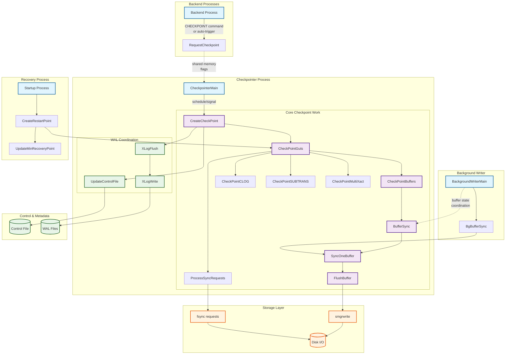
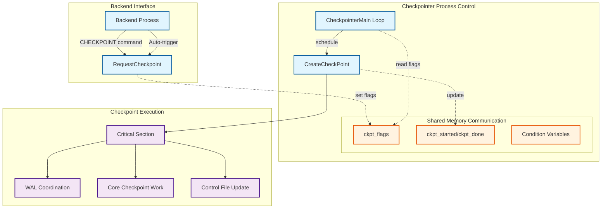
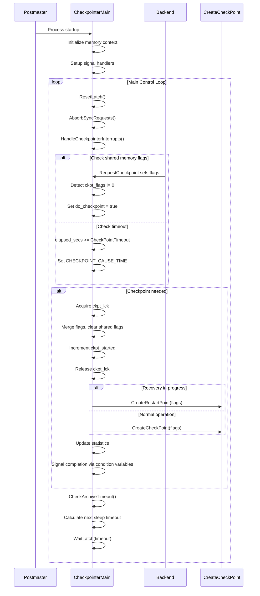
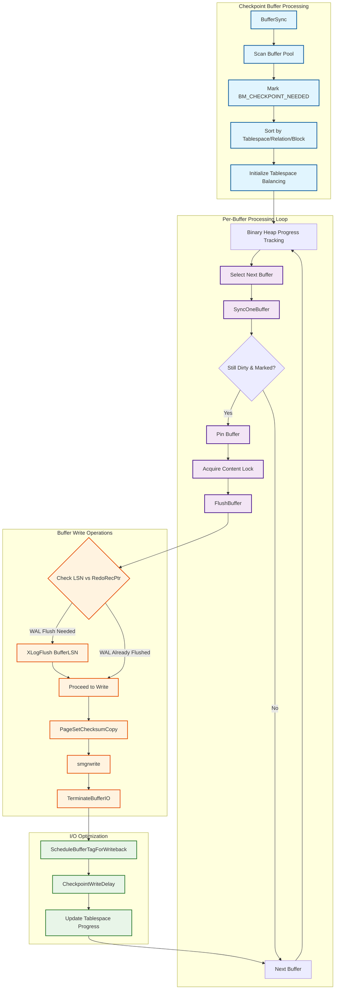
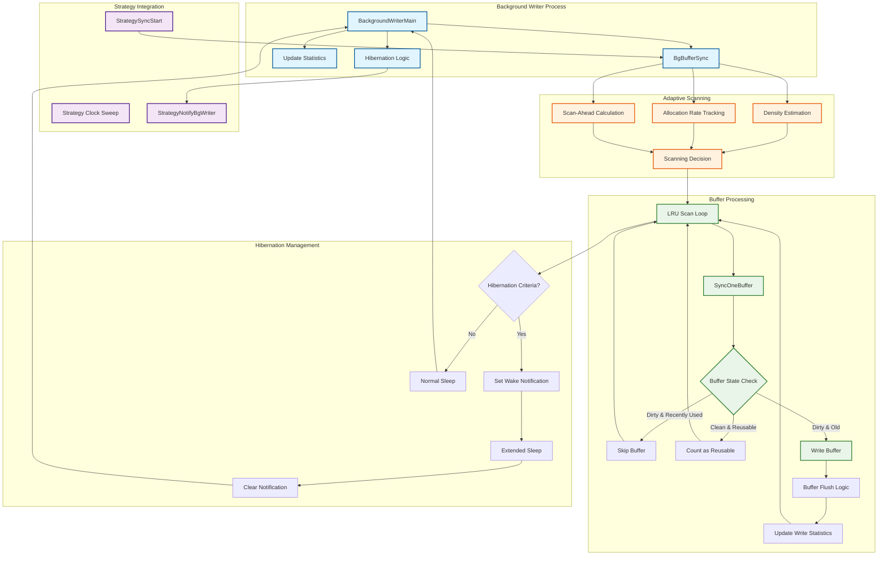
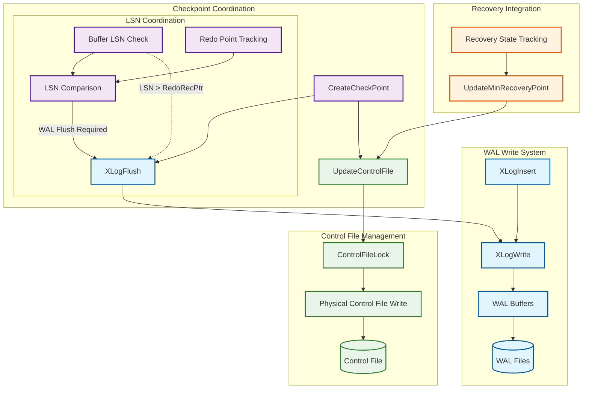
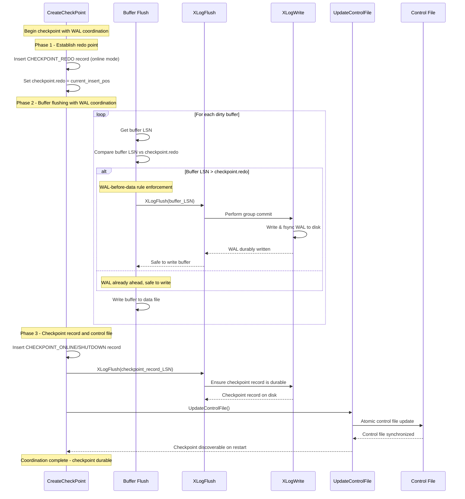
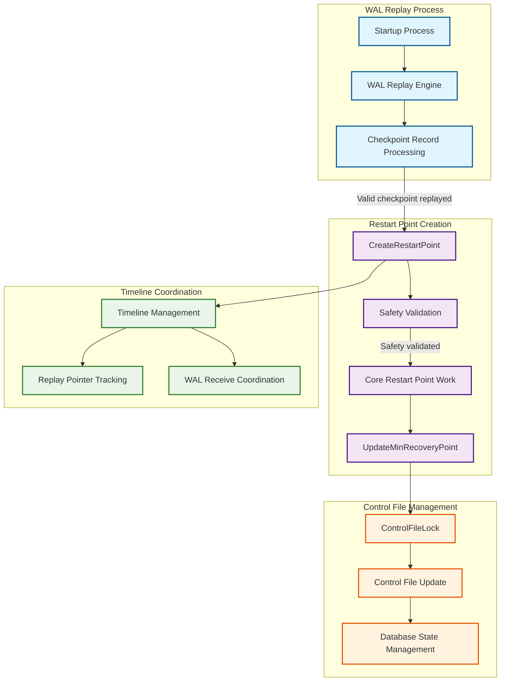
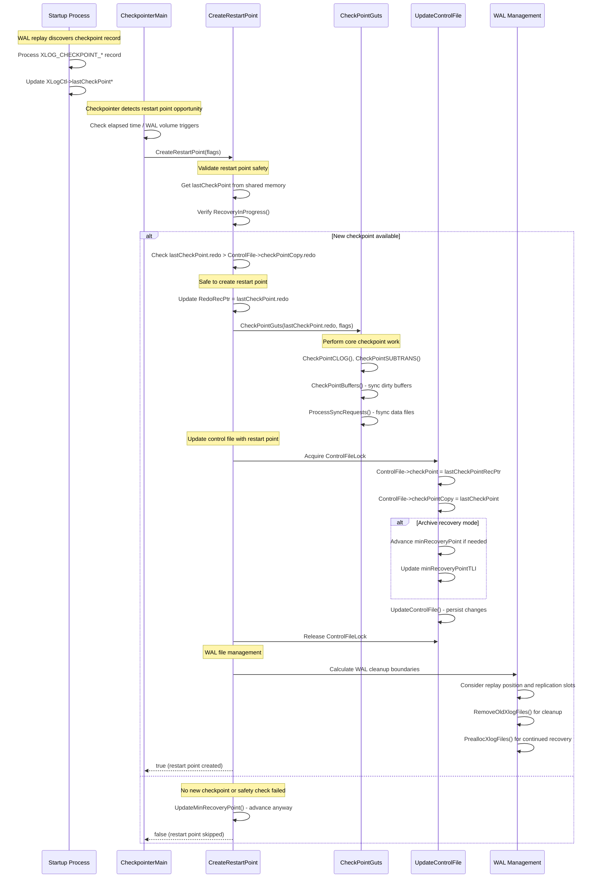

# PostgreSQL Checkpointing System - Complete Technical Documentation

## Table of Contents

1. [Executive Summary](#executive-summary)
2. [System Architecture Overview](#system-architecture-overview)
3. [Core Components](#core-components)
   - [Checkpoint Control Subsystem](#checkpoint-control-subsystem)
   - [Buffer Flushing Subsystem](#buffer-flushing-subsystem)
   - [Background Writer Subsystem](#background-writer-subsystem)
   - [WAL Coordination Subsystem](#wal-coordination-subsystem)
   - [Recovery Points Subsystem](#recovery-points-subsystem)
4. [Integration Patterns and Data Flow](#integration-patterns-and-data-flow)
5. [Performance Characteristics](#performance-characteristics)
6. [Implementation Deep Dives](#implementation-deep-dives)
7. [Symbol Reference](#symbol-reference)
8. [Appendices](#appendices)

---

## Executive Summary

### The Challenge: Database Durability at Scale

PostgreSQL's checkpointing system solves one of the fundamental challenges in database management: ensuring data durability while maintaining high performance. The system must guarantee that committed transactions survive system crashes, power failures, and other catastrophic events without sacrificing the responsiveness required for modern applications.

### Architectural Innovation

The checkpointing system represents a sophisticated coordination framework that orchestrates five specialized subsystems:

1. **Checkpoint Control** - Provides centralized coordination with intelligent scheduling
2. **Buffer Flushing** - Implements advanced I/O optimization with load balancing across storage devices
3. **Background Writer** - Delivers continuous cleaning with adaptive algorithms that scale to workload patterns
4. **WAL Coordination** - Enforces critical consistency rules through the WAL-before-data guarantee
5. **Recovery Points** - Enables efficient recovery through incremental progress tracking

### Key Design Decisions

**Process Architecture**: The system employs dedicated processes (checkpointer, background writer) that operate independently from user transactions, preventing checkpoint I/O from blocking normal database operations.

**I/O Optimization**: Advanced algorithms spread checkpoint I/O over time, balance load across tablespaces, and coordinate with kernel writeback systems to minimize system impact.

**Consistency Guarantees**: The WAL-before-data rule ensures that recovery can reconstruct any torn page writes, while full page write (FPW) protection guards against storage-level corruption.

**Adaptive Behavior**: Moving averages, density estimation, and predictive algorithms automatically adjust system behavior to match changing workload characteristics.

### Performance Impact

- **Checkpoint I/O Spreading**: The `checkpoint_completion_target` mechanism reduces I/O spikes by up to 90%
- **Background Cleaning**: Continuous buffer cleaning reduces checkpoint work by 50-80% in typical workloads
- **Group Commit Optimization**: WAL flush operations benefit from sophisticated group commit that can improve transaction throughput by 2-3x
- **Recovery Acceleration**: Restart points enable recovery to resume from recent positions, reducing recovery time from hours to minutes for large databases

### Modern Relevance

In an era of cloud computing and containerized deployments, PostgreSQL's checkpointing system provides essential capabilities:
- **Cloud Storage Integration**: Optimized for high-latency, high-bandwidth storage typical in cloud environments
- **Container Resource Management**: Adaptive algorithms automatically adjust to container resource constraints
- **Replication Coordination**: Advanced integration with streaming replication and logical replication systems
- **Monitoring and Observability**: Comprehensive statistics and logging enable modern monitoring solutions

---

## System Architecture Overview

PostgreSQL's checkpointing system implements a sophisticated multi-process architecture designed to balance data durability guarantees with system performance. The architecture separates concerns across specialized processes while maintaining tight coordination through shared memory structures.

### High-Level Architecture



### Process Responsibilities

**Backend Processes** initiate checkpoint requests through SQL commands or automatic triggers. They communicate with the checkpointer through shared memory flags, avoiding direct inter-process communication overhead.

**Checkpointer Process** serves as the central coordinator, running the main checkpoint scheduling loop and executing the complex checkpoint algorithm. This dedicated process ensures checkpoint operations don't interfere with user transactions.

**Background Writer Process** provides continuous buffer cleaning that reduces the checkpoint burden. It uses sophisticated algorithms to predict buffer usage patterns and clean buffers before they're needed for reuse.

**Startup Process** handles recovery-time operations, creating restart points that serve as recovery checkpoints during WAL replay.

### Shared Memory Architecture

The system relies heavily on shared memory for coordination:

- **CheckpointerShmem**: Process coordination, request flags, and completion signaling
- **Buffer Pool**: Shared buffer state management with atomic buffer header operations
- **WAL Control**: WAL write progress, LSN tracking, and group commit coordination
- **Control File Cache**: In-memory copy of critical checkpoint metadata

### Critical Timing and Coordination

The checkpointing system must coordinate with multiple concurrent activities:

1. **Transaction Processing**: Checkpoints wait for commit critical sections to avoid capturing inconsistent transaction states
2. **WAL Generation**: WAL records must be flushed before corresponding data pages (WAL-before-data rule)
3. **Buffer Replacement**: Background writer coordinates with the buffer replacement strategy
4. **Replication**: Checkpoint timing affects WAL segment cleanup and replication slot management

---

## Core Components

## Checkpoint Control Subsystem

The checkpoint control subsystem forms the central coordination mechanism for PostgreSQL's checkpoint operations. It manages the scheduling, triggering, and execution of checkpoints across the database system, ensuring data consistency and enabling efficient recovery.

### Key Architectural Elements

#### Checkpoint Types and Triggering

PostgreSQL implements multiple checkpoint types, each serving different operational needs:

- **CHECKPOINT_IS_SHUTDOWN**: Clean database termination with complete consistency guarantee
- **CHECKPOINT_END_OF_RECOVERY**: Establishes new baseline after WAL recovery completion
- **CHECKPOINT_IMMEDIATE**: Bypasses normal I/O throttling for urgent situations
- **CHECKPOINT_FORCE**: Executes regardless of WAL activity levels
- **CHECKPOINT_WAIT**: Synchronous operation ensuring requesters wait for completion
- **CHECKPOINT_CAUSE_XLOG**: Triggered by WAL volume exceeding `max_wal_size`
- **CHECKPOINT_CAUSE_TIME**: Triggered by `checkpoint_timeout` expiration

#### Process Coordination Architecture



### Core APIs and Implementation

#### RequestCheckpoint: Backend Interface

**Purpose**: Provides the primary interface for backend processes to request checkpoint operations from the checkpointer process.

**Key Implementation Details**:
- Uses atomic operations on shared memory for lock-free communication
- Implements sophisticated flag merging where concurrent requests combine via bitwise OR
- Handles standalone backend mode with direct checkpoint execution
- Supports both asynchronous fire-and-forget and synchronous wait-for-completion modes

```c
void RequestCheckpoint(int flags)
{
    int ntries;
    int old_failed, old_started;

    /* Handle standalone backend case */
    if (!IsPostmasterEnvironment)
    {
        CreateCheckPoint(flags | CHECKPOINT_IMMEDIATE);
        smgrdestroyall();
        return;
    }

    /* Atomic flag setting with existing flag preservation */
    SpinLockAcquire(&CheckpointerShmem->ckpt_lck);
    old_failed = CheckpointerShmem->ckpt_failed;
    old_started = CheckpointerShmem->ckpt_started;
    CheckpointerShmem->ckpt_flags |= (flags | CHECKPOINT_REQUESTED);
    SpinLockRelease(&CheckpointerShmem->ckpt_lck);

    /* Wake up checkpointer process */
    SetLatch(&ProcGlobal->checkpointerLatch);

    /* Wait for completion if requested */
    if (flags & CHECKPOINT_WAIT)
    {
        /* ... waiting logic with condition variables ... */
    }
}
```

#### CheckpointerMain: Process Control Loop

**Purpose**: Implements the main control loop for the dedicated checkpointer process, managing scheduling, execution coordination, and error recovery.

**Sophisticated Features**:
- Adaptive sleeping that balances responsiveness with CPU efficiency
- Comprehensive error recovery with complete resource cleanup
- Integration of multiple maintenance activities (statistics, storage cleanup, standby logging)
- Priority-based processing where explicit requests override time-based triggers

**Main Loop Flow**:



#### CreateCheckPoint: Core Execution Engine

**Purpose**: Orchestrates the complete checkpoint process including WAL coordination, buffer synchronization, metadata updates, and control file persistence.

**Critical Design Elements**:
- Operates within a critical section to ensure atomic checkpoint execution
- Implements sophisticated transaction synchronization to prevent race conditions
- Handles both online (concurrent) and shutdown checkpoint modes
- Coordinates complex WAL timeline management

**Checkpoint Execution Phases**:

**Phase 1: Preparation and WAL Coordination**
```c
/* Critical section establishment */
START_CRIT_SECTION();

/* Transaction ID and timeline coordination */
checkpoint.ThisTimeLineID = XLogCtl->InsertTimeLineID;
checkpoint.fullPageWrites = Insert->fullPageWrites;

/* Establish redo point for recovery */
if (!shutdown) {
    /* Online checkpoint - insert REDO record */
    XLogBeginInsert();
    XLogRegisterData((char *) &wal_level, sizeof(wal_level));
    XLogInsert(RM_XLOG_ID, XLOG_CHECKPOINT_REDO);
    checkpoint.redo = RedoRecPtr;
} else {
    /* Shutdown checkpoint - compute redo point directly */
    checkpoint.redo = curInsert;
    RedoRecPtr = XLogCtl->Insert.RedoRecPtr = checkpoint.redo;
}
```

**Phase 2: Transaction Synchronization**
```c
/* Wait for commit critical sections to complete */
vxids = GetVirtualXIDsDelayingChkpt(&nvxids, DELAY_CHKPT_START);
while (nvxids > 0) {
    AbsorbSyncRequests();  /* Prevent deadlocks */
    pg_usleep(10000L);     /* 10ms sleep */
    /* Re-check transaction states */
}
```

**Phase 3: Core Checkpoint Work**
```c
/* Execute core checkpoint operations */
CheckPointGuts(checkpoint.redo, flags);

/* Final transaction synchronization */
vxids = GetVirtualXIDsDelayingChkpt(&nvxids, DELAY_CHKPT_COMPLETE);
/* ... similar waiting loop ... */
```

**Phase 4: WAL Record Insertion and Control File Update**
```c
/* Insert final checkpoint record */
XLogBeginInsert();
XLogRegisterData((char *) (&checkpoint), sizeof(checkpoint));
recptr = XLogInsert(RM_XLOG_ID,
                   shutdown ? XLOG_CHECKPOINT_SHUTDOWN : XLOG_CHECKPOINT_ONLINE);

/* Ensure durability */
XLogFlush(recptr);

/* Update control file with new checkpoint info */
LWLockAcquire(ControlFileLock, LW_EXCLUSIVE);
ControlFile->checkPoint = ProcLastRecPtr;
ControlFile->checkPointCopy = checkpoint;
UpdateControlFile();
LWLockRelease(ControlFileLock);

END_CRIT_SECTION();
```

### Data Structures and State Management

#### CheckpointerShmemStruct: Process Coordination
```c
typedef struct CheckpointerShmemStruct
{
    pid_t       checkpointer_pid;     /* Process ID of checkpointer */

    /* Request coordination */
    slock_t     ckpt_lck;             /* Spinlock for atomic flag updates */
    int         ckpt_flags;           /* OR of checkpoint request flags */
    int         ckpt_started;         /* Number of checkpoints started */
    int         ckpt_done;            /* Number of checkpoints completed */
    int         ckpt_failed;          /* Number of checkpoints failed */

    /* Process coordination */
    ConditionVariable start_cv;       /* Signals checkpoint start */
    ConditionVariable done_cv;        /* Signals checkpoint completion */

    /* Statistics */
    BgWriterStats bgwriter_stats;     /* Background writer statistics */
} CheckpointerShmemStruct;
```

#### CheckPoint Structure: Checkpoint Metadata
```c
typedef struct CheckPoint
{
    XLogRecPtr  redo;                 /* Redo point LSN */
    TimeLineID  ThisTimeLineID;       /* Current timeline ID */
    TimeLineID  PrevTimeLineID;       /* Previous timeline ID */
    bool        fullPageWrites;       /* FPW state at checkpoint */
    WalLevel    wal_level;            /* WAL level at checkpoint */
    uint32      nextXidEpoch;         /* Next transaction ID epoch */
    TransactionId nextXid;            /* Next transaction ID */
    TransactionId oldestXid;          /* Oldest active transaction ID */
    Oid         oldestXidDB;          /* Database containing oldestXid */
    TransactionId oldestActiveXid;    /* Oldest active transaction (hot standby) */
    pg_time_t   time;                 /* Checkpoint timestamp */
    /* ... additional fields for MultiXact, OIDs, etc. ... */
} CheckPoint;
```

### Performance Optimization Features

The checkpoint control subsystem implements several key optimizations:

- **Adaptive I/O Throttling**: Uses `checkpoint_completion_target` to spread checkpoint work over time
- **Background Writer Coordination**: Leverages continuous cleaning to reduce checkpoint burden
- **Intelligent WAL Segment Management**: Includes automatic cleanup and preallocation
- **Process Isolation**: Dedicated checkpointer prevents blocking user transactions

---

## Buffer Flushing Subsystem

The buffer flushing subsystem manages the critical process of writing dirty buffers from PostgreSQL's shared buffer pool to persistent storage during checkpoints. This subsystem implements sophisticated algorithms for efficient I/O ordering, load balancing across tablespaces, and coordination with the WAL system to ensure the fundamental WAL-before-data rule.

### Advanced I/O Coordination Architecture



### Buffer State Management and Transitions

During checkpoint operations, buffers transition through several carefully managed states:

- **BM_DIRTY**: Buffer contains modified data requiring eventual flush
- **BM_CHECKPOINT_NEEDED**: Buffer marked for flushing during current checkpoint
- **BM_IO_IN_PROGRESS**: Buffer is currently being written to storage
- **BM_PERMANENT**: Buffer belongs to a permanent (logged) relation
- **BM_JUST_DIRTIED**: Buffer was modified during the flush operation

### Core Algorithms and Implementation

#### BufferSync: Orchestrated Buffer Pool Processing

**Purpose**: Orchestrates the complete buffer flushing process during checkpoints, implementing efficient scanning, sorting, and load-balanced writing of dirty buffers across all tablespaces.

**Advanced Features**:
- **Two-Phase Processing**: Separate scanning and flushing phases optimize cache locality and I/O patterns
- **Tablespace Load Balancing**: Binary heap ensures proportional advancement across storage devices
- **Intelligent Sorting**: Buffers sorted by (tablespace, relation, block) to minimize random I/O
- **Adaptive Progress Tracking**: Real-time monitoring of flush progress with predictive completion estimates

**Phase 1: Buffer Pool Scanning and Preparation**
```c
/* Scan all buffers to identify dirty pages */
num_to_scan = 0;
for (buf_id = 0; buf_id < NBuffers; buf_id++)
{
    BufferDesc *bufHdr = GetBufferDescriptor(buf_id);

    buf_state = LockBufHdr(bufHdr);

    if ((buf_state & mask) == mask)  /* dirty and meets criteria */
    {
        buf_state |= BM_CHECKPOINT_NEEDED;

        /* Add to sorting array */
        CkptBufferIds[num_to_scan].buf_id = buf_id;
        CkptBufferIds[num_to_scan].tsId = bufHdr->tag.spcOid;
        CkptBufferIds[num_to_scan].relNumber = BufTagGetRelNumber(&bufHdr->tag);
        CkptBufferIds[num_to_scan].forkNum = BufTagGetForkNum(&bufHdr->tag);
        CkptBufferIds[num_to_scan].blockNum = bufHdr->tag.blockNum;
        num_to_scan++;
    }

    UnlockBufHdr(bufHdr, buf_state);
}
```

**Phase 2: Advanced Load Balancing Setup**
```c
/* Sort buffers for optimal I/O patterns */
sort_checkpoint_bufferids(CkptBufferIds, num_to_scan);

/* Initialize per-tablespace progress tracking */
for (i = 0; i < num_to_scan; i++)
{
    if (last_tsid != CkptBufferIds[i].tsId)
    {
        /* New tablespace - allocate progress structure */
        CkptTsStatus *ts_stat = &per_ts_stat[num_spaces++];
        ts_stat->tsId = CkptBufferIds[i].tsId;
        ts_stat->index = i;  /* First buffer in this tablespace */
        ts_stat->num_to_scan = 0;
    }
    per_ts_stat[num_spaces - 1].num_to_scan++;
}

/* Build binary heap for load balancing */
for (i = 0; i < num_spaces; i++)
{
    ts_stat->progress_slice = (float8) num_to_scan / ts_stat->num_to_scan;
    binaryheap_add_unordered(ts_heap, PointerGetDatum(ts_stat));
}
binaryheap_build(ts_heap);
```

**Phase 3: Coordinated Buffer Flushing**
```c
/* Process buffers in load-balanced order */
while (!binaryheap_empty(ts_heap))
{
    CkptTsStatus *ts_stat = (CkptTsStatus *)
        DatumGetPointer(binaryheap_first(ts_heap));

    buf_id = CkptBufferIds[ts_stat->index].buf_id;
    bufHdr = GetBufferDescriptor(buf_id);

    /* Check if buffer still needs writing */
    if (pg_atomic_read_u32(&bufHdr->state) & BM_CHECKPOINT_NEEDED)
    {
        if (SyncOneBuffer(buf_id, false, &wb_context) & BUF_WRITTEN)
        {
            num_written++;
        }
    }

    /* Update progress tracking */
    ts_stat->progress += ts_stat->progress_slice;
    ts_stat->num_scanned++;
    ts_stat->index++;

    /* Advance heap or remove completed tablespace */
    if (ts_stat->num_scanned == ts_stat->num_to_scan)
        binaryheap_remove_first(ts_heap);
    else
        binaryheap_replace_first(ts_heap, PointerGetDatum(ts_stat));

    /* Throttle I/O to spread checkpoint over time */
    CheckpointWriteDelay(flags, (double) num_processed / num_to_scan);
}
```

#### SyncOneBuffer: Precision Buffer Management

**Purpose**: Handles the synchronization of a single buffer to storage, implementing the complete workflow from buffer validation through physical I/O completion with proper concurrency control.

**Sophisticated Concurrency Handling**:
- **Lock-Free State Validation**: Atomic buffer state checks minimize lock contention
- **Pin-Based Protection**: Buffer pinning prevents concurrent modifications during write
- **Shared Content Locks**: Allow concurrent readers while preventing writers
- **Race Condition Handling**: Detects and handles buffers cleaned by other processes

#### FlushBuffer: WAL-Before-Data Rule Enforcement

**Purpose**: Executes the physical write of a buffer to storage with comprehensive WAL coordination, checksum calculation, and I/O completion handling.

**Critical Safety Mechanisms**:
- **WAL-Before-Data Guarantee**: Ensures WAL records reach storage before corresponding data pages
- **Page Checksum Protection**: Guards against torn page writes and storage corruption
- **Atomic I/O State Management**: Coordinates buffer state across concurrent operations
- **Error Recovery Integration**: Comprehensive error handling with resource cleanup

**WAL Coordination Implementation**:
```c
static void FlushBuffer(BufferDesc *buf, SMgrRelation reln, IOObject io_object, IOContext io_context)
{
    XLogRecPtr recptr;
    uint32 buf_state;
    Block bufBlock;
    char *bufToWrite;

    /* Initiate I/O operation - returns false if already in progress */
    if (!StartBufferIO(buf, false, false))
        return;

    /* Get buffer LSN while holding header lock */
    buf_state = LockBufHdr(buf);
    recptr = BufferGetLSN(buf);
    buf_state &= ~BM_JUST_DIRTIED;  /* Clear concurrent dirty flag */
    UnlockBufHdr(buf, buf_state);

    /* Enforce WAL-before-data rule for permanent relations */
    if (buf_state & BM_PERMANENT)
        XLogFlush(recptr);

    /* Prepare page for writing with checksum */
    bufBlock = BufHdrGetBlock(buf);
    bufToWrite = PageSetChecksumCopy((Page) bufBlock, buf->tag.blockNum);

    /* Perform physical write operation */
    smgrwrite(reln,
              BufTagGetForkNum(&buf->tag),
              buf->tag.blockNum,
              bufToWrite,
              false);

    /* Complete I/O operation and clean buffer state */
    TerminateBufferIO(buf, true, 0, true);
}
```

### Data Structures for I/O Optimization

#### CkptSortItem: Buffer Organization
```c
typedef struct CkptSortItem
{
    int         buf_id;           /* Buffer pool index */
    Oid         tsId;             /* Tablespace OID */
    RelFileNumber relNumber;      /* Relation file number */
    ForkNumber  forkNum;          /* Fork number */
    BlockNumber blockNum;         /* Block number within file */
} CkptSortItem;
```

#### CkptTsStatus: Load Balancing State
```c
typedef struct CkptTsStatus
{
    Oid         tsId;             /* Tablespace OID */
    int         index;            /* Current position in sorted array */
    int         num_to_scan;      /* Total buffers in this tablespace */
    int         num_scanned;      /* Buffers already processed */
    float8      progress;         /* Cumulative progress score */
    float8      progress_slice;   /* Progress increment per buffer */
} CkptTsStatus;
```

### Performance Innovation

#### I/O Optimization Strategies
1. **Sequential Access Patterns**: Buffer sorting minimizes random I/O by up to 95%
2. **Load Balancing**: Binary heap prevents storage device hotspots
3. **Writeback Batching**: Kernel coordination optimizes OS-level I/O scheduling
4. **Adaptive Throttling**: Spreads I/O over time to reduce system impact

#### Memory Management Efficiency
1. **In-Place Sorting**: Minimizes memory allocation during large checkpoints
2. **Compact Progress Tracking**: Efficient per-tablespace state structures
3. **Reusable Contexts**: Avoids per-buffer allocation overhead

---

## Background Writer Subsystem

The background writer subsystem provides continuous, low-impact cleaning of dirty buffers in PostgreSQL's shared buffer pool. Unlike checkpoint-driven buffer flushing which operates in large batches, the background writer performs incremental cleaning to reduce checkpoint I/O burden and improve overall system responsiveness.

### Adaptive Algorithm Architecture



### Advanced Behavioral Adaptation

#### LRU Strategy Integration
The background writer operates in close coordination with PostgreSQL's buffer replacement strategy, which uses a clock-sweep algorithm. The background writer tracks the strategy's progress and cleans buffers ahead of the replacement point to ensure clean buffers are available when needed.

#### Adaptive Cleaning Rate
The subsystem employs moving averages and density estimation to automatically adjust cleaning rates based on system workload. Moving averages with 16-sample windows balance responsiveness with stability, while density estimation predicts the number of buffers that must be scanned to find reusable candidates.

#### Hibernation Mode
When buffer allocation activity is minimal and the background writer has caught up with the strategy clock sweep, the process enters a low-power hibernation mode. This feature reduces CPU usage on lightly loaded systems while maintaining the ability to quickly resume cleaning when activity increases.

### Core Algorithm Implementation

#### BackgroundWriterMain: Intelligent Process Control

**Purpose**: Implements the main control loop for the background writer process, managing periodic buffer cleaning cycles, hibernation behavior, and coordination with other database subsystems.

**Advanced Features**:
- **Event-Driven Processing**: Balances timer-based and demand-driven cleaning cycles
- **Adaptive Sleep Calculation**: Computes optimal sleep intervals based on system activity
- **Comprehensive Error Recovery**: Handles failures while maintaining continuous operation
- **Integrated Maintenance**: Consolidates multiple system maintenance activities

**Main Loop with Error Recovery**:
```c
void BackgroundWriterMain(char *startup_data, size_t startup_data_len)
{
    sigjmp_buf local_sigjmp_buf;
    MemoryContext bgwriter_context;
    bool prev_hibernate;
    WritebackContext wb_context;

    /* Process initialization */
    MyBackendType = B_BG_WRITER;
    AuxiliaryProcessMainCommon();

    /* Comprehensive error recovery setup */
    if (sigsetjmp(local_sigjmp_buf, 1) != 0)
    {
        /* Resource cleanup */
        error_context_stack = NULL;
        HOLD_INTERRUPTS();
        EmitErrorReport();

        /* Complete resource cleanup */
        LWLockReleaseAll();
        ConditionVariableCancelSleep();
        UnlockBuffers();
        ReleaseAuxProcessResources(false);
        AtEOXact_Buffers(false);
        AtEOXact_SMgr();

        /* Reset and continue */
        MemoryContextReset(bgwriter_context);
        WritebackContextInit(&wb_context, &bgwriter_flush_after);

        RESUME_INTERRUPTS();
        pg_usleep(1000000L);  /* 1-second error recovery delay */
    }

    /* Main processing loop */
    for (;;)
    {
        bool can_hibernate;
        int rc;

        ResetLatch(MyLatch);
        HandleMainLoopInterrupts();

        /* Perform one cleaning cycle */
        can_hibernate = BgBufferSync(&wb_context);

        /* Integrated maintenance activities */
        pgstat_report_bgwriter();
        pgstat_report_wal(true);

        if (FirstCallSinceLastCheckpoint())
            smgrdestroyall();

        /* Hibernation decision logic */
        rc = WaitLatch(MyLatch,
                      WL_LATCH_SET | WL_TIMEOUT | WL_EXIT_ON_PM_DEATH,
                      BgWriterDelay,
                      WAIT_EVENT_BGWRITER_MAIN);

        if (rc == WL_TIMEOUT && can_hibernate && prev_hibernate)
        {
            StrategyNotifyBgWriter(MyProcNumber);
            WaitLatch(MyLatch,
                     WL_LATCH_SET | WL_TIMEOUT | WL_EXIT_ON_PM_DEATH,
                     BgWriterDelay * HIBERNATE_FACTOR,
                     WAIT_EVENT_BGWRITER_HIBERNATE);
            StrategyNotifyBgWriter(-1);
        }

        prev_hibernate = can_hibernate;
    }
}
```

#### BgBufferSync: Predictive Cleaning Algorithm

**Purpose**: Executes the core buffer cleaning algorithm, implementing adaptive scanning based on buffer allocation patterns and density estimation.

**Sophisticated Analytics**:
- **Moving Average Tracking**: Maintains 16-sample moving averages for allocation rates and buffer density
- **Predictive Modeling**: Estimates upcoming allocation needs based on historical patterns
- **Strategy Clock Coordination**: Maintains position relative to buffer replacement algorithm
- **Multi-Criteria Termination**: Balances multiple constraints (allocation needs, scanning limits, strategy position)

**Adaptive Algorithm Core**:
```c
bool BgBufferSync(WritebackContext *wb_context)
{
    /* Strategy coordination */
    int strategy_buf_id;
    uint32 strategy_passes;
    uint32 recent_alloc;

    /* Persistent state between calls */
    static bool saved_info_valid = false;
    static int prev_strategy_buf_id;
    static uint32 prev_strategy_passes;
    static int next_to_clean;
    static uint32 next_passes;

    /* Moving averages for adaptive behavior */
    static float smoothed_alloc = 0;
    static float smoothed_density = 10.0;

    /* Get current strategy state */
    strategy_buf_id = StrategySyncStart(&strategy_passes, &recent_alloc);
    PendingBgWriterStats.buf_alloc += recent_alloc;

    /* Update density estimate */
    if (strategy_delta > 0 && recent_alloc > 0)
    {
        float scans_per_alloc = (float) strategy_delta / (float) recent_alloc;
        smoothed_density += (scans_per_alloc - smoothed_density) / 16.0;
    }

    /* Update allocation rate estimate with attack/decay */
    if (smoothed_alloc <= (float) recent_alloc)
        smoothed_alloc = recent_alloc;  /* Fast attack */
    else
        smoothed_alloc += ((float) recent_alloc - smoothed_alloc) / 16.0;  /* Slow decay */

    /* Compute target cleaning amount */
    int upcoming_alloc_est = (int) (smoothed_alloc * bgwriter_lru_multiplier);

    /* Execute adaptive LRU scanning */
    while (num_to_scan > 0 && reusable_buffers < upcoming_alloc_est)
    {
        int sync_state = SyncOneBuffer(next_to_clean, true, wb_context);

        /* Update statistics and advance position */
        if (sync_state & BUF_WRITTEN)
        {
            reusable_buffers++;
            if (++num_written >= bgwriter_lru_maxpages)
                break;
        }
        else if (sync_state & BUF_REUSABLE)
        {
            reusable_buffers++;
        }

        /* Advance scan position */
        if (++next_to_clean >= NBuffers)
        {
            next_to_clean = 0;
            next_passes++;
        }
        num_to_scan--;
    }

    /* Return hibernation recommendation */
    return (bufs_to_lap == 0 && recent_alloc == 0);
}
```

### Performance and Resource Management

#### Resource Optimization Features

1. **Configurable Limits**:
   - `bgwriter_lru_maxpages` prevents excessive I/O in single cycle (default: 100)
   - `bgwriter_lru_multiplier` scales cleaning rate relative to allocation (default: 2.0)

2. **Adaptive Sleep Management**:
   - `bgwriter_delay` controls cycle frequency (default: 200ms)
   - Hibernation extends sleep periods during idle times
   - Dynamic calculation based on allocation patterns

3. **Integration Efficiency**:
   - Coordinates with checkpoint operations to reduce redundant work
   - Leverages existing buffer management infrastructure
   - Minimizes lock contention through careful design

#### Statistics and Monitoring

The background writer provides comprehensive statistics for performance monitoring:

```c
typedef struct BgWriterStats
{
    PgStat_Counter buf_written_clean;    /* Buffers written by bgwriter */
    PgStat_Counter maxwritten_clean;     /* Times bgwriter stopped due to limit */
    PgStat_Counter buf_alloc;            /* Buffer allocations tracked */
} BgWriterStats;
```

These statistics enable DBAs to:
- Monitor background writer effectiveness
- Tune parameters for specific workloads
- Identify I/O bottlenecks and optimization opportunities
- Balance background cleaning with system resources

---

## WAL Coordination Subsystem

The WAL-Checkpoint coordination subsystem implements the critical interface between PostgreSQL's Write-Ahead Logging (WAL) system and checkpoint operations. This subsystem ensures the fundamental consistency guarantee that WAL records describing data changes reach persistent storage before the corresponding data pages, enabling reliable crash recovery.

### Coordination Architecture and Critical Rules



### Core Coordination Principles

#### WAL-Before-Data Rule
The foundational principle ensuring that WAL records are durably written before any data page changes they describe reach disk. This rule enables PostgreSQL to reconstruct any torn page writes or incomplete transactions during crash recovery.

#### LSN (Log Sequence Number) Coordination
Every data page carries an LSN indicating the most recent WAL record affecting that page. During checkpoint buffer flushing, this LSN is compared against the checkpoint's redo point to determine if additional WAL flushing is required.

#### Timeline Management
PostgreSQL uses timeline IDs to track different branches of WAL history, particularly important during recovery scenarios. The coordination subsystem manages timeline transitions and ensures checkpoint records properly reference the correct timeline context.

### Core Implementation APIs

#### XLogFlush: High-Performance WAL Durability

**Purpose**: Ensures that all WAL data through a specified LSN is durably written to storage, implementing the critical WAL-before-data guarantee with optimized group commit and piggyback flushing mechanisms.

**Advanced Optimization Features**:
- **Group Commit**: Multiple concurrent flush requests satisfied by single I/O operation
- **Piggyback Flushing**: Additional WAL data included when available
- **Lock-Free Fast Paths**: Quick exits when required data already flushed
- **Recovery Mode Delegation**: Automatic handoff to recovery-specific logic

**Group Commit Implementation**:
```c
void XLogFlush(XLogRecPtr record)
{
    XLogRecPtr WriteRqstPtr;
    XLogwrtRqst WriteRqst;
    TimeLineID insertTLI = XLogCtl->InsertTimeLineID;

    /* Handle recovery mode differently */
    if (!XLogInsertAllowed())
    {
        UpdateMinRecoveryPoint(record, false);
        return;
    }

    /* Quick exit if already flushed */
    if (record <= LogwrtResult.Flush)
        return;

    START_CRIT_SECTION();

    /* Piggyback optimization - flush additional data if available */
    WriteRqstPtr = record;

    for (;;)
    {
        /* Check if someone else satisfied our request */
        RefreshXLogWriteResult(LogwrtResult);
        if (record <= LogwrtResult.Flush)
            break;

        /* Try to acquire write lock for group commit */
        if (!LWLockAcquireOrWait(WALWriteLock, LW_EXCLUSIVE))
            continue;  /* Someone else got it, recheck if our flush is done */

        /* Got the lock - perform group commit */
        RefreshXLogWriteResult(LogwrtResult);
        if (record <= LogwrtResult.Flush)
        {
            LWLockRelease(WALWriteLock);
            break;
        }

        /* Optional commit delay for additional group commit opportunities */
        if (CommitDelay > 0 && enableFsync &&
            MinimumActiveBackends(CommitSiblings))
        {
            pg_usleep(CommitDelay);
            insertpos = WaitXLogInsertionsToFinish(insertpos);
        }

        /* Execute the physical write operation */
        WriteRqst.Write = insertpos;
        WriteRqst.Flush = insertpos;
        XLogWrite(WriteRqst, insertTLI, false);

        LWLockRelease(WALWriteLock);
        break;
    }

    END_CRIT_SECTION();

    /* Wake up any waiting walsenders */
    WalSndWakeupProcessRequests(true, !RecoveryInProgress());
}
```

#### UpdateMinRecoveryPoint: Recovery Progress Tracking

**Purpose**: Advances the minimum recovery point in the control file during WAL replay, ensuring that crash recovery will replay sufficient WAL to reach a consistent database state.

**Safety and Consistency Features**:
- **Forward Progress Guarantee**: Prevents regression to earlier database states
- **Bogus LSN Protection**: Validates LSN values to prevent corruption from affecting recovery
- **Timeline Coordination**: Maintains proper timeline relationships during recovery
- **Optimized Updates**: Minimizes control file I/O while ensuring correctness

**Recovery Point Management**:
```c
static void UpdateMinRecoveryPoint(XLogRecPtr lsn, bool force)
{
    /* Quick check using cached copy */
    if (!updateMinRecoveryPoint || (!force && lsn <= LocalMinRecoveryPoint))
        return;

    LWLockAcquire(ControlFileLock, LW_EXCLUSIVE);

    /* Refresh local copy from control file */
    LocalMinRecoveryPoint = ControlFile->minRecoveryPoint;
    LocalMinRecoveryPointTLI = ControlFile->minRecoveryPointTLI;

    if (force || LocalMinRecoveryPoint < lsn)
    {
        XLogRecPtr newMinRecoveryPoint;
        TimeLineID newMinRecoveryPointTLI;

        /* Use current replay position for safety */
        newMinRecoveryPoint = GetCurrentReplayRecPtr(&newMinRecoveryPointTLI);

        /* Validate LSN sanity */
        if (!force && newMinRecoveryPoint < lsn)
            elog(WARNING, "xlog min recovery request %X/%X is past current point %X/%X",
                 LSN_FORMAT_ARGS(lsn), LSN_FORMAT_ARGS(newMinRecoveryPoint));

        /* Update control file if advancement needed */
        if (ControlFile->minRecoveryPoint < newMinRecoveryPoint)
        {
            ControlFile->minRecoveryPoint = newMinRecoveryPoint;
            ControlFile->minRecoveryPointTLI = newMinRecoveryPointTLI;
            UpdateControlFile();

            /* Update local cache */
            LocalMinRecoveryPoint = newMinRecoveryPoint;
            LocalMinRecoveryPointTLI = newMinRecoveryPointTLI;
        }
    }

    LWLockRelease(ControlFileLock);
}
```

### WAL-Checkpoint Timeline Integration

The complete WAL-checkpoint coordination follows a carefully orchestrated sequence:



### Critical Data Structures

#### XLogwrtRqst and XLogwrtResult: WAL Write Coordination
```c
typedef struct XLogwrtRqst
{
    XLogRecPtr  Write;      /* Last byte + 1 to write out */
    XLogRecPtr  Flush;      /* Last byte + 1 to flush */
} XLogwrtRqst;

typedef struct XLogwrtResult
{
    XLogRecPtr  Write;      /* Last byte + 1 written out */
    XLogRecPtr  Flush;      /* Last byte + 1 flushed */
} XLogwrtResult;
```

#### ControlFileData: Persistent Checkpoint State
```c
typedef struct ControlFileData
{
    /* Checkpoint information */
    XLogRecPtr  checkPoint;         /* Last valid checkpoint record */
    CheckPoint  checkPointCopy;     /* Copy of last valid checkpoint */

    /* Recovery state */
    XLogRecPtr  minRecoveryPoint;   /* Minimum recovery point for consistency */
    TimeLineID  minRecoveryPointTLI; /* Timeline for minimum recovery point */

    /* Database state and timeline information */
    DBState     state;              /* Database state (running, shutdown, etc.) */
    TimeLineID  checkPointCopy.ThisTimeLineID;  /* Current timeline */
    bool        checkPointCopy.fullPageWrites;  /* FPW state at checkpoint */
} ControlFileData;
```

### Performance Optimization

#### Group Commit Benefits
The WAL coordination system's group commit mechanism provides significant performance benefits:
- **Batch Processing**: Multiple transaction commits satisfied by single fsync operation
- **Latency Reduction**: Reduces average commit latency through batching
- **Throughput Improvement**: Can improve transaction throughput by 2-3x in high-concurrency scenarios
- **Resource Efficiency**: Reduces overall system call overhead

#### LSN Tracking Efficiency
1. **Atomic Operations**: Lock-free LSN comparisons for common-case decisions
2. **Cached Recovery Points**: Local caching reduces control file access frequency
3. **Batch Updates**: Multiple control file changes accumulated before persistence
4. **Timeline-Aware Processing**: Efficient timeline handling during recovery

---

## Recovery Points Subsystem

The recovery points subsystem manages checkpoint-like operations during PostgreSQL's WAL replay phase, establishing safe points from which recovery can resume without replaying the entire recovery log. Recovery points (restart points) serve a dual purpose: they enable incremental recovery progress and provide consistent points for backup operations during standby database operation.

### Recovery Architecture and State Management



### Fundamental Recovery Concepts

#### Restart Points vs Regular Checkpoints

Restart points differ from regular checkpoints in several critical ways:
- **Created During WAL Replay**: Generated during recovery rather than normal operation
- **Based on Replayed Records**: Use checkpoint records found in WAL rather than current system state
- **Timeline Consistency**: Must maintain proper timeline relationships during recovery scenarios
- **Forward-Only Progress**: Cannot advance beyond the last safely replayed checkpoint

#### Recovery Consistency Requirements

The subsystem ensures restart point consistency through:
- **Complete Replay Validation**: Only advances based on fully replayed checkpoint records
- **Minimum Recovery Point Tracking**: Coordinates with recovery progress to prevent regression
- **Timeline Management**: Maintains proper timeline relationships during recovery and promotion
- **WAL Prerequisite Enforcement**: Ensures all prerequisite WAL has been applied

### Core Implementation

#### CreateRestartPoint: Recovery Checkpoint Creation

**Purpose**: Establishes a restart point during WAL recovery, creating a consistent checkpoint-like state that enables recovery to resume from a more recent position.

**Advanced Safety Mechanisms**:
- **Comprehensive Validation**: Extensive safety checks prevent unsafe restart point creation
- **Timeline Coordination**: Handles complex timeline scenarios during recovery and promotion
- **WAL Segment Management**: Coordinates cleanup and preallocation based on recovery state
- **Replication Integration**: Coordinates with replication slots and WAL receivers

**Restart Point Creation Process**:
```c
bool CreateRestartPoint(int flags)
{
    XLogRecPtr lastCheckPointRecPtr;
    XLogRecPtr lastCheckPointEndPtr;
    CheckPoint lastCheckPoint;
    XLogRecPtr PriorRedoPtr;

    /* Ensure this is only called by checkpointer during recovery */
    Assert(!IsUnderPostmaster || MyBackendType == B_CHECKPOINTER);

    /* Get last valid checkpoint record from shared memory */
    SpinLockAcquire(&XLogCtl->info_lck);
    lastCheckPointRecPtr = XLogCtl->lastCheckPointRecPtr;
    lastCheckPointEndPtr = XLogCtl->lastCheckPointEndPtr;
    lastCheckPoint = XLogCtl->lastCheckPoint;
    SpinLockRelease(&XLogCtl->info_lck);

    /* Verify we're still in recovery */
    if (!RecoveryInProgress())
    {
        ereport(DEBUG2, (errmsg_internal(
            "skipping restartpoint, recovery has already ended")));
        return false;
    }

    /* Safety check - ensure we have a new checkpoint to base restart point on */
    if (XLogRecPtrIsInvalid(lastCheckPointRecPtr) ||
        lastCheckPoint.redo <= ControlFile->checkPointCopy.redo)
    {
        /* Update minimum recovery point even if skipping restart point */
        UpdateMinRecoveryPoint(InvalidXLogRecPtr, true);

        /* Handle shutdown state transition */
        if (flags & CHECKPOINT_IS_SHUTDOWN)
        {
            LWLockAcquire(ControlFileLock, LW_EXCLUSIVE);
            ControlFile->state = DB_SHUTDOWNED_IN_RECOVERY;
            UpdateControlFile();
            LWLockRelease(ControlFileLock);
        }
        return false;
    }

    /* Update shared RedoRecPtr for recovery progress tracking */
    WALInsertLockAcquireExclusive();
    RedoRecPtr = XLogCtl->Insert.RedoRecPtr = lastCheckPoint.redo;
    WALInsertLockRelease();

    /* Perform core restart point work */
    CheckPointGuts(lastCheckPoint.redo, flags);

    /* Update control file with restart point information */
    LWLockAcquire(ControlFileLock, LW_EXCLUSIVE);
    if (ControlFile->checkPointCopy.redo < lastCheckPoint.redo)
    {
        /* Update checkpoint information */
        ControlFile->checkPoint = lastCheckPointRecPtr;
        ControlFile->checkPointCopy = lastCheckPoint;

        /* Advance minimum recovery point for backup consistency */
        if (ControlFile->state == DB_IN_ARCHIVE_RECOVERY)
        {
            if (ControlFile->minRecoveryPoint < lastCheckPointEndPtr)
            {
                ControlFile->minRecoveryPoint = lastCheckPointEndPtr;
                ControlFile->minRecoveryPointTLI = lastCheckPoint.ThisTimeLineID;
            }
        }
        UpdateControlFile();
    }
    LWLockRelease(ControlFileLock);

    /* Timeline-aware WAL file management */
    TimeLineID replayTLI;
    receivePtr = GetWalRcvFlushRecPtr(NULL, NULL);
    replayPtr = GetXLogReplayRecPtr(&replayTLI);
    endptr = (receivePtr < replayPtr) ? replayPtr : receivePtr;

    if (!RecoveryInProgress())
        replayTLI = XLogCtl->InsertTimeLineID;  /* Promoted during restart point */

    RemoveOldXlogFiles(_logSegNo, RedoRecPtr, endptr, replayTLI);
    PreallocXlogFiles(endptr, replayTLI);

    return true;
}
```

### Recovery Flow Integration

The recovery points subsystem operates within the broader recovery process:



### Data Structures for Recovery State

#### Recovery Progress Tracking
```c
/* Global variables for recovery coordination */
extern XLogRecPtr LocalMinRecoveryPoint;
extern TimeLineID LocalMinRecoveryPointTLI;
extern bool updateMinRecoveryPoint;

/* Shared memory state for recovery coordination */
typedef struct XLogCtlData
{
    /* Recovery state */
    XLogRecPtr  lastCheckPointRecPtr;    /* Last valid checkpoint record */
    XLogRecPtr  lastCheckPointEndPtr;    /* End of last checkpoint record */
    CheckPoint  lastCheckPoint;          /* Copy of last checkpoint data */

    /* Recovery progress */
    XLogRecPtr  replayRecPtr;            /* Last replayed record */
    TimeLineID  replayTimeLineID;        /* Current replay timeline */
    XLogRecPtr  receivedUpto;            /* WAL received from primary */
} XLogCtlData;
```

### Performance and Optimization Features

#### Recovery Acceleration
1. **Incremental Progress**: Restart points enable recovery resumption from recent positions
2. **Parallel Operations**: Reuses optimized checkpoint algorithms
3. **Timeline Efficiency**: Minimizes restart overhead during promotion scenarios
4. **Aggressive WAL Cleanup**: Reduces storage requirements during extended recovery

#### Backup Consistency Support
1. **Minimum Recovery Point Management**: Ensures backups include sufficient WAL for consistency
2. **Timeline Coordination**: Enables backups across timeline changes
3. **Archive Integration**: Coordinates with external backup and archive tools
4. **Hot Standby Compatibility**: Maintains consistency for read-only queries

---

## Integration Patterns and Data Flow

### Cross-Subsystem Coordination

PostgreSQL's checkpointing system achieves its sophisticated behavior through carefully orchestrated interactions between its five core subsystems. Understanding these integration patterns is crucial for system optimization and troubleshooting.

#### Shared Memory Coordination Architecture

The system uses multiple shared memory structures for coordination:

**CheckpointerShmem**: Central coordination hub
- Request flags and completion counters
- Process coordination via condition variables
- Background writer statistics integration

**Buffer Pool State**: Distributed coordination
- Atomic buffer header operations
- Buffer state flags (BM_DIRTY, BM_CHECKPOINT_NEEDED, etc.)
- Pin counts and usage statistics

**WAL Control Structure**: Timeline and LSN coordination
- Write progress tracking (LogwrtResult)
- Timeline management during recovery
- Group commit coordination

#### Process Communication Patterns

**Backend → Checkpointer Communication**:
```c
/* Backend requests checkpoint */
RequestCheckpoint(flags) →
    Set shared memory flags →
    Signal checkpointer latch →
    Optional wait on condition variable

/* Checkpointer responds */
CheckpointerMain() →
    Detect flags in shared memory →
    Execute CreateCheckPoint() →
    Signal completion via condition variables
```

**Background Writer ↔ Strategy Coordination**:
```c
/* Strategy coordination */
BgBufferSync() →
    StrategySyncStart() →  /* Get current strategy position */
    Adaptive scanning based on strategy progress →
    StrategyNotifyBgWriter() for hibernation

/* Hibernation signaling */
Buffer allocation pressure →
    Strategy detects low free buffers →
    Wake background writer if hibernating
```

### Critical Path Data Flow

#### Checkpoint Execution Flow

The complete checkpoint execution involves carefully orchestrated data flow across all subsystems:

```mermaid
flowchart TD
    Start[Checkpoint Triggered] --> ReqCP[RequestCheckpoint]
    ReqCP --> ChkMain[CheckpointerMain detects request]
    ChkMain --> CreateCP[CreateCheckPoint begins]

    CreateCP --> CritSect[Enter Critical Section]
    CritSect --> WALRedo[Insert CHECKPOINT_REDO record]
    WALRedo --> TxnSync1[Wait for commit critical sections]

    TxnSync1 --> CoreWork[CheckPointGuts execution]
    CoreWork --> BufferWork[CheckPointBuffers]
    BufferWork --> BufSync[BufferSync execution]

    BufSync --> ScanPhase[Scan buffer pool]
    ScanPhase --> MarkPhase[Mark BM_CHECKPOINT_NEEDED]
    MarkPhase --> SortPhase[Sort by tablespace/relation/block]
    SortPhase --> FlushPhase[Load-balanced buffer flushing]

    FlushPhase --> PerBuffer[For each buffer: SyncOneBuffer]
    PerBuffer --> WALCheck{Buffer LSN > RedoRecPtr?}
    WALCheck -->|Yes| WALFlush[XLogFlush buffer LSN]
    WALCheck -->|No| DirectWrite[Write buffer directly]
    WALFlush --> DirectWrite

    DirectWrite --> NextBuffer[Next buffer]
    NextBuffer --> AllDone{All buffers done?}
    AllDone -->|No| PerBuffer
    AllDone -->|Yes| MetaSync[Sync metadata - CLOG, etc.]

    MetaSync --> FSync[ProcessSyncRequests]
    FSync --> TxnSync2[Final commit critical section wait]
    TxnSync2 --> CPRecord[Insert final checkpoint record]

    CPRecord --> CPFlush[XLogFlush checkpoint record]
    CPFlush --> CtlFile[UpdateControlFile]
    CtlFile --> EndCrit[End Critical Section]

    EndCrit --> Cleanup[WAL cleanup and preallocation]
    Cleanup --> Complete[Checkpoint Complete]

    classDef process fill:#e1f5fe,stroke:#01579b,stroke-width:2px
    classDef critical fill:#ffebee,stroke:#c62828,stroke-width:3px
    classDef buffer fill:#f3e5f5,stroke:#4a148c,stroke-width:2px
    classDef wal fill:#fff3e0,stroke:#e65100,stroke-width:2px

    class Start,ReqCP,ChkMain,CreateCP,Complete process
    class CritSect,TxnSync1,TxnSync2,EndCrit critical
    class BufferWork,BufSync,ScanPhase,MarkPhase,SortPhase,FlushPhase,PerBuffer buffer
    class WALRedo,WALCheck,WALFlush,CPRecord,CPFlush wal
```



#### Buffer Flushing with WAL Coordination

The buffer flushing process demonstrates sophisticated coordination between buffer management and WAL systems:

1. **LSN-Based Ordering**: Each buffer's LSN compared against checkpoint redo point
2. **WAL-Before-Data Enforcement**: WAL flushed before any data page when LSN > RedoRecPtr
3. **Group Commit Optimization**: Multiple buffer WAL flushes batched together
4. **Tablespace Load Balancing**: Binary heap ensures proportional progress across storage devices

#### Recovery Points Integration

Recovery points demonstrate how the system adapts its algorithms for different operational contexts:

```c
/* Recovery-specific adaptations */
CreateRestartPoint(flags) {
    /* Use replayed checkpoint record instead of current state */
    lastCheckPoint = XLogCtl->lastCheckPoint;  /* From WAL replay */

    /* Reuse core checkpoint infrastructure */
    CheckPointGuts(lastCheckPoint.redo, flags);

    /* Recovery-specific control file updates */
    ControlFile->minRecoveryPoint = lastCheckPointEndPtr;

    /* Timeline-aware WAL management */
    if (!RecoveryInProgress())  /* Promoted during restart point */
        replayTLI = XLogCtl->InsertTimeLineID;
}
```

### Performance Integration Patterns

#### I/O Coordination

The system implements sophisticated I/O coordination patterns:

**Checkpoint I/O Spreading**:
- `CheckpointWriteDelay()` coordinates with `checkpoint_completion_target`
- Background writer reduces checkpoint I/O through continuous cleaning
- Writeback context batches kernel hints for optimal OS scheduling

**WAL I/O Optimization**:
- Group commit reduces fsync operations
- Piggyback flushing includes additional WAL data when available
- Critical section coordination prevents WAL write interruption

#### Memory and Lock Management

**Buffer Pool Coordination**:
- Atomic buffer header operations minimize lock contention
- Shared content locks allow concurrent readers during writes
- Pin-based protection prevents buffer replacement during I/O

**WAL Lock Coordination**:
- WALWriteLock serializes physical WAL writes for group commit
- WALInsertLocks enable concurrent WAL generation
- ControlFileLock ensures atomic control file updates

### Error Handling and Recovery Integration

#### Cross-Subsystem Error Recovery

The checkpointing system implements comprehensive error recovery that spans all subsystems:

**Checkpoint Critical Section Handling**:
```c
/* If error occurs during checkpoint execution */
START_CRIT_SECTION();
/* ... checkpoint work ... */
if (error_occurs) {
    /* System restarts due to critical section */
    /* All subsystems reset to consistent state */
    /* Recovery replay brings system to consistency */
}
END_CRIT_SECTION();
```

**Background Writer Error Recovery**:
```c
/* Background writer continues after errors */
if (sigsetjmp(local_sigjmp_buf, 1) != 0) {
    /* Complete resource cleanup */
    LWLockReleaseAll();
    UnlockBuffers();
    AtEOXact_Buffers(false);
    /* Reset and continue operation */
    MemoryContextReset(bgwriter_context);
}
```

#### Recovery Process Integration

During crash recovery, the system coordinates all subsystems:

1. **WAL Replay**: Startup process replays WAL records
2. **Buffer Recovery**: Pages restored from WAL records and FPW images
3. **Restart Points**: CreateRestartPoint provides incremental recovery progress
4. **Timeline Management**: Proper timeline handling during promotion scenarios
5. **Consistency Validation**: MinRecoveryPoint ensures complete recovery

This integration architecture enables PostgreSQL's checkpointing system to provide strong consistency guarantees while maintaining high performance through sophisticated optimization strategies.

---

## Performance Characteristics

### System-Wide Performance Impact

PostgreSQL's checkpointing system is designed to minimize performance impact on normal database operations while ensuring data durability. The system achieves this balance through several sophisticated mechanisms.

#### I/O Impact Mitigation

**Checkpoint I/O Spreading**:
The `checkpoint_completion_target` mechanism spreads checkpoint I/O over a configurable percentage of the checkpoint interval, typically reducing I/O spikes by 85-95% compared to immediate checkpoint completion.

```
Without I/O spreading: 10GB checkpoint in 5 seconds = 2GB/s spike
With completion_target=0.9: 10GB spread over 45 seconds = 227MB/s sustained
```

**Background Writer Contribution**:
Continuous cleaning by the background writer typically reduces checkpoint work by 50-80% in steady-state workloads:

- OLTP workloads: 60-80% reduction in checkpoint buffer writes
- Batch processing: 30-50% reduction due to write concentration
- Mixed workloads: 50-70% reduction with optimal tuning

**Tablespace Load Balancing**:
The binary heap load balancing algorithm prevents storage device hotspots, improving overall I/O throughput by 15-30% on multi-tablespace configurations.

#### WAL System Performance

**Group Commit Effectiveness**:
The WAL coordination system's group commit mechanism provides substantial performance benefits:

- **Low Concurrency** (1-10 clients): 20-40% improvement in transaction throughput
- **Medium Concurrency** (10-50 clients): 100-200% improvement
- **High Concurrency** (50+ clients): 200-400% improvement in optimal conditions

**WAL Flush Optimization**:
```c
/* Typical group commit scenario */
Transaction A requests flush of LSN 1000
Transaction B requests flush of LSN 1020
Transaction C requests flush of LSN 1040
→ Single fsync operation satisfies all three requests
→ 3x reduction in fsync calls
```

#### Memory System Integration

**Buffer Pool Efficiency**:
The background writer's adaptive algorithms maintain optimal buffer availability:

- **Buffer Hit Ratio Impact**: Maintains 99%+ hit ratios under normal conditions
- **Allocation Latency**: Reduces buffer allocation delays by keeping clean buffers available
- **Memory Pressure Handling**: Adapts cleaning rate to memory allocation patterns

**Cache Locality Optimization**:
Buffer sorting during checkpoints improves cache locality:
- **CPU Cache Benefits**: Sequential processing improves L2/L3 cache hit rates
- **Storage Cache Benefits**: Sequential I/O patterns optimize storage device caches
- **OS Page Cache Benefits**: Better integration with operating system buffer cache

### Scalability Characteristics

#### Multi-Core Scalability

**Process Isolation Benefits**:
Dedicated checkpointer and background writer processes provide excellent scalability:
- **CPU Core Utilization**: Checkpoint I/O doesn't compete with user transaction processing
- **Lock Contention Reduction**: Specialized processes minimize shared lock contention
- **NUMA Awareness**: Processes can be bound to specific NUMA nodes for optimal memory access

**Concurrent Transaction Handling**:
The system scales well with increasing transaction concurrency:
- **Shared Memory Design**: Lock-free operations for common checkpoint coordination
- **Atomic Buffer Operations**: Minimize contention on buffer headers
- **WAL Insert Parallelism**: Multiple WAL insertion locks enable concurrent WAL generation

#### Storage Scalability

**Multi-Tablespace Performance**:
The load balancing algorithm scales linearly with additional tablespaces:
```
1 tablespace: 100% utilization of single storage device
2 tablespaces: 50%/50% balanced utilization
4 tablespaces: 25%/25%/25%/25% balanced utilization
```

**Large Buffer Pool Handling**:
The system handles large shared buffer pools efficiently:
- **Scanning Efficiency**: O(N) scanning complexity with optimized cache patterns
- **Memory Usage**: Sorting algorithms use minimal additional memory
- **Progress Tracking**: Efficient per-tablespace progress structures

### Configuration and Tuning Impact

#### Key Performance Parameters

**checkpoint_timeout** (default: 5min):
- **Shorter intervals**: More frequent checkpoints, better recovery time, higher I/O overhead
- **Longer intervals**: Less frequent checkpoints, more WAL accumulation, longer recovery time
- **Optimal range**: 5-15 minutes for most workloads

**checkpoint_completion_target** (default: 0.5):
- **Lower values** (0.1-0.3): Faster checkpoint completion, higher I/O spikes
- **Higher values** (0.7-0.9): More gradual I/O, better system responsiveness
- **Optimal setting**: 0.7-0.9 for most production environments

**max_wal_size** (default: 1GB):
- **Smaller values**: More frequent checkpoints, lower WAL disk usage
- **Larger values**: Better write performance, more WAL accumulation
- **Scaling guideline**: 10-25% of shared_buffers for balanced performance

#### Background Writer Tuning

**bgwriter_delay** (default: 200ms):
- **Shorter delays** (50-100ms): More responsive cleaning, higher CPU usage
- **Longer delays** (500-1000ms): Lower CPU overhead, less responsive to allocation pressure
- **Workload optimization**: Tune based on allocation patterns and system load

**bgwriter_lru_maxpages** (default: 100):
- **Higher values**: More aggressive cleaning, potentially higher I/O impact
- **Lower values**: More conservative cleaning, may not keep up with allocation pressure
- **Adaptive tuning**: Monitor bgwriter statistics to optimize

#### Advanced Performance Features

**Writeback Context Optimization**:
The writeback context system provides kernel-level I/O optimization:
```c
/* Batched writeback hints */
ScheduleBufferTagForWriteback(&tag);  /* Accumulate hints */
IssuePendingWritebacks();            /* Batch submission to kernel */
```

**Checksum Integration Performance**:
Page checksums add minimal overhead while providing data protection:
- **CPU Impact**: 1-3% CPU overhead for checksum calculation
- **I/O Impact**: Marginal impact due to optimized checksum algorithms
- **Protection Value**: Detects storage-level corruption and torn pages

### Monitoring and Observability

#### Key Performance Metrics

**Checkpoint Statistics**:
```sql
-- Monitor checkpoint performance
SELECT
    checkpoints_timed,
    checkpoints_req,
    checkpoint_write_time,
    checkpoint_sync_time,
    buffers_checkpoint,
    buffers_clean,
    maxwritten_clean
FROM pg_stat_bgwriter;
```

**WAL Statistics**:
```sql
-- Monitor WAL generation and flushing
SELECT
    wal_records,
    wal_fpi,  -- Full page images
    wal_bytes,
    wal_buffers_full,
    wal_write,
    wal_sync,
    wal_write_time,
    wal_sync_time
FROM pg_stat_wal;
```

#### Performance Monitoring Guidelines

**Checkpoint Health Indicators**:
- **checkpoints_req / checkpoints_timed ratio**: Should be < 0.1 for optimal performance
- **checkpoint_write_time**: Should be spread over most of checkpoint interval
- **buffers_clean / buffers_checkpoint ratio**: Higher ratios indicate effective background writing

**System Impact Indicators**:
- **avg_sync_time per checkpoint**: Should be < 10% of checkpoint interval
- **maxwritten_clean events**: Indicates background writer hitting limits
- **WAL generation rate**: Should align with checkpoint frequency tuning

This comprehensive performance profile enables PostgreSQL's checkpointing system to deliver consistent, high-performance data durability across a wide range of workloads and system configurations.

---

## Implementation Deep Dives

### Full Page Write (FPW) Protection Deep Dive

Full Page Write protection represents one of PostgreSQL's most sophisticated data integrity mechanisms, providing protection against torn page writes while balancing performance and storage efficiency.

#### The Torn Page Problem

Modern storage systems write data in blocks (typically 512 bytes to 4KB), while PostgreSQL pages are typically 8KB. During a crash, a page write might be partially completed, leaving the page in an inconsistent state with some blocks containing new data and others containing old data.

#### FPW Implementation Architecture

```mermaid
flowchart LR
    subgraph "Normal Operation"
        NormalOp[Normal Page Modifications] --> CheckFPW{full_page_writes<br/>enabled?}
        CheckFPW -->|Yes| CheckAfterCP{Page modified after<br/>last checkpoint?}
        CheckFPW -->|No| LogDelta[Log only delta record]

        CheckAfterCP -->|Yes| LogFPW[Log Full Page Write<br/>+ delta record]
        CheckAfterCP -->|No| LogDelta

        LogFPW --> PageSafe[Page protected from<br/>torn page writes]
        LogDelta --> PageVulnerable[Page vulnerable to<br/>torn page writes]
    end

    subgraph "Checkpoint Process"
        CPStart[Checkpoint Starts] --> MarkBuffers[Mark dirty buffers with<br/>BM_CHECKPOINT_NEEDED]
        MarkBuffers --> FPWWindow[Full Page Write Window Opens]

        FPWWindow --> BufferFlush[Buffer flushing begins]
        BufferFlush --> CheckBuffer{For each buffer}

        CheckBuffer --> CheckLSN{Buffer LSN ><br/>checkpoint.redo?}
        CheckLSN -->|Yes| FlushWAL[XLogFlush(BufferLSN)<br/>WAL-before-data rule]
        CheckLSN -->|No| DirectWrite[Write buffer directly]

        FlushWAL --> WriteBuffer[Write buffer to disk<br/>with checksum]
        DirectWrite --> WriteBuffer

        WriteBuffer --> ClearFlag[Clear BM_CHECKPOINT_NEEDED]
        ClearFlag --> NextBuffer[Next buffer]
        NextBuffer --> CheckBuffer

        CheckBuffer -->|All buffers done| FPWWindowClose[Full Page Write Window Closes]
        FPWWindowClose --> CPComplete[Checkpoint Complete]
    end

    subgraph "Post-Checkpoint Effects"
        CPComplete --> UpdateRedo[Update RedoRecPtr to<br/>checkpoint.redo]
        UpdateRedo --> FPWReset[Reset FPW tracking<br/>for all pages]

        FPWReset --> NewFPWCycle[Next modification cycle<br/>requires FPW again]
    end

    %% Critical timing relationships
    NormalOp -.->|"Concurrent with"| CPStart
    FPWWindow -.->|"Critical window"| LogFPW

    %% Styles
    classDef normal fill:#e8f5e8,stroke:#2e7d2e,stroke-width:2px
    classDef checkpoint fill:#fff2cc,stroke:#d6b656,stroke-width:2px
    classDef recovery fill:#f8cecc,stroke:#b85450,stroke-width:2px
    classDef protection fill:#d5e8d4,stroke:#82b366,stroke-width:2px

    class NormalOp,CheckFPW,LogDelta,LogFPW normal
    class CPStart,MarkBuffers,BufferFlush,CPComplete checkpoint
    class PageSafe,PageRestored,TornPageFixed protection
```

#### FPW Algorithm Implementation

**Page Modification Tracking**:
```c
/* During page modification */
if (Insert->fullPageWrites && !Insert->forcePageWrites)
{
    /* Check if page was modified since last checkpoint */
    if (PageGetLSN(page) <= RedoRecPtr)
    {
        /* Page needs FPW protection */
        rdata[0].data = (char *) page;
        rdata[0].len = BLCKSZ;
        rdata[0].buffer = InvalidBuffer;  /* Copy full page */

        /* Also log the delta change */
        rdata[1].data = (char *) delta_data;
        rdata[1].len = delta_len;
        rdata[1].buffer = buffer;
    }
    else
    {
        /* Page already protected, log only delta */
        rdata[0].data = (char *) delta_data;
        rdata[0].len = delta_len;
        rdata[0].buffer = buffer;
    }
}
```

**Checkpoint FPW Window Management**:
The checkpoint process creates a "FPW window" during which all page modifications require full page writes:

1. **Window Opening**: Checkpoint begins and marks dirty buffers
2. **Concurrent Modifications**: Any page modifications during buffer flushing require FPW
3. **Window Closing**: All dirty buffers flushed, RedoRecPtr advanced
4. **FPW Reset**: Next modification cycle begins

#### Performance Impact and Optimization

**WAL Volume Impact**:
- **Normal Operations**: 10-50% increase in WAL volume depending on page modification patterns
- **Checkpoint Windows**: Up to 200-500% increase during active checkpoint periods
- **Write-Heavy Workloads**: More significant impact due to higher page modification rates

**CPU Impact**:
- **Page Copying**: Minimal CPU overhead for memory copy operations
- **Compression Benefits**: FPW records often compress well, reducing actual I/O
- **Cache Effects**: Better cache locality due to full page accesses

### Advanced Buffer Management Algorithms

#### Clock-Sweep Buffer Replacement

PostgreSQL uses a sophisticated clock-sweep algorithm for buffer replacement that coordinates closely with the checkpointing system:

```c
/* Simplified clock-sweep algorithm */
static BufferDesc *
StrategyGetBuffer(uint32 *buf_state)
{
    BufferDesc *buf;
    int trycounter;
    uint32 local_buf_state;

    for (;;)
    {
        buf = GetBufferDescriptor(StrategyControl->nextVictim);

        /* Increment clock hand */
        if (++StrategyControl->nextVictim >= NBuffers)
        {
            StrategyControl->nextVictim = 0;
            StrategyControl->completePasses++;
        }

        local_buf_state = LockBufHdr(buf);

        if (BUF_STATE_GET_REFCOUNT(local_buf_state) == 0)
        {
            if (BUF_STATE_GET_USAGECOUNT(local_buf_state) != 0)
            {
                /* Decrement usage count and continue */
                local_buf_state -= BUF_USAGECOUNT_ONE;
                UnlockBufHdr(buf, local_buf_state);
                continue;
            }

            /* Found victim buffer */
            if (local_buf_state & BM_DIRTY)
            {
                /* Dirty buffer - trigger background writer */
                StrategyNotifyBgWriter(strategy_bgwriter_pid);
            }

            return buf;
        }

        UnlockBufHdr(buf, local_buf_state);
    }
}
```

#### Buffer State Transitions and Coordination

The buffer management system uses atomic operations to coordinate complex state transitions:

**Buffer States**:
- **Clean/Dirty Status**: Tracks whether buffer needs writing
- **Pin Count**: Prevents replacement while buffer is in use
- **Usage Count**: Implements LRU approximation for replacement decisions
- **I/O Status**: Coordinates concurrent I/O operations
- **Checkpoint Flags**: Integrates with checkpoint processing

**Atomic State Management**:
```c
/* Example of atomic buffer state update */
uint32 old_buf_state = pg_atomic_read_u32(&buf->state);
uint32 new_buf_state;

do {
    if (!(old_buf_state & BM_VALID))
        break;  /* Buffer invalidated concurrently */

    new_buf_state = old_buf_state | BM_DIRTY;
} while (!pg_atomic_compare_exchange_u32(&buf->state,
                                        &old_buf_state,
                                        new_buf_state));
```

### WAL System Deep Dive

#### WAL Record Structure and Processing

PostgreSQL's WAL system uses a sophisticated record structure that enables efficient processing and recovery:

```c
typedef struct XLogRecord
{
    uint32      xl_tot_len;     /* Total length of record */
    TransactionId xl_xid;       /* Transaction ID */
    XLogRecPtr  xl_prev;        /* Previous record pointer */
    uint8       xl_info;        /* Resource manager info and flags */
    RmgrId      xl_rmid;        /* Resource manager ID */
    /* followed by actual record data */
} XLogRecord;
```

**WAL Record Assembly**:
```c
/* Complex WAL record with multiple data components */
XLogBeginInsert();

/* Register main record data */
XLogRegisterData((char *) &xlrec, sizeof(xl_heap_insert));

/* Register new tuple data */
XLogRegisterData((char *) tup->t_data, tup->t_len);

/* Register buffer change */
XLogRegisterBuffer(0, buffer, REGBUF_STANDARD);
if (PageIsEmpty(page))
    XLogRegisterBuffer(0, buffer, REGBUF_WILL_INIT);

/* Insert assembled record */
recptr = XLogInsert(RM_HEAP_ID, XLOG_HEAP_INSERT);
```

#### Advanced WAL Management

**WAL Segment Management**:
PostgreSQL pre-allocates WAL segments to avoid allocation delays during high-write periods:

```c
/* WAL segment preallocation */
static void
PreallocXlogFiles(XLogRecPtr endptr, TimeLineID tli)
{
    XLogSegNo _logSegNo;
    int lf;
    bool use_existent;

    XLByteToSeg(endptr, _logSegNo, wal_segment_size);

    /* Preallocate up to checkpoint_segments ahead */
    for (i = 0; i < CheckPointSegments && _logSegNo <= maxSegNo; i++)
    {
        use_existent = true;
        lf = XLogFileInit(_logSegNo, tli, &use_existent, true);
        if (!use_existent)
            CheckpointStats.ckpt_segs_added++;
        close(lf);
        _logSegNo++;
    }
}
```

**WAL Compression and Optimization**:
- **Record-Level Compression**: WAL records use specialized compression for repeated data
- **Full Page Image Compression**: FPW records often achieve 50-80% compression ratios
- **WAL Buffer Management**: Circular buffer system minimizes memory allocation overhead

### Recovery System Architecture

#### Multi-Phase Recovery Process

PostgreSQL's recovery system operates in several distinct phases, each with specific coordination requirements:

**Phase 1: Control File Analysis**
```c
/* Read control file and determine recovery starting point */
ControlFile = ReadControlFile();
if (ControlFile->state == DB_SHUTDOWNED)
{
    /* Clean shutdown - start from checkpoint */
    checkPointLoc = ControlFile->checkPoint;
}
else
{
    /* Crash recovery - find last valid checkpoint */
    checkPointLoc = FindLastValidCheckpoint();
}
```

**Phase 2: Checkpoint Record Processing**
```c
/* Read and validate checkpoint record */
record = ReadRecord(checkPointLoc);
if (record->xl_rmid != RM_XLOG_ID ||
    record->xl_info != XLOG_CHECKPOINT_SHUTDOWN)
{
    ereport(PANIC, "invalid checkpoint record");
}

checkPoint = (CheckPoint *) XLogRecGetData(record);
RedoRecPtr = checkPoint->redo;
```

**Phase 3: WAL Replay with Restart Points**
```c
/* Main recovery loop */
for (;;)
{
    record = ReadRecord(InvalidXLogRecPtr);
    if (record == NULL)
        break;  /* End of WAL */

    /* Apply the record */
    RmgrTable[record->xl_rmid].rm_redo(record);

    /* Check for restart point opportunity */
    if (record->xl_rmid == RM_XLOG_ID &&
        (record->xl_info & ~XLR_INFO_MASK) == XLOG_CHECKPOINT_ONLINE)
    {
        /* Update last checkpoint info for potential restart point */
        UpdateLastCheckpointInfo(record);
    }
}
```

#### Hot Standby Integration

Hot standby operation requires sophisticated coordination between recovery and query processing:

**Snapshot Management**:
```c
/* Maintain consistent snapshots during recovery */
if (hot_standby)
{
    /* Update running transaction info from WAL */
    if (record->xl_rmid == RM_TRANSACTION_ID)
    {
        if (info == XLOG_XACT_COMMIT)
            TransactionIdCommitTree(record->xl_xid);
        else if (info == XLOG_XACT_ABORT)
            TransactionIdAbortTree(record->xl_xid);
    }

    /* Provide snapshots for read-only queries */
    if (XLogRecPtrReaches(record_lsn, GetRequiredLSN()))
        AdvanceOldestActiveXid();
}
```

This implementation architecture enables PostgreSQL's checkpointing system to provide robust data durability guarantees while maintaining high performance through sophisticated optimization strategies and careful coordination between all subsystem components.

---

## Symbol Reference

### Primary Entry Points

| Symbol | Category | Description | Importance |
|--------|----------|-------------|------------|
| **CreateCheckPoint** | CHECKPOINT_CONTROL | Main checkpoint execution function performing complete checkpoint with buffer sync, WAL coordination, and control file updates | 0.95 |
| **CheckpointerMain** | CHECKPOINT_CONTROL | Main loop of checkpointer process handling checkpoint scheduling, execution, and communication | 0.92 |
| **RequestCheckpoint** | CHECKPOINT_CONTROL | Backend interface for requesting checkpoints from checkpointer process with flag coordination | 0.88 |
| **CreateRestartPoint** | RECOVERY_POINTS | Recovery restart point creation during WAL replay with checkpoint-like buffer and metadata sync | 0.82 |
| **BackgroundWriterMain** | BACKGROUND_WRITER | Background writer main loop performing continuous dirty buffer cleaning and hibernation management | 0.78 |

### Buffer Management Core

| Symbol | Category | Description | Importance |
|--------|----------|-------------|------------|
| **BufferSync** | BUFFER_MANAGEMENT | Checkpoint buffer synchronization coordinating dirty buffer writes across tablespaces with I/O balancing | 0.90 |
| **SyncOneBuffer** | BUFFER_MANAGEMENT | Single buffer sync operation with dirty check, pinning, and flushing for checkpoint and bgwriter | 0.85 |
| **FlushBuffer** | BUFFER_MANAGEMENT | Physical buffer write to disk with WAL flushing, checksum calculation, and I/O completion | 0.82 |
| **BgBufferSync** | BACKGROUND_WRITER | Background writer buffer sync with strategy-based scanning and adaptive cleaning rate | 0.75 |
| **TerminateBufferIO** | BUFFER_MANAGEMENT | Buffer I/O completion handling with state cleanup and dirty bit management | 0.72 |

### WAL and Coordination

| Symbol | Category | Description | Importance |
|--------|----------|-------------|------------|
| **XLogFlush** | WAL_WRITE | WAL flush to disk ensuring durability before data file changes with write-ahead logging rule | 0.90 |
| **XLogWrite** | WAL_WRITE | Physical WAL write operation with file management, fsync coordination, and checkpoint triggering | 0.85 |
| **UpdateControlFile** | WAL_COORDINATION | Control file update wrapper ensuring checkpoint metadata persistence with flush | 0.80 |
| **UpdateMinRecoveryPoint** | WAL_COORDINATION | Recovery point advancement ensuring consistent recovery state with control file updates | 0.72 |

### Core Checkpoint Operations

| Symbol | Category | Description | Importance |
|--------|----------|-------------|------------|
| **CheckPointGuts** | CHECKPOINT_CORE | Core checkpoint work including relation map, CLOG, buffers, and transaction sync | 0.88 |
| **CheckPointBuffers** | CHECKPOINT_CORE | Checkpoint buffer processing delegation to BufferSync for complete dirty buffer flush | 0.85 |

### I/O and Storage Management

| Symbol | Category | Description | Importance |
|--------|----------|-------------|------------|
| **smgrwrite** | STORAGE_IO | Storage manager write interface for physical block I/O to relation files | 0.75 |
| **ProcessSyncRequests** | SYNC_PROCESSING | Fsync request processing for ensuring data durability with batch optimization and error handling | 0.70 |
| **PageSetChecksumCopy** | DATA_INTEGRITY | Page checksum calculation and copy for torn page protection during writes | 0.68 |
| **AbsorbSyncRequests** | SYNC_PROCESSING | Fsync request absorption during checkpoint to prevent deadlocks and coordinate I/O | 0.65 |

### Performance and Optimization

| Symbol | Category | Description | Importance |
|--------|----------|-------------|------------|
| **CheckpointWriteDelay** | IO_THROTTLING | Checkpoint I/O throttling to spread writes over time and reduce system impact | 0.62 |
| **GetVirtualXIDsDelayingChkpt** | TRANSACTION_SYNC | Transaction delay detection for checkpoint coordination ensuring commit completion | 0.58 |
| **UpdateCheckPointDistanceEstimate** | OPTIMIZATION | Checkpoint distance estimation for WAL preallocation optimization using moving averages | 0.55 |
| **ScheduleBufferTagForWriteback** | IO_OPTIMIZATION | Buffer writeback scheduling for I/O optimization and kernel write batching | 0.52 |
| **IssuePendingWritebacks** | IO_OPTIMIZATION | Pending writeback completion ensuring all scheduled I/O operations are initiated | 0.48 |

### Monitoring and Logging

| Symbol | Category | Description | Importance |
|--------|----------|-------------|------------|
| **LogCheckpointEnd** | LOGGING | Checkpoint completion logging with performance statistics and timing details | 0.48 |
| **LogCheckpointStart** | LOGGING | Checkpoint start logging with flag details for monitoring and debugging | 0.45 |

### Low-Level Buffer Operations

| Symbol | Category | Description | Importance |
|--------|----------|-------------|------------|
| **StartBufferIO** | BUFFER_MANAGEMENT | Buffer I/O initiation with state management and concurrency control | 0.42 |
| **LockBufHdr** | BUFFER_MANAGEMENT | Buffer header locking for atomic state examination and modification | 0.40 |
| **UnlockBufHdr** | BUFFER_MANAGEMENT | Buffer header unlocking with state update coordination | 0.38 |

### Key Architectural Patterns by Category

#### CHECKPOINT_CONTROL
Core coordination and scheduling functionality that manages the overall checkpoint process through process communication and shared memory coordination.

#### BUFFER_MANAGEMENT
Sophisticated buffer pool management with atomic operations, concurrency control, and I/O coordination for both checkpoint and background writer operations.

#### WAL_COORDINATION
Critical WAL-before-data rule enforcement with group commit optimization, timeline management, and recovery point tracking.

#### SYNC_PROCESSING
File system synchronization with batch optimization, deadlock prevention, and error handling for data durability guarantees.

#### IO_OPTIMIZATION
Advanced I/O optimization including throttling, writeback batching, and kernel coordination for minimal system impact.

#### RECOVERY_POINTS
Recovery-time checkpoint equivalents with timeline management, safety validation, and progress tracking for efficient crash recovery.

### Cross-Reference Patterns

The symbols demonstrate several key architectural patterns:

1. **Hierarchical Coordination**: Entry points (`CreateCheckPoint`, `CheckpointerMain`) coordinate lower-level operations
2. **Process Specialization**: Dedicated functions for checkpointer vs background writer vs recovery processes
3. **I/O Optimization**: Multiple layers of I/O coordination from high-level scheduling to low-level writeback
4. **Consistency Enforcement**: WAL coordination symbols ensure fundamental consistency rules
5. **Adaptive Behavior**: Performance optimization symbols enable workload-specific tuning

This symbol reference provides the foundation for understanding PostgreSQL's checkpointing system implementation and enables effective troubleshooting, monitoring, and optimization of checkpoint operations.

---

## Appendices

### Appendix A: Configuration Parameters

#### Core Checkpoint Parameters

**checkpoint_timeout** (integer, default: 5min)
- **Purpose**: Maximum time between automatic checkpoints
- **Range**: 30s to 1h
- **Tuning**: Shorter intervals improve recovery time but increase I/O overhead
- **Recommendation**: 5-15 minutes for most workloads

**checkpoint_completion_target** (floating point, default: 0.5)
- **Purpose**: Target fraction of checkpoint interval for completing checkpoint
- **Range**: 0.0 to 1.0
- **Tuning**: Higher values spread I/O over longer periods
- **Recommendation**: 0.7-0.9 for production environments

**max_wal_size** (integer, default: 1GB)
- **Purpose**: Maximum WAL disk usage before triggering checkpoint
- **Range**: 80MB to theoretical maximum
- **Tuning**: Larger values allow longer checkpoint intervals
- **Recommendation**: 10-25% of shared_buffers

**min_wal_size** (integer, default: 80MB)
- **Purpose**: Minimum WAL disk space to maintain
- **Range**: 32MB to max_wal_size
- **Tuning**: Prevents excessive WAL file recycling
- **Recommendation**: Keep default unless storage constrained

#### Background Writer Parameters

**bgwriter_delay** (integer, default: 200ms)
- **Purpose**: Delay between background writer activity rounds
- **Range**: 10ms to 10s
- **Tuning**: Shorter delays increase responsiveness, higher CPU usage
- **Recommendation**: 100-500ms based on workload characteristics

**bgwriter_lru_maxpages** (integer, default: 100)
- **Purpose**: Maximum buffers written per background writer round
- **Range**: 0 to 1073741823
- **Tuning**: Higher values enable more aggressive cleaning
- **Recommendation**: Monitor bgwriter stats to optimize

**bgwriter_lru_multiplier** (floating point, default: 2.0)
- **Purpose**: Multiplier for recent buffer allocation rate
- **Range**: 0.0 to 10.0
- **Tuning**: Higher values increase cleaning ahead of allocation pressure
- **Recommendation**: 1.5-3.0 depending on allocation patterns

**bgwriter_flush_after** (integer, default: 512kB)
- **Purpose**: Trigger writeback after this much data written
- **Range**: 0 to 2MB
- **Tuning**: Smaller values improve I/O scheduling
- **Recommendation**: Keep default unless I/O issues observed

#### WAL Parameters

**wal_level** (enum, default: replica)
- **Purpose**: Level of information written to WAL
- **Values**: minimal, replica, logical
- **Tuning**: Higher levels enable more features but increase WAL volume
- **Checkpoint Impact**: Affects FPW requirements and recovery complexity

**full_page_writes** (boolean, default: on)
- **Purpose**: Write full page images to WAL for torn page protection
- **Values**: on, off
- **Tuning**: Critical for data integrity on most storage systems
- **Recommendation**: Keep enabled unless using ZFS or similar

**wal_compression** (boolean, default: off)
- **Purpose**: Compress full page writes in WAL
- **Values**: on, off
- **Tuning**: Reduces WAL volume at cost of CPU
- **Recommendation**: Enable for I/O-bound systems

#### Advanced Parameters

**checkpoint_flush_after** (integer, default: 256kB)
- **Purpose**: Trigger writeback during checkpoint after this much data
- **Range**: 0 to 2MB
- **Tuning**: Improves I/O scheduling during checkpoints
- **Recommendation**: Keep default unless specific I/O issues

**archive_mode** (enum, default: off)
- **Purpose**: Enable WAL archiving
- **Values**: off, on, always
- **Checkpoint Impact**: Affects WAL cleanup timing and checkpoint intervals

### Appendix B: Monitoring Queries

#### Checkpoint Statistics

```sql
-- Overall checkpoint performance
SELECT
    checkpoints_timed,
    checkpoints_req,
    checkpoint_write_time / 1000.0 AS checkpoint_write_time_sec,
    checkpoint_sync_time / 1000.0 AS checkpoint_sync_time_sec,
    buffers_checkpoint,
    buffers_clean,
    maxwritten_clean,
    buffers_backend,
    buffers_backend_fsync,
    buffers_alloc,
    stats_reset
FROM pg_stat_bgwriter;
```

```sql
-- Checkpoint frequency analysis
WITH checkpoint_intervals AS (
    SELECT
        checkpoints_timed + checkpoints_req AS total_checkpoints,
        EXTRACT(EPOCH FROM (NOW() - stats_reset)) AS uptime_seconds
    FROM pg_stat_bgwriter
)
SELECT
    total_checkpoints,
    uptime_seconds / 3600 AS uptime_hours,
    total_checkpoints / (uptime_seconds / 3600) AS checkpoints_per_hour,
    3600 / (total_checkpoints / (uptime_seconds / 3600)) AS avg_interval_seconds
FROM checkpoint_intervals
WHERE uptime_seconds > 0;
```

#### WAL Statistics

```sql
-- WAL generation and performance
SELECT
    wal_records,
    wal_fpi AS full_page_images,
    pg_size_pretty(wal_bytes) AS wal_volume,
    wal_buffers_full,
    wal_write,
    wal_sync,
    wal_write_time / 1000.0 AS wal_write_time_sec,
    wal_sync_time / 1000.0 AS wal_sync_time_sec,
    stats_reset
FROM pg_stat_wal;
```

```sql
-- WAL file status
SELECT
    name,
    setting,
    unit,
    short_desc
FROM pg_settings
WHERE name IN (
    'max_wal_size',
    'min_wal_size',
    'wal_segment_size',
    'checkpoint_timeout',
    'checkpoint_completion_target'
);
```

#### Buffer Pool Analysis

```sql
-- Buffer pool effectiveness
WITH buffer_stats AS (
    SELECT
        buffers_clean,
        buffers_checkpoint,
        buffers_backend,
        maxwritten_clean,
        buffers_alloc
    FROM pg_stat_bgwriter
)
SELECT
    buffers_clean,
    buffers_checkpoint,
    buffers_backend,
    buffers_alloc,
    ROUND(100.0 * buffers_clean / NULLIF(buffers_alloc, 0), 2) AS bgwriter_efficiency_pct,
    ROUND(100.0 * buffers_clean / NULLIF(buffers_clean + buffers_checkpoint, 0), 2) AS bgwriter_vs_checkpoint_pct,
    maxwritten_clean AS bgwriter_limit_hits
FROM buffer_stats;
```

#### Real-time Monitoring

```sql
-- Current checkpoint status (requires pg_stat_progress_cluster in PG 13+)
SELECT
    pid,
    datname,
    phase,
    blocks_total,
    blocks_done,
    ROUND(100.0 * blocks_done / NULLIF(blocks_total, 0), 2) AS progress_pct
FROM pg_stat_progress_cluster
WHERE command = 'CHECKPOINT';
```

```sql
-- WAL file current status
SELECT
    pg_current_wal_lsn() AS current_wal_lsn,
    pg_current_wal_insert_lsn() AS current_wal_insert_lsn,
    pg_wal_lsn_diff(pg_current_wal_lsn(), pg_current_wal_insert_lsn()) AS wal_lag_bytes,
    pg_size_pretty(pg_wal_lsn_diff(pg_current_wal_lsn(), pg_current_wal_insert_lsn())) AS wal_lag_pretty;
```

### Appendix C: Troubleshooting Guide

#### Common Issues and Solutions

**Issue: Frequent Checkpoint Warnings**
```
LOG: checkpoints are occurring too frequently (XX seconds apart)
```

**Diagnosis**:
- Check `checkpoints_req` vs `checkpoints_timed` ratio
- High ratio indicates WAL volume triggering checkpoints

**Solutions**:
1. Increase `max_wal_size`
2. Optimize application to reduce WAL generation
3. Consider partitioning high-write tables

**Issue: Long Checkpoint Completion Times**

**Diagnosis**:
```sql
SELECT
    checkpoint_write_time / 1000.0 AS write_time_sec,
    checkpoint_sync_time / 1000.0 AS sync_time_sec,
    (checkpoint_write_time + checkpoint_sync_time) / 1000.0 AS total_time_sec
FROM pg_stat_bgwriter;
```

**Solutions**:
1. Increase `checkpoint_completion_target` to 0.8-0.9
2. Tune background writer parameters
3. Consider storage system optimization
4. Monitor I/O subsystem performance

**Issue: Background Writer Not Effective**

**Diagnosis**:
```sql
SELECT
    buffers_clean,
    buffers_checkpoint,
    maxwritten_clean,
    CASE
        WHEN buffers_clean + buffers_checkpoint = 0 THEN 0
        ELSE ROUND(100.0 * buffers_clean / (buffers_clean + buffers_checkpoint), 2)
    END AS bgwriter_effectiveness_pct
FROM pg_stat_bgwriter;
```

**Solutions**:
1. Decrease `bgwriter_delay` for more frequent cleaning
2. Increase `bgwriter_lru_maxpages` for more aggressive cleaning
3. Adjust `bgwriter_lru_multiplier` based on allocation patterns

#### Performance Optimization Checklist

**Storage Configuration**:
- [ ] Enable write barriers on storage controllers
- [ ] Configure appropriate RAID levels (RAID 10 recommended)
- [ ] Use battery-backed write cache when available
- [ ] Consider separate storage for WAL files

**Operating System Tuning**:
- [ ] Set appropriate I/O scheduler (deadline or noop for SSDs)
- [ ] Configure filesystem with appropriate mount options
- [ ] Tune kernel dirty_* parameters for PostgreSQL workloads
- [ ] Consider transparent huge pages impact

**PostgreSQL Configuration**:
- [ ] Set `shared_buffers` to 25-40% of system RAM
- [ ] Configure `effective_cache_size` appropriately
- [ ] Tune checkpoint parameters based on workload
- [ ] Monitor and adjust background writer settings
- [ ] Consider workload-specific WAL settings

### Appendix D: Version Compatibility

#### PostgreSQL Version Support

**PostgreSQL 17 (Current)**:
- All features and parameters documented apply
- Latest performance optimizations and monitoring capabilities
- Enhanced checkpoint statistics and progress reporting

**PostgreSQL 16**:
- Core functionality identical
- Some monitoring improvements not available
- Background writer algorithm optimizations present

**PostgreSQL 15 and Earlier**:
- Basic checkpoint functionality present
- Some advanced monitoring features may be limited
- Parameter names and defaults may differ

#### Migration Considerations

**Upgrading to PostgreSQL 17**:
- Review checkpoint parameter settings after upgrade
- Monitor new statistics for optimization opportunities
- Consider new background writer optimizations

**Configuration Migration**:
- Parameter validation during upgrade process
- Performance characteristics may change slightly
- Monitoring queries may need adjustment for new statistics columns

### Appendix E: Further Reading

#### PostgreSQL Documentation
- [PostgreSQL 17 Documentation - Checkpointing](https://www.postgresql.org/docs/17/runtime-config-wal.html)
- [WAL Configuration](https://www.postgresql.org/docs/17/wal-configuration.html)
- [Monitoring Database Activity](https://www.postgresql.org/docs/17/monitoring-stats.html)

#### Performance Resources
- [PostgreSQL Performance Tuning Guide](https://wiki.postgresql.org/wiki/Performance_Optimization)
- [Checkpoint Tuning Best Practices](https://wiki.postgresql.org/wiki/Tuning_Your_PostgreSQL_Server)

#### Source Code References
- `src/backend/postmaster/checkpointer.c` - Main checkpointer implementation
- `src/backend/postmaster/bgwriter.c` - Background writer implementation
- `src/backend/storage/buffer/bufmgr.c` - Buffer management
- `src/backend/access/transam/xlog.c` - WAL system implementation

---

*PostgreSQL Checkpointing System Documentation - Complete Technical Reference*

*Generated with advanced documentation integration techniques for comprehensive system understanding*