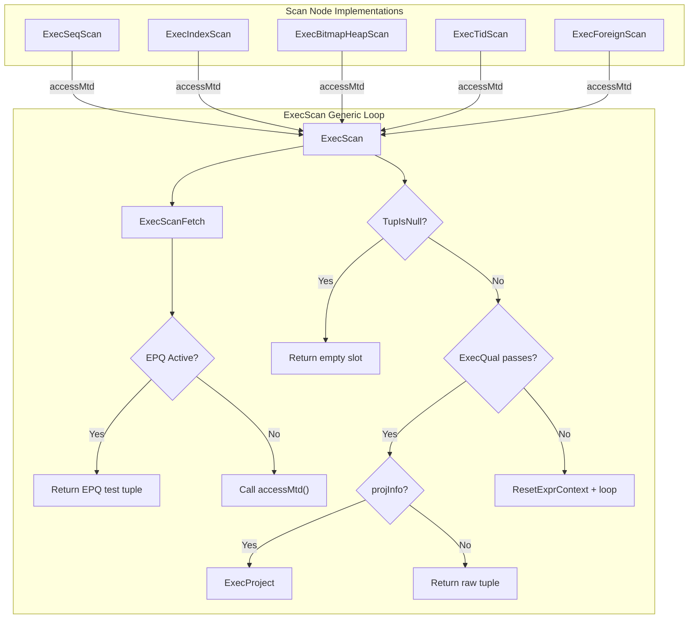
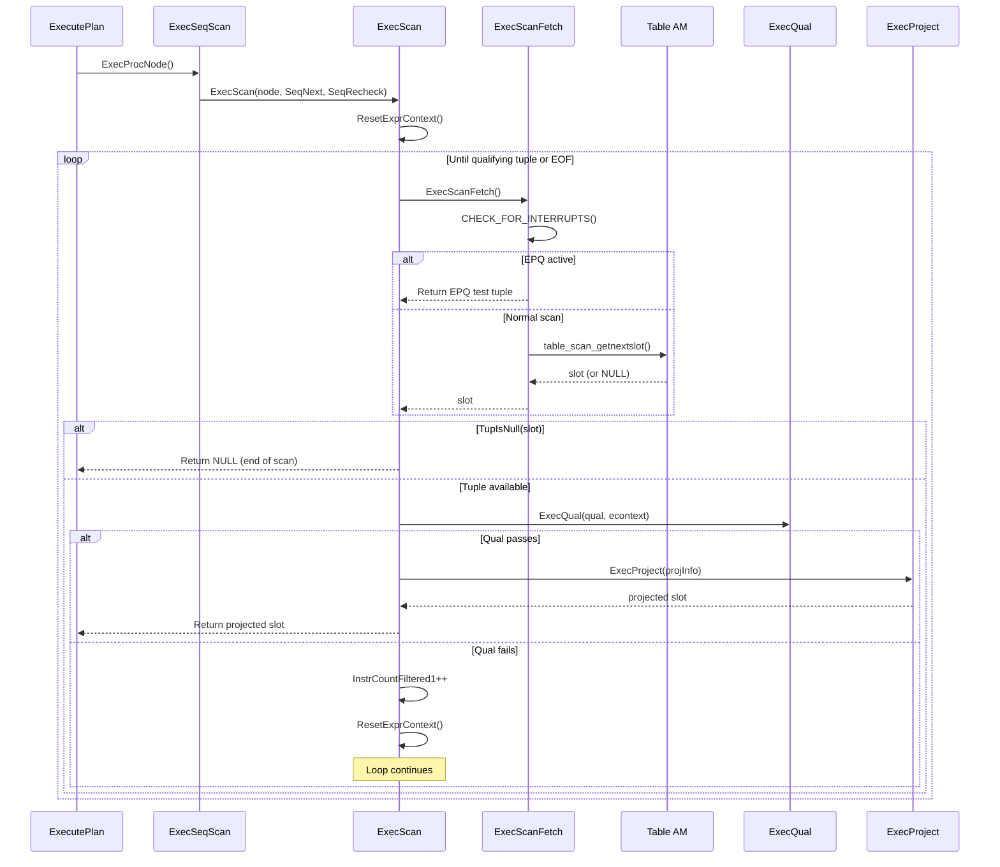

# Chapter 8: Scan Infrastructure

> **Prerequisites**: [Chapter 3 -- Executor Lifecycle](03_executor_lifecycle.md), [Chapter 5 -- Volcano Iterator Model](05_volcano_model.md), [Chapter 7 -- Expression Evaluation](07_expression_evaluation.md)
> **Next**: [Chapter 9 -- Join Infrastructure](09_join_infrastructure.md)
> **Node catalog details**: [Chapter 15 -- Scan Nodes](15_scan_nodes.md)

---

## 8.1 Overview

The scan infrastructure provides the generic framework that all 16 scan node types
in PostgreSQL use to retrieve tuples from base relations. At its core is
`ExecScan()`, a universal scan loop defined in `src/backend/executor/execScan.c`
that implements the **fetch-qualify-project** pipeline. Each specific scan node
(SeqScan, IndexScan, BitmapHeapScan, and others) plugs into this framework by
providing two callback functions: an **access method** that fetches the next raw
tuple, and a **recheck method** that validates tuples under certain conditions
such as EvalPlanQual rechecks.

This design cleanly separates the generic executor logic (qualification testing,
projection, per-tuple memory management) from the storage-specific tuple retrieval
logic, enabling PostgreSQL's pluggable Table AM and Index AM abstractions.

**Key symbols covered in this chapter**: `ExecScan`, `ExecSeqScan`,
`ExecIndexScan`, `ExecBitmapHeapScan`, `ScanState`.

---

## 8.2 Key Concepts

- **Volcano/Iterator Model**: Each scan node returns one tuple per call to
  `ExecProcNode()` (see [Chapter 5](05_volcano_model.md)), which internally
  delegates to `ExecScan()`.
- **ScanState**: Base execution state struct inherited by all scan nodes, holding
  the scan relation, scan descriptor, and scan tuple slot.
- **Table AM**: Pluggable storage abstraction (`tableam.h`) that allows different
  heap implementations (currently only the heap AM is built-in).
- **Index AM**: Pluggable index access method (`indexam.c`) supporting B-tree,
  Hash, GiST, SP-GiST, GIN, and BRIN.
- **EvalPlanQual (EPQ)**: Mechanism for rechecking tuples during concurrent
  UPDATE operations; `ExecScanFetch` handles EPQ substitution.

---

## 8.3 Architecture



---

## 8.4 ExecScan -- The Universal Scan Loop

### Signature

```c
/* src/backend/executor/execScan.c:155 */
TupleTableSlot *
ExecScan(ScanState *node,
         ExecScanAccessMtd accessMtd,
         ExecScanRecheckMtd recheckMtd)
```

### Parameters

| Parameter | Type | Description |
|-----------|------|-------------|
| `node` | `ScanState *` | Base scan state containing qual, projection, and expression context |
| `accessMtd` | `ExecScanAccessMtd` | Node-specific function that returns the next tuple from the data source |
| `recheckMtd` | `ExecScanRecheckMtd` | Function to recheck tuples during EPQ processing |

### Return Value

A `TupleTableSlot *` containing the next qualifying, projected tuple.
Returns NULL (empty slot) when no more qualifying tuples exist.

### Algorithm

The function operates as an infinite loop:

1. **Fast path check**: If there is no qual and no projection, skip all overhead
   and return the raw scan tuple directly. This optimization avoids function
   call overhead for simple `SELECT *` queries.

2. **Per-tuple memory reset**: Calls `ResetExprContext(econtext)` to free
   expression evaluation storage from the previous tuple cycle. This prevents
   memory leaks during long scans (see [Chapter 6 -- Memory Management](06_memory_management.md)).

3. **Fetch loop**:
   - Calls `ExecScanFetch()` to obtain the next candidate tuple
   - If the slot is empty, returns an empty result slot
   - Sets `econtext->ecxt_scantuple` for expression evaluation
   - Evaluates the qualification via `ExecQual(qual, econtext)` (see [Chapter 7](07_expression_evaluation.md))
   - On pass: applies projection via `ExecProject()` or returns the raw tuple
   - On fail: increments `InstrCountFiltered1` (for EXPLAIN ANALYZE), resets
     the expression context, and loops

```c
/* src/backend/executor/execScan.c:225-247 */
if (qual == NULL || ExecQual(qual, econtext))
{
    if (projInfo)
    {
        return ExecProject(projInfo);
    }
    else
    {
        return slot;
    }
}
else
    InstrCountFiltered1(node, 1);
```

### Integration Points

- **Called by**: All 16 scan types -- ExecSeqScan, ExecIndexScan,
  ExecIndexOnlyScan, ExecBitmapHeapScan, ExecTidScan, ExecTidRangeScan,
  ExecSubqueryScan, ExecFunctionScan, ExecTableFuncScan, ExecValuesScan,
  ExecCteScan, ExecNamedTuplestoreScan, ExecWorkTableScan, ExecForeignScan,
  ExecSampleScan, ExecCustomScan
- **Calls**: `ExecScanFetch`, `ExecQual`, `ExecProject`, `ResetExprContext`

For per-node behavior details, see [Chapter 15 -- Scan Nodes](15_scan_nodes.md).

---

## 8.5 ExecScanFetch -- EPQ-Aware Tuple Retrieval

```c
/* src/backend/executor/execScan.c:33 */
static inline TupleTableSlot *
ExecScanFetch(ScanState *node,
              ExecScanAccessMtd accessMtd,
              ExecScanRecheckMtd recheckMtd)
```

This internal helper retrieves the next candidate tuple, handling EvalPlanQual
(EPQ) substitution when the executor is rechecking a tuple due to a concurrent
UPDATE. It first calls `CHECK_FOR_INTERRUPTS()` to handle cancel/die signals,
then checks whether EPQ recheck is active (`estate->es_epq_active != NULL`):

| EPQ Condition | Behavior |
|---------------|----------|
| `scanrelid == 0` | ForeignScan/CustomScan with pushed-down join; recheck method provides tuple |
| `relsubs_done[scanrelid-1]` is true | Returns empty slot (EPQ tuple already returned) |
| `relsubs_slot[scanrelid-1]` is non-NULL | Returns the replacement tuple from EPQ caller |
| `relsubs_rowmark[scanrelid-1]` is non-NULL | Fetches replacement via `EvalPlanQualFetchRowMark` |
| No EPQ active | Calls `accessMtd(node)` for normal tuple retrieval |

---

## 8.6 Data Structures

### ScanState

The base execution state for all scan nodes. It extends `PlanState` (the Volcano
interface, see [Chapter 5](05_volcano_model.md)) with scan-specific fields.

```c
/* src/include/nodes/execnodes.h */
typedef struct ScanState
{
    PlanState   ps;                 /* base plan state (qual, projection, etc.) */
    Relation    ss_currentRelation; /* relation being scanned (NULL for non-table) */
    struct TableScanDescData *ss_currentScanDesc; /* Table AM scan descriptor */
    TupleTableSlot *ss_ScanTupleSlot; /* slot holding the current scan tuple */
} ScanState;
```

Key fields:
- **ps.qual**: Compiled WHERE clause predicate, evaluated by `ExecQual()` inside `ExecScan()`
- **ps.ps_ProjInfo**: Projection info for target list evaluation; NULL if no projection needed
- **ps.ps_ExprContext**: Expression context providing per-tuple memory management
- **ss_currentRelation**: The open `Relation` handle (for table/index scans)
- **ss_currentScanDesc**: Opaque scan descriptor from the Table AM layer
- **ss_ScanTupleSlot**: Slot with the tuple descriptor matching the scanned relation

All specific scan state types (SeqScanState, IndexScanState, etc.) embed
`ScanState` as their first member, enabling polymorphic dispatch.

### Access Method Callbacks

```c
/* src/include/executor/executor.h */
typedef TupleTableSlot *(*ExecScanAccessMtd) (ScanState *node);
typedef bool (*ExecScanRecheckMtd) (ScanState *node, TupleTableSlot *slot);
```

Each scan node provides concrete implementations:

| Scan Type | Access Method | Recheck Method | Source File |
|-----------|--------------|----------------|-------------|
| SeqScan | `SeqNext` | `SeqRecheck` | `nodeSeqscan.c` |
| IndexScan | `IndexNext` | `IndexRecheck` | `nodeIndexscan.c` |
| BitmapHeapScan | `BitmapHeapNext` | `BitmapHeapRecheck` | `nodeBitmapHeapscan.c` |

---

## 8.7 Table AM Abstraction

The Table Access Method layer provides a pluggable interface for tuple storage.
The heap AM is the default and only built-in implementation in PostgreSQL 17.

### Key Table AM Functions

| Function | Purpose | Header |
|----------|---------|--------|
| `table_beginscan()` | Opens a scan on a table relation with specified snapshot and scan keys | `tableam.h` |
| `table_scan_getnextslot()` | Fetches the next tuple into a TupleTableSlot | `tableam.h` |
| `table_endscan()` | Closes the scan and releases resources | `tableam.h` |
| `table_rescan()` | Restarts the scan from the beginning | `tableam.h` |

The SeqScan node uses these in its access method:

```c
/* Simplified from src/backend/executor/nodeSeqscan.c */
static TupleTableSlot *
SeqNext(SeqScanState *node)
{
    TableScanDesc scandesc = node->ss.ss_currentScanDesc;
    TupleTableSlot *slot = node->ss.ss_ScanTupleSlot;

    if (scandesc == NULL)
    {
        scandesc = table_beginscan(node->ss.ss_currentRelation,
                                   estate->es_snapshot, 0, NULL);
        node->ss.ss_currentScanDesc = scandesc;
    }

    if (table_scan_getnextslot(scandesc, direction, slot))
        return slot;
    return NULL;
}
```

For more on `TupleTableSlot`, see [Chapter 4 -- Tuple Table Slots](04_tuple_table_slots.md).

---

## 8.8 Index AM Abstraction

The Index Access Method layer enables different index types (B-tree, Hash, GiST,
SP-GiST, GIN, BRIN) to be used transparently by the executor.

### Key Index AM Functions

| Function | Purpose | Source |
|----------|---------|--------|
| `index_beginscan()` | Opens an index scan with the specified relation and scan keys | `indexam.c` |
| `index_getnext_slot()` | Fetches the next matching tuple via the index | `indexam.c` |
| `index_rescan()` | Restarts the index scan with new keys | `indexam.c` |
| `index_endscan()` | Closes the index scan | `indexam.c` |

### Runtime Keys for Parameterized Scans

For parameterized index scans (commonly used inside nested loop joins; see
[Chapter 9](09_join_infrastructure.md)), scan keys may depend on values from
outer plan nodes. These are called "runtime keys":

- `ExecIndexEvalRuntimeKeys()` evaluates Param expressions to compute actual
  scan key values
- The scan is started or restarted with the newly computed keys
- This mechanism enables efficient index lookups driven by the NestLoop outer
  tuple

The parameter passing mechanism is described in detail in
[Chapter 13 -- Planner Interface](13_planner_interface.md).

### Index-Only Scans

Index-only scans (`ExecIndexOnlyScan`) avoid heap fetches when:

1. All required columns are available in the index
2. The visibility map confirms the heap page is all-visible

When the heap page is not all-visible, the scan falls back to fetching the heap
tuple to check visibility. See [Chapter 15](15_scan_nodes.md) for the full
IndexOnlyScan node description.

---

## 8.9 Bitmap Scan -- Two-Phase Execution

Bitmap scans operate in two distinct phases, using a different dispatch mechanism
than standard one-tuple-at-a-time scans.

### Phase 1: Bitmap Construction

One or more `BitmapIndexScan` nodes build a TIDBitmap:

```
BitmapHeapScan
    -> BitmapAnd (or BitmapOr)
        -> BitmapIndexScan on idx_a
        -> BitmapIndexScan on idx_b
```

- `MultiExecBitmapIndexScan()` builds a `TIDBitmap` containing the TIDs of
  matching tuples
- `MultiExecBitmapAnd()` / `MultiExecBitmapOr()` combine multiple bitmaps
  using set intersection/union
- These nodes use `MultiExecProcNode()` rather than `ExecProcNode()` because
  they return a data structure rather than individual tuples (see
  [Chapter 5](05_volcano_model.md) for the distinction)

### Phase 2: Heap Fetch

`ExecBitmapHeapScan` iterates over the bitmap and fetches matching heap pages:

- Pages are fetched in **physical order** (not index order), which is I/O-efficient
- **Exact pages**: The bitmap contains exact TIDs; recheck only needs to verify visibility
- **Lossy pages**: When the bitmap exceeds `work_mem`, it degrades to page-level
  granularity. All tuples on the page must be fetched and rechecked against the
  original index conditions
- **Prefetching**: The executor prefetches upcoming heap pages to overlap I/O
  with processing

### Parallel Bitmap Scan

In parallel mode, workers share a single `TBMSharedIterator`:

- One worker builds the bitmap (via `MultiExecProcNode`)
- All workers share the iterator, each fetching different pages
- The shared state is coordinated through a condition variable

See [Chapter 12 -- Parallel Execution](12_parallel_execution.md) for the
parallel coordination infrastructure.

---

## 8.10 Scan Direction

The executor supports three scan directions, controlled by `ScanDirection`:

```c
/* src/include/access/sdir.h */
typedef enum ScanDirection
{
    BackwardScanDirection = -1,
    NoMovementScanDirection = 0,
    ForwardScanDirection = 1
} ScanDirection;
```

| Direction | Usage |
|-----------|-------|
| `ForwardScanDirection` | Normal left-to-right scanning (default) |
| `BackwardScanDirection` | Used by cursors with `FETCH BACKWARD`; requires `EXEC_FLAG_BACKWARD` |
| `NoMovementScanDirection` | Used by `FETCH CURRENT` in cursors |

The `EXEC_FLAG_BACKWARD` flag is propagated during `ExecInitNode()` to ensure
that underlying access methods allocate the data structures needed for backward
scanning. See [Chapter 13](13_planner_interface.md) for eflags propagation.

---

## 8.11 ExecScanReScan

```c
/* src/backend/executor/execScan.c:296 */
void
ExecScanReScan(ScanState *node)
```

Called within the ReScan function of any scan node that uses `ExecScan()`. It
clears the current scan tuple slot and resets EvalPlanQual state for the scan
relation. This is essential for nested loop rescans (see
[Chapter 9](09_join_infrastructure.md)) and other cases where the scan must
restart from the beginning.

---

## 8.12 ExecAssignScanProjectionInfo

```c
/* src/backend/executor/execScan.c:269 */
void
ExecAssignScanProjectionInfo(ScanState *node)
```

Sets up projection info for a scan node. If the requested target list exactly
matches the underlying tuple type (common for `SELECT *` or when join nodes
above the scan do not require additional columns), `ps_ProjInfo` is set to NULL,
enabling the fast path in `ExecScan()` that skips projection entirely.

---

## 8.13 Processing Flow



---

## 8.14 Implementation Notes

1. **Per-tuple memory management**: The `ResetExprContext()` call at the top of
   each loop iteration is critical. Without it, expression evaluation storage
   would accumulate and cause memory bloat during large scans.

2. **Interrupt checking**: `CHECK_FOR_INTERRUPTS()` is placed inside
   `ExecScanFetch()` rather than in the main loop, ensuring that even
   long-running access method calls can be interrupted.

3. **InstrCountFiltered1 vs InstrCountFiltered2**: `InstrCountFiltered1` counts
   tuples rejected by the scan node's own qual. `InstrCountFiltered2` (used in
   join nodes, see [Chapter 9](09_join_infrastructure.md)) counts tuples
   rejected by join quals. These counters appear in `EXPLAIN ANALYZE` output as
   "Rows Removed by Filter".

4. **Projection optimization**: The planner preferentially generates target lists
   that match the scan tuple descriptor, avoiding the overhead of projection.
   This is signaled by `ps_ProjInfo == NULL`.

---

**See also**: [Chapter 15 -- Scan Nodes](15_scan_nodes.md) for per-node details
on SeqScan, IndexScan, IndexOnlyScan, BitmapHeapScan, TidScan, ForeignScan,
and all other scan types.
