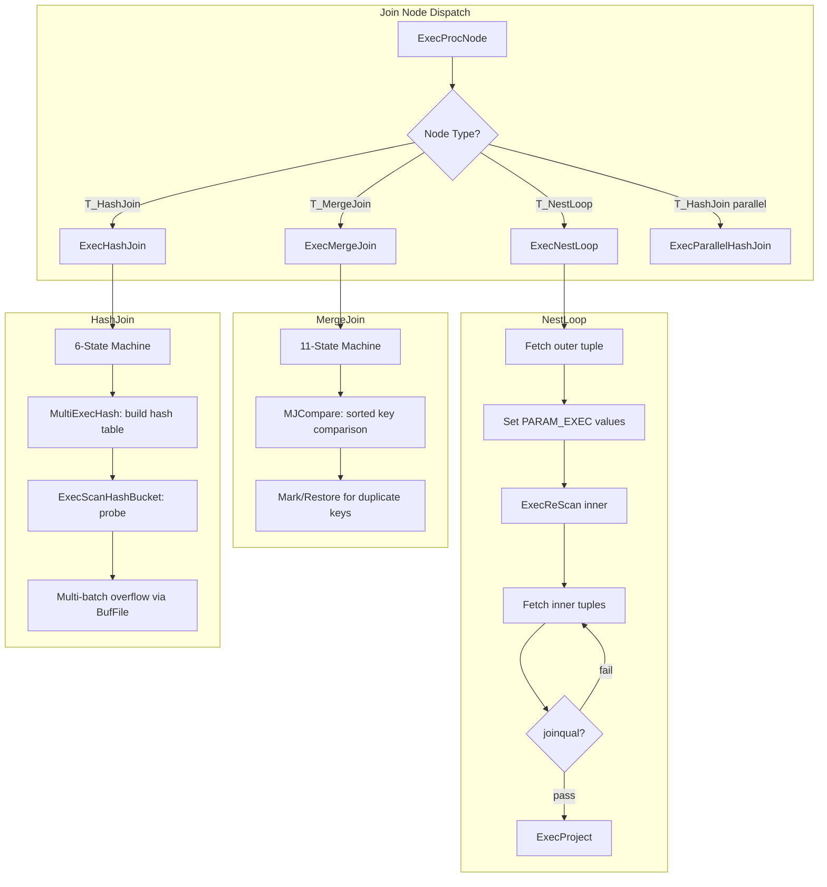
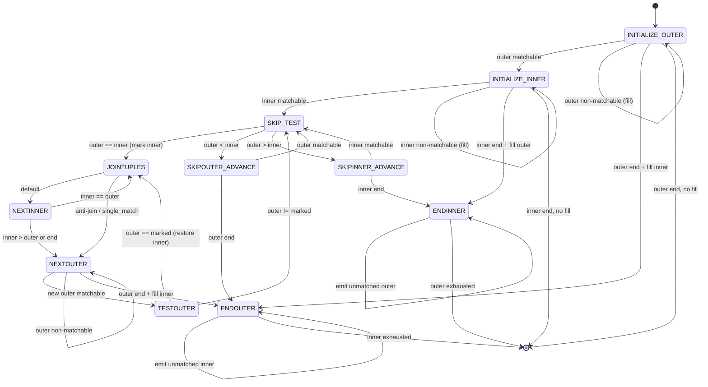
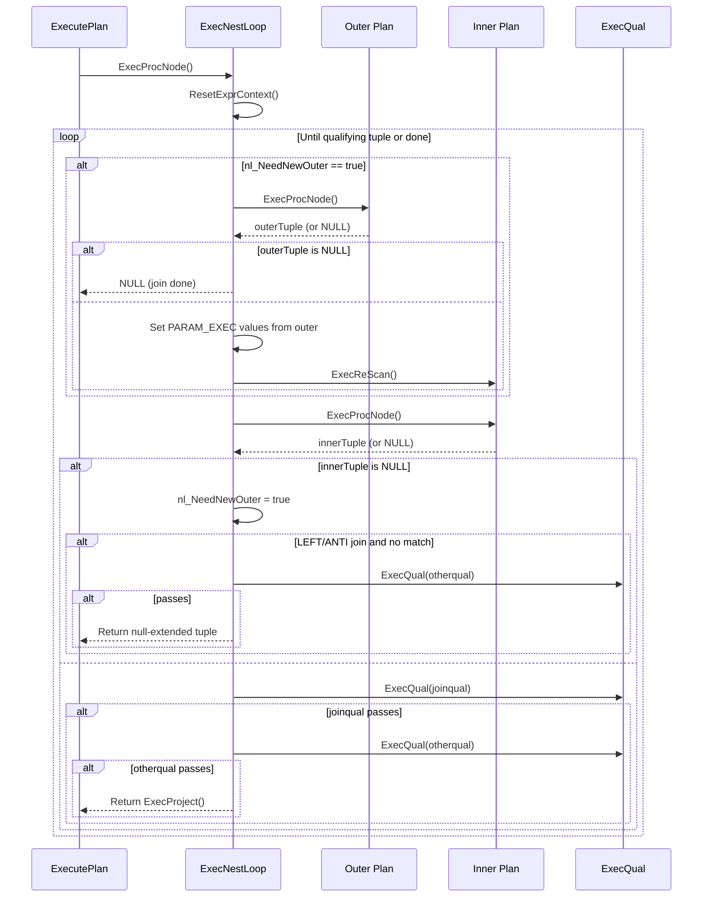
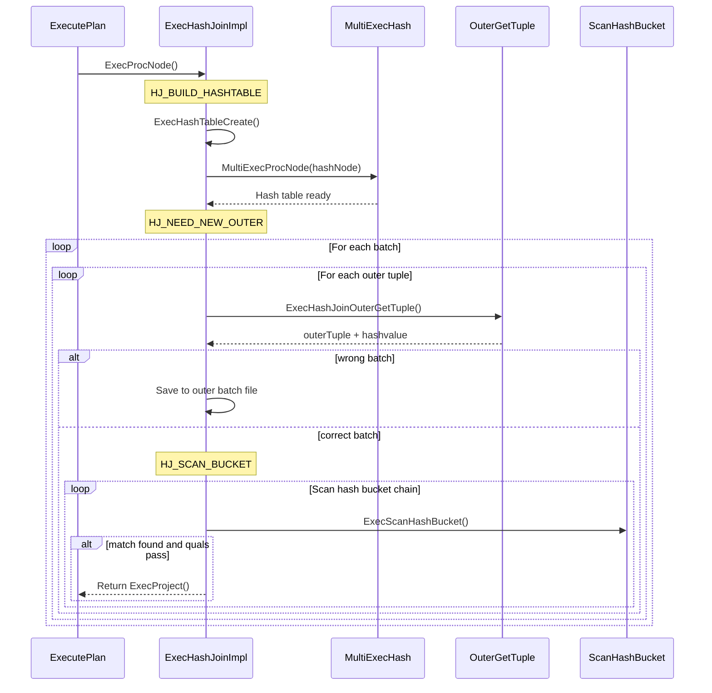

# Chapter 9: Join Infrastructure

> **Prerequisites**: [Chapter 5 -- Volcano Iterator Model](05_volcano_model.md), [Chapter 7 -- Expression Evaluation](07_expression_evaluation.md), [Chapter 8 -- Scan Infrastructure](08_scan_infrastructure.md)
> **Next**: [Chapter 10 -- Aggregation and Grouping](10_aggregation_and_grouping.md)
> **Node catalog details**: [Chapter 16 -- Join Nodes](16_join_nodes.md)

---

## 9.1 Overview

The PostgreSQL executor implements three fundamental join algorithms: **Nested
Loop Join**, **Merge Join**, and **Hash Join**. All three share the `JoinState`
base struct (which extends `PlanState`) and support the same set of join types:
INNER, LEFT, RIGHT, FULL, SEMI, ANTI, RIGHT_SEMI, and RIGHT_ANTI. The planner
selects the join algorithm based on cost estimation, available sort orderings,
and the join predicate structure.

Each join node follows the Volcano/iterator model (see [Chapter 5](05_volcano_model.md)),
returning one tuple per call to `ExecProcNode()`. Join nodes pull tuples from
their outer (left) and inner (right) child nodes, test them against join
qualifications, and project the result. All three algorithms handle outer-join
null-extension and optimize semi/anti joins by short-circuiting after the first
match.

**Key symbols covered in this chapter**: `ExecNestLoop`, `ExecMergeJoin`,
`ExecHashJoinImpl`, `ExecInitHashJoin`, `ExecInitNestLoop`, `MultiExecHash`,
`ExecHashTableCreate`.

---

## 9.2 Key Concepts

- **JoinState**: Base execution state struct inherited by NestLoopState,
  MergeJoinState, and HashJoinState. Contains `jointype`, `joinqual`, and
  `single_match`.
- **Two-level qualification**: `joinqual` determines whether tuples "match"
  (affecting outer-join fill logic), while `otherqual` (stored in `ps.qual`)
  filters which matched tuples are returned.
- **Null-Extension**: For LEFT/RIGHT/FULL/ANTI joins, when an outer or inner
  tuple has no matches, a "fake" join tuple is created by combining the real
  tuple with a pre-allocated all-NULLs slot.
- **InstrCountFiltered1 / InstrCountFiltered2**: EXPLAIN ANALYZE counters.
  Filtered1 counts tuples rejected by `joinqual`; Filtered2 counts tuples that
  passed `joinqual` but failed `otherqual`.
- **Parameterized Joins**: NestLoop supports parameterized inner scans where
  outer column values are passed to the inner plan via PARAM_EXEC parameters
  (see [Chapter 13](13_planner_interface.md)), enabling index lookups on the
  inner relation.

---

## 9.3 Architecture



---

## 9.4 Data Structures

### JoinState

```c
/* src/include/nodes/execnodes.h */
typedef struct JoinState
{
    PlanState   ps;              /* base plan state */
    JoinType    jointype;        /* JOIN_INNER, JOIN_LEFT, etc. */
    bool        single_match;    /* true for semi-join or inner_unique */
    ExprState  *joinqual;        /* join qualification */
} JoinState;
```

### NestLoopState

```c
typedef struct NestLoopState
{
    JoinState   js;
    bool        nl_NeedNewOuter;
    bool        nl_MatchedOuter;
    TupleTableSlot *nl_NullInnerTupleSlot;  /* for LEFT/ANTI null-fill */
} NestLoopState;
```

### MergeJoinState

```c
typedef struct MergeJoinState
{
    JoinState   js;
    int         mj_NumClauses;
    MergeJoinClause mj_Clauses;
    int         mj_JoinState;           /* current EXEC_MJ_* state */
    bool        mj_MatchedOuter;
    bool        mj_MatchedInner;
    TupleTableSlot *mj_MarkedTupleSlot; /* marked position for restore */
    TupleTableSlot *mj_NullOuterTupleSlot;
    TupleTableSlot *mj_NullInnerTupleSlot;
    bool        mj_FillOuter;           /* LEFT or FULL join */
    bool        mj_FillInner;           /* RIGHT or FULL join */
    bool        mj_ExtraMarks;
} MergeJoinState;
```

### HashJoinState

```c
typedef struct HashJoinState
{
    JoinState   js;
    HashJoinTable hj_HashTable;
    int         hj_JoinState;           /* current HJ_* state */
    uint32      hj_CurHashValue;
    int         hj_CurBucketNo;
    int         hj_CurSkewBucketNo;
    HashJoinTuple hj_CurTuple;
    bool        hj_MatchedOuter;
    bool        hj_OuterNotEmpty;
    TupleTableSlot *hj_NullOuterTupleSlot;
    TupleTableSlot *hj_NullInnerTupleSlot;
} HashJoinState;
```

---

## 9.5 ExecNestLoop

### Signature

```c
/* src/backend/executor/nodeNestloop.c:59 */
static TupleTableSlot *
ExecNestLoop(PlanState *pstate)
```

### Algorithm

The function operates as a simple two-level nested loop with state maintained
across calls via `nl_NeedNewOuter` and `nl_MatchedOuter`:

1. **Memory reset**: `ResetExprContext(econtext)` frees previous-cycle expression
   storage.

2. **Outer tuple fetch**: When `nl_NeedNewOuter` is true:
   - Fetches the next outer tuple via `ExecProcNode(outerPlan)`
   - If outer is exhausted, returns NULL (join complete)
   - **Parameterized rescan**: For each `NestLoopParam` in `nl->nestParams`,
     extracts the attribute from the outer tuple via `slot_getattr()`, stores it
     in the PARAM_EXEC slot, and marks the inner plan's `chgParam` bitmap. This
     causes the subsequent `ExecReScan(innerPlan)` to restart the inner scan
     with new parameter values -- enabling index lookups driven by the outer
     tuple. See [Chapter 13](13_planner_interface.md) for parameter mechanics.
   - Calls `ExecReScan(innerPlan)` to restart the inner scan

3. **Inner tuple fetch**: Gets the next inner tuple via `ExecProcNode(innerPlan)`.

4. **Inner exhaustion handling**: When inner is exhausted:
   - Sets `nl_NeedNewOuter = true`
   - For LEFT/ANTI joins: if the current outer had no match, creates a
     null-extended tuple and tests `otherqual`

5. **Qualification testing**:

```c
/* src/backend/executor/nodeNestloop.c:213-244 */
if (ExecQual(joinqual, econtext))
{
    node->nl_MatchedOuter = true;

    if (node->js.jointype == JOIN_ANTI)
    {
        node->nl_NeedNewOuter = true;
        continue;       /* anti-join: never return a matched tuple */
    }

    if (node->js.single_match)
        node->nl_NeedNewOuter = true;   /* semi-join: one match suffices */

    if (otherqual == NULL || ExecQual(otherqual, econtext))
        return ExecProject(node->js.ps.ps_ProjInfo);
    else
        InstrCountFiltered2(node, 1);
}
else
    InstrCountFiltered1(node, 1);
```

### Performance

- Non-parameterized: O(N * M)
- With parameterized inner (index scan): O(N * log(M)) per outer tuple
- The planner sets `EXEC_FLAG_REWIND` on the inner plan when there are no
  `nestParams`, enabling the inner node to use cheap restart

---

## 9.6 ExecMergeJoin

### Signature

```c
/* src/backend/executor/nodeMergejoin.c:598 */
static TupleTableSlot *
ExecMergeJoin(PlanState *pstate)
```

### State Machine

The merge join is implemented as a finite state machine with 11 states:

```c
#define EXEC_MJ_INITIALIZE_OUTER    1
#define EXEC_MJ_INITIALIZE_INNER    2
#define EXEC_MJ_JOINTUPLES          3
#define EXEC_MJ_NEXTOUTER           4
#define EXEC_MJ_TESTOUTER           5
#define EXEC_MJ_NEXTINNER           6
#define EXEC_MJ_SKIP_TEST           7
#define EXEC_MJ_SKIPOUTER_ADVANCE   8
#define EXEC_MJ_SKIPINNER_ADVANCE   9
#define EXEC_MJ_ENDOUTER            10
#define EXEC_MJ_ENDINNER            11
```



### Key States

| State | Description |
|-------|-------------|
| INITIALIZE_OUTER/INNER | Fetch first tuples, evaluate merge keys |
| SKIP_TEST | Main synchronization: compare outer vs inner merge keys |
| JOINTUPLES | Keys match; test joinqual and otherqual, project result |
| NEXTOUTER/NEXTINNER | Advance to next tuple on the respective side |
| TESTOUTER | Compare new outer against marked inner (handles duplicate keys) |
| SKIPOUTER/SKIPINNER_ADVANCE | Advance past non-matching values |
| ENDOUTER/ENDINNER | One side exhausted; emit null-fill for remaining unmatched |

### Mark/Restore Protocol

When duplicate keys exist in both relations, merge join must produce the cross
product:

1. When merge keys first match in SKIP_TEST, the inner position is **marked**
2. Inner tuples are consumed one by one in NEXTINNER/JOINTUPLES
3. When advancing to the next outer in NEXTOUTER, state moves to TESTOUTER
4. In TESTOUTER, the new outer is compared against the **marked** inner tuple
5. If they match, the inner scan is **restored** to the mark, re-joining all
   inner duplicates with the new outer
6. If they do not match, proceed to SKIP_TEST with the current inner position

### Helper Functions

- `MJExamineQuals()`: Deconstructs merge clauses into `MergeJoinClauseData`
  with `SortSupportData` comparators
- `MJEvalOuterValues()` / `MJEvalInnerValues()`: Evaluate merge key expressions;
  return MATCHABLE, NONMATCHABLE (NULL key), or ENDOFJOIN
- `MJCompare()`: Compares outer and inner merge keys using `SortSupportData`
- `MJFillOuter()` / `MJFillInner()`: Create null-extended tuples

### Performance

- O(N + M) for non-duplicate keys
- With duplicates, cost includes the cross product of matching groups
- Requires both inputs sorted on merge keys; the planner ensures this via
  Sort nodes or matching index orderings

---

## 9.7 ExecHashJoinImpl -- Hybrid Hash Join

### Signature

```c
/* src/backend/executor/nodeHashjoin.c:219 */
static pg_attribute_always_inline TupleTableSlot *
ExecHashJoinImpl(PlanState *pstate, bool parallel)
```

The `pg_attribute_always_inline` attribute combined with the compile-time
constant `parallel` parameter causes the compiler to generate two specialized
versions (serial and parallel), with dead branches eliminated.

### State Machine

```c
#define HJ_BUILD_HASHTABLE     1
#define HJ_NEED_NEW_OUTER      2
#define HJ_SCAN_BUCKET         3
#define HJ_FILL_OUTER_TUPLE    4
#define HJ_FILL_INNER_TUPLES   5
#define HJ_NEED_NEW_BATCH      6
```

### Phase 1: Build (HJ_BUILD_HASHTABLE)

Executed exactly once:

1. **Empty-outer optimization**: For non-right/full joins, prefetches one outer
   tuple. If the outer is empty and no inner fill is needed, returns NULL
   immediately without building the hash table.

2. **Hash table creation**: `ExecHashTableCreate()` allocates the
   `HashJoinTableData`, configures buckets and batches based on estimated inner
   size and `work_mem`.

3. **Hash table population**: `MultiExecProcNode()` on the Hash child invokes
   `MultiExecPrivateHash()`, which reads all inner tuples, computes hash values,
   handles skew bucket insertion, and inserts tuples into hash buckets or saves
   them to batch files.

4. **Empty-inner check**: If hash table is empty and no outer fill needed,
   returns NULL.

### Phase 2: Probe (HJ_NEED_NEW_OUTER / HJ_SCAN_BUCKET)

**HJ_NEED_NEW_OUTER**: Fetches the next outer tuple, computes its hash value,
determines bucket and batch via `ExecHashGetBucketAndBatch()`. If the tuple
belongs to a different batch, saves it to the outer batch file for later.

**HJ_SCAN_BUCKET**: Walks the hash bucket chain via `ExecScanHashBucket()`,
comparing hash values and evaluating hash join clauses. On match: tests
`joinqual` and `otherqual`, handles ANTI/SEMI short-circuit, returns projected
tuple.

**HJ_FILL_OUTER_TUPLE**: For LEFT/ANTI joins, emits null-extended tuple for
unmatched outer.

**HJ_FILL_INNER_TUPLES**: For RIGHT/FULL joins, scans hash table for unmatched
inner tuples.

**HJ_NEED_NEW_BATCH**: Advances to the next batch via
`ExecHashJoinNewBatch()`. Loads inner tuples from saved batch file into a fresh
hash table. Returns NULL if no more batches.

### Multi-Batch Overflow (Hybrid Hash Join)

When the inner relation exceeds `work_mem`:

1. Number of batches is always a power of 2
2. If inserting a tuple would exceed `work_mem`, the executor doubles the batch
   count and redistributes tuples
3. Batch assignment: `batchno = (hashvalue >> nbatch_shift) & (nbatch - 1)`.
   Only batch 0 remains in memory; others go to temporary `BufFile`s
4. **Batch skip optimization**: `ExecHashJoinNewBatch()` skips batches where
   either batch file is empty
5. **Growth safety**: If a batch retains all or none of its tuples after
   redistribution, further batch growth is disabled (`growEnabled = false`)

### Skew Optimization

For frequently occurring hash values (Most Common Values from statistics):

- Special skew buckets are allocated during `ExecHashTableCreate()`
- Checked first via `ExecHashGetSkewBucket()`
- Prevents performance degradation from hot buckets

### Parallel Hash Join

Coordinates workers through barrier-based synchronization:

```
PHJ_BUILD_ELECT       -- initial state
PHJ_BUILD_ALLOCATE*   -- one worker allocates batches and table 0
PHJ_BUILD_HASH_INNER  -- all workers hash inner relation
PHJ_BUILD_HASH_OUTER  -- (multi-batch only) all workers hash outer
PHJ_BUILD_RUN         -- build done, probing begins
PHJ_BUILD_FREE*       -- one worker frees resources
```

Phases marked with `*` are performed by a single elected worker. Key differences
from serial mode:

1. **Shared hash table** in DSM (see [Chapter 12](12_parallel_execution.md))
2. **Upfront outer partitioning** during PHJ_BUILD_HASH_OUTER
3. **Batch distribution**: Each worker independently selects batches
4. **Per-batch barriers** with phases: ELECT, ALLOCATE, LOAD, PROBE, SCAN, FREE

### Performance

- Single-batch: O(N + M)
- Multi-batch adds I/O for batch files
- `work_mem` directly controls batch threshold

---

## 9.8 Initialization

### ExecInitNestLoop

```c
/* src/backend/executor/nodeNestloop.c:261 */
NestLoopState *
ExecInitNestLoop(NestLoop *node, EState *estate, int eflags)
```

1. Creates `NestLoopState`, sets `ExecProcNode = ExecNestLoop`
2. Initializes outer child with current `eflags`
3. Initializes inner child with modified flags:
   - `nestParams == NIL`: adds `EXEC_FLAG_REWIND` for cheap rescan
   - `nestParams != NIL`: removes `EXEC_FLAG_REWIND` (always rescan with new params)
4. Compiles `qual` and `joinqual` via `ExecInitQual()` (see [Chapter 7](07_expression_evaluation.md))
5. Sets `single_match = (inner_unique || JOIN_SEMI)`
6. For LEFT/ANTI joins: allocates `nl_NullInnerTupleSlot`

### ExecInitHashJoin

```c
/* src/backend/executor/nodeHashjoin.c:709 */
HashJoinState *
ExecInitHashJoin(HashJoin *node, EState *estate, int eflags)
```

1. Creates `HashJoinState`, sets `ExecProcNode` to `ExecHashJoin` or
   `ExecParallelHashJoin` based on parallel state
2. Initializes outer and inner (Hash) child plans
3. Compiles hash clauses, extracting outer/inner hash key expressions
4. Allocates `hj_HashOperators` and `hj_Collations` arrays
5. Sets up null-tuple slots based on join type
6. Sets initial state: `hj_JoinState = HJ_BUILD_HASHTABLE`

---

## 9.9 Processing Flows

### NestLoop Join



### Hash Join Two-Phase



---

## 9.10 Implementation Notes

1. **Two-level qualification**: All three algorithms separate `joinqual` from
   `otherqual`. Only `joinqual` affects `MatchedOuter`/`MatchedInner` flags.
   This ensures that filter conditions pushed into the join do not prevent
   null-extension of unmatched rows in outer joins.

2. **Semi-join and inner_unique optimization**: The `single_match` flag (set
   when `inner_unique` is true or join type is `JOIN_SEMI`) allows all three
   algorithms to skip remaining inner tuples after the first match. This
   significantly reduces work for EXISTS-subquery patterns.

3. **Anti-join handling**: A match causes the outer tuple to be *skipped*,
   while *unmatched* outer tuples are returned. Implemented uniformly across
   all three join types.

4. **Hash join compilation trick**: `ExecHashJoinImpl` is inlined with a
   compile-time constant `parallel` parameter, generating two specialized
   versions with dead branches eliminated.

5. **Merge join extra marks**: The `mj_ExtraMarks` flag controls whether mark
   operations are performed during SKIPINNER_ADVANCE transitions. Needed for
   RIGHT/FULL joins to correctly track which inner tuples have been matched.

6. **NULL handling in merge join**: NULL merge keys are treated as
   non-matchable, avoiding incorrect NULL=NULL matches. This is handled by
   `MJEvalOuterValues()`/`MJEvalInnerValues()` returning NONMATCHABLE.

---

**See also**: [Chapter 16 -- Join Nodes](16_join_nodes.md) for per-node catalog
entries, [Chapter 12 -- Parallel Execution](12_parallel_execution.md) for
parallel hash join coordination details.
