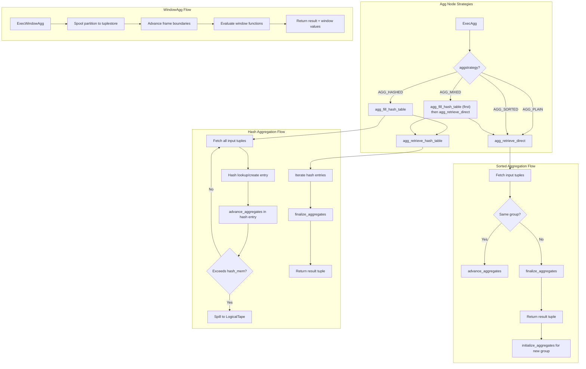
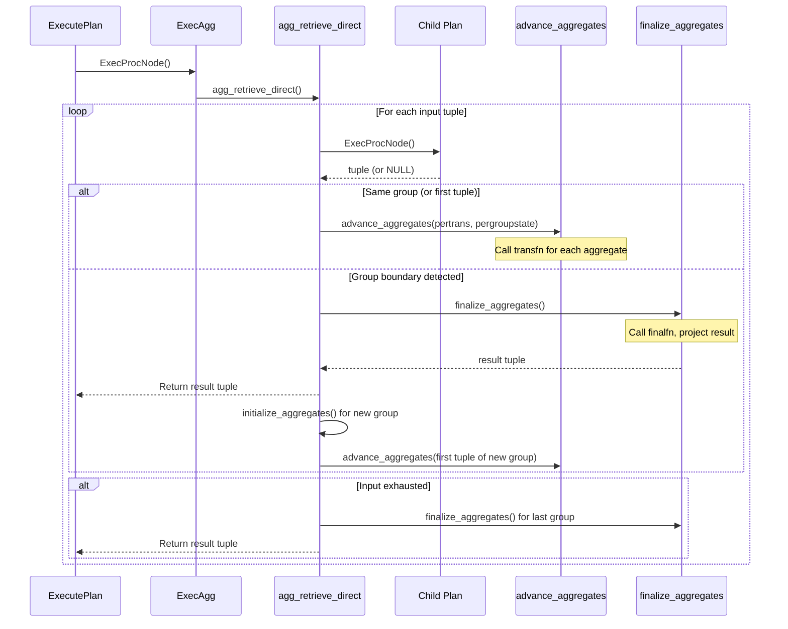
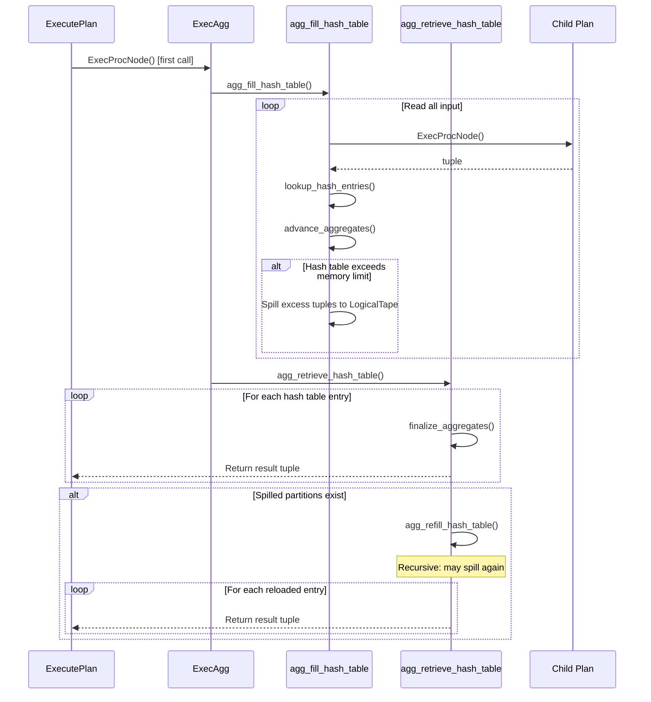
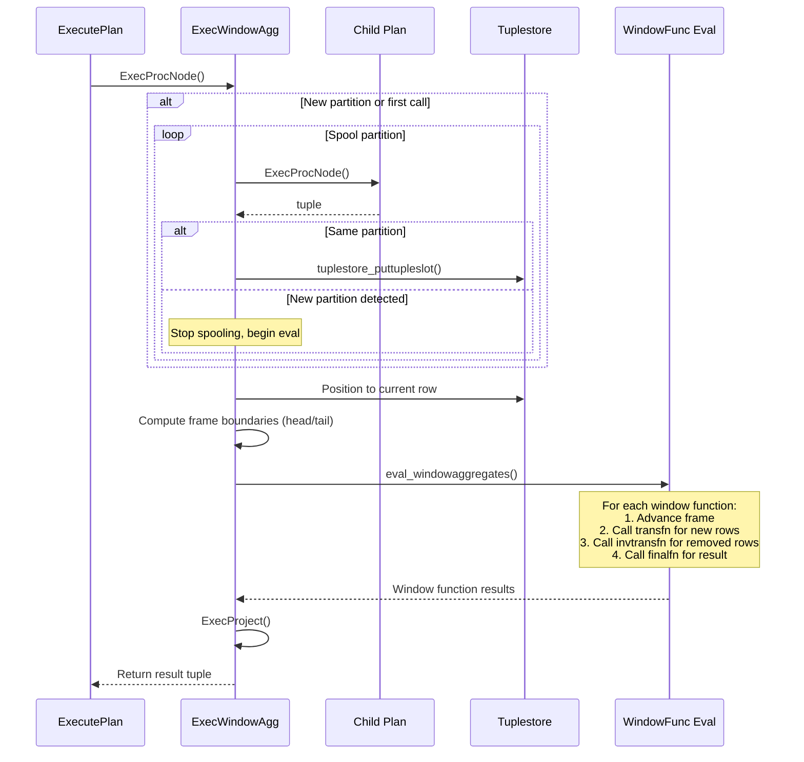

# Chapter 10: Aggregation and Grouping

> **Prerequisites**: [Chapter 5 -- Volcano Iterator Model](05_volcano_model.md), [Chapter 7 -- Expression Evaluation](07_expression_evaluation.md)
> **Next**: [Chapter 11 -- ModifyTable](11_modifytable.md)
> **Node catalog details**: [Chapter 17 -- Aggregation and Utility Nodes](17_aggregation_utility_nodes.md)

---

## 10.1 Overview

The PostgreSQL executor implements aggregation, grouping, and window function
evaluation through three primary node types: **Agg** (aggregation with four
strategies), **Group** (simple pre-sorted grouping), and **WindowAgg** (window
function evaluation). The Agg node is the most complex, supporting plain
aggregation (no grouping), sorted aggregation, hash aggregation, and mixed-mode
aggregation (for GROUPING SETS). Hash aggregation includes a sophisticated
spill-to-disk mechanism that allows processing datasets exceeding `work_mem`.

The WindowAgg node evaluates window functions using a tuplestore-based approach
where the entire partition is buffered, enabling random access to arbitrary rows
within the window frame.

**Key symbols covered in this chapter**: `ExecAgg`, `ExecInitAgg`,
`ExecWindowAgg`, `AggState`.

---

## 10.2 Key Concepts

- **Aggregation Strategies**: `AGG_PLAIN` (no grouping, single result),
  `AGG_SORTED` (pre-sorted input, sequential group detection), `AGG_HASHED`
  (hash table based grouping), `AGG_MIXED` (combines sorted and hashed for
  GROUPING SETS).
- **AggState Phases**: For GROUPING SETS, multiple "phases" are executed in
  sequence. Each phase may use sorted or hashed aggregation for different
  grouping set combinations.
- **Transition Functions**: Each aggregate has a transition function (`transfn`)
  that accumulates state and a final function (`finalfn`) that produces the
  result.
- **Per-Agg vs Per-Trans**: The executor separates per-aggregate state
  (`AggStatePerAggData`) from per-transition state (`AggStatePerTransData`)
  because multiple aggregates can share the same transition function (e.g.,
  `avg` and `count` both need a count accumulator).
- **Hash Aggregation Spill**: When hash tables exceed `hash_mem_threshold`,
  tuples are spilled to tape (via `LogicalTape`), then reprocessed recursively.
- **Window Frames**: Each window function operates over a frame defined by
  ROWS, RANGE, or GROUPS mode with start/end boundaries.

---

## 10.3 Architecture



---

## 10.4 Data Structures

### AggState

```c
/* src/include/nodes/execnodes.h (simplified) */
typedef struct AggState
{
    ScanState   ss;                 /* base scan state (reads from child plan) */
    List       *aggs;               /* list of Aggref nodes */
    int         numaggs;            /* count of aggregate functions */
    int         numtrans;           /* count of transition states */
    AggStrategy aggstrategy;        /* AGG_PLAIN, AGG_SORTED, AGG_HASHED, AGG_MIXED */
    AggStatePerAgg peragg;          /* per-aggregate state array */
    AggStatePerTrans pertrans;      /* per-transition state array */
    AggStatePerGroup *pergroups;    /* per-group state (for current groups) */
    int         numphases;          /* number of phases for GROUPING SETS */
    AggStatePerPhase phase;         /* current phase pointer */
    TupleHashTable *hashtable;      /* hash table(s) for AGG_HASHED */
    bool        table_filled;       /* true after hash table is populated */
    /* ... spill-related fields for hash aggregation ... */
} AggState;
```

### WindowAggState

```c
typedef struct WindowAggState
{
    ScanState   ss;
    WindowStatePerFunc perfunc;     /* per-window-function state */
    WindowStatePerAgg peragg;       /* per-aggregate state (for agg-based funcs) */
    int         numfuncs;
    int         numaggs;
    Tuplestorestate *buffer;        /* tuplestore for current partition */
    int         current_ptr;        /* tuplestore read pointer */
    int64       currentpos;         /* current row position in partition */
    int64       frameheadpos;       /* frame start position */
    int64       frametailpos;       /* frame end position */
    bool        partition_spooled;
    bool        all_done;
} WindowAggState;
```

### Aggregation Strategy Constants

```c
/* src/include/nodes/nodes.h */
typedef enum AggStrategy
{
    AGG_PLAIN,      /* simple agg across all input rows, no grouping */
    AGG_SORTED,     /* grouped agg, input must be sorted on group keys */
    AGG_HASHED,     /* grouped agg, uses hash table */
    AGG_MIXED,      /* grouped agg with hashed and sorted phases */
} AggStrategy;
```

---

## 10.5 ExecAgg

### Signature

```c
/* src/backend/executor/nodeAgg.c:2157 */
static TupleTableSlot *
ExecAgg(PlanState *pstate)
```

### Dispatch Logic

```c
if (!node->agg_done)
{
    switch (node->phase->aggstrategy)
    {
        case AGG_HASHED:
            if (!node->table_filled)
                agg_fill_hash_table(node);
            /* fall through */
        case AGG_MIXED:
            if (!node->table_filled)
                agg_fill_hash_table(node);
            result = agg_retrieve_hash_table(node);
            break;
        case AGG_PLAIN:
        case AGG_SORTED:
            result = agg_retrieve_direct(node);
            break;
    }
}
```

For `AGG_HASHED` and `AGG_MIXED`, the hash table is populated on the first call,
then results are retrieved. For `AGG_MIXED`, after the hash phase completes,
execution falls through to `agg_retrieve_direct()` for the sorted phases.

---

## 10.6 Sorted Aggregation (agg_retrieve_direct)

```c
/* src/backend/executor/nodeAgg.c:2190 */
static TupleTableSlot *
agg_retrieve_direct(AggState *aggstate)
```

Processes tuples sequentially with the following key steps:

1. **Group boundary detection**: For `AGG_SORTED`, compares grouping keys via
   `ExecQualAndReset()`. When keys differ, a group boundary is detected.

2. **Transition value accumulation**: Calls `advance_aggregates()` which invokes
   each aggregate's transition function.

3. **Group finalization**: At boundaries (or input exhaustion):
   - `finalize_aggregates()` invokes each aggregate's final function
   - Projects the result tuple containing group keys and aggregate results
   - Initializes transition values for the next group

4. **GROUPING SETS phase transitions**: For `AGG_MIXED`, multiple phases are
   processed sequentially. When a sorted phase completes, `aggstate->phase`
   advances to the next.

5. **AGG_PLAIN special case**: No grouping keys, exactly one result tuple
   produced from all input tuples.

```c
/* Simplified from nodeAgg.c */
if (aggstate->phase->aggstrategy == AGG_SORTED)
{
    if (aggstate->grp_firstTuple != NULL)
    {
        tmpcontext->ecxt_outertuple = firstSlot;
        tmpcontext->ecxt_innertuple = outerslot;

        if (!ExecQualAndReset(aggstate->phase->eqfunctions, tmpcontext))
        {
            /* Group boundary detected */
            finalize_aggregates(aggstate, ...);
            result = project_aggregates(aggstate);
            if (result)
                return result;
        }
    }
}
```

---

## 10.7 Hash Aggregation

### agg_fill_hash_table

```c
/* src/backend/executor/nodeAgg.c:2536 */
static void
agg_fill_hash_table(AggState *aggstate)
```

Reads all tuples from the child plan in a single pass:

1. For each input tuple, `lookup_hash_entries()` computes the hash value,
   looks up or creates the group entry. For GROUPING SETS, processes multiple
   hash tables (one per grouping set).

2. `advance_aggregates()` updates transition values in the hash entry.

3. **Memory management**: After each tuple, checks whether hash memory exceeds
   the threshold. If so, `hash_agg_check_limits()` triggers spilling to
   `LogicalTape`s organized by hash value partition.

4. After all input is consumed, sets `table_filled = true`.

The hash table uses `TupleHashTable` internally, implemented as a simplehash
table mapping grouping key tuples to aggregate state entries.

### agg_retrieve_hash_table

```c
/* src/backend/executor/nodeAgg.c:2738 */
static TupleTableSlot *
agg_retrieve_hash_table(AggState *aggstate)
```

Iterates through hash entries using `TupleHashTableNext()`:

1. Extracts stored grouping key values
2. `finalize_aggregates()` computes final aggregate values
3. Projects the result tuple

When the hash table is exhausted, if spilled partitions exist,
`agg_refill_hash_table()` loads a partition from tape, creates a new hash table,
and continues. This recursive spill/refill handles datasets much larger than
`work_mem`.

---

## 10.8 Processing Flows

### Sorted Aggregation



### Hash Aggregation with Spill



---

## 10.9 ExecInitAgg

```c
/* src/backend/executor/nodeAgg.c:3164 */
AggState *
ExecInitAgg(Agg *node, EState *estate, int eflags)
```

One of the most complex initialization functions in the executor (approximately
860 lines). Key steps:

1. **Strategy determination**: Sets `AGG_PLAIN`, `AGG_SORTED`, `AGG_HASHED`,
   or `AGG_MIXED` from the plan node.

2. **Phase initialization**: For GROUPING SETS, creates an
   `AggStatePerPhaseData` array. Each phase corresponds to a set of grouping
   columns processed together.

3. **Per-aggregate initialization**: For each aggregate function:
   - Resolves function OID
   - Looks up transition, final, combine, serialization/deserialization functions
   - Allocates `AggStatePerAggData` with function call info
   - Sets up transition value type and initial value

4. **Per-transition deduplication**: Multiple aggregates sharing the same
   transition function, input expressions, and sort specification share
   transition state, reducing function call overhead.

5. **Hash table creation**: For `AGG_HASHED`/`AGG_MIXED`, allocates one
   `TupleHashTable` per grouping set. Memory limit based on
   `hash_mem_multiplier * work_mem`.

6. **Expression compilation**: Compiles aggregate input, filter, and sort
   expressions via `ExecInitExpr` (see [Chapter 7](07_expression_evaluation.md)).

---

## 10.10 ExecWindowAgg

### Signature

```c
/* src/backend/executor/nodeWindowAgg.c:2045 */
static TupleTableSlot *
ExecWindowAgg(PlanState *pstate)
```

Unlike Agg, WindowAgg returns **every input row** with additional computed
window function columns rather than collapsing groups into single result rows.

### Algorithm

1. **Partition detection and spooling**: Reads tuples from the child plan and
   buffers them into a `Tuplestore`. Detects partition boundaries by comparing
   partition key columns.

2. **Frame boundary computation**: For each row, computes the window frame:
   - **ROWS**: Frame boundaries are row offsets
   - **RANGE**: Frame boundaries are value-based
   - **GROUPS**: Frame boundaries are based on peer groups

3. **Window function evaluation**: For each row:
   - Positions the tuplestore to the current row
   - **Aggregate-based window functions** (e.g., `SUM() OVER`): Use
     transition/final function mechanism with frame-aware accumulation
   - **Built-in window functions** (e.g., `row_number()`, `rank()`,
     `lead()`/`lag()`): Evaluated directly via the WindowObject API
   - Projects the result combining the original row with window values

4. **Run condition optimization**: When a "run condition" is present (e.g.,
   `row_number() <= 10`), the WindowAgg enters pass-through mode after the
   condition becomes permanently false, significantly improving performance
   for top-N windowed queries.

### Frame Management Optimization

For aggregate-based window functions, the executor uses an optimized incremental
approach:

- When the frame advances, only new rows entering the frame are processed
- The `invtransfn` (inverse transition function) removes rows leaving the frame
  from the running aggregate state
- Without an inverse transition function, the aggregate must be recomputed from
  scratch for each row -- an O(N*W) operation where W is average frame width

### Processing Flow



---

## 10.11 ExecInitWindowAgg

```c
/* src/backend/executor/nodeWindowAgg.c:2366 */
WindowAggState *
ExecInitWindowAgg(WindowAgg *node, EState *estate, int eflags)
```

1. Creates `WindowAggState`; child plan must not support BACKWARD or MARK
2. Sets up partition equality functions for boundary detection
3. Sets up order equality functions for peer group detection
4. For each window function:
   - Allocates `WindowStatePerFuncData`
   - Determines if the function is a plain aggregate or built-in window function
   - For aggregates: sets up transition, final, and optionally inverse transition
     functions
5. Compiles frame offset expressions
6. Allocates tuplestore for partition buffering

---

## 10.12 GROUPING SETS Implementation

GROUPING SETS (including ROLLUP and CUBE) are implemented using `AGG_MIXED`:

1. **Phase planning**: The planner decomposes grouping sets into phases.
   Grouping sets sharing a common sort order are processed together in a sorted
   phase; remaining sets use hash aggregation.

2. **Hash-first execution**: On the first call, `agg_fill_hash_table()` reads
   all input and populates hash tables for all hash-based grouping sets
   simultaneously.

3. **Hash retrieval**: `agg_retrieve_hash_table()` iterates through each hash
   table in turn.

4. **Sorted phases**: After hash retrieval completes, `agg_retrieve_direct()`
   processes sorted phases.

5. **GROUPING() function**: Evaluated during projection. For each grouping set,
   a bitmask indicates which columns are aggregated (NULL) vs grouped.

---

## 10.13 Hash Aggregation Spill-to-Disk

When the in-memory hash table exceeds `hash_mem_threshold` (controlled by
`hash_mem_multiplier * work_mem`):

1. **Partitioning**: Tuples that do not match existing hash entries are written
   to `LogicalTape`s, partitioned by hash value ranges. The partition count is
   chosen to keep each within `work_mem` when reloaded.

2. **Recursive processing**: After the initial pass, `agg_refill_hash_table()`
   reads a spill partition, creates a new hash table, and processes those tuples.
   If this sub-table also exceeds memory, it spills again (recursive).

3. **Progress tracking**: The executor tracks spill passes and bytes for
   EXPLAIN ANALYZE reporting.

---

## 10.14 Implementation Notes

1. **Per-tuple memory management**: `advance_aggregates()` uses a dedicated
   memory context (`aggcontext`) for transition values. This context persists
   for the aggregation's lifetime, while the expression evaluation context
   (`tmpcontext`) is reset per-tuple (see
   [Chapter 6 -- Memory Management](06_memory_management.md)).

2. **Ordered-set aggregates**: Aggregates with ORDER BY or DISTINCT (e.g.,
   `array_agg(x ORDER BY y)`) use tuplesort to sort input before applying the
   transition function.

3. **Aggregate filter clauses**: Each aggregate can have a FILTER clause
   (`Aggref.aggfilter`). The filter is evaluated per-tuple before calling the
   transition function.

4. **WindowAgg inverse transitions**: For sliding window aggregates, if an
   inverse transition function exists, the running state is updated
   incrementally. Without one, the entire frame must be recomputed per row.

5. **WindowAgg run conditions**: PostgreSQL 17 supports "run conditions" on
   window functions. When the condition becomes permanently false (monotonically
   increasing function exceeding the limit), the WindowAgg skips remaining rows.

---

**See also**: [Chapter 17 -- Aggregation and Utility Nodes](17_aggregation_utility_nodes.md)
for per-node catalog entries, [Chapter 7 -- Expression Evaluation](07_expression_evaluation.md)
for how aggregate expressions are compiled.
