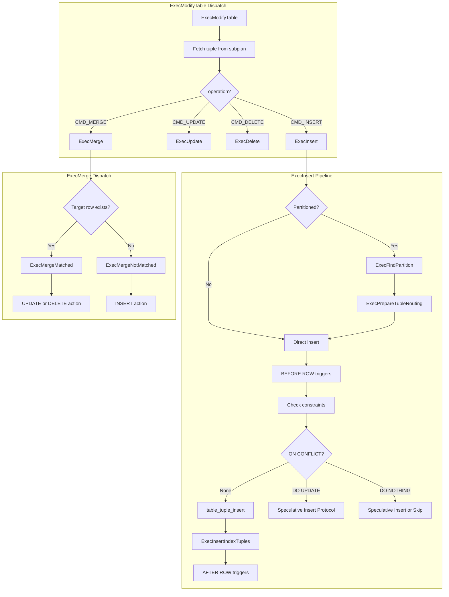
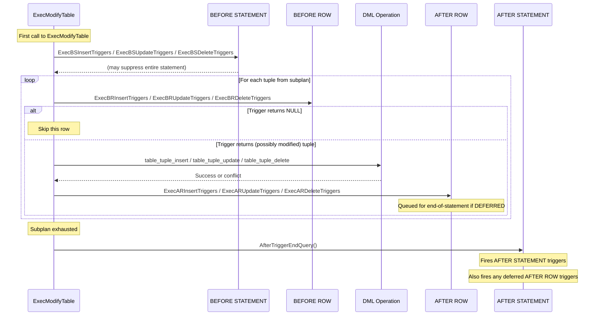

# Chapter 11: ModifyTable -- Data Modification

> **Prerequisites**: [Chapter 3 -- Executor Lifecycle](03_executor_lifecycle.md), [Chapter 5 -- Volcano Iterator Model](05_volcano_model.md), [Chapter 8 -- Scan Infrastructure](08_scan_infrastructure.md)
> **Next**: [Chapter 12 -- Parallel Execution](12_parallel_execution.md)
> **Node catalog details**: [Chapter 18 -- Data Modification Nodes](18_data_modification_nodes.md)

---

## 11.1 Overview

The `ModifyTable` node is the executor's central mechanism for all data
modification operations: INSERT, UPDATE, DELETE, and MERGE. Unlike scan and join
nodes that passively retrieve data, ModifyTable actively mutates table contents.
It sits at the top of the plan tree and pulls tuples from a subplan that computes
the rows to be inserted, updated, or deleted.

ModifyTable handles an extensive set of concerns beyond simple row modification:
BEFORE/AFTER triggers (both row-level and statement-level), CHECK constraints,
partition routing (for INSERT and cross-partition UPDATE), ON CONFLICT
(DO NOTHING / DO UPDATE) for upsert operations, RETURNING clauses, and the
MERGE command's MATCHED/NOT MATCHED action dispatch. Foreign table DML is also
routed through this node by delegating to Foreign Data Wrapper callbacks.

**Key symbols covered in this chapter**: `ExecModifyTable`, `ExecInsert`,
`ExecUpdate`, `ExecDelete`, `ExecMerge`, `ExecInitModifyTable`,
`ExecFindPartition`.

---

## 11.2 Key Concepts

- **Result Relations**: The target tables (or partitions) that will be modified.
  Each has a `ResultRelInfo` containing the open relation, trigger descriptors,
  index info, and constraint check state.
- **Partition Routing**: For partitioned tables, INSERT tuples are routed to the
  correct leaf partition via `ExecFindPartition()`. Cross-partition UPDATEs
  delete from the old partition and insert into the new one.
- **ON CONFLICT**: The upsert mechanism using speculative insertion: tentatively
  insert, check for conflicts, and either confirm or perform an UPDATE on the
  conflicting row.
- **Trigger Ordering**: `BEFORE STATEMENT` -> `BEFORE ROW` -> actual DML ->
  `AFTER ROW` -> `AFTER STATEMENT`. Deferred triggers fire at transaction commit.
- **MERGE Command**: Combines INSERT/UPDATE/DELETE into a single statement.
  Evaluates MATCHED/NOT MATCHED conditions per source row.

---

## 11.3 Architecture



---

## 11.4 Data Structures

### ModifyTableState

```c
/* src/include/nodes/execnodes.h (simplified) */
typedef struct ModifyTableState
{
    PlanState   ps;
    CmdType     operation;          /* CMD_INSERT, CMD_UPDATE, CMD_DELETE, CMD_MERGE */
    bool        canSetTag;          /* update es_processed count? */
    ResultRelInfo *resultRelInfo;   /* target relation info array */
    int         mt_nrels;           /* number of result relations */
    ResultRelInfo *rootResultRelInfo; /* root partitioned table's ResultRelInfo */
    PlanState  *mt_plans;           /* subplan providing source rows */
    struct PartitionTupleRouting *mt_partition_tuple_routing;
    struct OnConflictSetState *mt_conflproj;   /* ON CONFLICT DO UPDATE projection */
    List       *mt_arbiterindexes;  /* ON CONFLICT arbitration indexes */
    TupleTableSlot *mt_existing;    /* slot for existing tuple in ON CONFLICT */
    List       *mt_mergeActions;    /* MERGE action lists per result relation */
} ModifyTableState;
```

### ResultRelInfo

```c
typedef struct ResultRelInfo
{
    NodeTag     type;
    Index       ri_RangeTableIndex;
    Relation    ri_RelationDesc;        /* open Relation for the target */
    int         ri_NumIndices;
    RelationPtr ri_IndexRelationDescs;  /* open index Relations */
    IndexInfo **ri_IndexRelationInfo;
    TriggerDesc *ri_TrigDesc;           /* trigger descriptors */
    FmgrInfo   *ri_TrigFunctions;
    ExprState **ri_ConstraintExprs;     /* CHECK constraint expressions */
    TupleTableSlot *ri_ReturningSlot;
    ProjectionInfo *ri_projectReturning;
    List       *ri_onConflictArbiterIndexes;
    OnConflictSetState *ri_onConflict;
    struct PartitionRoutingInfo *ri_PartitionInfo;
} ResultRelInfo;
```

---

## 11.5 ExecModifyTable

### Signature

```c
/* src/backend/executor/nodeModifyTable.c:3952 */
static TupleTableSlot *
ExecModifyTable(PlanState *pstate)
```

### Algorithm

The function operates as a loop that pulls tuples from the subplan:

1. **Statement-level triggers** (first call only): Fires `BEFORE STATEMENT`
   triggers for the target table and all affected partitions.

2. **Main processing loop**: For each tuple from the subplan:

   a. **Determine result relation**: Extracts the target table index from the
   plan tuple. For partitioned tables with routing, this may be updated later
   by `ExecFindPartition()`.

   b. **Operation dispatch**:
   - `CMD_INSERT`: Calls `ExecInsert()`
   - `CMD_UPDATE`: Calls `ExecUpdate()` with the target tuple's TID
   - `CMD_DELETE`: Calls `ExecDelete()` with the target tuple's TID
   - `CMD_MERGE`: Calls `ExecMerge()`

   c. **RETURNING processing**: If the operation returns a tuple, it is
   projected and returned to the caller.

   d. **Transition table accumulation**: For triggers with `OLD TABLE` /
   `NEW TABLE`, accumulates modified rows into tuplestores.

3. **Statement-level AFTER triggers**: When subplan is exhausted, fires
   `AFTER STATEMENT` triggers via `AfterTriggerEndQuery()`.

4. **Count updates**: Increments `estate->es_processed` for each successfully
   modified row (when `canSetTag` is true).

---

## 11.6 ExecInsert

### Signature

```c
/* src/backend/executor/nodeModifyTable.c:759 */
static TupleTableSlot *
ExecInsert(ModifyTableContext *context,
           ResultRelInfo *resultRelInfo,
           TupleTableSlot *slot,
           bool canSetTag)
```

### Pipeline

1. **Partition routing**: If the target is a partitioned table:
   - `ExecFindPartition()` determines the leaf partition from partition key values
   - `ExecPrepareTupleRouting()` opens the leaf partition's `ResultRelInfo`,
     converts the tuple descriptor if needed, and updates `resultRelInfo`

2. **BEFORE ROW INSERT triggers**: `ExecBRInsertTriggers()`. The trigger may
   modify the tuple or return NULL to suppress the insert.

3. **Constraint checking**: `ExecConstraints()` evaluates CHECK constraints.
   `ExecComputeStoredGenerated()` computes generated columns if present.

4. **ON CONFLICT handling** (speculative insertion protocol):
   a. `table_tuple_insert()` with `HEAP_INSERT_SPECULATIVE` -- inserts but
      marks as speculative (not yet visible)
   b. `ExecInsertIndexTuples()` with `UNIQUE_CHECK_EXISTING` -- checks arbiter
      indexes for conflicts
   c. No conflict: `table_tuple_complete_speculative()` confirms the insertion
   d. Conflict detected:
      - `table_tuple_abort_speculative()` removes the invisible tuple
      - DO NOTHING: skip
      - DO UPDATE: fetch conflicting row, evaluate SET expressions, call
        `ExecUpdate()` internally

5. **Normal insertion**: Without ON CONFLICT, calls `table_tuple_insert()`
   directly, then `ExecInsertIndexTuples()`.

6. **AFTER ROW INSERT triggers**: `ExecARInsertTriggers()`.

7. **RETURNING evaluation**: If present, evaluates the projection.

---

## 11.7 ExecUpdate

### Signature

```c
/* src/backend/executor/nodeModifyTable.c:1460 */
static TupleTableSlot *
ExecUpdate(ModifyTableContext *context,
           ResultRelInfo *resultRelInfo,
           ItemPointer tupleid,
           HeapTuple oldtuple,
           TupleTableSlot *slot,
           bool canSetTag)
```

### Algorithm

1. **BEFORE ROW UPDATE triggers**: May modify or suppress the update.

2. **Cross-partition detection**: Checks whether the partition key has changed.
   If so, the UPDATE becomes a DELETE from the old partition followed by an
   INSERT into the new partition.

3. **Constraint checking**: Evaluates CHECK constraints on the new tuple values.

4. **Table AM update**: `table_tuple_update()` returns one of:
   - `TM_Ok`: Update succeeded
   - `TM_SelfModified`: Already modified by current command (skip)
   - `TM_Updated`/`TM_Deleted`: Concurrently modified -- triggers EvalPlanQual
     to recheck with the latest version
   - `TM_BeingModified`: Locked by concurrent transaction (wait or skip)

5. **Index updates**: `ExecInsertIndexTuples()` for HOT-unsafe updates.

6. **AFTER ROW UPDATE triggers** and **RETURNING evaluation**.

---

## 11.8 ExecDelete

### Signature

```c
/* src/backend/executor/nodeModifyTable.c:1820 */
static TupleTableSlot *
ExecDelete(ModifyTableContext *context,
           ResultRelInfo *resultRelInfo,
           ItemPointer tupleid,
           HeapTuple oldtuple,
           bool processReturning,
           bool canSetTag,
           bool changingPart,
           bool *tupleDeleted,
           TupleTableSlot **epqreturnslot)
```

### Algorithm

1. **BEFORE ROW DELETE triggers**: May suppress the delete by returning NULL.

2. **Table AM delete**: `table_tuple_delete()` with similar result handling
   as UPDATE (TM_Ok, TM_SelfModified, TM_Updated, etc.).

3. **Index cleanup**: Handled by VACUUM, not during DELETE.

4. **AFTER ROW DELETE triggers** and optional **RETURNING evaluation**.

5. **Cross-partition support**: The `changingPart` parameter indicates this
   delete is part of a cross-partition UPDATE; certain operations are skipped
   since the subsequent INSERT will handle them.

---

## 11.9 ExecMerge

### Signature

```c
/* src/backend/executor/nodeModifyTable.c:2760 */
static TupleTableSlot *
ExecMerge(ModifyTableContext *context,
          ResultRelInfo *resultRelInfo,
          ItemPointer tupleid,
          HeapTuple oldtuple,
          bool canSetTag)
```

### Algorithm

The MERGE command joins a source table with a target table. For each source row:

1. **Match determination**: If `tupleid` is valid (a target row was found by the
   join), the row is MATCHED. Otherwise, NOT MATCHED.

2. **MATCHED dispatch** (`ExecMergeMatched`): Iterates WHEN MATCHED clauses:
   - Evaluates each clause's WHEN condition
   - First matching clause executes its action:
     - `CMD_UPDATE`: Calls `ExecUpdate()`
     - `CMD_DELETE`: Calls `ExecDelete()`
     - `CMD_NOTHING`: Skip
   - **Concurrent update handling**: If the target was concurrently updated,
     MERGE retries by re-evaluating MATCHED/NOT MATCHED against the updated row

3. **NOT MATCHED dispatch** (`ExecMergeNotMatched`): Iterates WHEN NOT MATCHED
   clauses:
   - First matching clause executes `CMD_INSERT` via `ExecInsert()`
   - `CMD_NOTHING`: Skip

---

## 11.10 ExecInitModifyTable

### Signature

```c
/* src/backend/executor/nodeModifyTable.c:4422 */
ModifyTableState *
ExecInitModifyTable(ModifyTable *node, EState *estate, int eflags)
```

### Initialization Steps

1. **State creation**: Creates `ModifyTableState`, sets `operation`.

2. **Result relation setup**: Opens each result relation, creates
   `ResultRelInfo` structures. For UPDATE/DELETE, opens indexes.

3. **Subplan initialization**: Initializes the child plan providing source
   tuples.

4. **Trigger initialization**: For each result relation, initializes trigger
   descriptors.

5. **ON CONFLICT setup**: Opens arbiter indexes. For DO UPDATE: compiles SET
   expressions and WHERE clause.

6. **Partition routing setup**: `ExecSetupPartitionTupleRouting()` prepares
   partition dispatch structures.

7. **RETURNING setup**: Compiles the RETURNING expression list.

8. **MERGE action setup**: Initializes per-action state for each WHEN clause.

---

## 11.11 Trigger Execution Order



---

## 11.12 Partition Routing

For INSERT into a partitioned table:

1. **ExecFindPartition()**: Evaluates partition key expressions against the
   tuple and traverses the partition hierarchy to find the leaf partition.
   For multi-level partitioning (e.g., range then list), descends each level.

2. **ExecPrepareTupleRouting()**: After finding the target:
   - Opens the partition's `ResultRelInfo` if not already cached
   - Converts the tuple from root table's row type to the partition's row type
     (which may differ due to `ALTER TABLE ... ADD COLUMN` on specific partitions)
   - Sets up the partition's indexes, triggers, and constraints

3. **Cross-partition UPDATE**: When an UPDATE changes the partition key:
   - Row is DELETEd from the source partition
   - Row is INSERTed into the destination partition
   - BEFORE/AFTER triggers fire for both DELETE and INSERT
   - Controlled by the `changingPart` flag

---

## 11.13 ON CONFLICT (Upsert) Protocol

```
1. Insert tuple speculatively (not yet visible to other transactions)
2. Check arbiter index for conflicts
3a. No conflict -> Complete speculative insertion (make visible)
3b. Conflict detected:
    - Abort speculative insertion (remove the invisible tuple)
    - For DO NOTHING: skip
    - For DO UPDATE:
        a. Lock the conflicting row
        b. Re-check the conflict condition (may have been resolved)
        c. If still conflicting: evaluate SET expressions, perform UPDATE
        d. If resolved (row deleted by another): retry from step 1
```

This protocol avoids explicit locking before insertion, which would create a
serialization bottleneck on the unique index.

---

## 11.14 Implementation Notes

1. **EvalPlanQual for concurrent modifications**: When `table_tuple_update()` or
   `table_tuple_delete()` returns `TM_Updated`, the executor invokes
   EvalPlanQual to re-evaluate the WHERE clause against the latest version.
   If the row still qualifies, the operation is retried. This ensures correct
   behavior under READ COMMITTED isolation.

2. **Foreign table DML**: For foreign tables, ModifyTable delegates to FDW
   callbacks (`BeginForeignModify`, `ExecForeignInsert`, `ExecForeignUpdate`,
   `ExecForeignDelete`) instead of calling the table AM.

3. **Batch INSERT optimization**: `ExecBatchInsert()` accumulates tuples and
   flushes them in groups, reducing per-tuple overhead for bulk inserts to
   foreign tables.

4. **Transition tables**: Triggers declaring `OLD TABLE`/`NEW TABLE` receive
   tuplestores accumulating old and new row versions.

5. **Generated columns**: `ExecComputeStoredGenerated()` is called before
   constraint checking to compute generated column values.

6. **Row-level security**: `ExecWithCheckOptions()` evaluates WITH CHECK
   expressions after DML to ensure the new row satisfies security policies.

---

**See also**: [Chapter 18 -- Data Modification Nodes](18_data_modification_nodes.md)
for the ModifyTable node catalog entry, [Chapter 3](03_executor_lifecycle.md) for
how `ExecutorFinish` fires deferred triggers, [Chapter 8](08_scan_infrastructure.md)
for how scan nodes feed tuples to ModifyTable subplans.
