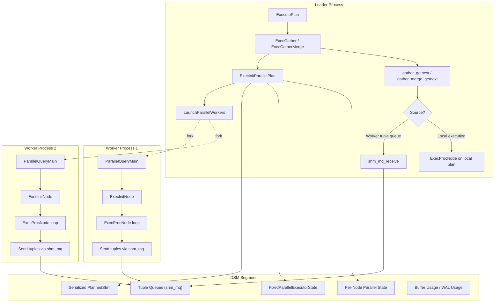
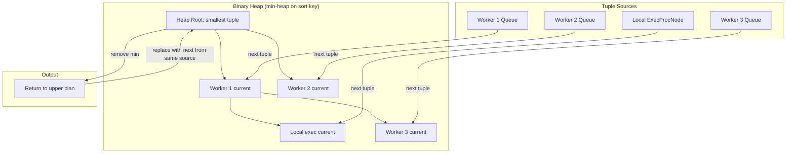
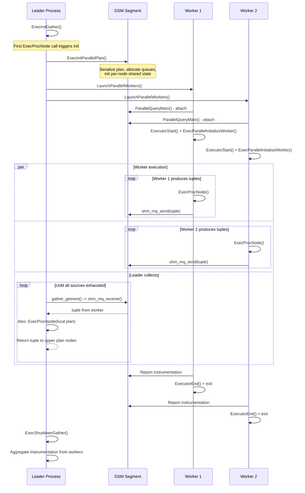

# Chapter 12: Parallel Query Execution

> **Prerequisites**: [Chapter 3 -- Executor Lifecycle](03_executor_lifecycle.md), [Chapter 5 -- Volcano Iterator Model](05_volcano_model.md), [Chapter 6 -- Memory Management](06_memory_management.md)
> **Next**: [Chapter 13 -- Planner Interface](13_planner_interface.md)
> **Node catalog details**: [Chapter 19 -- Control and Parallel Nodes](19_control_parallel_nodes.md)

---

## 12.1 Overview

PostgreSQL's parallel query execution enables a single query to leverage multiple
CPU cores by distributing work across parallel worker processes. The executor
implements parallel query through two collection nodes (`Gather` and
`GatherMerge`), a shared memory infrastructure (Dynamic Shared Memory segments),
and a worker-side entry point (`ParallelQueryMain`). The leader process
serializes the query plan into shared memory, launches worker processes, and
collects result tuples via shared memory tuple queues.

Parallel-aware plan nodes (e.g., Parallel Seq Scan, Parallel Hash Join, Parallel
Index Scan) coordinate work distribution among workers using shared state in DSM.
Parallel-oblivious nodes run identical copies in each worker without
coordination. The Gather and GatherMerge nodes sit above the parallel portion of
the plan tree and merge results from all workers plus the leader's own local
execution.

**Key symbols covered in this chapter**: `ExecGather`, `ExecGatherMerge`,
`ExecInitGather`, `ExecParallelInitializeDSM`, `ParallelQueryMain`.

---

## 12.2 Key Concepts

- **Dynamic Shared Memory (DSM)**: Shared memory segments allocated per-query
  for inter-process communication. Contains the serialized plan, tuple queues,
  and per-node parallel state.
- **Tuple Queues**: Shared memory ring buffers (`shm_mq`) used by workers to
  send result tuples to the leader.
- **Gather**: Collects tuples from parallel workers in arbitrary order.
- **GatherMerge**: Collects tuples while preserving sort order using a binary
  heap merge.
- **Parallel-Aware vs Parallel-Oblivious**: Parallel-aware nodes coordinate work
  splitting (e.g., different workers scan different pages). Parallel-oblivious
  nodes run the same plan independently in each worker.
- **ParallelQueryMain**: Entry point for worker processes; deserializes the plan
  from DSM and executes it.
- **Leader Participation**: The leader also executes the parallel portion locally
  to avoid wasting a CPU core.

---

## 12.3 Architecture



---

## 12.4 Data Structures

### FixedParallelExecutorState

```c
/* src/backend/executor/execParallel.c:73-79 */
typedef struct FixedParallelExecutorState
{
    dsa_pointer param_exec;     /* PARAM_EXEC values in DSA */
    int         eflags;         /* executor flags */
    int         jit_flags;      /* JIT compilation flags */
} FixedParallelExecutorState;
```

Stored at a fixed location within the DSM segment, providing minimal state for
workers to initialize their execution environment.

### SharedExecutorInstrumentation

```c
/* src/backend/executor/execParallel.c:97-108 */
typedef struct SharedExecutorInstrumentation
{
    int         instrument_options;
    int         instrument_offset;
    int         num_workers;
    int         num_plan_nodes;
    /* followed by num_workers * num_plan_nodes Instrumentation structs */
} SharedExecutorInstrumentation;
```

Collects per-node execution statistics from all workers, aggregated by the
leader for EXPLAIN ANALYZE.

### PARALLEL_KEY Constants

```c
#define PARALLEL_KEY_EXECUTOR_FIXED       UINT64CONST(0xE000000000000001)
#define PARALLEL_KEY_PLANNEDSTMT          UINT64CONST(0xE000000000000002)
#define PARALLEL_KEY_PARAMLISTINFO        UINT64CONST(0xE000000000000003)
#define PARALLEL_KEY_BUFFER_USAGE         UINT64CONST(0xE000000000000004)
#define PARALLEL_KEY_TUPLE_QUEUE          UINT64CONST(0xE000000000000005)
#define PARALLEL_KEY_INSTRUMENTATION      UINT64CONST(0xE000000000000006)
#define PARALLEL_KEY_DSA                  UINT64CONST(0xE000000000000007)
#define PARALLEL_KEY_QUERY_TEXT           UINT64CONST(0xE000000000000008)
#define PARALLEL_KEY_JIT_INSTRUMENTATION  UINT64CONST(0xE000000000000009)
#define PARALLEL_KEY_WAL_USAGE            UINT64CONST(0xE00000000000000A)
```

Used with `shm_toc` (Table of Contents) to locate specific data structures
within the DSM segment.

---

## 12.5 DSM Segment Layout

```
+-----------------------------------------------+
| Table of Contents (shm_toc)                    |
+-----------------------------------------------+
| PARALLEL_KEY_EXECUTOR_FIXED                    |
|   -> FixedParallelExecutorState                |
+-----------------------------------------------+
| PARALLEL_KEY_PLANNEDSTMT                       |
|   -> Serialized PlannedStmt (text)             |
+-----------------------------------------------+
| PARALLEL_KEY_PARAMLISTINFO                     |
|   -> Serialized ParamListInfo                  |
+-----------------------------------------------+
| PARALLEL_KEY_TUPLE_QUEUE                       |
|   -> Array of shm_mq (one per worker)          |
+-----------------------------------------------+
| PARALLEL_KEY_INSTRUMENTATION                   |
|   -> SharedExecutorInstrumentation             |
|   -> Instrumentation[nworkers * nnodes]        |
+-----------------------------------------------+
| PARALLEL_KEY_BUFFER_USAGE                      |
|   -> BufferUsage[nworkers]                     |
+-----------------------------------------------+
| PARALLEL_KEY_WAL_USAGE                         |
|   -> WalUsage[nworkers]                        |
+-----------------------------------------------+
| PARALLEL_KEY_DSA                               |
|   -> DSA (Dynamic Shared Area) handle          |
+-----------------------------------------------+
| Per-Node Parallel State                        |
|   (allocated by ExecParallelEstimate/          |
|    ExecParallelInitializeDSM per node)          |
+-----------------------------------------------+
```

---

## 12.6 ExecGather

### Signature

```c
/* src/backend/executor/nodeGather.c:137 */
static TupleTableSlot *
ExecGather(PlanState *pstate)
```

### Algorithm

1. **Lazy initialization** (first call):
   - `ExecInitParallelPlan()` sets up the DSM segment with serialized plan,
     tuple queues, and per-node state
   - `LaunchParallelWorkers()` forks worker processes
   - `ExecParallelSetupTupleQueues()` creates `TupleQueueReader` handles
   - If no workers could launch, falls through to local-only execution

2. **Tuple collection** via `gather_getnext()`:
   - Uses `nextreader` index to round-robin between tuple queue readers
   - Calls `gather_readnext()` for the current reader
   - Falls back to local execution via `ExecProcNode(node->ps.lefttree)`
   - Once all workers disconnect and local execution completes, returns NULL

3. **gather_readnext()** details:
   - Non-blocking read from `shm_mq` via `TupleQueueReaderNext()`
   - If worker detached (finished), removes from reader list
   - If no data ready, `WaitLatch()` to sleep until data arrives
   - Ensures the leader does not spin-wait

4. **Cleanup**: `ExecShutdownGather()` waits for workers and detaches from DSM.

---

## 12.7 ExecGatherMerge

### Signature

```c
/* src/backend/executor/nodeGatherMerge.c:182 */
static TupleTableSlot *
ExecGatherMerge(PlanState *pstate)
```

### Algorithm

Structurally similar to Gather but preserves sort order:

1. **Initialization**: Same as Gather -- DSM, workers, tuple queue readers.

2. **Binary heap setup**: Creates a `binaryheap` with one slot per source (each
   worker queue + local execution). Each slot is filled with the first tuple
   from its source. Heap ordered using `SortSupport` comparators matching the
   plan's sort keys.

3. **Tuple retrieval**:
   - Removes the minimum element from the heap (globally smallest tuple)
   - Fetches the next tuple from the same source
   - If replacement available, inserts into heap; otherwise heap shrinks
   - Returns the removed tuple

4. **GMReaderTupleBuffer**: Each worker has a small pre-read buffer that batches
   tuples from `shm_mq`, reducing per-tuple shared memory access overhead.



### Performance

- GatherMerge adds O(log(W)) overhead per tuple for heap operations
- Efficient for typical parallel worker counts (2-8)
- Pre-buffering in `GMReaderTupleBuffer` amortizes shared memory overhead

---

## 12.8 ExecInitParallelPlan

### Signature

```c
/* src/backend/executor/execParallel.c:586 */
ParallelExecutorInfo *
ExecInitParallelPlan(PlanState *planstate, EState *estate,
                     Bitmapset *sendParams, int nworkers, int64 tuples_needed)
```

### Steps

1. **Plan serialization** (via `ExecSerializePlan()`): Converts `PlannedStmt`
   to text string via `nodeToString()`. Stored in DSM for workers to
   deserialize.

2. **DSM size estimation** (via `ExecParallelEstimate()`): Recursively walks the
   plan tree, calling each parallel-aware node's estimate callback to determine
   shared state size.

3. **DSM allocation**: Creates a segment large enough for:
   - `FixedParallelExecutorState`
   - Serialized plan text
   - Parameter list
   - Tuple queues (one `shm_mq` per worker)
   - Per-node parallel state
   - Instrumentation arrays
   - Buffer/WAL usage arrays

4. **Per-node DSM initialization** (via `ExecParallelInitializeDSM()`):
   Recursively walks plan tree, calling each parallel-aware node's DSM init
   callback (e.g., Parallel Seq Scan sets up shared scan position).

5. **Tuple queue setup**: Creates one `shm_mq` per worker -- a circular buffer
   with single producer (worker) and single consumer (leader).

---

## 12.9 ParallelQueryMain

### Signature

```c
/* src/backend/executor/execParallel.c:1399 */
void
ParallelQueryMain(dsm_segment *seg, shm_toc *toc)
```

### Worker Lifecycle

Each worker process executes this function after launch:

1. **Plan deserialization**:
   - Locates serialized `PlannedStmt` via `shm_toc_lookup(toc, PARALLEL_KEY_PLANNEDSTMT)`
   - `stringToNode()` reconstructs the plan tree
   - Restores parameters from `PARALLEL_KEY_PARAMLISTINFO`

2. **Executor initialization**:
   - Creates `QueryDesc` from deserialized plan
   - `ExecutorStart()` builds execution state tree (see
     [Chapter 3](03_executor_lifecycle.md))
   - `ExecParallelInitializeWorker()` walks plan tree, calling each
     parallel-aware node's worker-side callback (e.g., Parallel Seq Scan
     attaches to shared scan position)

3. **Plan execution**:
   - `ExecutorRun()` drives `ExecProcNode()` on the plan tree
   - Tuples from the topmost node below Gather are sent through the tuple
     queue via `tqueueReceiveSlot()` (the worker's DestReceiver)

4. **Instrumentation reporting**:
   - Copies per-node `Instrumentation` into the shared array
   - Reports buffer usage and WAL usage statistics

5. **Cleanup**: `ExecutorFinish()` and `ExecutorEnd()`; DSM is automatically
   cleaned up on worker exit.

---

## 12.10 Processing Flow



---

## 12.11 Parallel-Aware Node Types

| Node Type | Parallel Behavior | Coordination Mechanism |
|-----------|------------------|----------------------|
| SeqScan | Workers scan different pages | Shared page counter in DSM |
| IndexScan | Workers scan different index ranges | Shared `ParallelIndexScanDesc` |
| IndexOnlyScan | Same as IndexScan | Shared `ParallelIndexScanDesc` |
| BitmapHeapScan | Workers fetch different pages from shared bitmap | Shared `TBMSharedIterator` |
| Hash Join | Workers share hash table build and probe | Barrier-based phases (PHJ_BUILD_*) |
| Hash (build) | Workers partition inner tuples | Shared hash table in DSM |
| Append | Workers take different child plans | Shared child index counter |
| MergeAppend | Workers take different child plans | Shared child index counter |

For details on how individual scan nodes coordinate with the parallel
infrastructure, see [Chapter 15 -- Scan Nodes](15_scan_nodes.md). For parallel
hash join barrier phases, see [Chapter 9 -- Join Infrastructure](09_join_infrastructure.md).

---

## 12.12 Implementation Notes

1. **Leader as worker**: The leader also executes the parallel plan subtree
   locally. This ensures progress even if launching workers fails or workers
   are slow to start. In `gather_getnext()`, the leader alternates between
   checking worker queues and executing locally.

2. **Tuple queue flow control**: The `shm_mq` provides natural flow control.
   If a worker produces faster than the leader consumes, the queue fills and
   the worker blocks on `shm_mq_send()`. Conversely, the leader blocks on
   `shm_mq_receive()` when workers are slow.

3. **Parallel safety**: Not all plan nodes are parallel-safe. The planner
   checks during planning and only places parallel-safe subtrees below Gather.
   Functions marked `PARALLEL UNSAFE` prevent parallelization. The
   `max_parallel_hazard` field tracks the worst safety level in each subtree.

4. **Worker count determination**: The planner selects worker count based on
   table size and `max_parallel_workers_per_gather`. At execution time,
   `LaunchParallelWorkers()` may launch fewer if `max_parallel_workers` is
   reached. The plan works correctly with fewer workers (or none).

5. **Instrumentation aggregation**: For EXPLAIN ANALYZE, each worker's
   `Instrumentation` data is stored at
   `[worker_id * num_plan_nodes + node_id]`. After workers complete, the
   leader aggregates these into the main plan's instrumentation.

6. **Parameter passing**: `PARAM_EXEC` parameters are serialized into DSA
   memory referenced from `FixedParallelExecutorState`. Workers access them
   through the same `ecxt_param_exec_vals` mechanism as serial execution.
   See [Chapter 13](13_planner_interface.md) for parameter mechanics.

7. **Partial vs. complete results**: A Gather above a Parallel Seq Scan
   produces partial results (each worker scans a page subset). Multiple
   partial results combine to form the complete result.

---

**See also**: [Chapter 19 -- Control and Parallel Nodes](19_control_parallel_nodes.md)
for Gather/GatherMerge node catalog entries, [Chapter 9](09_join_infrastructure.md)
for parallel hash join details, [Chapter 3](03_executor_lifecycle.md) for how
`ExecutorStart`/`ExecutorRun` are invoked in workers.
