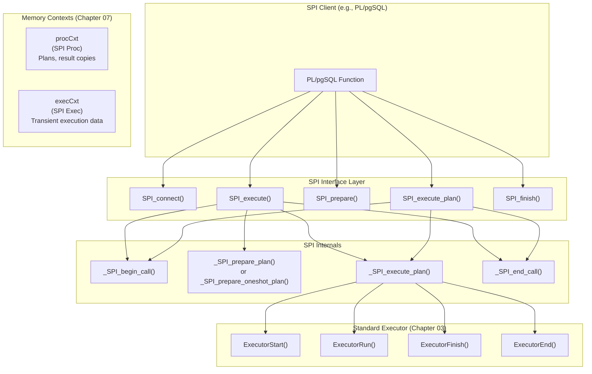

# Chapter 14: Server Programming Interface (SPI)

**PostgreSQL 17 Executor Documentation**

---

**Navigation**: [Chapter 13: Planner Interface](13_planner_interface.md) | **Chapter 14** | [Chapter 15: Node Catalog -- Scan Nodes](15_node_catalog_scan.md)

**Prerequisites**: [Chapter 03: Executor Lifecycle](03_executor_lifecycle.md) -- SPI internally invokes the full `ExecutorStart`/`ExecutorRun`/`ExecutorFinish`/`ExecutorEnd` sequence; [Chapter 07: Memory Context Management](07_memory_context_management.md) -- SPI relies heavily on memory context hierarchy for plan and result lifetime management.

---

## 14.1 Overview

The Server Programming Interface (SPI) provides a mechanism for server-side
code -- such as PL/pgSQL functions, triggers, and C language functions -- to
execute SQL queries from within the PostgreSQL backend. SPI manages a stack of
connections, each with its own memory contexts, allowing nested SQL execution
(e.g., a PL/pgSQL function that calls another function that executes SQL).

SPI sits on top of the regular executor infrastructure. Internally, it parses
SQL strings, runs the planner, and invokes the full executor lifecycle --
`ExecutorStart`/`ExecutorRun`/`ExecutorFinish`/`ExecutorEnd` (see
[Chapter 03](03_executor_lifecycle.md)) -- just as the main query processing
path does. The key addition is memory context management: SPI provides separate
"procedure" and "execution" contexts to manage the lifetimes of plans and
results, following the principles described in
[Chapter 07](07_memory_context_management.md).

**Source file**: `src/backend/executor/spi.c` (3,404 lines)

**Key symbols covered in this chapter**: `SPI_connect`, `SPI_connect_ext`,
`SPI_finish`, `SPI_execute`, `SPI_prepare`, `SPI_prepare_cursor`,
`SPI_execute_plan`, `SPI_keepplan`, `SPI_freetuple`, `SPI_freeplan`.

---

## 14.2 Key Concepts

- **Connection stack**: SPI maintains a stack of `_SPI_connection` entries.
  Each `SPI_connect` pushes a new entry; `SPI_finish` pops it. This supports
  nested function calls where each level has independent SPI state.

- **Two memory contexts per connection**: Each SPI connection has a "procedure
  context" (`procCxt`) for plan storage and result copies, and an "execution
  context" (`execCxt`) for transient data created during query execution. This
  two-level scheme mirrors the per-query and per-tuple context split described
  in [Chapter 07](07_memory_context_management.md).

- **Plan caching**: `SPI_prepare` creates a plan that can be executed multiple
  times via `SPI_execute_plan`, avoiding repeated parsing and planning.

- **Tuple table**: Results are stored in `SPI_tuptable`, which holds an array
  of `HeapTuple` copies allocated in the procedure context so they survive
  across multiple SPI execution calls.

---

## 14.3 Architecture



The diagram above shows the layered architecture. SPI client code (such as
PL/pgSQL) calls into the SPI interface layer. Each interface function delegates
to internal helpers that ultimately invoke the standard four-phase executor
lifecycle documented in [Chapter 03](03_executor_lifecycle.md). Memory contexts
(see [Chapter 07](07_memory_context_management.md)) separate long-lived plan
data from short-lived execution state.

---

## 14.4 Core API Reference

### 14.4.1 SPI_connect / SPI_connect_ext

#### Purpose

Establishes an SPI connection, pushing a new entry onto the SPI connection
stack. Must be called before any other SPI operation within a function.

#### Signature

```c
/* Source: src/backend/executor/spi.c:91-97 */
int SPI_connect(void)
{
    return SPI_connect_ext(0);
}

/* Source: src/backend/executor/spi.c:99-179 */
int SPI_connect_ext(int options);
```

#### Parameters

| Parameter | Type | Description |
|-----------|------|-------------|
| `options` | `int` | Bitmask: `SPI_OPT_NONATOMIC` for non-atomic execution (used by PL/pgSQL procedures that issue COMMIT/ROLLBACK) |

#### Return Value

`SPI_OK_CONNECT` on success.

#### Step-by-Step Logic

1. **Enlarge stack**: If the stack is full, reallocate with double the size.
   Initial allocation is 16 entries.

2. **Enter new level**: Increment `_SPI_connected` and point `_SPI_current`
   to the new stack entry.

3. **Initialize entry**:
   ```c
   _SPI_current->processed = 0;
   _SPI_current->tuptable = NULL;
   _SPI_current->execSubid = InvalidSubTransactionId;
   _SPI_current->connectSubid = GetCurrentSubTransactionId();
   _SPI_current->atomic = (options & SPI_OPT_NONATOMIC ? false : true);
   ```

4. **Save outer state**: Save the current `SPI_processed`, `SPI_tuptable`,
   and `SPI_result` so they can be restored in `SPI_finish`.

5. **Create memory contexts** (see [Chapter 07](07_memory_context_management.md)):
   ```c
   /* Procedure context for plans and result copies */
   _SPI_current->procCxt = AllocSetContextCreate(
       _SPI_current->atomic ? TopTransactionContext : PortalContext,
       "SPI Proc", ALLOCSET_DEFAULT_SIZES);

   /* Execution context for transient data */
   _SPI_current->execCxt = AllocSetContextCreate(
       _SPI_current->atomic ? TopTransactionContext : _SPI_current->procCxt,
       "SPI Exec", ALLOCSET_DEFAULT_SIZES);
   ```

6. **Switch context**: Switch to the procedure context.

7. **Reset globals**: Set `SPI_processed = 0`, `SPI_tuptable = NULL`,
   `SPI_result = 0`.

#### Memory Context Parent Selection

The parent context chosen for SPI's memory contexts depends on the execution
mode, and this choice has important implications for transaction boundary
behavior:

- **Atomic mode** (default): Both contexts are children of
  `TopTransactionContext`, so they are destroyed at transaction end. This is
  the standard mode for regular SQL functions.

- **Non-atomic mode** (`SPI_OPT_NONATOMIC`): The procedure context is a child
  of `PortalContext`, and the execution context is a child of the procedure
  context. This allows them to survive across transaction boundaries, which is
  required for PL/pgSQL procedures that perform COMMIT/ROLLBACK within their
  body.

---

### 14.4.2 SPI_finish

#### Purpose

Closes the current SPI connection, popping it from the stack and restoring the
caller's SPI state. Destroys both the procedure and execution memory contexts,
freeing all plans and results that were not explicitly kept.

#### Signature

```c
/* Source: src/backend/executor/spi.c:181-219 */
int SPI_finish(void);
```

#### Return Value

`SPI_OK_FINISH` on success.

---

### 14.4.3 SPI_execute

#### Purpose

Parses, plans, and executes a SQL string in a single call. The plan is created
as a "one-shot" plan and discarded after execution. This is the simplest way
to run a SQL statement from C code or PL functions, but offers no plan reuse.

#### Signature

```c
/* Source: src/backend/executor/spi.c:594-626 */
int SPI_execute(const char *src, bool read_only, long tcount);
```

#### Parameters

| Parameter | Type | Description | Constraints |
|-----------|------|-------------|-------------|
| `src` | `const char *` | SQL query string | Must not be NULL |
| `read_only` | `bool` | If true, reject write operations | -- |
| `tcount` | `long` | Max rows to return; 0 = unlimited | Must be >= 0 |

#### Return Value

SPI status code (e.g., `SPI_OK_SELECT`, `SPI_OK_INSERT`, `SPI_ERROR_ARGUMENT`).

#### Step-by-Step Logic

```c
int SPI_execute(const char *src, bool read_only, long tcount)
{
    _SPI_plan   plan;
    SPIExecuteOptions options;
    int         res;

    if (src == NULL || tcount < 0)
        return SPI_ERROR_ARGUMENT;

    res = _SPI_begin_call(true);
    if (res < 0)
        return res;

    /* Create a one-shot plan structure */
    memset(&plan, 0, sizeof(_SPI_plan));
    plan.magic = _SPI_PLAN_MAGIC;
    plan.parse_mode = RAW_PARSE_DEFAULT;
    plan.cursor_options = CURSOR_OPT_PARALLEL_OK;

    /* Parse and plan (one-shot, not cached) */
    _SPI_prepare_oneshot_plan(src, &plan);

    /* Execute the plan -- invokes full executor lifecycle (Chapter 03) */
    memset(&options, 0, sizeof(options));
    options.read_only = read_only;
    options.tcount = tcount;

    res = _SPI_execute_plan(&plan, &options,
                            InvalidSnapshot, InvalidSnapshot, true);

    _SPI_end_call(true);
    return res;
}
```

The internal `_SPI_execute_plan` function calls the standard executor lifecycle
(see [Chapter 03](03_executor_lifecycle.md)): `ExecutorStart` to initialize
the plan state tree, `ExecutorRun` to retrieve tuples, `ExecutorFinish` for
post-execution processing, and `ExecutorEnd` to release resources.

After execution, results are available in:
- `SPI_processed`: Number of rows processed
- `SPI_tuptable`: Result tuple table (for SELECT queries)

---

### 14.4.4 SPI_prepare / SPI_prepare_cursor

#### Purpose

Parses and plans a SQL string with parameter placeholders, returning a reusable
plan handle. The plan can be executed multiple times via `SPI_execute_plan`
without re-parsing or re-planning.

#### Signature

```c
/* Source: src/backend/executor/spi.c:859-863 */
SPIPlanPtr SPI_prepare(const char *src, int nargs, Oid *argtypes)
{
    return SPI_prepare_cursor(src, nargs, argtypes, 0);
}

/* Source: src/backend/executor/spi.c:865-899 */
SPIPlanPtr SPI_prepare_cursor(const char *src, int nargs, Oid *argtypes,
                               int cursorOptions);
```

#### Parameters

| Parameter | Type | Description |
|-----------|------|-------------|
| `src` | `const char *` | SQL query with `$1`, `$2`, ... parameter placeholders |
| `nargs` | `int` | Number of parameters |
| `argtypes` | `Oid *` | Array of parameter type OIDs |
| `cursorOptions` | `int` | Cursor options (e.g., `CURSOR_OPT_PARALLEL_OK`) |

#### Return Value

`SPIPlanPtr` -- a plan handle, or NULL on error (check `SPI_result`).

#### Step-by-Step Logic

```c
SPIPlanPtr SPI_prepare_cursor(const char *src, int nargs, Oid *argtypes,
                               int cursorOptions)
{
    _SPI_plan   plan;
    SPIPlanPtr  result;

    /* Validate arguments */
    if (src == NULL || nargs < 0 || (nargs > 0 && argtypes == NULL))
    {
        SPI_result = SPI_ERROR_ARGUMENT;
        return NULL;
    }

    SPI_result = _SPI_begin_call(true);
    if (SPI_result < 0) return NULL;

    /* Set up temporary plan structure */
    memset(&plan, 0, sizeof(_SPI_plan));
    plan.magic = _SPI_PLAN_MAGIC;
    plan.parse_mode = RAW_PARSE_DEFAULT;
    plan.cursor_options = cursorOptions;
    plan.nargs = nargs;
    plan.argtypes = argtypes;

    /* Parse and plan */
    _SPI_prepare_plan(src, &plan);

    /* Copy plan to procedure context (survives _SPI_end_call) */
    result = _SPI_make_plan_non_temp(&plan);

    _SPI_end_call(true);
    return result;
}
```

The plan is copied to the procedure context so it survives across subsequent
SPI calls within the same connection. However, the plan is destroyed when
`SPI_finish` is called. To make a plan survive beyond `SPI_finish`, use
`SPI_keepplan()` (see [Section 14.5.3](#1453-spi_keepplan)).

---

### 14.4.5 SPI_execute_plan

#### Purpose

Executes a previously prepared plan with parameter values. This is the
high-performance path for repeated execution of the same query with different
parameters.

#### Signature

```c
/* Source: src/backend/executor/spi.c:670-700 */
int SPI_execute_plan(SPIPlanPtr plan, Datum *Values, const char *Nulls,
                     bool read_only, long tcount);
```

#### Parameters

| Parameter | Type | Description |
|-----------|------|-------------|
| `plan` | `SPIPlanPtr` | Plan handle from `SPI_prepare` |
| `Values` | `Datum *` | Array of parameter values (one per `$N` placeholder) |
| `Nulls` | `const char *` | Null indicators: `'n'` = null, `' '` = not null; or NULL to indicate all non-null |
| `read_only` | `bool` | If true, reject write operations |
| `tcount` | `long` | Max rows; 0 = unlimited |

#### Return Value

SPI status code.

#### Step-by-Step Logic

1. Validate plan magic number and argument counts.
2. Call `_SPI_begin_call(true)` to switch to the execution context.
3. Convert `Datum`/`Nulls` arrays into a `ParamListInfo` via
   `_SPI_convert_params()`.
4. Call `_SPI_execute_plan()` which invokes the full executor lifecycle
   ([Chapter 03](03_executor_lifecycle.md)).
5. Call `_SPI_end_call(true)` to restore contexts and clean up execution state.

---

## 14.5 Memory Management

### 14.5.1 Context Hierarchy

SPI creates two memory contexts per connection that fit into the PostgreSQL
memory context tree described in [Chapter 07](07_memory_context_management.md):

```
TopTransactionContext (or PortalContext for non-atomic)
  |
  +-- "SPI Proc" (procCxt)
  |     |-- Prepared plans (if not kept)
  |     |-- Result tuple copies (SPI_tuptable)
  |     +-- SPI connection state
  |
  +-- "SPI Exec" (execCxt)
        |-- Executor state (EState, PlanState tree)
        |-- Expression evaluation temporaries
        +-- Cleared between SPI_execute calls
```

### 14.5.2 Key Rules

1. **execCxt is reset between executions**: `_SPI_end_call(true)` resets
   the execution context, freeing all executor state. This ensures memory
   does not accumulate across repeated SPI calls within the same connection.

2. **Results are copied to procCxt**: After execution, result tuples are
   copied from executor memory to the procedure context before `execCxt`
   is reset. This is why `SPI_tuptable` survives between calls.

3. **procCxt is destroyed by SPI_finish**: All plans and results are freed
   when the SPI connection is closed. Use `SPI_keepplan()` to move a plan
   to a permanent context.

4. **SPI_palloc vs palloc**: `SPI_palloc()` allocates in the procedure
   context, ensuring the allocation survives execution context resets. Code
   that needs data to persist across SPI calls should use `SPI_palloc`.

### 14.5.3 SPI_keepplan

```c
/* Source: src/backend/executor/spi.c */
int SPI_keepplan(SPIPlanPtr plan);
```

Moves a prepared plan to `CacheMemoryContext`, making it survive `SPI_finish`.
This is the mechanism PL/pgSQL uses to cache plans across function invocations:
the first call to a PL/pgSQL statement prepares a plan and then keeps it, so
subsequent calls can execute the cached plan without re-planning.

### 14.5.4 SPI_freetuple / SPI_freeplan

Explicit deallocation functions for tuples and plans:

```c
void SPI_freetuple(HeapTuple tuple);    /* pfree a tuple */
int  SPI_freeplan(SPIPlanPtr plan);     /* free a prepared plan */
```

These allow callers to release individual results or plans before the connection
is closed, which can reduce memory consumption in long-running functions that
process many queries.

---

## 14.6 Result Access

### SPI_tuptable

After a successful execution, results are available in `SPI_tuptable`:

```c
typedef struct SPITupleTable
{
    MemoryContext tuptabcxt;     /* memory context for this table */
    uint64      alloced;        /* number of alloced vals */
    uint64      free;           /* number of free vals */
    TupleDesc   tupdesc;        /* result tuple descriptor */
    HeapTuple  *vals;           /* array of result HeapTuples */
    slist_node  next;           /* link for internal bookkeeping */
    SubTransactionId subid;     /* sub-xact in which table was created */
} SPITupleTable;
```

Access patterns:

```c
SPI_execute("SELECT id, name FROM t", true, 0);

for (uint64 i = 0; i < SPI_processed; i++)
{
    HeapTuple tuple = SPI_tuptable->vals[i];
    TupleDesc desc = SPI_tuptable->tupdesc;

    /* Extract values */
    Datum id = SPI_getbinval(tuple, desc, 1, &isnull);
    char *name = SPI_getvalue(tuple, desc, 2);
}
```

### SPI_processed

The number of rows processed by the last SPI execution:
- For SELECT: number of rows returned
- For INSERT/UPDATE/DELETE: number of rows affected
- For utility statements: 0

---

## 14.7 Usage Pattern: PL/pgSQL

PL/pgSQL is the primary consumer of SPI. Understanding the PL/pgSQL-SPI
interaction shows how SPI connects to the executor lifecycle
([Chapter 03](03_executor_lifecycle.md)):

1. Calls `SPI_connect()` at function entry.
2. For each SQL statement:
   - First execution: `SPI_prepare()` to create a plan.
   - `SPI_keepplan()` to cache the plan permanently in `CacheMemoryContext`.
   - Subsequent executions: `SPI_execute_plan()` with the cached plan.
3. Accesses results via `SPI_tuptable` and `SPI_processed`.
4. Calls `SPI_finish()` at function exit.

### Nested Calls

When a PL/pgSQL function calls another function that also uses SPI, the
connection stack handles nesting automatically:

```
Function A: SPI_connect()        [stack depth 0]
  |
  +-- Function B: SPI_connect()  [stack depth 1]
  |     |
  |     +-- SPI_execute(...)
  |     +-- SPI_finish()         [restore depth 0]
  |
  +-- SPI_execute(...)
  +-- SPI_finish()               [stack empty]
```

Each level saves and restores `SPI_processed` and `SPI_tuptable`, so the
outer function's state is not corrupted by the inner function's SPI calls.
Each level also gets its own pair of memory contexts, following the
hierarchical memory management model from
[Chapter 07](07_memory_context_management.md).

---

## 14.8 Error Handling

SPI functions return integer status codes. Negative values indicate errors:

| Code | Value | Meaning |
|------|-------|---------|
| `SPI_OK_CONNECT` | 1 | Connection established |
| `SPI_OK_FINISH` | 2 | Connection closed |
| `SPI_OK_SELECT` | 5 | SELECT completed |
| `SPI_OK_INSERT` | 10 | INSERT completed |
| `SPI_OK_DELETE` | 11 | DELETE completed |
| `SPI_OK_UPDATE` | 13 | UPDATE completed |
| `SPI_ERROR_CONNECT` | -1 | Connection failed |
| `SPI_ERROR_ARGUMENT` | -3 | Invalid argument |
| `SPI_ERROR_UNCONNECTED` | -4 | Not connected |
| `SPI_ERROR_NOATTRIBUTE` | -6 | Invalid attribute |

If an error occurs during SQL execution (e.g., syntax error, constraint
violation), SPI does not return an error code. Instead, the normal PostgreSQL
error handling mechanism (`ereport`/`elog`) is used, which may `longjmp` out of
the SPI call. The SPI connection cleanup is handled by
`AtEOSubXact_SPI()`/`AtEOXact_SPI()` during transaction abort processing.

---

## 14.9 Implementation Notes

- `_SPI_begin_call(true)` switches to the execution context and validates
  the connection state. The boolean parameter indicates whether to push
  a new subtransaction for error handling.

- `_SPI_end_call(true)` restores the saved context and resets the execution
  context. The boolean indicates whether to clean up the execution context.

- SPI plans are not truly "prepared statements" in the SQL sense. They are
  internal cached plans that bypass the protocol-level prepared statement
  machinery. The executor processing they trigger is identical to the
  standard lifecycle described in [Chapter 03](03_executor_lifecycle.md).

- The `SPI_OPT_NONATOMIC` option is used by PL/pgSQL procedures (as opposed
  to functions) that need to perform COMMIT/ROLLBACK within their body.
  In this mode, the SPI contexts are parented under `PortalContext` rather
  than `TopTransactionContext`, so they survive transaction boundaries.

---

## 14.10 Summary

| Function | Purpose | Plan Reuse | Memory Context |
|----------|---------|------------|----------------|
| `SPI_connect` | Open SPI connection | -- | Creates procCxt and execCxt |
| `SPI_execute` | One-shot parse/plan/execute | No | Uses execCxt, results to procCxt |
| `SPI_prepare` | Parse and plan with params | Plan returned | Plan stored in procCxt |
| `SPI_keepplan` | Move plan to CacheMemoryContext | Permanent | CacheMemoryContext |
| `SPI_execute_plan` | Execute prepared plan | Yes | Uses execCxt, results to procCxt |
| `SPI_finish` | Close SPI connection | -- | Destroys procCxt and execCxt |

**See also**:
- [Chapter 03: Executor Lifecycle](03_executor_lifecycle.md) -- the four-phase executor protocol that SPI invokes internally
- [Chapter 07: Memory Context Management](07_memory_context_management.md) -- the memory context hierarchy that SPI's context management builds upon
- [Chapter 15: Node Catalog -- Scan Nodes](15_node_catalog_scan.md) -- the next chapter in the documentation

---

*Source: `src/backend/executor/spi.c` | PostgreSQL 17.6*
