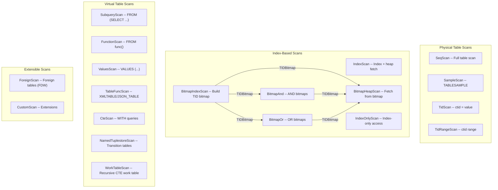

# Chapter 15: Node Catalog -- Scan Nodes

**PostgreSQL 17 Executor Documentation**

---

**Navigation**: [Chapter 14: Parallel Query Infrastructure](14_parallel_infrastructure.md) | **Chapter 15** | [Chapter 16: Node Catalog -- Join Nodes](16_node_catalog_join.md)

**Prerequisites**: [Chapter 08: ExecScan and Qual Evaluation](08_execscan_qual.md) -- covers the ExecScan framework shared by all scan nodes; [Chapter 09: Expression Evaluation and JIT](09_expression_eval_jit.md) -- covers ExecQual and ExecProject used in every scan path; [Chapter 10: Tuple Table Slots](10_tupleslots.md) -- slot types used by different scan nodes.

---

## Overview

This chapter catalogs all 19 scan-related node types in the PostgreSQL 17 executor. Scan nodes are leaf nodes in the plan tree -- they produce tuples by reading from a data source (table, index, subquery, function, etc.) rather than consuming tuples from child plan nodes.

All scan nodes except BitmapIndexScan and CustomScan delegate to the common `ExecScan()` framework defined in `src/backend/executor/execScan.c` (see Chapter 08). That framework calls a node-specific `AccessMtd` callback to fetch the next raw tuple, then applies qualification filters and projection.

```
ExecScan loop:
  1. Call AccessMtd (e.g., SeqNext) to get next raw tuple
  2. If qual exists, evaluate qual on the tuple
  3. If tuple passes, project and return
  4. Otherwise, loop back to step 1
```

The two bitmap-combining nodes (BitmapAnd, BitmapOr) are included in this chapter because they are integral parts of the bitmap scan pipeline.

---

## Table of Contents

1. [SeqScan](#seqscan)
2. [SampleScan](#samplescan)
3. [IndexScan](#indexscan)
4. [IndexOnlyScan](#indexonlyscan)
5. [BitmapIndexScan](#bitmapindexscan)
6. [BitmapHeapScan](#bitmapheapscan)
7. [BitmapAnd](#bitmapand)
8. [BitmapOr](#bitmapor)
9. [TidScan](#tidscan)
10. [TidRangeScan](#tidrangescan)
11. [SubqueryScan](#subqueryscan)
12. [FunctionScan](#functionscan)
13. [ValuesScan](#valuesscan)
14. [TableFuncScan](#tablefuncscan)
15. [CteScan](#ctescan)
16. [NamedTuplestoreScan](#namedtuplestorescan)
17. [WorkTableScan](#worktablescan)
18. [ForeignScan](#foreignscan)
19. [CustomScan](#customscan)

---

## Scan Node Architecture



---

## SeqScan

**Identity**
- NodeTag: `T_SeqScan` / `T_SeqScanState`
- Plan struct: `SeqScan` (`src/include/nodes/plannodes.h`)
- PlanState struct: `SeqScanState` (`src/include/nodes/execnodes.h`)
- Source: `src/backend/executor/nodeSeqscan.c`

**Purpose**: Sequential scan of a heap relation. The most fundamental scan type and the fallback when no index is applicable.

**Initialization** (`ExecInitSeqScan`):
- Allocates `SeqScanState`, opens the scan relation via `ExecOpenScanRelation()`
- Creates a scan tuple slot matching the relation's row type
- Does NOT start the actual heap scan yet (lazy initialization in `SeqNext`)

**Execution** (`ExecSeqScan`):
Delegates to `ExecScan()` with `SeqNext` as the access method and `SeqRecheck` as the recheck method. `SeqNext` calls `table_scan_getnextslot()` to fetch the next tuple. The recheck function always returns true since sequential scans use no scan keys.

**End** (`ExecEndSeqScan`): Calls `table_endscan()` to close the heap scan descriptor.

**Rescan** (`ExecReScanSeqScan`): Calls `table_rescan()` to restart from the beginning.

**Key State Fields**:

| Field | Type | Description |
|-------|------|-------------|
| `ss.ss_currentRelation` | `Relation` | The open heap relation |
| `ss.ss_currentScanDesc` | `TableScanDesc` | Heap scan descriptor (lazily initialized) |
| `ss.ss_ScanTupleSlot` | `TupleTableSlot` | Slot for the current scan tuple |

**Performance**: O(N) where N is the number of heap pages. Sequential read pattern benefits from OS read-ahead. Uses synchronized scans when multiple backends scan the same relation.

**Parallel Support**: Fully parallel-aware. Workers coordinate via `ParallelTableScanDesc` in shared memory.

---

## SampleScan

**Identity**
- NodeTag: `T_SampleScan` / `T_SampleScanState`
- Plan struct: `SampleScan` (`src/include/nodes/plannodes.h`)
- PlanState struct: `SampleScanState` (`src/include/nodes/execnodes.h`)
- Source: `src/backend/executor/nodeSamplescan.c`

**Purpose**: Scans a table using the `TABLESAMPLE` clause. Supports pluggable sampling methods via the `TsmRoutine` interface. Built-in methods: `BERNOULLI` (per-tuple) and `SYSTEM` (per-block). An optional `REPEATABLE` clause provides deterministic sampling.

**Initialization** (`ExecInitSampleScan`):
- Opens the scan relation, initializes TABLESAMPLE parameter expressions
- Loads the `TsmRoutine` from the sampling method handler
- Defers `BeginSampleScan` to first execution (parameters not yet evaluatable)

**Execution** (`ExecSampleScan`):
On first call, evaluates TABLESAMPLE parameters, computes the seed, and calls `tsm->BeginSampleScan()`. Then loops: requests next block from `table_scan_sample_next_block()`, requests tuples from `table_scan_sample_next_tuple()`, returning each visible tuple.

**End** (`ExecEndSampleScan`): Calls `tsm->EndSampleScan()` and closes the heap scan.

**Rescan** (`ExecReScanSampleScan`): Resets state; next execution re-evaluates parameters.

**Key State Fields**:

| Field | Type | Description |
|-------|------|-------------|
| `tsmroutine` | `TsmRoutine *` | Sampling method callbacks |
| `tsm_state` | `void *` | Sampling method private state |
| `seed` | `uint32` | Random seed for sampling |
| `begun` | `bool` | BeginSampleScan has been called |
| `done` | `bool` | Sampling is complete |

**Performance**: SYSTEM method: O(P * s) where P = total pages, s = sampling fraction. BERNOULLI method: O(N) -- must visit every tuple.

**Parallel Support**: Not parallel-aware.

---

## IndexScan

**Identity**
- NodeTag: `T_IndexScan` / `T_IndexScanState`
- Plan struct: `IndexScan` (`src/include/nodes/plannodes.h`)
- PlanState struct: `IndexScanState` (`src/include/nodes/execnodes.h`)
- Source: `src/backend/executor/nodeIndexscan.c`

**Purpose**: Scans a relation using an index to locate matching tuples, then fetches the actual heap tuples. Also supports ORDER BY expressions with ordering operators (e.g., KNN-GiST distance ordering).

**Initialization** (`ExecInitIndexScan`):
- Opens the base relation and the index relation
- Builds scan keys from index qualifications via `ExecIndexBuildScanKeys()`
- Separates keys into: compile-time constants, runtime keys, and array keys
- If ordering operators present, sets up a pairing heap for reordering

**Execution** (`ExecIndexScan`):
Two access method variants: `IndexNext` (standard path) calls `index_getnext_slot()`, rechecking lossy index quals via `xs_recheck`. `IndexNextWithReorder` (ORDER BY operator path) maintains a pairing heap of fetched tuples ordered by ORDER BY expressions.

**End** (`ExecEndIndexScan`): Closes the index scan and index relation.

**Rescan** (`ExecReScanIndexScan`): Re-evaluates runtime scan keys, advances array keys if applicable, calls `index_rescan()`.

**Key State Fields**:

| Field | Type | Description |
|-------|------|-------------|
| `iss_ScanDesc` | `IndexScanDesc` | Index scan descriptor |
| `iss_RelationDesc` | `Relation` | The open index relation |
| `iss_NumRuntimeKeys` | `int` | Count of keys needing runtime evaluation |
| `iss_RuntimeKeysReady` | `bool` | True after runtime keys are computed |
| `iss_ReorderQueue` | `pairingheap *` | Heap for ORDER BY reordering |

**Performance**: O(log N + K) for B-tree index where N = index size, K = matching tuples. Random I/O for heap fetches.

**Parallel Support**: Fully parallel-aware via `ParallelIndexScanDesc`.

---

## IndexOnlyScan

**Identity**
- NodeTag: `T_IndexOnlyScan` / `T_IndexOnlyScanState`
- Plan struct: `IndexOnlyScan` (`src/include/nodes/plannodes.h`)
- PlanState struct: `IndexOnlyScanState` (`src/include/nodes/execnodes.h`)
- Source: `src/backend/executor/nodeIndexonlyscan.c`

**Purpose**: Scans an index and returns data directly from the index tuples without fetching the heap tuple, when all required columns are available in the index. A visibility map check determines whether the heap page visit can be skipped.

**Initialization** (`ExecInitIndexOnlyScan`):
- Opens both base relation and index relation
- Builds scan tuple descriptor from `indextlist` (not the physical index descriptor)
- Allocates a separate `ioss_TableSlot` for visibility rechecks

**Execution** (`ExecIndexOnlyScan`):
`IndexOnlyNext` calls `index_getnext_tid()`, then checks `VM_ALL_VISIBLE()` for the heap page. If all-visible, skips heap fetch entirely (the fast path). If not all-visible, calls `index_fetch_heap()` to verify tuple visibility. Fills scan tuple slot from index data.

**End** (`ExecEndIndexOnlyScan`): Releases the visibility map buffer pin, closes the index scan and index relation.

**Rescan** (`ExecReScanIndexOnlyScan`): Re-evaluates runtime keys, calls `index_rescan()`.

**Key State Fields**:

| Field | Type | Description |
|-------|------|-------------|
| `ioss_ScanDesc` | `IndexScanDesc` | Index scan descriptor |
| `ioss_VMBuffer` | `Buffer` | Pinned visibility map page |
| `ioss_TableSlot` | `TupleTableSlot` | Slot for heap tuple (recheck only) |

**Performance**: O(log N + K) where K = matching tuples. Can be dramatically lower I/O than IndexScan since heap pages are skipped for recently-VACUUMed tables.

**Parallel Support**: Fully parallel-aware via `ParallelIndexScanDesc`.

---

## BitmapIndexScan

**Identity**
- NodeTag: `T_BitmapIndexScan` / `T_BitmapIndexScanState`
- Plan struct: `BitmapIndexScan` (`src/include/nodes/plannodes.h`)
- PlanState struct: `BitmapIndexScanState` (`src/include/nodes/execnodes.h`)
- Source: `src/backend/executor/nodeBitmapIndexscan.c`

**Purpose**: Scans an index and builds a TID bitmap of matching tuple locations. Does NOT return tuples -- returns a `TIDBitmap` via the `MultiExecProcNode` protocol to its parent (BitmapHeapScan, BitmapAnd, or BitmapOr). Calling `ExecProcNode` on this node will ERROR.

**Initialization** (`ExecInitBitmapIndexScan`):
- Does NOT open the base relation (ancestor BitmapHeapScan holds the lock)
- Opens the index relation, builds scan keys including array keys
- Starts the bitmap index scan via `index_beginscan_bitmap()`

**Execution** (`MultiExecBitmapIndexScan`):
Creates a `TIDBitmap`, loops calling `index_getbitmap()` to fill it with matching TIDs. For array keys, advances to next array element and rescans. Returns `(Node *) tbm`.

**End** (`ExecEndBitmapIndexScan`): Closes index scan and index relation.

**Rescan** (`ExecReScanBitmapIndexScan`): Re-evaluates runtime keys and array keys, calls `index_rescan()`.

**Key State Fields**:

| Field | Type | Description |
|-------|------|-------------|
| `biss_result` | `TIDBitmap *` | Pre-allocated result bitmap (from parent) |
| `biss_ScanDesc` | `IndexScanDesc` | Index scan descriptor |
| `biss_ArrayKeys` | `IndexArrayKeyInfo *` | Array key info for IN-list scans |

**Performance**: O(log N + K) to build the bitmap. Bitmap memory bounded by `work_mem`; becomes lossy (page-level) when exceeded.

**Parallel Support**: Supports shared bitmaps via DSA when `isshared` is true.

---

## BitmapHeapScan

**Identity**
- NodeTag: `T_BitmapHeapScan` / `T_BitmapHeapScanState`
- Plan struct: `BitmapHeapScan` (`src/include/nodes/plannodes.h`)
- PlanState struct: `BitmapHeapScanState` (`src/include/nodes/execnodes.h`)
- Source: `src/backend/executor/nodeBitmapHeapscan.c`

**Purpose**: Fetches heap tuples indicated by a TID bitmap built by its child node. The bitmap organizes TIDs by page, enabling sequential I/O on heap pages instead of random I/O. Requires an MVCC snapshot.

**Initialization** (`ExecInitBitmapHeapScan`):
- Asserts `IsMVCCSnapshot(estate->es_snapshot)`
- Opens the scan relation, initializes the child plan
- Computes `prefetch_maximum` from tablespace I/O concurrency settings

**Execution** (`ExecBitmapHeapScan`):
On first call, executes the child plan via `MultiExecProcNode()` to build the TID bitmap. Then iterates over bitmap pages: calls `table_scan_bitmap_next_block()` to position on each heap page, issues prefetch requests for upcoming pages, calls `table_scan_bitmap_next_tuple()` for each tuple. For lossy pages (`tbmres->recheck`), re-evaluates original quals.

**End** (`ExecEndBitmapHeapScan`): Frees bitmap iterators and the TID bitmap, closes the heap scan.

**Rescan** (`ExecReScanBitmapHeapScan`): Releases all bitmap state, forces bitmap rebuild.

**Key State Fields**:

| Field | Type | Description |
|-------|------|-------------|
| `tbm` | `TIDBitmap *` | The TID bitmap from child node |
| `tbmiterator` | `TBMIterator *` | Current bitmap iterator |
| `exact_pages` | `long` | Count of exact (tuple-level) pages |
| `lossy_pages` | `long` | Count of lossy (page-level) pages |
| `prefetch_maximum` | `int` | Max prefetch from IO concurrency setting |
| `bitmapqualorig` | `ExprState *` | Original quals for lossy recheck |

**Performance**: O(P + T) where P = distinct pages in bitmap, T = tuples on those pages. Sequential I/O on heap pages with prefetching.

**Parallel Support**: Fully parallel-aware. Leader builds the bitmap, workers share it via `ParallelBitmapHeapState`.

---

## BitmapAnd

**Identity**
- NodeTag: `T_BitmapAnd` / `T_BitmapAndState`
- Plan struct: `BitmapAnd` (`src/include/nodes/plannodes.h`)
- PlanState struct: `BitmapAndState` (`src/include/nodes/execnodes.h`)
- Source: `src/backend/executor/nodeBitmapAnd.c`

**Purpose**: Combines multiple TID bitmaps using AND (intersection). Appears as an intermediate node between multiple BitmapIndexScan children and a BitmapHeapScan parent. Produced when the planner combines conditions from different indexes with AND logic.

**Initialization** (`ExecInitBitmapAnd`):
- Allocates `BitmapAndState` and initializes all child bitmap plans
- Uses the `MultiExecProcNode` protocol (calling `ExecProcNode` will ERROR)

**Execution** (`MultiExecBitmapAnd`):
Executes each child plan via `MultiExecProcNode()` to get individual TID bitmaps, then intersects them via `tbm_intersect()`. Returns the resulting `TIDBitmap`.

**End** (`ExecEndBitmapAnd`): Ends all child plan nodes.

**Rescan** (`ExecReScanBitmapAnd`): Rescans all child plans.

**Key State Fields**:

| Field | Type | Description |
|-------|------|-------------|
| `bitmapplans` | `PlanState **` | Array of child bitmap plan states |
| `nplans` | `int` | Number of child plans |

**Performance**: O(sum of child bitmap sizes) for the intersection operation.

**Parallel Support**: Not directly parallel-aware; children may use shared bitmaps.

---

## BitmapOr

**Identity**
- NodeTag: `T_BitmapOr` / `T_BitmapOrState`
- Plan struct: `BitmapOr` (`src/include/nodes/plannodes.h`)
- PlanState struct: `BitmapOrState` (`src/include/nodes/execnodes.h`)
- Source: `src/backend/executor/nodeBitmapOr.c`

**Purpose**: Combines multiple TID bitmaps using OR (union). Appears as an intermediate node between multiple BitmapIndexScan children and a BitmapHeapScan parent. Produced when the planner combines conditions from different indexes with OR logic.

**Initialization** (`ExecInitBitmapOr`):
- Allocates `BitmapOrState` and initializes all child bitmap plans

**Execution** (`MultiExecBitmapOr`):
Executes each child plan via `MultiExecProcNode()` to get individual TID bitmaps, then unions them via `tbm_union()`. Returns the resulting `TIDBitmap`.

**End** (`ExecEndBitmapOr`): Ends all child plan nodes.

**Rescan** (`ExecReScanBitmapOr`): Rescans all child plans.

**Key State Fields**:

| Field | Type | Description |
|-------|------|-------------|
| `bitmapplans` | `PlanState **` | Array of child bitmap plan states |
| `nplans` | `int` | Number of child plans |

**Performance**: O(sum of child bitmap sizes) for the union operation.

**Parallel Support**: Not directly parallel-aware; children may use shared bitmaps.

---

## TidScan

**Identity**
- NodeTag: `T_TidScan` / `T_TidScanState`
- Plan struct: `TidScan` (`src/include/nodes/plannodes.h`)
- PlanState struct: `TidScanState` (`src/include/nodes/execnodes.h`)
- Source: `src/backend/executor/nodeTidscan.c`

**Purpose**: Fetches tuples directly by their tuple identifier (ctid). Produced when the WHERE clause contains conditions like `ctid = '(0,1)'` or `WHERE CURRENT OF cursor_name`. Handles three expression forms: `ctid = expr`, `ctid = ANY(array)`, and `CURRENT OF`.

**Initialization** (`ExecInitTidScan`):
- Opens scan relation, marks TID list as not yet computed
- Calls `TidExprListCreate()` to compile TID-yielding expressions from `tidquals`

**Execution** (`ExecTidScan`):
On first call, evaluates TID expressions via `TidListEval()`, sorts and deduplicates the TID list. Walks through the sorted TID list, fetching each tuple with `table_tuple_fetch_row_version()`. For `CURRENT OF`, calls `table_tuple_get_latest_tid()`.

**End** (`ExecEndTidScan`): Closes the table scan descriptor.

**Rescan** (`ExecReScanTidScan`): Frees the TID list, forces re-evaluation.

**Key State Fields**:

| Field | Type | Description |
|-------|------|-------------|
| `tss_tidexprs` | `List *` | List of TidExpr nodes |
| `tss_isCurrentOf` | `bool` | True if using CURRENT OF |
| `tss_TidList` | `ItemPointerData *` | Sorted array of TIDs to visit |
| `tss_NumTids` | `int` | Number of TIDs in array |
| `tss_TidPtr` | `int` | Current position in TID array |

**Performance**: O(K) where K = number of TIDs. Each TID fetch is a direct page access.

**Parallel Support**: Not parallel-aware.

---

## TidRangeScan

**Identity**
- NodeTag: `T_TidRangeScan` / `T_TidRangeScanState`
- Plan struct: `TidRangeScan` (`src/include/nodes/plannodes.h`)
- PlanState struct: `TidRangeScanState` (`src/include/nodes/execnodes.h`)
- Source: `src/backend/executor/nodeTidrangescan.c`

**Purpose**: Scans a contiguous range of tuple identifiers. Produced when the WHERE clause contains range conditions on ctid such as `ctid >= '(0,0)' AND ctid < '(100,0)'`. A PostgreSQL 14+ feature.

**Initialization** (`ExecInitTidRangeScan`):
- Opens the scan relation, calls `TidExprListCreate()` to compile upper/lower bound expressions
- Each bound is classified as `TIDEXPR_UPPER_BOUND` or `TIDEXPR_LOWER_BOUND` with an `inclusive` flag

**Execution** (`ExecTidRangeScan`):
On first call, evaluates TID range via `TidRangeEval()`, begins a tid-range scan with `table_beginscan_tidrange()`. Subsequent calls fetch with `table_scan_getnextslot_tidrange()`.

**End** (`ExecEndTidRangeScan`): Calls `table_endscan()` if scan descriptor exists.

**Rescan** (`ExecReScanTidRangeScan`): Defers actual rescan to next execution call.

**Key State Fields**:

| Field | Type | Description |
|-------|------|-------------|
| `trss_tidexprs` | `List *` | List of TidOpExpr bounds |
| `trss_mintid` | `ItemPointerData` | Computed lower bound (inclusive) |
| `trss_maxtid` | `ItemPointerData` | Computed upper bound (inclusive) |
| `trss_inScan` | `bool` | Whether a scan is currently in progress |

**Performance**: O(P) where P = number of pages in the TID range. Sequential within the range.

**Parallel Support**: Not parallel-aware.

---

## SubqueryScan

**Identity**
- NodeTag: `T_SubqueryScan` / `T_SubqueryScanState`
- Plan struct: `SubqueryScan` (`src/include/nodes/plannodes.h`)
- PlanState struct: `SubqueryScanState` (`src/include/nodes/execnodes.h`)
- Source: `src/backend/executor/nodeSubqueryscan.c`

**Purpose**: Wraps a complete subplan and presents its output as a scan source. Produced when a subquery appears in the FROM clause. Often optimized away by the planner, but retained when a filter must be applied to the subquery's output.

**Initialization** (`ExecInitSubqueryScan`):
- Initializes the child subplan via `ExecInitNode(node->subplan, ...)`
- Sets scan tuple type from subplan's result type; no base relation is opened

**Execution** (`ExecSubqueryScan`):
`SubqueryNext` simply calls `ExecProcNode()` on the child subplan and returns its result slot directly.

**End** (`ExecEndSubqueryScan`): Calls `ExecEndNode(node->subplan)`.

**Rescan** (`ExecReScanSubqueryScan`): Propagates changed parameters to the subplan, rescans if needed.

**Key State Fields**:

| Field | Type | Description |
|-------|------|-------------|
| `subplan` | `PlanState *` | The child subplan state |

**Performance**: Entirely dependent on the subplan's performance. Negligible overhead.

**Parallel Support**: Not parallel-aware (the subplan beneath it may be).

---

## FunctionScan

**Identity**
- NodeTag: `T_FunctionScan` / `T_FunctionScanState`
- Plan struct: `FunctionScan` (`src/include/nodes/plannodes.h`)
- PlanState struct: `FunctionScanState` (`src/include/nodes/execnodes.h`)
- Source: `src/backend/executor/nodeFunctionscan.c`

**Purpose**: Scans the result set of one or more set-returning functions (SRFs) in the FROM clause. Supports `WITH ORDINALITY` for row numbering and multiple functions with cross-join semantics (null-padded to the longest).

**Initialization** (`ExecInitFunctionScan`):
- For each function: initializes `SetExprState` via `ExecInitTableFunctionResult()`
- Builds per-function `FunctionScanPerFuncState`
- Detects "simple" mode (single function, no ordinality) for fast path

**Execution** (`ExecFunctionScan`):
Fast path (simple=true): materializes function result into a tuplestore, fetches via `tuplestore_gettupleslot()`. General path: materializes each function separately, combines results with null-padding.

**End** (`ExecEndFunctionScan`): Frees all tuplestores.

**Rescan** (`ExecReScanFunctionScan`): If parameters changed, drops and rebuilds tuplestores; otherwise, rewinds them. Resets ordinality counter.

**Key State Fields**:

| Field | Type | Description |
|-------|------|-------------|
| `funcstates` | `FunctionScanPerFuncState *` | Per-function state array |
| `nfuncs` | `int` | Number of functions |
| `simple` | `bool` | Single function without ordinality |
| `ordinal` | `int64` | Current row number |

**Performance**: O(T) where T = total rows returned. All function results materialized in tuplestores (may spill to disk).

**Parallel Support**: Not parallel-aware.

---

## ValuesScan

**Identity**
- NodeTag: `T_ValuesScan` / `T_ValuesScanState`
- Plan struct: `ValuesScan` (`src/include/nodes/plannodes.h`)
- PlanState struct: `ValuesScanState` (`src/include/nodes/execnodes.h`)
- Source: `src/backend/executor/nodeValuesscan.c`

**Purpose**: Scans an inline VALUES list. Produced by the `VALUES` clause in SQL statements. Supports backward scan.

**Initialization** (`ExecInitValuesScan`):
- Creates two expression contexts: one per-row (`rowcontext`) and one for quals/projection
- Pre-initializes expression state for rows containing SubPlans
- Sets `curr_idx = -1` (before first row)

**Execution** (`ExecValuesScan`):
Advances `curr_idx`, evaluates each expression in the row to fill slot values, stores virtual tuple and returns.

**End**: No explicit cleanup function -- memory contexts handle deallocation.

**Rescan** (`ExecReScanValuesScan`): Resets `curr_idx = -1`.

**Key State Fields**:

| Field | Type | Description |
|-------|------|-------------|
| `curr_idx` | `int` | Index of current row (-1 = before first) |
| `array_len` | `int` | Total number of value rows |
| `exprlists` | `List **` | Array of expression lists (one per row) |
| `rowcontext` | `ExprContext *` | Per-row memory context |

**Performance**: O(R * C) where R = rows, C = columns. Purely in-memory.

**Parallel Support**: Not parallel-aware.

---

## TableFuncScan

**Identity**
- NodeTag: `T_TableFuncScan` / `T_TableFuncScanState`
- Plan struct: `TableFuncScan` (`src/include/nodes/plannodes.h`)
- PlanState struct: `TableFuncScanState` (`src/include/nodes/execnodes.h`)
- Source: `src/backend/executor/nodeTableFuncscan.c`

**Purpose**: Scans the result of a table-producing function that uses a structured document as input -- specifically `XMLTABLE` and `JSON_TABLE`. Selects `XmlTableRoutine` or `JsonbTableRoutine` based on function type.

**Initialization** (`ExecInitTableFuncScan`):
- Builds the scan tuple descriptor from `TableFunc.colnames/coltypes/...`
- Creates `perTableCxt` memory context for per-call lifetime data
- Initializes expression states for document, row, column, and default expressions

**Execution** (`ExecTableFuncScan`):
On first call, materializes all rows: calls `routine->InitOpaque()`, evaluates the document expression, installs namespaces and filters, iterates `routine->FetchRow()` to fill tuplestore. Subsequent calls fetch from tuplestore.

**End** (`ExecEndTableFuncScan`): Frees the tuplestore.

**Rescan** (`ExecReScanTableFuncScan`): If parameters changed, drops and rebuilds tuplestore; otherwise rewinds.

**Key State Fields**:

| Field | Type | Description |
|-------|------|-------------|
| `routine` | `const TableFuncRoutine *` | XML or JSON table function callbacks |
| `tupstore` | `Tuplestorestate *` | Materialized result rows |
| `perTableCxt` | `MemoryContext` | Per-evaluation memory context |
| `opaque` | `void *` | Parser-specific state |

**Performance**: O(D + R * C) where D = document parsing, R = result rows, C = columns. Tuplestore may spill to disk.

**Parallel Support**: Not parallel-aware.

---

## CteScan

**Identity**
- NodeTag: `T_CteScan` / `T_CteScanState`
- Plan struct: `CteScan` (`src/include/nodes/plannodes.h`)
- PlanState struct: `CteScanState` (`src/include/nodes/execnodes.h`)
- Source: `src/backend/executor/nodeCtescan.c`

**Purpose**: Scans the materialized result of a Common Table Expression (CTE, `WITH` clause). Multiple CteScan nodes can reference the same CTE -- one becomes the "leader" that owns the shared tuplestore, while others get their own read pointers.

**Initialization** (`ExecInitCteScan`):
- Locates the CTE's subplan via `estate->es_subplanstates[ctePlanId - 1]`
- First CteScan to initialize becomes the leader (creates the tuplestore); subsequent ones become followers (allocate read pointers)

**Execution** (`ExecCteScan`):
Selects this node's read pointer, attempts to fetch from tuplestore. If at EOF and CTE not exhausted, calls `ExecProcNode()` on the CTE subplan and appends the result to the shared tuplestore. Uses `copy=true` because other CteScan nodes may advance the tuplestore concurrently.

**End** (`ExecEndCteScan`): Only the leader frees the tuplestore.

**Rescan** (`ExecReScanCteScan`): If CTE subplan has changed parameters, clears entire tuplestore; otherwise, rewinds this node's read pointer.

**Key State Fields**:

| Field | Type | Description |
|-------|------|-------------|
| `leader` | `CteScanState *` | Pointer to the leader CteScan |
| `cte_table` | `Tuplestorestate *` | Shared tuplestore (leader only) |
| `eof_cte` | `bool` | CTE subplan fully exhausted |
| `readptr` | `int` | This node's read pointer index |

**Performance**: O(T) where T = rows in CTE. Tuplestore bounded by `work_mem`, spills to disk.

**Parallel Support**: Not parallel-aware.

---

## NamedTuplestoreScan

**Identity**
- NodeTag: `T_NamedTuplestoreScan` / `T_NamedTuplestoreScanState`
- Plan struct: `NamedTuplestoreScan` (`src/include/nodes/plannodes.h`)
- PlanState struct: `NamedTuplestoreScanState` (`src/include/nodes/execnodes.h`)
- Source: `src/backend/executor/nodeNamedtuplestorescan.c`

**Purpose**: Scans a named tuplestore from the query environment. Used for transition tables in AFTER triggers (`OLD TABLE` and `NEW TABLE` referencing clauses). The tuplestore is pre-populated by the trigger mechanism.

**Initialization** (`ExecInitNamedTuplestoreScan`):
- Looks up the `EphemeralNamedRelation` (ENR) by name from `estate->es_queryEnv`
- Attaches to the ENR's pre-existing tuplestore and allocates a read pointer

**Execution** (`ExecNamedTuplestoreScan`):
Selects this node's read pointer and fetches via `tuplestore_gettupleslot()`. Forward scan only.

**End**: No explicit cleanup (empty function).

**Rescan** (`ExecReScanNamedTuplestoreScan`): Rewinds the read pointer.

**Key State Fields**:

| Field | Type | Description |
|-------|------|-------------|
| `relation` | `Tuplestorestate *` | The named tuplestore (from ENR) |
| `readptr` | `int` | Read pointer index in the tuplestore |

**Performance**: O(T) where T = rows in the tuplestore. Shares the already-allocated tuplestore.

**Parallel Support**: Not parallel-aware.

---

## WorkTableScan

**Identity**
- NodeTag: `T_WorkTableScan` / `T_WorkTableScanState`
- Plan struct: `WorkTableScan` (`src/include/nodes/plannodes.h`)
- PlanState struct: `WorkTableScanState` (`src/include/nodes/execnodes.h`)
- Source: `src/backend/executor/nodeWorktablescan.c`

**Purpose**: Scans the working table of a recursive CTE. During each iteration of the `RecursiveUnion` node (see Chapter 18), WorkTableScan reads the rows produced by the previous iteration.

**Initialization** (`ExecInitWorkTableScan`):
- Does NOT connect to `RecursiveUnionState` yet (deferred to first execution)
- Necessary because `RecursiveUnion` might not be initialized yet

**Execution** (`ExecWorkTableScan`):
On first call, resolves the `RecursiveUnionState` via the `Param` slot (`wtParam`). `WorkTableScanNext` reads from `node->rustate->working_table`. Forward scan only; does not use copy mode (sole reader).

**End**: No explicit cleanup (empty function).

**Rescan** (`ExecReScanWorkTableScan`): Calls `tuplestore_rescan()` on the working table.

**Key State Fields**:

| Field | Type | Description |
|-------|------|-------------|
| `rustate` | `RecursiveUnionState *` | The parent RecursiveUnion state |

**Performance**: O(T) where T = rows in the working table for the current iteration.

**Parallel Support**: Not parallel-aware.

---

## ForeignScan

**Identity**
- NodeTag: `T_ForeignScan` / `T_ForeignScanState`
- Plan struct: `ForeignScan` (`src/include/nodes/plannodes.h`)
- PlanState struct: `ForeignScanState` (`src/include/nodes/execnodes.h`)
- Source: `src/backend/executor/nodeForeignscan.c`

**Purpose**: Scans a foreign table via its Foreign Data Wrapper (FDW). PostgreSQL's extensibility point for accessing external data sources. Also supports direct foreign modifications (INSERT/UPDATE/DELETE push-down) and async execution.

**Initialization** (`ExecInitForeignScan`):
- Opens scan relation and obtains `FdwRoutine`
- For join push-down (no scanrelid), gets FDW routine by server ID
- Calls `fdwroutine->BeginForeignScan()` or `BeginDirectModify()`

**Execution** (`ExecForeignScan`):
`ForeignNext` delegates entirely to `fdwroutine->IterateForeignScan()` (or `IterateDirectModify()` for DML push-down). `ForeignRecheck` calls `fdwroutine->RecheckForeignScan()` and evaluates `fdw_recheck_quals` for EvalPlanQual.

**End** (`ExecEndForeignScan`): Calls `fdwroutine->EndForeignScan()` or `EndDirectModify()`.

**Rescan** (`ExecReScanForeignScan`): Calls `fdwroutine->ReScanForeignScan()`.

**Key State Fields**:

| Field | Type | Description |
|-------|------|-------------|
| `fdwroutine` | `FdwRoutine *` | FDW callback function table |
| `fdw_state` | `void *` | FDW-private per-scan state |
| `fdw_recheck_quals` | `ExprState *` | Local recheck quals for EPQ |

**Performance**: Entirely dependent on the FDW implementation. Network latency is typically the bottleneck for remote FDWs.

**Parallel Support**: FDW-dependent. The executor provides parallel infrastructure hooks. Also supports async execution via `ForeignAsyncRequest` callbacks.

---

## CustomScan

**Identity**
- NodeTag: `T_CustomScan` / `T_CustomScanState`
- Plan struct: `CustomScan` (`src/include/nodes/plannodes.h`)
- PlanState struct: `CustomScanState` (`src/include/nodes/execnodes.h`)
- Source: `src/backend/executor/nodeCustom.c`

**Purpose**: Extension point for custom scan implementations via loadable modules. Extensions register `CustomScanMethods` and `CustomExecMethods` to implement novel scan strategies (e.g., GPU-accelerated scans, columnar scans). Unlike ForeignScan (which targets external data), CustomScan targets local data with custom access strategies.

**Initialization** (`ExecInitCustomScan`):
- Calls `cscan->methods->CreateCustomScanState()` to allocate the state
- Opens scan relation if `scanrelid > 0`
- Calls `css->methods->BeginCustomScan()` for extension-specific initialization

**Execution** (`ExecCustomScan`):
Does NOT use the `ExecScan()` framework -- delegates entirely to `node->methods->ExecCustomScan()`.

**End** (`ExecEndCustomScan`): Calls `node->methods->EndCustomScan()`.

**Rescan** (`ExecReScanCustomScan`): Calls `node->methods->ReScanCustomScan()`.

**Key State Fields**:

| Field | Type | Description |
|-------|------|-------------|
| `methods` | `const CustomExecMethods *` | Extension-provided callback table |
| `flags` | `uint32` | Custom flags from the plan node |

**Performance**: Entirely dependent on the extension implementation.

**Parallel Support**: Extension-dependent. The framework provides DSM estimation, initialization, and worker attachment hooks.

---

## Scan Node Comparison Matrix

| Node | Data Source | I/O Pattern | Parallel | Backward Scan |
|------|-----------|-------------|----------|---------------|
| SeqScan | Heap table | Sequential | Yes | Yes |
| SampleScan | Heap (sampled) | Sequential (skips) | No | No |
| IndexScan | Index + heap | Random | Yes | Yes |
| IndexOnlyScan | Index (+ VM check) | Random (reduced) | Yes | Yes |
| BitmapIndexScan | Index | Sequential | Shared bitmap | No |
| BitmapHeapScan | Heap (via bitmap) | Sequential | Yes | No |
| BitmapAnd | Bitmap combining | N/A | No | N/A |
| BitmapOr | Bitmap combining | N/A | No | N/A |
| TidScan | Heap (direct) | Random | No | Yes |
| TidRangeScan | Heap (range) | Sequential | No | No |
| SubqueryScan | Child plan | N/A | No | Depends |
| FunctionScan | SRF tuplestore | Sequential | No | Yes |
| ValuesScan | In-memory lists | None | No | Yes |
| TableFuncScan | XML/JSON tuplestore | Sequential | No | No |
| CteScan | CTE tuplestore | Sequential | No | Yes |
| NamedTuplestoreScan | ENR tuplestore | Sequential | No | No |
| WorkTableScan | RecUnion tuplestore | Sequential | No | No |
| ForeignScan | FDW | FDW-dependent | FDW-dependent | No |
| CustomScan | Extension | Extension-dependent | Extension-dependent | Extension-dependent |

---

## Summary Table

| NodeTag | Plan Struct | PlanState Struct | Source File | Init / Exec / End |
|---------|------------|-----------------|-------------|-------------------|
| `T_SeqScan` | `SeqScan` | `SeqScanState` | `nodeSeqscan.c` | `ExecInitSeqScan` / `ExecSeqScan` / `ExecEndSeqScan` |
| `T_SampleScan` | `SampleScan` | `SampleScanState` | `nodeSamplescan.c` | `ExecInitSampleScan` / `ExecSampleScan` / `ExecEndSampleScan` |
| `T_IndexScan` | `IndexScan` | `IndexScanState` | `nodeIndexscan.c` | `ExecInitIndexScan` / `ExecIndexScan` / `ExecEndIndexScan` |
| `T_IndexOnlyScan` | `IndexOnlyScan` | `IndexOnlyScanState` | `nodeIndexonlyscan.c` | `ExecInitIndexOnlyScan` / `ExecIndexOnlyScan` / `ExecEndIndexOnlyScan` |
| `T_BitmapIndexScan` | `BitmapIndexScan` | `BitmapIndexScanState` | `nodeBitmapIndexscan.c` | `ExecInitBitmapIndexScan` / `MultiExecBitmapIndexScan` / `ExecEndBitmapIndexScan` |
| `T_BitmapHeapScan` | `BitmapHeapScan` | `BitmapHeapScanState` | `nodeBitmapHeapscan.c` | `ExecInitBitmapHeapScan` / `ExecBitmapHeapScan` / `ExecEndBitmapHeapScan` |
| `T_BitmapAnd` | `BitmapAnd` | `BitmapAndState` | `nodeBitmapAnd.c` | `ExecInitBitmapAnd` / `MultiExecBitmapAnd` / `ExecEndBitmapAnd` |
| `T_BitmapOr` | `BitmapOr` | `BitmapOrState` | `nodeBitmapOr.c` | `ExecInitBitmapOr` / `MultiExecBitmapOr` / `ExecEndBitmapOr` |
| `T_TidScan` | `TidScan` | `TidScanState` | `nodeTidscan.c` | `ExecInitTidScan` / `ExecTidScan` / `ExecEndTidScan` |
| `T_TidRangeScan` | `TidRangeScan` | `TidRangeScanState` | `nodeTidrangescan.c` | `ExecInitTidRangeScan` / `ExecTidRangeScan` / `ExecEndTidRangeScan` |
| `T_SubqueryScan` | `SubqueryScan` | `SubqueryScanState` | `nodeSubqueryscan.c` | `ExecInitSubqueryScan` / `ExecSubqueryScan` / `ExecEndSubqueryScan` |
| `T_FunctionScan` | `FunctionScan` | `FunctionScanState` | `nodeFunctionscan.c` | `ExecInitFunctionScan` / `ExecFunctionScan` / `ExecEndFunctionScan` |
| `T_ValuesScan` | `ValuesScan` | `ValuesScanState` | `nodeValuesscan.c` | `ExecInitValuesScan` / `ExecValuesScan` / (empty cleanup) |
| `T_TableFuncScan` | `TableFuncScan` | `TableFuncScanState` | `nodeTableFuncscan.c` | `ExecInitTableFuncScan` / `ExecTableFuncScan` / `ExecEndTableFuncScan` |
| `T_CteScan` | `CteScan` | `CteScanState` | `nodeCtescan.c` | `ExecInitCteScan` / `ExecCteScan` / `ExecEndCteScan` |
| `T_NamedTuplestoreScan` | `NamedTuplestoreScan` | `NamedTuplestoreScanState` | `nodeNamedtuplestorescan.c` | `ExecInitNamedTuplestoreScan` / `ExecNamedTuplestoreScan` / (empty cleanup) |
| `T_WorkTableScan` | `WorkTableScan` | `WorkTableScanState` | `nodeWorktablescan.c` | `ExecInitWorkTableScan` / `ExecWorkTableScan` / (empty cleanup) |
| `T_ForeignScan` | `ForeignScan` | `ForeignScanState` | `nodeForeignscan.c` | `ExecInitForeignScan` / `ExecForeignScan` / `ExecEndForeignScan` |
| `T_CustomScan` | `CustomScan` | `CustomScanState` | `nodeCustom.c` | `ExecInitCustomScan` / `ExecCustomScan` / `ExecEndCustomScan` |
