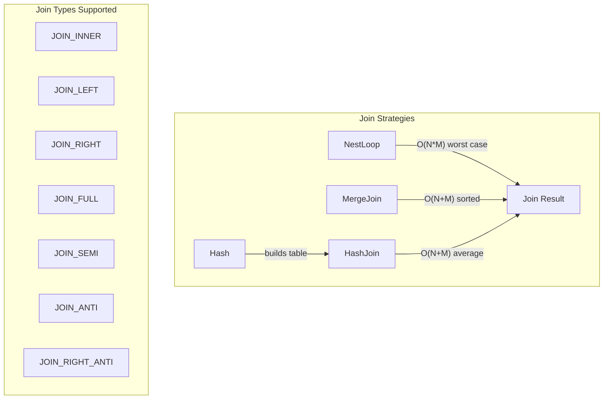
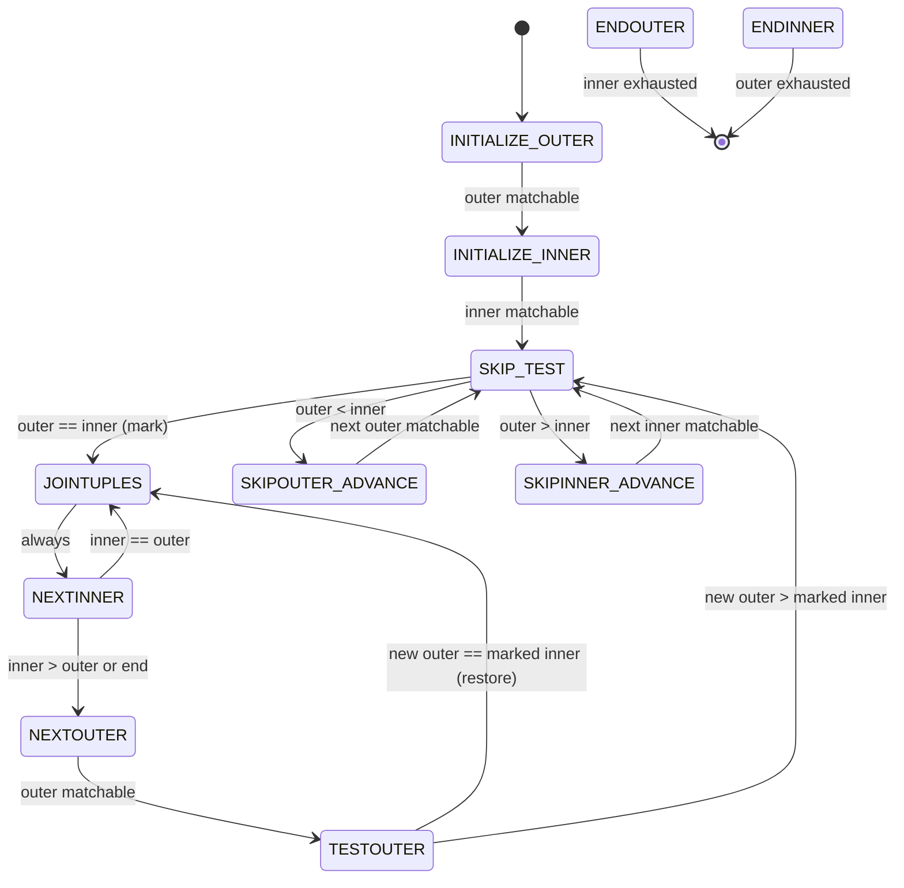
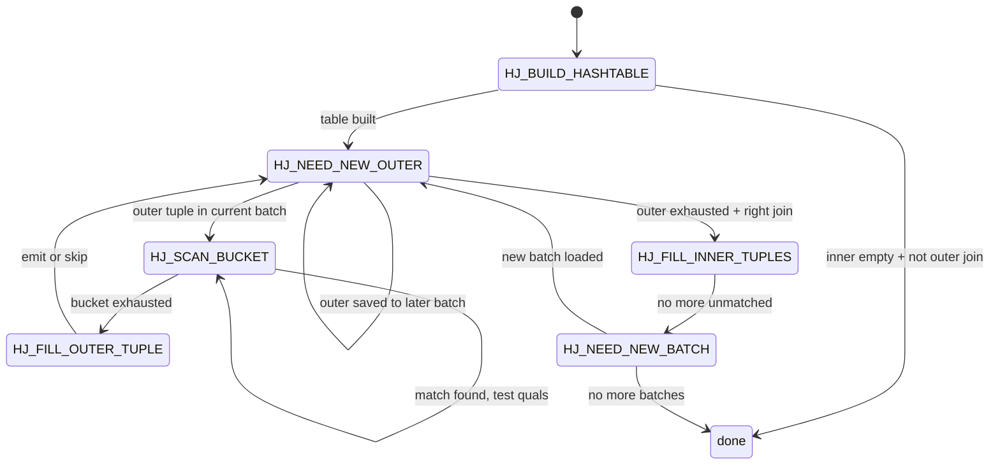
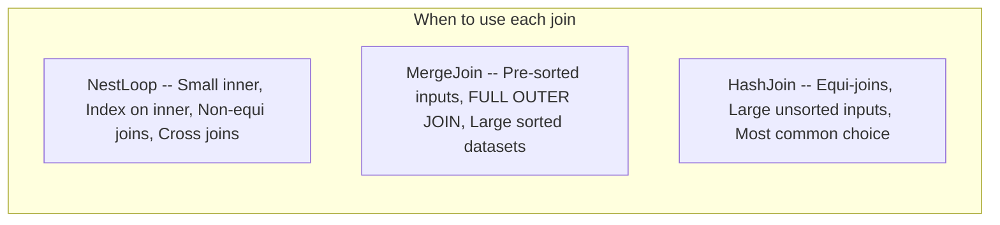

# Chapter 16: Node Catalog -- Join Nodes

**PostgreSQL 17 Executor Documentation**

---

**Navigation**: [Chapter 15: Node Catalog -- Scan Nodes](15_node_catalog_scan.md) | **Chapter 16** | [Chapter 17: Node Catalog -- Sort, Aggregate, and Grouping Nodes](17_node_catalog_sort_aggregate.md)

**Prerequisites**: [Chapter 08: ExecScan and Qual Evaluation](08_execscan_qual.md) -- covers ExecQual used for join qualification; [Chapter 10: Tuple Table Slots](10_tupleslots.md) -- slot types for inner/outer tuples; [Chapter 11: Memory Management](11_memory_management.md) -- per-tuple memory context reset during join execution; [Chapter 12: EvalPlanQual](12_evplanqual.md) -- EPQ mechanism referenced by concurrent update handling in joins.

---

## Overview

PostgreSQL implements three join algorithms: NestLoop, MergeJoin, and HashJoin. An auxiliary Hash node builds the hash table for HashJoin. The planner selects the algorithm based on join conditions, input ordering, and cost estimates.

All three join nodes share a common `JoinState` base structure that tracks the join type (INNER, LEFT, RIGHT, FULL, SEMI, ANTI, RIGHT_ANTI) and provides slots for null-padded tuples in outer join scenarios. The join qualification (`joinqual`) and additional filter (`otherqual`) follow the two-filter pattern documented in Chapter 08.



---

## Table of Contents

1. [NestLoop](#nestloop)
2. [MergeJoin](#mergejoin)
3. [HashJoin](#hashjoin)
4. [Join Strategy Comparison](#join-strategy-comparison)

---

## NestLoop

**Identity**
- NodeTag: `T_NestLoop` / `T_NestLoopState`
- Plan struct: `NestLoop` (`src/include/nodes/plannodes.h`)
- PlanState struct: `NestLoopState` (`src/include/nodes/execnodes.h`)
- Source: `src/backend/executor/nodeNestloop.c`

**Purpose**: Implements the nested-loop join algorithm. Produced by the planner for small inner relations, parameterized index lookups on the inner side, or when no equality join condition exists (cross joins, theta joins). Supports INNER, LEFT, SEMI, and ANTI joins.

### Initialization (`ExecInitNestLoop`)

```c
/* src/backend/executor/nodeNestloop.c:262 */
NestLoopState *
ExecInitNestLoop(NestLoop *node, EState *estate, int eflags)
```

1. Creates NestLoopState, sets `ExecProcNode = ExecNestLoop`.
2. Allocates expression context for per-tuple evaluation.
3. Initializes outer child unconditionally.
4. Initializes inner child with EXEC_FLAG_REWIND if no nestParams (parameterized inner), or without REWIND if parameterized (inner is always rescanned with fresh parameter values).
5. Initializes join quals and non-join quals (HAVING-like filters).
6. Sets `single_match = true` for inner_unique joins or JOIN_SEMI.
7. Allocates a null inner tuple slot for LEFT/ANTI joins.
8. Sets initial state: `nl_NeedNewOuter = true`, `nl_MatchedOuter = false`.

### Execution (`ExecNestLoop`)

```c
/* src/backend/executor/nodeNestloop.c:59 */
static TupleTableSlot *
ExecNestLoop(PlanState *pstate)
```

Step-by-step logic in a single infinite loop:

1. **Need new outer tuple** (`nl_NeedNewOuter == true`):
   - Fetch next outer tuple via `ExecProcNode(outerPlan)`.
   - If outer exhausted, return NULL (join complete).
   - For each `nestParams`, extract outer Var values and store in PARAM_EXEC slots, marking the inner plan's `chgParam`.
   - Rescan the inner plan via `ExecReScan(innerPlan)`.

2. **Fetch next inner tuple**:
   - Call `ExecProcNode(innerPlan)`.
   - If inner exhausted: set `nl_NeedNewOuter = true`. For LEFT/ANTI joins with no match, emit null-padded outer tuple.

3. **Evaluate join qualification**:
   - If `joinqual` passes: mark `nl_MatchedOuter = true`. For ANTI, skip (never return matched). For `single_match`, set `nl_NeedNewOuter = true`. If `otherqual` passes, project and return.
   - If `joinqual` fails: loop to fetch next inner tuple.

### End (`ExecEndNestLoop`)

```c
/* src/backend/executor/nodeNestloop.c:360 */
void ExecEndNestLoop(NestLoopState *node)
```

Shuts down both child plan nodes. No special cleanup needed.

### Rescan (`ExecReScanNestLoop`)

Rescans the outer plan if `chgParam` is NULL. Does NOT rescan inner plan here (inner is rescanned per outer tuple). Resets `nl_NeedNewOuter = true`, `nl_MatchedOuter = false`.

### Key State Fields

| Field | Type | Description |
|-------|------|-------------|
| `nl_NeedNewOuter` | `bool` | True when next outer tuple should be fetched |
| `nl_MatchedOuter` | `bool` | Whether current outer has found any inner match |
| `nl_NullInnerTupleSlot` | `TupleTableSlot *` | Pre-built all-NULL inner slot for outer joins |

### Performance

- **Time**: O(N * M) worst case where N = outer rows, M = inner rows. With a parameterized index scan on the inner side, effective complexity is O(N * log M).
- **Memory**: O(1) beyond child node requirements.
- **I/O**: Inner side is rescanned once per outer tuple. Best when inner is an index scan with selective quals.

### Parallel Support

Parallel-safe (can appear below Gather), but not parallel-aware. NestLoop itself does not coordinate between workers.

---

## MergeJoin

**Identity**
- NodeTag: `T_MergeJoin` / `T_MergeJoinState`
- Plan struct: `MergeJoin` (`src/include/nodes/plannodes.h`)
- PlanState struct: `MergeJoinState` (`src/include/nodes/execnodes.h`)
- Source: `src/backend/executor/nodeMergejoin.c`

**Purpose**: Implements the sort-merge join algorithm. Produced when both inputs are sorted (or can be sorted cheaply) on the join keys. The only join method that directly supports FULL OUTER JOIN. Supports INNER, LEFT, RIGHT, RIGHT_ANTI, FULL, SEMI, and ANTI joins.

### Initialization (`ExecInitMergeJoin`)

```c
/* src/backend/executor/nodeMergejoin.c:1443 */
MergeJoinState *
ExecInitMergeJoin(MergeJoin *node, EState *estate, int eflags)
```

1. Creates MergeJoinState, sets `ExecProcNode = ExecMergeJoin`.
2. Creates THREE expression contexts: one standard, plus `mj_OuterEContext` and `mj_InnerEContext` for evaluating merge keys without premature context resets.
3. Initializes inner child with EXEC_FLAG_MARK unless `skip_mark_restore` is set.
4. Calls `MJExamineQuals()` to deconstruct merge clauses into `MergeJoinClauseData` array with sort-support comparison functions from btree opfamilies.
5. Configures `mj_FillOuter`/`mj_FillInner` based on join type:
   - INNER/SEMI: both false
   - LEFT/ANTI: fill outer only
   - RIGHT/RIGHT_ANTI: fill inner only
   - FULL: both true
6. Sets initial state to `EXEC_MJ_INITIALIZE_OUTER`.

### Execution (`ExecMergeJoin`)

```c
/* src/backend/executor/nodeMergejoin.c:598 */
static TupleTableSlot *
ExecMergeJoin(PlanState *pstate)
```

Implemented as an explicit state machine with 11 states. Each call to ExecMergeJoin resumes at the saved state (`mj_JoinState`).



**State descriptions**:

| State | Description |
|-------|-------------|
| INITIALIZE_OUTER | Fetch first outer tuple, evaluate merge keys |
| INITIALIZE_INNER | Fetch first inner tuple, evaluate merge keys |
| JOINTUPLES | Both tuples satisfy merge clause; evaluate joinqual, project if pass |
| NEXTOUTER | Advance outer; emit fill tuple for unmatched outer if doing outer join |
| TESTOUTER | Compare new outer against marked inner; restore if equal |
| NEXTINNER | Advance inner; emit fill tuple for unmatched inner if doing right join |
| SKIP_TEST | Compare current outer and inner; mark inner if equal |
| SKIPOUTER_ADVANCE | Advance outer past non-matching tuples; emit fills for LEFT joins |
| SKIPINNER_ADVANCE | Advance inner past non-matching tuples; emit fills for RIGHT joins |
| ENDOUTER | Outer exhausted during right/full join; emit remaining unmatched inner |
| ENDINNER | Inner exhausted during left/full join; emit remaining unmatched outer |

### End (`ExecEndMergeJoin`)

Calls `ExecEndNode()` on both children.

### Rescan (`ExecReScanMergeJoin`)

Resets state to `EXEC_MJ_INITIALIZE_OUTER`. Rescans outer if `chgParam` is NULL. Rescans inner. Clears marked tuple slot.

### Key State Fields

| Field | Type | Description |
|-------|------|-------------|
| `mj_JoinState` | `int` | Current state machine state (1-11) |
| `mj_Clauses` | `MergeJoinClause` | Array of per-clause comparison data |
| `mj_NumClauses` | `int` | Number of merge clauses |
| `mj_OuterTupleSlot` | `TupleTableSlot *` | Current outer tuple |
| `mj_InnerTupleSlot` | `TupleTableSlot *` | Current inner tuple |
| `mj_MarkedTupleSlot` | `TupleTableSlot *` | Copy of marked inner tuple for restore |
| `mj_MatchedOuter` | `bool` | Whether current outer has joined |
| `mj_MatchedInner` | `bool` | Whether current inner has joined |
| `mj_FillOuter` | `bool` | Emit null-filled tuples for unmatched outers |
| `mj_FillInner` | `bool` | Emit null-filled tuples for unmatched inners |
| `mj_SkipMarkRestore` | `bool` | Optimization: skip mark/restore when safe |

### Performance

- **Time**: O(N + M) for a single-pass merge. With duplicate keys, inner tuples must be re-scanned via mark/restore, potentially reaching O(N * D) where D is the max duplicate count.
- **Memory**: O(1) beyond child nodes.
- **I/O**: Sequential access pattern on both inputs. Very cache-friendly.

### Parallel Support

Parallel-safe but not parallel-aware.

---

## HashJoin

**Identity**
- NodeTag: `T_HashJoin` / `T_HashJoinState`
- Plan struct: `HashJoin` (`src/include/nodes/plannodes.h`)
- PlanState struct: `HashJoinState` (`src/include/nodes/execnodes.h`)
- Source: `src/backend/executor/nodeHashjoin.c`

**Purpose**: Implements the hybrid hash join algorithm. The most commonly used join method for equi-joins on larger datasets. Supports INNER, LEFT, RIGHT, RIGHT_ANTI, FULL, SEMI, and ANTI joins. The inner (build) side is hashed; the outer (probe) side scans the hash table. When the hash table exceeds `work_mem`, tuples overflow to temporary batch files on disk.

### Initialization (`ExecInitHashJoin`)

```c
/* src/backend/executor/nodeHashjoin.c:709 */
HashJoinState *
ExecInitHashJoin(HashJoin *node, EState *estate, int eflags)
```

1. Creates HashJoinState. Sets `ExecProcNode = ExecHashJoin` (may be replaced with `ExecParallelHashJoin` for parallel queries).
2. Initializes outer and inner (Hash) child nodes.
3. Sets `single_match` for inner_unique or SEMI joins.
4. Allocates null tuple slots based on join type.
5. Initializes hash clauses, hash key expressions, hash operators, and collations.
6. Sets initial state: `hj_JoinState = HJ_BUILD_HASHTABLE`.

### Execution (`ExecHashJoinImpl`)

```c
/* src/backend/executor/nodeHashjoin.c:219 */
static pg_attribute_always_inline TupleTableSlot *
ExecHashJoinImpl(PlanState *pstate, bool parallel)
```

This function is `always_inline` and called by both `ExecHashJoin()` (serial) and `ExecParallelHashJoin()` (parallel). The compiler generates two specialized versions.

**State Machine -- HJ_* States**:



| State | Description |
|-------|-------------|
| HJ_BUILD_HASHTABLE | Build the hash table from inner relation via `MultiExecProcNode()` on the Hash child. Optionally prefetch one outer tuple. |
| HJ_NEED_NEW_OUTER | Fetch next outer tuple, compute hash value, determine batch/bucket. If later batch, save to outer batch file. |
| HJ_SCAN_BUCKET | Call `ExecScanHashBucket()` to find matching inner tuples. Test joinqual and otherqual. Handle ANTI/SEMI/RIGHT_ANTI. |
| HJ_FILL_OUTER_TUPLE | If outer unmatched and doing left/full join, emit null-padded tuple. |
| HJ_FILL_INNER_TUPLES | Scan hash table for unmatched inner tuples (right/full join). |
| HJ_NEED_NEW_BATCH | Advance to next batch. Reload hash table from inner batch file. Rewind outer batch file. |

### Multi-Batch Overflow

When the hash table exceeds `work_mem`:
1. The number of batches is doubled (always a power of two).
2. Tuples in the current hash table are redistributed to new batch files.
3. Each subsequent batch is loaded from its inner batch file and probed with tuples from its outer batch file.
4. Growth is disabled if an increase did not actually redistribute any tuples (skew scenario).

### End (`ExecEndHashJoin`)

Destroys the hash table via `ExecHashTableDestroy()` and shuts down both children.

### Rescan (`ExecReScanHashJoin`)

- If single-batch and inner params unchanged: reuse the hash table (reset match flags). Set state to HJ_NEED_NEW_OUTER.
- Otherwise: destroy hash table, set state to HJ_BUILD_HASHTABLE, rescan inner.

### Key State Fields

| Field | Type | Description |
|-------|------|-------------|
| `hj_JoinState` | `int` | Current state machine state (1-6) |
| `hj_HashTable` | `HashJoinTable` | Pointer to the hash table structure |
| `hj_CurHashValue` | `uint32` | Hash value of current outer tuple |
| `hj_CurBucketNo` | `int` | Current hash bucket being probed |
| `hj_CurTuple` | `HashJoinTuple` | Current position in hash bucket chain |
| `hj_MatchedOuter` | `bool` | Current outer has at least one inner match |
| `hj_OuterNotEmpty` | `bool` | Outer relation is known non-empty |
| `hj_OuterHashKeys` | `List *` | Hash key expressions for outer tuples |

### Performance

- **Time**: O(N + M) average case. O(N * M) worst case with extreme hash collisions (practically never occurs).
- **Memory**: O(min(N,M)) for the hash table, bounded by `work_mem`. Overflows to disk via temp batch files.
- **I/O**: One full scan of each input in the single-batch case. Multi-batch adds write and read of batch files (sequential I/O).

### Parallel Support

Parallel-safe and **parallel-aware**. Appears as "Parallel Hash Join" in EXPLAIN. Uses shared memory hash table with barrier-based synchronization through build, partition, probe, and scan phases. See Chapter 19 for the Hash node's parallel build protocol.

---

## Join Strategy Comparison

| Aspect | NestLoop | MergeJoin | HashJoin |
|--------|----------|-----------|----------|
| Join condition | Any | Equi-join (btree) | Equi-join (hash) |
| Input ordering | None required | Both sorted | None required |
| FULL OUTER | No | Yes | Yes |
| Memory | O(1) | O(1) | O(inner) |
| Startup cost | Low | High (sort) | Medium (build) |
| Best for | Small inner, index | Sorted data | Large equi-joins |
| Parallel-aware | No | No | Yes |



---

## Summary Table

| NodeTag | Plan Struct | PlanState Struct | Source File | Init / Exec / End |
|---------|------------|-----------------|-------------|-------------------|
| `T_NestLoop` | `NestLoop` | `NestLoopState` | `nodeNestloop.c` | `ExecInitNestLoop` / `ExecNestLoop` / `ExecEndNestLoop` |
| `T_MergeJoin` | `MergeJoin` | `MergeJoinState` | `nodeMergejoin.c` | `ExecInitMergeJoin` / `ExecMergeJoin` / `ExecEndMergeJoin` |
| `T_HashJoin` | `HashJoin` | `HashJoinState` | `nodeHashjoin.c` | `ExecInitHashJoin` / `ExecHashJoin` (via `ExecHashJoinImpl`) / `ExecEndHashJoin` |
