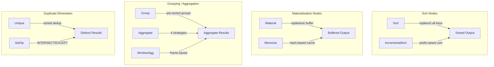
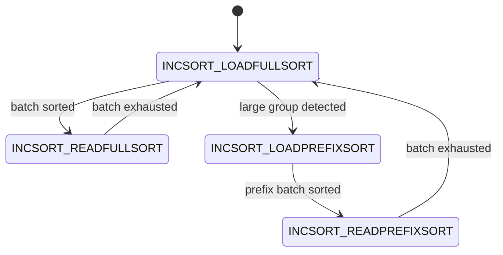
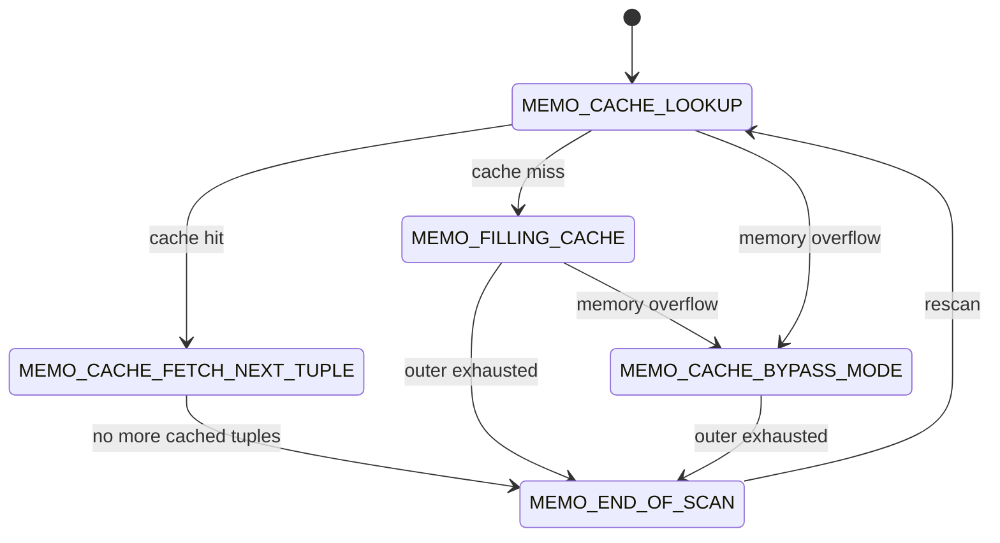

# Chapter 17: Node Catalog -- Sort, Materialization, Aggregation, and Grouping Nodes

**PostgreSQL 17 Executor Documentation**

---

**Navigation**: [Chapter 16: Node Catalog -- Join Nodes](16_node_catalog_join.md) | **Chapter 17** | [Chapter 18: Node Catalog -- Modify, Control, and Utility Nodes](18_node_catalog_modify_control.md)

**Prerequisites**: [Chapter 09: Expression Evaluation and JIT](09_expression_eval_jit.md) -- covers expression compilation used by aggregate transition functions; [Chapter 11: Memory Management](11_memory_management.md) -- per-tuple context reset and work_mem budget; [Chapter 10: Tuple Table Slots](10_tupleslots.md) -- MinimalTuple slots used by Sort and Material.

---

## Overview

This chapter catalogs nine node types responsible for sorting, materialization, aggregation, and duplicate elimination. These nodes are the workhorses between scan/join nodes and final result delivery.



---

## Table of Contents

1. [Sort](#sort)
2. [IncrementalSort](#incrementalsort)
3. [Material](#material)
4. [Memoize](#memoize)
5. [Group](#group)
6. [Aggregate](#aggregate)
7. [WindowAgg](#windowagg)
8. [Unique](#unique)
9. [SetOp](#setop)

---

## Sort

**Identity**
- NodeTag: `T_Sort` / `T_SortState`
- Plan struct: `Sort` (`src/include/nodes/plannodes.h`)
- PlanState struct: `SortState` (`src/include/nodes/execnodes.h`)
- Source: `src/backend/executor/nodeSort.c`

**Purpose**: Sorts all input tuples using the tuplesort module, then returns them one at a time. A blocking operator: must consume all input before producing any output. Supports forward and backward scans, mark/restore, and bounded (top-N) sort optimization.

### Initialization (`ExecInitSort`)

```c
/* src/backend/executor/nodeSort.c:220 */
SortState *
ExecInitSort(Sort *node, EState *estate, int eflags)
```

1. Creates SortState, sets `ExecProcNode = ExecSort`.
2. Determines `randomAccess` from eflags (REWIND, BACKWARD, or MARK).
3. Shields the child node from REWIND/BACKWARD/MARK requirements.
4. Detects datum-sort optimization: if the result has exactly one column, uses the faster `tuplesort_begin_datum` path.

### Execution (`ExecSort`)

**Phase 1 -- Loading** (first call, `sort_Done == false`):
1. Initializes tuplesort (datum or heap path).
2. If bounded, calls `tuplesort_set_bound()` for top-N heap optimization.
3. Reads all tuples from outer child via `ExecProcNode()` loop.
4. Calls `tuplesort_performsort()`.

**Phase 2 -- Returning** (every call):
- Calls `tuplesort_gettupleslot()` (or `tuplesort_getdatum()`) and returns.

### End (`ExecEndSort`)

Calls `tuplesort_end()`, then shuts down the outer child.

### Rescan (`ExecReScanSort`)

If outer plan's chgParam is set or sort parameters changed: destroys tuplesort and re-reads from scratch. Otherwise, calls `tuplesort_rescan()` to rewind.

### Key State Fields

| Field | Type | Description |
|-------|------|-------------|
| `sort_Done` | `bool` | True after initial sort is complete |
| `bounded` | `bool` | Whether top-N sort optimization is active |
| `bound` | `int64` | Number of tuples to keep for bounded sort |
| `tuplesortstate` | `void *` | Opaque handle to tuplesort state |
| `datumSort` | `bool` | True if single-column datum sort path |
| `randomAccess` | `bool` | Whether backward scan or mark/restore is needed |

### Performance

- Blocking: all input consumed before any output.
- Memory: controlled by `work_mem`; spills to disk if exceeded.
- Datum sort significantly faster for single-column results.
- Bounded sort (LIMIT queries) uses top-N heap: O(N log K) where K is the bound.

### Parallel Support

Sort itself does not parallelize internally. Supports collecting instrumentation from parallel workers via `SharedSortInfo`.

---

## IncrementalSort

**Identity**
- NodeTag: `T_IncrementalSort` / `T_IncrementalSortState`
- Plan struct: `IncrementalSort` (`src/include/nodes/plannodes.h`)
- PlanState struct: `IncrementalSortState` (`src/include/nodes/execnodes.h`)
- Source: `src/backend/executor/nodeIncrementalSort.c`

**Purpose**: Optimized sort for input already sorted by a prefix of the required sort keys. Divides input into groups sharing the same prefix key values and sorts each group independently on suffix keys. Produces output incrementally (non-blocking).

### Initialization (`ExecInitIncrementalSort`)

```c
/* src/backend/executor/nodeIncrementalSort.c:770 */
IncrementalSortState *
ExecInitIncrementalSort(IncrementalSort *node, EState *estate, int eflags)
```

1. Creates state, sets initial execution status to `INCSORT_LOADFULLSORT`.
2. Allocates `group_pivot` and `transfer_tuple` slots for prefix group tracking.
3. Tuplesort states are created lazily on first execution.

### Execution (`ExecIncrementalSort`)

Four-state state machine:



**Full-sort mode**: Accumulates at least `DEFAULT_MIN_GROUP_SIZE` (32) tuples, sorting on all columns. If no group boundary is found within `DEFAULT_MAX_FULL_SORT_GROUP_SIZE` (64) tuples, switches to presorted prefix mode.

**Presorted prefix mode**: Sorts only on suffix keys. More efficient for large groups.

### End (`ExecEndIncrementalSort`)

Destroys both `fullsort_state` and `prefixsort_state` tuplesorts.

### Rescan (`ExecReScanIncrementalSort`)

Resets both tuplesort states, clears group pivot, resets to `INCSORT_LOADFULLSORT`.

### Key State Fields

| Field | Type | Description |
|-------|------|-------------|
| `execution_status` | `int` | Current state machine state |
| `fullsort_state` | `Tuplesortstate *` | Full-key sort state |
| `prefixsort_state` | `Tuplesortstate *` | Suffix-key sort state |
| `group_pivot` | `TupleTableSlot *` | First tuple of current prefix group |
| `outerNodeDone` | `bool` | Whether outer node is exhausted |
| `bounded` / `bound` | `bool` / `int64` | Top-N sort parameters |

### Performance

- Non-blocking: can produce output before consuming all input.
- For LIMIT queries with presorted input, dramatically reduces work.
- Each prefix group individually fits within `work_mem`, avoiding disk spills for datasets with many small groups.

### Parallel Support

Supports instrumentation sharing via `SharedIncrementalSortInfo`.

---

## Material

**Identity**
- NodeTag: `T_Material` / `T_MaterialState`
- Plan struct: `Material` (`src/include/nodes/plannodes.h`)
- PlanState struct: `MaterialState` (`src/include/nodes/execnodes.h`)
- Source: `src/backend/executor/nodeMaterial.c`

**Purpose**: Materializes (buffers) the child plan output into a tuplestore, allowing rescan, backward scan, or mark/restore without re-executing the child plan. Used when the parent node requires multiple passes (e.g., inner side of a nested loop join).

### Initialization (`ExecInitMaterial`)

```c
/* src/backend/executor/nodeMaterial.c:163 */
MaterialState *
ExecInitMaterial(Material *node, EState *estate, int eflags)
```

1. Captures eflags: EXEC_FLAG_REWIND, EXEC_FLAG_BACKWARD, EXEC_FLAG_MARK.
2. If no flags are set (eflags == 0), acts as pass-through without creating a tuplestore.
3. Shields child from REWIND/BACKWARD/MARK.

### Execution (`ExecMaterial`)

Lazy materialization:
1. On first call, creates the tuplestore. Allocates a second read pointer for mark/restore if needed.
2. If not at tuplestore EOF, fetches from tuplestore.
3. If at tuplestore EOF and outer child not exhausted, fetches a new tuple, appends to tuplestore, and returns.
4. If eflags == 0, acts as pure pass-through.

### Mark/Restore

- `ExecMaterialMarkPos()`: Copies active read pointer to mark pointer, trims tuples before mark.
- `ExecMaterialRestrPos()`: Copies mark pointer back to active pointer.

### End (`ExecEndMaterial`)

Calls `tuplestore_end()` and shuts down outer child.

### Rescan (`ExecReScanMaterial`)

If outer plan's chgParam changed: destroys tuplestore and re-reads. Otherwise: rewinds.

### Key State Fields

| Field | Type | Description |
|-------|------|-------------|
| `eflags` | `int` | Requested capabilities (REWIND, BACKWARD, MARK) |
| `eof_underlying` | `bool` | Whether outer child is exhausted |
| `tuplestorestate` | `Tuplestorestate *` | Handle to tuplestore, or NULL |

### Performance

- Memory: uses `work_mem`; spills to disk when exceeded.
- When eflags == 0, adds no overhead (pure pass-through).

### Parallel Support

None. Material nodes are not parallelizable.

---

## Memoize

**Identity**
- NodeTag: `T_Memoize` / `T_MemoizeState`
- Plan struct: `Memoize` (`src/include/nodes/plannodes.h`)
- PlanState struct: `MemoizeState` (`src/include/nodes/execnodes.h`)
- Source: `src/backend/executor/nodeMemoize.c`

**Purpose**: Caches results from parameterized inner plan nodes in a hash table to avoid redundant rescans. When the same parameter values recur, returns cached tuples instead of re-executing the inner plan. Significantly accelerates nested-loop joins when outer tuples frequently repeat join key values.

### Initialization (`ExecInitMemoize`)

```c
/* src/backend/executor/nodeMemoize.c:951 */
MemoizeState *
ExecInitMemoize(Memoize *node, EState *estate, int eflags)
```

1. Sets initial state to `MEMO_CACHE_LOOKUP`.
2. For each cache key: looks up hash functions and initializes `param_exprs`.
3. Builds `cache_eq_expr` via `ExecBuildParamSetEqual()`.
4. Sets `mem_limit` from `get_hash_memory_limit()`.
5. Hash table creation deferred to first execution.

### Execution (`ExecMemoize`)

Five-state state machine:



| State | Description |
|-------|-------------|
| MEMO_CACHE_LOOKUP | Probe hash table. Hit -> fetch cached. Miss -> fill cache. |
| MEMO_CACHE_FETCH_NEXT_TUPLE | Walk MemoizeTuple linked list returning cached tuples. |
| MEMO_FILLING_CACHE | Read from outer node, store in cache entry. |
| MEMO_CACHE_BYPASS_MODE | Read directly from outer without caching (result set too large). |
| MEMO_END_OF_SCAN | Terminal state. Reset to LOOKUP on rescan. |

### LRU Eviction

When cache memory exceeds `mem_limit`, `cache_reduce_memory()` evicts entries from the head of a doubly-linked LRU list.

### End (`ExecEndMemoize`)

Deletes the tableContext and shuts down outer child.

### Rescan (`ExecReScanMemoize`)

Resets state to MEMO_CACHE_LOOKUP. If parameters changed that are NOT part of the cache key, purges the entire cache.

### Key State Fields

| Field | Type | Description |
|-------|------|-------------|
| `mstatus` | `int` | Current state machine state |
| `nkeys` | `int` | Number of cache key parameters |
| `hashtable` | `memoize_hash *` | simplehash hash table |
| `mem_used` | `uint64` | Current memory consumption (bytes) |
| `mem_limit` | `uint64` | Maximum allowed memory |
| `lru_list` | `dlist_head` | LRU eviction list |
| `singlerow` | `bool` | Mark entry complete after 1 tuple |
| `binary_mode` | `bool` | Use binary comparison vs. operator equality |
| `stats` | `MemoizeInstrumentation` | Cache statistics (hits/misses/evictions) |

### Performance

- Most effective when many outer tuples share join key values (high cache hit rate).
- Memory budget: `hash_mem_multiplier * work_mem`.
- Singlerow optimization marks entries complete after the first tuple.
- Bypass mode prevents pathological behavior for oversized result sets.

### Parallel Support

Each worker maintains its own independent cache. Supports instrumentation sharing via `SharedMemoizeInfo`.

---

## Group

**Identity**
- NodeTag: `T_Group` / `T_GroupState`
- Plan struct: `Group` (`src/include/nodes/plannodes.h`)
- PlanState struct: `GroupState` (`src/include/nodes/execnodes.h`)
- Source: `src/backend/executor/nodeGroup.c`

**Purpose**: Simple group-boundary detection for GROUP BY on pre-sorted input. Returns one tuple per group (the first tuple in each group). Supports HAVING qualification. A simpler alternative to Aggregate when no aggregate functions are needed.

### Initialization (`ExecInitGroup`)

```c
/* src/backend/executor/nodeGroup.c:160 */
GroupState *
ExecInitGroup(Group *node, EState *estate, int eflags)
```

Precomputes equality function via `execTuplesMatchPrepare()` for the grouping columns. Initializes qual (HAVING clause) and projection.

### Execution (`ExecGroup`)

1. Fetches the first tuple as the group representative. Checks HAVING; if it passes, projects and returns.
2. On subsequent calls: scans consecutive tuples belonging to the current group (skipping them). When a non-matching tuple is found (new group boundary), copies it as the new representative. Checks HAVING; loops back if it fails.
3. Returns NULL when input is exhausted.

### End / Rescan

- `ExecEndGroup()`: Shuts down outer child.
- `ExecReScanGroup()`: Clears `grp_done` and scan tuple slot.

### Key State Fields

| Field | Type | Description |
|-------|------|-------------|
| `grp_done` | `bool` | True when input is exhausted |
| `eqfunction` | `ExprState *` | Compiled equality for grouping columns |

### Performance

- O(N) single pass, minimal overhead. Requires pre-sorted input.
- Rarely used in modern plans; Aggregate with AGG_SORTED handles most GROUP BY.

### Parallel Support

None.

---

## Aggregate

**Identity**
- NodeTag: `T_Agg` / `T_AggState`
- Plan struct: `Agg` (`src/include/nodes/plannodes.h`)
- PlanState struct: `AggState` (`src/include/nodes/execnodes.h`)
- Source: `src/backend/executor/nodeAgg.c`

**Purpose**: The central aggregation engine. Handles all aggregate functions (SUM, COUNT, AVG, etc.), GROUP BY, GROUPING SETS, CUBE, and ROLLUP. Implements four strategies chosen by the planner.

### The Four Strategies

```mermaid
flowchart TB
    subgraph "AGG_PLAIN"
        P_IN["All input"] --> P_OUT["One result row"]
    end
    subgraph "AGG_SORTED"
        S_IN["Sorted input"] --> S_DET["Group boundary detection"] --> S_OUT["One row per group"]
    end
    subgraph "AGG_HASHED"
        H_IN["Any order input"] --> H_HT["Build hash table"] --> H_SCAN["Scan hash table"] --> H_OUT["One row per group"]
    end
    subgraph "AGG_MIXED"
        M_IN["Input"] --> M_S["Sorted phase"] --> M_H["Hashed phase"] --> M_OUT["Combined results"]
    end
```



- **AGG_PLAIN**: No GROUP BY. Single group, always produces exactly one row. `SELECT count(*) FROM t`.
- **AGG_SORTED**: Pre-sorted input. Detects group boundaries by comparing adjacent tuples. Supports GROUPING SETS via re-sorting between phases.
- **AGG_HASHED**: Builds a hash table with one entry per group. Supports spill-to-disk.
- **AGG_MIXED**: Combines sorted and hashed strategies for GROUPING SETS. Phase 1 reads sorted input while populating hash tables. Phase 0 scans hash tables.

### Initialization (`ExecInitAgg`)

```c
/* src/backend/executor/nodeAgg.c:3164 */
AggState *
ExecInitAgg(Agg *node, EState *estate, int eflags)
```

One of the largest initialization functions (~860 lines). Creates multiple expression contexts (`tmpcontext`, `aggcontexts[]`, `hashcontext`). For each Aggref: resolves the function, sets up transition/final/serialize/deserialize functions. For hashed strategies: allocates hash table metadata and sets memory limits.

### Execution (`ExecAgg`)

Dispatches based on the current phase's strategy:
- `agg_retrieve_direct()`: For AGG_PLAIN/AGG_SORTED.
- `agg_fill_hash_table()` + `agg_retrieve_hash_table()`: For AGG_HASHED/AGG_MIXED.

### End (`ExecEndAgg`)

Cleans up tuplesort states, hash spill state, per-group data, and expression contexts.

### Key State Fields

| Field | Type | Description |
|-------|------|-------------|
| `aggstrategy` | `AggStrategy` | AGG_PLAIN/SORTED/HASHED/MIXED |
| `aggsplit` | `AggSplit` | Partial/final/combine mode |
| `numphases` | `int` | Number of sort phases |
| `peragg` | `AggStatePerAgg` | Per-aggregate-function state |
| `pertrans` | `AggStatePerTrans` | Per-transition-function state |
| `pergroups` | `AggStatePerGroup *` | Per-group transition values |
| `num_hashes` | `int` | Number of hash tables |
| `table_filled` | `bool` | Whether hash table is populated |
| `hash_mem_limit` | `Size` | Memory limit for hash tables |

### Performance

- AGG_SORTED: preferred for pre-sorted input. O(N), O(1) memory for transitions.
- AGG_HASHED: preferred for unsorted input with manageable groups. Memory proportional to groups. Supports spill-to-disk.
- AGG_MIXED: minimizes I/O for GROUPING SETS -- single pass over input.
- Partial aggregation (aggsplit) enables parallel aggregation.

### Parallel Support

Full parallel aggregation support through partial/final split. Workers execute Partial Aggregate, leader combines with Final Aggregate.

---

## WindowAgg

**Identity**
- NodeTag: `T_WindowAgg` / `T_WindowAggState`
- Plan struct: `WindowAgg` (`src/include/nodes/plannodes.h`)
- PlanState struct: `WindowAggState` (`src/include/nodes/execnodes.h`)
- Source: `src/backend/executor/nodeWindowAgg.c`

**Purpose**: Implements SQL window functions (OVER clause). Unlike regular aggregation, WindowAgg does not reduce rows -- every input row produces one output row. Supports ROWS, RANGE, and GROUPS frame modes, frame exclusion, built-in window functions (row_number, rank, etc.), and user-defined aggregates as window functions.

### Initialization (`ExecInitWindowAgg`)

```c
/* src/backend/executor/nodeWindowAgg.c:2374 */
WindowAggState *
ExecInitWindowAgg(WindowAgg *node, EState *estate, int eflags)
```

1. Creates specialized memory contexts: `partcontext` (per-partition) and `aggcontext` (reset at partition boundary).
2. Allocates tuplestore read pointers for: current position, frame head, frame tail, group tail.
3. For each window function: resolves from pg_proc/pg_aggregate, sets up per-function and per-aggregate state.
4. Compiles frame offset expressions and run condition.

### Execution (`ExecWindowAgg`)

Processes one row at a time with three execution modes:

1. **WINDOWAGG_RUN**: Normal mode. Evaluates window functions and aggregates, applies run condition and qual filter.
2. **WINDOWAGG_PASSTHROUGH**: Run condition failed. NULLifies aggregate results and passes tuples through (for non-top-level WindowAgg).
3. **WINDOWAGG_PASSTHROUGH_STRICT**: Filters out rows entirely (for top-level with PARTITION BY).

Key internal functions: `begin_partition()`, `spool_tuples()`, `eval_windowfunction()`, `eval_windowaggregates()`, `update_frameheadpos()`, `update_frametailpos()`.

### End (`ExecEndWindowAgg`)

Releases partition tuplestore, deletes partition and aggregate memory contexts.

### Key State Fields

| Field | Type | Description |
|-------|------|-------------|
| `status` | `WindowAggStatus` | RUN/PASSTHROUGH/PASSTHROUGH_STRICT/DONE |
| `buffer` | `Tuplestorestate *` | Tuplestore for current partition |
| `currentpos` | `int64` | Current row position in partition |
| `frameOptions` | `int` | Frame mode flags (ROWS/RANGE/GROUPS) |
| `framehead_valid` | `bool` | Whether frame head position is current |
| `frametail_valid` | `bool` | Whether frame tail position is current |
| `perfunc` | `WindowStatePerFunc` | Per-function state array |
| `peragg` | `WindowStatePerAgg` | Per-aggregate state array |
| `runcondition` | `ExprState *` | Optimized monotonic function filter |

### Performance

- Non-blocking within a partition, but must spool the entire partition.
- Frame boundary calculations are cached and only recomputed when the frame moves.
- `tuplestore_trim()` keeps memory proportional to frame size, not partition size.
- Pass-through mode avoids evaluating window functions for irrelevant rows.
- ROWS frames are cheapest; RANGE and GROUPS require peer group detection.

### Parallel Support

Not parallelizable. Can sit on top of a parallelized subplan (e.g., Gather Merge feeding into WindowAgg).

---

## Unique

**Identity**
- NodeTag: `T_Unique` / `T_UniqueState`
- Plan struct: `Unique` (`src/include/nodes/plannodes.h`)
- PlanState struct: `UniqueState` (`src/include/nodes/execnodes.h`)
- Source: `src/backend/executor/nodeUnique.c`

**Purpose**: Filters out duplicate tuples from sorted input by comparing each tuple to the previously returned tuple. Used for SELECT DISTINCT on sorted output and internally for UNION (not UNION ALL).

### Initialization (`ExecInitUnique`)

```c
/* src/backend/executor/nodeUnique.c:113 */
UniqueState *
ExecInitUnique(Unique *node, EState *estate, int eflags)
```

Precomputes equality function via `execTuplesMatchPrepare()`. Sets `ps_ProjInfo = NULL` (no projection).

### Execution (`ExecUnique`)

Simple loop: fetches tuples from outer plan, compares against previously returned tuple using the equality function. If different, returns the new tuple. If same, skips and fetches next.

### End / Rescan

- `ExecEndUnique()`: Shuts down outer child.
- `ExecReScanUnique()`: Clears result tuple slot (so first next tuple is returned).

### Key State Fields

| Field | Type | Description |
|-------|------|-------------|
| `eqfunction` | `ExprState *` | Compiled equality for unique columns |

### Performance

- O(N) single pass, minimal overhead. Requires sorted input.

### Parallel Support

None.

---

## SetOp

**Identity**
- NodeTag: `T_SetOp` / `T_SetOpState`
- Plan struct: `SetOp` (`src/include/nodes/plannodes.h`)
- PlanState struct: `SetOpState` (`src/include/nodes/execnodes.h`)
- Source: `src/backend/executor/nodeSetOp.c`

**Purpose**: Implements INTERSECT, INTERSECT ALL, EXCEPT, and EXCEPT ALL set operations. Input tuples have a junk "flag" column indicating the source relation (0 = left, 1 = right). SetOp counts occurrences from each side and applies SQL-standard output rules. Does NOT handle UNION/UNION ALL (those use Append + optional Unique).

### Two Strategies

- **SETOP_SORTED**: Pre-sorted input. Detects group boundaries, counts left/right occurrences per group.
- **SETOP_HASHED**: Builds hash table from first relation (counting left), probes with second relation (counting right), then scans hash table.

**Output count rules**:

| Operation | Output count |
|-----------|-------------|
| INTERSECT | 1 if both sides have >= 1 tuple, else 0 |
| INTERSECT ALL | min(numLeft, numRight) |
| EXCEPT | 1 if numLeft > 0 AND numRight == 0, else 0 |
| EXCEPT ALL | max(0, numLeft - numRight) |

### Initialization (`ExecInitSetOp`)

```c
/* src/backend/executor/nodeSetOp.c:480 */
SetOpState *
ExecInitSetOp(SetOp *node, EState *estate, int eflags)
```

For SETOP_HASHED: creates `tableContext`, builds hash table via `BuildTupleHashTableExt()`. For SETOP_SORTED: prepares equality function, allocates per-group counter.

### Execution (`ExecSetOp`)

If `numOutput > 0`, returns the same tuple again (for ALL variants emitting multiple copies). Then dispatches to `setop_retrieve_direct()` (sorted) or `setop_fill_hash_table()` + `setop_retrieve_hash_table()` (hashed).

### End (`ExecEndSetOp`)

Deletes tableContext, shuts down outer child.

### Rescan (`ExecReScanSetOp`)

SETOP_HASHED with unchanged params: resets hash table iterator. SETOP_HASHED with changed params: rebuilds hash table. SETOP_SORTED: resets state.

### Key State Fields

| Field | Type | Description |
|-------|------|-------------|
| `setop_done` | `bool` | Whether all groups are processed |
| `numOutput` | `int` | Remaining copies to emit for current group |
| `hashtable` | `TupleHashTable` | Hash table (hashed mode) |
| `eqfunction` | `ExprState *` | Equality comparison (sorted mode) |
| `table_filled` | `bool` | Whether hash table is populated |

### Performance

- SETOP_SORTED: O(N) pass, O(1) memory.
- SETOP_HASHED: O(N) amortized, memory proportional to distinct groups.

### Parallel Support

None.

---

## Comparison Tables

### Sort and Materialization Nodes

| Node | Blocking? | Requires Sorted Input? | Uses work_mem? | Mark/Restore? |
|------|-----------|----------------------|---------------|---------------|
| Sort | Yes | No (produces sorted) | Yes (tuplesort) | Yes |
| IncrementalSort | No (per-group) | Partial (prefix) | Yes (tuplesort) | No |
| Material | No (lazy) | No | Yes (tuplestore) | Yes |
| Memoize | No (lazy) | No | Yes (hash table) | No |

### Grouping and Aggregation Nodes

| Node | Strategy | Input Order | Output Rows | Memory |
|------|----------|-------------|-------------|--------|
| Group | Sorted scan | Must be sorted | 1 per group | O(1) |
| Agg (PLAIN) | Single pass | Any | Exactly 1 | O(1) |
| Agg (SORTED) | Group detect | Must be sorted | 1 per group | O(groups) |
| Agg (HASHED) | Hash table | Any | 1 per group | O(groups) |
| Agg (MIXED) | Sort + Hash | Must be sorted | 1 per set | O(hash groups) |
| WindowAgg | Partitioned | Must be sorted | 1 per input | O(partition) |
| Unique | Dedup | Must be sorted | <= input | O(1) |
| SetOp (SORTED) | Group detect | Must be sorted | <= input | O(1) |
| SetOp (HASHED) | Hash table | Any | <= input | O(groups) |

---

## Summary Table

| NodeTag | Plan Struct | PlanState Struct | Source File | Init / Exec / End |
|---------|------------|-----------------|-------------|-------------------|
| `T_Sort` | `Sort` | `SortState` | `nodeSort.c` | `ExecInitSort` / `ExecSort` / `ExecEndSort` |
| `T_IncrementalSort` | `IncrementalSort` | `IncrementalSortState` | `nodeIncrementalSort.c` | `ExecInitIncrementalSort` / `ExecIncrementalSort` / `ExecEndIncrementalSort` |
| `T_Material` | `Material` | `MaterialState` | `nodeMaterial.c` | `ExecInitMaterial` / `ExecMaterial` / `ExecEndMaterial` |
| `T_Memoize` | `Memoize` | `MemoizeState` | `nodeMemoize.c` | `ExecInitMemoize` / `ExecMemoize` / `ExecEndMemoize` |
| `T_Group` | `Group` | `GroupState` | `nodeGroup.c` | `ExecInitGroup` / `ExecGroup` / `ExecEndGroup` |
| `T_Agg` | `Agg` | `AggState` | `nodeAgg.c` | `ExecInitAgg` / `ExecAgg` / `ExecEndAgg` |
| `T_WindowAgg` | `WindowAgg` | `WindowAggState` | `nodeWindowAgg.c` | `ExecInitWindowAgg` / `ExecWindowAgg` / `ExecEndWindowAgg` |
| `T_Unique` | `Unique` | `UniqueState` | `nodeUnique.c` | `ExecInitUnique` / `ExecUnique` / `ExecEndUnique` |
| `T_SetOp` | `SetOp` | `SetOpState` | `nodeSetOp.c` | `ExecInitSetOp` / `ExecSetOp` / `ExecEndSetOp` |
