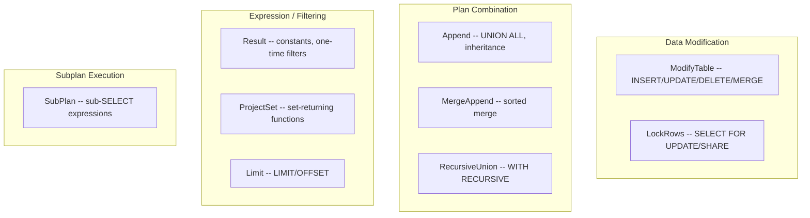
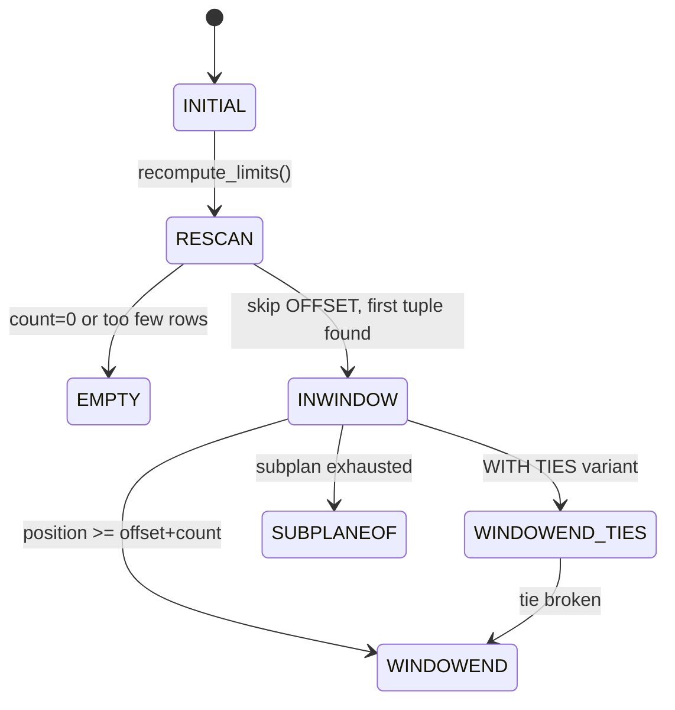

# Chapter 18: Node Catalog -- ModifyTable, LockRows, and Control/Utility Nodes

**PostgreSQL 17 Executor Documentation**

---

**Navigation**: [Chapter 17: Node Catalog -- Sort, Aggregate, and Grouping Nodes](17_node_catalog_sort_aggregate.md) | **Chapter 18** | [Chapter 19: Node Catalog -- Parallel Execution Nodes](19_node_catalog_parallel.md)

**Prerequisites**: [Chapter 08: ExecScan and Qual Evaluation](08_execscan_qual.md) -- ExecQual used for constant qualifications in Result; [Chapter 12: EvalPlanQual](12_evplanqual.md) -- EPQ mechanism used by ModifyTable and LockRows for concurrent update handling; [Chapter 11: Memory Management](11_memory_management.md) -- per-tuple context management in ModifyTable.

---

## Overview

This chapter catalogs nine node types that handle data modification, row locking, plan combination, expression evaluation, recursion, row limiting, and subplan execution. These nodes form the control and utility layer of the executor.



---

## Table of Contents

1. [ModifyTable](#modifytable)
2. [LockRows](#lockrows)
3. [Result](#result)
4. [ProjectSet](#projectset)
5. [Append](#append)
6. [MergeAppend](#mergeappend)
7. [RecursiveUnion](#recursiveunion)
8. [Limit](#limit)
9. [SubPlan](#subplan)

---

## ModifyTable

**Identity**
- NodeTag: `T_ModifyTable` / `T_ModifyTableState`
- Plan struct: `ModifyTable` (`src/include/nodes/plannodes.h`)
- PlanState struct: `ModifyTableState` (`src/include/nodes/execnodes.h`)
- Source: `src/backend/executor/nodeModifyTable.c`

**Purpose**: Executes all data modification statements: INSERT, UPDATE, DELETE, and MERGE. The only executor node that writes to heap tables. Handles partition routing, ON CONFLICT (UPSERT), cross-partition UPDATE, trigger execution, RETURNING clauses, and foreign table modifications via FDW callbacks.

### Initialization (`ExecInitModifyTable`)

```c
/* src/backend/executor/nodeModifyTable.c:4422 */
ModifyTableState *
ExecInitModifyTable(ModifyTable *node, EState *estate, int eflags)
```

1. Creates `ModifyTableState`, sets `operation` (CMD_INSERT/UPDATE/DELETE/MERGE).
2. Initializes `resultRelInfo[]` for all target relations.
3. Sets up EPQ state for concurrent-update rechecking (see Chapter 12).
4. Sets up transition capture for AFTER statement triggers.
5. Opens each result relation, initializes FDW callbacks for foreign tables.
6. For UPDATE/DELETE/MERGE: locates the junk `ctid` or `wholerow` attribute for row identification.
7. For INSERT into partitioned tables: calls `ExecSetupPartitionTupleRouting()`.
8. For ON CONFLICT: creates `OnConflictSetState`.
9. For MERGE: calls `ExecInitMerge()`.

### Execution (`ExecModifyTable`)

```c
/* src/backend/executor/nodeModifyTable.c:3945 */
static TupleTableSlot *
ExecModifyTable(PlanState *pstate)
```

Main loop fetches rows from the subplan one at a time and dispatches:
- `CMD_INSERT` -> `ExecInsert()` (with partition routing, constraint checking, speculative insertion for UPSERT)
- `CMD_UPDATE` -> `ExecUpdate()` (with cross-partition UPDATE detection)
- `CMD_DELETE` -> `ExecDelete()`
- `CMD_MERGE` -> `ExecMerge()` (dispatches to matched/not-matched actions)

**Trigger execution ordering** per DML operation:
```
BEFORE STATEMENT  (once, on first call)
  for each row:
    BEFORE ROW    (can modify/suppress the tuple)
    [actual table modification]
    AFTER ROW     (sees the committed change)
AFTER STATEMENT   (once, when subplan exhausted)
```

**Partition routing**: `ExecPrepareTupleRouting()` evaluates the partition key, walks the hierarchy, opens the target leaf partition on demand.

**Cross-partition UPDATE**: When an UPDATE changes the partition key, `ExecCrossPartitionUpdate()` deletes from the old partition and inserts into the new one.

**ON CONFLICT (UPSERT)**: Pre-checks index constraints, performs speculative insertion, retries on conflict with either DO UPDATE or DO NOTHING.

### End (`ExecEndModifyTable`)

Calls `EndForeignModify` for FDW relations, cleans up batch slots, closes partition relations, terminates EPQ state, shuts down subplan.

### Rescan

ModifyTable does **not** support rescan. Always the topmost node for DML statements.

### Key State Fields

| Field | Type | Description |
|-------|------|-------------|
| `operation` | `CmdType` | CMD_INSERT/UPDATE/DELETE/MERGE |
| `mt_done` | `bool` | True after all rows processed |
| `mt_nrels` | `int` | Number of target relations |
| `resultRelInfo` | `ResultRelInfo *` | Per-target-relation metadata |
| `rootResultRelInfo` | `ResultRelInfo *` | Root partitioned table's info |
| `mt_epqstate` | `EPQState` | EvalPlanQual state |
| `mt_partition_tuple_routing` | `PartitionTupleRouting *` | Partition routing state |

### Performance

- O(N) where N = rows from subplan. Each row: one heap modification plus index updates.
- Heavy write I/O. Each INSERT generates WAL.
- Trigger overhead: each row-level trigger involves SPI context setup/teardown.

### Parallel Support

Neither parallel-aware nor parallel-safe. Table modifications cannot be safely parallelized.

---

## LockRows

**Identity**
- NodeTag: `T_LockRows` / `T_LockRowsState`
- Plan struct: `LockRows` (`src/include/nodes/plannodes.h`)
- PlanState struct: `LockRowsState` (`src/include/nodes/execnodes.h`)
- Source: `src/backend/executor/nodeLockRows.c`

**Purpose**: Implements row-level locking for SELECT FOR UPDATE/NO KEY UPDATE/SHARE/KEY SHARE. Sits above scan/join nodes and below Sort/Limit, acquiring the specified lock on each row before returning it. Rows concurrently modified are rechecked via the EPQ mechanism (see Chapter 12).

### Initialization (`ExecInitLockRows`)

```c
/* src/backend/executor/nodeLockRows.c:290 */
LockRowsState *
ExecInitLockRows(LockRows *node, EState *estate, int eflags)
```

Iterates over `PlanRowMark` entries: locking marks go into `lr_arowMarks`, non-locking marks go to EPQ. Initializes EPQ state.

### Execution (`ExecLockRows`)

```c
/* src/backend/executor/nodeLockRows.c:37 */
static TupleTableSlot *
ExecLockRows(PlanState *pstate)
```

For each tuple from the outer plan:
1. For each row mark: extract `ctid`, determine lock mode, call `table_tuple_lock()`.
2. Handle results: TM_Ok (proceed), TM_WouldBlock (SKIP LOCKED), TM_SelfModified (skip), TM_Updated/TM_Deleted (serialization error or skip).
3. If any row mark traversed to a newer version, run EPQ recheck.
4. Return the locked tuple.

### End (`ExecEndLockRows`)

Shuts down EPQ state and ends outer plan.

### Rescan (`ExecReScanLockRows`)

Delegates rescan to outer plan.

### Key State Fields

| Field | Type | Description |
|-------|------|-------------|
| `lr_arowMarks` | `List *` | List of `ExecAuxRowMark` for locking |
| `lr_epqstate` | `EPQState` | EvalPlanQual state |

### Performance

- Each lock acquisition is O(1) but may block on concurrent lock holders.
- EPQ overhead when rows are concurrently updated.

### Parallel Support

Not parallel-safe. Row locking requires process-local state.

---

## Result

**Identity**
- NodeTag: `T_Result` / `T_ResultState`
- Plan struct: `Result` (`src/include/nodes/plannodes.h`)
- PlanState struct: `ResultState` (`src/include/nodes/execnodes.h`)
- Source: `src/backend/executor/nodeResult.c`

**Purpose**: Used in queries requiring no table scan or having constant qualifications (one-time filters). Common scenarios: `SELECT 1 + 2` (no FROM), `INSERT INTO t VALUES (...)`, `SELECT * FROM t WHERE false` (constant-false filter), projection-only nodes.

### Initialization (`ExecInitResult`)

```c
/* src/backend/executor/nodeResult.c:179 */
ResultState *
ExecInitResult(Result *node, EState *estate, int eflags)
```

Sets `rs_done = false`, `rs_checkqual = (resconstantqual != NULL)`. Initializes optional outer plan child (may be NULL for constant-generating Results).

### Execution (`ExecResult`)

1. If `rs_checkqual` is true (first call), evaluates constant qualification. If false, sets `rs_done = true` and returns NULL ("One-Time Filter" in EXPLAIN).
2. If outer plan exists, fetches next tuple. If no outer plan, sets `rs_done = true` after one tuple.
3. Applies projection and returns.

### End (`ExecEndResult`)

Shuts down outer plan subnode.

### Rescan (`ExecReScanResult`)

Resets `rs_done` and `rs_checkqual` flags.

### Key State Fields

| Field | Type | Description |
|-------|------|-------------|
| `rs_done` | `bool` | True after constant tuple returned or qual failed |
| `rs_checkqual` | `bool` | True if constant qual needs evaluation |
| `resconstantqual` | `ExprState *` | Compiled one-time filter expression |

### Performance

- O(N) for outer plan tuples; O(1) for constant-generating Results.

### Parallel Support

Parallel-safe.

---

## ProjectSet

**Identity**
- NodeTag: `T_ProjectSet` / `T_ProjectSetState`
- Plan struct: `ProjectSet` (`src/include/nodes/plannodes.h`)
- PlanState struct: `ProjectSetState` (`src/include/nodes/execnodes.h`)
- Source: `src/backend/executor/nodeProjectSet.c`

**Purpose**: Evaluates set-returning functions (SRFs) in the target list. SRFs appear only at the top level (never nested). If multiple SRFs return different numbers of rows, shorter ones are padded with NULLs until the longest is exhausted.

### Initialization (`ExecInitProjectSet`)

```c
/* src/backend/executor/nodeProjectSet.c:226 */
ProjectSetState *
ExecInitProjectSet(ProjectSet *node, EState *estate, int eflags)
```

Allocates `elems[]` and `elemdone[]` arrays. For each target list entry, initializes either `SetExprState` (SRFs) or regular `ExprState`.

### Execution (`ExecProjectSet`)

1. If `pending_srf_tuples` is true, continues producing rows from previous input tuple.
2. Fetches next input tuple from outer plan.
3. Calls `ExecProjectSRF()` to evaluate SRFs. Exhausted SRFs return NULL while others continue.
4. When ALL SRFs return `ExprEndResult`, the input tuple is consumed.

### End (`ExecEndProjectSet`)

Shuts down outer plan.

### Rescan (`ExecReScanProjectSet`)

Resets `pending_srf_tuples`.

### Key State Fields

| Field | Type | Description |
|-------|------|-------------|
| `pending_srf_tuples` | `bool` | True when more rows pending from current input |
| `nelems` | `int` | Number of target list entries |
| `elems` | `Node **` | Array of ExprState/SetExprState per entry |
| `elemdone` | `ExprDoneCond *` | Per-element done status |

### Performance

- O(N * R) where N is input rows and R is average SRF result rows.

### Parallel Support

Parallel-safe.

---

## Append

**Identity**
- NodeTag: `T_Append` / `T_AppendState`
- Plan struct: `Append` (`src/include/nodes/plannodes.h`)
- PlanState struct: `AppendState` (`src/include/nodes/execnodes.h`)
- Source: `src/backend/executor/nodeAppend.c`

**Purpose**: Concatenates results from multiple subplans. Used for UNION ALL, inheritance/partitioned table scans. Supports three modes: local sequential, parallel-aware, and asynchronous (for FDW subplans).

### Initialization (`ExecInitAppend`)

```c
/* src/backend/executor/nodeAppend.c:108 */
AppendState *
ExecInitAppend(Append *node, EState *estate, int eflags)
```

If runtime partition pruning is enabled, calls `ExecInitPartitionPruning()` to determine which subplans to initialize. Identifies async-capable subplans. Sets `choose_next_subplan` function pointer.

### Execution (`ExecAppend`)

Iterates subplans: executes current subplan, returns tuples. When a subplan is exhausted, advances via `choose_next_subplan()`. For async subplans, interleaves with `ExecAppendAsyncGetNext()`.

### Parallel Append Support

Uses `ParallelAppendState` in shared memory with an LWLock. Workers pick subplans under the lock. Non-partial plans assigned to exactly one worker; partial plans shared across workers.

### End (`ExecEndAppend`)

Calls `ExecEndNode()` on each subplan.

### Rescan (`ExecReScanAppend`)

Resets state. If runtime pruning parameters changed, invalidates `as_valid_subplans`.

### Key State Fields

| Field | Type | Description |
|-------|------|-------------|
| `as_whichplan` | `int` | Index of currently executing subplan |
| `as_nplans` | `int` | Total number of initialized subplans |
| `appendplans` | `PlanState **` | Array of subplan states |
| `as_prune_state` | `PartitionPruneState *` | Runtime pruning state |
| `as_valid_subplans` | `Bitmapset *` | Currently valid subplan indices |
| `choose_next_subplan` | `function pointer` | Strategy for subplan selection |

### Performance

- O(sum of all subplan outputs). Runtime pruning dramatically reduces the number of subplans.

### Parallel Support

**Parallel-aware**. Coordinates subplan assignment across workers using shared memory and LWLock.

---

## MergeAppend

**Identity**
- NodeTag: `T_MergeAppend` / `T_MergeAppendState`
- Plan struct: `MergeAppend` (`src/include/nodes/plannodes.h`)
- PlanState struct: `MergeAppendState` (`src/include/nodes/execnodes.h`)
- Source: `src/backend/executor/nodeMergeAppend.c`

**Purpose**: Like Append but preserves sort order across subplans. Each subplan produces pre-sorted output; MergeAppend merges them using a binary heap for globally sorted output. Used for sorted scans over partitioned tables and UNION ALL with ORDER BY.

### Initialization (`ExecInitMergeAppend`)

```c
/* src/backend/executor/nodeMergeAppend.c:64 */
MergeAppendState *
ExecInitMergeAppend(MergeAppend *node, EState *estate, int eflags)
```

Handles runtime partition pruning. Allocates `ms_slots[]` and binary heap via `binaryheap_allocate()`. Initializes `SortSupportData` for each sort key.

### Execution (`ExecMergeAppend`)

1. On first call: pulls one tuple from each subplan, builds the heap.
2. On subsequent calls: fetches next tuple from the top-of-heap subplan. If it produces a tuple, `binaryheap_replace_first()`. If exhausted, `binaryheap_remove_first()`.
3. Returns the tuple at the top of the heap.

### End (`ExecEndMergeAppend`)

Calls `ExecEndNode()` on each subplan.

### Rescan (`ExecReScanMergeAppend`)

Invalidates pruning if parameters changed, rescans subplans, resets heap.

### Key State Fields

| Field | Type | Description |
|-------|------|-------------|
| `ms_nplans` | `int` | Number of merge subplans |
| `ms_slots` | `TupleTableSlot **` | Current tuple from each subplan |
| `ms_heap` | `binaryheap *` | Min-heap of subplan indices |
| `ms_nkeys` | `int` | Number of sort key columns |
| `ms_sortkeys` | `SortSupport` | Sort key comparison data |
| `ms_initialized` | `bool` | Whether first-tuple fetch is done |

### Performance

- O(N * log K) where N = total tuples, K = number of subplans.

### Parallel Support

Not parallel-aware (unlike Append).

---

## RecursiveUnion

**Identity**
- NodeTag: `T_RecursiveUnion` / `T_RecursiveUnionState`
- Plan struct: `RecursiveUnion` (`src/include/nodes/plannodes.h`)
- PlanState struct: `RecursiveUnionState` (`src/include/nodes/execnodes.h`)
- Source: `src/backend/executor/nodeRecursiveunion.c`

**Purpose**: Implements recursive common table expressions (WITH RECURSIVE). The outer plan is the non-recursive (base) term; the inner plan is the recursive term. Uses two tuplestores: a working table (current iteration's input) and an intermediate table (current iteration's output). For UNION (not UNION ALL), a hash table deduplicates results.

### Initialization (`ExecInitRecursiveUnion`)

```c
/* src/backend/executor/nodeRecursiveunion.c:166 */
RecursiveUnionState *
ExecInitRecursiveUnion(RecursiveUnion *node, EState *estate, int eflags)
```

Creates empty working_table and intermediate_table tuplestores. If UNION (not ALL), builds a deduplication hash table. Stores a pointer to itself in the Param slot (`wtParam`) so WorkTableScan nodes (see Chapter 15) can access the working table.

### Execution (`ExecRecursiveUnion`)

**Phase 1 -- Non-recursive term** (`recursing == false`):
Fetches tuples from outer plan, stores in working table AND returns to caller. When outer exhausted, sets `recursing = true`.

**Phase 2 -- Recursive term** (`recursing == true`):
Fetches from inner plan (which reads from working table via WorkTableScan). When inner exhausted: if intermediate table is empty, recursion is done. Otherwise, swaps: `working_table = intermediate_table`, creates new empty intermediate, signals inner plan to rescan.

### End (`ExecEndRecursiveUnion`)

Releases both tuplestores and hash table.

### Rescan (`ExecReScanRecursiveUnion`)

Resets `recursing = false`, clears both tuplestores and hash table.

### Key State Fields

| Field | Type | Description |
|-------|------|-------------|
| `recursing` | `bool` | True when evaluating recursive term |
| `working_table` | `Tuplestorestate *` | Input to current iteration |
| `intermediate_table` | `Tuplestorestate *` | Output of current iteration |
| `intermediate_empty` | `bool` | True if no tuples written to intermediate |
| `hashtable` | `TupleHashTable` | Dedup hash table (NULL for UNION ALL) |

### Performance

- O(T * H) where T = total tuples across all iterations, H = hash lookup cost.
- No automatic cycle detection; infinite recursion runs until resource limits.

### Parallel Support

Not parallel-safe. The iterative working-table swap is inherently sequential.

---

## Limit

**Identity**
- NodeTag: `T_Limit` / `T_LimitState`
- Plan struct: `Limit` (`src/include/nodes/plannodes.h`)
- PlanState struct: `LimitState` (`src/include/nodes/execnodes.h`)
- Source: `src/backend/executor/nodeLimit.c`

**Purpose**: Implements LIMIT and OFFSET clauses, including FETCH FIRST ... WITH TIES. Uses a state machine to track position within the result window.

### Initialization (`ExecInitLimit`)

```c
/* src/backend/executor/nodeLimit.c:446 */
LimitState *
ExecInitLimit(Limit *node, EState *estate, int eflags)
```

Sets `lstate = LIMIT_INITIAL`. Compiles limitOffset and limitCount expressions. For WITH TIES, initializes `last_slot` and `eqfunction`.

### Execution (`ExecLimit`)

State machine:



| State | Meaning |
|-------|---------|
| LIMIT_INITIAL | Not yet evaluated LIMIT/OFFSET expressions |
| LIMIT_RESCAN | Skipping OFFSET rows |
| LIMIT_EMPTY | Count is 0 or subplan returned too few rows |
| LIMIT_INWINDOW | Returning rows within the LIMIT window |
| LIMIT_WINDOWEND | Past the end of the window |
| LIMIT_WINDOWEND_TIES | At end, checking for ties |
| LIMIT_SUBPLANEOF | Subplan exhausted before window end |

Key: `recompute_limits()` evaluates expressions and propagates tuple bound to child nodes via `ExecSetTupleBound()` (enables Sort to use top-N heapsort).

### End (`ExecEndLimit`)

Ends outer plan.

### Rescan (`ExecReScanLimit`)

Re-evaluates expressions, rescans outer plan.

### Key State Fields

| Field | Type | Description |
|-------|------|-------------|
| `lstate` | `LimitStateCond` | Current state machine state |
| `offset` | `int64` | Evaluated OFFSET value |
| `count` | `int64` | Evaluated LIMIT value |
| `noCount` | `bool` | True if no LIMIT (unlimited) |
| `position` | `int64` | Current position in result stream |
| `limitOption` | `LimitOption` | COUNT or WITH_TIES |
| `eqfunction` | `ExprState *` | Tie-detection equality function |

### Performance

- O(OFFSET + COUNT) tuples fetched. Remaining tuples never fetched.
- `ExecSetTupleBound()` propagates limits to child nodes.

### Parallel Support

Not parallel-safe (position tracking is process-local). However, limits can propagate to parallel-aware children.

---

## SubPlan

**Identity**
- NodeTag: `T_SubPlan` / `T_SubPlanState`
- Plan struct: `SubPlan` (`src/include/nodes/primnodes.h`)
- PlanState struct: `SubPlanState` (`src/include/nodes/execnodes.h`)
- Source: `src/backend/executor/nodeSubplan.c`

**Purpose**: Executes sub-SELECT expressions in WHERE clauses, target lists, or HAVING clauses. Not a standard plan node dispatched through `ExecProcNode` -- evaluated as an expression node. Handles EXISTS, ANY/IN, ALL, EXPR (scalar), ARRAY, and CTE sublinks. Divided into InitPlans (executed once) and regular SubPlans (re-executed per outer row).

### Initialization (`ExecInitSubPlan`)

```c
/* src/backend/executor/nodeSubplan.c:822 */
SubPlanState *
ExecInitSubPlan(SubPlan *subplan, PlanState *parent)
```

Links to the already-initialized subplan via `es_subplanstates`. For InitPlans, marks output parameters for lazy evaluation. For hash-based evaluation (`useHashTable`), creates hash contexts and builds projection nodes.

### Execution (`ExecSubPlan`)

Two strategies:

**Hash strategy** (`ExecHashSubPlan`): On first call, scans entire subquery into a hash table. Per outer row, probes the table. Returns TRUE/FALSE/NULL per SQL semantics.

**Scan strategy** (`ExecScanSubPlan`): Sets correlated parameters, rescans the subplan, iterates:
- EXISTS: TRUE on first tuple, FALSE on none.
- EXPR: Returns first column of single tuple.
- ANY: OR-combines per-row expression results.
- ALL: AND-combines per-row expression results.
- ARRAY: Collects all values into an array.

### InitPlan Lazy Evaluation (`ExecSetParamPlan`)

Called when an InitPlan's output parameter is first referenced. Runs the subplan once and stores results.

### Key State Fields

| Field | Type | Description |
|-------|------|-------------|
| `planstate` | `PlanState *` | Initialized plan tree for the subquery |
| `testexpr` | `ExprState *` | Compiled combining expression (ANY/ALL) |
| `hashtable` | `TupleHashTable` | Hash table for hash-based evaluation |
| `hashnulls` | `TupleHashTable` | Separate table for partially-NULL rows |

### Performance

- Hash strategy: O(S) build + O(1) per probe. Best for uncorrelated subplans.
- Scan strategy: O(N * S) worst case.
- InitPlans: O(S) total, executed at most once.

### Parallel Support

Not parallel-safe when correlated. InitPlans execute in the leader with results shared via parameters.

---

## Summary Table

| NodeTag | Plan Struct | PlanState Struct | Source File | Init / Exec / End |
|---------|------------|-----------------|-------------|-------------------|
| `T_ModifyTable` | `ModifyTable` | `ModifyTableState` | `nodeModifyTable.c` | `ExecInitModifyTable` / `ExecModifyTable` / `ExecEndModifyTable` |
| `T_LockRows` | `LockRows` | `LockRowsState` | `nodeLockRows.c` | `ExecInitLockRows` / `ExecLockRows` / `ExecEndLockRows` |
| `T_Result` | `Result` | `ResultState` | `nodeResult.c` | `ExecInitResult` / `ExecResult` / `ExecEndResult` |
| `T_ProjectSet` | `ProjectSet` | `ProjectSetState` | `nodeProjectSet.c` | `ExecInitProjectSet` / `ExecProjectSet` / `ExecEndProjectSet` |
| `T_Append` | `Append` | `AppendState` | `nodeAppend.c` | `ExecInitAppend` / `ExecAppend` / `ExecEndAppend` |
| `T_MergeAppend` | `MergeAppend` | `MergeAppendState` | `nodeMergeAppend.c` | `ExecInitMergeAppend` / `ExecMergeAppend` / `ExecEndMergeAppend` |
| `T_RecursiveUnion` | `RecursiveUnion` | `RecursiveUnionState` | `nodeRecursiveunion.c` | `ExecInitRecursiveUnion` / `ExecRecursiveUnion` / `ExecEndRecursiveUnion` |
| `T_Limit` | `Limit` | `LimitState` | `nodeLimit.c` | `ExecInitLimit` / `ExecLimit` / `ExecEndLimit` |
| `T_SubPlan` | `SubPlan` | `SubPlanState` | `nodeSubplan.c` | `ExecInitSubPlan` / `ExecSubPlan` / `ExecEndSubPlan` |
