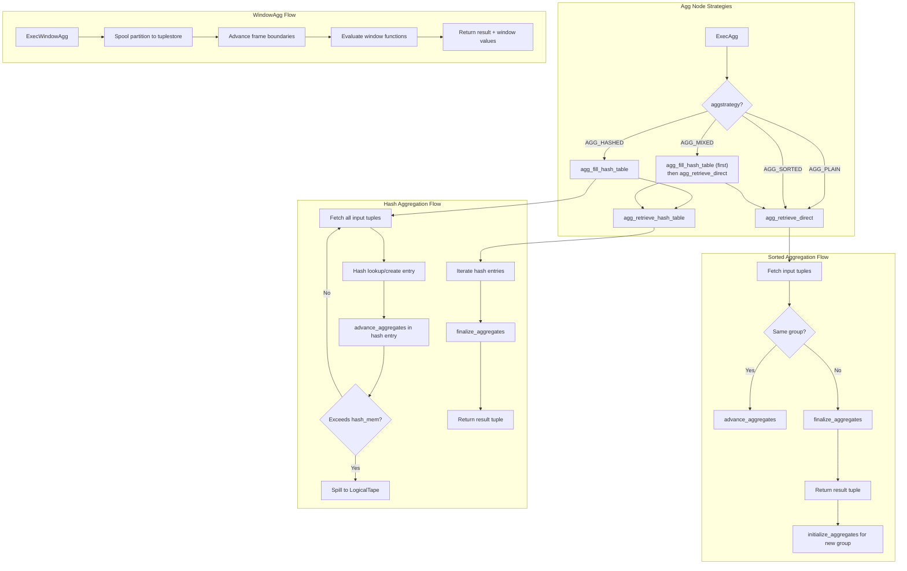
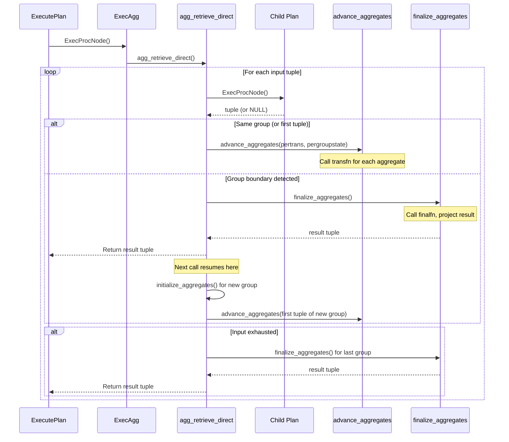
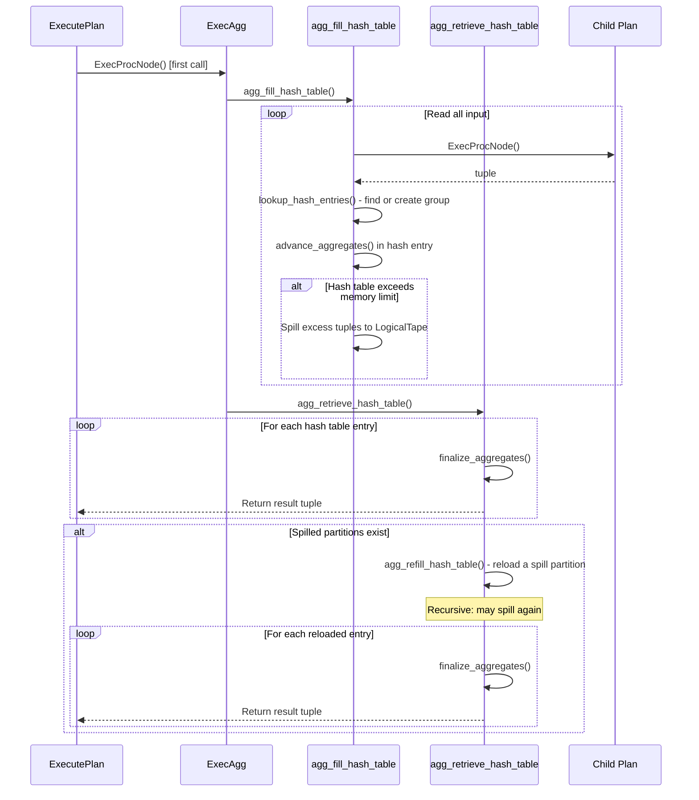
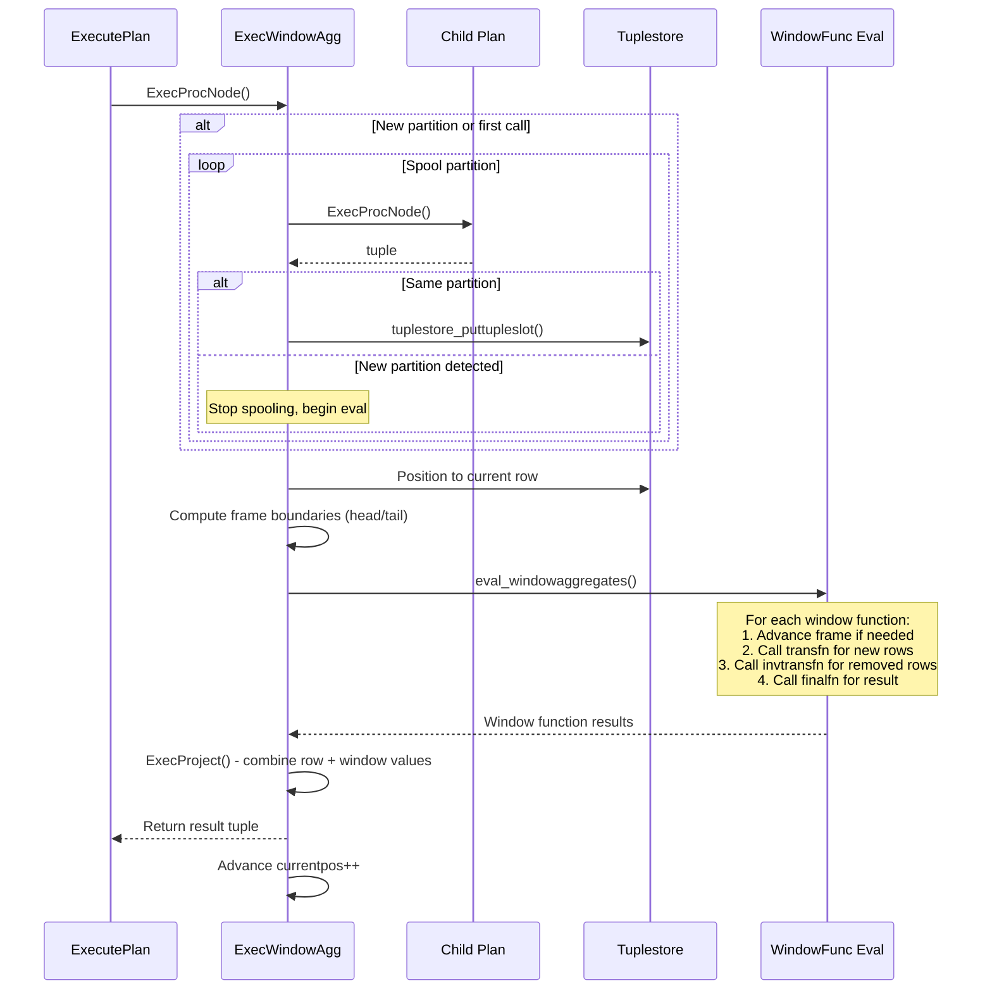

# Aggregation and Grouping

## Overview

The PostgreSQL executor implements aggregation, grouping, and window function evaluation through three primary node types: `Agg` (aggregation with four strategies), `Group` (simple pre-sorted grouping), and `WindowAgg` (window function evaluation). The `Agg` node is the most complex, supporting plain aggregation (no grouping), sorted aggregation, hash aggregation, and mixed-mode aggregation (for GROUPING SETS). Hash aggregation includes a sophisticated spill-to-disk mechanism that allows processing datasets exceeding `work_mem`.

The `WindowAgg` node evaluates window functions using a tuplestore-based approach where the entire partition is buffered, enabling random access to arbitrary rows within the window frame. Window functions support three frame modes (ROWS, RANGE, GROUPS) and handle both forward-scan optimized and general evaluation strategies.

## Key Concepts

- **Aggregation Strategies**: Four strategies for the Agg node: `AGG_PLAIN` (no grouping, single result), `AGG_SORTED` (pre-sorted input, sequential group detection), `AGG_HASHED` (hash table based grouping), `AGG_MIXED` (combines sorted and hashed for GROUPING SETS).
- **AggState Phases**: For GROUPING SETS, multiple "phases" are executed in sequence. Each phase may use sorted or hashed aggregation for different grouping set combinations.
- **Transition Functions**: Each aggregate has a transition function (`transfn`) that accumulates state, and a final function (`finalfn`) that produces the result.
- **Per-Agg vs Per-Trans**: The executor separates per-aggregate state (`AggStatePerAggData`) from per-transition state (`AggStatePerTransData`) because multiple aggregates can share the same transition function (e.g., `avg` and `count` both need a count accumulator).
- **Hash Aggregation Spill**: When hash tables exceed `hash_mem_threshold`, tuples are spilled to tape (via LogicalTape), and later reprocessed in a recursive manner.
- **Window Frames**: Each window function operates over a frame defined by ROWS, RANGE, or GROUPS mode with start/end boundaries. The frame can be UNBOUNDED PRECEDING, N PRECEDING, CURRENT ROW, N FOLLOWING, or UNBOUNDED FOLLOWING.

## Architecture



## Core APIs

### ExecAgg

#### Purpose

Top-level execution function for the Agg node. Dispatches to the appropriate aggregation strategy based on `aggstrategy`.

#### Signature

```c
/* src/backend/executor/nodeAgg.c:2144-2188 */
static TupleTableSlot *
ExecAgg(PlanState *pstate)
```

#### Parameters

| Parameter | Type | Description | Constraints |
|-----------|------|-------------|-------------|
| pstate | PlanState * | Cast to AggState internally | Required, non-NULL |

#### Return Value

Returns the next aggregate result tuple, or NULL when all groups have been returned.

#### Detailed Description

The function checks the aggregation strategy and dispatches accordingly:

```c
/* src/backend/executor/nodeAgg.c:2144-2188 */
if (!node->agg_done)
{
    /* Dispatch based on strategy */
    switch (node->phase->aggstrategy)
    {
        case AGG_HASHED:
            if (!node->table_filled)
                agg_fill_hash_table(node);
            /* fall through to retrieve */
        case AGG_MIXED:
            if (!node->table_filled)
                agg_fill_hash_table(node);
            result = agg_retrieve_hash_table(node);
            break;
        case AGG_PLAIN:
        case AGG_SORTED:
            result = agg_retrieve_direct(node);
            break;
    }
}
```

For `AGG_HASHED` and `AGG_MIXED`, the hash table is populated on the first call via `agg_fill_hash_table()`, then result tuples are retrieved from the hash table via `agg_retrieve_hash_table()`. For `AGG_MIXED`, after the hash phase completes, execution falls through to `agg_retrieve_direct()` for the sorted phases.

For `AGG_PLAIN` and `AGG_SORTED`, `agg_retrieve_direct()` processes input tuples sequentially, detecting group boundaries via key comparison.

---

### agg_retrieve_direct

#### Purpose

Implements sorted and plain (no grouping) aggregation. Reads input tuples sequentially, accumulates aggregate transition values, detects group boundaries, and returns finalized results.

#### Signature

```c
/* src/backend/executor/nodeAgg.c:2190-2534 */
static TupleTableSlot *
agg_retrieve_direct(AggState *aggstate)
```

#### Detailed Description

The function processes tuples in a loop with the following key steps:

1. **Group boundary detection**: For `AGG_SORTED`, compares the current tuple's grouping keys against the previous tuple using `execTuplesMatch()`. When keys differ, a group boundary is detected.

2. **Transition value accumulation**: For each input tuple, calls `advance_aggregates()` which invokes each aggregate's transition function to update the running aggregate state.

3. **Group finalization**: When a group boundary is detected (or input is exhausted):
   - Calls `finalize_aggregates()` to invoke each aggregate's final function
   - Projects the result tuple containing group keys and aggregate results
   - Initializes transition values for the next group

4. **GROUPING SETS phase transitions**: For `AGG_MIXED` mode, multiple phases are processed sequentially. When the sorted phase for one grouping set completes, `aggstate->phase` advances to the next phase. Each phase may aggregate on different grouping key combinations.

5. **AGG_PLAIN special case**: With no grouping keys, exactly one result tuple is produced from all input tuples. The function reads all input, finalizes once, and returns the single result.

Key code for group boundary detection:

```c
/* Simplified from nodeAgg.c:2370-2420 */
if (aggstate->phase->aggstrategy == AGG_SORTED)
{
    if (aggstate->grp_firstTuple != NULL)
    {
        /* Compare current tuple with saved first tuple of current group */
        tmpcontext->ecxt_outertuple = firstSlot;
        tmpcontext->ecxt_innertuple = outerslot;

        if (!ExecQualAndReset(aggstate->phase->eqfunctions, tmpcontext))
        {
            /* Group boundary detected */
            prepare_projection_slot(aggstate, ...);
            finalize_aggregates(aggstate, ...);
            result = project_aggregates(aggstate);
            if (result)
                return result;
        }
    }
}
```

#### Integration Points

- **Called by**: ExecAgg
- **Calls**: ExecProcNode (child plan), advance_aggregates, finalize_aggregates, project_aggregates, ExecQualAndReset (for group comparison)

---

### agg_fill_hash_table

#### Purpose

Populates the hash table(s) for hash aggregation by reading all input tuples, looking up or creating hash entries, and advancing transition values.

#### Signature

```c
/* src/backend/executor/nodeAgg.c:2536-2579 */
static void
agg_fill_hash_table(AggState *aggstate)
```

#### Detailed Description

The function reads all tuples from the child plan in a single pass:

1. For each input tuple, calls `lookup_hash_entries()` which:
   - Computes the hash value from the grouping keys
   - Looks up the entry in the hash table, creating a new entry if not found
   - For GROUPING SETS, processes multiple hash tables (one per grouping set)

2. Calls `advance_aggregates()` to update the transition values in the hash entry.

3. **Memory management**: After each tuple, checks whether hash memory usage exceeds the threshold. If it does, calls `hash_agg_check_limits()` which may trigger spilling -- writing excess tuples to `LogicalTape`s organized by hash value partition. Spilled tuples are later reprocessed via `agg_refill_hash_table()`.

4. After all input is consumed, sets `aggstate->table_filled = true`.

The hash table uses `TupleHashTable` internally, which is implemented as a simplehash table mapping grouping key tuples to aggregate state entries.

---

### agg_retrieve_hash_table

#### Purpose

Iterates over the populated hash table and returns finalized aggregate results, one group at a time.

#### Signature

```c
/* src/backend/executor/nodeAgg.c:2738-2764 */
static TupleTableSlot *
agg_retrieve_hash_table(AggState *aggstate)
```

#### Detailed Description

Iterates through hash table entries using `TupleHashTableNext()`. For each entry:

1. Extracts the stored grouping key values
2. Calls `finalize_aggregates()` to compute the final aggregate values
3. Projects the result tuple

When the hash table is exhausted, if there are spilled partitions, calls `agg_refill_hash_table()` to load a spilled partition back into the hash table and continues iteration. This recursive spill/refill process handles datasets much larger than `work_mem`.

---

### ExecInitAgg

#### Purpose

Initializes the Agg node state, including phase setup for GROUPING SETS, hash table allocation, per-aggregate and per-transition state initialization.

#### Signature

```c
/* src/backend/executor/nodeAgg.c:3164-4025 */
AggState *
ExecInitAgg(Agg *node, EState *estate, int eflags)
```

#### Detailed Description

This is one of the most complex initialization functions in the executor (approximately 860 lines). Key steps include:

1. **Strategy determination**: Sets the aggregation strategy (`AGG_PLAIN`, `AGG_SORTED`, `AGG_HASHED`, `AGG_MIXED`) from the plan node.

2. **Phase initialization**: For GROUPING SETS, creates an `AggStatePerPhaseData` array. Each phase corresponds to a set of grouping columns processed together. Sorted phases share the same input sort order; hashed phases use separate hash tables.

3. **Per-aggregate initialization**: For each aggregate function call in the target list or HAVING clause:
   - Resolves the aggregate function OID
   - Looks up the transition function, final function, combine function, serialization/deserialization functions
   - Allocates `AggStatePerAggData` with function call info
   - Sets up the transition value type and initial value

4. **Per-transition deduplication**: Multiple aggregates can share transition state if they have the same transition function, input expressions, and sort specification. This optimization reduces the number of transition function calls.

5. **Hash table creation**: For `AGG_HASHED` and `AGG_MIXED`, allocates one `TupleHashTable` per grouping set. Computes the memory limit based on `hash_mem_multiplier * work_mem`.

6. **Expression compilation**: Compiles aggregate input expressions, filter expressions, and sort expressions via `ExecInitExpr`.

---

### ExecWindowAgg

#### Purpose

Evaluates window functions over partitioned, ordered input. Uses a tuplestore to buffer the entire current partition, enabling random access for frame boundary computation.

#### Signature

```c
/* src/backend/executor/nodeWindowAgg.c:2036-2364 */
static TupleTableSlot *
ExecWindowAgg(PlanState *pstate)
```

#### Parameters

| Parameter | Type | Description | Constraints |
|-----------|------|-------------|-------------|
| pstate | PlanState * | Cast to WindowAggState internally | Required, non-NULL |

#### Return Value

Returns the next result tuple with window function values appended, or NULL when all tuples have been returned.

#### Detailed Description

The WindowAgg node operates in a fundamentally different way from Agg -- rather than collapsing groups into single result rows, it returns every input row with additional computed window function columns. The core algorithm:

1. **Partition detection and spooling** (lines 2070-2150): Reads tuples from the child plan and buffers them into a `Tuplestore`. Detects partition boundaries by comparing partition key columns. When a new partition starts, the tuplestore is rewound and processing begins.

2. **Frame boundary computation** (lines 2155-2220): For each row, computes the window frame boundaries based on the frame mode:
   - **ROWS**: Frame boundaries are row offsets (e.g., "3 PRECEDING" means 3 rows back)
   - **RANGE**: Frame boundaries are value-based (e.g., "INTERVAL '1 day' PRECEDING" means all rows within 1 day)
   - **GROUPS**: Frame boundaries are based on peer groups (rows with identical ORDER BY values)

3. **Window function evaluation** (lines 2225-2310): For each row in the current partition:
   - Positions the tuplestore to the current row
   - Evaluates each window function:
     - **Aggregate-based window functions** (e.g., `SUM() OVER`): Uses the aggregate transition/final function mechanism, with frame-aware accumulation
     - **Built-in window functions** (e.g., `row_number()`, `rank()`, `lead()`/`lag()`): Evaluated directly using the WindowObject API
   - Projects the result tuple combining the original row with window function values

4. **Run condition optimization** (lines 2315-2360): When a "run condition" is present (e.g., `row_number() <= 10`), the WindowAgg can enter pass-through mode after the condition becomes false, either filtering remaining rows or forwarding them without window evaluation.

**Frame Management Optimization:**

For aggregate-based window functions, the executor uses an optimized incremental approach:
- When the frame advances forward, only new rows entering the frame are processed (not the entire frame from scratch)
- The `invtransfn` (inverse transition function) is used to efficiently remove rows that leave the frame from the running aggregate state
- If no inverse transition function exists, the aggregate must be recomputed from scratch for each row

#### Integration Points

- **Called by**: ExecProcNode via function pointer
- **Calls**: ExecProcNode (child plan), spool_tuples, eval_windowaggregates, eval_windowfunction, ExecProject
- **Shared state**: Tuplestore for partition buffering; WindowObject for per-function state

---

### ExecInitWindowAgg

#### Purpose

Initializes the WindowAgg node state, including partition/order comparisons, per-function state, frame offset expressions, and tuplestore allocation.

#### Signature

```c
/* src/backend/executor/nodeWindowAgg.c:2366-2674 */
WindowAggState *
ExecInitWindowAgg(WindowAgg *node, EState *estate, int eflags)
```

#### Detailed Description

1. Creates `WindowAggState` and initializes child plan (must not support BACKWARD or MARK)
2. Sets up partition equality functions for detecting partition boundaries
3. Sets up order equality functions for peer group detection
4. For each window function:
   - Allocates `WindowStatePerFuncData` with function call info
   - Determines if the function is a plain aggregate or a built-in window function
   - For aggregates: sets up transition function, final function, and optionally inverse transition function
5. Compiles frame offset expressions (for ROWS/RANGE/GROUPS N PRECEDING/FOLLOWING)
6. Allocates the tuplestore for partition buffering
7. Initializes frame position tracking slots

## Data Structures

### AggState

```c
/* src/include/nodes/execnodes.h (simplified) */
typedef struct AggState
{
    ScanState   ss;                 /* base scan state (reads from child plan) */
    List       *aggs;               /* list of Aggref nodes */
    int         numaggs;            /* count of aggregate functions */
    int         numtrans;           /* count of transition states */
    AggStrategy aggstrategy;        /* AGG_PLAIN, AGG_SORTED, AGG_HASHED, AGG_MIXED */
    AggStatePerAgg peragg;          /* per-aggregate state array */
    AggStatePerTrans pertrans;      /* per-transition state array */
    AggStatePerGroup *pergroups;    /* per-group state (for current groups) */
    int         numphases;          /* number of phases for GROUPING SETS */
    AggStatePerPhase phase;         /* current phase pointer */
    TupleHashTable *hashtable;      /* hash table(s) for AGG_HASHED */
    bool        table_filled;       /* true after hash table is populated */
    /* ... spill-related fields for hash aggregation ... */
} AggState;
```

### WindowAggState

```c
/* src/include/nodes/execnodes.h (simplified) */
typedef struct WindowAggState
{
    ScanState   ss;                 /* base scan state */
    WindowStatePerFunc perfunc;     /* per-window-function state */
    WindowStatePerAgg peragg;       /* per-aggregate state (for agg-based funcs) */
    int         numfuncs;           /* total window function count */
    int         numaggs;            /* count of aggregate-based window funcs */
    Tuplestorestate *buffer;        /* tuplestore for current partition */
    int         current_ptr;        /* tuplestore read pointer for current row */
    int64       currentpos;         /* current row position in partition */
    int64       frameheadpos;       /* frame start position */
    int64       frametailpos;       /* frame end position */
    bool        partition_spooled;  /* is current partition fully buffered? */
    bool        all_done;           /* true when all partitions processed */
    /* ... frame mode and offset fields ... */
} WindowAggState;
```

### Aggregation Strategy Constants

```c
/* src/include/nodes/nodes.h */
typedef enum AggStrategy
{
    AGG_PLAIN,      /* simple agg across all input rows, no grouping */
    AGG_SORTED,     /* grouped agg, input must be sorted on group keys */
    AGG_HASHED,     /* grouped agg, uses hash table */
    AGG_MIXED,      /* grouped agg with hashed and sorted phases (GROUPING SETS) */
} AggStrategy;
```

## Processing Flow

### Sorted Aggregation



### Hash Aggregation with Spill



### Window Function Evaluation



## GROUPING SETS Implementation

GROUPING SETS (including ROLLUP and CUBE) are implemented using the `AGG_MIXED` strategy, which combines multiple aggregation phases:

1. **Phase planning**: The planner decomposes the grouping sets into phases. Grouping sets that share a common sort order are processed together in a sorted phase. Remaining grouping sets use hash aggregation.

2. **Hash-first execution**: On the first call, `agg_fill_hash_table()` reads all input tuples and populates hash tables for all hash-based grouping sets simultaneously. Each input tuple is inserted into every applicable hash table.

3. **Hash retrieval**: `agg_retrieve_hash_table()` iterates through each hash table in turn, returning finalized results for each hash-based grouping set.

4. **Sorted phases**: After hash retrieval completes, `agg_retrieve_direct()` processes sorted phases. Since the input has already been consumed by the hash phase, sorted phases work on the data that was simultaneously accumulated during the hash fill.

5. **GROUPING() function**: The `GROUPING()` SQL function is evaluated during projection. For each grouping set, a bitmask indicates which columns are aggregated (NULL) vs grouped. The `Aggref.agglevelsup` and grouping set index determine which bitmask to use.

## Hash Aggregation Spill-to-Disk

When the in-memory hash table grows beyond `hash_mem_threshold` (controlled by `hash_mem_multiplier * work_mem`), the executor spills to disk:

1. **Partitioning**: Tuples that do not belong to existing hash entries are written to `LogicalTape`s, partitioned by hash value ranges. The number of spill partitions is chosen to keep each partition within `work_mem` when reloaded.

2. **Recursive processing**: After the initial pass completes and all in-memory groups have been returned, `agg_refill_hash_table()` reads a spill partition from tape, creates a new hash table, and processes those tuples. If this sub-table also exceeds memory, it spills again (recursive).

3. **Progress tracking**: The executor tracks the number of spill passes and spill bytes for EXPLAIN ANALYZE reporting.

## Implementation Notes

1. **Per-tuple memory management**: `advance_aggregates()` uses a dedicated memory context (`aggcontext`) for transition values. This context persists for the lifetime of the aggregation, while the expression evaluation context (`tmpcontext`) is reset per-tuple.

2. **Ordered-set aggregates**: Aggregates with ORDER BY or DISTINCT (e.g., `array_agg(x ORDER BY y)`) use tuplesort to sort input tuples before applying the transition function. The sort is performed within `advance_aggregates()`.

3. **Aggregate filter clauses**: Each aggregate can have a FILTER clause (`Aggref.aggfilter`). The filter is evaluated per-tuple before calling the transition function, and filtered-out tuples are skipped.

4. **WindowAgg inverse transitions**: For sliding window aggregates (e.g., `SUM(x) OVER (ROWS BETWEEN 3 PRECEDING AND CURRENT ROW)`), if an inverse transition function exists, the running state can be updated incrementally by adding entering rows and subtracting leaving rows. Without an inverse function, the entire frame must be recomputed for each row -- an O(N*W) operation where W is the average frame width.

5. **WindowAgg run conditions**: PostgreSQL 17 supports "run conditions" on window functions (e.g., `WHERE row_number() OVER (...) <= 10`). When the condition becomes permanently false (monotonically increasing function exceeding the limit), the WindowAgg can skip remaining rows in the partition, significantly improving performance for top-N windowed queries.
