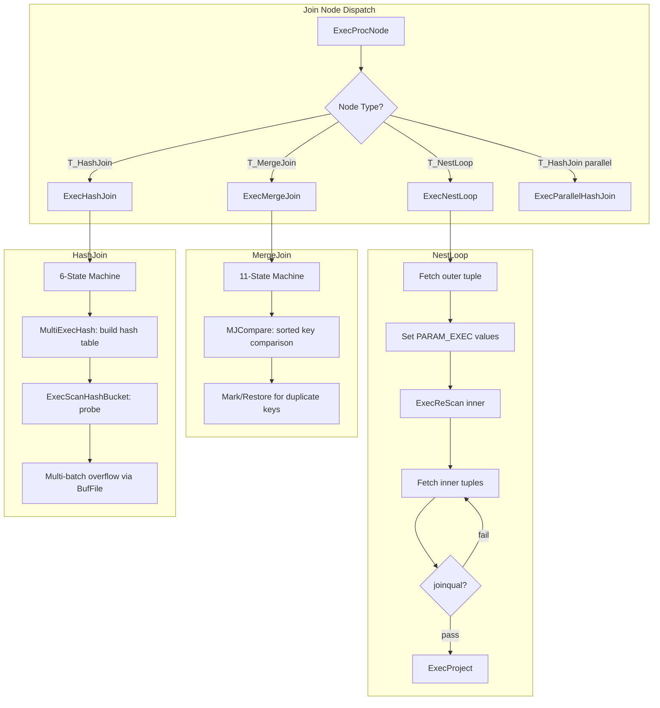
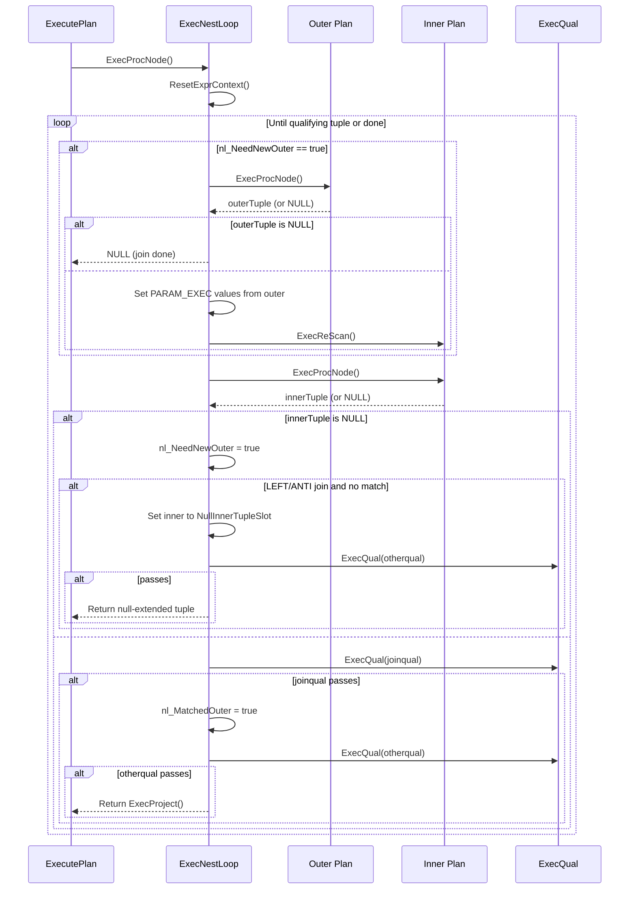
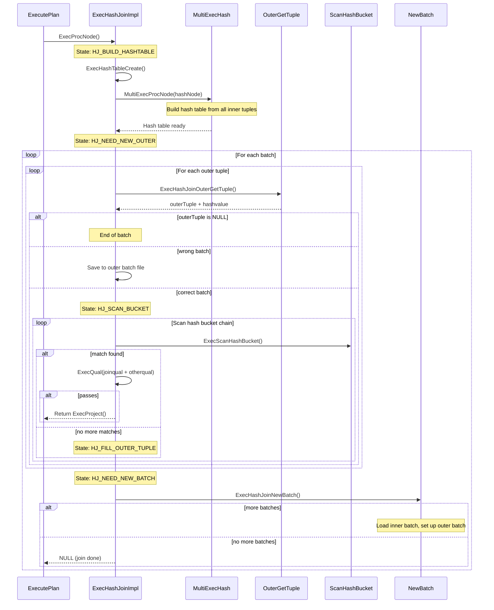
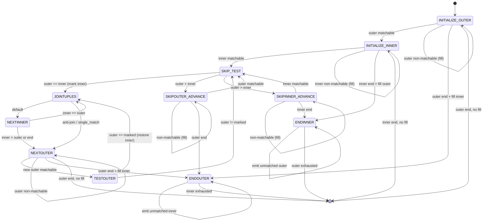

# Join Infrastructure

## Overview

The PostgreSQL executor implements three fundamental join algorithms: Nested Loop Join, Merge Join, and Hash Join. All three share the `JoinState` base struct (which extends `PlanState`) and support the same set of join types: INNER, LEFT, RIGHT, FULL, SEMI, ANTI, RIGHT_SEMI, and RIGHT_ANTI. The planner selects the join algorithm based on cost estimation, available sort orderings, and the join predicate structure.

Each join node follows the Volcano/iterator model, returning one tuple per call to `ExecProcNode()`. Join nodes pull tuples from their outer (left) and inner (right) child nodes, test them against join qualifications, and project the result. All three algorithms handle outer-join null-extension (emitting rows with NULLs for the unmatched side) and optimize semi/anti joins by short-circuiting after the first match.

## Key Concepts

- **JoinState**: Base execution state struct inherited by NestLoopState, MergeJoinState, and HashJoinState. Contains `jointype`, `joinqual` (the join predicate), `single_match` (optimization flag for semi-join and inner-unique joins), and the standard `PlanState` fields.
- **Join Qualification Stages**: Two separate qualification filters are applied: `joinqual` determines whether tuples "match" (affecting outer-join fill logic), while `otherqual` (stored in `ps.qual`) filters which matched tuples are actually returned.
- **Null-Extension**: For LEFT/RIGHT/FULL/ANTI joins, when an outer or inner tuple has no matches, a "fake" join tuple is created by combining the real tuple with a pre-allocated all-NULLs slot.
- **InstrCountFiltered1 / InstrCountFiltered2**: EXPLAIN ANALYZE counters. Filtered1 counts tuples rejected by `joinqual`; Filtered2 counts tuples that passed `joinqual` but failed `otherqual`.
- **Parameterized Joins**: NestLoop supports parameterized inner scans where outer column values are passed to the inner plan via PARAM_EXEC parameters, enabling index lookups on the inner relation.

## Architecture



## Data Structures

### JoinState

```c
/* src/include/nodes/execnodes.h */
typedef struct JoinState
{
    PlanState   ps;              /* Base plan state */
    JoinType    jointype;        /* JOIN_INNER, JOIN_LEFT, etc. */
    bool        single_match;    /* true for semi-join or inner_unique */
    ExprState  *joinqual;        /* join qualification (merge/hash keys separate) */
} JoinState;
```

### NestLoopState

```c
/* src/include/nodes/execnodes.h */
typedef struct NestLoopState
{
    JoinState   js;                     /* base join state */
    bool        nl_NeedNewOuter;        /* true when outer tuple is exhausted */
    bool        nl_MatchedOuter;        /* true if current outer has a match */
    TupleTableSlot *nl_NullInnerTupleSlot;  /* for LEFT/ANTI join null-fill */
} NestLoopState;
```

### MergeJoinState

```c
/* src/include/nodes/execnodes.h */
typedef struct MergeJoinState
{
    JoinState   js;                     /* base join state */
    int         mj_NumClauses;          /* number of merge clauses */
    MergeJoinClause mj_Clauses;         /* array of MergeJoinClauseData */
    int         mj_JoinState;           /* current EXEC_MJ_* state */
    bool        mj_MatchedOuter;        /* current outer has match */
    bool        mj_MatchedInner;        /* current inner has match */
    TupleTableSlot *mj_OuterTupleSlot;  /* current outer tuple */
    TupleTableSlot *mj_InnerTupleSlot;  /* current inner tuple */
    TupleTableSlot *mj_MarkedTupleSlot; /* marked position for restore */
    TupleTableSlot *mj_NullOuterTupleSlot; /* for RIGHT/FULL null-fill */
    TupleTableSlot *mj_NullInnerTupleSlot; /* for LEFT/FULL null-fill */
    bool        mj_FillOuter;           /* true if LEFT or FULL join */
    bool        mj_FillInner;           /* true if RIGHT or FULL join */
    bool        mj_ExtraMarks;          /* true if mark/restore needed */
} MergeJoinState;
```

### HashJoinState

```c
/* src/include/nodes/execnodes.h */
typedef struct HashJoinState
{
    JoinState   js;                     /* base join state */
    HashJoinTable hj_HashTable;         /* the hash table */
    int         hj_JoinState;           /* current HJ_* state */
    uint32      hj_CurHashValue;        /* hash value of current outer tuple */
    int         hj_CurBucketNo;         /* bucket number for current outer */
    int         hj_CurSkewBucketNo;     /* skew bucket number or INVALID */
    HashJoinTuple hj_CurTuple;          /* current match in hash bucket chain */
    bool        hj_MatchedOuter;        /* current outer has match */
    bool        hj_OuterNotEmpty;       /* true after first outer tuple found */
    TupleTableSlot *hj_FirstOuterTupleSlot; /* stashed first outer tuple */
    TupleTableSlot *hj_OuterTupleSlot;  /* outer tuple slot */
    TupleTableSlot *hj_NullOuterTupleSlot; /* for RIGHT/FULL null-fill */
    TupleTableSlot *hj_NullInnerTupleSlot; /* for LEFT/ANTI null-fill */
} HashJoinState;
```

## Core APIs

### ExecNestLoop

#### Purpose

Implements the nested loop join algorithm. For each outer tuple, the entire inner relation is scanned (or an index is probed via parameterized inner scan) to find matching tuples. This is the most general join algorithm, capable of handling any join predicate.

#### Signature

```c
/* src/backend/executor/nodeNestloop.c:59-255 */
static TupleTableSlot *
ExecNestLoop(PlanState *pstate)
```

#### Parameters

| Parameter | Type | Description | Constraints |
|-----------|------|-------------|-------------|
| pstate | PlanState * | Cast to NestLoopState internally via castNode() | Required, non-NULL |

#### Return Value

Returns a `TupleTableSlot *` containing the next joined, projected tuple. Returns NULL when the join is complete (outer relation exhausted).

#### Detailed Description

The function operates as a simple two-level nested loop with state maintained across calls via `nl_NeedNewOuter` and `nl_MatchedOuter`:

1. **Memory reset** (line 91): `ResetExprContext(econtext)` frees previous-cycle expression storage.

2. **Outer tuple fetch** (lines 105-152): When `nl_NeedNewOuter` is true:
   - Fetches the next outer tuple via `ExecProcNode(outerPlan)`
   - If outer is exhausted, returns NULL (join complete)
   - Sets `econtext->ecxt_outertuple` and resets `nl_MatchedOuter` to false
   - **Parameterized rescan** (lines 128-145): For each `NestLoopParam` in `nl->nestParams`, extracts the corresponding attribute from the outer tuple using `slot_getattr()`, stores it in the `PARAM_EXEC` slot, and marks the inner plan's `chgParam` bitmap. This causes the subsequent `ExecReScan(innerPlan)` to restart the inner scan with the new parameter values -- enabling index lookups driven by the outer tuple.
   - Calls `ExecReScan(innerPlan)` to restart the inner scan

3. **Inner tuple fetch** (lines 159-160): Fetches the next inner tuple via `ExecProcNode(innerPlan)`.

4. **Inner exhaustion handling** (lines 162-201): When inner is exhausted:
   - Sets `nl_NeedNewOuter = true`
   - For LEFT/ANTI joins: if the current outer had no match (`!nl_MatchedOuter`), creates a null-extended tuple by setting `ecxt_innertuple` to `nl_NullInnerTupleSlot`, tests `otherqual`, and returns if it passes
   - Continues to fetch the next outer tuple

5. **Qualification testing** (lines 213-246):
   - Tests `joinqual` first; if it passes, sets `nl_MatchedOuter = true`
   - For ANTI joins: skips to next outer (a match means we do NOT want this outer tuple)
   - For `single_match` (semi-join or inner_unique): advances to next outer after first match
   - Tests `otherqual`; if both pass, returns `ExecProject(node->js.ps.ps_ProjInfo)`
   - Increments InstrCountFiltered1 (joinqual fail) or InstrCountFiltered2 (otherqual fail)

6. **Loop continuation** (line 251): Resets expression context and loops for the next inner tuple.

The key code showing join qualification and semi-join optimization:

```c
/* src/backend/executor/nodeNestloop.c:213-244 */
if (ExecQual(joinqual, econtext))
{
    node->nl_MatchedOuter = true;

    /* In an antijoin, we never return a matched tuple */
    if (node->js.jointype == JOIN_ANTI)
    {
        node->nl_NeedNewOuter = true;
        continue;
    }

    if (node->js.single_match)
        node->nl_NeedNewOuter = true;

    if (otherqual == NULL || ExecQual(otherqual, econtext))
        return ExecProject(node->js.ps.ps_ProjInfo);
    else
        InstrCountFiltered2(node, 1);
}
else
    InstrCountFiltered1(node, 1);
```

#### Integration Points

- **Called by**: ExecProcNode via function pointer set in ExecInitNestLoop
- **Calls**: ExecProcNode (for both child plans), ExecReScan, ExecQual, ExecProject, ResetExprContext, slot_getattr
- **Shared state**: PARAM_EXEC parameter slots in EState are written by NestLoop and read by inner scan nodes

#### Performance Considerations

- Complexity is O(N * M) for non-parameterized joins, where N and M are the sizes of outer and inner relations
- With parameterized inner (index scan), effective complexity can be O(N * log(M)) per outer tuple
- The planner sets `EXEC_FLAG_REWIND` on the inner plan when there are no nestParams, enabling the inner node to use cheap restart (e.g., rewind a sort or materialize node)

---

### ExecMergeJoin

#### Purpose

Implements the merge join algorithm using a finite state machine with 11 states. Requires both inputs to be sorted on the merge keys. Uses mark/restore to handle duplicate keys efficiently.

#### Signature

```c
/* src/backend/executor/nodeMergejoin.c:598-1437 */
static TupleTableSlot *
ExecMergeJoin(PlanState *pstate)
```

#### Parameters

| Parameter | Type | Description | Constraints |
|-----------|------|-------------|-------------|
| pstate | PlanState * | Cast to MergeJoinState internally via castNode() | Required, non-NULL |

#### Return Value

Returns the next qualifying joined tuple, or NULL when the join is complete.

#### Detailed Description

The merge join is implemented as a state machine driven by an infinite `for(;;)` loop with a `switch` on `node->mj_JoinState`. The 11 states are defined in `src/backend/executor/nodeMergejoin.c:105-115`:

```c
#define EXEC_MJ_INITIALIZE_OUTER    1
#define EXEC_MJ_INITIALIZE_INNER    2
#define EXEC_MJ_JOINTUPLES          3
#define EXEC_MJ_NEXTOUTER           4
#define EXEC_MJ_TESTOUTER           5
#define EXEC_MJ_NEXTINNER           6
#define EXEC_MJ_SKIP_TEST           7
#define EXEC_MJ_SKIPOUTER_ADVANCE   8
#define EXEC_MJ_SKIPINNER_ADVANCE   9
#define EXEC_MJ_ENDOUTER            10
#define EXEC_MJ_ENDINNER            11
```

**State Machine Operation:**

**EXEC_MJ_INITIALIZE_OUTER (1)**: Fetches the first outer tuple. Evaluates merge key values via `MJEvalOuterValues()`. If MATCHABLE, transitions to INITIALIZE_INNER. If NONMATCHABLE (contains NULL in a merge key), emits a null-extended tuple for LEFT joins and stays in the same state. If ENDOFJOIN, transitions to ENDOUTER for RIGHT joins or returns NULL.

**EXEC_MJ_INITIALIZE_INNER (2)**: Fetches the first inner tuple. Evaluates merge key values via `MJEvalInnerValues()`. If MATCHABLE, transitions to SKIP_TEST. If NONMATCHABLE, emits null-fill for RIGHT joins and stays. If ENDOFJOIN, transitions to ENDINNER for LEFT joins or returns NULL.

**EXEC_MJ_JOINTUPLES (3)**: Both current tuples have matching merge keys. Sets next state to NEXTINNER. Evaluates `joinqual` -- if it passes, sets both `mj_MatchedOuter` and `mj_MatchedInner` to true. For ANTI joins, skips to NEXTOUTER. For `single_match`, advances to NEXTOUTER. Then evaluates `otherqual`; if both pass, returns the projected tuple via `ExecProject()`.

**EXEC_MJ_NEXTOUTER (4)**: Advance to the next outer tuple. First emits a null-extended tuple if `doFillOuter && !mj_MatchedOuter` (for LEFT joins). Fetches via `ExecProcNode(outerPlan)` and evaluates outer values. If MATCHABLE, transitions to TESTOUTER. If ENDOFJOIN, transitions to ENDOUTER for RIGHT joins.

**EXEC_MJ_TESTOUTER (5)**: Compares the new outer tuple against the marked inner tuple using `MJCompare()`. If they are equal (duplicate outer key), restores the inner scan to the marked position and transitions to JOINTUPLES. If not equal, transitions to SKIP_TEST to re-synchronize.

**EXEC_MJ_NEXTINNER (6)**: Advance to the next inner tuple within a matching group. First emits null-fill if `doFillInner && !mj_MatchedInner`. Fetches the next inner tuple and compares: if still equal, transitions to JOINTUPLES; if inner has advanced past the match, transitions to NEXTOUTER.

**EXEC_MJ_SKIP_TEST (7)**: The main synchronization state. Compares current outer and inner merge keys via `MJCompare()`. If equal, marks the inner position and transitions to JOINTUPLES. If outer < inner, transitions to SKIPOUTER_ADVANCE. If outer > inner, transitions to SKIPINNER_ADVANCE.

**EXEC_MJ_SKIPOUTER_ADVANCE (8)**: Advances the outer tuple past non-matching values. Emits null-fill for LEFT joins if needed. Fetches next outer and, if MATCHABLE, transitions to SKIP_TEST.

**EXEC_MJ_SKIPINNER_ADVANCE (9)**: Advances the inner tuple past non-matching values. Emits null-fill for RIGHT joins if needed. Performs extra marks if required. Fetches next inner and, if MATCHABLE, transitions to SKIP_TEST.

**EXEC_MJ_ENDOUTER (10)**: Outer relation is exhausted. Emits null-extended tuples for remaining unmatched inner tuples (RIGHT/FULL join). Returns NULL when inner is also exhausted.

**EXEC_MJ_ENDINNER (11)**: Inner relation is exhausted. Emits null-extended tuples for remaining unmatched outer tuples (LEFT/FULL join). Returns NULL when outer is also exhausted.

**Key Helper Functions:**

- `MJExamineQuals()` (line 174): Deconstructs the list of merge join clauses into `MergeJoinClauseData` array with `SortSupportData` for comparisons.
- `MJEvalOuterValues()` / `MJEvalInnerValues()`: Evaluate merge key expressions and return `MJEVAL_MATCHABLE`, `MJEVAL_NONMATCHABLE` (NULL in key), or `MJEVAL_ENDOFJOIN`.
- `MJCompare()` (line 390): Compares outer and inner merge keys using the `SortSupportData` comparators. Returns negative, zero, or positive.
- `MJFillOuter()` / `MJFillInner()`: Create null-extended tuples for outer/inner join fills.

#### Mark/Restore Protocol

When duplicate keys exist in both relations, the merge join must produce the cross product. The mark/restore protocol handles this:

1. When merge keys first match in SKIP_TEST, the inner position is **marked** (`MarkInnerTuple`)
2. Inner tuples are consumed one by one in NEXTINNER/JOINTUPLES
3. When advancing to the next outer in NEXTOUTER, the state moves to TESTOUTER
4. In TESTOUTER, the new outer is compared against the **marked** inner tuple
5. If they still match, the inner scan is **restored** to the mark, and we re-join all inner duplicates with the new outer
6. If they do not match, we proceed to SKIP_TEST with the current inner position

This avoids re-scanning the entire inner relation for each duplicate in the outer.

#### Integration Points

- **Called by**: ExecProcNode via function pointer
- **Calls**: ExecProcNode (both children), MJCompare, MJEvalOuterValues, MJEvalInnerValues, MJFillOuter, MJFillInner, ExecMarkPos, ExecRestrPos, ExecQual, ExecProject
- **Requires**: Both inputs must be sorted on the merge keys

#### Performance Considerations

- Merge join complexity is O(N + M) for non-duplicate keys
- With duplicates, the cost includes the cross product of matching groups
- The mark/restore mechanism avoids full rescans but requires the inner plan to support mark/restore (Sort or IndexScan)
- NULL merge keys are handled by treating them as non-matchable, which avoids incorrect NULL=NULL matches

---

### ExecHashJoinImpl

#### Purpose

Implements the Hybrid Hash Join algorithm as a state machine with 6 states. The same function handles both serial (parallel=false) and parallel (parallel=true) execution via the `pg_attribute_always_inline` optimization that allows the compiler to create two specialized versions with dead branches removed.

#### Signature

```c
/* src/backend/executor/nodeHashjoin.c:219-669 */
static pg_attribute_always_inline TupleTableSlot *
ExecHashJoinImpl(PlanState *pstate, bool parallel)
```

#### Parameters

| Parameter | Type | Description | Constraints |
|-----------|------|-------------|-------------|
| pstate | PlanState * | Cast to HashJoinState internally | Required, non-NULL |
| parallel | bool | true for parallel-aware hash join | Compile-time constant via inlining |

#### Return Value

Returns the next qualifying joined tuple, or NULL when the join is complete.

#### Detailed Description

The function operates as a state machine with 6 states defined in `src/backend/executor/nodeHashjoin.c:179-184`:

```c
#define HJ_BUILD_HASHTABLE     1
#define HJ_NEED_NEW_OUTER      2
#define HJ_SCAN_BUCKET         3
#define HJ_FILL_OUTER_TUPLE    4
#define HJ_FILL_INNER_TUPLES   5
#define HJ_NEED_NEW_BATCH      6
```

**Phase 1: Build (HJ_BUILD_HASHTABLE)**

This state is executed exactly once per join execution. It performs the following steps:

1. **Empty-outer optimization** (lines 296-327): For non-right/full joins, the executor may prefetch one outer tuple. If the outer relation is empty and no inner fill is needed, returns NULL immediately without building the hash table. This optimization is skipped for parallel joins.

2. **Hash table creation** (line 334): Calls `ExecHashTableCreate()` which allocates the `HashJoinTableData` structure, configures the number of buckets and batches based on estimated inner relation size and `work_mem`, and sets up hash functions.

3. **Hash table population** (line 346): Calls `MultiExecProcNode()` on the Hash child node, which invokes `MultiExecPrivateHash()`. This function reads all inner tuples, computes their hash values, handles skew bucket insertion for frequent values, and inserts each tuple into the appropriate hash bucket (or saves it to a batch file for later batches).

4. **Empty-inner check** (lines 353-367): If the hash table is empty and no outer fill is needed, returns NULL.

5. **Parallel transition** (lines 382-417): For parallel joins, coordinates through the build barrier phases (PHJ_BUILD_HASH_OUTER for multi-batch, then PHJ_BUILD_RUN), and starts with HJ_NEED_NEW_BATCH since workers pick batches. For serial joins, transitions directly to HJ_NEED_NEW_OUTER.

**Phase 2: Probe (HJ_NEED_NEW_OUTER and HJ_SCAN_BUCKET)**

**HJ_NEED_NEW_OUTER**: Fetches the next outer tuple. For serial joins, calls `ExecHashJoinOuterGetTuple()` which handles batch 0 (scanning outer child) and later batches (reading from saved batch files). For parallel joins, calls `ExecParallelHashJoinOuterGetTuple()` which reads from shared tuple stores.

Key behavior in this state:
- Computes the hash value and determines the target bucket and batch via `ExecHashGetBucketAndBatch()`
- Checks for skew bucket match via `ExecHashGetSkewBucket()`
- If the tuple belongs to a different batch (`batchno != hashtable->curbatch`), saves it to the outer batch file for later processing and continues looping
- Otherwise, transitions to HJ_SCAN_BUCKET

**HJ_SCAN_BUCKET**: Iterates through the hash bucket chain to find matching inner tuples. Calls `ExecScanHashBucket()` (or `ExecParallelScanHashBucket()`) which walks the `HashJoinTuple` chain, comparing hash values and then evaluating the hash join clauses. When a match is found:
- Tests `joinqual` and `otherqual`
- Marks matched inner tuples (for right/full join unmatched scan later)
- Handles ANTI join (skip on match), single_match/semi-join (advance to next outer), and RIGHT_ANTI join
- Returns projected tuple on full qualification pass

When no more matches exist in the bucket, transitions to HJ_FILL_OUTER_TUPLE.

**HJ_FILL_OUTER_TUPLE**: For LEFT/ANTI joins, if the current outer tuple had no match, emits a null-extended tuple. Transitions to HJ_NEED_NEW_OUTER.

**HJ_FILL_INNER_TUPLES**: For RIGHT/FULL joins, after all outer tuples for a batch are processed, scans the hash table for unmatched inner tuples (those without the HeapTupleHeaderMatch flag) and emits null-extended tuples. Transitions to HJ_NEED_NEW_BATCH when done.

**HJ_NEED_NEW_BATCH**: Calls `ExecHashJoinNewBatch()` (or `ExecParallelHashJoinNewBatch()`) to advance to the next batch. The serial version loads inner tuples from the saved batch file into a fresh hash table and sets up reading from the outer batch file. Returns NULL if no more batches remain. Transitions to HJ_NEED_NEW_OUTER.

#### Multi-Batch Overflow (Hybrid Hash Join)

When the inner relation is too large for `work_mem`, the hash join uses multiple batches:

1. The number of batches is always a power of 2. The initial count is estimated by the planner.
2. During hash table build, if inserting a tuple would exceed `work_mem`, the executor doubles the number of batches and redistributes tuples.
3. Batch assignment uses the hash value: `batchno = (hashvalue >> nbatch_shift) & (nbatch - 1)`. Only batch 0 tuples remain in memory; others are saved to temporary `BufFile`s.
4. During probe, outer tuples for non-current batches are also saved to their respective batch files.
5. After completing batch 0, `ExecHashJoinNewBatch()` iterates through remaining batches, loading inner tuples from saved files and probing with saved outer tuples.

**Batch skip optimization**: `ExecHashJoinNewBatch()` (line 1030) skips batches where either the inner or outer batch file is empty, since no join results are possible.

#### Skew Optimization

The hash join includes a skew bucket optimization for frequently occurring hash values (MCV - Most Common Values):

- During `ExecHashTableCreate()`, if statistics indicate skew in the inner relation, special skew buckets are allocated
- Skew buckets are checked first via `ExecHashGetSkewBucket()` and provide separate hash chains for high-frequency values
- This prevents performance degradation from hot buckets where many tuples hash to the same value

#### Parallel Hash Join

Parallel hash join coordinates multiple workers through barrier-based synchronization. The build phase uses a shared barrier (`build_barrier`) with the following phases:

```
PHJ_BUILD_ELECT       -- initial state
PHJ_BUILD_ALLOCATE*   -- one worker allocates batches and table 0
PHJ_BUILD_HASH_INNER  -- all workers hash the inner relation
PHJ_BUILD_HASH_OUTER  -- (multi-batch only) all workers hash the outer
PHJ_BUILD_RUN         -- building done, probing can begin
PHJ_BUILD_FREE*       -- all work complete, one worker frees resources
```

Phases marked with `*` are performed by a single elected worker. The key differences from serial hash join:

1. **Shared hash table**: All workers insert into a shared hash table in DSM
2. **Upfront outer partitioning**: Multi-batch parallel joins partition the outer relation during PHJ_BUILD_HASH_OUTER (serial joins partition lazily during probe)
3. **Batch distribution**: After PHJ_BUILD_RUN, each worker selects batches to process independently
4. **Per-batch barriers**: Each batch has its own barrier with phases: ELECT, ALLOCATE, LOAD, PROBE, SCAN, FREE

#### Integration Points

- **Called by**: ExecHashJoin (parallel=false) or ExecParallelHashJoin (parallel=true), dispatched via ExecProcNode function pointer
- **Calls**: MultiExecProcNode (Hash node), ExecHashTableCreate, ExecHashJoinOuterGetTuple, ExecScanHashBucket, ExecHashGetBucketAndBatch, ExecHashGetSkewBucket, ExecPrepHashTableForUnmatched, ExecScanHashTableForUnmatched, ExecHashJoinNewBatch, ExecQual, ExecProject
- **Shared state**: HashJoinTable (in-memory hash table), BufFile (batch overflow files), ParallelHashJoinState (for parallel coordination)

#### Performance Considerations

- Hash join complexity is O(N + M) for single-batch joins (N outer, M inner)
- Multi-batch joins add I/O cost for writing and reading batch files
- `work_mem` directly controls the batch threshold; larger values reduce multi-batch probability
- The skew optimization prevents O(N) bucket scans for high-frequency values
- The empty-outer optimization avoids building the hash table entirely when outer is empty

---

### ExecInitNestLoop

#### Purpose

Initializes the NestLoop join state, including child plan initialization, expression compilation, and null-tuple slot allocation for outer joins.

#### Signature

```c
/* src/backend/executor/nodeNestloop.c:261-352 */
NestLoopState *
ExecInitNestLoop(NestLoop *node, EState *estate, int eflags)
```

#### Detailed Description

1. Creates `NestLoopState` via `makeNode()` and sets `ExecProcNode = ExecNestLoop`
2. Creates expression context via `ExecAssignExprContext()`
3. Initializes the outer child plan with current `eflags`
4. Initializes the inner child plan with modified flags:
   - If `nestParams == NIL` (no parameters): adds `EXEC_FLAG_REWIND` for cheap rescan
   - If `nestParams != NIL`: removes `EXEC_FLAG_REWIND` (will always rescan with new params)
5. Sets up result slot and projection info
6. Compiles `qual` and `joinqual` via `ExecInitQual()`
7. Sets `single_match = (inner_unique || JOIN_SEMI)`
8. For LEFT/ANTI joins: allocates `nl_NullInnerTupleSlot` via `ExecInitNullTupleSlot()`
9. Sets initial state: `nl_NeedNewOuter = true`, `nl_MatchedOuter = false`

---

### ExecInitHashJoin

#### Purpose

Initializes the Hash Join state including child plans, hash operators, and null-tuple slots.

#### Signature

```c
/* src/backend/executor/nodeHashjoin.c:709-850 */
HashJoinState *
ExecInitHashJoin(HashJoin *node, EState *estate, int eflags)
```

#### Detailed Description

1. Creates `HashJoinState` and sets `ExecProcNode` to either `ExecHashJoin` or `ExecParallelHashJoin` based on whether the Hash child has `parallel_state`
2. Initializes outer and inner (Hash) child plans
3. Compiles hash clauses, extracting left (outer) and right (inner) hash key expressions
4. Allocates arrays for hash operators (`hj_HashOperators`) and collations (`hj_Collations`)
5. Sets up null-tuple slots based on join type:
   - LEFT/ANTI: `hj_NullInnerTupleSlot`
   - RIGHT/RIGHT_ANTI/FULL: `hj_NullOuterTupleSlot`
6. Sets initial state: `hj_JoinState = HJ_BUILD_HASHTABLE`

## Processing Flows

### NestLoop Join Processing



### Hash Join Two-Phase Processing



## Merge Join State Machine



## Implementation Notes

1. **Two-level qualification**: All three join algorithms separate `joinqual` from `otherqual`. Only `joinqual` affects the `MatchedOuter`/`MatchedInner` flags that control null-extension for outer joins. This is because `otherqual` conditions (e.g., filter conditions pushed into the join node) should not prevent null-extension of unmatched rows.

2. **Semi-join and inner_unique optimization**: The `single_match` flag is set when either `inner_unique` is true (planner proved uniqueness) or the join type is `JOIN_SEMI`. This allows all three algorithms to skip remaining inner tuples after the first match, reducing work significantly for exists-subquery patterns.

3. **Anti-join handling**: Anti-joins reverse the normal behavior -- a match causes the outer tuple to be skipped, while unmatched outer tuples are returned. This is implemented uniformly in all three join types: on `joinqual` match, set `NeedNewOuter`/advance to NEXTOUTER and continue without returning.

4. **Hash join compilation trick**: `ExecHashJoinImpl` is marked `pg_attribute_always_inline` and called from two wrapper functions with `parallel` set to a compile-time constant. This causes the compiler to generate two specialized versions where the `if (parallel)` branches are eliminated by dead code removal, avoiding branch prediction overhead at runtime.

5. **Merge join extra marks**: The `mj_ExtraMarks` flag controls whether mark operations are performed at transition points to SKIPINNER_ADVANCE. These extra marks are needed for RIGHT/FULL joins to ensure we can correctly track which inner tuples have been matched.

6. **Hash join batch growth safety**: When doubling the number of batches, if a batch retains all or none of its tuples after redistribution, further batch growth is disabled globally (`hashtable->growEnabled = false`). This prevents infinite batch doubling when a highly skewed distribution causes most tuples to land in the same batch regardless of the number of batches.
