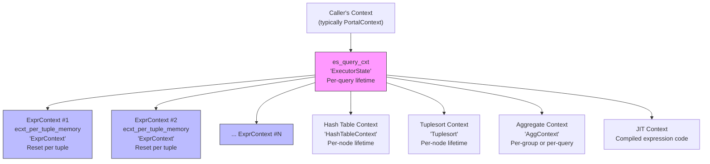

# Executor Memory Management

## Overview

The PostgreSQL executor uses a hierarchy of memory contexts to manage the
lifetimes of different categories of data. This hierarchy ensures that
short-lived data (per-tuple expression results) is freed promptly, while
long-lived data (plan state, hash tables) persists for the query's duration.
The correct use of these contexts is critical for both correctness (preventing
dangling pointers) and performance (preventing memory leaks in long-running
queries).

The key insight is the three-level hierarchy:
1. **Per-query context** (`es_query_cxt`): Lives for the entire executor invocation
2. **Per-node contexts**: Specific to individual plan nodes (hash tables, sort runs)
3. **Per-tuple context** (`ecxt_per_tuple_memory`): Reset on every tuple cycle

Source files:
- `src/backend/executor/execUtils.c` -- CreateExecutorState, CreateExprContext,
  FreeExecutorState, ResetExprContext
- `src/include/nodes/execnodes.h` -- EState, ExprContext definitions

## Key Concepts

- **Memory context reset vs delete**: Resetting a context frees all allocations
  within it but keeps the context itself and its initial block. This is much
  cheaper than deleting and recreating a context.
- **Per-tuple reset**: The per-tuple memory context is reset before processing
  each tuple to prevent accumulation of expression evaluation detritus.
- **Context hierarchy**: All executor contexts are children of the per-query
  context, so `FreeExecutorState()` destroys everything by deleting the
  per-query context.

## Memory Context Hierarchy



---

## Per-Query Memory Context (EState)

### CreateExecutorState

#### Purpose

Creates and initializes the EState node, which is the root of working storage
for an entire executor invocation. The per-query memory context becomes the
parent for all executor-allocated memory.

#### Signature

```c
/* Source: src/backend/executor/execUtils.c:87-171 */
EState *
CreateExecutorState(void)
```

#### Step-by-Step Logic

```c
EState *
CreateExecutorState(void)
{
    EState     *estate;
    MemoryContext qcontext;
    MemoryContext oldcontext;

    /* Create the per-query context as a child of CurrentMemoryContext */
    qcontext = AllocSetContextCreate(CurrentMemoryContext,
                                     "ExecutorState",
                                     ALLOCSET_DEFAULT_SIZES);

    /* Allocate EState within the per-query context */
    oldcontext = MemoryContextSwitchTo(qcontext);
    estate = makeNode(EState);

    /* Initialize all fields... */
    estate->es_query_cxt = qcontext;
    estate->es_direction = ForwardScanDirection;
    estate->es_snapshot = InvalidSnapshot;
    estate->es_processed = 0;
    estate->es_total_processed = 0;
    estate->es_exprcontexts = NIL;
    estate->es_per_tuple_exprcontext = NULL;
    estate->es_jit_flags = 0;
    estate->es_jit = NULL;
    /* ... other initializations ... */

    MemoryContextSwitchTo(oldcontext);
    return estate;
}
```

The EState is allocated inside its own per-query context. This means that
destroying the per-query context via `MemoryContextDelete` will also free
the EState itself -- no separate pfree is needed.

### FreeExecutorState

#### Purpose

Releases the EState and all associated working storage by destroying the
per-query memory context.

#### Signature

```c
/* Source: src/backend/executor/execUtils.c:188-227 */
void
FreeExecutorState(EState *estate)
```

#### Step-by-Step Logic

1. **Shut down ExprContexts**: Iterate through `es_exprcontexts` and call
   `FreeExprContext()` on each. This ensures shutdown callbacks are invoked
   (e.g., releasing aggregate transition values, closing SPI connections).

2. **Release JIT context**: If `es_jit` is set, call `jit_release_context()`.

3. **Release partition directory**: If allocated, call
   `DestroyPartitionDirectory()`.

4. **Delete per-query context**: `MemoryContextDelete(estate->es_query_cxt)`
   frees all memory including the EState node itself.

---

## Per-Tuple Memory Context (ExprContext)

### CreateExprContext

#### Purpose

Creates an expression evaluation context within an EState. Each ExprContext has
its own per-tuple memory context that can be independently reset.

#### Signature

```c
/* Source: src/backend/executor/execUtils.c:303-307 */
ExprContext *
CreateExprContext(EState *estate)
{
    return CreateExprContextInternal(estate, ALLOCSET_DEFAULT_SIZES);
}
```

#### Internal Implementation

```c
/* Source: src/backend/executor/execUtils.c:233-288 */
static ExprContext *
CreateExprContextInternal(EState *estate, Size minContextSize,
                          Size initBlockSize, Size maxBlockSize)
{
    ExprContext *econtext;
    MemoryContext oldcontext;

    /* Create ExprContext in per-query context */
    oldcontext = MemoryContextSwitchTo(estate->es_query_cxt);
    econtext = makeNode(ExprContext);

    /* Initialize tuple slot pointers to NULL */
    econtext->ecxt_scantuple = NULL;
    econtext->ecxt_innertuple = NULL;
    econtext->ecxt_outertuple = NULL;

    /* Reference per-query context */
    econtext->ecxt_per_query_memory = estate->es_query_cxt;

    /* Create per-tuple context as child of per-query context */
    econtext->ecxt_per_tuple_memory =
        AllocSetContextCreate(estate->es_query_cxt,
                              "ExprContext",
                              minContextSize,
                              initBlockSize,
                              maxBlockSize);

    /* Copy parameter references from EState */
    econtext->ecxt_param_exec_vals = estate->es_param_exec_vals;
    econtext->ecxt_param_list_info = estate->es_param_list_info;

    /* Link into EState's list (for cleanup) */
    estate->es_exprcontexts = lcons(econtext, estate->es_exprcontexts);

    MemoryContextSwitchTo(oldcontext);
    return econtext;
}
```

### CreateWorkExprContext

A variant of `CreateExprContext` that sizes the per-tuple memory context
proportionally to `work_mem`. This prevents a single allocation from skipping
past the work_mem limit:

```c
/* Source: src/backend/executor/execUtils.c:318-334 */
ExprContext *
CreateWorkExprContext(EState *estate)
{
    Size maxBlockSize = ALLOCSET_DEFAULT_MAXSIZE;

    /* Limit maxBlockSize to 1/16 of work_mem */
    while (16 * maxBlockSize > work_mem * 1024L)
        maxBlockSize >>= 1;

    if (maxBlockSize < ALLOCSET_DEFAULT_INITSIZE)
        maxBlockSize = ALLOCSET_DEFAULT_INITSIZE;

    return CreateExprContextInternal(estate, ALLOCSET_DEFAULT_MINSIZE,
                                     ALLOCSET_DEFAULT_INITSIZE,
                                     maxBlockSize);
}
```

### CreateStandaloneExprContext

For expression evaluation outside a full executor invocation (e.g., index
expression evaluation, domain constraint checking):

```c
/* Source: src/backend/executor/execUtils.c:354-394 */
ExprContext *
CreateStandaloneExprContext(void)
```

This creates an ExprContext with `CurrentMemoryContext` as the parent and
`ecxt_estate = NULL`. The caller is responsible for cleanup.

---

## ResetExprContext -- The Critical Per-Tuple Operation

### Definition

```c
/* Source: src/include/executor/executor.h (macro) */
#define ResetExprContext(econtext) \
    MemoryContextReset((econtext)->ecxt_per_tuple_memory)
```

### Why Per-Tuple Reset is Critical

Without per-tuple context reset, memory allocated during expression evaluation
would accumulate over the lifetime of the query. Consider a query that processes
1 million rows with a text concatenation in the WHERE clause:

```sql
SELECT * FROM t WHERE upper(name) = 'SMITH';
```

Each call to `upper()` allocates memory for the uppercased string. Without
reset, this would consume O(n) memory proportional to the number of rows
processed. With per-tuple reset, memory consumption is O(1) -- only the current
tuple's expression results are live at any time.

### Where ResetExprContext is Called

1. **ExecutePlan loop** (`execMain.c:1643`):
   ```c
   for (;;)
   {
       ResetPerTupleExprContext(estate);  /* reset before each tuple */
       slot = ExecProcNode(planstate);
       ...
   }
   ```

2. **ExecScan loop** (`execScan.c:180-182`):
   ```c
   ResetExprContext(econtext);
   for (;;)
   {
       slot = ExecScanFetch(node, accessMtd, recheckMtd);
       ...
       /* After qual failure: */
       ResetExprContext(econtext);
   }
   ```

3. **Join nodes** -- before evaluating join quals on each new tuple combination.

4. **Aggregate nodes** -- between processing groups (for sorted aggregation)
   or between probe tuples (for hash aggregation).

### ResetPerTupleExprContext

This macro resets the EState-level per-tuple ExprContext (used for constraints,
index computations):

```c
/* Source: src/include/executor/executor.h */
#define ResetPerTupleExprContext(estate) \
    do { \
        if ((estate)->es_per_tuple_exprcontext) \
            ResetExprContext((estate)->es_per_tuple_exprcontext); \
    } while (0)
```

---

## ExecEvalExprSwitchContext

Expression evaluation must happen in the per-tuple memory context so that
any allocations (e.g., detoasted values, function results) are automatically
freed on the next tuple cycle:

```c
/* Source: src/include/executor/executor.h:348-361 */
static inline Datum
ExecEvalExprSwitchContext(ExprState *state,
                          ExprContext *econtext,
                          bool *isNull)
{
    Datum       retDatum;
    MemoryContext oldContext;

    oldContext = MemoryContextSwitchTo(econtext->ecxt_per_tuple_memory);
    retDatum = state->evalfunc(state, econtext, isNull);
    MemoryContextSwitchTo(oldContext);
    return retDatum;
}
```

This is used by `ExecQual()` and `ExecProject()` to ensure correct context
placement. Direct calls to `ExecEvalExpr()` (without the switch) should only
be made when the caller has already switched to the appropriate context.

---

## ExecAssignExprContext

A convenience function used by plan node initialization to create and assign
an ExprContext:

```c
/* Source: src/backend/executor/execUtils.c */
void
ExecAssignExprContext(EState *estate, PlanState *planstate)
{
    planstate->ps_ExprContext = CreateExprContext(estate);
}
```

Most plan nodes call this during their `ExecInit*` function to set up the
node's expression evaluation context.

---

## Memory Context Usage by Node Type

| Node Type | Additional Contexts | Purpose |
|-----------|-------------------|---------|
| **HashJoin** | HashTableContext, per-batch contexts | Hash table memory management; batches for spill-to-disk |
| **Sort** | Tuplesort context | Manages sort runs and merge operations |
| **Agg** (hashed) | Hash aggregate context | Hash table for aggregate groups; may spill |
| **Agg** (sorted) | Per-group context | Reset between groups for transition values |
| **WindowAgg** | Per-partition context | Tuplestore for partition buffering |
| **Material** | Tuplestore context | Materialized tuple storage |
| **Memoize** | Cache context | Parameterized result cache |
| **Gather** | Per-worker contexts | Worker result collection |

---

## FreeExprContext and Shutdown Callbacks

```c
/* Source: src/backend/executor/execUtils.c:396-450 (approximate) */
void
FreeExprContext(ExprContext *econtext, bool isCommit)
```

Before destroying an ExprContext, shutdown callbacks are invoked via
`ShutdownExprContext()`. These callbacks allow resources beyond memory to be
cleaned up:
- Aggregate transition values that hold external resources
- Open file descriptors from set-returning functions
- SPI connections

Callbacks are registered with `RegisterExprContextCallback()` and
automatically invoked during context shutdown.

---

## Memory Leak Prevention Patterns

### Pattern 1: ResetExprContext in Scan Loop

Every scan node that evaluates expressions must reset the per-tuple context
before processing each tuple to prevent leaks:

```c
/* Correct pattern in ExecScan */
ResetExprContext(econtext);
for (;;)
{
    slot = fetch_next_tuple();
    if (TupIsNull(slot)) break;
    econtext->ecxt_scantuple = slot;

    if (ExecQual(qual, econtext))
        return ExecProject(projInfo);

    ResetExprContext(econtext);  /* CRITICAL: free before next iteration */
}
```

### Pattern 2: Long-Lived Results Need Materialization

When a tuple must survive beyond the current per-tuple cycle (e.g., for
sorting, hashing, or cross-tuple comparisons), it must be materialized or
copied into a longer-lived context:

```c
/* Copy tuple to per-query context before per-tuple reset */
MemoryContext old = MemoryContextSwitchTo(estate->es_query_cxt);
saved_tuple = ExecCopySlotHeapTuple(slot);
MemoryContextSwitchTo(old);

ResetExprContext(econtext);  /* safe: saved_tuple is in query context */
```

### Pattern 3: Aggregate Transition Values

Aggregate transition values are typically allocated in a per-group context
that is NOT the per-tuple context. The per-tuple context is reset between
tuples, but transition values must persist across all tuples in a group.

## Implementation Notes

- The `lcons()` call in `CreateExprContextInternal` ensures that ExprContexts
  are shut down in reverse order of creation during `FreeExecutorState()`.
  This is not strictly required but avoids potential ordering issues.
- The per-query context is created as a child of `CurrentMemoryContext` at the
  time `CreateExecutorState()` is called. In the normal path through
  `PortalRunSelect`, this is the portal's memory context.
- For parallel query, each worker creates its own EState with its own per-query
  context. Worker ExprContexts are independent of the leader's.
- The `es_per_tuple_exprcontext` in EState is created on demand (lazily) by
  `GetPerTupleExprContext()`. It serves constraints checking and index value
  computation at the top level of ExecutePlan.
