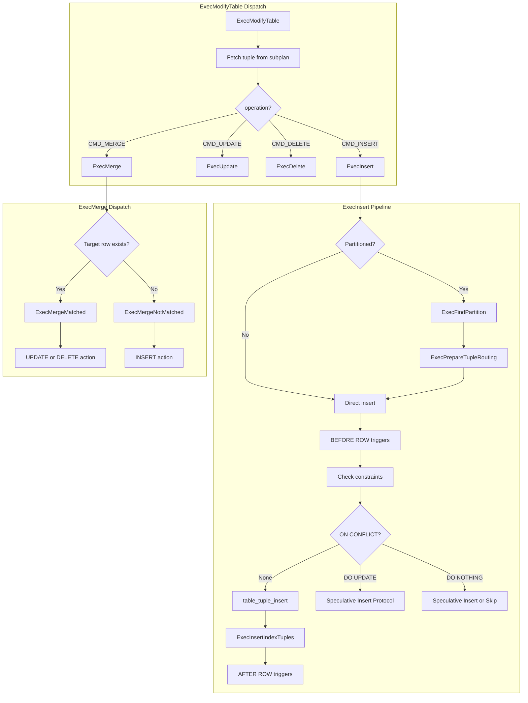
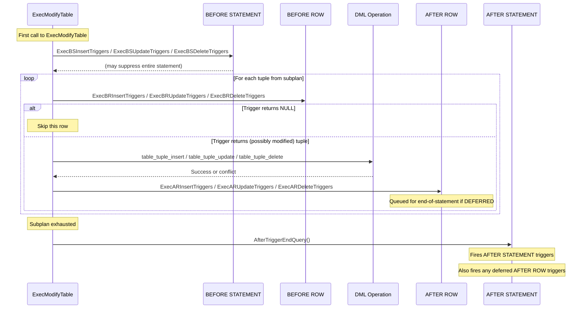

# ModifyTable: Data Modification

## Overview

The `ModifyTable` node is the executor's central mechanism for all data modification operations: INSERT, UPDATE, DELETE, and MERGE. Unlike scan and join nodes that passively retrieve data, ModifyTable actively mutates table contents. It sits at the top of the plan tree (directly below the root Result node or as the root itself) and pulls tuples from a subplan that computes the rows to be inserted, updated, or deleted.

ModifyTable handles an extensive set of concerns beyond simple row modification: BEFORE/AFTER triggers (both row-level and statement-level), CHECK constraints, partition routing (for INSERT and cross-partition UPDATE), ON CONFLICT (DO NOTHING / DO UPDATE) for upsert operations, RETURNING clauses, and the MERGE command's MATCHED/NOT MATCHED action dispatch. Foreign table DML is also routed through this node by delegating to the Foreign Data Wrapper callbacks.

## Key Concepts

- **Result Relations**: The target tables (or partitions) that will be modified. Each result relation has a `ResultRelInfo` containing the open relation, trigger descriptors, index info, and constraint check state.
- **Partition Routing**: For partitioned tables, INSERT tuples are routed to the correct leaf partition via `ExecFindPartition()`. Cross-partition UPDATEs delete from the old partition and insert into the new one.
- **ON CONFLICT**: The upsert mechanism for INSERT. Uses speculative insertion: tentatively insert, check for conflicts, and either confirm the insertion or perform an UPDATE on the conflicting row.
- **Trigger Ordering**: `BEFORE STATEMENT` -> `BEFORE ROW` -> actual DML operation -> `AFTER ROW` -> `AFTER STATEMENT`. Deferred triggers fire at transaction commit.
- **MERGE Command**: Combines INSERT/UPDATE/DELETE into a single statement. For each source row, evaluates MATCHED (target row exists) and NOT MATCHED conditions to determine which action to perform.

## Architecture



## Data Structures

### ModifyTableState

```c
/* src/include/nodes/execnodes.h (simplified) */
typedef struct ModifyTableState
{
    PlanState   ps;                 /* base plan state */
    CmdType     operation;          /* CMD_INSERT, CMD_UPDATE, CMD_DELETE, CMD_MERGE */
    bool        canSetTag;          /* should we update es_processed count? */
    ResultRelInfo *resultRelInfo;   /* target relation info array */
    int         mt_nrels;           /* number of result relations */
    ResultRelInfo *rootResultRelInfo; /* root partitioned table's ResultRelInfo */
    PlanState  *mt_plans;           /* subplan providing source rows */
    struct PartitionTupleRouting *mt_partition_tuple_routing; /* partition routing state */
    struct OnConflictSetState *mt_conflproj; /* ON CONFLICT DO UPDATE projection */
    List       *mt_arbiterindexes;  /* indexes for ON CONFLICT arbitration */
    TupleTableSlot *mt_existing;    /* slot for existing tuple in ON CONFLICT */
    /* Trigger support */
    int         mt_num_dispatch;    /* number of INSERT trigger dispatch entries */
    /* MERGE support */
    List       *mt_mergeActions;    /* MERGE action lists per result relation */
    TupleTableSlot *mt_merge_action; /* slot for current MERGE action */
} ModifyTableState;
```

### ResultRelInfo

```c
/* src/include/nodes/execnodes.h (simplified) */
typedef struct ResultRelInfo
{
    NodeTag     type;
    Index       ri_RangeTableIndex; /* RT index of target relation */
    Relation    ri_RelationDesc;    /* open Relation for the target */
    int         ri_NumIndices;      /* number of indexes on target */
    RelationPtr ri_IndexRelationDescs; /* open index Relations */
    IndexInfo **ri_IndexRelationInfo;  /* index info structs */
    TriggerDesc *ri_TrigDesc;       /* trigger descriptors */
    FmgrInfo   *ri_TrigFunctions;   /* cached trigger function lookups */
    ExprState **ri_ConstraintExprs;  /* CHECK constraint expressions */
    TupleTableSlot *ri_ReturningSlot; /* slot for RETURNING evaluation */
    ProjectionInfo *ri_projectReturning; /* RETURNING projection */
    /* ON CONFLICT support */
    List       *ri_onConflictArbiterIndexes;
    OnConflictSetState *ri_onConflict;
    /* Partition support */
    struct PartitionRoutingInfo *ri_PartitionInfo; /* routing info for this partition */
} ResultRelInfo;
```

## Core APIs

### ExecModifyTable

#### Purpose

Main execution function for the ModifyTable node. Fetches tuples from the subplan and dispatches to the appropriate per-operation handler. Manages statement-level triggers and the RETURNING clause.

#### Signature

```c
/* src/backend/executor/nodeModifyTable.c:3945-4360 */
static TupleTableSlot *
ExecModifyTable(PlanState *pstate)
```

#### Parameters

| Parameter | Type | Description | Constraints |
|-----------|------|-------------|-------------|
| pstate | PlanState * | Cast to ModifyTableState internally | Required, non-NULL |

#### Return Value

Returns the next RETURNING tuple if RETURNING is specified, or NULL when all source tuples have been processed.

#### Detailed Description

The function operates as a loop that pulls tuples from the subplan and processes each one:

1. **Statement-level triggers** (initial call only): Fires `BEFORE STATEMENT` triggers for the target table and all affected partitions. This happens on the first call to `ExecModifyTable()`.

2. **Main processing loop** (lines 4050-4310):

   For each tuple from the subplan:

   a. **Determine result relation**: Extracts the target table index from the plan tuple. For partitioned tables with partition routing, this may be updated later by `ExecFindPartition()`.

   b. **Operation dispatch**:
      - `CMD_INSERT`: Calls `ExecInsert()`
      - `CMD_UPDATE`: Calls `ExecUpdate()` with the target tuple's TID
      - `CMD_DELETE`: Calls `ExecDelete()` with the target tuple's TID
      - `CMD_MERGE`: Calls `ExecMerge()`

   c. **RETURNING processing**: If the operation returns a tuple (via RETURNING), it is projected and returned to the caller.

   d. **Transition table accumulation**: For triggers with transition tables (`OLD TABLE` / `NEW TABLE`), accumulates modified rows into tuplestores.

3. **Statement-level AFTER triggers**: When the subplan is exhausted, fires `AFTER STATEMENT` triggers.

4. **Count updates**: Increments `estate->es_processed` for each successfully modified row (when `canSetTag` is true).

---

### ExecInsert

#### Purpose

Handles a single INSERT operation including partition routing, BEFORE ROW triggers, constraint checking, index insertion, ON CONFLICT handling, and AFTER ROW triggers.

#### Signature

```c
/* src/backend/executor/nodeModifyTable.c:759-1233 */
static TupleTableSlot *
ExecInsert(ModifyTableContext *context,
           ResultRelInfo *resultRelInfo,
           TupleTableSlot *slot,
           bool canSetTag)
```

#### Parameters

| Parameter | Type | Description | Constraints |
|-----------|------|-------------|-------------|
| context | ModifyTableContext * | Execution context with state references | Required |
| resultRelInfo | ResultRelInfo * | Target relation info | Required |
| slot | TupleTableSlot * | Tuple to insert | Required |
| canSetTag | bool | Whether to increment es_processed | -- |

#### Return Value

Returns the inserted tuple slot (for RETURNING) or NULL.

#### Detailed Description

The function processes a single INSERT with the following pipeline:

1. **Partition routing** (lines 790-840): If the target is a partitioned table:
   - Calls `ExecFindPartition()` to determine the correct leaf partition based on the tuple's partition key values
   - Calls `ExecPrepareTupleRouting()` which opens the leaf partition's result relation (if not already open), converts the tuple descriptor if needed, and updates `resultRelInfo` to point to the leaf partition

2. **BEFORE ROW INSERT triggers** (lines 850-880): Calls `ExecBRInsertTriggers()`. The trigger may modify the tuple or return NULL to suppress the insert.

3. **Constraint checking** (lines 890-910): Evaluates CHECK constraints via `ExecConstraints()`. Also evaluates generated columns if present.

4. **ON CONFLICT handling** (lines 920-1100): If ON CONFLICT is specified:

   **Speculative Insertion Protocol:**
   a. Calls `table_tuple_insert()` with `HEAP_INSERT_SPECULATIVE` flag -- this inserts the tuple but marks it as speculative (not yet visible)
   b. Calls `ExecInsertIndexTuples()` with `UNIQUE_CHECK_EXISTING` to check for conflicts in the arbiter index(es)
   c. If no conflict: calls `table_tuple_complete_speculative()` to confirm the insertion
   d. If conflict detected:
      - Calls `table_tuple_abort_speculative()` to remove the speculative tuple
      - For `ON CONFLICT DO NOTHING`: skips to the next tuple
      - For `ON CONFLICT DO UPDATE`: fetches the conflicting row, evaluates the SET expressions, and performs an UPDATE on the existing row (calling `ExecUpdate()` internally)

5. **Normal insertion** (lines 1110-1140): Without ON CONFLICT, calls `table_tuple_insert()` directly, then `ExecInsertIndexTuples()` to maintain all indexes.

6. **AFTER ROW INSERT triggers** (lines 1150-1170): Calls `ExecARInsertTriggers()`.

7. **RETURNING evaluation** (lines 1180-1210): If a RETURNING clause exists, evaluates the projection and returns the result tuple.

---

### ExecUpdate

#### Purpose

Handles a single UPDATE operation. Supports both same-partition and cross-partition updates.

#### Signature

```c
/* src/backend/executor/nodeModifyTable.c:1460-1810 */
static TupleTableSlot *
ExecUpdate(ModifyTableContext *context,
           ResultRelInfo *resultRelInfo,
           ItemPointer tupleid,
           HeapTuple oldtuple,
           TupleTableSlot *slot,
           bool canSetTag)
```

#### Detailed Description

1. **BEFORE ROW UPDATE triggers**: May modify or suppress the update.

2. **Cross-partition detection**: After computing the new tuple, checks whether the partition key has changed. If so, the UPDATE becomes a DELETE from the old partition followed by an INSERT into the new partition.

3. **Constraint checking**: Evaluates CHECK constraints on the new tuple values.

4. **Table AM update**: Calls `table_tuple_update()` which returns one of:
   - `TM_Ok`: Update succeeded
   - `TM_SelfModified`: Row was already modified by the current command (skip)
   - `TM_Updated`/`TM_Deleted`: Row was concurrently modified by another transaction. Triggers the EvalPlanQual mechanism to recheck the row with the latest version.
   - `TM_BeingModified`: Row is locked by a concurrent transaction (wait or skip based on lock mode)

5. **Index updates**: Calls `ExecInsertIndexTuples()` for HOT-unsafe updates that change indexed columns.

6. **AFTER ROW UPDATE triggers** and **RETURNING evaluation**.

---

### ExecDelete

#### Purpose

Handles a single DELETE operation.

#### Signature

```c
/* src/backend/executor/nodeModifyTable.c:1820-2100 */
static TupleTableSlot *
ExecDelete(ModifyTableContext *context,
           ResultRelInfo *resultRelInfo,
           ItemPointer tupleid,
           HeapTuple oldtuple,
           bool processReturning,
           bool canSetTag,
           bool changingPart,
           bool *tupleDeleted,
           TupleTableSlot **epqreturnslot)
```

#### Detailed Description

1. **BEFORE ROW DELETE triggers**: May suppress the delete by returning NULL.

2. **Table AM delete**: Calls `table_tuple_delete()` with similar result handling as UPDATE (TM_Ok, TM_SelfModified, TM_Updated, etc.).

3. **Index cleanup**: Handled by the table AM's VACUUM process rather than during DELETE.

4. **AFTER ROW DELETE triggers** and optional **RETURNING evaluation**.

5. **Cross-partition support**: The `changingPart` parameter indicates this delete is part of a cross-partition UPDATE. In that case, the executor skips certain operations that will be handled by the subsequent INSERT.

---

### ExecMerge

#### Purpose

Implements the MERGE command's per-row dispatch logic. Determines whether the source row matches a target row and executes the appropriate MATCHED or NOT MATCHED action.

#### Signature

```c
/* src/backend/executor/nodeModifyTable.c:2760-2860 */
static TupleTableSlot *
ExecMerge(ModifyTableContext *context,
          ResultRelInfo *resultRelInfo,
          ItemPointer tupleid,
          HeapTuple oldtuple,
          bool canSetTag)
```

#### Detailed Description

The MERGE command joins a source table with a target table. For each source row:

1. **Match determination** (lines 2790-2810): If `tupleid` is valid (a target row was found by the join), the row is MATCHED. Otherwise, it is NOT MATCHED.

2. **MATCHED dispatch** (lines 2815-2835): Calls `ExecMergeMatched()` which iterates through the WHEN MATCHED clauses in order:
   - Evaluates the WHEN condition for each clause
   - For the first matching clause, executes the action:
     - `CMD_UPDATE`: Calls `ExecUpdate()`
     - `CMD_DELETE`: Calls `ExecDelete()`
     - `CMD_NOTHING`: Skips (DO NOTHING)
   - **Concurrent update handling**: If the target row was concurrently updated, the MERGE retries by re-evaluating the MATCHED/NOT MATCHED conditions against the updated row. A previously MATCHED row may become NOT MATCHED (or vice versa) after the concurrent update.

3. **NOT MATCHED dispatch** (lines 2840-2855): Calls `ExecMergeNotMatched()` which iterates through WHEN NOT MATCHED clauses:
   - Evaluates the WHEN condition
   - For the first matching clause, executes `CMD_INSERT` via `ExecInsert()`
   - `CMD_NOTHING`: Skips

---

### ExecInitModifyTable

#### Purpose

Initializes the ModifyTable node state: opens result relations, sets up triggers, initializes partition routing, and prepares ON CONFLICT state.

#### Signature

```c
/* src/backend/executor/nodeModifyTable.c:4417-4822 */
ModifyTableState *
ExecInitModifyTable(ModifyTable *node, EState *estate, int eflags)
```

#### Detailed Description

1. **State creation**: Creates `ModifyTableState` and sets `operation` from the plan node.

2. **Result relation setup** (lines 4470-4530): Opens each result relation and creates `ResultRelInfo` structures. For UPDATE/DELETE, opens indexes and sets up TID scan descriptors.

3. **Subplan initialization** (lines 4535-4560): Initializes the child plan that provides source tuples.

4. **Trigger initialization** (lines 4570-4620): For each result relation, initializes trigger descriptors by calling `ExecBuildSlotValueDescription()` for BEFORE/AFTER triggers.

5. **ON CONFLICT setup** (lines 4630-4700): If the INSERT has ON CONFLICT:
   - Opens arbiter indexes
   - For DO UPDATE: compiles the SET expressions and WHERE clause for the update action
   - Allocates `mt_existing` slot for the conflicting tuple

6. **Partition routing setup** (lines 4710-4750): For partitioned tables, calls `ExecSetupPartitionTupleRouting()` which prepares the partition dispatch data structures.

7. **RETURNING setup** (lines 4760-4790): If RETURNING is specified, compiles the RETURNING expression list.

8. **MERGE action setup** (lines 4795-4820): For MERGE, initializes per-action state for each WHEN clause.

## Trigger Execution Order



## Partition Routing

For INSERT into a partitioned table, the executor must route each tuple to the correct leaf partition:

1. **ExecFindPartition()** (called from `ExecInsert`): Evaluates the partition key expressions against the tuple and traverses the partition hierarchy to find the leaf partition. For multi-level partitioning (e.g., partition by range, then by list), this descends through each level.

2. **ExecPrepareTupleRouting()**: After finding the target partition:
   - Opens the partition's `ResultRelInfo` if not already cached
   - Converts the tuple from the root table's row type to the partition's row type (which may have different column ordering due to `ALTER TABLE ... ADD COLUMN` on specific partitions)
   - Sets up the partition's indexes, triggers, and constraints

3. **Cross-partition UPDATE**: When an UPDATE changes the partition key such that the row belongs to a different partition:
   - The row is DELETEd from the source partition
   - The row is INSERTed into the destination partition
   - BEFORE/AFTER triggers fire for both DELETE and INSERT
   - This is controlled by the `changingPart` flag

## ON CONFLICT (Upsert) Protocol

The ON CONFLICT mechanism uses speculative insertion to handle race conditions:

```
1. Insert tuple speculatively (not yet visible to other transactions)
2. Check arbiter index for conflicts
3a. No conflict -> Complete speculative insertion (make visible)
3b. Conflict detected:
    - Abort speculative insertion (remove the invisible tuple)
    - For DO NOTHING: skip
    - For DO UPDATE:
        a. Lock the conflicting row
        b. Re-check the conflict condition (it may have been resolved)
        c. If still conflicting: evaluate SET expressions against the existing row
        d. Perform UPDATE on the existing row
        e. If conflict resolved (row deleted by another transaction): retry from step 1
```

This protocol avoids the need for explicit locking before insertion, which would create a serialization bottleneck on the unique index.

## Implementation Notes

1. **EvalPlanQual for concurrent modifications**: When `table_tuple_update()` or `table_tuple_delete()` returns `TM_Updated` (row was modified by a concurrent transaction), the executor invokes the EvalPlanQual mechanism. This re-evaluates the query's WHERE clause against the latest version of the row. If the row still qualifies, the operation is retried on the new version. This ensures correct behavior under READ COMMITTED isolation.

2. **Foreign table DML**: For foreign tables, ModifyTable delegates to the FDW callbacks (`BeginForeignModify`, `ExecForeignInsert`, `ExecForeignUpdate`, `ExecForeignDelete`) instead of calling the table AM directly. The FDW is responsible for translating the operation into the appropriate remote protocol.

3. **Batch INSERT optimization**: For INSERT with many rows, the executor can batch rows before sending them to the table AM or FDW. The `ExecBatchInsert()` function accumulates tuples and flushes them in groups, reducing per-tuple overhead.

4. **Transition tables**: Triggers can declare `OLD TABLE` and `NEW TABLE` references to access all rows affected by the statement. ModifyTable maintains tuplestores that accumulate the old and new row versions as each row is processed.

5. **Generated columns**: If the target table has generated columns, `ExecComputeStoredGenerated()` is called before constraint checking to compute the generated column values from the other column values in the tuple.

6. **Row-level security**: When row-level security policies are active, additional WITH CHECK expressions are evaluated after the DML operation to ensure the new row satisfies the policy. This is handled by `ExecWithCheckOptions()`.
