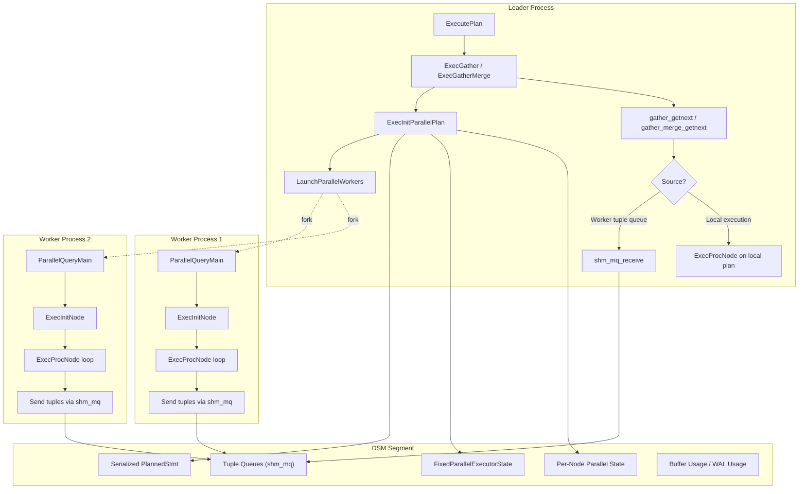
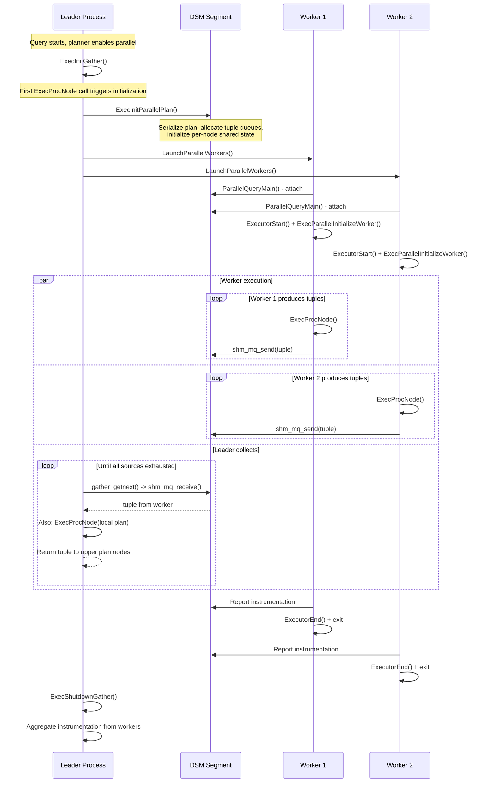
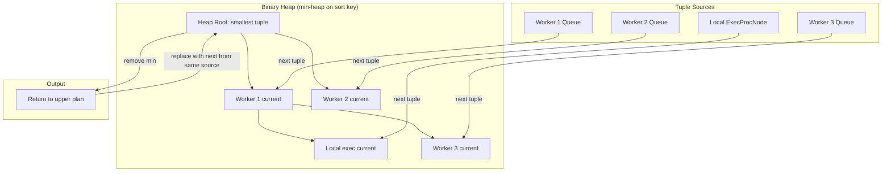

# Parallel Query Execution

## Overview

PostgreSQL's parallel query execution enables a single query to leverage multiple CPU cores by distributing work across parallel worker processes. The executor implements parallel query through two collection nodes (`Gather` and `GatherMerge`), a shared memory infrastructure (Dynamic Shared Memory segments), and a worker-side entry point (`ParallelQueryMain`). The leader process serializes the query plan into shared memory, launches worker processes, and collects result tuples via shared memory tuple queues.

Parallel-aware plan nodes (e.g., Parallel Seq Scan, Parallel Hash Join, Parallel Index Scan) coordinate work distribution among workers using shared state in DSM. Parallel-oblivious nodes run identical copies in each worker without coordination. The Gather and GatherMerge nodes sit above the parallel portion of the plan tree and merge results from all workers plus the leader's own local execution.

## Key Concepts

- **Dynamic Shared Memory (DSM)**: Shared memory segments allocated per-query for inter-process communication. Contains the serialized plan, tuple queues, and per-node parallel state.
- **Tuple Queues**: Shared memory ring buffers (`shm_mq`) used by workers to send result tuples to the leader.
- **Gather**: Collects tuples from parallel workers in arbitrary order (no ordering guarantee).
- **GatherMerge**: Collects tuples from parallel workers while preserving sort order using a binary heap merge.
- **Parallel-Aware vs Parallel-Oblivious**: Parallel-aware nodes coordinate work splitting (e.g., different workers scan different pages). Parallel-oblivious nodes run the same plan in each worker independently.
- **ParallelQueryMain**: Entry point for worker processes. Deserializes the plan from DSM and executes it.
- **Leader Participation**: The leader process also executes the parallel portion of the plan locally ("leader as worker") to avoid wasting a CPU core.

## Architecture



## Data Structures

### FixedParallelExecutorState

```c
/* src/backend/executor/execParallel.c:73-79 */
typedef struct FixedParallelExecutorState
{
    dsa_pointer param_exec;     /* PARAM_EXEC values in DSA */
    int         eflags;         /* executor flags */
    int         jit_flags;      /* JIT compilation flags */
} FixedParallelExecutorState;
```

This structure is stored at a fixed location within the DSM segment and provides the minimal state needed by workers to initialize their execution environment.

### SharedExecutorInstrumentation

```c
/* src/backend/executor/execParallel.c:97-108 */
typedef struct SharedExecutorInstrumentation
{
    int         instrument_options; /* EXPLAIN ANALYZE options */
    int         instrument_offset;  /* offset to per-node instrumentations */
    int         num_workers;        /* number of workers */
    int         num_plan_nodes;     /* number of plan nodes */
    /* followed by num_workers * num_plan_nodes Instrumentation structs */
} SharedExecutorInstrumentation;
```

Used to collect per-node execution statistics from all workers, aggregated by the leader for EXPLAIN ANALYZE output.

### PARALLEL_KEY Constants

```c
/* src/backend/executor/execParallel.c:57-66 */
#define PARALLEL_KEY_EXECUTOR_FIXED       UINT64CONST(0xE000000000000001)
#define PARALLEL_KEY_PLANNEDSTMT          UINT64CONST(0xE000000000000002)
#define PARALLEL_KEY_PARAMLISTINFO        UINT64CONST(0xE000000000000003)
#define PARALLEL_KEY_BUFFER_USAGE         UINT64CONST(0xE000000000000004)
#define PARALLEL_KEY_TUPLE_QUEUE          UINT64CONST(0xE000000000000005)
#define PARALLEL_KEY_INSTRUMENTATION      UINT64CONST(0xE000000000000006)
#define PARALLEL_KEY_DSA                  UINT64CONST(0xE000000000000007)
#define PARALLEL_KEY_QUERY_TEXT           UINT64CONST(0xE000000000000008)
#define PARALLEL_KEY_JIT_INSTRUMENTATION  UINT64CONST(0xE000000000000009)
#define PARALLEL_KEY_WAL_USAGE            UINT64CONST(0xE00000000000000A)
```

These keys are used with `shm_toc` (Table of Contents) to locate specific data structures within the DSM segment. Each worker uses these keys to find the plan, parameters, tuple queues, and other shared state.

## Core APIs

### ExecGather

#### Purpose

Collects tuples from parallel workers and the leader's own local execution of the parallel plan portion, returning them in arbitrary order.

#### Signature

```c
/* src/backend/executor/nodeGather.c:136-235 */
static TupleTableSlot *
ExecGather(PlanState *pstate)
```

#### Parameters

| Parameter | Type | Description | Constraints |
|-----------|------|-------------|-------------|
| pstate | PlanState * | Cast to GatherState internally | Required, non-NULL |

#### Return Value

Returns the next tuple from any worker or from local execution, or NULL when all sources are exhausted.

#### Detailed Description

The function implements lazy initialization of parallel workers and round-robin tuple collection:

1. **Lazy initialization** (lines 150-195): On the first call:
   - Calls `ExecInitParallelPlan()` to set up the DSM segment with the serialized plan, tuple queues, and per-node state
   - Calls `LaunchParallelWorkers()` to fork worker processes
   - Calls `ExecParallelSetupTupleQueues()` to create `TupleQueueReader` handles for each successfully launched worker
   - If no workers could be launched, falls through to local-only execution
   - Sets `initialized = true`

2. **Tuple collection** (lines 200-230): Calls `gather_getnext()` which implements the collection strategy:

   **gather_getnext()** (lines 255-298):
   - Uses `nextreader` index to round-robin between tuple queue readers
   - Calls `gather_readnext()` for the current reader
   - If no tuple is available from workers, falls back to local execution via `ExecProcNode(node->ps.lefttree)` (the leader executes the parallel plan subtree locally)
   - Once all workers have disconnected and local execution is complete, returns NULL

   **gather_readnext()** (lines 303-384):
   - Attempts a non-blocking read from the worker's `shm_mq` via `TupleQueueReaderNext()`
   - If a tuple is available, returns it immediately
   - If the worker has detached (finished), removes it from the reader list
   - If no data is ready, calls `WaitLatch()` to sleep until data arrives, then retries
   - This ensures the leader does not spin-wait, yielding the CPU when workers are slow

3. **Cleanup**: When the Gather node is done, calls `ExecShutdownGather()` which waits for all workers to finish and detaches from the DSM segment.

#### Integration Points

- **Called by**: ExecProcNode via function pointer
- **Calls**: ExecInitParallelPlan, LaunchParallelWorkers, ExecParallelSetupTupleQueues, gather_getnext, ExecProcNode (for local execution), ExecShutdownGather
- **Shared state**: DSM segment containing tuple queues, plan state, and instrumentation

---

### ExecGatherMerge

#### Purpose

Collects tuples from parallel workers while preserving the sort order of the underlying parallel plan. Uses a binary heap to perform an N-way merge of sorted streams.

#### Signature

```c
/* src/backend/executor/nodeGatherMerge.c:182-250 */
static TupleTableSlot *
ExecGatherMerge(PlanState *pstate)
```

#### Parameters

| Parameter | Type | Description | Constraints |
|-----------|------|-------------|-------------|
| pstate | PlanState * | Cast to GatherMergeState internally | Required, non-NULL |

#### Return Value

Returns the next tuple in sort order from across all workers, or NULL when complete.

#### Detailed Description

GatherMerge is structurally similar to Gather but adds sort-order preservation:

1. **Initialization**: Same as Gather -- initializes DSM, launches workers, sets up tuple queue readers.

2. **Binary heap setup**: Creates a `binaryheap` data structure with one slot per source (each worker queue + the local execution). Each slot is filled with the first available tuple from its source. The heap is ordered using `SortSupport` comparators matching the plan's sort keys.

3. **Tuple retrieval**: On each call:
   - Removes the minimum element from the heap (the globally smallest tuple across all sources)
   - Fetches the next tuple from the same source that provided the removed tuple
   - If a replacement tuple is available, inserts it into the heap
   - If the source is exhausted, the heap shrinks
   - Returns the removed tuple

4. **GMReaderTupleBuffer**: Each worker has a small tuple buffer (`GMReaderTupleBuffer`) that pre-reads tuples from the `shm_mq`. This batching reduces the overhead of per-tuple shared memory access.

```c
/* src/backend/executor/nodeGatherMerge.c (simplified) */
typedef struct GMReaderTupleBuffer
{
    HeapTuple  *tuple;      /* buffered tuples */
    int         nTuples;    /* number of buffered tuples */
    int         readCounter; /* next tuple to read */
    bool        done;        /* worker has finished */
} GMReaderTupleBuffer;
```

#### Performance Considerations

- GatherMerge adds O(log(W)) overhead per tuple for heap operations, where W is the number of workers
- The binary heap merge is efficient for small numbers of workers (typically 2-8)
- Pre-buffering in GMReaderTupleBuffer amortizes shared memory access overhead

---

### ExecInitParallelPlan

#### Purpose

Sets up the Dynamic Shared Memory segment for parallel query execution, including serializing the plan, allocating tuple queues, and initializing per-node parallel state.

#### Signature

```c
/* src/backend/executor/execParallel.c:586+ */
ParallelExecutorInfo *
ExecInitParallelPlan(PlanState *planstate, EState *estate,
                     Bitmapset *sendParams, int nworkers, int64 tuples_needed)
```

#### Detailed Description

The function performs these steps:

1. **Plan serialization** (via `ExecSerializePlan()`): Converts the `PlannedStmt` into a text string via `nodeToString()`. This serialized form is stored in the DSM segment and deserialized by each worker.

2. **DSM size estimation** (via `ExecParallelEstimate()`): Recursively walks the plan tree, calling each parallel-aware node's `ExecParallelEstimate` callback to determine how much DSM space it needs for shared state. Accumulates the total size needed.

3. **DSM allocation**: Creates a DSM segment large enough for:
   - Fixed executor state (`FixedParallelExecutorState`)
   - Serialized plan text
   - Parameter list
   - Tuple queues (one `shm_mq` per worker)
   - Per-node parallel state
   - Instrumentation arrays (for EXPLAIN ANALYZE)
   - Buffer usage and WAL usage arrays

4. **Per-node DSM initialization** (via `ExecParallelInitializeDSM()`): Recursively walks the plan tree, calling each parallel-aware node's `ExecParallelInitializeDSM` callback. Nodes like Parallel Seq Scan use this to set up shared scan position state.

5. **Tuple queue setup** (via `ExecParallelSetupTupleQueues()`): Creates one `shm_mq` per worker. Each queue is a circular buffer in shared memory with a single producer (worker) and single consumer (leader).

---

### ParallelQueryMain

#### Purpose

Entry point for parallel worker processes. Receives the DSM handle, deserializes the query plan, initializes the executor, runs the plan, and reports results back to the leader.

#### Signature

```c
/* src/backend/executor/execParallel.c:1383-1503 */
void
ParallelQueryMain(dsm_segment *seg, shm_toc *toc)
```

#### Parameters

| Parameter | Type | Description | Constraints |
|-----------|------|-------------|-------------|
| seg | dsm_segment * | The DSM segment handle | Required |
| toc | shm_toc * | Table of contents for finding data in DSM | Required |

#### Return Value

None (void). Results are communicated via shared memory tuple queues.

#### Detailed Description

Each worker process executes this function after being launched:

1. **Plan deserialization** (lines 1395-1420):
   - Locates the serialized `PlannedStmt` in DSM via `shm_toc_lookup(toc, PARALLEL_KEY_PLANNEDSTMT)`
   - Calls `stringToNode()` to reconstruct the plan tree
   - Restores parameters from `PARALLEL_KEY_PARAMLISTINFO`

2. **Executor initialization** (lines 1425-1450):
   - Creates a `QueryDesc` from the deserialized plan
   - Calls `ExecutorStart()` to build the execution state tree
   - Calls `ExecParallelInitializeWorker()` which walks the plan tree, calling each parallel-aware node's worker-side initialization callback. For example, Parallel Seq Scan attaches to the shared scan position.

3. **Plan execution** (lines 1455-1470):
   - Calls `ExecutorRun()` which drives `ExecProcNode()` on the plan tree
   - Tuples produced by the topmost plan node below Gather are sent through the tuple queue to the leader via `tqueueReceiveSlot()` (the DestReceiver for parallel workers)

4. **Instrumentation reporting** (lines 1475-1495):
   - If EXPLAIN ANALYZE is active, copies per-node `Instrumentation` data into the shared `SharedExecutorInstrumentation` array
   - Reports buffer usage and WAL usage statistics

5. **Cleanup** (lines 1498-1503):
   - Calls `ExecutorFinish()` and `ExecutorEnd()` to clean up
   - The DSM segment is automatically cleaned up when the worker process exits

## Processing Flow

### Parallel Query Lifecycle



### GatherMerge Binary Heap Operation



## Parallel-Aware Node Types

The following executor nodes have parallel-aware implementations:

| Node Type | Parallel Behavior | Coordination Mechanism |
|-----------|------------------|----------------------|
| SeqScan | Workers scan different pages | Shared page counter in DSM |
| IndexScan | Workers scan different index ranges | Shared `ParallelIndexScanDesc` |
| IndexOnlyScan | Same as IndexScan | Shared `ParallelIndexScanDesc` |
| BitmapHeapScan | Workers fetch different pages from shared bitmap | Shared `TBMSharedIterator` |
| Hash Join | Workers share hash table build and probe | Barrier-based phases (PHJ_BUILD_*) |
| Hash (build) | Workers partition inner tuples | Shared hash table in DSM |
| Append | Workers take different child plans | Shared child index counter |
| MergeAppend | Workers take different child plans | Shared child index counter |

## DSM Segment Layout

```
+-----------------------------------------------+
| Table of Contents (shm_toc)                    |
+-----------------------------------------------+
| PARALLEL_KEY_EXECUTOR_FIXED                    |
|   -> FixedParallelExecutorState                |
+-----------------------------------------------+
| PARALLEL_KEY_PLANNEDSTMT                       |
|   -> Serialized PlannedStmt (text)             |
+-----------------------------------------------+
| PARALLEL_KEY_PARAMLISTINFO                     |
|   -> Serialized ParamListInfo                  |
+-----------------------------------------------+
| PARALLEL_KEY_TUPLE_QUEUE                       |
|   -> Array of shm_mq (one per worker)          |
+-----------------------------------------------+
| PARALLEL_KEY_INSTRUMENTATION                   |
|   -> SharedExecutorInstrumentation             |
|   -> Instrumentation[nworkers * nnodes]        |
+-----------------------------------------------+
| PARALLEL_KEY_BUFFER_USAGE                      |
|   -> BufferUsage[nworkers]                     |
+-----------------------------------------------+
| PARALLEL_KEY_WAL_USAGE                         |
|   -> WalUsage[nworkers]                        |
+-----------------------------------------------+
| PARALLEL_KEY_DSA                               |
|   -> DSA (Dynamic Shared Area) handle          |
+-----------------------------------------------+
| Per-Node Parallel State                        |
|   (allocated by ExecParallelEstimate/          |
|    ExecParallelInitializeDSM per node)          |
+-----------------------------------------------+
```

## Implementation Notes

1. **Leader as worker**: The leader process also executes the parallel plan subtree locally. This is important because launching workers may fail (due to `max_worker_processes` limits) or workers may be slow to start. The leader's local execution ensures the query makes progress even without workers. In `gather_getnext()`, the leader alternates between checking worker queues and executing locally.

2. **Tuple queue flow control**: The `shm_mq` implementation provides natural flow control. If a worker produces tuples faster than the leader consumes them, the queue fills up and the worker blocks on `shm_mq_send()`. Conversely, if the leader is faster, it blocks on `shm_mq_receive()` until a worker produces data.

3. **Parallel safety**: Not all plan nodes are parallel-safe. The planner checks for parallel safety during planning and only places parallel-safe subtrees below Gather. Functions marked `PARALLEL UNSAFE` prevent parallelization. The `max_parallel_hazard` field tracks the worst parallel safety level in each subtree.

4. **Worker count determination**: The number of workers is determined by the planner based on table size and the `max_parallel_workers_per_gather` GUC. At execution time, `LaunchParallelWorkers()` may launch fewer workers than planned if `max_parallel_workers` is reached. The plan still works correctly with fewer workers (or none).

5. **Instrumentation aggregation**: For EXPLAIN ANALYZE, each worker's `Instrumentation` data is stored in the shared array indexed by `[worker_id * num_plan_nodes + node_id]`. After all workers complete, the leader aggregates these into the main plan's instrumentation, computing totals and per-worker breakdowns.

6. **Parameter passing**: `PARAM_EXEC` parameters (for subqueries and NestLoop parameterization) are serialized into DSA (Dynamic Shared Area) memory referenced from the `FixedParallelExecutorState`. Workers access these through the same `ecxt_param_exec_vals` mechanism as serial execution.

7. **Partial vs. complete results**: A Gather node above a Parallel Seq Scan produces partial results (each worker scans a subset of pages). Multiple partial results combine to form the complete result. A Gather above a non-parallel-aware node produces complete results (each worker runs the full subplan, but this is used only for parallel-oblivious scenarios where the input is already partial).
