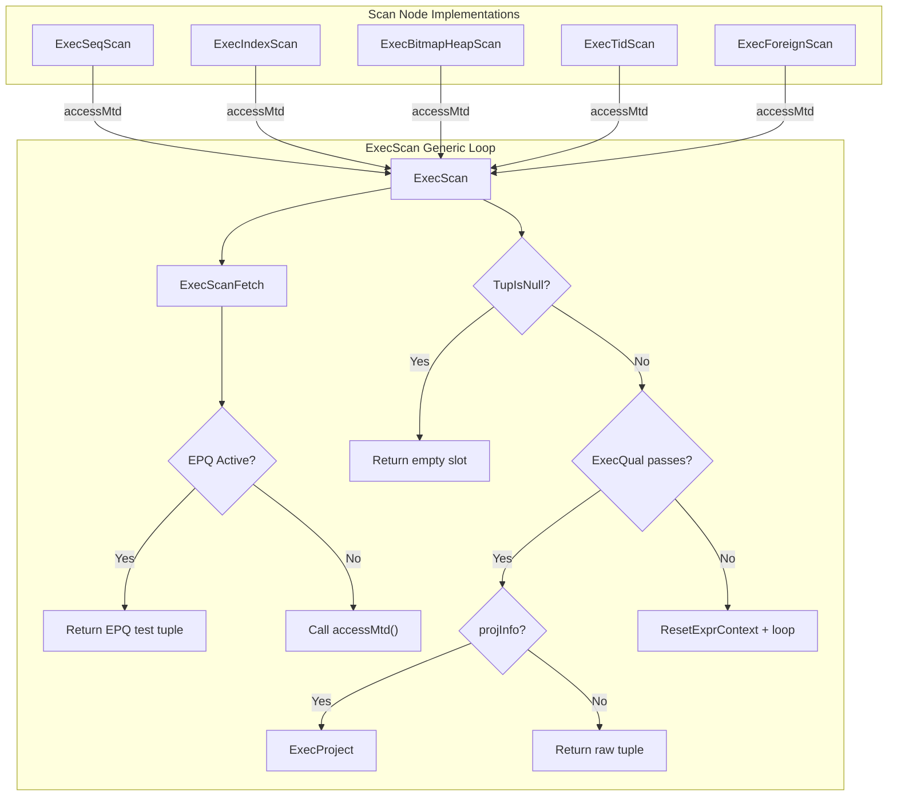
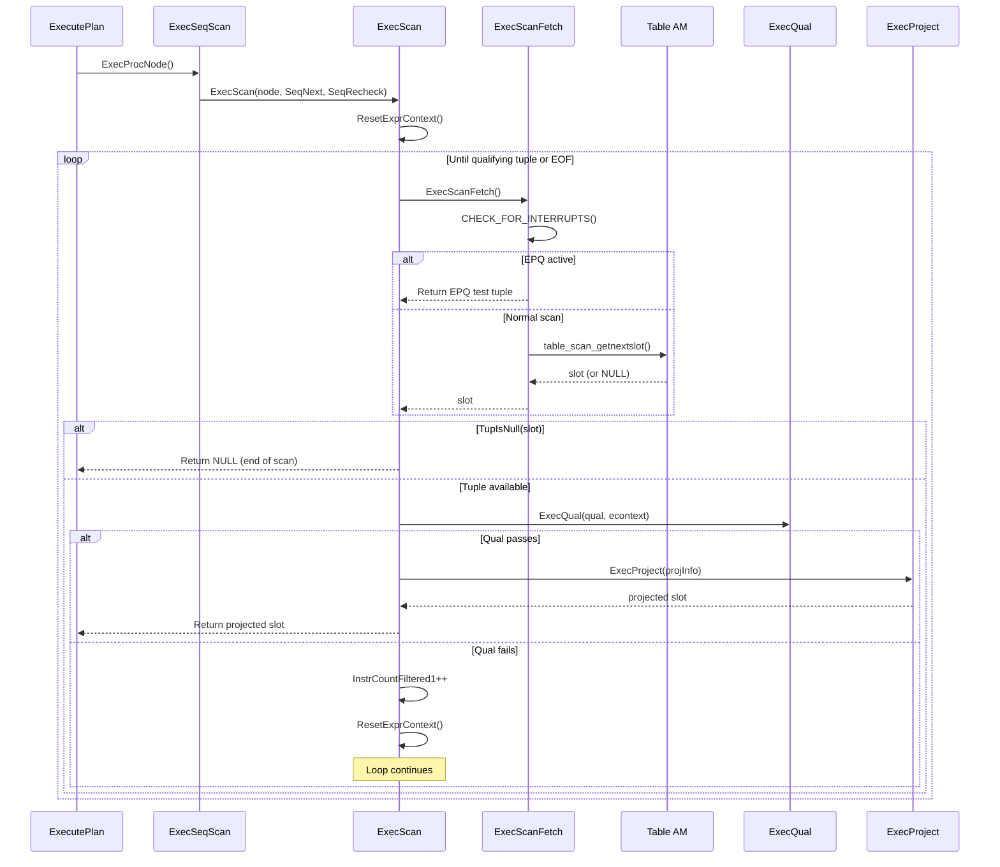

# Scan Infrastructure

## Overview

The scan infrastructure provides the generic framework that all 16 scan node types in PostgreSQL use to retrieve tuples from base relations. At its core is `ExecScan()`, a universal scan loop defined in `src/backend/executor/execScan.c` that implements the fetch-qualify-project pipeline. Each specific scan node (SeqScan, IndexScan, BitmapHeapScan, etc.) plugs into this framework by providing two callback functions: an access method that fetches the next raw tuple, and a recheck method that validates tuples under certain conditions such as EvalPlanQual rechecks.

This design cleanly separates the generic executor logic (qualification testing, projection, per-tuple memory management) from the storage-specific tuple retrieval logic, enabling PostgreSQL's pluggable Table AM and Index AM abstractions.

## Key Concepts

- **Volcano/Iterator Model**: Each scan node returns one tuple per call to `ExecProcNode()`, which internally delegates to `ExecScan()`.
- **ScanState**: Base execution state struct inherited by all scan nodes, holding the scan relation, scan descriptor, and scan tuple slot.
- **Table AM**: Pluggable storage abstraction (`tableam.h`) that allows different heap implementations (currently only heap AM is built-in).
- **Index AM**: Pluggable index access method (`indexam.c`) supporting B-tree, hash, GiST, SP-GiST, GIN, and BRIN.
- **EvalPlanQual (EPQ)**: Mechanism for rechecking tuples during concurrent UPDATE operations; `ExecScanFetch` handles EPQ substitution.

## Architecture



## Core APIs

### ExecScan

#### Purpose

Central scan execution function that coordinates the fetch-qualify-project pipeline for all scan node types. Every scan node in PostgreSQL delegates to this function with node-specific access and recheck callbacks.

#### Signature

```c
/* src/backend/executor/execScan.c:155-254 */
TupleTableSlot *
ExecScan(ScanState *node,
         ExecScanAccessMtd accessMtd,    /* function returning a tuple */
         ExecScanRecheckMtd recheckMtd)
```

#### Parameters

| Parameter | Type | Description | Constraints |
|-----------|------|-------------|-------------|
| node | ScanState * | Base scan state containing qual, projection info, and expression context | Required, non-NULL |
| accessMtd | ExecScanAccessMtd | Node-specific function that returns the next tuple from the data source | Required, non-NULL |
| recheckMtd | ExecScanRecheckMtd | Function to recheck tuples during EvalPlanQual processing | Required, non-NULL |

#### Return Value

Returns a `TupleTableSlot *` containing the next qualifying, projected tuple. Returns NULL (empty slot) when no more qualifying tuples exist.

#### Detailed Description

The function operates as an infinite loop that fetches tuples, tests them against the qualification predicate, and projects the result:

1. **Fast path check** (lines 177-181): If there is no qual and no projection, skip all overhead and return the raw scan tuple directly. This optimization avoids function call overhead for simple `SELECT *` queries.

2. **Per-tuple memory reset** (line 187): Calls `ResetExprContext(econtext)` to free expression evaluation storage from the previous tuple cycle. This is critical to prevent memory leaks during long scans.

3. **Fetch loop** (lines 193-253):
   - Calls `ExecScanFetch()` to obtain the next candidate tuple
   - If the slot is empty (NULL), returns an empty result slot
   - Sets `econtext->ecxt_scantuple` to the fetched tuple for expression evaluation
   - Evaluates the qualification via `ExecQual(qual, econtext)`
   - On pass: applies projection via `ExecProject()` or returns the raw tuple
   - On fail: increments `InstrCountFiltered1` (for EXPLAIN ANALYZE), resets the expression context, and loops

The key code section showing the qualification and projection:

```c
/* src/backend/executor/execScan.c:225-247 */
if (qual == NULL || ExecQual(qual, econtext))
{
    if (projInfo)
    {
        /* Form a projection tuple, store it in the result tuple slot */
        return ExecProject(projInfo);
    }
    else
    {
        /* Here, we aren't projecting, so just return scan tuple. */
        return slot;
    }
}
else
    InstrCountFiltered1(node, 1);
```

#### Integration Points

- **Called by**: ExecSeqScan, ExecIndexScan, ExecIndexOnlyScan, ExecBitmapHeapScan, ExecTidScan, ExecTidRangeScan, ExecSubqueryScan, ExecFunctionScan, ExecTableFuncScan, ExecValuesScan, ExecCteScan, ExecNamedTuplestoreScan, ExecWorkTableScan, ExecForeignScan, ExecSampleScan, ExecCustomScan (16 scan types total)
- **Calls**: ExecScanFetch, ExecQual, ExecProject, ResetExprContext, TupIsNull, ExecClearTuple, InstrCountFiltered1

### ExecScanFetch

#### Purpose

Internal helper that retrieves the next candidate tuple, handling EvalPlanQual (EPQ) substitution when the executor is rechecking a tuple due to a concurrent UPDATE.

#### Signature

```c
/* src/backend/executor/execScan.c:33-132 */
static inline TupleTableSlot *
ExecScanFetch(ScanState *node,
              ExecScanAccessMtd accessMtd,
              ExecScanRecheckMtd recheckMtd)
```

#### Detailed Description

The function first calls `CHECK_FOR_INTERRUPTS()` to handle cancel/die signals. It then checks whether the executor is inside an EvalPlanQual recheck (`estate->es_epq_active != NULL`). During EPQ rechecking:

- **scanrelid == 0**: For ForeignScan/CustomScan with pushed-down joins, the recheck method is responsible for providing the correct tuple.
- **relsubs_done[scanrelid-1] is true**: Returns an empty slot (already returned the EPQ tuple).
- **relsubs_slot[scanrelid-1] != NULL**: Returns the replacement tuple provided by the EPQ caller, after recheck validation.
- **relsubs_rowmark[scanrelid-1] != NULL**: Fetches the replacement tuple using a non-locking rowmark via `EvalPlanQualFetchRowMark`.

If no EPQ is active, it simply calls the node-specific `accessMtd(node)` to get the next tuple from the actual data source.

## Data Structures

### ScanState

The `ScanState` structure is the base execution state for all scan nodes. It extends `PlanState` (which provides the Volcano interface) with scan-specific fields.

```c
/* src/include/nodes/execnodes.h */
typedef struct ScanState
{
    PlanState   ps;                 /* Base plan state (qual, projection, etc.) */
    Relation    ss_currentRelation; /* Relation being scanned (NULL for non-table scans) */
    struct TableScanDescData *ss_currentScanDesc; /* Table AM scan descriptor */
    TupleTableSlot *ss_ScanTupleSlot; /* Slot holding the current scan tuple */
} ScanState;
```

Key fields:
- **ps.qual**: Compiled WHERE clause predicate, evaluated by `ExecQual()` inside `ExecScan()`
- **ps.ps_ProjInfo**: Projection info for target list evaluation; NULL if no projection needed
- **ps.ps_ExprContext**: Expression context providing per-tuple memory management
- **ss_currentRelation**: The open `Relation` handle (for table/index scans)
- **ss_currentScanDesc**: Opaque scan descriptor from the Table AM layer
- **ss_ScanTupleSlot**: Slot with the tuple descriptor matching the scanned relation

All specific scan state types (SeqScanState, IndexScanState, etc.) embed `ScanState` as their first member, enabling polymorphic dispatch.

### ExecScanAccessMtd and ExecScanRecheckMtd

```c
/* src/include/executor/executor.h */
typedef TupleTableSlot *(*ExecScanAccessMtd) (ScanState *node);
typedef bool (*ExecScanRecheckMtd) (ScanState *node, TupleTableSlot *slot);
```

Each scan node provides concrete implementations:
- **SeqScan**: `SeqNext` / `SeqRecheck` (nodeSeqscan.c)
- **IndexScan**: `IndexNext` / `IndexRecheck` (nodeIndexscan.c)
- **BitmapHeapScan**: `BitmapHeapNext` / `BitmapHeapRecheck` (nodeBitmapHeapscan.c)

## Table AM Abstraction

The Table Access Method (Table AM) layer provides a pluggable interface for tuple storage. The heap AM is the default and only built-in implementation in PostgreSQL 17.

### Key Table AM Functions

| Function | Purpose | Source |
|----------|---------|--------|
| `table_beginscan()` | Opens a scan on a table relation with specified snapshot and scan keys | `src/include/access/tableam.h` |
| `table_scan_getnextslot()` | Fetches the next tuple into a TupleTableSlot | `src/include/access/tableam.h` |
| `table_endscan()` | Closes the scan and releases resources | `src/include/access/tableam.h` |
| `table_rescan()` | Restarts the scan from the beginning | `src/include/access/tableam.h` |

The SeqScan node uses these in its access method:

```c
/* Simplified from src/backend/executor/nodeSeqscan.c */
static TupleTableSlot *
SeqNext(SeqScanState *node)
{
    TableScanDesc scandesc = node->ss.ss_currentScanDesc;
    TupleTableSlot *slot = node->ss.ss_ScanTupleSlot;

    if (scandesc == NULL)
    {
        scandesc = table_beginscan(node->ss.ss_currentRelation,
                                   estate->es_snapshot, 0, NULL);
        node->ss.ss_currentScanDesc = scandesc;
    }

    if (table_scan_getnextslot(scandesc, direction, slot))
        return slot;
    return NULL;
}
```

## Index AM Abstraction

The Index Access Method layer enables different index types (B-tree, Hash, GiST, etc.) to be used transparently by the executor.

### Key Index AM Functions

| Function | Purpose | Source |
|----------|---------|--------|
| `index_beginscan()` | Opens an index scan with the specified relation and scan keys | `src/backend/access/index/indexam.c` |
| `index_getnext_slot()` | Fetches the next matching tuple via the index | `src/backend/access/index/indexam.c` |
| `index_rescan()` | Restarts the index scan with new keys | `src/backend/access/index/indexam.c` |
| `index_endscan()` | Closes the index scan | `src/backend/access/index/indexam.c` |

### Index Scan Runtime Keys

For parameterized index scans (e.g., in nested loop joins), scan keys may depend on values from outer plan nodes. These are called "runtime keys" and are evaluated at each rescan:

- `ExecIndexEvalRuntimeKeys()`: Evaluates Param expressions to compute actual scan key values
- The scan is started or restarted with the newly computed keys
- This mechanism enables efficient index lookups driven by the nested loop outer tuple

### Index-Only Scans

Index-only scans (`ExecIndexOnlyScan`) avoid heap fetches when:
1. All required columns are available in the index
2. The visibility map confirms the heap page is all-visible

When the heap page is not all-visible, the scan falls back to fetching the heap tuple to check visibility.

## Bitmap Scan Two-Phase Execution

Bitmap scans operate in two distinct phases:

### Phase 1: Bitmap Construction

One or more `BitmapIndexScan` nodes build a TIDBitmap by scanning their respective indexes:

```
BitmapHeapScan
    -> BitmapAnd (or BitmapOr)
        -> BitmapIndexScan on idx_a
        -> BitmapIndexScan on idx_b
```

- `MultiExecBitmapIndexScan()` builds a `TIDBitmap` containing the TIDs of matching tuples
- `MultiExecBitmapAnd()` / `MultiExecBitmapOr()` combine multiple bitmaps using set intersection/union
- These nodes use `MultiExecProcNode()` rather than `ExecProcNode()` because they return a data structure rather than individual tuples

### Phase 2: Heap Fetch

`BitmapHeapScan` iterates over the bitmap and fetches matching heap pages:

- Pages are fetched in physical order (not index order), which is I/O-efficient
- **Exact pages**: The bitmap contains exact TIDs, so the recheck only needs to verify visibility
- **Lossy pages**: When the bitmap exceeds `work_mem`, it degrades to page-level granularity. All tuples on the page must be fetched and rechecked against the original index conditions
- **Prefetching**: The executor prefetches upcoming heap pages to overlap I/O with processing

### Parallel Bitmap Scan

In parallel mode, workers share a single `TBMSharedIterator`:
- One worker builds the bitmap (via `MultiExecProcNode`)
- All workers share the iterator, each fetching different pages
- The shared state is coordinated through a condition variable

## Scan Direction

The executor supports three scan directions, controlled by `ScanDirection`:

```c
/* src/include/access/sdir.h */
typedef enum ScanDirection
{
    BackwardScanDirection = -1,
    NoMovementScanDirection = 0,
    ForwardScanDirection = 1
} ScanDirection;
```

- **ForwardScanDirection**: Normal left-to-right scanning (default)
- **BackwardScanDirection**: Used by cursors with `FETCH BACKWARD`; requires `EXEC_FLAG_BACKWARD` to be set during initialization
- **NoMovementScanDirection**: Used by `FETCH CURRENT` in cursors

The `EXEC_FLAG_BACKWARD` flag is propagated during `ExecInitNode` to ensure that underlying access methods allocate the data structures needed for backward scanning (e.g., a reversible snapshot).

## ExecScanReScan

```c
/* src/backend/executor/execScan.c:296-345 */
void
ExecScanReScan(ScanState *node)
```

Called within the ReScan function of any scan node that uses `ExecScan()`. It clears the current scan tuple slot and resets EvalPlanQual state for the scan relation. This is essential for nested loop rescans and other cases where the scan must restart from the beginning.

## ExecAssignScanProjectionInfo

```c
/* src/backend/executor/execScan.c:269-276 */
void
ExecAssignScanProjectionInfo(ScanState *node)
```

Sets up projection info for a scan node. If the requested target list exactly matches the underlying tuple type (common for `SELECT *` or when join nodes above the scan do not require additional columns), `ps_ProjInfo` is set to NULL, enabling the fast path in `ExecScan()` that skips projection entirely.

## Processing Flow



## Implementation Notes

1. **Per-tuple memory management**: The `ResetExprContext()` call at the top of each loop iteration is critical. Without it, expression evaluation storage would accumulate and cause memory bloat during large scans.

2. **Interrupt checking**: `CHECK_FOR_INTERRUPTS()` is placed inside `ExecScanFetch()` rather than in the main loop, ensuring that even long-running access method calls can be interrupted.

3. **InstrCountFiltered1 vs InstrCountFiltered2**: `InstrCountFiltered1` counts tuples rejected by the scan node's own qual. `InstrCountFiltered2` (used in join nodes) counts tuples rejected by join quals. These counters appear in `EXPLAIN ANALYZE` output as "Rows Removed by Filter".

4. **Projection optimization**: The planner preferentially generates target lists that match the scan tuple descriptor, avoiding the overhead of projection. This is signaled by `ps_ProjInfo == NULL`.
