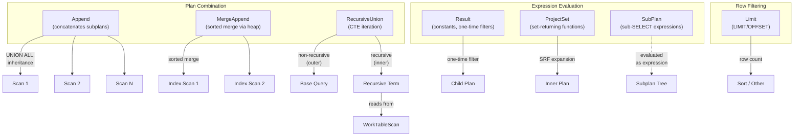
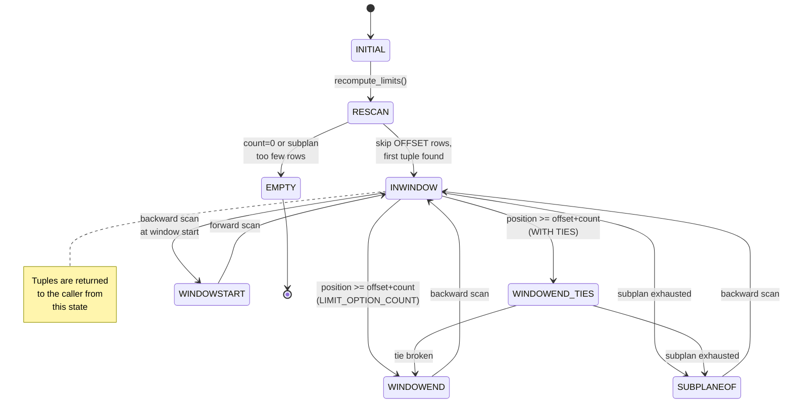
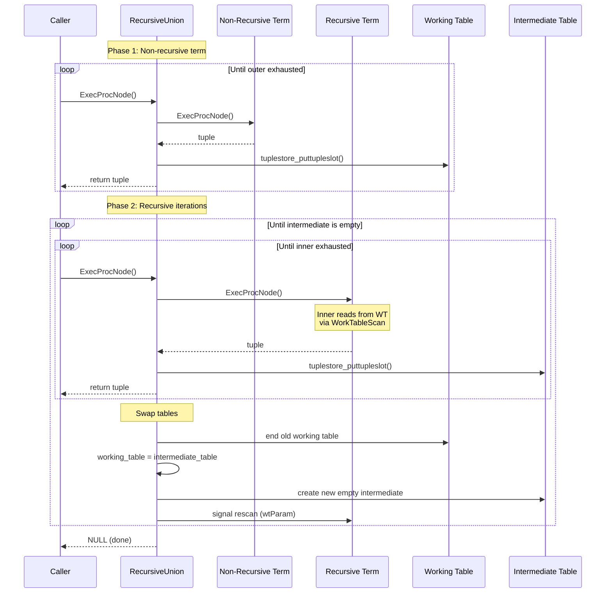

# Control and Utility Node Catalog

This document covers seven executor nodes that provide control flow, set-returning
function evaluation, plan combination, recursion, row limiting, and subplan
execution.

---

## Result

**Identity**
- NodeTag: `T_Result` / `T_ResultState`
- Plan struct: `Result` (`src/include/nodes/plannodes.h`)
- PlanState struct: `ResultState` (`src/include/nodes/execnodes.h`)
- Source: `src/backend/executor/nodeResult.c` (263 lines)

**Purpose**: Used in queries that require no table scan, or that have constant
qualifications (one-time filters). Common scenarios:
- `SELECT 1 + 2` (no FROM clause)
- `INSERT INTO t VALUES (...)` (generates the constant tuple)
- `SELECT * FROM t WHERE false` (constant-false filter eliminates all output)
- Projection-only nodes above other plan nodes

### Initialization (`ExecInitResult`)

```c
/* src/backend/executor/nodeResult.c:179 */
ResultState *
ExecInitResult(Result *node, EState *estate, int eflags)
```

1. Creates `ResultState`, sets `ExecProcNode = ExecResult`.
2. Sets `rs_done = false` and `rs_checkqual = (node->resconstantqual != NULL)`.
3. Creates an expression context.
4. Initializes the outer plan child (may be NULL for constant-generating Results).
5. Initializes result tuple slot with `TTSOpsVirtual` and projection info.
6. Initializes `qual` (regular filter) and `resconstantqual` (one-time filter).

### Execution (`ExecResult`)

```c
/* src/backend/executor/nodeResult.c:66 */
static TupleTableSlot *
ExecResult(PlanState *pstate)
```

Step-by-step:
1. If `rs_checkqual` is true (first call), evaluate the constant qualification
   via `ExecQual()`. If it evaluates to false, set `rs_done = true` and return
   NULL immediately. This is the "One-Time Filter" shown in EXPLAIN output.
2. Reset per-tuple memory context.
3. If not done:
   - If there is an outer plan, fetch the next tuple from it. If the outer plan
     is exhausted, return NULL.
   - If there is no outer plan (constant target list), set `rs_done = true`
     so we return only one tuple.
4. Apply projection via `ExecProject()` and return the result.

### End (`ExecEndResult`)

```c
/* src/backend/executor/nodeResult.c:239 */
void ExecEndResult(ResultState *node)
```

Shuts down the outer plan subnode.

### Rescan (`ExecReScanResult`)

Resets `rs_done` and `rs_checkqual` flags, then rescans the outer plan if needed.

### Key State Fields

| Field | Type | Description |
|-------|------|-------------|
| `rs_done` | `bool` | True after constant tuple returned or constant qual failed |
| `rs_checkqual` | `bool` | True if constant qual needs evaluation |
| `resconstantqual` | `ExprState *` | Compiled one-time filter expression |

### Performance

- **Time complexity**: O(N) where N is the number of tuples from the outer plan.
  For constant-generating Results, O(1).
- **Memory**: Minimal -- only an expression context.

### Parallel Support

Result is **parallel-safe** (can appear inside parallel workers).

### Example SQL

```sql
-- Constant expression, no table scan
SELECT 42 AS answer, now() AS ts;
```

```
EXPLAIN output:
 Result  (cost=0.00..0.01 rows=1 width=12)
```

```sql
-- One-Time Filter with constant-false qual
SELECT * FROM employees WHERE 1 = 0;
```

```
EXPLAIN output:
 Result  (cost=0.00..0.00 rows=0 width=40)
   One-Time Filter: false
```

---

## ProjectSet

**Identity**
- NodeTag: `T_ProjectSet` / `T_ProjectSetState`
- Plan struct: `ProjectSet` (`src/include/nodes/plannodes.h`)
- PlanState struct: `ProjectSetState` (`src/include/nodes/execnodes.h`)
- Source: `src/backend/executor/nodeProjectSet.c` (351 lines)

**Purpose**: Evaluates set-returning functions (SRFs) in the target list. The
planner guarantees that SRFs appear only at the top level of the target list --
never nested inside other expressions. If multiple SRFs return different numbers
of rows, shorter ones are padded with NULLs until the longest one is exhausted.

### Initialization (`ExecInitProjectSet`)

```c
/* src/backend/executor/nodeProjectSet.c:226 */
ProjectSetState *
ExecInitProjectSet(ProjectSet *node, EState *estate, int eflags)
```

1. Creates `ProjectSetState`, sets `pending_srf_tuples = false`.
2. Creates expression context and a separate `argcontext` memory context for
   SRF argument evaluation (longer-lived than per-tuple context).
3. Initializes outer plan.
4. Allocates `elems[]` and `elemdone[]` arrays of length `nelems` (number of
   target list entries).
5. For each target list entry, initializes either a `SetExprState` (for SRFs)
   or a regular `ExprState` (for non-SRF expressions).

### Execution (`ExecProjectSet`)

```c
/* src/backend/executor/nodeProjectSet.c:41 */
static TupleTableSlot *
ExecProjectSet(PlanState *pstate)
```

Step-by-step:
1. Reset per-tuple memory context.
2. If `pending_srf_tuples` is true (continuing to produce rows from a previous
   input tuple), call `ExecProjectSRF(node, true)`. If a row is produced, return it.
3. Fetch the next input tuple from the outer plan.
4. Call `ExecProjectSRF(node, false)` to begin evaluating SRFs for the new input.
5. If the SRFs produce no rows (empty set), loop back to fetch another input tuple.

The inner function `ExecProjectSRF()` iterates over all target list elements:
- For SRF elements, calls `ExecMakeFunctionResultSet()` which returns the next
  value and an `ExprDoneCond` indicator.
- If any SRF returns `ExprMultipleResult`, sets `pending_srf_tuples = true`.
- Exhausted SRFs return NULL values while other SRFs continue producing.
- When ALL SRFs return `ExprEndResult`, the input tuple is considered consumed.

### End (`ExecEndProjectSet`)

Shuts down the outer plan.

### Rescan (`ExecReScanProjectSet`)

Resets `pending_srf_tuples` and rescans the outer plan.

### Key State Fields

| Field | Type | Description |
|-------|------|-------------|
| `pending_srf_tuples` | `bool` | True when more rows pending from current input |
| `nelems` | `int` | Number of target list entries |
| `elems` | `Node **` | Array of ExprState/SetExprState per target entry |
| `elemdone` | `ExprDoneCond *` | Per-element done status |
| `argcontext` | `MemoryContext` | Longer-lived context for SRF arguments |

### Performance

- **Time complexity**: O(N * R) where N is input rows and R is the average number
  of result rows produced per SRF invocation.
- **Memory**: The `argcontext` persists across SRF calls for one input tuple.

### Parallel Support

ProjectSet is **parallel-safe**.

### Example SQL

```sql
-- generate_series is a set-returning function
SELECT generate_series(1, 5) AS n;
```

```
EXPLAIN output:
 ProjectSet  (cost=0.00..0.05 rows=5 width=4)
   ->  Result  (cost=0.00..0.01 rows=1 width=0)
```

```sql
-- Multiple SRFs: cross-product-like behavior
SELECT generate_series(1, 3) AS a, unnest(ARRAY['x','y']) AS b;
```

```
EXPLAIN output:
 ProjectSet  (cost=0.00..0.07 rows=3 width=36)
   ->  Result  (cost=0.00..0.01 rows=1 width=0)
```

---

## Append

**Identity**
- NodeTag: `T_Append` / `T_AppendState`
- Plan struct: `Append` (`src/include/nodes/plannodes.h`)
- PlanState struct: `AppendState` (`src/include/nodes/execnodes.h`)
- Source: `src/backend/executor/nodeAppend.c` (1,206 lines)

**Purpose**: Concatenates results from multiple subplans. Used for:
- `UNION ALL` queries
- Inheritance / partitioned table scans
- Queries on tables with multiple child relations

Supports three modes of operation:
- **Local sequential**: iterates subplans one at a time.
- **Parallel-aware**: coordinates subplan assignment across parallel workers
  using shared state in DSM.
- **Asynchronous**: for FDW subplans that support async execution.

### Initialization (`ExecInitAppend`)

```c
/* src/backend/executor/nodeAppend.c:108 */
AppendState *
ExecInitAppend(Append *node, EState *estate, int eflags)
```

1. Creates `AppendState`, sets `as_whichplan = INVALID_SUBPLAN_INDEX`.
2. If runtime partition pruning is enabled, calls `ExecInitPartitionPruning()`
   to determine which subplans to initialize (`validsubplans` bitmapset).
3. Initializes result tuple slot (not fixed, since slots come from subplans).
4. Calls `ExecInitNode()` on each valid subplan.
5. Identifies async-capable subplans and sets up `AsyncRequest` structures.
6. Sets `choose_next_subplan = choose_next_subplan_locally` (overridden for
   parallel mode).

### Execution (`ExecAppend`)

```c
/* src/backend/executor/nodeAppend.c:287 */
static TupleTableSlot *
ExecAppend(PlanState *pstate)
```

1. On first call, optionally begins async subplans and selects the first sync
   subplan via `choose_next_subplan()`.
2. Main loop:
   - If async subplans have pending results, try `ExecAppendAsyncGetNext()`.
   - Execute the current sync subplan via `ExecProcNode()`.
   - If the subplan returns a tuple, return it directly.
   - If the subplan is exhausted, wait for async events if any, then call
     `choose_next_subplan()` to advance.
   - If no more sync or async subplans, return empty slot.

### Parallel Append Support

Parallel Append uses `ParallelAppendState` in shared memory:

```c
/* src/backend/executor/nodeAppend.c:69 */
struct ParallelAppendState
{
    LWLock      pa_lock;
    int         pa_next_plan;
    bool        pa_finished[FLEXIBLE_ARRAY_MEMBER];
};
```

- **Leader** (`choose_next_subplan_for_leader`): Picks subplans from the end
  (cheapest first for workers), marking non-partial plans as finished immediately.
- **Worker** (`choose_next_subplan_for_worker`): Advances through valid subplans
  under the pa_lock. Non-partial plans get assigned to exactly one worker. Partial
  plans can be shared across multiple workers.

### End (`ExecEndAppend`)

Calls `ExecEndNode()` on each subplan.

### Rescan (`ExecReScanAppend`)

Resets `as_whichplan`, `as_begun`, and async state. If runtime pruning parameters
changed, invalidates `as_valid_subplans`. Rescans each subplan as needed.

### Key State Fields

| Field | Type | Description |
|-------|------|-------------|
| `as_whichplan` | `int` | Index of currently executing subplan |
| `as_nplans` | `int` | Total number of initialized subplans |
| `appendplans` | `PlanState **` | Array of subplan states |
| `as_first_partial_plan` | `int` | Index of first partial (parallel-safe) subplan |
| `as_prune_state` | `PartitionPruneState *` | Runtime pruning state |
| `as_valid_subplans` | `Bitmapset *` | Currently valid subplan indices |
| `choose_next_subplan` | `function pointer` | Strategy for subplan selection |

### Performance

- **Time complexity**: O(sum of all subplan outputs).
- **Memory**: Minimal -- just the subplan state array.
- **Runtime pruning**: Can dramatically reduce the number of subplans that need
  execution based on parameter values.

### Parallel Support

Append is **parallel-aware**. It coordinates subplan assignment across workers
using shared memory and an LWLock.

### Example SQL

```sql
-- UNION ALL uses Append
SELECT name FROM employees UNION ALL SELECT name FROM contractors;
```

```
EXPLAIN output:
 Append  (cost=0.00..50.00 rows=2000 width=32)
   ->  Seq Scan on employees  (cost=0.00..25.00 rows=1000 width=32)
   ->  Seq Scan on contractors  (cost=0.00..25.00 rows=1000 width=32)
```

```sql
-- Partitioned table scan with runtime pruning
SELECT * FROM orders WHERE order_date = '2024-01-15';
```

```
EXPLAIN output:
 Append  (cost=0.00..15.00 rows=5 width=40)
   Subplans Removed: 11
   ->  Seq Scan on orders_2024_01  (cost=0.00..15.00 rows=5 width=40)
         Filter: (order_date = '2024-01-15'::date)
```

---

## MergeAppend

**Identity**
- NodeTag: `T_MergeAppend` / `T_MergeAppendState`
- Plan struct: `MergeAppend` (`src/include/nodes/plannodes.h`)
- PlanState struct: `MergeAppendState` (`src/include/nodes/execnodes.h`)
- Source: `src/backend/executor/nodeMergeAppend.c` (378 lines)

**Purpose**: Like Append, but preserves sort order across subplans. Each subplan
must produce pre-sorted output according to the same sort key. MergeAppend merges
these streams using a binary heap, producing a globally sorted output. Used for:
- Sorted scans over partitioned tables where each partition has an index on the
  sort key.
- `UNION ALL` with `ORDER BY` when subplans are already sorted.

### Initialization (`ExecInitMergeAppend`)

```c
/* src/backend/executor/nodeMergeAppend.c:64 */
MergeAppendState *
ExecInitMergeAppend(MergeAppend *node, EState *estate, int eflags)
```

1. Handles runtime partition pruning like Append.
2. Allocates `ms_slots[]` (one per subplan) and a binary heap via
   `binaryheap_allocate()`.
3. Initializes `SortSupportData` for each sort key column.
4. Sets `ms_initialized = false` -- first-tuple fetch deferred until execution.

### Execution (`ExecMergeAppend`)

```c
/* src/backend/executor/nodeMergeAppend.c:199 */
static TupleTableSlot *
ExecMergeAppend(PlanState *pstate)
```

1. On first call: pulls one tuple from each valid subplan and adds them to the
   binary heap via `binaryheap_add_unordered()`, then `binaryheap_build()`.
2. On subsequent calls: the top-of-heap subplan produced the last returned tuple.
   Fetch the next tuple from that subplan:
   - If it produces a tuple, `binaryheap_replace_first()` to re-heapify.
   - If exhausted, `binaryheap_remove_first()` to remove it.
3. Return the tuple at the top of the heap.

The comparison function:

```c
/* src/backend/executor/nodeMergeAppend.c:272 */
static int32
heap_compare_slots(Datum a, Datum b, void *arg)
```

Compares slots from two subplans using the sort key columns. Results are inverted
(`INVERT_COMPARE_RESULT`) because the binary heap is a max-heap but we want the
minimum tuple.

### End (`ExecEndMergeAppend`)

Calls `ExecEndNode()` on each subplan.

### Rescan (`ExecReScanMergeAppend`)

Invalidates runtime pruning if parameters changed, rescans subplans, resets the
binary heap, and sets `ms_initialized = false`.

### Key State Fields

| Field | Type | Description |
|-------|------|-------------|
| `ms_nplans` | `int` | Number of merge subplans |
| `mergeplans` | `PlanState **` | Array of subplan states |
| `ms_slots` | `TupleTableSlot **` | Current tuple from each subplan |
| `ms_heap` | `binaryheap *` | Min-heap of subplan indices |
| `ms_nkeys` | `int` | Number of sort key columns |
| `ms_sortkeys` | `SortSupport` | Sort key comparison data |
| `ms_initialized` | `bool` | Whether first-tuple-from-each-subplan is done |

### Performance

- **Time complexity**: O(N * log K) where N is total tuples and K is number of
  subplans. Each tuple extraction requires a heap sift-down of O(log K).
- **Memory**: O(K) for the heap array and current-tuple slots.

### Parallel Support

MergeAppend is **not parallel-aware** (unlike Append). It does not have shared
state coordination.

### Example SQL

```sql
-- Sorted scan over partitioned table with indexed columns
SELECT * FROM events ORDER BY event_time LIMIT 10;
```

```
EXPLAIN output:
 Limit  (cost=0.56..1.65 rows=10 width=40)
   ->  Merge Append  (cost=0.56..1000.00 rows=9200 width=40)
         Sort Key: events.event_time
         ->  Index Scan using events_2024_01_idx on events_2024_01
         ->  Index Scan using events_2024_02_idx on events_2024_02
         ->  Index Scan using events_2024_03_idx on events_2024_03
```

---

## RecursiveUnion

**Identity**
- NodeTag: `T_RecursiveUnion` / `T_RecursiveUnionState`
- Plan struct: `RecursiveUnion` (`src/include/nodes/plannodes.h`)
- PlanState struct: `RecursiveUnionState` (`src/include/nodes/execnodes.h`)
- Source: `src/backend/executor/nodeRecursiveunion.c` (332 lines)

**Purpose**: Implements recursive common table expressions (`WITH RECURSIVE`).
The outer plan is the non-recursive (base) term and the inner plan is the recursive
term. Uses two tuplestores: a working table (current iteration's input) and an
intermediate table (current iteration's output). For `UNION` (not `UNION ALL`),
a hash table deduplicates results.

### Initialization (`ExecInitRecursiveUnion`)

```c
/* src/backend/executor/nodeRecursiveunion.c:166 */
RecursiveUnionState *
ExecInitRecursiveUnion(RecursiveUnion *node, EState *estate, int eflags)
```

1. Creates state, sets `recursing = false`, `intermediate_empty = true`.
2. Creates empty `working_table` and `intermediate_table` tuplestores
   (using `work_mem` as the memory limit).
3. If `numCols > 0` (UNION, not UNION ALL), creates a `tempContext` for hash
   comparisons and a `tableContext` for the hash table, then builds the hash table.
4. Stores a pointer to itself in the Param slot (`wtParam`) so that descendant
   `WorkTableScan` nodes can access the working table.
5. Initializes both outer (non-recursive) and inner (recursive) child plans.

### Execution (`ExecRecursiveUnion`)

```c
/* src/backend/executor/nodeRecursiveunion.c:74 */
static TupleTableSlot *
ExecRecursiveUnion(PlanState *pstate)
```

The algorithm follows the SQL standard recursive CTE semantics:

**Phase 1: Non-recursive term** (`recursing == false`):
1. Fetch tuples from the outer plan.
2. If UNION (not ALL), check the hash table for duplicates.
3. Store each unique tuple in the working table AND return it to the caller.
4. When the outer plan is exhausted, set `recursing = true`.

**Phase 2: Recursive term** (`recursing == true`):
1. Fetch tuples from the inner plan (which reads from the working table via
   `WorkTableScan`).
2. When the inner plan is exhausted:
   - If the intermediate table is empty, the recursion is complete -- return NULL.
   - Otherwise, swap: `working_table = intermediate_table`, create a new empty
     intermediate table, signal the inner plan to rescan (via `wtParam`), and continue.
3. For each tuple from the inner plan:
   - Check the hash table for duplicates (if UNION).
   - Store unique tuples in the intermediate table AND return them.

```c
/* Core swap logic (src/backend/executor/nodeRecursiveunion.c:122-138) */
tuplestore_end(node->working_table);
node->working_table = node->intermediate_table;
node->intermediate_table = tuplestore_begin_heap(false, false, work_mem);
node->intermediate_empty = true;
innerPlan->chgParam = bms_add_member(innerPlan->chgParam, plan->wtParam);
```

### End (`ExecEndRecursiveUnion`)

Releases both tuplestores and the hash table memory contexts. Ends both child plans.

### Rescan (`ExecReScanRecursiveUnion`)

Resets `recursing = false`, clears both tuplestores, resets the hash table, and
signals the inner plan to rescan.

### Key State Fields

| Field | Type | Description |
|-------|------|-------------|
| `recursing` | `bool` | True when evaluating the recursive term |
| `working_table` | `Tuplestorestate *` | Input to current iteration of recursive term |
| `intermediate_table` | `Tuplestorestate *` | Output of current iteration |
| `intermediate_empty` | `bool` | True if no tuples written to intermediate |
| `hashtable` | `TupleHashTable` | Dedup hash table (NULL for UNION ALL) |
| `tempContext` | `MemoryContext` | Per-lookup scratch context for hashing |
| `tableContext` | `MemoryContext` | Long-lived context for hash table entries |

### Performance

- **Time complexity**: O(T * H) where T is total tuples produced across all
  iterations and H is the hash table lookup cost per tuple (O(1) amortized).
- **Memory**: Working and intermediate tuplestores each bounded by `work_mem`.
  The hash table grows with the number of unique tuples (unbounded for deeply
  recursive queries).
- **Termination**: There is no automatic cycle detection. Infinite recursion will
  run until hitting resource limits.

### Parallel Support

RecursiveUnion is **not parallel-safe**. The iterative working-table swap protocol
is inherently sequential.

### Example SQL

```sql
-- Organizational hierarchy traversal
WITH RECURSIVE subordinates AS (
    SELECT id, name, manager_id FROM employees WHERE id = 1
    UNION ALL
    SELECT e.id, e.name, e.manager_id
    FROM employees e
    JOIN subordinates s ON e.manager_id = s.id
)
SELECT * FROM subordinates;
```

```
EXPLAIN output:
 CTE Scan on subordinates  (cost=...)
   CTE subordinates
     ->  Recursive Union  (cost=...)
           ->  Index Scan using employees_pkey on employees
                 Index Cond: (id = 1)
           ->  Hash Join  (cost=...)
                 Hash Cond: (e.manager_id = s.id)
                 ->  Seq Scan on employees e
                 ->  Hash
                       ->  WorkTable Scan on subordinates s
```

---

## Limit

**Identity**
- NodeTag: `T_Limit` / `T_LimitState`
- Plan struct: `Limit` (`src/include/nodes/plannodes.h`)
- PlanState struct: `LimitState` (`src/include/nodes/execnodes.h`)
- Source: `src/backend/executor/nodeLimit.c` (559 lines)

**Purpose**: Implements `LIMIT` and `OFFSET` clauses, including the
`FETCH FIRST ... WITH TIES` variant. Uses a state machine to track position
within the result window.

### Initialization (`ExecInitLimit`)

```c
/* src/backend/executor/nodeLimit.c:446 */
LimitState *
ExecInitLimit(Limit *node, EState *estate, int eflags)
```

1. Creates `LimitState`, sets `lstate = LIMIT_INITIAL`.
2. Creates an expression context (for evaluating LIMIT/OFFSET expressions).
3. Initializes the outer plan.
4. Compiles `limitOffset` and `limitCount` expressions.
5. For `WITH TIES`, initializes a `last_slot` to remember the last in-window
   tuple and an `eqfunction` for tie detection.
6. Sets `ps_ProjInfo = NULL` -- Limit passes through tuples unchanged.

### Execution (`ExecLimit`)

```c
/* src/backend/executor/nodeLimit.c:39 */
static TupleTableSlot *
ExecLimit(PlanState *pstate)
```

The implementation is a state machine with these states:

| State | Meaning |
|-------|---------|
| `LIMIT_INITIAL` | Not yet evaluated LIMIT/OFFSET expressions |
| `LIMIT_RESCAN` | Evaluated; skipping OFFSET rows |
| `LIMIT_EMPTY` | Count is 0 or subplan returned too few rows |
| `LIMIT_INWINDOW` | Returning rows within the LIMIT window |
| `LIMIT_WINDOWEND` | Passed the end of the window |
| `LIMIT_WINDOWEND_TIES` | At end of window, checking for ties |
| `LIMIT_SUBPLANEOF` | Subplan exhausted before window end |
| `LIMIT_WINDOWSTART` | Backed off start of window (backward scan) |

Key transitions:
- **LIMIT_INITIAL -> LIMIT_RESCAN**: Calls `recompute_limits()` to evaluate
  LIMIT/OFFSET expressions and notify child nodes of the tuple bound via
  `ExecSetTupleBound()`.
- **LIMIT_RESCAN -> LIMIT_INWINDOW**: Skips OFFSET rows by fetching and
  discarding them, then returns the first in-window tuple.
- **LIMIT_INWINDOW**: Forward scan returns tuples and increments `position`.
  When `position - offset >= count`, transitions to `LIMIT_WINDOWEND` (or
  `LIMIT_WINDOWEND_TIES` for WITH TIES).
- **LIMIT_WINDOWEND_TIES**: Continues returning tuples that tie with the last
  in-window tuple (compared using `eqfunction`).

The `recompute_limits()` function (line 353) evaluates the LIMIT and OFFSET
expressions, handling NULL values (NULL OFFSET = 0, NULL COUNT = no limit).

### End (`ExecEndLimit`)

Ends the outer plan.

### Rescan (`ExecReScanLimit`)

Calls `recompute_limits()` to re-evaluate expressions, then rescans the outer plan.

### Key State Fields

| Field | Type | Description |
|-------|------|-------------|
| `lstate` | `LimitStateCond` | Current state machine state |
| `offset` | `int64` | Evaluated OFFSET value |
| `count` | `int64` | Evaluated LIMIT value |
| `noCount` | `bool` | True if no LIMIT (unlimited) |
| `position` | `int64` | Current position in result stream |
| `subSlot` | `TupleTableSlot *` | Last tuple fetched from subplan |
| `limitOption` | `LimitOption` | LIMIT_OPTION_COUNT or LIMIT_OPTION_WITH_TIES |
| `last_slot` | `TupleTableSlot *` | Last in-window tuple (for WITH TIES) |
| `eqfunction` | `ExprState *` | Tie-detection equality function |

### Performance

- **Time complexity**: O(OFFSET + COUNT) tuples fetched from the subplan.
  Remaining tuples are never fetched.
- **Memory**: Constant -- just the state machine fields and one extra slot for
  WITH TIES.
- **Optimization**: `ExecSetTupleBound()` propagates the tuple limit down to
  child nodes (e.g., Sort can use a top-N heapsort instead of a full sort).

### Parallel Support

Limit is **not parallel-safe** (position tracking is process-local). However,
`ExecSetTupleBound()` can propagate limits to parallel-aware children.

### Example SQL

```sql
-- Basic LIMIT/OFFSET
SELECT * FROM products ORDER BY price LIMIT 10 OFFSET 20;
```

```
EXPLAIN output:
 Limit  (cost=50.00..52.50 rows=10 width=40)
   ->  Sort  (cost=50.00..75.00 rows=1000 width=40)
         Sort Key: price
         ->  Seq Scan on products  (cost=0.00..25.00 rows=1000 width=40)
```

```sql
-- FETCH FIRST WITH TIES
SELECT * FROM scores ORDER BY score DESC FETCH FIRST 3 ROWS WITH TIES;
```

```
EXPLAIN output:
 Limit  (cost=50.00..50.08 rows=3 width=12)
   ->  Sort  (cost=50.00..52.50 rows=1000 width=12)
         Sort Key: score DESC
         ->  Seq Scan on scores
```

---

## SubPlan

**Identity**
- NodeTag: `T_SubPlan` / `T_SubPlanState`
- Plan struct: `SubPlan` (`src/include/nodes/primnodes.h`)
- PlanState struct: `SubPlanState` (`src/include/nodes/execnodes.h`)
- Source: `src/backend/executor/nodeSubplan.c` (1,329 lines)

**Purpose**: Executes sub-SELECT expressions that appear in WHERE clauses, target
lists, or HAVING clauses. SubPlans are divided into:
- **InitPlans**: Executed once per query (no correlated variables).
- **Regular SubPlans**: Re-executed for each outer row (correlated or uncorrelated).
- SubPlans handle these SQL sub-link types: `EXISTS`, `ANY`/`IN`, `ALL`, `EXPR`
  (scalar subquery), `ARRAY`, `ROWCOMPARE`, `MULTIEXPR`, and `CTE`.

Note: SubPlan is not a standard plan node dispatched through `ExecProcNode`. It is
evaluated as an expression node. The plan tree for the subquery is initialized
separately and linked via `SubPlanState.planstate`.

### Initialization (`ExecInitSubPlan`)

```c
/* src/backend/executor/nodeSubplan.c:822 */
SubPlanState *
ExecInitSubPlan(SubPlan *subplan, PlanState *parent)
```

1. Creates `SubPlanState` and links it to the already-initialized subplan via
   `es_subplanstates`.
2. Initializes `testexpr` (the combining expression for ANY/ALL) and `args`
   (correlated parameter expressions).
3. For InitPlans, marks output parameters as needing lazy evaluation by setting
   `prm->execPlan = sstate`.
4. For hash-based evaluation (`useHashTable = true`):
   - Creates `hashtablecxt` and `hashtempcxt` memory contexts.
   - Builds left and right projection nodes for hashing.
   - Sets up equality and hash functions for cross-type comparisons.

### Execution (`ExecSubPlan`)

```c
/* src/backend/executor/nodeSubplan.c:61 */
Datum
ExecSubPlan(SubPlanState *node, ExprContext *econtext, bool *isNull)
```

Two evaluation strategies:

**Hash strategy** (`ExecHashSubPlan`):
1. On first call (or when parameters change), scans the entire subquery and loads
   results into a hash table.
2. For each outer row, evaluates the LHS expressions and probes the hash table:
   - If all LHS values are non-NULL and a match is found, returns TRUE.
   - If the LHS has NULLs, scans the `hashnulls` table for partial matches.
   - Returns FALSE or UNKNOWN (NULL) as appropriate for SQL semantics.

**Scan strategy** (`ExecScanSubPlan`):
1. Sets correlated parameters from the current outer row.
2. Calls `ExecReScan()` on the subplan to reset it.
3. Iterates over subplan output:
   - `EXISTS_SUBLINK`: Returns TRUE on first tuple, FALSE on no tuples.
   - `EXPR_SUBLINK`: Returns the first column of the single tuple (error if >1).
   - `ANY_SUBLINK`: Evaluates combining expression per row, OR-combines results.
   - `ALL_SUBLINK`: Evaluates combining expression per row, AND-combines results.
   - `ARRAY_SUBLINK`: Collects all first-column values into an array.

### InitPlan Lazy Evaluation (`ExecSetParamPlan`)

```c
/* src/backend/executor/nodeSubplan.c:1091 */
void
ExecSetParamPlan(SubPlanState *node, ExprContext *econtext)
```

Called when an InitPlan's output parameter is first referenced. Runs the subplan
and stores results in `es_param_exec_vals`. Clears `execPlan` to prevent
re-execution.

### Key State Fields

| Field | Type | Description |
|-------|------|-------------|
| `subplan` | `SubPlan *` | The plan-time SubPlan node |
| `planstate` | `PlanState *` | Initialized plan tree for the subquery |
| `testexpr` | `ExprState *` | Compiled combining expression (ANY/ALL) |
| `args` | `List *` | Compiled correlated parameter expressions |
| `hashtable` | `TupleHashTable` | Hash table for hash-based evaluation |
| `hashnulls` | `TupleHashTable` | Separate table for partially-NULL rows |
| `projLeft` | `ProjectionInfo *` | LHS projection for hashing |
| `projRight` | `ProjectionInfo *` | RHS projection for hashing |
| `curTuple` | `HeapTuple` | Saved copy of current subplan output tuple |

### Performance

- **Hash strategy**: O(S) to build the table (S = subplan rows), then O(1) per
  outer row probe. Best when the subplan is uncorrelated and produces many rows.
- **Scan strategy**: O(N * S) in the worst case (N outer rows, S subplan rows
  each time). Correlated subplans cannot use hashing.
- **InitPlans**: O(S) total, executed at most once per query.

### Parallel Support

SubPlan is **not parallel-safe** when correlated. Uncorrelated SubPlans used as
InitPlans can execute in the leader, with results available to all workers via
shared parameters.

### Example SQL

```sql
-- EXISTS subquery (scan strategy)
SELECT * FROM orders o
WHERE EXISTS (SELECT 1 FROM returns r WHERE r.order_id = o.id);
```

```
EXPLAIN output:
 Seq Scan on orders o  (cost=0.00..200.00 rows=50 width=40)
   Filter: (SubPlan 1)
   SubPlan 1
     ->  Index Only Scan using returns_order_idx on returns r
           Index Cond: (order_id = o.id)
```

```sql
-- IN subquery (hash strategy)
SELECT * FROM products WHERE category_id IN (SELECT id FROM active_categories);
```

```
EXPLAIN output:
 Seq Scan on products  (cost=1.05..26.05 rows=200 width=40)
   Filter: (hashed SubPlan 1)
   SubPlan 1
     ->  Seq Scan on active_categories  (cost=0.00..1.03 rows=3 width=4)
```

```sql
-- Scalar subquery (EXPR sublink)
SELECT name, (SELECT max(amount) FROM orders WHERE orders.cust_id = c.id)
FROM customers c;
```

```
EXPLAIN output:
 Seq Scan on customers c  (cost=0.00..500.00 rows=100 width=36)
   SubPlan 1
     ->  Aggregate  (cost=4.50..4.51 rows=1 width=8)
           ->  Index Scan using orders_cust_idx on orders
                 Index Cond: (cust_id = c.id)
```

---

## Architecture: Control and Utility Node Interactions



## Limit State Machine



## RecursiveUnion Iteration Flow


