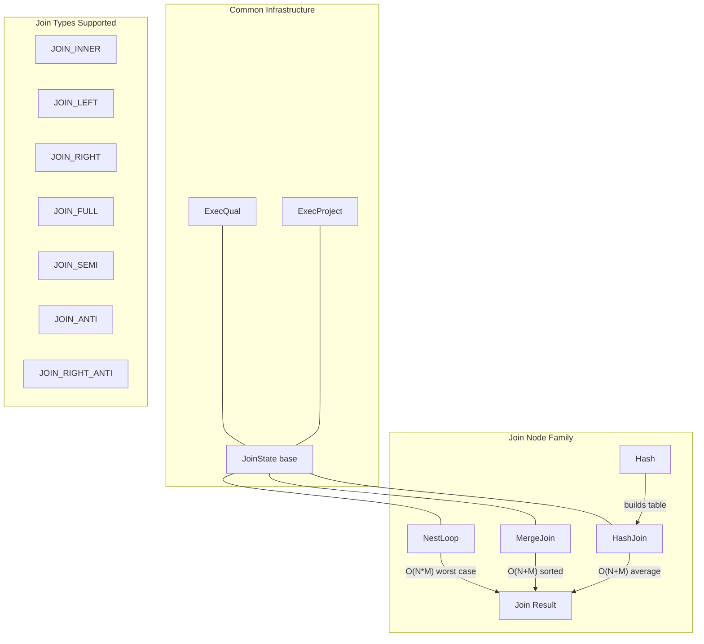
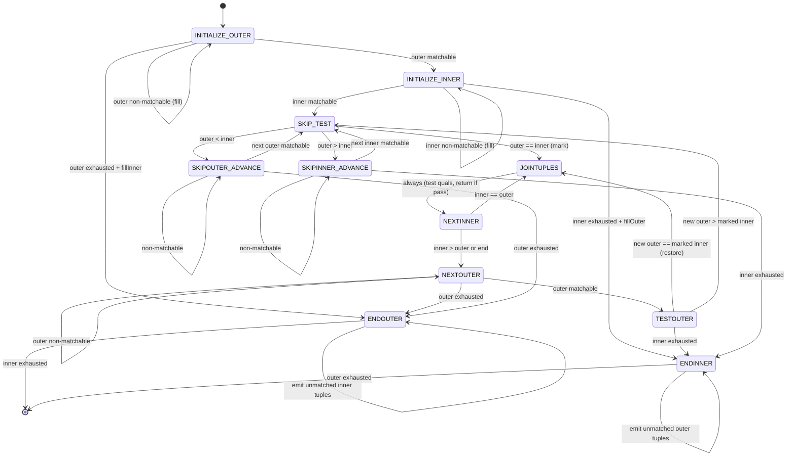
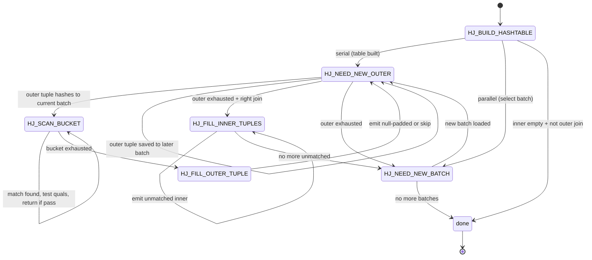
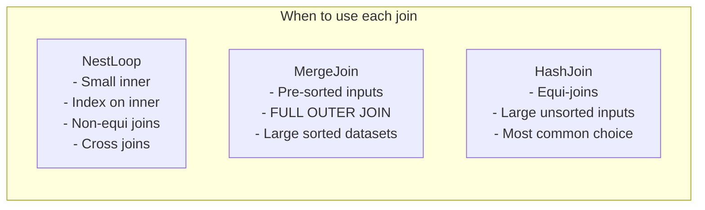

# Join Nodes -- Executor Node Catalog

This document provides a comprehensive reference for all join executor nodes in
PostgreSQL 17.6. The three join strategies (NestLoop, MergeJoin, HashJoin) plus
the auxiliary Hash node are documented here with full implementation details.

---

## Architecture Overview



---

## NestLoop

**Identity**
- NodeTag: T_NestLoop / T_NestLoopState
- Plan struct: NestLoop (`src/include/nodes/plannodes.h`)
- PlanState struct: NestLoopState (`src/include/nodes/execnodes.h`)
- Source: `src/backend/executor/nodeNestloop.c` (401 lines)

**Purpose**: Implements the nested-loop join algorithm. Produced by the planner for
small inner relations, parameterized index lookups on the inner side, or when no
equality join condition exists (cross joins, theta joins). Supports INNER, LEFT,
SEMI, and ANTI joins.

### Initialization (`ExecInitNestLoop`)

```c
/* src/backend/executor/nodeNestloop.c:261 */
NestLoopState *
ExecInitNestLoop(NestLoop *node, EState *estate, int eflags)
```

1. Creates NestLoopState, sets `ExecProcNode = ExecNestLoop`.
2. Allocates expression context for per-tuple evaluation.
3. Initializes outer child unconditionally.
4. Initializes inner child with EXEC_FLAG_REWIND if no nestParams (parameterized
   inner), or without REWIND if parameterized (inner is always rescanned with
   fresh parameter values).
5. Initializes join quals and non-join quals (HAVING-like filters).
6. Sets `single_match = true` for inner_unique joins or JOIN_SEMI.
7. Allocates a null inner tuple slot for LEFT/ANTI joins.
8. Sets initial state: `nl_NeedNewOuter = true`, `nl_MatchedOuter = false`.

### Execution (`ExecNestLoop`)

```c
/* src/backend/executor/nodeNestloop.c:59 */
static TupleTableSlot *
ExecNestLoop(PlanState *pstate)
```

Step-by-step logic in a single infinite loop:

1. **Need new outer tuple** (`nl_NeedNewOuter == true`):
   - Fetch next outer tuple via `ExecProcNode(outerPlan)`.
   - If outer exhausted, return NULL (join complete).
   - Store outer tuple in expression context.
   - For each `nestParams`, extract outer Var values and store in PARAM_EXEC
     slots, marking the inner plan's `chgParam`.
   - Rescan the inner plan via `ExecReScan(innerPlan)`.

2. **Fetch next inner tuple**:
   - Call `ExecProcNode(innerPlan)`.
   - If inner exhausted:
     - Set `nl_NeedNewOuter = true`.
     - For LEFT/ANTI joins with no match: emit null-padded outer tuple.
     - Continue to next outer tuple.

3. **Evaluate join qualification**:
   - If `joinqual` passes:
     - Mark `nl_MatchedOuter = true`.
     - For ANTI: skip (never return matched tuples), move to next outer.
     - For `single_match`: set `nl_NeedNewOuter = true` (stop scanning inner).
     - If `otherqual` passes: project and return the joined tuple.
   - If `joinqual` fails: loop back to fetch next inner tuple.

### End (`ExecEndNestLoop`)

```c
/* src/backend/executor/nodeNestloop.c:360 */
void ExecEndNestLoop(NestLoopState *node)
```

Shuts down both child plan nodes via `ExecEndNode()`. No special cleanup needed
since NestLoop does not allocate additional resources beyond the expression context.

### Rescan (`ExecReScanNestLoop`)

```c
/* src/backend/executor/nodeNestloop.c:380 */
void ExecReScanNestLoop(NestLoopState *node)
```

- Rescans the outer plan if `chgParam` is NULL (otherwise it will auto-rescan).
- Does NOT rescan inner plan here (inner is rescanned per outer tuple).
- Resets `nl_NeedNewOuter = true`, `nl_MatchedOuter = false`.

### Key State Fields

| Field | Type | Description |
|-------|------|-------------|
| `nl_NeedNewOuter` | bool | True when next outer tuple should be fetched |
| `nl_MatchedOuter` | bool | Whether current outer has found any inner match |
| `nl_NullInnerTupleSlot` | TupleTableSlot* | Pre-built all-NULL inner slot for outer joins |

### Performance

- **Time complexity**: O(N * M) in the worst case, where N = outer rows, M = inner rows.
  With a parameterized index scan on the inner side, effective complexity is O(N * log M).
- **Memory**: O(1) beyond child node requirements. No buffering needed.
- **I/O**: Inner side is rescanned once per outer tuple. Best when inner is an
  index scan with selective quals.

### Parallel Support

- Parallel-safe: yes (can appear below Gather).
- Parallel-aware: no. NestLoop itself does not coordinate between workers.

### Example SQL

```sql
-- Parameterized index nested loop join
EXPLAIN SELECT o.*, d.dname
FROM emp o JOIN dept d ON o.deptno = d.deptno
WHERE o.sal > 3000;
```

```
Nested Loop  (cost=0.15..16.62 rows=3 width=52)
   ->  Seq Scan on emp o  (cost=0.00..1.14 rows=3 width=44)
         Filter: (sal > 3000)
   ->  Index Scan using dept_pkey on dept d  (cost=0.15..5.17 rows=1 width=12)
         Index Cond: (deptno = o.deptno)
```

---

## MergeJoin

**Identity**
- NodeTag: T_MergeJoin / T_MergeJoinState
- Plan struct: MergeJoin (`src/include/nodes/plannodes.h`)
- PlanState struct: MergeJoinState (`src/include/nodes/execnodes.h`)
- Source: `src/backend/executor/nodeMergejoin.c` (1,678 lines)

**Purpose**: Implements the sort-merge join algorithm. Produced by the planner when
both inputs are sorted (or can be sorted cheaply) on the join keys. Supports
INNER, LEFT, RIGHT, RIGHT_ANTI, FULL, SEMI, and ANTI joins. This is the only
join method that directly supports FULL OUTER JOIN.

### Initialization (`ExecInitMergeJoin`)

```c
/* src/backend/executor/nodeMergejoin.c:1443 */
MergeJoinState *
ExecInitMergeJoin(MergeJoin *node, EState *estate, int eflags)
```

1. Creates MergeJoinState, sets `ExecProcNode = ExecMergeJoin`.
2. Creates THREE expression contexts: one standard, plus `mj_OuterEContext` and
   `mj_InnerEContext` for evaluating merge keys without premature context resets.
3. Initializes inner child with EXEC_FLAG_MARK unless `skip_mark_restore` is set.
4. Sets `mj_ExtraMarks = true` if inner child is a Material node and REWIND not
   needed (helps Material trim its tuplestore).
5. Calls `MJExamineQuals()` to deconstruct merge clauses into `MergeJoinClauseData`
   array with sort-support comparison functions from btree opfamilies.
6. Configures `mj_FillOuter`/`mj_FillInner` based on join type:
   - INNER/SEMI: both false
   - LEFT/ANTI: fill outer only
   - RIGHT/RIGHT_ANTI: fill inner only
   - FULL: both true
7. For RIGHT/FULL: validates that extra joinquals are constant (required for
   correctness of mark/restore logic).
8. Sets initial state to `EXEC_MJ_INITIALIZE_OUTER`.

### Execution (`ExecMergeJoin`)

```c
/* src/backend/executor/nodeMergejoin.c:598 */
static TupleTableSlot *
ExecMergeJoin(PlanState *pstate)
```

Implemented as an explicit state machine with 11 states. Each call to
ExecMergeJoin resumes at the saved state (`mj_JoinState`).

#### State Machine -- Complete State Reference



**State 1: EXEC_MJ_INITIALIZE_OUTER** -- Fetch first outer tuple. Evaluate merge
keys via `MJEvalOuterValues()`. If matchable, advance to INITIALIZE_INNER. If
non-matchable (NULL in key), optionally emit fill tuple. If end-of-join, done.

**State 2: EXEC_MJ_INITIALIZE_INNER** -- Fetch first inner tuple. Same evaluation
logic as outer. If matchable, advance to SKIP_TEST.

**State 3: EXEC_MJ_JOINTUPLES** -- Both tuples satisfy merge clause. Set next
state to NEXTINNER. Evaluate joinqual and otherqual. If both pass, project and
return the tuple. For ANTI: skip to NEXTOUTER. For `single_match`: skip to
NEXTOUTER. For RIGHT_ANTI: skip without returning.

**State 4: EXEC_MJ_NEXTOUTER** -- Advance outer. Before advancing, emit fill
tuple for unmatched outer if doing outer join. After fetching, go to TESTOUTER.

**State 5: EXEC_MJ_TESTOUTER** -- Compare new outer against the marked inner
tuple. If equal: restore inner to mark position, go to JOINTUPLES. If new outer
is greater: the marked group is done, reload current inner, go to SKIP_TEST.

**State 6: EXEC_MJ_NEXTINNER** -- Advance inner. Before advancing, emit fill
tuple for unmatched inner if doing right join. Compare new inner to outer. If
equal, go to JOINTUPLES. If inner > outer, go to NEXTOUTER.

**State 7: EXEC_MJ_SKIP_TEST** -- Compare current outer and inner. If equal:
mark inner position and go to JOINTUPLES. If outer < inner: go to
SKIPOUTER_ADVANCE. If outer > inner: go to SKIPINNER_ADVANCE.

**State 8: EXEC_MJ_SKIPOUTER_ADVANCE** -- Advance outer past non-matching tuples.
Emit fill tuples for LEFT joins. Loop back to SKIP_TEST with new outer.

**State 9: EXEC_MJ_SKIPINNER_ADVANCE** -- Advance inner past non-matching tuples.
Emit fill tuples for RIGHT joins. Loop back to SKIP_TEST with new inner.

**State 10: EXEC_MJ_ENDOUTER** -- Outer exhausted during right/full join. Scan
remaining inner tuples, emitting null-padded outer fill tuples for unmatched ones.

**State 11: EXEC_MJ_ENDINNER** -- Inner exhausted during left/full join. Scan
remaining outer tuples, emitting null-padded inner fill tuples for unmatched ones.

### End (`ExecEndMergeJoin`)

Calls `ExecEndNode()` on both children. Defined at line 1627 (approximately).

### Rescan (`ExecReScanMergeJoin`)

Resets state to `EXEC_MJ_INITIALIZE_OUTER`. Rescans outer if `chgParam` is NULL.
Rescans inner. Clears marked tuple slot.

### Key State Fields

| Field | Type | Description |
|-------|------|-------------|
| `mj_JoinState` | int | Current state machine state (1-11) |
| `mj_Clauses` | MergeJoinClause | Array of per-clause comparison data |
| `mj_NumClauses` | int | Number of merge clauses |
| `mj_OuterTupleSlot` | TupleTableSlot* | Current outer tuple |
| `mj_InnerTupleSlot` | TupleTableSlot* | Current inner tuple |
| `mj_MarkedTupleSlot` | TupleTableSlot* | Copy of marked inner tuple for restore |
| `mj_MatchedOuter` | bool | Whether current outer has joined |
| `mj_MatchedInner` | bool | Whether current inner has joined |
| `mj_FillOuter` | bool | Emit null-filled tuples for unmatched outers |
| `mj_FillInner` | bool | Emit null-filled tuples for unmatched inners |
| `mj_SkipMarkRestore` | bool | Optimization: skip mark/restore when safe |
| `mj_ExtraMarks` | bool | Issue extra marks for Material child benefit |
| `mj_ConstFalseJoin` | bool | Joinqual is constant false |

### Performance

- **Time complexity**: O(N + M) for a single-pass merge where N = outer rows,
  M = inner rows. When there are duplicate keys, inner tuples must be re-scanned
  via mark/restore, potentially reaching O(N * D) where D is the max duplicate
  count.
- **Memory**: O(1) beyond child nodes. The marked tuple slot holds one copy.
- **I/O**: Sequential access pattern on both inputs. Very cache-friendly.

### Parallel Support

- Parallel-safe: yes.
- Parallel-aware: no.

### Example SQL

```sql
-- Merge join on pre-sorted columns
EXPLAIN SELECT e.name, d.dname
FROM emp e JOIN dept d ON e.deptno = d.deptno
ORDER BY e.deptno;
```

```
Merge Join  (cost=316.75..835.50 rows=28800 width=64)
   Merge Cond: (e.deptno = d.deptno)
   ->  Sort  (cost=288.54..296.67 rows=3254 width=36)
         Sort Key: e.deptno
         ->  Seq Scan on emp e  (cost=0.00..55.54 rows=3254 width=36)
   ->  Sort  (cost=28.21..29.34 rows=452 width=32)
         Sort Key: d.deptno
         ->  Seq Scan on dept d  (cost=0.00..8.52 rows=452 width=32)
```

---

## HashJoin

**Identity**
- NodeTag: T_HashJoin / T_HashJoinState
- Plan struct: HashJoin (`src/include/nodes/plannodes.h`)
- PlanState struct: HashJoinState (`src/include/nodes/execnodes.h`)
- Source: `src/backend/executor/nodeHashjoin.c` (1,663 lines)

**Purpose**: Implements the hybrid hash join algorithm. This is the most commonly
used join method for equi-joins on larger datasets. Supports INNER, LEFT, RIGHT,
RIGHT_ANTI, FULL, SEMI, and ANTI joins. The inner (build) side is hashed; the
outer (probe) side scans the hash table. When the hash table exceeds work_mem,
tuples overflow to temporary batch files on disk.

### Initialization (`ExecInitHashJoin`)

```c
/* src/backend/executor/nodeHashjoin.c:709 */
HashJoinState *
ExecInitHashJoin(HashJoin *node, EState *estate, int eflags)
```

1. Creates HashJoinState. Sets `ExecProcNode = ExecHashJoin` (may be replaced
   with `ExecParallelHashJoin` during DSM initialization for parallel queries).
2. Initializes outer and inner (Hash) child nodes.
3. Sets `single_match` for inner_unique or SEMI joins.
4. Allocates null tuple slots based on join type (same as MergeJoin).
5. Borrows the Hash node's result slot as `hj_HashTupleSlot` for probing.
6. Initializes hash-specific state: hash clauses, hash key expressions, hash
   operators and collations.
7. Sets initial state: `hj_JoinState = HJ_BUILD_HASHTABLE`.

### Execution (`ExecHashJoinImpl`)

```c
/* src/backend/executor/nodeHashjoin.c:219 */
static pg_attribute_always_inline TupleTableSlot *
ExecHashJoinImpl(PlanState *pstate, bool parallel)
```

This function is marked `always_inline` and is called by both `ExecHashJoin()`
(parallel=false) and `ExecParallelHashJoin()` (parallel=true). The compiler
generates two specialized versions with dead branches eliminated.

#### State Machine -- HJ_* States



**HJ_BUILD_HASHTABLE** (state 1):
- Optionally prefetch one outer tuple to detect empty outer (optimization for
  left joins or when outer startup cost is low).
- Call `ExecHashTableCreate()` to allocate the hash table structure.
- Execute the Hash child via `MultiExecProcNode()` to populate the table.
- If inner is empty and not doing a left/full join, return NULL immediately.
- For parallel: coordinate via `build_barrier` through phases PHJ_BUILD_ELECT
  through PHJ_BUILD_RUN.

**HJ_NEED_NEW_OUTER** (state 2):
- Fetch next outer tuple and compute its hash value.
- Determine which batch and bucket the tuple belongs to.
- If the tuple belongs to a later batch, save it to the corresponding outer
  batch file and loop back.
- Check for skew bucket match (skew optimization for frequent values).
- Transition to HJ_SCAN_BUCKET.

**HJ_SCAN_BUCKET** (state 3):
- Call `ExecScanHashBucket()` (or parallel variant) to find next matching inner
  tuple in the hash bucket chain.
- If match found: test joinqual and otherqual. If both pass, project and return.
  Mark inner tuple as matched (for right/full joins). Handle ANTI/SEMI/RIGHT_ANTI.
- If no more matches: transition to HJ_FILL_OUTER_TUPLE.

**HJ_FILL_OUTER_TUPLE** (state 4):
- If outer unmatched and doing left/full join: emit null-padded tuple.
- Always transition to HJ_NEED_NEW_OUTER.

**HJ_FILL_INNER_TUPLES** (state 5):
- Scan hash table for unmatched inner tuples (right/full join).
- For each unmatched: emit null-padded outer tuple.
- When done, transition to HJ_NEED_NEW_BATCH.

**HJ_NEED_NEW_BATCH** (state 6):
- Call `ExecHashJoinNewBatch()` to advance to the next batch.
- Reload the hash table from the inner batch file.
- Rewind the outer batch file.
- Skip batches where both sides are empty (with exceptions for outer joins and
  batch-count increases).
- Return NULL if no more batches.

### Multi-Batch Overflow

When the hash table exceeds `work_mem`:

1. The number of batches is doubled (always a power of two).
2. Tuples in the current hash table are redistributed: those belonging to new
   batches are written to inner batch files.
3. Outer tuples for future batches are saved to outer batch files during probing.
4. Each subsequent batch is loaded from its inner batch file and probed with
   tuples from its outer batch file.
5. If a batch still overflows when loaded, the batch count may increase again.
6. Growth is disabled if a batch increase did not actually redistribute any tuples
   (skew scenario).

### End (`ExecEndHashJoin`)

```c
/* src/backend/executor/nodeHashjoin.c:858 */
void ExecEndHashJoin(HashJoinState *node)
```

Destroys the hash table via `ExecHashTableDestroy()` and shuts down both children.

### Rescan (`ExecReScanHashJoin`)

- If single-batch and inner params unchanged: reuse the hash table (just reset
  match flags for right/full joins). Set state to HJ_NEED_NEW_OUTER.
- Otherwise: destroy hash table, set state to HJ_BUILD_HASHTABLE, rescan inner.
- Always rescan outer if its `chgParam` is NULL.

### Key State Fields

| Field | Type | Description |
|-------|------|-------------|
| `hj_JoinState` | int | Current state machine state (1-6) |
| `hj_HashTable` | HashJoinTable | Pointer to the hash table structure |
| `hj_CurHashValue` | uint32 | Hash value of current outer tuple |
| `hj_CurBucketNo` | int | Current hash bucket being probed |
| `hj_CurSkewBucketNo` | int | Skew bucket number or INVALID_SKEW_BUCKET_NO |
| `hj_CurTuple` | HashJoinTuple | Current position in hash bucket chain |
| `hj_OuterTupleSlot` | TupleTableSlot* | Slot for reading outer batch files |
| `hj_HashTupleSlot` | TupleTableSlot* | Borrowed from Hash node for inner tuples |
| `hj_NullOuterTupleSlot` | TupleTableSlot* | For right/full join fill |
| `hj_NullInnerTupleSlot` | TupleTableSlot* | For left/full join fill |
| `hj_FirstOuterTupleSlot` | TupleTableSlot* | Prefetched first outer tuple |
| `hj_MatchedOuter` | bool | Current outer has at least one inner match |
| `hj_OuterNotEmpty` | bool | Outer relation is known non-empty |
| `hj_OuterHashKeys` | List* | Hash key expressions for outer tuples |
| `hj_HashOperators` | Oid* | Hash operator OIDs for comparison |
| `hj_Collations` | Oid* | Collation OIDs for hash comparison |

### Performance

- **Time complexity**: O(N + M) average case. O(N * M) worst case with extreme
  hash collisions (practically never occurs with good hash functions).
- **Memory**: O(min(N,M)) for the hash table, bounded by `work_mem`. Overflows
  to disk via temp batch files.
- **I/O**: One full scan of each input in the single-batch case. Multi-batch adds
  write and read of batch files (sequential I/O).

### Parallel Support

- Parallel-safe: yes.
- Parallel-aware: yes. Appears as "Parallel Hash Join" in EXPLAIN. Uses shared
  memory hash table with barrier-based synchronization through build, partition,
  probe, and scan phases.

### Example SQL

```sql
-- Hash join on equality condition
EXPLAIN SELECT c.name, o.order_date
FROM customers c JOIN orders o ON c.id = o.customer_id;
```

```
Hash Join  (cost=38.58..1345.00 rows=50000 width=40)
   Hash Cond: (o.customer_id = c.id)
   ->  Seq Scan on orders o  (cost=0.00..866.00 rows=50000 width=12)
   ->  Hash  (cost=22.30..22.30 rows=1302 width=32)
         ->  Seq Scan on customers c  (cost=0.00..22.30 rows=1302 width=32)
```

---

## Hash (Auxiliary Node)

**Identity**
- NodeTag: T_Hash / T_HashState
- Plan struct: Hash (`src/include/nodes/plannodes.h`)
- PlanState struct: HashState (`src/include/nodes/execnodes.h`)
- Source: `src/backend/executor/nodeHash.c`

**Purpose**: Auxiliary node that appears as the inner child of a HashJoin. It does
not return tuples via `ExecProcNode()`. Instead, the parent HashJoin calls
`MultiExecProcNode()` to build the hash table from the inner relation. The Hash
node is responsible for hashing each inner tuple and inserting it into the
appropriate bucket (or batch file).

### Initialization (`ExecInitHash`)

```c
/* src/backend/executor/nodeHash.c:353 */
HashState *
ExecInitHash(Hash *node, EState *estate, int eflags)
```

1. Creates HashState. Note: `hashkeys` is set to NIL initially -- the parent
   HashJoin fills it in later.
2. Initializes the outer (data source) child.
3. Creates result slot (TTSOpsMinimalTuple) but no projection.
4. Initializes hash key expressions from the plan node.

### Execution (`MultiExecPrivateHash`)

```c
/* src/backend/executor/nodeHash.c:130 */
static void
MultiExecPrivateHash(HashState *node)
```

This is the serial (parallel-oblivious) version:

1. Iterates over all tuples from the outer child via `ExecProcNode()`.
2. For each tuple, computes the hash value using `ExecHashGetHashValue()`.
3. Checks for skew bucket assignment via `ExecHashGetSkewBucket()`.
4. If skew: inserts into skew hash table via `ExecHashSkewTableInsert()`.
5. Otherwise: inserts into main hash table via `ExecHashTableInsert()`.
6. Tracks `totalTuples` count.
7. After all tuples processed: resizes buckets if NTUP_PER_BUCKET exceeded.
8. Updates `spaceUsed` accounting for bucket array overhead.

Key code snippet for the inner loop:

```c
/* src/backend/executor/nodeHash.c:163-184 */
for (;;)
{
    slot = ExecProcNode(outerNode);
    if (TupIsNull(slot))
        break;
    econtext->ecxt_outertuple = slot;
    if (ExecHashGetHashValue(hashtable, econtext, hashkeys,
                             false, hashtable->keepNulls,
                             &hashvalue))
    {
        bucketNumber = ExecHashGetSkewBucket(hashtable, hashvalue);
        if (bucketNumber != INVALID_SKEW_BUCKET_NO)
            ExecHashSkewTableInsert(hashtable, slot, hashvalue, bucketNumber);
        else
            ExecHashTableInsert(hashtable, slot, hashvalue);
        hashtable->totalTuples += 1;
    }
}
```

For parallel hash, `MultiExecParallelHash()` is used instead, which coordinates
through PHJ_BUILD_* barrier phases and uses shared memory hash tables.

### End (`ExecEndHash`)

```c
/* src/backend/executor/nodeHash.c:406 */
void ExecEndHash(HashState *node)
```

Simply shuts down the outer child. The hash table itself is owned and destroyed
by the parent HashJoin node.

### Hash Table Structure and Batch Management

The hash table (HashJoinTable) is created by `ExecHashTableCreate()` in
`nodeHash.c`. Key parameters:

- **nbuckets**: Number of hash buckets (power of 2). Sized to keep average chain
  length <= NTUP_PER_BUCKET (typically 1).
- **nbatch**: Number of batches (power of 2). Batch 0 is resident in memory;
  batches 1..N-1 are spilled to temp files.
- **Batch selection**: `hashvalue & (nbatch-1)` determines the batch number.
  `(hashvalue / nbatch) & (nbuckets-1)` determines the bucket within a batch.
- **Skew optimization**: For the first batch, frequently occurring inner values
  (detected from MCV statistics) get dedicated skew buckets for faster lookup.

### Key State Fields

| Field | Type | Description |
|-------|------|-------------|
| `hashtable` | HashJoinTable | Set by parent HashJoin before MultiExec |
| `hashkeys` | List* | Hash key expressions (set by parent) |
| `parallel_state` | ParallelHashJoinState* | Shared state for parallel hash |
| `hinstrument` | HashInstrumentation* | Instrumentation for EXPLAIN ANALYZE |

### Performance

- **Time complexity**: O(M) to build the hash table from M inner tuples.
- **Memory**: Bounded by `work_mem` (serial) or combined `hash_mem` (parallel).
  Overflow triggers batch file creation.
- **I/O**: Single sequential scan of inner relation. Batch files use sequential
  write then read.

### Parallel Support

- Parallel-safe: yes.
- Parallel-aware: yes. Appears as "Parallel Hash" in EXPLAIN. Multiple workers
  cooperatively build a shared hash table using DSA (dynamic shared memory area)
  and barrier synchronization.

### Example SQL

```sql
-- Hash node visible as inner child of Hash Join
EXPLAIN SELECT * FROM t1 JOIN t2 ON t1.id = t2.id;
```

```
Hash Join  (cost=3.25..8.20 rows=100 width=16)
   Hash Cond: (t1.id = t2.id)
   ->  Seq Scan on t1  (cost=0.00..2.00 rows=100 width=8)
   ->  Hash  (cost=2.00..2.00 rows=100 width=8)
         ->  Seq Scan on t2  (cost=0.00..2.00 rows=100 width=8)
```

---

## Join Node Comparison



| Aspect | NestLoop | MergeJoin | HashJoin |
|--------|----------|-----------|----------|
| Join condition | Any | Equi-join (btree) | Equi-join (hash) |
| Input ordering | None required | Both sorted | None required |
| FULL OUTER | No | Yes | Yes |
| Memory | O(1) | O(1) | O(inner) |
| Startup cost | Low | High (sort) | Medium (build) |
| Best for | Small inner, index | Sorted data | Large equi-joins |
| Parallel-aware | No | No | Yes |
