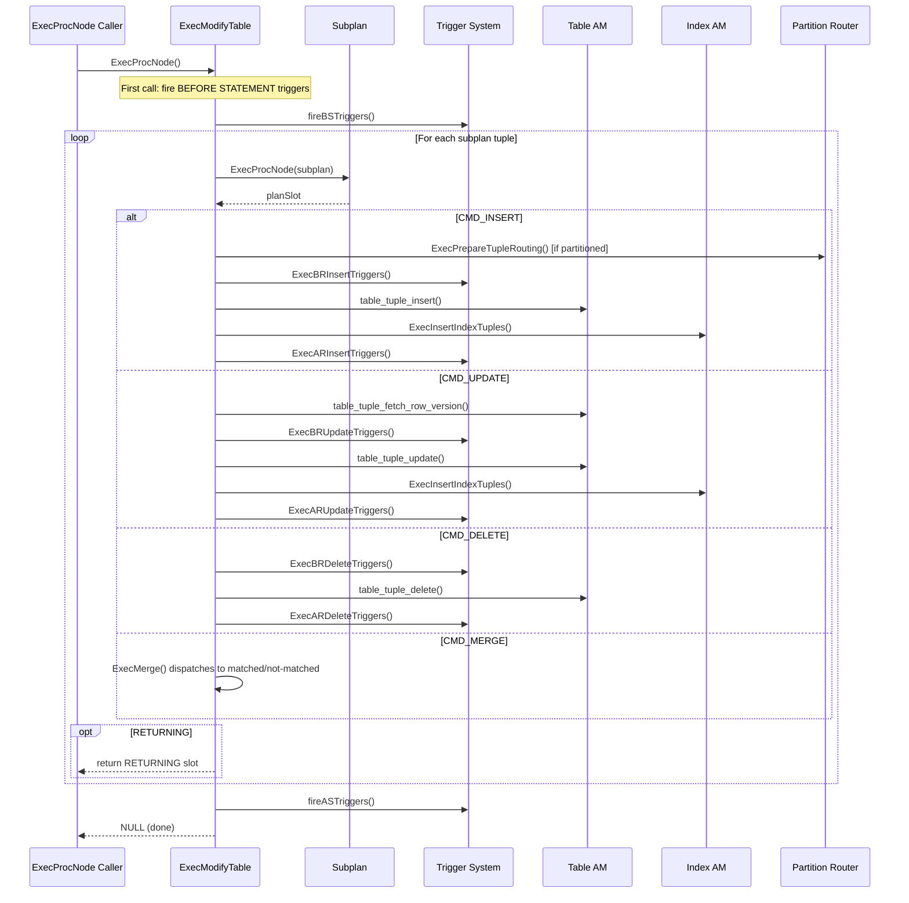
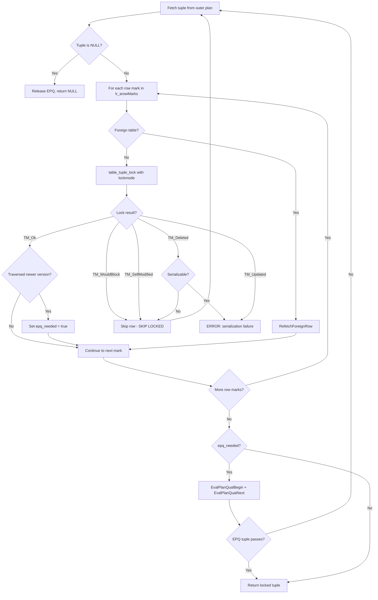

# ModifyTable and LockRows Node Catalog

This document covers the two executor nodes responsible for data modification and
row-level locking: **ModifyTable** (INSERT/UPDATE/DELETE/MERGE) and **LockRows**
(SELECT FOR UPDATE/SHARE).

---

## ModifyTable

**Identity**
- NodeTag: `T_ModifyTable` / `T_ModifyTableState`
- Plan struct: `ModifyTable` (`src/include/nodes/plannodes.h`)
- PlanState struct: `ModifyTableState` (`src/include/nodes/execnodes.h`)
- Source: `src/backend/executor/nodeModifyTable.c` (4,968 lines)

**Purpose**: Executes all data modification statements: `INSERT`, `UPDATE`, `DELETE`,
and `MERGE`. This is the only executor node that writes to heap tables. It handles
partition routing, ON CONFLICT (UPSERT), cross-partition UPDATE, trigger execution,
RETURNING clauses, and foreign table modifications via FDW callbacks.

### Initialization (`ExecInitModifyTable`)

```c
/* src/backend/executor/nodeModifyTable.c:4417 */
ModifyTableState *
ExecInitModifyTable(ModifyTable *node, EState *estate, int eflags)
```

Initialization performs these steps:

1. **State allocation**: Creates `ModifyTableState`, sets `operation` (CMD_INSERT /
   CMD_UPDATE / CMD_DELETE / CMD_MERGE), and allocates the `resultRelInfo[]` array
   for all target relations.

2. **Root relation resolution**: If the target is a partitioned or inherited table,
   `rootResultRelInfo` is initialized separately from the per-child `resultRelInfo`
   entries. Otherwise the root IS the sole result relation.

3. **EPQ setup**: Initializes `EvalPlanQual` state for concurrent-update rechecking
   via `EvalPlanQualInit()`.

4. **Transition capture**: Sets up transition table capture state for `AFTER`
   statement triggers (`ExecSetupTransitionCaptureState`).

5. **Result relation initialization**: Opens each result relation, calls
   `CheckValidResultRel`, and initializes the FDW `BeginForeignModify` callback
   for foreign tables.

6. **Row identity setup**: For UPDATE/DELETE/MERGE, locates the junk `ctid` attribute
   (heap tables) or `wholerow` attribute (foreign tables/views) used to identify
   the target row.

7. **Partition tuple routing**: For INSERT into partitioned tables, calls
   `ExecSetupPartitionTupleRouting()`.

8. **ON CONFLICT setup**: For `ONCONFLICT_UPDATE`, creates `OnConflictSetState`
   with the existing-tuple slot, UPDATE projection, and WHERE clause.

9. **RETURNING setup**: Builds per-result-relation projection info for RETURNING
   lists.

10. **MERGE setup**: Calls `ExecInitMerge()` to initialize MERGE action state.

### Execution (`ExecModifyTable`)

```c
/* src/backend/executor/nodeModifyTable.c:3945 */
static TupleTableSlot *
ExecModifyTable(PlanState *pstate)
```

The main execution loop:

1. **Guard against EvalPlanQual**: Errors out if called during EPQ processing
   (ModifyTable should never run inside EPQ).

2. **BEFORE STATEMENT triggers**: Fires `fireBSTriggers` on the first call only.

3. **Main loop**: Fetches rows from the subplan one at a time:
   - Resets per-tuple expression context and per-output-tuple context.
   - Handles pending MERGE NOT MATCHED actions from the previous iteration.
   - Fetches the next tuple from the subplan via `ExecProcNode(subplanstate)`.
   - For inherited/partitioned tables, extracts the `tableoid` junk attribute to
     identify which result relation this tuple targets.
   - Dispatches to the operation-specific handler:

```c
switch (operation)
{
    case CMD_INSERT:
        slot = ExecInsert(&context, resultRelInfo, slot, ...);
        break;
    case CMD_UPDATE:
        slot = ExecUpdate(&context, resultRelInfo, tupleid, ...);
        break;
    case CMD_DELETE:
        slot = ExecDelete(&context, resultRelInfo, tupleid, ...);
        break;
    case CMD_MERGE:
        slot = ExecMerge(&context, resultRelInfo, tupleid, ...);
        break;
}
```

4. **RETURNING**: If the operation handler returns a non-NULL slot (from RETURNING),
   it is returned to the caller. The loop continues on next call.

5. **Batch flush**: After all tuples are processed, flushes any pending batch
   inserts via `ExecPendingInserts()`.

6. **AFTER STATEMENT triggers**: Fires via `fireASTriggers()`, then sets `mt_done`.

### INSERT Path Detail (`ExecInsert`)

```c
/* src/backend/executor/nodeModifyTable.c:759 */
static TupleTableSlot *
ExecInsert(ModifyTableContext *context, ResultRelInfo *resultRelInfo,
           TupleTableSlot *slot, bool canSetTag, ...)
```

Key steps:
- **Partition routing**: If `proute` is set, calls `ExecPrepareTupleRouting()` to
  find the correct leaf partition and convert the tuple to that partition's rowtype.
- **BEFORE ROW triggers**: Fires `ExecBRInsertTriggers()`. If the trigger returns
  NULL, the insert is suppressed.
- **Constraint checking**: `ExecConstraints()` for NOT NULL / CHECK constraints,
  `ExecPartitionCheck()` for partition constraint.
- **ON CONFLICT handling**: For UPSERT, performs a speculative insertion:
  1. `ExecCheckIndexConstraints()` -- pre-check for conflicts
  2. If conflict found with `ONCONFLICT_UPDATE`, calls `ExecOnConflictUpdate()`
  3. If conflict found with `ONCONFLICT_NOTHING`, returns NULL
  4. Otherwise, `table_tuple_insert_speculative()` + `ExecInsertIndexTuples()` +
     `table_tuple_complete_speculative()`
- **Normal insert**: `table_tuple_insert()` + `ExecInsertIndexTuples()`
- **AFTER ROW triggers**: `ExecARInsertTriggers()`
- **RETURNING**: `ExecProcessReturning()` if present.

### Trigger Execution Ordering

For every DML operation, triggers fire in this order:

```
BEFORE STATEMENT  (once, on first ExecModifyTable call)
  for each row:
    BEFORE ROW    (can modify/suppress the tuple)
    [actual table modification]
    AFTER ROW     (sees the committed change)
AFTER STATEMENT   (once, when ExecModifyTable exhausts the subplan)
```

For `INSTEAD OF` triggers (on views), they replace the actual modification.

### Partition Routing

For INSERT into partitioned tables:
1. `ExecSetupPartitionTupleRouting()` during init builds a `PartitionTupleRouting`
   structure.
2. At execution time, `ExecPrepareTupleRouting()` evaluates the partition key,
   walks the partition hierarchy, opens the target leaf partition on demand, and
   converts the tuple to match the leaf partition's rowtype.

### Cross-Partition UPDATE

When an UPDATE changes the partition key such that the row must move to a different
partition:
1. `ExecUpdate()` detects the partition constraint violation.
2. Calls `ExecCrossPartitionUpdate()` which:
   - Deletes the tuple from the old partition.
   - Inserts it into the new partition (via `ExecInsert`).
   - Handles transition table capture for both the DELETE and INSERT sides.

### ON CONFLICT (UPSERT)

The speculative insertion protocol:
1. Pre-check index constraints without holding locks.
2. Acquire a speculative insertion lock token.
3. Insert the tuple speculatively.
4. Insert index entries (which check for real conflicts).
5. If conflict is confirmed, abort the speculative insert and retry.
6. If `DO UPDATE`, call `ExecOnConflictUpdate()` which locks the conflicting
   row, evaluates the SET expressions, and performs the UPDATE.

### End (`ExecEndModifyTable`)

```c
/* src/backend/executor/nodeModifyTable.c:4898 */
void
ExecEndModifyTable(ModifyTableState *node)
```

1. Calls `EndForeignModify` for each FDW result relation.
2. Cleans up batch slots.
3. Calls `ExecCleanupTupleRouting()` to close partition relations and indices.
4. Terminates EPQ state via `EvalPlanQualEnd()`.
5. Shuts down the subplan via `ExecEndNode()`.

### Rescan

ModifyTable does **not** support rescan. It is always the topmost node in a plan
tree (for DML statements) and is executed exactly once.

### Key State Fields

| Field | Type | Description |
|-------|------|-------------|
| `operation` | `CmdType` | CMD_INSERT / CMD_UPDATE / CMD_DELETE / CMD_MERGE |
| `mt_done` | `bool` | True after all rows processed and AFTER STATEMENT triggers fired |
| `mt_nrels` | `int` | Number of target relations (>1 for inheritance/partitioning) |
| `resultRelInfo` | `ResultRelInfo *` | Array of per-target-relation metadata |
| `rootResultRelInfo` | `ResultRelInfo *` | Root partitioned table's ResultRelInfo |
| `mt_epqstate` | `EPQState` | EvalPlanQual state for concurrent update handling |
| `fireBSTriggers` | `bool` | Whether BEFORE STATEMENT triggers still need firing |
| `mt_resultOidAttno` | `int` | Attribute number of `tableoid` junk column |
| `mt_partition_tuple_routing` | `PartitionTupleRouting *` | Partition routing state |
| `mt_transition_capture` | `TransitionCaptureState *` | Transition table state |
| `mt_merge_pending_not_matched` | `TupleTableSlot *` | Deferred MERGE NOT MATCHED action |
| `mt_merge_inserted/updated/deleted` | `double` | Per-operation counters for MERGE |

### Performance

- **Time complexity**: O(N) where N is the number of rows from the subplan. Each
  row involves one heap modification plus index updates for each index on the target
  table.
- **Memory**: Per-tuple memory is reset each iteration. Partition routing state
  grows linearly with the number of distinct partitions accessed.
- **I/O**: Heavy write I/O. Each INSERT generates WAL. Indexes are updated via
  `ExecInsertIndexTuples`. Batch insert mode (FDW) amortizes overhead.
- **Trigger overhead**: Each row-level trigger invocation involves SPI context
  setup and teardown.

### Parallel Support

ModifyTable is **neither parallel-aware nor parallel-safe**. Data modification
cannot be safely parallelized in PostgreSQL's current architecture because:
- Table and index modifications require heavyweight locking coordination.
- Trigger execution assumes a single-process context.
- MVCC visibility rules for the current command ID are process-local.

### Example SQL

```sql
-- INSERT with partition routing and RETURNING
INSERT INTO orders (customer_id, amount, order_date)
VALUES (42, 99.99, '2024-01-15')
RETURNING order_id, order_date;
```

```
EXPLAIN output:
 Insert on orders  (cost=0.00..0.01 rows=0 width=0)
   ->  Result  (cost=0.00..0.01 rows=1 width=20)
```

```sql
-- UPDATE with inherited table (multiple result relations)
UPDATE employees SET salary = salary * 1.1 WHERE department = 'Engineering';
```

```
EXPLAIN output:
 Update on employees  (cost=0.00..25.00 rows=0 width=0)
   Update on employees employees_1
   Update on managers employees_2
   ->  Seq Scan on employees employees_1  (cost=0.00..25.00 rows=6 width=14)
         Filter: (department = 'Engineering'::text)
   ->  Seq Scan on managers employees_2  (cost=0.00..1.00 rows=1 width=14)
         Filter: (department = 'Engineering'::text)
```

```sql
-- INSERT ... ON CONFLICT DO UPDATE (UPSERT)
INSERT INTO kv (key, value) VALUES ('foo', 'bar')
ON CONFLICT (key) DO UPDATE SET value = EXCLUDED.value;
```

```
EXPLAIN output:
 Insert on kv  (cost=0.00..0.01 rows=0 width=0)
   Conflict Resolution: UPDATE
   Conflict Arbiter Indexes: kv_pkey
   ->  Result  (cost=0.00..0.01 rows=1 width=64)
```

```sql
-- MERGE statement
MERGE INTO target t
USING source s ON t.id = s.id
WHEN MATCHED THEN UPDATE SET val = s.val
WHEN NOT MATCHED THEN INSERT (id, val) VALUES (s.id, s.val);
```

```
EXPLAIN output:
 Merge on target t  (cost=...)
   ->  Hash Join  (cost=...)
         Hash Cond: (t.id = s.id)
         ->  Seq Scan on target t
         ->  Hash
               ->  Seq Scan on source s
```

---

## LockRows

**Identity**
- NodeTag: `T_LockRows` / `T_LockRowsState`
- Plan struct: `LockRows` (`src/include/nodes/plannodes.h`)
- PlanState struct: `LockRowsState` (`src/include/nodes/execnodes.h`)
- Source: `src/backend/executor/nodeLockRows.c` (405 lines)

**Purpose**: Implements row-level locking for `SELECT ... FOR UPDATE`,
`FOR NO KEY UPDATE`, `FOR SHARE`, and `FOR KEY SHARE`. This node sits above the
scan/join nodes and below any Sort/Limit, acquiring the specified lock on each
row before returning it. Rows that have been concurrently modified are rechecked
via the EvalPlanQual (EPQ) mechanism.

### Initialization (`ExecInitLockRows`)

```c
/* src/backend/executor/nodeLockRows.c:290 */
LockRowsState *
ExecInitLockRows(LockRows *node, EState *estate, int eflags)
```

1. Creates `LockRowsState` and sets `ExecProcNode = ExecLockRows`.
2. Initializes result type (passes through the outer plan's tuple type unchanged).
3. Initializes the outer plan (child node).
4. Sets `ps_ProjInfo = NULL` -- LockRows does no projection.
5. Iterates over `PlanRowMark` entries from the plan:
   - Locking marks (FOR UPDATE/SHARE) go into `lr_arowMarks`.
   - Non-locking marks (reference-only) are passed to EPQ for recheck access.
6. Initializes EPQ state via `EvalPlanQualInit()`.

### Execution (`ExecLockRows`)

```c
/* src/backend/executor/nodeLockRows.c:37 */
static TupleTableSlot *
ExecLockRows(PlanState *pstate)
```

Step-by-step logic for each tuple:

1. **Fetch next tuple** from the outer plan via `ExecProcNode(outerPlan)`.
   If NULL, release EPQ resources and return NULL.

2. **For each row mark** in `lr_arowMarks`:
   a. For child relations of inheritance hierarchies, check the `tableoid` junk
      attribute to determine if this row mark applies to the current tuple.
      If not, mark it inactive and continue.
   b. Extract the `ctid` junk attribute from the tuple.
   c. For **foreign tables**, delegate to `fdwroutine->RefetchForeignRow()`.
   d. For **regular tables**, determine the lock mode from the mark type:

```c
switch (erm->markType)
{
    case ROW_MARK_EXCLUSIVE:     lockmode = LockTupleExclusive;     break;
    case ROW_MARK_NOKEYEXCLUSIVE: lockmode = LockTupleNoKeyExclusive; break;
    case ROW_MARK_SHARE:         lockmode = LockTupleShare;         break;
    case ROW_MARK_KEYSHARE:      lockmode = LockTupleKeyShare;      break;
}
```

   e. Call `table_tuple_lock()` with the chosen lock mode and the row's wait
      policy (WAIT / NOWAIT / SKIP LOCKED).

   f. Handle the result:
      - `TM_Ok`: Lock acquired. If `tmfd.traversed` is true (row was updated
        by another transaction since our snapshot), set `epq_needed`.
      - `TM_WouldBlock`: SKIP LOCKED mode -- skip this row.
      - `TM_SelfModified`: Row was modified by the current command -- skip to
        avoid the Halloween problem.
      - `TM_Updated`: Under serializable isolation, raise a serialization error.
      - `TM_Deleted`: Row was deleted by a committed concurrent transaction --
        skip under READ COMMITTED, error under SERIALIZABLE.
      - `TM_Invisible`: Should never happen -- error.

3. **EPQ recheck**: If any row mark traversed to a newer tuple version
   (`epq_needed == true`):
   - Call `EvalPlanQualBegin()` + `EvalPlanQualNext()` to re-evaluate the
     query's WHERE clause against the updated tuple version.
   - If the updated tuple fails the qual, skip it (goto lnext).

4. **Return** the locked tuple.

### End (`ExecEndLockRows`)

```c
/* src/backend/executor/nodeLockRows.c:384 */
void
ExecEndLockRows(LockRowsState *node)
```

Shuts down EPQ state and ends the outer plan node.

### Rescan (`ExecReScanLockRows`)

```c
/* src/backend/executor/nodeLockRows.c:393 */
void
ExecReScanLockRows(LockRowsState *node)
```

Delegates rescan to the outer plan if `chgParam` is NULL.

### Key State Fields

| Field | Type | Description |
|-------|------|-------------|
| `lr_arowMarks` | `List *` | List of `ExecAuxRowMark` for locking row marks |
| `lr_epqstate` | `EPQState` | EvalPlanQual state for concurrent-update rechecking |

### Performance

- **Time complexity**: O(N * M) where N is tuples from the outer plan and M is
  the number of locking row marks per tuple. Each lock acquisition is an O(1)
  heap operation but may block on concurrent lock holders.
- **Memory**: Minimal overhead beyond the EPQ state.
- **I/O**: Each `table_tuple_lock` may need to read the latest tuple version
  from disk. Under heavy contention, significant wait time on tuple locks.
- **EPQ overhead**: When a row has been concurrently updated, the entire subplan
  tree is re-executed via EPQ to recheck the qualification.

### Parallel Support

LockRows is **not parallel-safe**. Row locking requires process-local locking
state and cannot be safely distributed across parallel workers.

### Example SQL

```sql
-- SELECT FOR UPDATE: acquires ROW_MARK_EXCLUSIVE locks
SELECT * FROM accounts WHERE balance > 1000 FOR UPDATE;
```

```
EXPLAIN output:
 LockRows  (cost=0.00..35.50 rows=10 width=40)
   ->  Seq Scan on accounts  (cost=0.00..35.50 rows=10 width=40)
         Filter: (balance > 1000)
```

```sql
-- SELECT FOR SHARE with SKIP LOCKED
SELECT * FROM tasks WHERE status = 'pending'
FOR SHARE SKIP LOCKED
LIMIT 5;
```

```
EXPLAIN output:
 Limit  (cost=0.00..1.75 rows=5 width=36)
   ->  LockRows  (cost=0.00..35.50 rows=100 width=36)
         ->  Seq Scan on tasks  (cost=0.00..25.00 rows=100 width=36)
               Filter: (status = 'pending'::text)
```

```sql
-- FOR KEY SHARE with join (multiple row marks)
SELECT e.name, d.name
FROM employees e
JOIN departments d ON e.dept_id = d.id
FOR KEY SHARE OF e
FOR SHARE OF d;
```

```
EXPLAIN output:
 LockRows  (cost=...)
   ->  Hash Join  (cost=...)
         Hash Cond: (e.dept_id = d.id)
         ->  Seq Scan on employees e
         ->  Hash
               ->  Seq Scan on departments d
```

---

## Architecture: ModifyTable Processing Flow



## Architecture: LockRows Tuple Locking Flow


