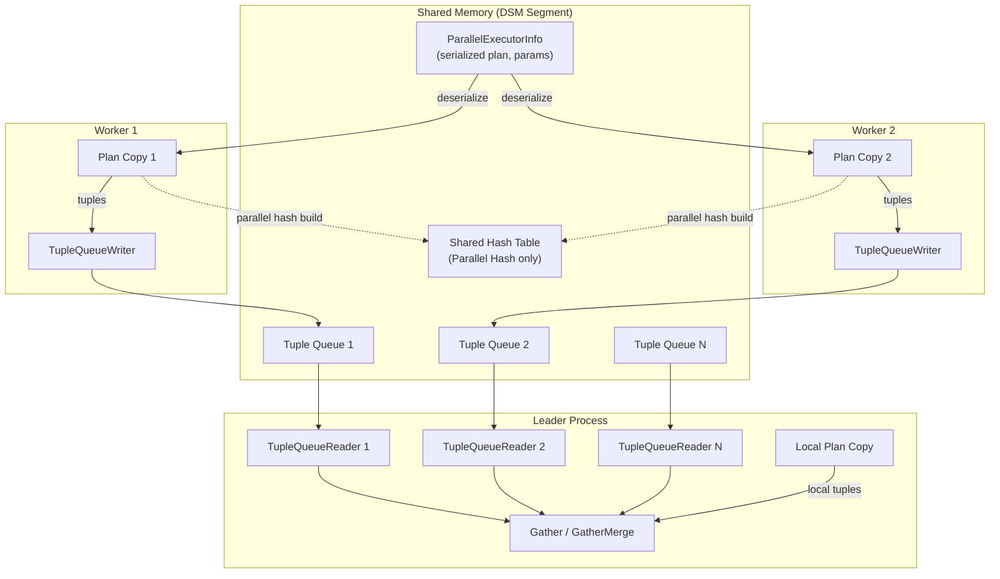
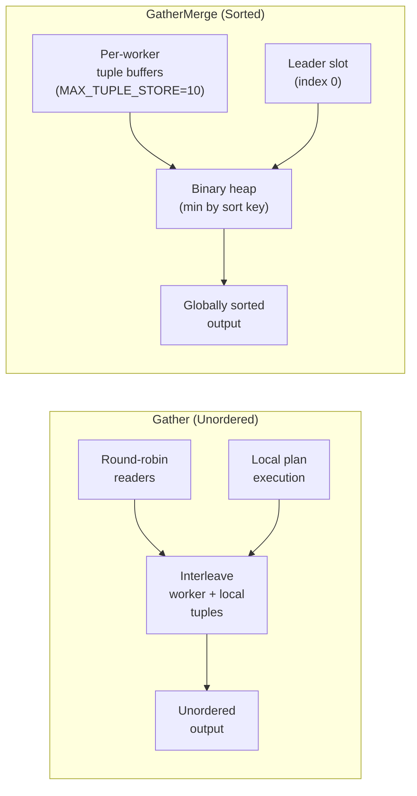
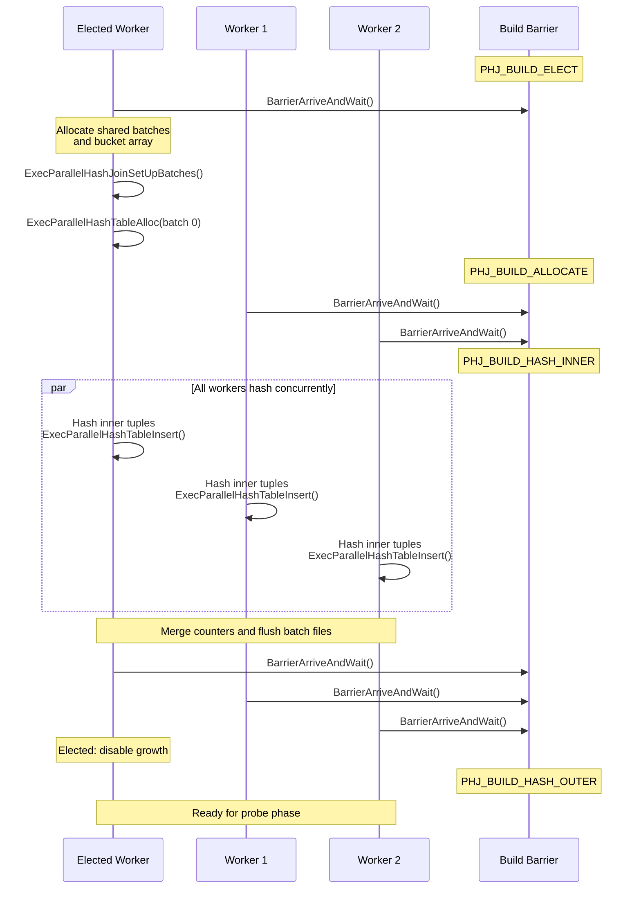
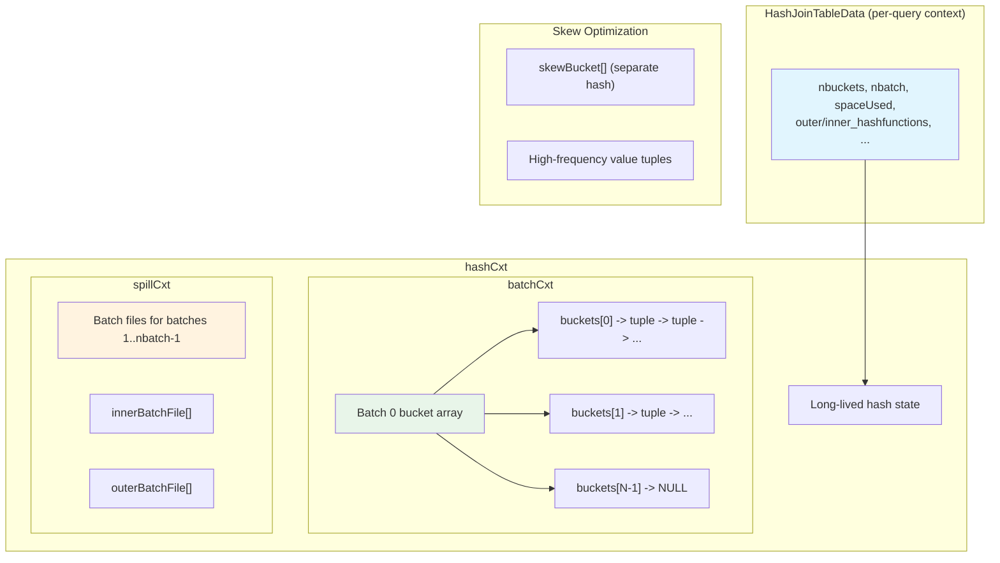

# Parallel Execution Node Catalog

This document covers the three executor nodes that enable parallel query
execution: **Gather** (unordered collection from workers), **GatherMerge**
(order-preserving collection), and **Hash** (hash table builder with parallel
shared-hash-table support).

---

## Gather

**Identity**
- NodeTag: `T_Gather` / `T_GatherState`
- Plan struct: `Gather` (`src/include/nodes/plannodes.h`)
- PlanState struct: `GatherState` (`src/include/nodes/execnodes.h`)
- Source: `src/backend/executor/nodeGather.c` (470 lines)

**Purpose**: Launches parallel workers to execute multiple copies of a subtree
plan, then collects their output tuples into a single unordered result stream.
The leader process may also execute the plan locally (controlled by
`parallel_leader_participation`). For single-copy mode, only one worker runs the
plan and the leader does not participate.

Gather is used whenever the planner decides a parallel-safe subtree can benefit
from parallel execution. The workers communicate results to the leader via tuple
queues in shared memory.

### Initialization (`ExecInitGather`)

```c
/* src/backend/executor/nodeGather.c:52 */
GatherState *
ExecInitGather(Gather *node, EState *estate, int eflags)
```

1. Creates `GatherState`, sets `ExecProcNode = ExecGather`.
2. Sets `initialized = false` -- workers are NOT launched during init.
3. Sets `need_to_scan_locally = !node->single_copy && parallel_leader_participation`.
4. Sets `tuples_needed = -1` (unlimited; may be adjusted by Limit above).
5. Creates expression context.
6. Initializes the outer plan (the parallel subtree).
7. Creates a `funnel_slot` with `TTSOpsMinimalTuple` for receiving worker tuples.
8. Marks slot types as variable (leader produces native slots, workers produce
   MinimalTuples via the tuple queue).

### Execution (`ExecGather`)

```c
/* src/backend/executor/nodeGather.c:136 */
static TupleTableSlot *
ExecGather(PlanState *pstate)
```

**First call (lazy initialization)**:
1. If `parallel_mode` is active and `num_workers > 0`:
   - Create or reinitialize the `ParallelExecutorInfo` (PEI) via
     `ExecInitParallelPlan()`.
   - Launch workers via `LaunchParallelWorkers()`.
   - Create `TupleQueueReader` for each successfully launched worker.
   - Store the reader array in `node->reader[]`.
2. If no workers launched (or single_copy mode with failed worker), fall back to
   local execution: `need_to_scan_locally = true`.

**Subsequent calls**:
1. Reset per-tuple expression context.
2. Call `gather_getnext()` to get the next tuple.
3. If projection is needed, apply `ExecProject()`.

### Tuple Collection (`gather_getnext` and `gather_readnext`)

```c
/* src/backend/executor/nodeGather.c:255 */
static TupleTableSlot *
gather_getnext(GatherState *gatherstate)
```

The function alternates between worker tuple queues and local execution:

1. While there are active readers or local scanning is enabled:
   a. If readers exist, call `gather_readnext()` to try to read a tuple from
      workers (non-blocking).
   b. If a worker tuple is available, store it in `funnel_slot` and return.
   c. If no worker tuple available AND `need_to_scan_locally`, run the local
      plan via `ExecProcNode(outerPlan)`.
   d. If local plan produces a tuple, return it directly.
   e. If local plan is exhausted, set `need_to_scan_locally = false`.

The `gather_readnext()` function (line 303) implements round-robin reading across
workers:

```c
/* src/backend/executor/nodeGather.c:303 */
static MinimalTuple
gather_readnext(GatherState *gatherstate)
```

- Reads from `reader[nextreader]` using `TupleQueueReaderNext()` in non-blocking
  mode.
- If the reader is done, removes it from the array and adjusts `nreaders`.
- If a tuple is returned, returns it immediately (keeping the same reader for the
  next call -- reads from one worker until it would block).
- Advances `nextreader` round-robin when the current reader has no data.
- After visiting all readers with no data:
  - If scanning locally, returns NULL to let the leader run its local plan.
  - Otherwise, waits on `MyLatch` for worker notifications.

### End (`ExecEndGather`)

```c
/* src/backend/executor/nodeGather.c:243 */
void
ExecEndGather(GatherState *node)
```

1. Ends child nodes first via `ExecEndNode()`.
2. Calls `ExecShutdownGather()` which:
   - Calls `ExecParallelFinish()` to wait for workers and collect stats.
   - Frees the reader array.
   - Calls `ExecParallelCleanup()` to destroy the parallel context.

### Rescan (`ExecReScanGather`)

```c
/* src/backend/executor/nodeGather.c:434 */
void
ExecReScanGather(GatherState *node)
```

1. Shuts down existing workers via `ExecShutdownGatherWorkers()`.
2. Sets `initialized = false` to trigger re-launch on next execution.
3. Adds `rescan_param` to the child's `chgParam` set so the parallel subtree
   knows it needs to rescan.

### Key State Fields

| Field | Type | Description |
|-------|------|-------------|
| `initialized` | `bool` | True after workers have been launched |
| `need_to_scan_locally` | `bool` | True if leader should also run the plan |
| `tuples_needed` | `int64` | Tuple bound from parent Limit (-1 = unlimited) |
| `funnel_slot` | `TupleTableSlot *` | Slot for receiving worker tuples |
| `pei` | `ParallelExecutorInfo *` | Parallel execution infrastructure |
| `nworkers_launched` | `int` | Number of workers successfully started |
| `nreaders` | `int` | Number of currently active tuple queue readers |
| `nextreader` | `int` | Round-robin index into reader array |
| `reader` | `TupleQueueReader **` | Array of active worker readers |

### Performance

- **Time complexity**: O(N / W) ideally, where N is total tuples and W is the
  number of workers plus the leader. In practice, bounded by the slowest worker
  and tuple queue serialization overhead.
- **Memory**: Each worker uses its own memory context. Tuple queues use shared
  memory allocated from the DSM segment.
- **I/O**: Worker results are serialized as MinimalTuples into shared memory
  ring buffers, adding some CPU overhead for tuple materialization.
- **Startup cost**: Worker launch (`LaunchParallelWorkers`) involves forking or
  starting background workers, DSM segment allocation, and plan serialization.

### Parallel Support

Gather is the **entry point** for parallel execution. It is itself the root of
a parallel subtree and manages worker lifecycle.

### Example SQL

```sql
-- Parallel sequential scan with Gather
SET max_parallel_workers_per_gather = 4;
SELECT count(*) FROM large_table WHERE value > 100;
```

```
EXPLAIN output:
 Finalize Aggregate  (cost=15000.00..15000.01 rows=1 width=8)
   ->  Gather  (cost=10000.00..15000.00 rows=4 width=8)
         Workers Planned: 4
         ->  Partial Aggregate  (cost=10000.00..10000.01 rows=1 width=8)
               ->  Parallel Seq Scan on large_table
                     Filter: (value > 100)
```

```sql
-- Single-copy Gather (non-parallel-aware subtree)
SELECT * FROM generate_series(1, 1000000) AS g(n) WHERE n % 7 = 0;
```

```
EXPLAIN output:
 Gather  (cost=0.00..12500.00 rows=142857 width=4)
   Workers Planned: 1
   Single Copy: true
   ->  Function Scan on generate_series g
         Filter: ((n % 7) = 0)
```

---

## GatherMerge

**Identity**
- NodeTag: `T_GatherMerge` / `T_GatherMergeState`
- Plan struct: `GatherMerge` (`src/include/nodes/plannodes.h`)
- PlanState struct: `GatherMergeState` (`src/include/nodes/execnodes.h`)
- Source: `src/backend/executor/nodeGatherMerge.c` (782 lines)

**Purpose**: Like Gather, launches parallel workers and collects results, but
additionally preserves the sort order of the worker outputs. Each worker produces
pre-sorted tuples (e.g., from a parallel index scan), and GatherMerge uses a binary
heap to merge these sorted streams into a single globally sorted output. This
is essential for queries that need both parallelism and ordering (e.g.,
`ORDER BY ... LIMIT`).

### Initialization (`ExecInitGatherMerge`)

```c
/* src/backend/executor/nodeGatherMerge.c:66 */
GatherMergeState *
ExecInitGatherMerge(GatherMerge *node, EState *estate, int eflags)
```

1. Creates `GatherMergeState`, sets `initialized = false`, `gm_initialized = false`.
2. Creates expression context.
3. Initializes the outer plan (parallel subtree that produces sorted output).
4. Stores `tupDesc` for use during merge slot initialization.
5. Initializes `SortSupportData` for each sort key:
   - `abbreviate = false` (same rationale as MergeAppend -- tuples are pulled
     incrementally, not bulk-sorted).
   - Calls `PrepareSortSupportFromOrderingOp()` for each sort operator.
6. Calls `gather_merge_setup()` to allocate:
   - `gm_slots[]` array (nreaders + 1, slot 0 is for leader).
   - `gm_tuple_buffers[]` array (one `GMReaderTupleBuffer` per worker).
   - Binary heap via `binaryheap_allocate()`.

### Worker Tuple Buffering

```c
/* src/backend/executor/nodeGatherMerge.c:41 */
typedef struct GMReaderTupleBuffer
{
    MinimalTuple *tuple;      /* array of length MAX_TUPLE_STORE (10) */
    int          nTuples;     /* number of tuples currently stored */
    int          readCounter; /* index of next tuple to extract */
    bool         done;        /* true if reader is known exhausted */
} GMReaderTupleBuffer;
```

Each worker has a pending-tuple buffer of up to `MAX_TUPLE_STORE` (10) tuples.
When reading from a worker, GatherMerge pre-fetches additional tuples in
non-blocking mode to reduce context-switching overhead.

### Execution (`ExecGatherMerge`)

```c
/* src/backend/executor/nodeGatherMerge.c:182 */
static TupleTableSlot *
ExecGatherMerge(PlanState *pstate)
```

**Lazy initialization** (same pattern as Gather):
1. Creates PEI, launches workers, creates TupleQueueReaders.
2. Sets `need_to_scan_locally` based on `parallel_leader_participation`.

**Tuple retrieval** via `gather_merge_getnext()`:

```c
/* src/backend/executor/nodeGatherMerge.c:539 */
static TupleTableSlot *
gather_merge_getnext(GatherMergeState *gm_state)
```

1. **First call** (`gm_initialized == false`): `gather_merge_init()` pulls the
   first tuple from each source (leader + each worker) and builds the heap.
   - For the leader (index 0), calls `ExecProcNode(outerPlan)`.
   - For workers, reads from tuple queue via `gm_readnext_tuple()`.
   - Workers that produce a tuple are added to the heap.
   - Workers that have no data wait in blocking mode until they produce something
     or signal done.

2. **Subsequent calls**: Extracts the minimum-key tuple from the heap, then:
   - Fetches the next tuple from the same source via `gather_merge_readnext()`.
   - If the source produces another tuple, `binaryheap_replace_first()`.
   - If exhausted, `binaryheap_remove_first()`.

3. Returns the tuple at the top of the heap, or NULL if the heap is empty.

The heap comparison function is identical in structure to MergeAppend's:

```c
/* src/backend/executor/nodeGatherMerge.c:744 */
static int32
heap_compare_slots(Datum a, Datum b, void *arg)
```

Compares using `ApplySortComparator()` for each sort key, with `INVERT_COMPARE_RESULT`
for the max-heap-to-min-heap conversion.

### End (`ExecEndGatherMerge`)

Ends child nodes, then calls `ExecShutdownGatherMerge()` to clean up workers
and the parallel context.

### Rescan (`ExecReScanGatherMerge`)

1. Shuts down workers.
2. Frees unused pending tuples via `gather_merge_clear_tuples()`.
3. Resets `initialized` and `gm_initialized`.
4. Adds `rescan_param` to the child's `chgParam`.

### Key State Fields

| Field | Type | Description |
|-------|------|-------------|
| `initialized` | `bool` | True after workers launched |
| `gm_initialized` | `bool` | True after first-tuple-from-each-source done |
| `need_to_scan_locally` | `bool` | Leader participates in scan |
| `tupDesc` | `TupleDesc` | Descriptor for subplan result tuples |
| `gm_nkeys` | `int` | Number of sort key columns |
| `gm_sortkeys` | `SortSupport` | Sort comparison data |
| `nworkers_launched` | `int` | Workers actually started |
| `nreaders` | `int` | Active worker count |
| `gm_slots` | `TupleTableSlot **` | Per-source current tuple (index 0 = leader) |
| `reader` | `TupleQueueReader **` | Worker tuple queue readers |
| `gm_tuple_buffers` | `GMReaderTupleBuffer *` | Per-worker pending tuple buffers |
| `gm_heap` | `binaryheap *` | Min-heap for merge ordering |

### Performance

- **Time complexity**: O(N * log W) where N is total tuples and W is the number
  of sources (workers + leader). Each tuple extraction costs O(log W) for the
  heap sift-down.
- **Memory**: O(W * MAX_TUPLE_STORE) for the per-worker tuple buffers, plus
  O(W) for the heap array and slots.
- **Advantage over Gather + Sort**: When the subtree already produces sorted output
  (e.g., parallel index scan), GatherMerge avoids a full sort of the combined
  results. The merge cost is O(N log W) vs. O(N log N) for a sort.

### Parallel Support

GatherMerge is the **order-preserving entry point** for parallel execution. Like
Gather, it manages worker lifecycle and tuple queue readers.

### Example SQL

```sql
-- Parallel index scan with order-preserving merge
SELECT * FROM orders ORDER BY order_date LIMIT 100;
```

```
EXPLAIN output:
 Limit  (cost=0.56..5.60 rows=100 width=40)
   ->  Gather Merge  (cost=0.56..50000.00 rows=1000000 width=40)
         Workers Planned: 4
         ->  Parallel Index Scan using orders_date_idx on orders
```

```sql
-- Parallel aggregate with sorted merge for windowing
SELECT order_date, sum(amount) OVER (ORDER BY order_date)
FROM orders;
```

```
EXPLAIN output:
 WindowAgg  (cost=...)
   ->  Gather Merge  (cost=...)
         Workers Planned: 2
         ->  Sort  (cost=...)
               Sort Key: order_date
               ->  Parallel Seq Scan on orders
```

---

## Hash

**Identity**
- NodeTag: `T_Hash` / `T_HashState`
- Plan struct: `Hash` (`src/include/nodes/plannodes.h`)
- PlanState struct: `HashState` (`src/include/nodes/execnodes.h`)
- Source: `src/backend/executor/nodeHash.c` (2,819 lines)

**Purpose**: Builds a hash table from the inner relation for use by HashJoin. This
is a special "multi-exec" node: instead of returning tuples one at a time via
`ExecProcNode`, it is invoked via `MultiExecProcNode` and materializes all inner
tuples into a hash table at once. The Hash node supports two modes:
- **Private (serial) hash**: One process builds its own hash table.
- **Parallel (shared) hash**: Multiple workers cooperate to build a single shared
  hash table in DSM memory.

### Initialization (`ExecInitHash`)

```c
/* src/backend/executor/nodeHash.c:353 */
HashState *
ExecInitHash(Hash *node, EState *estate, int eflags)
```

1. Creates `HashState`, sets `ExecProcNode = ExecHash` (but this is only called
   as a fallback; normal invocation is through `MultiExecHash`).
2. Sets `hashtable = NULL` and `hashkeys = NIL` (the parent HashJoin will set
   the hash key expressions later).
3. Creates expression context.
4. Initializes outer plan (the inner relation to be hashed).
5. Initializes result slot with `TTSOpsMinimalTuple` (hash table stores minimal
   tuples).
6. Initializes `hashkeys` from the `Hash` plan node's key expressions.

### Hash Table Creation (`ExecHashTableCreate`)

```c
/* src/backend/executor/nodeHash.c:425 */
HashJoinTable
ExecHashTableCreate(HashState *state, List *hashOperators,
                    List *hashCollations, bool keepNulls)
```

This is called by the parent HashJoin node (not by Hash's own init):

1. **Size estimation**: Calls `ExecChooseHashTableSize()` to determine:
   - `nbuckets`: Number of hash buckets (power of 2).
   - `nbatch`: Number of batches (1 for in-memory, >1 for disk spill).
   - `space_allowed`: Memory budget based on `work_mem`.
   - `num_skew_mcvs`: Skew optimization candidates.
   For parallel hash, uses `rows_total` (total across all workers) instead of
   the per-worker row estimate.

2. **Control block**: Allocates `HashJoinTableData` with bucket arrays, batch
   file arrays, and memory contexts (`hashCxt`, `batchCxt`, `spillCxt`).

3. **Hash functions**: Looks up inner and outer hash functions for each key,
   along with strict flags and collation info.

4. **Parallel setup**: If `parallel_state` is set:
   - Attaches to the build barrier.
   - Elects one backend to call `ExecParallelHashJoinSetUpBatches()` and
     `ExecParallelHashTableAlloc()` for batch 0.

5. **Serial setup**: Allocates bucket array in `batchCxt`, sets up skew hash
   optimization if `nbatch > 1`.

### Execution (`MultiExecHash`)

```c
/* src/backend/executor/nodeHash.c:97 */
Node *
MultiExecHash(HashState *node)
```

Dispatches to one of two implementations based on `parallel_state`:

**Private Hash (`MultiExecPrivateHash`):**

```c
/* src/backend/executor/nodeHash.c:130 */
static void
MultiExecPrivateHash(HashState *node)
```

1. Fetches all tuples from the outer plan in a loop.
2. For each tuple, computes the hash value via `ExecHashGetHashValue()`.
3. Checks the skew bucket: `ExecHashGetSkewBucket()`.
   - If the tuple matches a skew bucket (high-frequency value), inserts into
     the skew hash table.
   - Otherwise, inserts via `ExecHashTableInsert()`, which routes to the
     appropriate batch (in-memory bucket or temp file for later batches).
4. After all tuples, resizes the bucket array if needed
   (`ExecHashIncreaseNumBuckets`).
5. Accounts for bucket memory in `spaceUsed`.

**Parallel Hash (`MultiExecParallelHash`):**

```c
/* src/backend/executor/nodeHash.c:205 */
static void
MultiExecParallelHash(HashState *node)
```

Uses a multi-phase barrier protocol for coordination:

1. **PHJ_BUILD_ALLOCATE**: All workers wait for the initial allocation to complete
   (one worker was elected during `ExecHashTableCreate`).

2. **PHJ_BUILD_HASH_INNER**: All workers hash tuples in parallel:
   - Attaches to grow_batches and grow_buckets barriers (prepared to help with
     dynamic resizing at any time).
   - Calls `ExecParallelHashTableInsert()` for each tuple, which uses
     lock-free insertion into the shared hash table.
   - After hashing, calls `sts_end_write()` for each batch file.
   - Merges per-worker counters via `ExecParallelHashMergeCounters()`.
   - Detaches from grow barriers.
   - One elected worker disables further growth after all workers finish.

3. After build, all workers agree on shared `nbuckets` and `totalTuples`.

Key differences from private hash:
- Hash table buckets live in DSA-allocated shared memory, not process-local memory.
- Batch files use `SharedTuplestore` instead of local `BufFile`.
- Dynamic bucket/batch growth is coordinated via barriers to avoid races.

### End (`ExecEndHash`)

```c
/* src/backend/executor/nodeHash.c:412 */
void
ExecEndHash(HashState *node)
{
    PlanState  *outerPlan;
    outerPlan = outerPlanState(node);
    ExecEndNode(outerPlan);
}
```

Simply shuts down the outer plan. The actual hash table memory is freed when the
per-query memory context is destroyed. For parallel hash, `ExecShutdownHash()`
copies instrumentation data before DSM detach.

### Rescan

Hash nodes do not support rescan in the traditional sense. The parent HashJoin
manages hash table rebuild when parameters change.

### Key State Fields

| Field | Type | Description |
|-------|------|-------------|
| `hashtable` | `HashJoinTable` | The built hash table (set by parent HashJoin) |
| `hashkeys` | `List *` | List of ExprState for hash key computation |
| `parallel_state` | `ParallelHashJoinState *` | Shared state for parallel hash |
| `shared_info` | `SharedHashInfo *` | Shared instrumentation (leader only) |
| `hinstrument` | `HashInstrumentation *` | Local copy of instrumentation |

### Performance

- **Time complexity**: O(N) to hash all N inner tuples. Each insertion is O(1)
  amortized. Bucket resizing is O(B) where B is the number of buckets.
- **Memory**: Bounded by `work_mem`. If the inner relation exceeds memory, the
  hash table spills to disk in batches. Batch count doubles each time more space
  is needed.
- **Parallel speedup**: With W workers, each worker hashes approximately N/W
  tuples. The shared hash table uses lock-free insertion (compare-and-swap on
  bucket heads).
- **Skew optimization**: For values with very high frequency (from pg_statistic
  MCVs), a separate skew hash table keeps those tuples in memory even during
  multi-batch joins, avoiding the cost of writing and re-reading them.

### Parallel Support

Hash is **parallel-aware** when `plan.parallel_aware` is true. It builds a shared
hash table in DSA memory that all workers and the leader can probe during the
join phase.

### Example SQL

```sql
-- Hash Join with serial Hash build
SELECT e.name, d.name
FROM employees e JOIN departments d ON e.dept_id = d.id;
```

```
EXPLAIN output:
 Hash Join  (cost=1.09..30.00 rows=1000 width=64)
   Hash Cond: (e.dept_id = d.id)
   ->  Seq Scan on employees e  (cost=0.00..20.00 rows=1000 width=36)
   ->  Hash  (cost=1.05..1.05 rows=5 width=36)
         ->  Seq Scan on departments d  (cost=0.00..1.05 rows=5 width=36)
```

```sql
-- Parallel Hash Join with shared hash table
SET max_parallel_workers_per_gather = 4;
SELECT o.id, c.name
FROM orders o JOIN customers c ON o.customer_id = c.id
WHERE o.amount > 100;
```

```
EXPLAIN output:
 Gather  (cost=1000.00..50000.00 rows=100000 width=40)
   Workers Planned: 4
   ->  Parallel Hash Join  (cost=1000.00..40000.00 rows=25000 width=40)
         Hash Cond: (o.customer_id = c.id)
         ->  Parallel Seq Scan on orders o
               Filter: (amount > 100)
         ->  Parallel Hash  (cost=500.00..500.00 rows=10000 width=36)
               ->  Seq Scan on customers c
```

---

## Architecture: Parallel Execution Data Flow



## Gather vs. GatherMerge: Collection Strategy



## Parallel Hash Build Protocol



## Hash Table Memory Layout


