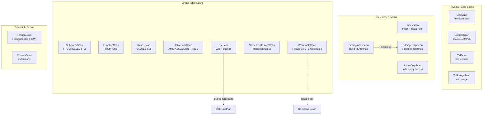
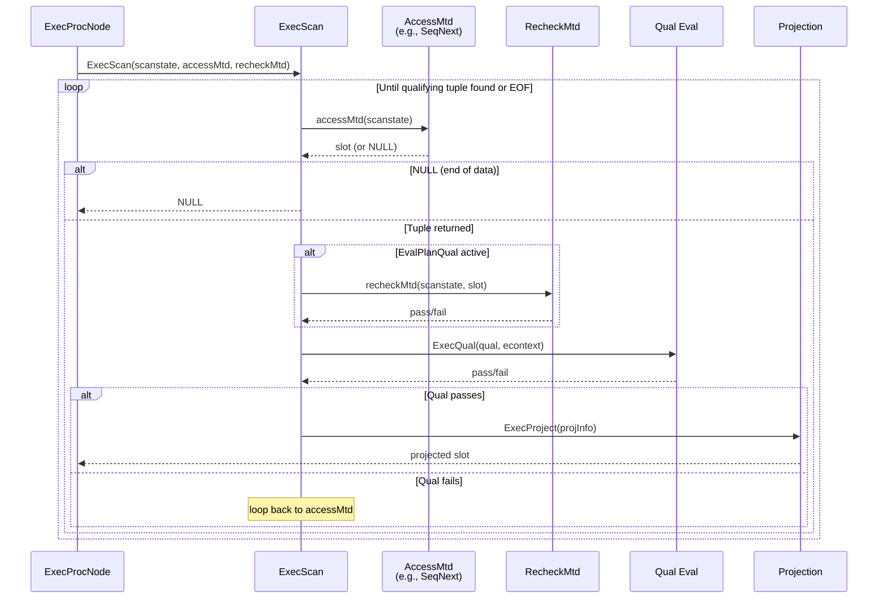

# Scan Nodes Catalog -- PostgreSQL 17 Executor

This document catalogs all 17 scan node types in the PostgreSQL 17 executor.
Every scan node is a leaf node in the plan tree -- it produces tuples by reading
from a data source (table, index, subquery, function, etc.) rather than consuming
tuples from child plan nodes.

All scan nodes except BitmapIndexScan and CustomScan delegate to the common
`ExecScan()` framework defined in `src/backend/executor/execScan.c`. That
framework calls a node-specific `AccessMtd` callback to fetch the next raw
tuple, then applies qualification filters and projection.

```
ExecScan loop:
  1. Call AccessMtd (e.g., SeqNext) to get next raw tuple
  2. If qual exists, evaluate qual on the tuple
  3. If tuple passes, project and return
  4. Otherwise, loop back to step 1
```

---

## Table of Contents

1. [SeqScan](#1-seqscan)
2. [IndexScan](#2-indexscan)
3. [IndexOnlyScan](#3-indexonlyscan)
4. [BitmapIndexScan](#4-bitmapindexscan)
5. [BitmapHeapScan](#5-bitmapheapscan)
6. [TidScan](#6-tidscan)
7. [TidRangeScan](#7-tidrangescan)
8. [SubqueryScan](#8-subqueryscan)
9. [FunctionScan](#9-functionscan)
10. [ValuesScan](#10-valuesscan)
11. [TableFuncScan](#11-tablefuncscan)
12. [CteScan](#12-ctescan)
13. [NamedTuplestoreScan](#13-namedtuplestorescan)
14. [WorkTableScan](#14-worktablescan)
15. [ForeignScan](#15-foreignscan)
16. [CustomScan](#16-customscan)
17. [SampleScan](#17-samplescan)

---

## Scan Node Architecture Overview



---

## 1. SeqScan

**Identity**
- NodeTag: `T_SeqScan` / `T_SeqScanState`
- Plan struct: `SeqScan` (`src/include/nodes/plannodes.h`)
- PlanState struct: `SeqScanState` (`src/include/nodes/execnodes.h`)
- Source: `src/backend/executor/nodeSeqscan.c` (303 lines)

**Purpose**: Sequential scan of a heap relation. This is the most fundamental
scan type and the fallback when no index is applicable. Produced by any
`SELECT ... FROM table` when the planner determines a full-table scan is
cheapest (or no suitable index exists).

**Initialization** (`ExecInitSeqScan` -- line 122):
```c
SeqScanState *
ExecInitSeqScan(SeqScan *node, EState *estate, int eflags)
```
- Allocates `SeqScanState` via `makeNode(SeqScanState)`
- Opens the scan relation via `ExecOpenScanRelation()`
- Creates a scan tuple slot matching the relation's row type
- Initializes result type, projection info, and qual expressions
- Does NOT start the actual heap scan yet (lazy initialization in `SeqNext`)

**Execution** (`ExecSeqScan` -- line 107):
```c
static TupleTableSlot *
ExecSeqScan(PlanState *pstate)
{
    SeqScanState *node = castNode(SeqScanState, pstate);
    return ExecScan(&node->ss,
                    (ExecScanAccessMtd) SeqNext,
                    (ExecScanRecheckMtd) SeqRecheck);
}
```
Step-by-step logic in `SeqNext` (line 49):
1. If `ss_currentScanDesc` is NULL, call `table_beginscan()` to start the scan
2. Call `table_scan_getnextslot()` to fetch the next tuple in the current scan direction
3. Return the slot if a tuple was found, or NULL at end of relation

The recheck function `SeqRecheck` always returns true -- sequential scans do not use scan keys, so there is nothing to recheck during EvalPlanQual.

**End** (`ExecEndSeqScan` -- line 183):
- Calls `table_endscan()` to close the heap scan descriptor

**Rescan** (`ExecReScanSeqScan` -- line 211):
- Calls `table_rescan()` with NULL new scan keys to restart from the beginning
- Calls `ExecScanReScan()` to reset the common scan state

**Key State Fields**:
| Field | Type | Description |
|-------|------|-------------|
| `ss.ss_currentRelation` | `Relation` | The open heap relation |
| `ss.ss_currentScanDesc` | `TableScanDesc` | Heap scan descriptor (lazily initialized) |
| `ss.ss_ScanTupleSlot` | `TupleTableSlot` | Slot for the current scan tuple |
| `pscan_len` | `Size` | Length of parallel scan descriptor in DSM |

**Performance**:
- Time: O(N) where N is the number of heap pages. Every page and every live tuple is visited.
- Memory: O(1) beyond the scan descriptor -- tuples are returned one at a time.
- I/O: Sequential read pattern; benefits heavily from OS read-ahead and `effective_io_concurrency`. Uses synchronized scans when multiple backends scan the same relation.

**Parallel Support**: Fully parallel-aware. The parallel implementation divides
the heap into block ranges via `ParallelTableScanDesc` in shared memory:
- `ExecSeqScanEstimate()` -- estimates DSM space via `table_parallelscan_estimate()`
- `ExecSeqScanInitializeDSM()` -- allocates and initializes `ParallelTableScanDesc`
- `ExecSeqScanInitializeWorker()` -- worker attaches to shared scan descriptor via `table_beginscan_parallel()`

**Example SQL**:
```sql
-- Simple sequential scan
EXPLAIN SELECT * FROM orders WHERE status = 'pending';

                        QUERY PLAN
-----------------------------------------------------------
 Seq Scan on orders  (cost=0.00..1520.00 rows=200 width=48)
   Filter: (status = 'pending')
```

---

## 2. IndexScan

**Identity**
- NodeTag: `T_IndexScan` / `T_IndexScanState`
- Plan struct: `IndexScan` (`src/include/nodes/plannodes.h`)
- PlanState struct: `IndexScanState` (`src/include/nodes/execnodes.h`)
- Source: `src/backend/executor/nodeIndexscan.c` (1829 lines)

**Purpose**: Scans a relation using an index to locate matching tuples, then
fetches the actual heap tuples. Produced by queries with `WHERE` conditions on
indexed columns, or by `ORDER BY` on indexed columns. Also used for
ORDER BY expressions with ordering operators (e.g., KNN-GiST distance ordering).

**Initialization** (`ExecInitIndexScan` -- line 874):
```c
IndexScanState *
ExecInitIndexScan(IndexScan *node, EState *estate, int eflags)
```
- Allocates `IndexScanState`
- Opens the base relation and the index relation
- Builds scan keys from index qualifications via `ExecIndexBuildScanKeys()`
- Separates keys into: compile-time constants, runtime keys, and array keys
- If ordering operators present, sets up a pairing heap for reordering
- Creates a separate `ExprContext` for runtime key evaluation

**Execution** (`ExecIndexScan` -- line 586):
```c
static TupleTableSlot *
ExecIndexScan(PlanState *pstate)
{
    IndexScanState *node = castNode(IndexScanState, pstate);
    if (node->iss_NumRuntimeKeys != 0 && !node->iss_RuntimeKeysReady)
        ExecReScan((PlanState *) node);
    return ExecScan(&node->ss,
                    (ExecScanAccessMtd) IndexNext,
                    (ExecScanRecheckMtd) IndexRecheck);
}
```

Two access method variants exist:

`IndexNext` (line 79) -- standard path:
1. Lazily initialize index scan descriptor if NULL
2. Call `index_getnext_slot()` to get next matching tuple
3. If the index was lossy (`xs_recheck`), re-evaluate the original index quals
4. Return the tuple, or NULL at end

`IndexNextWithReorder` (line 167) -- ORDER BY operator path:
1. Maintains a pairing heap of fetched tuples ordered by ORDER BY expressions
2. Fetches tuples from index, evaluates actual ORDER BY distances
3. Pushes inexact tuples onto the heap, returns exact ones immediately
4. When the top of the heap is guaranteed to be the next result, pops and returns it

**End** (`ExecEndIndexScan` -- line 839):
- Closes the index scan descriptor with `index_endscan()`
- Closes the index relation with `index_close()`

**Rescan** (`ExecReScanIndexScan` -- line 613):
- Resets runtime key context and re-evaluates runtime scan keys
- Advances array keys if applicable (for `ScalarArrayOp` with `IN` clauses)
- Calls `index_rescan()` with updated keys
- Returns true/false indicating whether more array keys remain

**Key State Fields**:
| Field | Type | Description |
|-------|------|-------------|
| `iss_ScanDesc` | `IndexScanDesc` | Index scan descriptor |
| `iss_RelationDesc` | `Relation` | The open index relation |
| `iss_ScanKeys` | `ScanKey` | Compiled scan keys for the index AM |
| `iss_NumScanKeys` | `int` | Number of scan keys |
| `iss_OrderByKeys` | `ScanKey` | ORDER BY operator keys |
| `iss_NumRuntimeKeys` | `int` | Count of keys needing runtime evaluation |
| `iss_RuntimeKeysReady` | `bool` | True after runtime keys are computed |
| `iss_ReachedEnd` | `bool` | True when index scan has exhausted all matches |
| `indexqualorig` | `ExprState *` | Original index quals for lossy recheck |
| `iss_ReorderQueue` | `pairingheap *` | Heap for ORDER BY reordering |

**Performance**:
- Time: O(log N + K) for B-tree index where N = index size, K = matching tuples.
  Each match requires a heap page fetch (random I/O).
- Memory: O(1) for standard scan; O(K) for ORDER BY reordering where K is the
  lookahead window of inexact tuples.
- I/O: Random I/O pattern for heap fetches. Effective for highly selective queries.

**Parallel Support**: Fully parallel-aware via `ParallelIndexScanDesc`:
- `ExecIndexScanEstimate()` / `ExecIndexScanInitializeDSM()` / `ExecIndexScanInitializeWorker()`

**Example SQL**:
```sql
-- Index scan with WHERE clause
EXPLAIN SELECT * FROM employees WHERE employee_id = 42;

                                    QUERY PLAN
---------------------------------------------------------------------------
 Index Scan using employees_pkey on employees  (cost=0.29..8.31 rows=1 width=64)
   Index Cond: (employee_id = 42)

-- Index scan with ORDER BY using ordering operator (KNN)
EXPLAIN SELECT * FROM places ORDER BY location <-> point '(0,0)' LIMIT 10;

                                    QUERY PLAN
---------------------------------------------------------------------------
 Limit  (cost=0.14..1.65 rows=10 width=40)
   ->  Index Scan using places_location_idx on places  (cost=0.14..150.14 rows=1000 width=40)
         Order By: (location <-> '(0,0)'::point)
```

---

## 3. IndexOnlyScan

**Identity**
- NodeTag: `T_IndexOnlyScan` / `T_IndexOnlyScanState`
- Plan struct: `IndexOnlyScan` (`src/include/nodes/plannodes.h`)
- PlanState struct: `IndexOnlyScanState` (`src/include/nodes/execnodes.h`)
- Source: `src/backend/executor/nodeIndexonlyscan.c` (800 lines)

**Purpose**: Scans an index and returns data directly from the index tuples
without fetching the heap tuple, when all required columns are available in the
index. A visibility map check determines whether the heap page visit can be
skipped (all tuples on the page are known visible to all transactions).

Produced when the planner determines all columns in the SELECT list and WHERE
clause are included in a covering index.

**Initialization** (`ExecInitIndexOnlyScan` -- line 505):
```c
IndexOnlyScanState *
ExecInitIndexOnlyScan(IndexOnlyScan *node, EState *estate, int eflags)
```
- Allocates `IndexOnlyScanState`
- Opens both base relation and index relation
- Builds scan tuple descriptor from `indextlist` (the planner's description
  of what the index returns), NOT from the physical index descriptor
- Allocates a separate `ioss_TableSlot` for visibility rechecks
- Handles the special case of `name` type columns stored as cstrings in btree indexes
- Builds scan keys and ORDER BY keys via `ExecIndexBuildScanKeys()`

**Execution** (`ExecIndexOnlyScan` -- line 335):

`IndexOnlyNext` (line 60) step-by-step:
1. Lazily initialize scan descriptor, set `xs_want_itup = true`
2. Call `index_getnext_tid()` to get the next matching TID
3. Check visibility map: `VM_ALL_VISIBLE()` for the heap page
   - If page is all-visible: skip heap fetch entirely (the fast path)
   - If not all-visible: call `index_fetch_heap()` to verify tuple visibility
4. Fill scan tuple slot from index data (`xs_hitup` or `xs_itup`)
5. If index was lossy (`xs_recheck`), re-evaluate index quals
6. If heap was NOT accessed, take a predicate lock at page level
7. Return the slot

```c
if (!VM_ALL_VISIBLE(scandesc->heapRelation,
                    ItemPointerGetBlockNumber(tid),
                    &node->ioss_VMBuffer))
{
    InstrCountTuples2(node, 1);
    if (!index_fetch_heap(scandesc, node->ioss_TableSlot))
        continue;  /* not visible, try next */
}
```

**End** (`ExecEndIndexOnlyScan` -- line 397):
- Releases the visibility map buffer pin
- Closes the index scan and index relation

**Rescan** (`ExecReScanIndexOnlyScan` -- line 362):
- Re-evaluates runtime keys
- Calls `index_rescan()` with updated keys

**Key State Fields**:
| Field | Type | Description |
|-------|------|-------------|
| `ioss_ScanDesc` | `IndexScanDesc` | Index scan descriptor |
| `ioss_RelationDesc` | `Relation` | Open index relation |
| `ioss_VMBuffer` | `Buffer` | Pinned visibility map page |
| `ioss_TableSlot` | `TupleTableSlot` | Slot for heap tuple (recheck only) |
| `recheckqual` | `ExprState *` | Recheck quals for lossy indexes |
| `ioss_NameCStringAttNums` | `AttrNumber *` | Columns needing cstring->name conversion |

**Performance**:
- Time: O(log N + K) where K = matching tuples. Heap fetches occur only for
  pages without all-visible status in the visibility map.
- Memory: O(1).
- I/O: Can be dramatically lower than IndexScan since heap pages are skipped for
  recently-VACUUMed tables. Best case: zero heap I/O.

**Parallel Support**: Fully parallel-aware via `ParallelIndexScanDesc`.

**Example SQL**:
```sql
-- Index-only scan (all columns in index)
CREATE INDEX idx_emp_name ON employees (name);
EXPLAIN SELECT name FROM employees WHERE name = 'Smith';

                                       QUERY PLAN
---------------------------------------------------------------------------
 Index Only Scan using idx_emp_name on employees  (cost=0.29..4.31 rows=1 width=32)
   Index Cond: (name = 'Smith')
```

---

## 4. BitmapIndexScan

**Identity**
- NodeTag: `T_BitmapIndexScan` / `T_BitmapIndexScanState`
- Plan struct: `BitmapIndexScan` (`src/include/nodes/plannodes.h`)
- PlanState struct: `BitmapIndexScanState` (`src/include/nodes/execnodes.h`)
- Source: `src/backend/executor/nodeBitmapIndexscan.c` (322 lines)

**Purpose**: Scans an index and builds a TID bitmap of matching tuple locations.
This node does NOT return tuples -- it returns a `TIDBitmap` node to its parent
(always a BitmapHeapScan, BitmapAnd, or BitmapOr). It uses the
`MultiExecProcNode` protocol instead of the standard `ExecProcNode` protocol.

Produced by queries where the planner chooses bitmap scan strategy, typically
for medium-selectivity conditions or when combining multiple index conditions.

**Initialization** (`ExecInitBitmapIndexScan` -- line 201):
```c
BitmapIndexScanState *
ExecInitBitmapIndexScan(BitmapIndexScan *node, EState *estate, int eflags)
```
- Does NOT open the base relation (ancestor BitmapHeapScan holds the lock)
- Opens the index relation
- Builds scan keys including array keys
- Starts the bitmap index scan via `index_beginscan_bitmap()`
- Does not create a standard expression context (no tuple processing)

**Execution** (`MultiExecBitmapIndexScan` -- line 48):
```c
Node *
MultiExecBitmapIndexScan(BitmapIndexScanState *node)
```
1. Handle runtime keys: if not ready, call `ExecReScan()` first
2. Create or reuse a `TIDBitmap` (parent may provide `biss_result` for OR union)
3. Loop: call `index_getbitmap()` to fill the bitmap with matching TIDs
4. For array keys, advance to next array element and rescan
5. Return `(Node *) tbm` -- the TID bitmap

```c
tbm = tbm_create(work_mem * 1024L,
                 ((BitmapIndexScan *) node->ss.ps.plan)->isshared ?
                 node->ss.ps.state->es_query_dsa : NULL);
while (doscan)
{
    nTuples += (double) index_getbitmap(scandesc, tbm);
    doscan = ExecIndexAdvanceArrayKeys(node->biss_ArrayKeys, ...);
    if (doscan)
        index_rescan(node->biss_ScanDesc, ...);
}
return (Node *) tbm;
```

Note: calling `ExecProcNode` on this node will ERROR -- it only supports `MultiExecProcNode`.

**End** (`ExecEndBitmapIndexScan` -- line 174):
- Closes index scan and index relation

**Rescan** (`ExecReScanBitmapIndexScan` -- line 130):
- Re-evaluates runtime keys and array keys
- Calls `index_rescan()` with updated keys

**Key State Fields**:
| Field | Type | Description |
|-------|------|-------------|
| `biss_result` | `TIDBitmap *` | Pre-allocated result bitmap (from parent) |
| `biss_ScanDesc` | `IndexScanDesc` | Index scan descriptor |
| `biss_RelationDesc` | `Relation` | Open index relation |
| `biss_ScanKeys` | `ScanKey` | Compiled scan keys |
| `biss_ArrayKeys` | `IndexArrayKeyInfo *` | Array key info for IN-list scans |
| `biss_NumArrayKeys` | `int` | Number of array keys |
| `biss_RuntimeKeysReady` | `bool` | Runtime keys computed |

**Performance**:
- Time: O(log N + K) to build the bitmap. Bitmap memory is bounded by `work_mem`.
- Memory: O(min(K, work_mem)) -- when TID bitmap exceeds work_mem, it becomes
  "lossy" (page-level rather than tuple-level granularity).
- I/O: Index pages only; no heap access in this node.

**Parallel Support**: Supports shared bitmaps via DSA when `isshared` is true.

**Example SQL**:
```sql
-- BitmapIndexScan appears as child of BitmapHeapScan
EXPLAIN SELECT * FROM orders WHERE customer_id = 100 OR status = 'urgent';

                                        QUERY PLAN
---------------------------------------------------------------------------
 Bitmap Heap Scan on orders  (cost=9.50..35.50 rows=15 width=48)
   Recheck Cond: ((customer_id = 100) OR (status = 'urgent'))
   ->  BitmapOr  (cost=9.50..9.50 rows=15 width=0)
         ->  Bitmap Index Scan on idx_customer  (cost=0.00..4.50 rows=10 width=0)
               Index Cond: (customer_id = 100)
         ->  Bitmap Index Scan on idx_status  (cost=0.00..4.75 rows=5 width=0)
               Index Cond: (status = 'urgent')
```

---

## 5. BitmapHeapScan

**Identity**
- NodeTag: `T_BitmapHeapScan` / `T_BitmapHeapScanState`
- Plan struct: `BitmapHeapScan` (`src/include/nodes/plannodes.h`)
- PlanState struct: `BitmapHeapScanState` (`src/include/nodes/execnodes.h`)
- Source: `src/backend/executor/nodeBitmapHeapscan.c` (904 lines)

**Purpose**: Fetches heap tuples indicated by a TID bitmap built by its child
node (BitmapIndexScan, BitmapAnd, or BitmapOr). The bitmap organizes TIDs by
page, enabling sequential I/O on heap pages instead of random I/O.

CRITICAL: Requires an MVCC snapshot. Because index and heap scans are decoupled,
the tuple slot could have been reused between the index scan and the heap fetch.
Only MVCC snapshots safely handle this race condition.

**Initialization** (`ExecInitBitmapHeapScan` -- line 684):
```c
BitmapHeapScanState *
ExecInitBitmapHeapScan(BitmapHeapScan *node, EState *estate, int eflags)
```
- Asserts `IsMVCCSnapshot(estate->es_snapshot)`
- Opens the scan relation
- Initializes the child plan (the bitmap-producing subnode)
- Initializes `bitmapqualorig` for lossy page recheck
- Computes `prefetch_maximum` from tablespace I/O concurrency settings
- All bitmap state (tbm, iterators) is NULL until first execution

**Execution** (`ExecBitmapHeapScan` -- line 580):

`BitmapHeapNext` (line 68) step-by-step:
1. On first call: execute child plan via `MultiExecProcNode()` to build the TID bitmap
2. Begin iteration over the bitmap (parallel: shared iterator)
3. Set up prefetch iterator for read-ahead
4. Main loop:
   a. Get next `TBMIterateResult` (page-level entry from bitmap)
   b. Call `table_scan_bitmap_next_block()` to position on heap page
   c. Track exact pages vs. lossy pages
   d. Issue prefetch requests for upcoming pages
   e. Call `table_scan_bitmap_next_tuple()` to get each tuple on the page
   f. If the page was lossy (`tbmres->recheck`), re-evaluate original quals
   g. Return each qualifying tuple

```c
if (tbmres->recheck)
{
    econtext->ecxt_scantuple = slot;
    if (!ExecQualAndReset(node->bitmapqualorig, econtext))
    {
        InstrCountFiltered2(node, 1);
        ExecClearTuple(slot);
        continue;
    }
}
```

**End** (`ExecEndBitmapHeapScan` -- line 639):
- Ends the child plan node
- Frees bitmap iterators and the TID bitmap itself
- Releases prefetch visibility map buffer
- Closes the heap scan

**Rescan** (`ExecReScanBitmapHeapScan` -- line 594):
- Releases all bitmap state (iterators, bitmap, prefetch buffers)
- Sets `initialized = false` to force rebuilding the bitmap
- Rescans the child plan if needed

**Key State Fields**:
| Field | Type | Description |
|-------|------|-------------|
| `tbm` | `TIDBitmap *` | The TID bitmap from child node |
| `tbmiterator` | `TBMIterator *` | Current bitmap iterator |
| `tbmres` | `TBMIterateResult *` | Current page result |
| `exact_pages` | `long` | Count of exact (tuple-level) pages |
| `lossy_pages` | `long` | Count of lossy (page-level) pages |
| `prefetch_iterator` | `TBMIterator *` | Read-ahead iterator |
| `prefetch_pages` | `int` | Pages prefetched ahead of main iterator |
| `prefetch_target` | `int` | Current prefetch distance target |
| `prefetch_maximum` | `int` | Max prefetch from IO concurrency setting |
| `bitmapqualorig` | `ExprState *` | Original quals for lossy recheck |
| `pstate` | `ParallelBitmapHeapState *` | Shared state for parallel execution |
| `initialized` | `bool` | Bitmap has been built |

**Performance**:
- Time: O(P + T) where P = distinct pages in bitmap, T = tuples on those pages.
- Memory: The TID bitmap uses up to `work_mem`. When exceeded, it becomes lossy.
- I/O: Sequential on heap pages (bitmap sorts by page number). Prefetching
  reduces latency. Lossy pages require full-page recheck.

**Parallel Support**: Fully parallel-aware. Leader builds the bitmap, workers
share it via `ParallelBitmapHeapState`. Workers coordinate via `ConditionVariable`
and `SpinLock`.

**Example SQL**:
```sql
EXPLAIN SELECT * FROM orders WHERE amount > 1000 AND region = 'west';

                                        QUERY PLAN
---------------------------------------------------------------------------
 Bitmap Heap Scan on orders  (cost=12.50..150.50 rows=50 width=48)
   Recheck Cond: ((amount > 1000) AND (region = 'west'))
   ->  BitmapAnd  (cost=12.50..12.50 rows=50 width=0)
         ->  Bitmap Index Scan on idx_amount  (cost=0.00..5.00 rows=500 width=0)
               Index Cond: (amount > 1000)
         ->  Bitmap Index Scan on idx_region  (cost=0.00..7.25 rows=100 width=0)
               Index Cond: (region = 'west')
```

---

## 6. TidScan

**Identity**
- NodeTag: `T_TidScan` / `T_TidScanState`
- Plan struct: `TidScan` (`src/include/nodes/plannodes.h`)
- PlanState struct: `TidScanState` (`src/include/nodes/execnodes.h`)
- Source: `src/backend/executor/nodeTidscan.c` (549 lines)

**Purpose**: Fetches tuples directly by their tuple identifier (ctid). Produced
when the WHERE clause contains conditions like `ctid = '(0,1)'` or
`WHERE CURRENT OF cursor_name`.

**Initialization** (`ExecInitTidScan` -- line 487):
```c
TidScanState *
ExecInitTidScan(TidScan *node, EState *estate, int eflags)
```
- Opens scan relation
- Marks TID list as not yet computed (`tss_TidList = NULL`, `tss_TidPtr = -1`)
- Calls `TidExprListCreate()` to compile TID-yielding expressions from `tidquals`
- Handles three expression forms: `ctid = expr`, `ctid = ANY(array)`, `CURRENT OF`

**Execution** (`ExecTidScan` -- line 432):

`TidNext` (line 311) step-by-step:
1. On first call: evaluate TID expressions via `TidListEval()`
   - Evaluates each TID expression to produce ItemPointerData values
   - Validates TIDs against table bounds
   - Sorts and deduplicates the TID list (OR semantics across expressions)
2. Walk through the sorted TID list in scan direction (forward or backward)
3. For `CURRENT OF`, call `table_tuple_get_latest_tid()` to handle concurrent updates
4. Fetch each tuple with `table_tuple_fetch_row_version()`
5. Skip TIDs that fail the snapshot check

```c
while (node->tss_TidPtr >= 0 && node->tss_TidPtr < numTids)
{
    ItemPointerData tid = tidList[node->tss_TidPtr];
    if (node->tss_isCurrentOf)
        table_tuple_get_latest_tid(scan, &tid);
    if (table_tuple_fetch_row_version(heapRelation, &tid, snapshot, slot))
        return slot;
    /* Bad TID or failed snapshot qual; try next */
}
```

**End** (`ExecEndTidScan` -- line 469):
- Closes the table scan descriptor

**Rescan** (`ExecReScanTidScan` -- line 447):
- Frees the TID list, resets pointer to -1 (forces re-evaluation)

**Key State Fields**:
| Field | Type | Description |
|-------|------|-------------|
| `tss_tidexprs` | `List *` | List of TidExpr nodes |
| `tss_isCurrentOf` | `bool` | True if using CURRENT OF |
| `tss_TidList` | `ItemPointerData *` | Sorted array of TIDs to visit |
| `tss_NumTids` | `int` | Number of TIDs in array |
| `tss_TidPtr` | `int` | Current position in TID array |

**Performance**:
- Time: O(K) where K = number of TIDs. Each TID fetch is a direct page access.
- Memory: O(K) for the TID array.
- I/O: Up to K random page reads (but duplicates on same page share the read).

**Parallel Support**: Not parallel-aware (not typically useful for few TIDs).

**Example SQL**:
```sql
-- Direct TID access
EXPLAIN SELECT * FROM employees WHERE ctid = '(0,1)';

                            QUERY PLAN
---------------------------------------------------------------------------
 Tid Scan on employees  (cost=0.00..4.01 rows=1 width=64)
   TID Cond: (ctid = '(0,1)'::tid)

-- Cursor-based access
DECLARE cur CURSOR FOR SELECT * FROM employees;
FETCH NEXT FROM cur;
UPDATE employees SET salary = salary * 1.1 WHERE CURRENT OF cur;
```

---

## 7. TidRangeScan

**Identity**
- NodeTag: `T_TidRangeScan` / `T_TidRangeScanState`
- Plan struct: `TidRangeScan` (`src/include/nodes/plannodes.h`)
- PlanState struct: `TidRangeScanState` (`src/include/nodes/execnodes.h`)
- Source: `src/backend/executor/nodeTidrangescan.c` (406 lines)

**Purpose**: Scans a contiguous range of tuple identifiers. Produced when the
WHERE clause contains range conditions on ctid such as `ctid >= '(0,0)' AND
ctid < '(100,0)'`. This is a PostgreSQL 14+ feature.

**Initialization** (`ExecInitTidRangeScan` -- line 346):
```c
TidRangeScanState *
ExecInitTidRangeScan(TidRangeScan *node, EState *estate, int eflags)
```
- Opens the scan relation
- Marks scan as not in progress (`trss_inScan = false`)
- Calls `TidExprListCreate()` to compile upper/lower bound expressions
- Each bound is classified as `TIDEXPR_UPPER_BOUND` or `TIDEXPR_LOWER_BOUND`
  with an `inclusive` flag

**Execution** (`ExecTidRangeScan` -- line 293):

`TidRangeNext` (line 219) step-by-step:
1. On first call: evaluate TID range via `TidRangeEval()`
   - Initializes bounds to [0,0]..[InvalidBlockNumber,UINT16_MAX]
   - Narrows bounds based on each `TidOpExpr`
   - Non-inclusive bounds are normalized to inclusive via `ItemPointerInc/Dec`
2. Begin a tid-range scan with `table_beginscan_tidrange()`
3. Call `table_scan_getnextslot_tidrange()` for each subsequent tuple
4. Return NULL when range is exhausted

```c
if (!TidRangeEval(node))
    return NULL;  /* empty range detected */
scandesc = table_beginscan_tidrange(node->ss.ss_currentRelation,
                                    estate->es_snapshot,
                                    &node->trss_mintid,
                                    &node->trss_maxtid);
```

**End** (`ExecEndTidRangeScan` -- line 326):
- Calls `table_endscan()` if scan descriptor exists

**Rescan** (`ExecReScanTidRangeScan` -- line 307):
- Sets `trss_inScan = false` (defers actual rescan to next execution call)

**Key State Fields**:
| Field | Type | Description |
|-------|------|-------------|
| `trss_tidexprs` | `List *` | List of TidOpExpr bounds |
| `trss_mintid` | `ItemPointerData` | Computed lower bound (inclusive) |
| `trss_maxtid` | `ItemPointerData` | Computed upper bound (inclusive) |
| `trss_inScan` | `bool` | Whether a scan is currently in progress |

**Performance**:
- Time: O(P) where P = number of pages in the TID range.
- Memory: O(1).
- I/O: Sequential within the specified page range.

**Parallel Support**: Not parallel-aware.

**Example SQL**:
```sql
-- TID range scan
EXPLAIN SELECT * FROM large_table WHERE ctid >= '(0,0)' AND ctid < '(100,0)';

                                QUERY PLAN
---------------------------------------------------------------------------
 Tid Range Scan on large_table  (cost=0.00..200.00 rows=10000 width=48)
   TID Cond: ((ctid >= '(0,0)'::tid) AND (ctid < '(100,0)'::tid))
```

---

## 8. SubqueryScan

**Identity**
- NodeTag: `T_SubqueryScan` / `T_SubqueryScanState`
- Plan struct: `SubqueryScan` (`src/include/nodes/plannodes.h`)
- PlanState struct: `SubqueryScanState` (`src/include/nodes/execnodes.h`)
- Source: `src/backend/executor/nodeSubqueryscan.c` (202 lines)

**Purpose**: Wraps a complete subplan and presents its output as a scan source.
Produced when a subquery appears in the FROM clause. Often optimized away by
the planner ("subquery scan removal"), but retained when a filter must be applied
to the subquery's output or when the subquery has side effects.

**Initialization** (`ExecInitSubqueryScan` -- line 96):
```c
SubqueryScanState *
ExecInitSubqueryScan(SubqueryScan *node, EState *estate, int eflags)
```
- Initializes the child subplan via `ExecInitNode(node->subplan, ...)`
- Sets scan tuple type from subplan's result type
- Configures slot ops to match the subplan's result slot ops
- No base relation is opened (this is a virtual scan)

**Execution** (`ExecSubqueryScan` -- line 82):

`SubqueryNext` (line 45):
```c
static TupleTableSlot *
SubqueryNext(SubqueryScanState *node)
{
    TupleTableSlot *slot;
    slot = ExecProcNode(node->subplan);
    return slot;
}
```
Simply calls `ExecProcNode()` on the child subplan and returns its result slot
directly (no copying -- the ScanTupleSlot is only used for EvalPlanQual
rechecks).

**End** (`ExecEndSubqueryScan` -- line 167):
- Calls `ExecEndNode(node->subplan)`

**Rescan** (`ExecReScanSubqueryScan` -- line 182):
- Propagates changed parameter sets to the subplan via `UpdateChangedParamSet()`
- Calls `ExecReScan(node->subplan)` if subplan has no pending parameter changes

**Key State Fields**:
| Field | Type | Description |
|-------|------|-------------|
| `subplan` | `PlanState *` | The child subplan state |

**Performance**:
- Entirely dependent on the subplan's performance.
- The SubqueryScan node itself adds negligible overhead.

**Parallel Support**: Not parallel-aware (the subplan beneath it may be).

**Example SQL**:
```sql
-- SubqueryScan wraps the inner SELECT
EXPLAIN SELECT * FROM (SELECT id, name FROM employees WHERE active) sub
  WHERE sub.id > 100;

                                QUERY PLAN
---------------------------------------------------------------------------
 Subquery Scan on sub  (cost=0.00..25.00 rows=50 width=36)
   Filter: (sub.id > 100)
   ->  Seq Scan on employees  (cost=0.00..20.00 rows=200 width=36)
         Filter: active
```

---

## 9. FunctionScan

**Identity**
- NodeTag: `T_FunctionScan` / `T_FunctionScanState`
- Plan struct: `FunctionScan` (`src/include/nodes/plannodes.h`)
- PlanState struct: `FunctionScanState` (`src/include/nodes/execnodes.h`)
- Source: `src/backend/executor/nodeFunctionscan.c` (614 lines)

**Purpose**: Scans the result set of one or more set-returning functions (SRFs)
appearing in the FROM clause. Supports `WITH ORDINALITY` for row numbering and
multiple functions with cross-join semantics (null-padded to the longest).

Produced by queries like `SELECT * FROM generate_series(1,10)` or
`SELECT * FROM func1(), func2() WITH ORDINALITY`.

**Initialization** (`ExecInitFunctionScan` -- line 278):
```c
FunctionScanState *
ExecInitFunctionScan(FunctionScan *node, EState *estate, int eflags)
```
- Counts functions and determines "simple" mode (single function, no ordinality)
- For each function: initializes `SetExprState` via `ExecInitTableFunctionResult()`
- Builds per-function `FunctionScanPerFuncState` (tupdesc, slot, tuplestore=NULL)
- Constructs combined scan tuple descriptor for multi-function case
- Creates `argcontext` memory context for function argument evaluation

**Execution** (`ExecFunctionScan` -- line 264):

`FunctionNext` (line 58) has two paths:

Fast path (simple=true, single function no ordinality):
1. On first call: execute function via `ExecMakeTableFunctionResult()` into a tuplestore
2. Fetch next tuple from tuplestore via `tuplestore_gettupleslot()`

General path (multiple functions or WITH ORDINALITY):
1. For each function, lazily materialize into its own tuplestore
2. Fetch one tuple from each function's tuplestore
3. Combine into the scan slot (null-padding shorter results)
4. Append ordinality column if requested
5. Continue until ALL functions are exhausted

```c
/* Fast path for single function */
if (node->simple)
{
    if (tstore == NULL)
        node->funcstates[0].tstore = tstore =
            ExecMakeTableFunctionResult(node->funcstates[0].setexpr, ...);
    (void) tuplestore_gettupleslot(tstore, ScanDirectionIsForward(direction),
                                   false, scanslot);
    return scanslot;
}
```

**End** (`ExecEndFunctionScan` -- line 529):
- Frees all tuplestores for each function

**Rescan** (`ExecReScanFunctionScan` -- line 555):
- If parameters changed, drops and rebuilds affected tuplestores
- Otherwise, rewinds existing tuplestores
- Resets ordinality counter to 0

**Key State Fields**:
| Field | Type | Description |
|-------|------|-------------|
| `funcstates` | `FunctionScanPerFuncState *` | Per-function state array |
| `nfuncs` | `int` | Number of functions |
| `simple` | `bool` | Single function without ordinality |
| `ordinality` | `bool` | WITH ORDINALITY enabled |
| `ordinal` | `int64` | Current row number |
| `argcontext` | `MemoryContext` | Context for function argument evaluation |

**Performance**:
- Time: O(T) where T = total rows returned by all functions.
- Memory: O(T) -- all function results are materialized in tuplestores.
- I/O: Tuplestores may spill to disk if `work_mem` is exceeded.

**Parallel Support**: Not parallel-aware.

**Example SQL**:
```sql
EXPLAIN SELECT * FROM generate_series(1, 100) AS g(n) WITH ORDINALITY;

                            QUERY PLAN
---------------------------------------------------------------------------
 Function Scan on generate_series g  (cost=0.00..1.00 rows=100 width=16)

EXPLAIN SELECT * FROM json_each('{"a":1,"b":2}');

                            QUERY PLAN
---------------------------------------------------------------------------
 Function Scan on json_each  (cost=0.00..1.00 rows=100 width=64)
```

---

## 10. ValuesScan

**Identity**
- NodeTag: `T_ValuesScan` / `T_ValuesScanState`
- Plan struct: `ValuesScan` (`src/include/nodes/plannodes.h`)
- PlanState struct: `ValuesScanState` (`src/include/nodes/execnodes.h`)
- Source: `src/backend/executor/nodeValuesscan.c` (337 lines)

**Purpose**: Scans an inline VALUES list. Produced by the `VALUES` clause in
SQL statements, both standalone (`VALUES (1,'a'), (2,'b')`) and within
`INSERT INTO ... VALUES ...`.

**Initialization** (`ExecInitValuesScan` -- line 209):
```c
ValuesScanState *
ExecInitValuesScan(ValuesScan *node, EState *estate, int eflags)
```
- Creates two expression contexts: one for per-row evaluation (`rowcontext`)
  and one for quals/projection
- Converts the list of expression sublists into arrays for indexed access
- Pre-initializes expression state for rows containing SubPlans (these cannot
  be built transiently)
- Disables JIT for SubPlan-containing rows (executed only once)
- Sets `curr_idx = -1` (before first row)

**Execution** (`ExecValuesScan` -- line 195):

`ValuesNext` (line 46) step-by-step:
1. Advance `curr_idx` in the current scan direction
2. If `curr_idx` is out of bounds, return empty slot
3. Reset per-row expression context (to free memory from prior row)
4. If expression state was not pre-built, build it transiently in per-tuple memory
5. Evaluate each expression in the row to fill slot values
6. Force R/W expanded datums to read-only (safety for multiple references)
7. Store virtual tuple and return

```c
if (exprstatelist == NIL)
    exprstatelist = ExecInitExprList(exprlist, NULL);  /* transient */

resind = 0;
foreach(lc, exprstatelist)
{
    values[resind] = ExecEvalExpr(estate, econtext, &isnull[resind]);
    values[resind] = MakeExpandedObjectReadOnly(values[resind], ...);
    resind++;
}
ExecStoreVirtualTuple(slot);
```

**End**: No explicit cleanup function -- memory contexts handle deallocation.

**Rescan** (`ExecReScanValuesScan` -- line 327):
- Resets `curr_idx = -1`

**Key State Fields**:
| Field | Type | Description |
|-------|------|-------------|
| `curr_idx` | `int` | Index of current row (-1 = before first) |
| `array_len` | `int` | Total number of value rows |
| `exprlists` | `List **` | Array of expression lists (one per row) |
| `exprstatelists` | `List **` | Pre-built expression state (for SubPlan rows) |
| `rowcontext` | `ExprContext *` | Per-row memory context |

**Performance**:
- Time: O(R * C) where R = rows, C = columns (expression evaluation per cell).
- Memory: O(C) per row -- transient expression state is freed between rows.
- I/O: None (purely in-memory).

**Parallel Support**: Not parallel-aware.

**Example SQL**:
```sql
EXPLAIN VALUES (1, 'alice'), (2, 'bob'), (3, 'carol');

                          QUERY PLAN
---------------------------------------------------------------------------
 Values Scan on "*VALUES*"  (cost=0.00..0.04 rows=3 width=36)

EXPLAIN INSERT INTO users (id, name) VALUES (1, 'alice'), (2, 'bob');

                          QUERY PLAN
---------------------------------------------------------------------------
 Insert on users  (cost=0.00..0.02 rows=0 width=0)
   ->  Values Scan on "*VALUES*"  (cost=0.00..0.02 rows=2 width=36)
```

---

## 11. TableFuncScan

**Identity**
- NodeTag: `T_TableFuncScan` / `T_TableFuncScanState`
- Plan struct: `TableFuncScan` (`src/include/nodes/plannodes.h`)
- PlanState struct: `TableFuncScanState` (`src/include/nodes/execnodes.h`)
- Source: `src/backend/executor/nodeTableFuncscan.c` (525 lines)

**Purpose**: Scans the result of a table-producing function that uses a
structured document as input -- specifically `XMLTABLE` and `JSON_TABLE`.
These SQL/XML and SQL/JSON functions parse a document, apply row and column
filters, and produce a relational result set.

**Initialization** (`ExecInitTableFuncScan` -- line 110):
```c
TableFuncScanState *
ExecInitTableFuncScan(TableFuncScan *node, EState *estate, int eflags)
```
- Builds the scan tuple descriptor from `TableFunc.colnames/coltypes/...`
- Selects the appropriate `TableFuncRoutine` based on function type:
  - `TFT_XMLTABLE` -> `XmlTableRoutine`
  - `TFT_JSONTABLE` -> `JsonbTableRoutine`
- Creates `perTableCxt` memory context for per-call lifetime data
- Initializes expression states for: document expression, row expression,
  column expressions, default expressions, namespace URIs, passing values
- Prepares input functions for type conversion

**Execution** (`ExecTableFuncScan` -- line 96):

`TableFuncNext` (line 53):
1. On first call: execute `tfuncFetchRows()` to materialize all rows:
   a. Call `routine->InitOpaque()` to set up parser state
   b. Evaluate document expression; if NULL, return empty result
   c. Call `tfuncInitialize()`: install namespaces, row filter, column filters
   d. Call `tfuncLoadRows()`: iterate `routine->FetchRow()`, evaluate columns,
      store in tuplestore
   e. Destroy opaque state; reset perTableCxt
2. Subsequent calls: fetch from tuplestore via `tuplestore_gettupleslot()`

```c
while (routine->FetchRow(tstate))
{
    for (colno = 0; colno < natts; colno++)
    {
        if (colno == ordinalitycol)
            values[colno] = Int32GetDatum(tstate->ordinal++);
        else
            values[colno] = routine->GetValue(tstate, colno, ...);
    }
    tuplestore_putvalues(tstate->tupstore, tupdesc, values, nulls);
}
```

**End** (`ExecEndTableFuncScan` -- line 219):
- Frees the tuplestore

**Rescan** (`ExecReScanTableFuncScan` -- line 236):
- If parameters changed, drops and rebuilds tuplestore
- Otherwise rewinds the existing tuplestore

**Key State Fields**:
| Field | Type | Description |
|-------|------|-------------|
| `routine` | `const TableFuncRoutine *` | XML or JSON table function callbacks |
| `tupstore` | `Tuplestorestate *` | Materialized result rows |
| `perTableCxt` | `MemoryContext` | Per-evaluation memory context |
| `docexpr` | `ExprState *` | Document expression |
| `rowexpr` | `ExprState *` | Row path expression |
| `colexprs` | `List *` | Column path expressions |
| `ordinal` | `int` | Ordinality counter |
| `opaque` | `void *` | Parser-specific state |

**Performance**:
- Time: O(D + R * C) where D = document parsing, R = result rows, C = columns.
- Memory: O(R * C) for the tuplestore plus O(D) for parsing.
- I/O: Tuplestore may spill to disk.

**Parallel Support**: Not parallel-aware.

**Example SQL**:
```sql
EXPLAIN SELECT * FROM XMLTABLE(
    '/employees/employee' PASSING xmldata
    COLUMNS name TEXT PATH 'name',
            salary NUMERIC PATH 'salary'
);

                            QUERY PLAN
---------------------------------------------------------------------------
 Table Function Scan on "xmltable"  (cost=0.00..1.00 rows=100 width=64)

EXPLAIN SELECT * FROM JSON_TABLE(
    '{"a":[1,2,3]}', '$.a[*]'
    COLUMNS (val INT PATH '$')
);

                            QUERY PLAN
---------------------------------------------------------------------------
 Table Function Scan on json_table  (cost=0.00..1.00 rows=100 width=4)
```

---

## 12. CteScan

**Identity**
- NodeTag: `T_CteScan` / `T_CteScanState`
- Plan struct: `CteScan` (`src/include/nodes/plannodes.h`)
- PlanState struct: `CteScanState` (`src/include/nodes/execnodes.h`)
- Source: `src/backend/executor/nodeCtescan.c` (340 lines)

**Purpose**: Scans the materialized result of a Common Table Expression (CTE,
`WITH` clause). Multiple CteScan nodes can reference the same CTE -- one
becomes the "leader" that owns the shared tuplestore, while others get their
own read pointers.

**Initialization** (`ExecInitCteScan` -- line 174):
```c
CteScanState *
ExecInitCteScan(CteScan *node, EState *estate, int eflags)
```
- Forces `EXEC_FLAG_REWIND` on the tuplestore (needed for rescans)
- Locates the CTE's subplan via `estate->es_subplanstates[ctePlanId - 1]`
- Uses a `Param` slot to coordinate leader/follower:
  - First CteScan to initialize becomes the leader; creates the tuplestore
  - Subsequent CteScan nodes become followers; allocate their own read pointers
- Scan tuple type matches the CTE subplan's result type

```c
if (scanstate->leader == NULL)
{
    /* I am the leader */
    prmdata->value = PointerGetDatum(scanstate);
    scanstate->leader = scanstate;
    scanstate->cte_table = tuplestore_begin_heap(true, false, work_mem);
    scanstate->readptr = 0;
}
else
{
    /* Not the leader -- get my own read pointer */
    scanstate->readptr =
        tuplestore_alloc_read_pointer(scanstate->leader->cte_table, ...);
}
```

**Execution** (`ExecCteScan` -- line 159):

`CteScanNext` (line 30) step-by-step:
1. Select this node's read pointer on the shared tuplestore
2. If not at EOF, try to fetch from tuplestore (`tuplestore_gettupleslot`, copy=true)
3. If at tuplestore EOF and CTE is not yet exhausted:
   a. Call `ExecProcNode(node->cteplanstate)` to get next CTE tuple
   b. Append tuple to shared tuplestore
   c. Copy tuple into own slot and return
4. Return NULL when CTE is fully exhausted

Note: `copy=true` is essential because other CteScan nodes may advance the
shared tuplestore between calls.

**End** (`ExecEndCteScan` -- line 287):
- Only the leader frees the tuplestore

**Rescan** (`ExecReScanCteScan` -- line 306):
- If CTE subplan has changed parameters: clear entire tuplestore, reset `eof_cte`
- Otherwise: rewind this node's read pointer

**Key State Fields**:
| Field | Type | Description |
|-------|------|-------------|
| `leader` | `CteScanState *` | Pointer to the leader CteScan |
| `cteplanstate` | `PlanState *` | The CTE's subplan |
| `cte_table` | `Tuplestorestate *` | Shared tuplestore (leader only) |
| `eof_cte` | `bool` | CTE subplan fully exhausted |
| `readptr` | `int` | This node's read pointer index |

**Performance**:
- Time: O(T) where T = rows in CTE (materialized on first demand).
- Memory: O(T) for the tuplestore (bounded by `work_mem`, spills to disk).
- I/O: Tuplestore disk spill if CTE result exceeds work_mem.

**Parallel Support**: Not parallel-aware.

**Example SQL**:
```sql
EXPLAIN WITH active_orders AS (
    SELECT * FROM orders WHERE status = 'active'
)
SELECT * FROM active_orders WHERE total > 100;

                                QUERY PLAN
---------------------------------------------------------------------------
 CTE Scan on active_orders  (cost=20.00..22.50 rows=33 width=48)
   Filter: (total > 100)
   CTE active_orders
     ->  Seq Scan on orders  (cost=0.00..20.00 rows=100 width=48)
           Filter: (status = 'active')
```

---

## 13. NamedTuplestoreScan

**Identity**
- NodeTag: `T_NamedTuplestoreScan` / `T_NamedTuplestoreScanState`
- Plan struct: `NamedTuplestoreScan` (`src/include/nodes/plannodes.h`)
- PlanState struct: `NamedTuplestoreScanState` (`src/include/nodes/execnodes.h`)
- Source: `src/backend/executor/nodeNamedtuplestorescan.c` (179 lines)

**Purpose**: Scans a named tuplestore from the query environment. Used
internally for transition tables in AFTER triggers (`OLD TABLE` and `NEW TABLE`
referencing clauses). The tuplestore is pre-populated by the trigger mechanism
before the scan begins.

**Initialization** (`ExecInitNamedTuplestoreScan` -- line 81):
```c
NamedTuplestoreScanState *
ExecInitNamedTuplestoreScan(NamedTuplestoreScan *node, EState *estate, int eflags)
```
- Looks up the `EphemeralNamedRelation` (ENR) by name from `estate->es_queryEnv`
- Attaches to the ENR's pre-existing tuplestore
- Allocates a read pointer with `EXEC_FLAG_REWIND`
- Explicitly rewinds the read pointer to the start

**Execution** (`ExecNamedTuplestoreScan` -- line 66):

`NamedTuplestoreScanNext` (line 30):
```c
static TupleTableSlot *
NamedTuplestoreScanNext(NamedTuplestoreScanState *node)
{
    slot = node->ss.ss_ScanTupleSlot;
    tuplestore_select_read_pointer(node->relation, node->readptr);
    (void) tuplestore_gettupleslot(node->relation, true, false, slot);
    return slot;
}
```
Forward scan only (`Assert(ScanDirectionIsForward(...))`).

**End**: No explicit cleanup -- empty function (handled by memory context destruction).

**Rescan** (`ExecReScanNamedTuplestoreScan` -- line 163):
- Rewinds the read pointer to the beginning of the tuplestore

**Key State Fields**:
| Field | Type | Description |
|-------|------|-------------|
| `relation` | `Tuplestorestate *` | The named tuplestore (from ENR) |
| `tupdesc` | `TupleDesc` | Tuple descriptor from ENR metadata |
| `readptr` | `int` | Read pointer index in the tuplestore |

**Performance**:
- Time: O(T) where T = rows in the tuplestore.
- Memory: Shares the already-allocated tuplestore; no additional allocation.
- I/O: None (tuplestore is already in memory or on disk).

**Parallel Support**: Not parallel-aware.

**Example SQL**:
```sql
-- Transition table access in AFTER trigger
CREATE TRIGGER audit_trigger
  AFTER INSERT ON orders
  REFERENCING NEW TABLE AS new_orders
  FOR EACH STATEMENT
  EXECUTE FUNCTION audit_insert();

-- Inside audit_insert():
-- SELECT * FROM new_orders;  -- uses NamedTuplestoreScan

EXPLAIN (VERBOSE) SELECT * FROM new_orders;  -- within trigger context

                                QUERY PLAN
---------------------------------------------------------------------------
 Named Tuplestore Scan on new_orders  (cost=0.00..0.10 rows=10 width=48)
```

---

## 14. WorkTableScan

**Identity**
- NodeTag: `T_WorkTableScan` / `T_WorkTableScanState`
- Plan struct: `WorkTableScan` (`src/include/nodes/plannodes.h`)
- PlanState struct: `WorkTableScanState` (`src/include/nodes/execnodes.h`)
- Source: `src/backend/executor/nodeWorktablescan.c` (202 lines)

**Purpose**: Scans the working table of a recursive CTE. During each iteration
of the `RecursiveUnion` node, WorkTableScan reads the rows produced by the
previous iteration (stored in a tuplestore managed by `RecursiveUnionState`).

**Initialization** (`ExecInitWorkTableScan` -- line 129):
```c
WorkTableScanState *
ExecInitWorkTableScan(WorkTableScan *node, EState *estate, int eflags)
```
- Does NOT connect to `RecursiveUnionState` yet (set to NULL)
- Defers scan type assignment and projection setup to first execution
- The delay is necessary because `RecursiveUnion` might not be initialized yet
  (corner cases with execution order)

**Execution** (`ExecWorkTableScan` -- line 80):

On first call, resolves the `RecursiveUnionState` via the `Param` slot:
```c
if (node->rustate == NULL)
{
    param = &(estate->es_param_exec_vals[plan->wtParam]);
    node->rustate = castNode(RecursiveUnionState, DatumGetPointer(param->value));
    ExecAssignScanType(&node->ss, ExecGetResultType(&node->rustate->ps));
    ExecAssignScanProjectionInfo(&node->ss);
}
```

`WorkTableScanNext` (line 29):
- Reads from `node->rustate->working_table` (the tuplestore)
- Forward scan only (backward scan is not supported by design, to avoid
  performance cost of enabling backward scan on the tuplestore)
- Does not use copy mode (this node is the sole reader)

**End**: No explicit cleanup (handled by memory context destruction).

**Rescan** (`ExecReScanWorkTableScan` -- line 190):
- Calls `tuplestore_rescan()` on the working table

**Key State Fields**:
| Field | Type | Description |
|-------|------|-------------|
| `rustate` | `RecursiveUnionState *` | The parent RecursiveUnion state |

**Performance**:
- Time: O(T) where T = rows in the working table for the current iteration.
- Memory: Shares the RecursiveUnion's tuplestore.
- I/O: Tuplestore may be on disk for large recursive CTEs.

**Parallel Support**: Not parallel-aware.

**Example SQL**:
```sql
-- WorkTableScan appears in the recursive term of a recursive CTE
EXPLAIN WITH RECURSIVE hierarchy AS (
    SELECT id, parent_id, name, 0 AS depth
    FROM employees WHERE parent_id IS NULL
  UNION ALL
    SELECT e.id, e.parent_id, e.name, h.depth + 1
    FROM employees e JOIN hierarchy h ON e.parent_id = h.id
)
SELECT * FROM hierarchy;

                                     QUERY PLAN
---------------------------------------------------------------------------
 CTE Scan on hierarchy  (cost=...)
   CTE hierarchy
     ->  Recursive Union  (cost=...)
           ->  Seq Scan on employees  (cost=...)
                 Filter: (parent_id IS NULL)
           ->  Hash Join  (cost=...)
                 ->  WorkTable Scan on hierarchy h  (cost=...)
                 ->  Hash
                       ->  Seq Scan on employees e  (cost=...)
```

---

## 15. ForeignScan

**Identity**
- NodeTag: `T_ForeignScan` / `T_ForeignScanState`
- Plan struct: `ForeignScan` (`src/include/nodes/plannodes.h`)
- PlanState struct: `ForeignScanState` (`src/include/nodes/execnodes.h`)
- Source: `src/backend/executor/nodeForeignscan.c` (496 lines)

**Purpose**: Scans a foreign table via its Foreign Data Wrapper (FDW). This is
PostgreSQL's extensibility point for accessing external data sources (remote
PostgreSQL servers via `postgres_fdw`, files via `file_fdw`, etc.). Also
supports direct foreign modifications (`INSERT`/`UPDATE`/`DELETE` push-down).

**Initialization** (`ExecInitForeignScan` -- line 141):
```c
ForeignScanState *
ExecInitForeignScan(ForeignScan *node, EState *estate, int eflags)
```
- Opens scan relation (if `scanrelid > 0`) and obtains `FdwRoutine`
- For join push-down (no scanrelid), gets FDW routine by server ID
- Determines scan tuple type: from `fdw_scan_tlist` or base relation descriptor
- Initializes `fdw_recheck_quals` for EvalPlanQual recheck
- Checks async capability for Append async execution
- Calls `fdwroutine->BeginForeignScan()` or `BeginDirectModify()`

**Execution** (`ExecForeignScan` -- line 117):

`ForeignNext` (line 40):
```c
static TupleTableSlot *
ForeignNext(ForeignScanState *node)
{
    oldcontext = MemoryContextSwitchTo(econtext->ecxt_per_tuple_memory);
    if (plan->operation != CMD_SELECT)
        slot = node->fdwroutine->IterateDirectModify(node);
    else
        slot = node->fdwroutine->IterateForeignScan(node);
    MemoryContextSwitchTo(oldcontext);
    return slot;
}
```
Delegates entirely to the FDW's iterate callback. The FDW is responsible for
fetching tuples from the remote source.

`ForeignRecheck` (line 77) for EvalPlanQual:
- Calls `fdwroutine->RecheckForeignScan()` if provided
- Evaluates `fdw_recheck_quals` (pushed-down quals that need local recheck)

**End** (`ExecEndForeignScan` -- line 296):
- Calls `fdwroutine->EndForeignScan()` or `EndDirectModify()`
- Ends any outer plan node

**Rescan** (`ExecReScanForeignScan` -- line 322):
- Calls `fdwroutine->ReScanForeignScan()`
- Rescans any outer plan

**Key State Fields**:
| Field | Type | Description |
|-------|------|-------------|
| `fdwroutine` | `FdwRoutine *` | FDW callback function table |
| `fdw_state` | `void *` | FDW-private per-scan state |
| `fdw_recheck_quals` | `ExprState *` | Local recheck quals for EPQ |
| `resultRelInfo` | `ResultRelInfo *` | For direct modify operations |
| `pscan_len` | `Size` | Parallel scan descriptor size |

**Performance**:
- Entirely dependent on the FDW implementation and remote data source.
- Network latency is typically the bottleneck for remote FDWs.

**Parallel Support**: FDW-dependent. The executor provides the parallel
infrastructure (DSM estimation, initialization, worker attachment) but delegates
the actual implementation to FDW callbacks (`EstimateDSMForeignScan`, etc.).

Also supports async execution via `ForeignAsyncRequest`, `ForeignAsyncConfigureWait`,
and `ForeignAsyncNotify` callbacks.

**Example SQL**:
```sql
-- Foreign table scan via postgres_fdw
EXPLAIN SELECT * FROM remote_orders WHERE status = 'pending';

                                QUERY PLAN
---------------------------------------------------------------------------
 Foreign Scan on remote_orders  (cost=100.00..200.00 rows=100 width=48)
   Filter: (status = 'pending')

-- Direct modify push-down
EXPLAIN UPDATE remote_orders SET status = 'complete' WHERE id = 42;

                                QUERY PLAN
---------------------------------------------------------------------------
 Update on remote_orders  (cost=100.00..100.00 rows=0 width=0)
   ->  Foreign Update on remote_orders  (cost=...)
```

---

## 16. CustomScan

**Identity**
- NodeTag: `T_CustomScan` / `T_CustomScanState`
- Plan struct: `CustomScan` (`src/include/nodes/plannodes.h`)
- PlanState struct: `CustomScanState` (`src/include/nodes/execnodes.h`)
- Source: `src/backend/executor/nodeCustom.c` (228 lines)

**Purpose**: Provides an extension point for custom scan implementations via
loadable modules. Extensions register `CustomScanMethods` and
`CustomExecMethods` to implement novel scan strategies (e.g., GPU-accelerated
scans, columnar scans, custom caching).

Unlike ForeignScan (which targets external data), CustomScan targets local
data with custom access strategies.

**Initialization** (`ExecInitCustomScan` -- line 25):
```c
CustomScanState *
ExecInitCustomScan(CustomScan *cscan, EState *estate, int eflags)
```
- Calls `cscan->methods->CreateCustomScanState()` to allocate the state
  (the extension may embed `CustomScanState` in a larger struct)
- Opens scan relation if `scanrelid > 0`
- Determines scan tuple type from `custom_scan_tlist` or base relation
- Calls `css->methods->BeginCustomScan()` for extension-specific initialization

**Execution** (`ExecCustomScan` -- line 113):
```c
static TupleTableSlot *
ExecCustomScan(PlanState *pstate)
{
    CustomScanState *node = castNode(CustomScanState, pstate);
    CHECK_FOR_INTERRUPTS();
    Assert(node->methods->ExecCustomScan != NULL);
    return node->methods->ExecCustomScan(node);
}
```
Does NOT use the `ExecScan()` framework -- delegates entirely to the extension's
`ExecCustomScan` callback.

**End** (`ExecEndCustomScan` -- line 124):
- Calls `node->methods->EndCustomScan()`

**Rescan** (`ExecReScanCustomScan` -- line 131):
- Calls `node->methods->ReScanCustomScan()`

**Key State Fields**:
| Field | Type | Description |
|-------|------|-------------|
| `methods` | `const CustomExecMethods *` | Extension-provided callback table |
| `flags` | `uint32` | Custom flags from the plan node |
| `slotOps` | `const TupleTableSlotOps *` | Custom slot type (or default virtual) |
| `pscan_len` | `Size` | Parallel scan descriptor size |

**Performance**:
- Entirely dependent on the extension implementation.

**Parallel Support**: Extension-dependent. The framework provides DSM
estimation, initialization, re-initialization, and worker attachment hooks.

**Example SQL**:
```sql
-- CustomScan from an extension like citus or pg_hint_plan
-- (No standard PostgreSQL query produces CustomScan)
EXPLAIN SELECT * FROM distributed_table WHERE id = 42;

                                QUERY PLAN
---------------------------------------------------------------------------
 Custom Scan (Citus Adaptive)  (cost=0.00..0.00 rows=0 width=0)
   Task Count: 1
```

---

## 17. SampleScan

**Identity**
- NodeTag: `T_SampleScan` / `T_SampleScanState`
- Plan struct: `SampleScan` (`src/include/nodes/plannodes.h`)
- PlanState struct: `SampleScanState` (`src/include/nodes/execnodes.h`)
- Source: `src/backend/executor/nodeSamplescan.c` (364 lines)

**Purpose**: Scans a table using the TABLESAMPLE clause. Supports pluggable
sampling methods via the `TsmRoutine` interface. Built-in methods are:
- `BERNOULLI` -- random per-tuple sampling
- `SYSTEM` -- random per-block sampling

An optional `REPEATABLE` clause provides deterministic sampling.

**Initialization** (`ExecInitSampleScan` -- line 92):
```c
SampleScanState *
ExecInitSampleScan(SampleScan *node, EState *estate, int eflags)
```
- Opens the scan relation
- Initializes TABLESAMPLE parameter expressions and `REPEATABLE` expression
- If no `REPEATABLE` clause, selects a random seed from `pg_global_prng_state`
- Loads the `TsmRoutine` from the sampling method handler
- Calls `tsm->InitSampleScan()` if provided
- Defers `BeginSampleScan` to first execution (parameters not yet evaluatable)
- Sets `begun = false`

**Execution** (`ExecSampleScan` -- line 78):

`SampleNext` (line 41):
1. On first call (`!node->begun`): call `tablesample_init()`
   - Evaluates TABLESAMPLE parameters
   - Computes seed from REPEATABLE expression (or uses pre-selected random seed)
   - Calls `tsm->BeginSampleScan()` with params and seed
   - Creates or resets heap scan descriptor with sampling options
2. Call `tablesample_getnext()`:
   - Loop: request next block from `table_scan_sample_next_block()`
   - For each block: request tuples from `table_scan_sample_next_tuple()`
   - Return first visible tuple found

```c
static TupleTableSlot *
tablesample_getnext(SampleScanState *scanstate)
{
    for (;;)
    {
        if (!scanstate->haveblock)
        {
            if (!table_scan_sample_next_block(scan, scanstate))
            {
                scanstate->done = true;
                return NULL;
            }
            scanstate->haveblock = true;
        }
        if (!table_scan_sample_next_tuple(scan, scanstate, slot))
        {
            scanstate->haveblock = false;
            continue;
        }
        break;  /* found a visible tuple */
    }
    scanstate->donetuples++;
    return slot;
}
```

**End** (`ExecEndSampleScan` -- line 178):
- Calls `tsm->EndSampleScan()` if provided
- Closes the heap scan

**Rescan** (`ExecReScanSampleScan` -- line 201):
- Sets `begun = false`, `done = false`, `haveblock = false`, `donetuples = 0`
- The next execution will re-evaluate parameters and re-begin the sample scan

**Key State Fields**:
| Field | Type | Description |
|-------|------|-------------|
| `tsmroutine` | `TsmRoutine *` | Sampling method callbacks |
| `tsm_state` | `void *` | Sampling method private state |
| `args` | `List *` | Sampling parameter expressions |
| `repeatable` | `ExprState *` | REPEATABLE expression (or NULL) |
| `seed` | `uint32` | Random seed for sampling |
| `begun` | `bool` | BeginSampleScan has been called |
| `done` | `bool` | Sampling is complete |
| `haveblock` | `bool` | Currently positioned on a block |
| `donetuples` | `long` | Count of tuples returned so far |
| `use_bulkread` | `bool` | Use bulk-read buffer access strategy |
| `use_pagemode` | `bool` | Use page-at-a-time visibility checking |

**Performance**:
- SYSTEM method: O(P * s) where P = total pages, s = sampling fraction.
  Very fast since it skips entire blocks.
- BERNOULLI method: O(N) where N = total tuples (must visit every tuple to
  make per-tuple decision), but skips pages where all tuples are dead.
- Memory: O(1).
- I/O: Sequential scan pattern with blocks skipped according to sampling method.

**Parallel Support**: Not parallel-aware (could potentially be added).

**Example SQL**:
```sql
-- System sampling (block-level)
EXPLAIN SELECT * FROM large_table TABLESAMPLE SYSTEM (10);

                                QUERY PLAN
---------------------------------------------------------------------------
 Sample Scan on large_table  (cost=0.00..5.00 rows=1000 width=48)
   Sampling: system ('10'::real)

-- Bernoulli sampling (tuple-level) with REPEATABLE
EXPLAIN SELECT * FROM large_table TABLESAMPLE BERNOULLI (5) REPEATABLE (42);

                                QUERY PLAN
---------------------------------------------------------------------------
 Sample Scan on large_table  (cost=0.00..50.00 rows=500 width=48)
   Sampling: bernoulli ('5'::real) REPEATABLE ('42'::double precision)
```

---

## Scan Node Execution Flow Sequence



---

## Scan Node Comparison Matrix

| Node | Data Source | I/O Pattern | Parallel | Backward Scan | Mark/Restore |
|------|-----------|-------------|----------|---------------|--------------|
| SeqScan | Heap table | Sequential | Yes | Yes | No |
| IndexScan | Index + heap | Random | Yes | Yes | Yes |
| IndexOnlyScan | Index (+ VM check) | Random (reduced) | Yes | Yes | Yes |
| BitmapIndexScan | Index | Sequential | Shared bitmap | No | No |
| BitmapHeapScan | Heap (via bitmap) | Sequential | Yes | No | No |
| TidScan | Heap (direct) | Random | No | Yes | No |
| TidRangeScan | Heap (range) | Sequential | No | No | No |
| SubqueryScan | Child plan | N/A | No | Depends | No |
| FunctionScan | SRF tuplestore | Sequential | No | Yes | No |
| ValuesScan | In-memory lists | None | No | Yes | No |
| TableFuncScan | XML/JSON tuplestore | Sequential | No | No | No |
| CteScan | CTE tuplestore | Sequential | No | Yes | No |
| NamedTuplestoreScan | ENR tuplestore | Sequential | No | No | No |
| WorkTableScan | RecUnion tuplestore | Sequential | No | No | No |
| ForeignScan | FDW | FDW-dependent | FDW-dependent | No | No |
| CustomScan | Extension | Extension-dependent | Extension-dependent | Extension-dependent | Extension-dependent |
| SampleScan | Heap (sampled) | Sequential (skips) | No | No | No |

---

## Source File Reference

| Node | Source File | Lines |
|------|-----------|-------|
| SeqScan | `src/backend/executor/nodeSeqscan.c` | 303 |
| IndexScan | `src/backend/executor/nodeIndexscan.c` | 1829 |
| IndexOnlyScan | `src/backend/executor/nodeIndexonlyscan.c` | 800 |
| BitmapIndexScan | `src/backend/executor/nodeBitmapIndexscan.c` | 322 |
| BitmapHeapScan | `src/backend/executor/nodeBitmapHeapscan.c` | 904 |
| TidScan | `src/backend/executor/nodeTidscan.c` | 549 |
| TidRangeScan | `src/backend/executor/nodeTidrangescan.c` | 406 |
| SubqueryScan | `src/backend/executor/nodeSubqueryscan.c` | 202 |
| FunctionScan | `src/backend/executor/nodeFunctionscan.c` | 614 |
| ValuesScan | `src/backend/executor/nodeValuesscan.c` | 337 |
| TableFuncScan | `src/backend/executor/nodeTableFuncscan.c` | 525 |
| CteScan | `src/backend/executor/nodeCtescan.c` | 340 |
| NamedTuplestoreScan | `src/backend/executor/nodeNamedtuplestorescan.c` | 179 |
| WorkTableScan | `src/backend/executor/nodeWorktablescan.c` | 202 |
| ForeignScan | `src/backend/executor/nodeForeignscan.c` | 496 |
| CustomScan | `src/backend/executor/nodeCustom.c` | 228 |
| SampleScan | `src/backend/executor/nodeSamplescan.c` | 364 |
| Common scan framework | `src/backend/executor/execScan.c` | ~200 |
