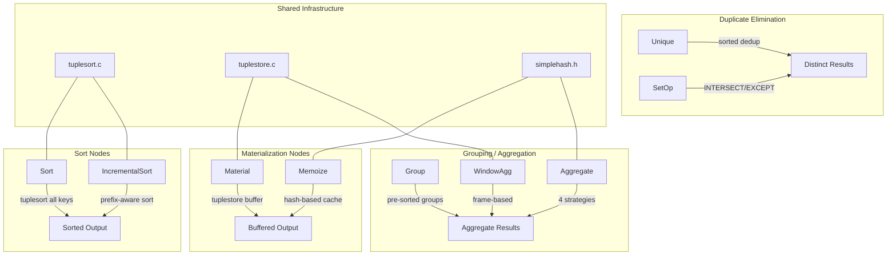
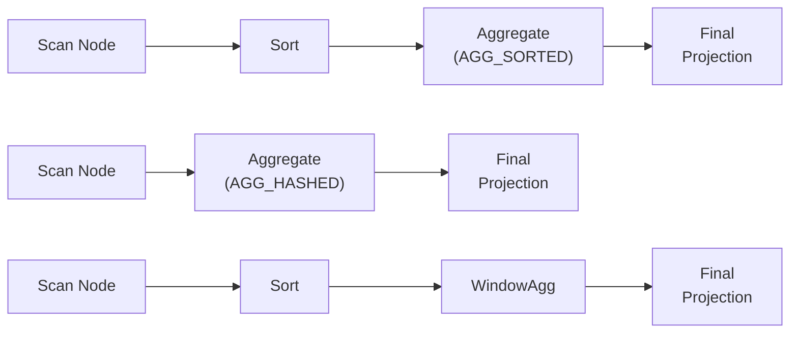
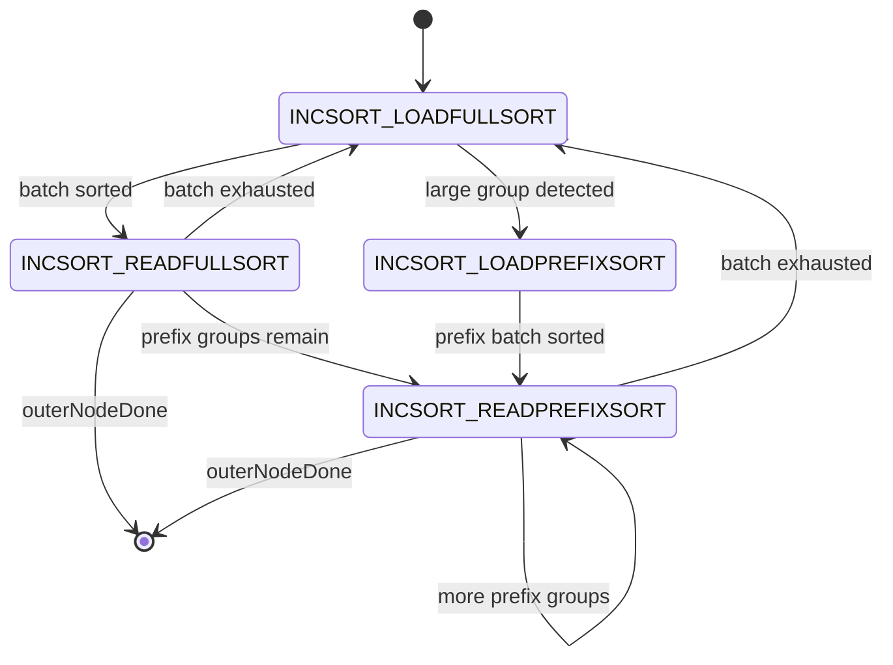
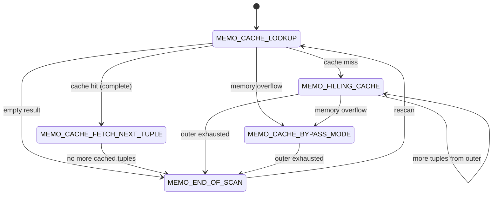
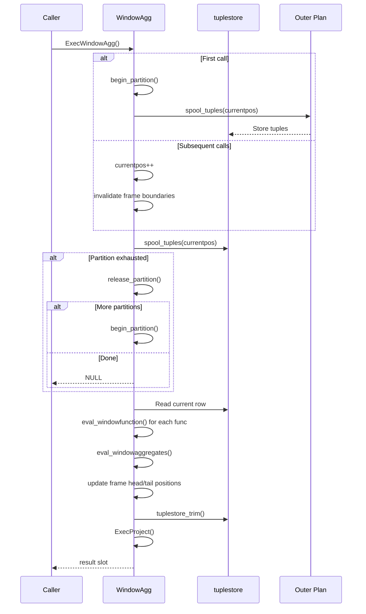
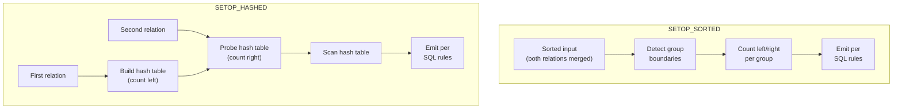
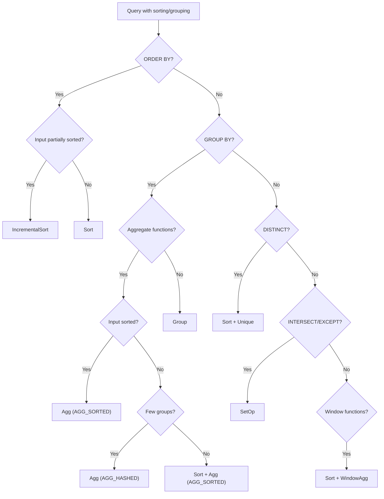

# Sort, Materialization, and Aggregate Nodes -- Executor Node Catalog

This document provides a comprehensive reference for the sort, materialization,
grouping, and aggregation executor nodes in PostgreSQL 17.6. Nine node types are
covered: Sort, IncrementalSort, Material, Memoize, Group, Aggregate, WindowAgg,
Unique, and SetOp.

---

## Architecture Overview



---

## Data Flow: Sort-Aggregate Pipeline



---

## Sort

**Identity**
- NodeTag: T_Sort / T_SortState
- Plan struct: Sort (`src/include/nodes/plannodes.h`)
- PlanState struct: SortState (`src/include/nodes/execnodes.h`)
- Source: `src/backend/executor/nodeSort.c` (490 lines)

**Purpose**: Sorts all input tuples using the tuplesort module, then returns them
one at a time. Acts as a blocking operator: it must consume all input before
producing any output. Supports forward and backward scans, mark/restore, and
bounded (top-N) sort optimization. Used whenever the planner needs sorted output
for ORDER BY, merge join, sorted aggregation, or grouping operations.

### Initialization (`ExecInitSort`)

```c
/* src/backend/executor/nodeSort.c:220 */
SortState *
ExecInitSort(Sort *node, EState *estate, int eflags)
```

1. Creates SortState, sets `ExecProcNode = ExecSort`.
2. Determines `randomAccess` from eflags (EXEC_FLAG_REWIND, BACKWARD, or MARK).
3. Sets `sort_Done = false`, `bounded = false`, `tuplesortstate = NULL`.
4. Shields the child node from REWIND, BACKWARD, and MARK requirements by
   stripping those flags before initializing the outer child.
5. Creates scan slot (TTSOpsVirtual) and result slot (TTSOpsMinimalTuple).
6. Sets `ps_ProjInfo = NULL` (Sort does no projection).
7. Detects datum-sort optimization: if the result has exactly one column,
   sets `datumSort = true` to use the faster `tuplesort_begin_datum` path.

### Execution (`ExecSort`)

```c
/* src/backend/executor/nodeSort.c:49 */
static TupleTableSlot *
ExecSort(PlanState *pstate)
```

Two-phase operation:

**Phase 1 -- Loading (first call only, `sort_Done == false`):**
1. Forces forward scan direction during loading.
2. Initializes tuplesort:
   - Single column: `tuplesort_begin_datum()` for the datum sort path.
   - Multiple columns: `tuplesort_begin_heap()` for the tuple sort path.
   - If bounded, calls `tuplesort_set_bound()` for top-N heap optimization.
3. Reads all tuples from outer child via `ExecProcNode()` loop:
   - Datum sort: extracts `slot->tts_values[0]` and calls `tuplesort_putdatum()`.
   - Tuple sort: calls `tuplesort_puttupleslot()`.
4. Calls `tuplesort_performsort()` to finalize the sort.
5. Sets `sort_Done = true`.

**Phase 2 -- Returning (every call including first):**
- Datum sort: `tuplesort_getdatum()` into result slot.
- Tuple sort: `tuplesort_gettupleslot()` into result slot.
- Returns the populated slot or an empty slot at end of data.

Key code for the datum-vs-tuple branching:

```c
/* src/backend/executor/nodeSort.c:105-122 */
if (node->datumSort)
    tuplesortstate = tuplesort_begin_datum(
        TupleDescAttr(tupDesc, 0)->atttypid,
        plannode->sortOperators[0], ...);
else
    tuplesortstate = tuplesort_begin_heap(
        tupDesc, plannode->numCols,
        plannode->sortColIdx, ...);
```

### End (`ExecEndSort`)

```c
/* src/backend/executor/nodeSort.c:300 */
void ExecEndSort(SortState *node)
```

Calls `tuplesort_end()` to release the tuplesort resources, then shuts down the
outer child with `ExecEndNode()`.

### Rescan (`ExecReScanSort`)

```c
/* src/backend/executor/nodeSort.c:361 */
void ExecReScanSort(SortState *node)
```

- If the outer plan's chgParam is set, or bounded-sort parameters changed, or
  randomAccess was not configured: destroys the tuplesort and re-reads the outer
  plan from scratch on next call.
- If none of those conditions hold: calls `tuplesort_rescan()` to rewind and
  replay the already-sorted output.

### Key State Fields

| Field | Type | Description |
|-------|------|-------------|
| `sort_Done` | `bool` | True after initial sort is complete |
| `bounded` | `bool` | Whether top-N sort optimization is active |
| `bound` | `int64` | Number of tuples to keep for bounded sort |
| `tuplesortstate` | `void *` | Opaque handle to tuplesort state |
| `datumSort` | `bool` | True if single-column datum sort path |
| `randomAccess` | `bool` | Whether backward scan or mark/restore is needed |
| `shared_info` | `SharedSortInfo *` | Parallel instrumentation (DSM) |

### Performance Considerations
- Blocking operator: all input must be consumed before any output.
- Memory: controlled by `work_mem`; spills to disk if exceeded.
- Datum sort is significantly faster for single-column results (avoids tuple
  overhead for pass-by-value types).
- Bounded sort (LIMIT queries) uses a top-N heap, which is O(N log K) where
  K is the bound.

### Parallel Support
- Sort itself does not parallelize internally, but supports collecting
  instrumentation from parallel workers via shared memory (SharedSortInfo).
- Functions: `ExecSortEstimate()`, `ExecSortInitializeDSM()`,
  `ExecSortInitializeWorker()`, `ExecSortRetrieveInstrumentation()`.

### Example SQL

```sql
-- Basic sort
SELECT * FROM employees ORDER BY salary DESC;

-- Bounded sort (top-N optimization triggered)
SELECT * FROM employees ORDER BY salary DESC LIMIT 10;

-- Sort feeding a merge join
SELECT e.name, d.name
FROM employees e JOIN departments d ON e.dept_id = d.id
ORDER BY e.dept_id;  -- planner may choose Sort + MergeJoin
```

---

## IncrementalSort

**Identity**
- NodeTag: T_IncrementalSort / T_IncrementalSortState
- Plan struct: IncrementalSort (`src/include/nodes/plannodes.h`)
- PlanState struct: IncrementalSortState (`src/include/nodes/execnodes.h`)
- Source: `src/backend/executor/nodeIncrementalSort.c` (904 lines)

**Purpose**: An optimized sort variant for cases where the input is already sorted
by a prefix of the required sort keys. Instead of sorting the entire dataset, it
divides the input into groups sharing the same prefix key values and sorts each
group independently on the remaining suffix keys. This allows it to produce output
incrementally (non-blocking) and reduces memory usage since only one group needs
to fit in work_mem at a time.

### Initialization (`ExecInitIncrementalSort`)

```c
/* src/backend/executor/nodeIncrementalSort.c:770 */
IncrementalSortState *
ExecInitIncrementalSort(IncrementalSort *node, EState *estate, int eflags)
```

1. Creates IncrementalSortState, sets `ExecProcNode = ExecIncrementalSort`.
2. Sets initial execution status to `INCSORT_LOADFULLSORT`.
3. Initializes outer child (stripping REWIND/BACKWARD/MARK flags).
4. Creates result slot (TTSOpsMinimalTuple) and scan slot.
5. Allocates `group_pivot` and `transfer_tuple` slots for prefix group tracking.
6. Does NOT pre-create the tuplesort states; those are created lazily on first
   execution.

### Execution (`ExecIncrementalSort`)

```c
/* src/backend/executor/nodeIncrementalSort.c:494 */
static TupleTableSlot *
ExecIncrementalSort(PlanState *pstate)
```

The algorithm operates through a state machine with four states:



**Two modes of operation:**

1. **Full-sort mode** (`INCSORT_LOADFULLSORT` / `INCSORT_READFULLSORT`):
   - Accumulates at least `DEFAULT_MIN_GROUP_SIZE` (32) tuples without checking
     prefix key equality, sorting on all columns.
   - If after reaching the minimum group size, the next tuple belongs to the same
     prefix key group, continues accumulating.
   - If `DEFAULT_MAX_FULL_SORT_GROUP_SIZE` (64) tuples are accumulated without
     finding a new prefix key group, switches to presorted prefix mode.
   - When a group boundary is detected or input is exhausted, performs the sort
     and transitions to `INCSORT_READFULLSORT`.

2. **Presorted prefix mode** (`INCSORT_LOADPREFIXSORT` / `INCSORT_READPREFIXSORT`):
   - Sorts only on the suffix keys (columns beyond the presorted prefix).
   - Uses `switchToPresortedPrefixMode()` to transfer tuples from full sort state.
   - Fetches additional tuples directly from outer node, adding them to the
     prefix tuplesort until a group boundary is found.
   - More efficient for large groups because it sorts on fewer columns.

Key constants:

```c
/* src/backend/executor/nodeIncrementalSort.c:467-479 */
#define DEFAULT_MIN_GROUP_SIZE 32
#define DEFAULT_MAX_FULL_SORT_GROUP_SIZE (2 * DEFAULT_MIN_GROUP_SIZE)
```

The `isCurrentGroup()` function compares presorted columns from back to front for
early inequality detection:

```c
/* src/backend/executor/nodeIncrementalSort.c:211 */
static bool
isCurrentGroup(IncrementalSortState *node,
               TupleTableSlot *pivot,
               TupleTableSlot *tuple)
```

### End (`ExecEndIncrementalSort`)

Destroys both `fullsort_state` and `prefixsort_state` tuplesorts, then shuts down
the outer child.

### Rescan (`ExecReScanIncrementalSort`)

Resets both tuplesort states, clears the group pivot and transfer tuple, resets
execution status to `INCSORT_LOADFULLSORT`, and conditionally rescans the outer
child.

### Key State Fields

| Field | Type | Description |
|-------|------|-------------|
| `execution_status` | `int` | Current state machine state |
| `fullsort_state` | `Tuplesortstate *` | Full-key sort state |
| `prefixsort_state` | `Tuplesortstate *` | Suffix-key sort state |
| `group_pivot` | `TupleTableSlot *` | First tuple of current prefix group |
| `transfer_tuple` | `TupleTableSlot *` | Carried-over tuple between modes |
| `n_fullsort_remaining` | `int64` | Tuples remaining in full sort |
| `outerNodeDone` | `bool` | Whether outer node is exhausted |
| `presorted_keys` | `PresortedKeyData *` | Pre-cached comparison functions |
| `bounded` / `bound` | `bool` / `int64` | Top-N sort parameters |

### Performance Considerations
- Non-blocking: can start producing output before consuming all input.
- For LIMIT queries with presorted input, dramatically reduces work: only the
  first few groups need to be sorted.
- Memory: each prefix group individually fits within work_mem, so large datasets
  with many small groups avoid disk spills.
- Overhead: mode switching and prefix key comparisons add per-tuple cost; for
  very small groups, full-sort mode batching (min 32 tuples) amortizes this.

### Parallel Support
- Supports collecting parallel instrumentation via shared memory
  (SharedIncrementalSortInfo).

### Example SQL

```sql
-- IncrementalSort when index provides partial order
-- Given index on (dept_id):
SELECT * FROM employees ORDER BY dept_id, salary;
-- Planner uses IncrementalSort: presorted by dept_id, sorts by salary within

-- Particularly beneficial with LIMIT
SELECT * FROM employees ORDER BY dept_id, hire_date LIMIT 20;
```

---

## Material

**Identity**
- NodeTag: T_Material / T_MaterialState
- Plan struct: Material (`src/include/nodes/plannodes.h`)
- PlanState struct: MaterialState (`src/include/nodes/execnodes.h`)
- Source: `src/backend/executor/nodeMaterial.c` (364 lines)

**Purpose**: Materializes (buffers) the output of its child plan into a
tuplestore, allowing the result to be rescanned, scanned backward, or
marked/restored without re-executing the child plan. Used when the parent node
requires multiple passes over the same data (e.g., the inner side of a nested
loop join that cannot be rewound).

### Initialization (`ExecInitMaterial`)

```c
/* src/backend/executor/nodeMaterial.c:163 */
MaterialState *
ExecInitMaterial(Material *node, EState *estate, int eflags)
```

1. Creates MaterialState, sets `ExecProcNode = ExecMaterial`.
2. Captures relevant eflags: EXEC_FLAG_REWIND, EXEC_FLAG_BACKWARD, EXEC_FLAG_MARK.
   If BACKWARD is set, adds REWIND to prevent tuplestore from trimming too
   aggressively.
3. If no flags are set (eflags == 0), the node acts as a pass-through without
   creating a tuplestore at all.
4. Shields the child node from REWIND, BACKWARD, and MARK.
5. Creates result slot (TTSOpsMinimalTuple) and scan slot (TTSOpsMinimalTuple).

### Execution (`ExecMaterial`)

```c
/* src/backend/executor/nodeMaterial.c:38 */
static TupleTableSlot *
ExecMaterial(PlanState *pstate)
```

Lazy materialization strategy:

1. On first call, creates the tuplestore (if eflags require it). If EXEC_FLAG_MARK
   is set, allocates a second read pointer (index 1) for mark/restore.
2. If not at tuplestore EOF (or scanning backward), fetches from tuplestore:
   - `tuplestore_gettupleslot()` retrieves the next buffered tuple.
3. If at tuplestore EOF and outer child is not exhausted:
   - Fetches a new tuple from the outer child via `ExecProcNode()`.
   - Appends a copy to the tuplestore (which automatically advances the read
     position past it).
   - Returns the tuple directly (no extra copy needed).
4. If no tuplestore and eflags == 0: acts as pure pass-through, returning outer
   child tuples directly.

### End (`ExecEndMaterial`)

Calls `tuplestore_end()` and shuts down the outer child.

### Rescan (`ExecReScanMaterial`)

- If outer plan's chgParam changed: destroys tuplestore and re-reads from scratch.
- Otherwise: calls `tuplestore_rescan()` to rewind.
- If eflags == 0 (pass-through mode): simply rescans the outer child.

### Mark/Restore

```c
/* src/backend/executor/nodeMaterial.c:261 */
void ExecMaterialMarkPos(MaterialState *node)
/* src/backend/executor/nodeMaterial.c:289 */
void ExecMaterialRestrPos(MaterialState *node)
```

- MarkPos: copies the active read pointer (0) to the mark pointer (1), then calls
  `tuplestore_trim()` to free tuples before the mark position.
- RestrPos: copies the mark pointer (1) back to the active pointer (0).

### Key State Fields

| Field | Type | Description |
|-------|------|-------------|
| `eflags` | `int` | Requested capabilities (REWIND, BACKWARD, MARK) |
| `eof_underlying` | `bool` | Whether outer child is exhausted |
| `tuplestorestate` | `Tuplestorestate *` | Handle to tuplestore, or NULL |

### Performance Considerations
- Memory: uses work_mem; spills to temporary files on disk when exceeded.
- When eflags == 0, adds no overhead (pure pass-through).
- For NestLoop inner sides, materialization avoids repeated execution of expensive
  child plans.

### Parallel Support
- None. Material nodes are not parallelizable.

### Example SQL

```sql
-- Material on inner side of NestLoop
SELECT * FROM small_table s, large_table l
WHERE s.id = l.ref_id;
-- If large_table scan is expensive, planner may insert Material
-- to buffer it for rescans

-- Material to support backward scan in cursors
DECLARE c CURSOR FOR SELECT * FROM t;
FETCH FORWARD 5 FROM c;
FETCH BACKWARD 3 FROM c;  -- requires materialization
```

---

## Memoize

**Identity**
- NodeTag: T_Memoize / T_MemoizeState
- Plan struct: Memoize (`src/include/nodes/plannodes.h`)
- PlanState struct: MemoizeState (`src/include/nodes/execnodes.h`)
- Source: `src/backend/executor/nodeMemoize.c` (1263 lines)

**Purpose**: Caches results from parameterized inner plan nodes in a hash table
to avoid redundant rescans. Placed above parameterized nodes in the plan tree, it
intercepts rescan requests: if the same parameter values have been seen before, it
returns cached tuples instead of re-executing the inner plan. This significantly
accelerates nested-loop joins when the inner side is parameterized and outer tuples
frequently repeat the same join key values.

### Initialization (`ExecInitMemoize`)

```c
/* src/backend/executor/nodeMemoize.c:951 */
MemoizeState *
ExecInitMemoize(Memoize *node, EState *estate, int eflags)
```

1. Creates MemoizeState, sets `ExecProcNode = ExecMemoize`.
2. Initializes outer child and creates result/scan slots (TTSOpsMinimalTuple).
3. Sets initial state to `MEMO_CACHE_LOOKUP`.
4. Creates `probeslot` (TTSOpsVirtual) and `tableslot` (TTSOpsMinimalTuple) for
   hash table lookups.
5. For each cache key: looks up hash functions and initializes `param_exprs`.
6. Builds `cache_eq_expr` via `ExecBuildParamSetEqual()` for equality checks.
7. Sets `mem_limit` from `get_hash_memory_limit()`.
8. Creates `tableContext` memory context for the cache.
9. Does NOT build the hash table yet (deferred to first execution call).

### Execution (`ExecMemoize`)

```c
/* src/backend/executor/nodeMemoize.c:696 */
static TupleTableSlot *
ExecMemoize(PlanState *pstate)
```

Five-state state machine:



**State descriptions:**

1. **MEMO_CACHE_LOOKUP** (state 1): Entry point for each scan.
   - Builds hash table if first call (`build_hash_table()`).
   - Calls `cache_lookup()` which populates probeslot, looks up the hash table,
     and handles LRU management.
   - Cache hit with complete entry: moves to MEMO_CACHE_FETCH_NEXT_TUPLE.
   - Cache miss: fetches first tuple from outer, stores it, moves to
     MEMO_FILLING_CACHE.
   - Memory overflow during store: moves to MEMO_CACHE_BYPASS_MODE.

2. **MEMO_CACHE_FETCH_NEXT_TUPLE** (state 2): Returns cached tuples one at a time
   by walking the MemoizeTuple linked list. When the list is exhausted, transitions
   to MEMO_END_OF_SCAN.

3. **MEMO_FILLING_CACHE** (state 3): Continues reading tuples from the outer node
   and storing them in the cache entry. Each tuple is cached via
   `cache_store_tuple()`. When outer is exhausted, marks entry as `complete = true`.
   If memory limit is exceeded, transitions to MEMO_CACHE_BYPASS_MODE.

4. **MEMO_CACHE_BYPASS_MODE** (state 4): Reads tuples directly from outer without
   caching. Used when the current parameter's result set is too large for the
   cache budget. Remains in this mode until the scan ends.

5. **MEMO_END_OF_SCAN** (state 5): Terminal state. Returns NULL for any
   subsequent calls. Reset to MEMO_CACHE_LOOKUP on rescan.

### Data Structures

```c
/* src/backend/executor/nodeMemoize.c:93-123 */
typedef struct MemoizeTuple {
    MinimalTuple mintuple;          /* Cached tuple */
    struct MemoizeTuple *next;      /* Next tuple in chain, or NULL */
} MemoizeTuple;

typedef struct MemoizeKey {
    MinimalTuple params;            /* Parameter values (hash key) */
    dlist_node   lru_node;          /* Position in LRU list */
} MemoizeKey;

typedef struct MemoizeEntry {
    MemoizeKey  *key;
    MemoizeTuple *tuplehead;        /* First cached tuple, or NULL */
    uint32       hash;              /* Cached hash value */
    char         status;            /* simplehash status */
    bool         complete;          /* Was outer plan scanned fully? */
} MemoizeEntry;
```

### LRU Eviction

When cache memory exceeds `mem_limit` (from `hash_mem_multiplier * work_mem`),
`cache_reduce_memory()` evicts entries from the head of a doubly-linked LRU list:

```c
/* src/backend/executor/nodeMemoize.c:439 */
static bool
cache_reduce_memory(MemoizeState *mstate, MemoizeKey *specialkey)
```

Each accessed or newly created entry is pushed to the tail of the LRU list,
causing least-recently-used entries to bubble to the head for eviction.

### End (`ExecEndMemoize`)

Validates memory accounting in assert builds, copies statistics to shared memory
for parallel workers, then deletes the tableContext and shuts down the outer child.

### Rescan (`ExecReScanMemoize`)

Resets state to MEMO_CACHE_LOOKUP. If parameters changed that are NOT part of
the cache key (i.e., `chgParam` has members not in `keyparamids`), purges the
entire cache via `cache_purge_all()`.

### Key State Fields

| Field | Type | Description |
|-------|------|-------------|
| `mstatus` | `int` | Current state machine state (MEMO_*) |
| `nkeys` | `int` | Number of cache key parameters |
| `hashtable` | `memoize_hash *` | simplehash hash table |
| `mem_used` | `uint64` | Current memory consumption (bytes) |
| `mem_limit` | `uint64` | Maximum allowed memory |
| `lru_list` | `dlist_head` | Doubly-linked LRU eviction list |
| `entry` | `MemoizeEntry *` | Currently active cache entry |
| `last_tuple` | `MemoizeTuple *` | Last tuple in current entry chain |
| `singlerow` | `bool` | Mark entry complete after 1 tuple |
| `binary_mode` | `bool` | Use binary comparison vs. operator equality |
| `probeslot` | `TupleTableSlot *` | Slot for hash table probes |
| `tableslot` | `TupleTableSlot *` | Slot for reading cached keys |
| `stats` | `MemoizeInstrumentation` | Cache statistics (hits/misses/evictions) |

### Performance Considerations
- Most effective when many outer tuples share the same join key values (high
  cache hit rate).
- Memory budget: `hash_mem_multiplier * work_mem` (same as hash joins).
- The singlerow optimization (for unique joins) marks entries complete after
  the first tuple, enabling cache hits even with incomplete scans.
- Binary mode avoids function-call overhead for types that support bitwise
  comparison.
- Bypass mode prevents pathological behavior when a single parameter's result
  set exceeds the entire cache budget.

### Parallel Support
- Supports instrumentation sharing via shared memory (SharedMemoizeInfo), but
  each worker maintains its own independent cache.

### Example SQL

```sql
-- Memoize above parameterized inner index scan
SELECT o.*, c.name
FROM orders o JOIN customers c ON o.cust_id = c.id;
-- If many orders share the same cust_id, Memoize caches
-- customer lookups and returns cached results for repeats

-- Memoize with unique join (singlerow mode)
SELECT DISTINCT ON (o.id) o.*, c.name
FROM orders o JOIN customers c ON o.cust_id = c.id;
```

---

## Group

**Identity**
- NodeTag: T_Group / T_GroupState
- Plan struct: Group (`src/include/nodes/plannodes.h`)
- PlanState struct: GroupState (`src/include/nodes/execnodes.h`)
- Source: `src/backend/executor/nodeGroup.c` (250 lines)

**Purpose**: Implements simple group-boundary detection for GROUP BY on pre-sorted
input. Returns one tuple per group (the first tuple in each group). Supports
HAVING qualification to filter groups. This is a simpler alternative to Aggregate
when no aggregate functions are needed -- just GROUP BY with possible HAVING.

### Initialization (`ExecInitGroup`)

```c
/* src/backend/executor/nodeGroup.c:160 */
GroupState *
ExecInitGroup(Group *node, EState *estate, int eflags)
```

1. Creates GroupState, sets `ExecProcNode = ExecGroup`.
2. Creates expression context.
3. Initializes outer child.
4. Precomputes equality function via `execTuplesMatchPrepare()` for the grouping
   columns.
5. Initializes qual (HAVING clause) and projection.

### Execution (`ExecGroup`)

```c
/* src/backend/executor/nodeGroup.c:35 */
static TupleTableSlot *
ExecGroup(PlanState *pstate)
```

Algorithm:

1. On first call, fetches the first tuple from the outer plan. Copies it to the
   `ss_ScanTupleSlot` as the group representative. Checks HAVING qual; if it
   passes, projects and returns the tuple.
2. On subsequent calls, enters a double loop:
   - Inner loop: scans consecutive tuples belonging to the current group (using
     equality comparison via `ExecQualAndReset()`), skipping them.
   - When a non-matching tuple is found (new group boundary), copies it as the
     new group representative.
   - Checks HAVING qual on the new group; if it passes, projects and returns.
   - If HAVING fails, loops back to scan through that group.
3. Returns NULL when the outer plan is exhausted.

### End / Rescan

- `ExecEndGroup()`: Simply shuts down the outer child.
- `ExecReScanGroup()`: Clears `grp_done`, clears the scan tuple slot, conditionally
  rescans the outer child.

### Key State Fields

| Field | Type | Description |
|-------|------|-------------|
| `grp_done` | `bool` | True when input is exhausted |
| `eqfunction` | `ExprState *` | Compiled equality comparison for grouping columns |

### Performance Considerations
- Requires pre-sorted input (Sort or index scan must provide this).
- Very lightweight: no hash table, no accumulation. O(N) single pass.
- Rarely used in modern plans; Aggregate with AGG_SORTED handles most GROUP BY.

### Parallel Support
- None.

### Example SQL

```sql
-- Group node (no aggregate functions, just GROUP BY)
SELECT dept_id FROM employees GROUP BY dept_id;

-- With HAVING filter
SELECT dept_id FROM employees GROUP BY dept_id HAVING dept_id > 5;
```

---

## Aggregate

**Identity**
- NodeTag: T_Agg / T_AggState
- Plan struct: Agg (`src/include/nodes/plannodes.h`)
- PlanState struct: AggState (`src/include/nodes/execnodes.h`)
- Source: `src/backend/executor/nodeAgg.c` (4755 lines)

**Purpose**: The central aggregation engine for PostgreSQL. Handles all aggregate
functions (SUM, COUNT, AVG, etc.), GROUP BY, GROUPING SETS, CUBE, and ROLLUP.
Implements four distinct strategies, chosen by the planner based on input
characteristics and cost estimates.

### The Four Strategies

```mermaid
flowchart TB
    subgraph "AGG_PLAIN"
        P_IN["All input"] --> P_ACC["Single group\naccumulation"]
        P_ACC --> P_OUT["One result row"]
    end

    subgraph "AGG_SORTED"
        S_IN["Sorted input"] --> S_DET["Group boundary\ndetection"]
        S_DET --> S_ACC["Per-group\naccumulation"]
        S_ACC --> S_OUT["One row per group"]
    end

    subgraph "AGG_HASHED"
        H_IN["Any order input"] --> H_HT["Build hash table\n(one entry per group)"]
        H_HT --> H_SCAN["Scan hash table"]
        H_SCAN --> H_OUT["One row per group"]
    end

    subgraph "AGG_MIXED"
        M_IN["Input"] --> M_S["Sorted phase\n(some grouping sets)"]
        M_S --> M_H["Hashed phase\n(other grouping sets)"]
        M_H --> M_OUT["Combined results"]
    end
```



**AGG_PLAIN**: No GROUP BY clause. All input tuples are aggregated into a single
group. Always produces exactly one output row (even if input is empty, with NULL
aggregates). Used for queries like `SELECT count(*) FROM t`.

**AGG_SORTED**: Input must be pre-sorted by the grouping columns. Detects group
boundaries by comparing adjacent tuples. Processes groups one at a time, emitting
a result row at each boundary. Supports GROUPING SETS via multiple phases with
re-sorting between them.

**AGG_HASHED**: Builds a hash table with one entry per group. All input is consumed
to populate the hash table, then the table is scanned to produce output rows.
Supports hash-based aggregation spill to disk when the hash table exceeds memory.
Does not require sorted input.

**AGG_MIXED**: Combines sorted and hashed strategies for GROUPING SETS queries.
Phase 1 reads sorted input, computing both sorted grouping sets and populating
hash tables simultaneously. Phase 0 then scans the hash tables. This avoids
re-sorting the input for each grouping set.

### Initialization (`ExecInitAgg`)

```c
/* src/backend/executor/nodeAgg.c:3164 */
AggState *
ExecInitAgg(Agg *node, EState *estate, int eflags)
```

This is one of the largest initialization functions in the executor (~860 lines).
Key steps:

1. Creates AggState, sets `ExecProcNode = ExecAgg`.
2. Computes numPhases and numHashes based on strategy and GROUPING SETS chain.
3. Creates multiple expression contexts:
   - `tmpcontext`: per-input-tuple processing
   - `aggcontexts[]`: one per grouping set, for transition values
   - `hashcontext`: for hash table operations (if hashing)
4. Initializes outer child (strips REWIND for AGG_HASHED).
5. Sets up phase data: for each phase, precomputes equality functions for group
   boundary detection (AGG_SORTED) or hash table columns (AGG_HASHED).
6. For each Aggref found in targetlist and quals:
   - Resolves the aggregate function from pg_aggregate catalog.
   - Checks ACL permissions.
   - Sets up transition function, final function, serialize/deserialize functions.
   - Builds per-agg (AggStatePerAgg) and per-trans (AggStatePerTrans) state.
7. For hashed strategies: allocates hash table metadata, computes entry size
   estimates, sets memory limits via `hash_agg_set_limits()`.
8. Builds compiled transition expressions via `ExecBuildAggTrans()`.

### Execution (`ExecAgg`)

```c
/* src/backend/executor/nodeAgg.c:2144 */
static TupleTableSlot *
ExecAgg(PlanState *pstate)
```

Dispatches based on the current phase's strategy:

```c
switch (node->phase->aggstrategy)
{
    case AGG_HASHED:
        if (!node->table_filled)
            agg_fill_hash_table(node);
        /* FALLTHROUGH */
    case AGG_MIXED:
        result = agg_retrieve_hash_table(node);
        break;
    case AGG_PLAIN:
    case AGG_SORTED:
        result = agg_retrieve_direct(node);
        break;
}
```

- `agg_retrieve_direct()`: For AGG_PLAIN/AGG_SORTED. Reads input tuples, detects
  group boundaries, advances transition values, and returns projected result rows.
  For GROUPING SETS, manages multiple phases with re-sorting.
- `agg_fill_hash_table()`: Reads all input and inserts into hash table(s). For
  AGG_MIXED, this happens during the sorted phase (phase 1) as a side effect.
- `agg_retrieve_hash_table()`: Scans hash table entries, finalizes aggregates,
  and returns result rows.

### End (`ExecEndAgg`)

```c
/* src/backend/executor/nodeAgg.c:4303 */
void ExecEndAgg(AggState *node)
```

Cleans up tuplesort states (for re-sorting between phases), hash spill state,
per-group data, and expression contexts.

### Key State Fields

| Field | Type | Description |
|-------|------|-------------|
| `aggstrategy` | `AggStrategy` | AGG_PLAIN/SORTED/HASHED/MIXED |
| `aggsplit` | `AggSplit` | Partial/final/combine mode |
| `numphases` | `int` | Number of sort phases |
| `current_phase` | `int` | Currently executing phase |
| `peragg` | `AggStatePerAgg` | Per-aggregate-function state |
| `pertrans` | `AggStatePerTrans` | Per-transition-function state |
| `pergroups` | `AggStatePerGroup *` | Per-group transition values |
| `num_hashes` | `int` | Number of hash tables |
| `perhash` | `AggStatePerHash` | Per-hash-table state |
| `table_filled` | `bool` | Whether hash table is populated |
| `agg_done` | `bool` | Whether all output is produced |
| `input_done` | `bool` | Whether all input is consumed |
| `hashcontext` | `ExprContext *` | Context for hash operations |
| `tmpcontext` | `ExprContext *` | Per-input-tuple context |
| `aggcontexts` | `ExprContext **` | Per-grouping-set contexts |
| `hash_mem_limit` | `Size` | Memory limit for hash tables |
| `hash_ngroups_limit` | `uint64` | Maximum groups before spill |

### Performance Considerations
- AGG_SORTED is preferred when input is already sorted (e.g., from an index scan
  or preceding Sort node). O(N) memory usage.
- AGG_HASHED is preferred for unsorted input with a manageable number of groups.
  Memory usage proportional to the number of groups.
- AGG_HASHED supports spill-to-disk when hash table exceeds memory, partitioning
  groups and processing them in batches.
- AGG_MIXED minimizes I/O by computing sorted and hashed grouping sets in a
  single pass over the input.
- Partial aggregation (aggsplit) enables parallel aggregation: workers compute
  partial aggregates which the leader combines.

### Parallel Support
- Full parallel aggregation support through partial/final split.
- Workers execute Partial Aggregate nodes, leader executes Final Aggregate that
  combines partial results.
- Hash-based aggregation supports parallel hash table construction.

### Example SQL

```sql
-- AGG_PLAIN: no GROUP BY
SELECT count(*), avg(salary) FROM employees;

-- AGG_SORTED: with sorted input
SELECT dept_id, sum(salary)
FROM employees
GROUP BY dept_id
ORDER BY dept_id;

-- AGG_HASHED: hash aggregation
SELECT dept_id, count(*)
FROM employees
GROUP BY dept_id;

-- AGG_MIXED: GROUPING SETS combining sorted and hashed
SELECT dept_id, job_title, count(*)
FROM employees
GROUP BY GROUPING SETS ((dept_id), (job_title));

-- ROLLUP / CUBE
SELECT dept_id, job_title, sum(salary)
FROM employees
GROUP BY ROLLUP (dept_id, job_title);
```

---

## WindowAgg

**Identity**
- NodeTag: T_WindowAgg / T_WindowAggState
- Plan struct: WindowAgg (`src/include/nodes/plannodes.h`)
- PlanState struct: WindowAggState (`src/include/nodes/execnodes.h`)
- Source: `src/backend/executor/nodeWindowAgg.c` (2777 lines)

**Purpose**: Implements SQL window functions (OVER clause). Unlike regular
aggregation, WindowAgg does not reduce rows -- every input row produces one output
row. Window functions are evaluated over a sliding frame within each partition.
Supports ROWS, RANGE, and GROUPS frame modes, various frame exclusion options,
and both built-in window functions (row_number, rank, etc.) and user-defined
aggregate functions used as window functions.

### Initialization (`ExecInitWindowAgg`)

```c
/* src/backend/executor/nodeWindowAgg.c:2366 */
WindowAggState *
ExecInitWindowAgg(WindowAgg *node, EState *estate, int eflags)
```

1. Creates WindowAggState, sets `ExecProcNode = ExecWindowAgg`.
2. Creates expression context and two specialized memory contexts:
   - `partcontext`: per-partition lifetime.
   - `aggcontext`: reset at partition boundary for aggregate state.
3. Initializes outer child (no BACKWARD or MARK needed).
4. Sets up result and scan slots (TTSOpsVirtual for result, match outer for scan).
5. Allocates tuplestore read pointers for:
   - Current position (`current_ptr`)
   - Frame head tracking (`framehead_ptr`, if needed)
   - Frame tail tracking (`frametail_ptr`, if needed)
   - Group tail tracking (`grouptail_ptr`, if using GROUPS mode)
6. For each window function:
   - Resolves the function from pg_proc/pg_aggregate.
   - Sets up per-function state (WindowStatePerFunc) including frame options.
   - Plain aggregates get per-aggregate state (WindowStatePerAgg).
7. Initializes `temp_slot_1`, `temp_slot_2` for frame boundary operations.
8. Compiles frame offset expressions and run condition.

### Execution (`ExecWindowAgg`)

```c
/* src/backend/executor/nodeWindowAgg.c:2036 */
static TupleTableSlot *
ExecWindowAgg(PlanState *pstate)
```

The execution loop processes one row at a time:



**Three execution modes:**

1. **WINDOWAGG_RUN**: Normal mode. Evaluates window functions and aggregates for
   each row, applies run condition and qual filter.
2. **WINDOWAGG_PASSTHROUGH** / **WINDOWAGG_PASSTHROUGH_STRICT**: When the run
   condition fails, NULLifies aggregate results and either passes tuples through
   (for non-top-level WindowAgg) or filters them out (for top-level with
   PARTITION BY). This optimization supports efficient evaluation of monotonic
   window functions with filter pushdown.
3. **WINDOWAGG_DONE**: Terminal state, returns NULL.

**Key internal functions:**
- `begin_partition()`: Initializes tuplestore buffer, resets aggregate state.
- `spool_tuples()`: Reads from outer plan into tuplestore up to the requested
  position.
- `eval_windowfunction()`: Calls each non-aggregate window function.
- `eval_windowaggregates()`: Computes aggregate values over the current frame.
- `update_frameheadpos()` / `update_frametailpos()`: Calculates frame boundaries
  based on ROWS/RANGE/GROUPS mode.

### End (`ExecEndWindowAgg`)

```c
/* src/backend/executor/nodeWindowAgg.c:2676 */
void ExecEndWindowAgg(WindowAggState *node)
```

Releases partition tuplestore, deletes partition and aggregate memory contexts,
frees all temporary slots, and shuts down the outer child.

### Key State Fields

| Field | Type | Description |
|-------|------|-------------|
| `status` | `WindowAggStatus` | RUN/PASSTHROUGH/PASSTHROUGH_STRICT/DONE |
| `buffer` | `Tuplestorestate *` | Tuplestore for current partition |
| `currentpos` | `int64` | Current row position in partition |
| `spooled_rows` | `int64` | Number of rows spooled so far |
| `currentgroup` | `int64` | Current peer group number |
| `frameOptions` | `int` | Frame mode flags (ROWS/RANGE/GROUPS) |
| `framehead_valid` | `bool` | Whether frame head position is current |
| `frametail_valid` | `bool` | Whether frame tail position is current |
| `partition_spooled` | `bool` | Whether partition is fully read |
| `more_partitions` | `bool` | Whether more partitions exist |
| `perfunc` | `WindowStatePerFunc` | Per-function state array |
| `peragg` | `WindowStatePerAgg` | Per-aggregate state array |
| `numfuncs` | `int` | Total number of window functions |
| `numaggs` | `int` | Number of aggregate-based window functions |
| `partcontext` | `MemoryContext` | Per-partition memory context |
| `aggcontext` | `MemoryContext` | Per-partition aggregate context |
| `runcondition` | `ExprState *` | Optimized monotonic function filter |

### Performance Considerations
- Non-blocking within a partition, but must spool the entire partition before
  processing the last row (partitions can spill to disk).
- Frame boundary calculations are cached (`framehead_valid`, `frametail_valid`)
  and only recomputed when the frame actually moves.
- `tuplestore_trim()` frees rows that are behind all read pointers, keeping
  memory usage proportional to the frame size rather than the partition size.
- Pass-through mode avoids evaluating window functions for rows that cannot
  affect the final result (monotonic function optimization).
- ROWS frames are cheapest; RANGE and GROUPS require peer group detection.

### Parallel Support
- Not parallelizable. WindowAgg must process partitions sequentially.
- However, it can sit on top of a parallelized subplan (e.g., Gather Merge
  feeding into WindowAgg).

### Example SQL

```sql
-- Basic window function
SELECT employee_id, salary,
       row_number() OVER (ORDER BY salary DESC) AS rank
FROM employees;

-- Partitioned window with aggregate
SELECT dept_id, employee_id, salary,
       avg(salary) OVER (PARTITION BY dept_id) AS dept_avg
FROM employees;

-- Sliding frame (ROWS mode)
SELECT date, revenue,
       sum(revenue) OVER (ORDER BY date
                          ROWS BETWEEN 6 PRECEDING AND CURRENT ROW) AS weekly_sum
FROM daily_sales;

-- RANGE frame with offset
SELECT date, revenue,
       sum(revenue) OVER (ORDER BY date
                          RANGE BETWEEN INTERVAL '7 days' PRECEDING
                          AND CURRENT ROW) AS weekly_sum
FROM daily_sales;

-- GROUPS frame
SELECT dept_id, salary,
       count(*) OVER (ORDER BY salary
                      GROUPS BETWEEN 1 PRECEDING AND 1 FOLLOWING) AS nearby_count
FROM employees;
```

---

## Unique

**Identity**
- NodeTag: T_Unique / T_UniqueState
- Plan struct: Unique (`src/include/nodes/plannodes.h`)
- PlanState struct: UniqueState (`src/include/nodes/execnodes.h`)
- Source: `src/backend/executor/nodeUnique.c` (189 lines)

**Purpose**: Filters out duplicate tuples from sorted input by comparing each
tuple to the previously returned tuple. This is essentially a simplified version
of Group: the duplicate-removal logic is identical, but Unique skips projection
and qual checking, making it marginally more efficient when those are not needed.
Used for SELECT DISTINCT on sorted output.

### Initialization (`ExecInitUnique`)

```c
/* src/backend/executor/nodeUnique.c:113 */
UniqueState *
ExecInitUnique(Unique *node, EState *estate, int eflags)
```

1. Creates UniqueState, sets `ExecProcNode = ExecUnique`.
2. Creates expression context.
3. Initializes outer child.
4. Creates result slot (TTSOpsMinimalTuple), sets `ps_ProjInfo = NULL`.
5. Precomputes equality function via `execTuplesMatchPrepare()`.

### Execution (`ExecUnique`)

```c
/* src/backend/executor/nodeUnique.c:45 */
static TupleTableSlot *
ExecUnique(PlanState *pstate)
```

Simple loop:

1. Fetches a tuple from the outer plan.
2. If the result slot is empty (first tuple), returns it immediately.
3. Otherwise, compares the new tuple against the previously returned tuple
   using the precomputed equality function.
4. If they differ (equality function returns false), saves and returns the new
   tuple.
5. If they match, loops to fetch the next tuple (skipping duplicates).

The key comparison:

```c
/* src/backend/executor/nodeUnique.c:91-94 */
econtext->ecxt_innertuple = slot;
econtext->ecxt_outertuple = resultTupleSlot;
if (!ExecQualAndReset(node->eqfunction, econtext))
    break;  /* different tuple found */
```

### End / Rescan

- `ExecEndUnique()`: Simply shuts down the outer child.
- `ExecReScanUnique()`: Clears result tuple slot (so first next tuple is returned),
  conditionally rescans outer child.

### Key State Fields

| Field | Type | Description |
|-------|------|-------------|
| `eqfunction` | `ExprState *` | Compiled equality for unique columns |

### Performance Considerations
- O(N) single pass, minimal overhead.
- Requires sorted input (typically preceded by a Sort node).
- No projection or qual, so very lean compared to Group.

### Parallel Support
- None.

### Example SQL

```sql
-- DISTINCT on sorted output
SELECT DISTINCT dept_id FROM employees ORDER BY dept_id;

-- Unique used internally for UNION (not UNION ALL)
SELECT dept_id FROM employees_a
UNION
SELECT dept_id FROM employees_b;
```

---

## SetOp

**Identity**
- NodeTag: T_SetOp / T_SetOpState
- Plan struct: SetOp (`src/include/nodes/plannodes.h`)
- PlanState struct: SetOpState (`src/include/nodes/execnodes.h`)
- Source: `src/backend/executor/nodeSetOp.c` (650 lines)

**Purpose**: Implements INTERSECT, INTERSECT ALL, EXCEPT, and EXCEPT ALL set
operations. The input consists of tuples from two relations that have been combined
into a single stream, with a junk "flag" column indicating which relation each
tuple came from (0 = left, 1 = right). SetOp counts the occurrences from each
side and applies the SQL-standard output rules. Does NOT handle UNION/UNION ALL
(those use simpler Append + optional Unique).

### Two Strategies



**Output count rules** (from `set_output_count()`):

| Operation | Output count |
|-----------|-------------|
| INTERSECT | 1 if both sides have >= 1 tuple, else 0 |
| INTERSECT ALL | min(numLeft, numRight) |
| EXCEPT | 1 if numLeft > 0 AND numRight == 0, else 0 |
| EXCEPT ALL | max(0, numLeft - numRight) |

### Initialization (`ExecInitSetOp`)

```c
/* src/backend/executor/nodeSetOp.c:480 */
SetOpState *
ExecInitSetOp(SetOp *node, EState *estate, int eflags)
```

1. Creates SetOpState, sets `ExecProcNode = ExecSetOp`.
2. Creates expression context.
3. For SETOP_HASHED:
   - Creates a dedicated `tableContext` memory context.
   - Strips EXEC_FLAG_REWIND from outer child.
   - Prepares hash functions via `execTuplesHashPrepare()`.
   - Builds the hash table via `BuildTupleHashTableExt()`.
4. For SETOP_SORTED:
   - Prepares equality function via `execTuplesMatchPrepare()`.
   - Allocates a single SetOpStatePerGroupData struct for tracking counts.
5. Result slot: TTSOpsMinimalTuple (hashed) or TTSOpsHeapTuple (sorted).

### Execution (`ExecSetOp`)

```c
/* src/backend/executor/nodeSetOp.c:189 */
static TupleTableSlot *
ExecSetOp(PlanState *pstate)
```

If `numOutput > 0`, returns the previously-returned tuple again (for ALL variants
that need to emit multiple copies).

**SETOP_SORTED path** (`setop_retrieve_direct()`):
1. Fetches first tuple of a group, saves it as the representative.
2. Counts left/right occurrences via `fetch_tuple_flag()` and `advance_counts()`.
3. Scans until group boundary (equality check fails on next tuple).
4. Calls `set_output_count()` to determine how many copies to emit.
5. Returns the representative tuple; subsequent calls decrement `numOutput`.

**SETOP_HASHED path** (`setop_fill_hash_table()` + `setop_retrieve_hash_table()`):
1. Fill phase: reads all tuples. For the first relation: inserts into hash table,
   counting left occurrences. For the second relation: only probes existing
   entries (never creates new ones -- tuples only in the right relation can
   never appear in INTERSECT/EXCEPT output).
2. Retrieve phase: iterates the hash table, calls `set_output_count()` for each
   entry, and returns tuples as determined.

The flag column extraction:

```c
/* src/backend/executor/nodeSetOp.c:101 */
static int
fetch_tuple_flag(SetOpState *setopstate, TupleTableSlot *inputslot)
{
    flag = DatumGetInt32(slot_getattr(inputslot,
                                      node->flagColIdx, &isNull));
    Assert(flag == 0 || flag == 1);
    return flag;
}
```

### End (`ExecEndSetOp`)

Deletes tableContext (which destroys the hash table), shuts down the outer child.

### Rescan (`ExecReScanSetOp`)

- SETOP_HASHED with unchanged params: just resets the hash table iterator.
- SETOP_HASHED with changed params: resets tableContext and rebuilds empty hash
  table.
- SETOP_SORTED: resets state and conditionally rescans outer child.

### Key State Fields

| Field | Type | Description |
|-------|------|-------------|
| `setop_done` | `bool` | Whether all groups are processed |
| `numOutput` | `int` | Remaining copies to emit for current group |
| `pergroup` | `SetOpStatePerGroup` | Current group's left/right counts (sorted) |
| `grp_firstTuple` | `HeapTuple` | First tuple of current group |
| `hashtable` | `TupleHashTable` | Hash table (hashed mode) |
| `tableContext` | `MemoryContext` | Dedicated context for hash table |
| `eqfunction` | `ExprState *` | Equality comparison (sorted mode) |
| `eqfuncoids` | `Oid *` | Equality function OIDs (hashed mode) |
| `hashfunctions` | `FmgrInfo *` | Hash functions (hashed mode) |
| `table_filled` | `bool` | Whether hash table is populated |

### Performance Considerations
- SETOP_SORTED: O(N) pass, minimal memory (just one per-group counter).
- SETOP_HASHED: O(N) amortized, memory proportional to number of distinct groups.
- For EXCEPT, the planner ensures the left relation comes first so that right-only
  tuples can be skipped during hash table construction.
- For INTERSECT, the planner tries to put the smaller relation first.

### Parallel Support
- None.

### Example SQL

```sql
-- INTERSECT (SETOP_SORTED or SETOP_HASHED)
SELECT id FROM table_a
INTERSECT
SELECT id FROM table_b;

-- INTERSECT ALL
SELECT id FROM table_a
INTERSECT ALL
SELECT id FROM table_b;

-- EXCEPT
SELECT id FROM table_a
EXCEPT
SELECT id FROM table_b;

-- EXCEPT ALL
SELECT id FROM table_a
EXCEPT ALL
SELECT id FROM table_b;
```

---

## Comparison Summary

### Sort and Materialization Nodes

| Node | Blocking? | Requires Sorted Input? | Uses work_mem? | Mark/Restore? |
|------|-----------|----------------------|---------------|---------------|
| Sort | Yes | No (produces sorted) | Yes (tuplesort) | Yes |
| IncrementalSort | No (per-group) | Partial (prefix) | Yes (tuplesort) | No |
| Material | No (lazy) | No | Yes (tuplestore) | Yes |
| Memoize | No (lazy) | No | Yes (hash table) | No |

### Grouping and Aggregation Nodes

| Node | Strategy | Input Order | Output Rows | Memory |
|------|----------|-------------|-------------|--------|
| Group | Sorted scan | Must be sorted | 1 per group | O(1) |
| Aggregate (PLAIN) | Single pass | Any | Exactly 1 | O(1) |
| Aggregate (SORTED) | Group detect | Must be sorted | 1 per group | O(groups) |
| Aggregate (HASHED) | Hash table | Any | 1 per group | O(groups) |
| Aggregate (MIXED) | Sort + Hash | Must be sorted | 1 per set | O(hash groups) |
| WindowAgg | Partitioned | Must be sorted | 1 per input | O(partition) |
| Unique | Dedup | Must be sorted | <= input | O(1) |
| SetOp (SORTED) | Group detect | Must be sorted | <= input | O(1) |
| SetOp (HASHED) | Hash table | Any | <= input | O(groups) |

### When Each Node Is Chosen


