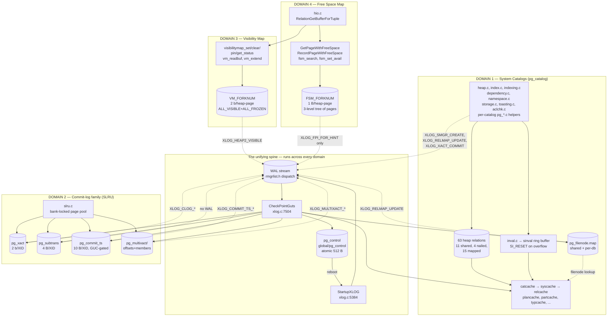
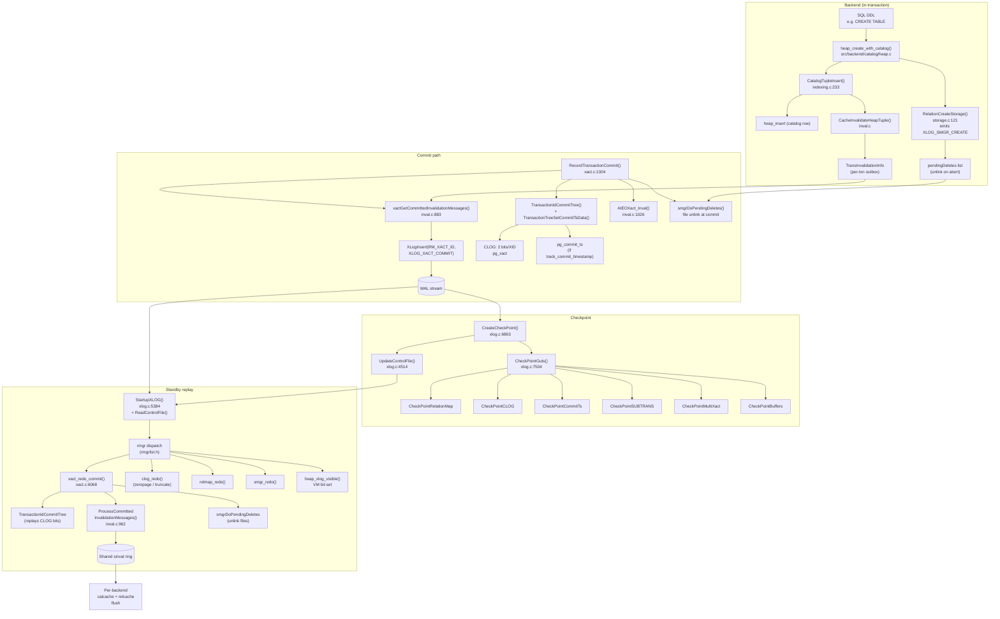

# 02 — Architecture Overview

[Up: index.md](index.md)  |  [Prev: 01 Executive Summary](01_executive_summary.md)  |  [Next: 03 Catalog Data Model and Bootstrap](03_catalog_data_model_and_bootstrap.md)

This chapter is the system-wide map. It introduces every box in the
metadata subsystem and how each box interacts with the others. Detailed
treatment of each box happens in subsequent chapters.

## Prerequisites

- A casual familiarity with PostgreSQL's MVCC model (XIDs, snapshots,
  visibility checks).
- A casual familiarity with WAL (write-ahead log records, redo,
  checkpoints).
- Read [01 Executive Summary](01_executive_summary.md) first.

## The four data domains and the spine



This single diagram is worth memorizing. Every later chapter elaborates
one of these boxes; the spine on top is what makes them all crash-safe
and replicable as a unit.

## End-to-end persistence pipeline

The most useful slice through the system is the path of one DDL
statement from SQL to durable on-disk catalog row to standby cache
flush. This is the only diagram that shows every spine cooperation in
action:



(This is `diagrams/01_persistence_pipeline.mermaid`.)

## What lives where on disk

A miniature `$PGDATA` map showing which subsystem owns which directory
or file:

```
$PGDATA/
├── global/
│   ├── pg_control                 [pg_control: cluster anchor]
│   ├── pg_filenode.map            [relmapper: shared catalogs]
│   ├── pg_internal.init           [relcache shortcut: shared catalogs]
│   └── <relfilenode>              [physical files for the 11 shared catalogs]
├── base/<dboid>/
│   ├── pg_filenode.map            [relmapper: nailed local catalogs]
│   ├── pg_internal.init           [relcache shortcut: per-database]
│   └── <relfilenode>[_fsm|_vm]    [heap + FSM + VM forks for every relation]
├── pg_xact/<segno>                [CLOG]
├── pg_subtrans/<segno>            [SUBTRANS]
├── pg_multixact/
│   ├── offsets/<segno>            [MultiXact offsets]
│   └── members/<segno>            [MultiXact members]
├── pg_commit_ts/<segno>           [CommitTs (if track_commit_timestamp = on)]
├── pg_serial/<segno>              [SSI; volatile]
├── pg_notify/<segno>              [LISTEN/NOTIFY queue; volatile]
├── pg_wal/<segno>                 [WAL segments]
├── pg_twophase/<gid>              [2PC state files]
├── pg_logical/                    [logical replication]
├── pg_replslot/                   [replication slots]
├── pg_dynshmem/                   [dynamic shared memory]
├── pg_stat_tmp/                   [stat collector temp files]
└── pg_tblspc/<oid>                [tablespace symlinks]
```

Full annotation in [appendix_pgdata_layout.md](appendix_pgdata_layout.md).

## Three things every PostgreSQL backend does at startup

1. **Read pg_control** (`ReadControlFile`, `xlog.c:4298`).
   Validates magic + CRC + `pg_control_version` + `catalog_version_no`
   + architecture flags. Loads `ControlFileData` into shmem.
2. **Read pg_filenode.map** (`load_relmap_file`, `relmapper.c:765`).
   Validates magic + CRC. Without this, the relcache cannot find
   pg_class.
3. **Initialize the relcache in three phases**
   (`RelationCacheInitialize` / `Phase2` / `Phase3`,
   `relcache.c:4102` for Phase3). Phase 2 calls `formrdesc` for the
   four nailed catalogs; Phase 3 tries `pg_internal.init` and falls
   back to live catalog scans. After Phase 3, the backend can open
   any relation by OID.

After these three steps, the rest of the database becomes navigable.

## Glossary preview

A few terms used heavily in the rest of this document:

| Term         | Meaning                                                          |
|--------------|------------------------------------------------------------------|
| **catalog**  | A `pg_*` table holding cluster-level metadata.                    |
| **nailed**   | A catalog whose relcache descriptor is hard-coded in `formrdesc`. |
| **mapped**   | A catalog whose relfilenode lives in pg_filenode.map.             |
| **shared**   | A catalog with one physical file across all databases.            |
| **SLRU**     | Simple Least-Recently-Used cache with on-disk segment files.      |
| **CLOG**     | The transaction commit log (pg_xact, 2 bits/XID).                 |
| **VM**       | Visibility Map (per-heap-page all-visible/all-frozen bits).        |
| **FSM**      | Free Space Map (per-heap-page free-space hint).                    |
| **relmap**   | The Oid → relfilenode map for nailed/shared catalogs.              |
| **sinval**   | Shared invalidation message ring buffer.                           |
| **redo**     | The act of replaying a WAL record (also called "WAL replay").      |
| **FPI**      | Full-page image (a.k.a. full-page write).                          |
| **hint bit** | A flag on a heap tuple's infomask that's recomputable from CLOG.    |

Full definitions in [appendix_glossary.md](appendix_glossary.md).

---

[Up: index.md](index.md)  |  [Prev: 01 Executive Summary](01_executive_summary.md)  |  [Next: 03 Catalog Data Model and Bootstrap](03_catalog_data_model_and_bootstrap.md)
