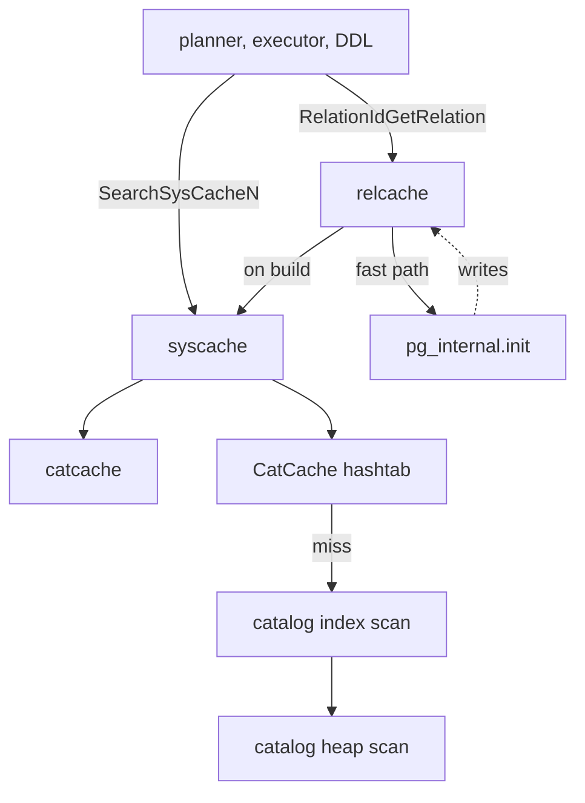

# 05 — Catalog Caches

[Up: index.md](index.md)  |  [Prev: 04 catalog modification apis](04_catalog_modification_apis.md)  |  [Next: 06 cache invalidation](06_cache_invalidation.md)


## Prerequisites

- [03](03_catalog_data_model_and_bootstrap.md), [04](04_catalog_modification_apis.md) — what catalogs are and how they are written.

## Overview

PostgreSQL has three layered caches sitting between the planner/executor and
pg_catalog:

```
relcache  : per-relation; cached open Relation (RelationData)
syscache  : per-row;       wrapper around catcache
catcache  : per-key;       hash table of HeapTuple-shaped CatCTup
```

Each layer answers a different question:

- `RelationIdGetRelation(oid)` → "open me the Relation for this OID."
- `SearchSysCache1(RELOID, oid)` → "give me the pg_class row for this OID."
- catcache → the underlying hash + index scan that backs syscache.

A startup shortcut, `pg_internal.init`, lets a backend skip the full relcache
build for nailed-and-built catalog entries.

## Architecture



## catcache.c — the lowest layer

### CatCache  (importance 0.92, Tier 1)

**Definition** (`src/include/utils/catcache.h`):
```c
typedef struct catcache
{
    int         id;                  /* cache identifier (matches syscache id) */
    int         cc_nbuckets;
    TupleDesc   cc_tupdesc;
    int         cc_reloid;            /* OID of underlying catalog */
    int         cc_indexoid;          /* OID of unique index used for lookup */
    int         cc_relisshared;
    bool        cc_relisrelmapped;
    int         cc_ntup;              /* # tuples currently in cache */
    int         cc_nlist;             /* # CatCLists currently in cache */
    int         cc_nkeys;             /* # of keys (1..4) */
    int16       cc_keyno[CATCACHE_MAXKEYS];
    PGFunction  cc_hashfunc[CATCACHE_MAXKEYS];
    Oid         cc_skey[CATCACHE_MAXKEYS];   /* operator OID for compare */
    bool        cc_isname[CATCACHE_MAXKEYS]; /* whether key has NAME type */
    dlist_head *cc_bucket;            /* hash buckets (cc_nbuckets) */
    dlist_head  cc_lists;             /* CatCList list */
    int         cc_searches;          /* statistics */
    int         cc_hits;
    int         cc_neg_hits;
    int         cc_newloads;
    int         cc_invals;
    ...
} CatCache;
```

A CatCache is one hash table per (catalog, index, key columns) combination.

### CatCTup  (Tier 2)

```c
typedef struct catctup
{
    int         ct_magic;
    CatCache   *my_cache;
    dlist_node  cache_elem;            /* link in cc_bucket */
    Datum       keys[CATCACHE_MAXKEYS];
    uint32      hash_value;
    bool        negative;              /* true = "no such row" entry */
    bool        dead;
    int         refcount;
    HeapTupleData tuple;               /* the cached row (zero-filled if negative) */
} CatCTup;
```

### CatCList  (Tier 2)

`SearchSysCacheList` queries return a *partial-key* list — for example,
"every pg_proc row named `foo` in any namespace". A CatCList caches that
result so subsequent identical queries skip the catalog scan.

### SearchCatCacheInternal  (importance 0.92, Tier 1)

**Signature** (catcache.c):
```c
HeapTuple SearchCatCacheInternal(CatCache *cache, int nkeys,
                                 Datum v1, Datum v2, Datum v3, Datum v4);
```

**Hot-path logic**:

1. Compute the hash of (v1..v4) via `cc_hashfunc[i]`.
2. Walk `cache->cc_bucket[hashIndex]`. For each `CatCTup`, compare keys via
   `cc_skey[i]` operators.
3. Hit (positive): `ct->refcount++`, return `&ct->tuple`.
4. Hit (negative): return `NULL` (the row genuinely does not exist; we
   already paid the catalog scan).
5. Miss: call `SearchCatCacheMiss`.

**Cold path (`SearchCatCacheMiss`)**:

1. `systable_beginscan(cc_indexoid)` with the keys.
2. If a row is found: heap_copytuple into a new CatCTup, link into the bucket.
3. If no row: insert a *negative* CatCTup with `ct->negative = true` (so the
   next miss-of-the-same-key is a hit).
4. Return the tuple (or NULL).

### CatCacheInvalidate  (importance 0.78)

```c
void CatCacheInvalidate(CatCache *cache, uint32 hashValue);
```

Called from sinval message processing. Walks every bucket whose hash matches,
marks every matching CatCTup as `dead`, decrements refcounts, and removes
zero-refcount entries. Dead entries with positive refcount stick around; they
will be released when the user releases them and finally cleaned up.

**Negative-entry contract**: invalidating a hashValue purges both positive
and negative entries with that hash. Otherwise a stale negative entry would
make the cache lie to its consumers.

### Lazy initialization

`InitCatCache(cacheId, ...)` allocates the CatCache struct but does *not*
populate hash buckets or open the catalog/index. The first `SearchCatCacheN`
call hits `CatalogCacheInitializeCache` which:

1. opens the catalog (`relation_open(cc_reloid, ...)`),
2. fills `cc_tupdesc`, `cc_skey[]`, `cc_keyno[]`, `cc_hashfunc[]`,
3. closes the catalog (we do not keep it open).

This avoids opening every catalog at every backend start.

## syscache.c — the friendly façade

### cacheinfo[]

A static array of `cachedesc` structs (catalog OID, index OID, # of keys, key
column attnums), one per `SysCacheIdentifier` enum value (ATTNAME, ATTNUM,
RELOID, RELNAMENSP, PROCOID, PROCNAMEARGSNSP, TYPEOID, TYPENAMENSP, etc.).
This array is generated by `genbki.pl` from the `MAKE_SYSCACHE` declarations
inside catalog headers.

### SearchSysCache1  (importance 0.90, Tier 1)

**Signature** (`syscache.c`):
```c
HeapTuple SearchSysCache1(int cacheId, Datum key1);
```

**Logic**:
```c
return SearchCatCache(SysCache[cacheId], key1, 0, 0, 0);
```

That is: dispatch the catalog/index lookup to the corresponding CatCache.
Variants `SearchSysCache2/3/4` extend the key list.

The `SysCache[]` global array is built once per backend at
`InitCatalogCache()` time. Element `i` holds the CatCache for the i-th
`SysCacheIdentifier`.

### SearchSysCacheLocked1

`syscache.c:287`. Same as `SearchSysCache1` but *also* takes a row-level lock
on the caller's behalf (UPDATE/DELETE on a catalog tuple needs SI X-lock).
This avoids the race window between `SearchSysCache1` returning a tuple and
the caller calling `LockTuple`.

### SearchSysCacheCopy1

Returns `heap_copytuple(SearchSysCache1(...))` — gives the caller a private
copy that survives cache invalidation. Required when the caller will hold the
tuple across a CCI or a syscache lookup.

### SysCacheGetAttr / SysCacheGetAttrNotNull

Helpers for extracting one column from a syscache HeapTuple, given a
`heap_getattr` plus the cache's tupdesc. `_AttrNotNull` errors if the column
is null; the version without `NotNull` returns `Datum 0` and sets `*isNull`.

### GetSysCacheOid / GetSysCacheHashValue

`GetSysCacheOid1(cacheId, oidcol, key)` returns the OID column of the matching
row (or InvalidOid if no row). Cheaper than `SearchSysCache1` followed by
`heap_getattr` for the very common "look up an OID by name" pattern.

`GetSysCacheHashValue` returns just the hash, used by inval.c when queuing
invalidation messages.

### SysCacheInvalidate

Wrapper that loops over every CatCache in `SysCache[]` and calls
`CatCacheInvalidate`. Used when a relcache message arrives that affects every
syscache on the relation.

### Identifying flags

- `RelationInvalidatesSnapshotsOnly(reloid)` — true for catalogs whose changes
  only require snapshot bumps, not full catcache flushes.
- `RelationHasSysCache(reloid)` — true if any CatCache references this relation.
- `RelationSupportsSysCache(reloid)` — same but considers shared catalogs.

## relcache.c — per-relation cache

### RelationData  (importance 0.94, Tier 1)

The runtime view of one open relation. Field-by-field tour
(`src/include/utils/rel.h`):

| Field                | Purpose                                                     |
|----------------------|-------------------------------------------------------------|
| `rd_node`            | RelFileLocator (tablespace, db, relfilenode)                |
| `rd_smgr`            | cached SMgrRelation pointer (lazy)                          |
| `rd_refcnt`          | # of open holders                                           |
| `rd_backend`         | for temp rels: which backend owns it                        |
| `rd_islocaltemp`     | local temp?                                                 |
| `rd_isnailed`        | nailed catalog?                                             |
| `rd_isvalid`         | true unless invalidated                                     |
| `rd_indexvalid`      | rd_indexlist is current?                                    |
| `rd_statvalid`       | rd_statlist is current?                                     |
| `rd_createSubid`     | subxid that created me (for transaction-temp tables)        |
| `rd_newRelfilelocatorSubid` | relfilenode change subxid (for VACUUM FULL)          |
| `rd_rel`             | Form_pg_class — the cached catalog row                      |
| `rd_att`             | TupleDesc (column types)                                    |
| `rd_id`              | Oid of pg_class row                                          |
| `rd_lockInfo`        | lock-tag info for this relation                             |
| `rd_rules`           | RuleLock — view rewrites and triggers                       |
| `rd_rulescxt`        | mcxt for rd_rules                                            |
| `rd_indexlist`       | List of Oid for indexes on this rel                          |
| `rd_oidindex`        | Oid of the OID-keyed index (for CatCache)                    |
| `rd_pkindex`         | Oid of primary key index                                     |
| `rd_replidindex`     | Oid of REPLICA IDENTITY index                                |
| `rd_indexcxt`        | mcxt for index info (only for indexes)                       |
| `rd_amroutine`       | TableAmRoutine (heap_*) or IndexAmRoutine                    |
| `rd_amcache`         | per-AM scratch                                               |
| `rd_options`         | reloptions parsed                                            |
| `rd_partkey`         | PartitionKey (only for partitioned tables)                   |
| `rd_partdesc`        | PartitionDesc (cached children)                              |
| `rd_rsdesc`          | RowSecurityDesc                                              |

### RelationIdGetRelation  (importance 0.92, Tier 1)

**Signature** (`relcache.c`):
```c
Relation RelationIdGetRelation(Oid relationId);
```

**Logic**:
1. Look up `RelationIdCache` (htab on Oid).
2. Hit + valid: bump `rd_refcnt`, return.
3. Hit + invalid: call `RelationClearRelation(rebuild=true)` to rebuild in
   place, return.
4. Miss: call `RelationBuildDesc(relationId, true)`.

### RelationBuildDesc  (importance 0.88, Tier 1)

**Signature**:
```c
Relation RelationBuildDesc(Oid targetRelId, bool insertIt);
```

**Steps**:
1. `ScanPgRelation(targetRelId)` — `index_open` pg_class, scan
   `pg_class_oid_index` to find the row, return a HeapTuple.
2. `AllocateRelationDesc()` — palloc Relation + memcpy of pg_class row.
3. `RelationParseRelOptions()` — parse `reloptions` text array.
4. `RelationBuildTupleDesc()` — scan `pg_attribute` rows.
5. `RelationBuildPartitionKey` if RELKIND_PARTITIONED_TABLE.
6. `RelationBuildPartitionDesc` — defer until partitioning lookup.
7. `RelationBuildRuleLock` — scan pg_rewrite for views/rules.
8. `RelationBuildRowSecurity` — scan pg_policy.
9. `RelationInitTableAccessMethod` (heaps) /
   `RelationInitIndexAccessInfo` (indexes).
10. `RelationInitPhysicalAddr` — set `rd_node`. For mapped relations,
    `RelationMapOidToFilenumber` is called.
11. Insert into `RelationIdCache` if `insertIt`.

### Three-phase relcache initialization

The bootstrap problem: relcache cannot read pg_class to find pg_class's own
descriptor. Solution: a three-phase init.

#### RelationCacheInitialize  (Phase 1)

`relcache.c`:
- create the `RelationIdCache` htab,
- load critical *backend* state (no catalog access yet).

#### RelationCacheInitializePhase2  (Phase 2)

- formrdesc-build the four nailed local catalogs:
  - `pg_class` (1259), `pg_attribute` (1249), `pg_proc` (1255), `pg_type`
    (1247) — using static `Schema_pg_*` arrays in schemapg.h.
- formrdesc-build the eleven shared catalogs.
- Call `RelationMapInitializePhase2()` to read pg_filenode.map.
- Now `relation_open(pg_class)` works.

#### RelationCacheInitializePhase3  (importance 0.78, Tier 2)

- Try `load_relcache_init_file()` for both global and per-database
  pg_internal.init.
- If they validate, copy in the saved entries; otherwise call
  `RelationBuildDesc` for the entries (load_critical_index for the indexes
  the nailed catalogs depend on, etc.).
- For each nailed catalog, replace its formrdesc-built descriptor with the
  catalog-built version (so `rd_rules`, `rd_indexlist`, etc. are populated).
- Mark `criticalRelcachesBuilt = true`.
- Mark `criticalSharedRelcachesBuilt = true`.

After Phase 3, the backend can open any relation by OID.

### formrdesc

`relcache.c`. Hard-coded relcache builder for the eight nailed entries. Reads
no catalogs; relies entirely on `Schema_pg_*` C constants. The descriptor is
flagged `rd_isnailed = true` so it can never be evicted by sinval.

### load_critical_index

For each catalog index that is itself read during catalog access (e.g.,
`pg_class_oid_index`), force its relcache entry to be built immediately and
flag it nailed. Without this, opening pg_class would recurse into opening
its own index.

### pg_internal.init

#### write_relcache_init_file  (importance 0.78)

Writes a snapshot of every Relation that satisfies *both* of:
- `rd_isnailed && criticalRelcachesBuilt`,
- the descriptor was built from catalog data (not just formrdesc).

The file lives at:
- global: `$PGDATA/global/pg_internal.init`
- per-db:  `$PGDATA/base/<dbid>/pg_internal.init`

Format:
1. magic + version,
2. for each relation: serialize Relation, TupleDesc, all rd_att entries,
   indexlist, etc.

#### load_relcache_init_file  (importance 0.78)

Reverse of write. If the file is fresh and validates, deserialize entries into
the relcache. Otherwise return failure and Phase 3 falls back to the slow
catalog-scan path.

#### RelationCacheInitFileInvalidate

Called when a catalog mutation happens that invalidates the snapshot
(e.g., creating an index on a catalog). Renames `pg_internal.init` →
`pg_internal.init.<pid>` so the next backend skips loading and rebuilds. The
rename happens in two phases (pre-prepare and post-commit) so an aborted
DDL leaves the file usable.

### RelationClearRelation  (importance 0.78)

```c
static void RelationClearRelation(Relation relation, bool rebuild);
```

Two-mode: rebuild = true (after CCI; replace the descriptor in place so
existing pointers stay valid), or rebuild = false (caller wants destruction).

The "live pointer problem": some callers hold a `Relation` pointer across a
CCI. We cannot palloc-free the Relation while it is referenced. Instead we
swap the contents of the new descriptor into the existing Relation struct
(`RelationReloadIndexInfo` and friends), then free the temporary.

### RelationFlushRelation, RelationCacheInvalidate, RelationCacheInvalidateEntry

These are the sinval-message handlers that drive `RelationClearRelation`.
`RelationCacheInvalidate(debug_discard)` invalidates *every* relcache entry
(SI_RESET path). `RelationCacheInvalidateEntry(relid)` invalidates one.

### RelationSetNewRelfilenumber

Used by VACUUM FULL / CLUSTER / TRUNCATE to swap a relation onto a new
relfilenode. Updates pg_class for ordinary relations; for mapped catalogs,
calls `RelationMapUpdateMap` instead.

## Auxiliary caches

### plancache.c

Caches `CachedPlan` and `CachedPlanSource` — the prepared-statement and
generic-plan caches. Invalidated by relcache + syscache callbacks registered
via `CacheRegisterSyscacheCallback` and `CacheRegisterRelcacheCallback`.

### partcache.c

Caches `PartitionDesc` and `PartitionKey`. Linked from `RelationData::rd_partdesc`
but isolated so partition descriptor invalidation doesn't force a full relcache
rebuild.

### typcache.c

Caches `TypeCacheEntry` per pg_type OID — record-type info, range/multirange
info, hash/btree opclass support. Invalidated via TYPEOID syscache callback.

### evtcache.c

Caches all `pg_event_trigger` rows in memory by event/tag for fast firing
during DDL.

### attoptcache.c

Caches `AttributeOpts` (per-column n_distinct overrides) per (rel, attno).

### spccache.c

Caches `pg_tablespace` reloptions (random_page_cost overrides).

### ts_cache.c

Caches text search configurations (`TSConfigCacheEntry`) per pg_ts_config OID.

### relfilenumbermap.c

A reverse map: given a `(reltablespace, relfilenode)` pair, find the
relation OID. Used by WAL decoding and by `pg_filenode_relation()`.

## Cache hit-rate sensitivity

Catalog cache hit rates strongly affect overall throughput because every query
must be parsed (RELOID, NAMESPACEOID, TYPEOID, OPEROID, PROCOID lookups).
Hot caches:

- `RELOID` — every parse step
- `RELNAMENSP` — every name → oid resolution
- `PROCOID` — every function call
- `TYPEOID` — every type lookup
- `ATTNUM` / `ATTNAME` — every column reference

When a backend exits all caches are gone. `pg_internal.init` partially
mitigates the relcache cost; catcache must be rebuilt via lookups.

## Cross-references

- `[06 Cache Invalidation](06_cache_invalidation.md)` — how catcache/relcache learn of changes.
- `[07 Relmapper](07_relmapper.md)` — RelationInitPhysicalAddr for nailed/mapped.
- `[04 Catalog Modification APIs](04_catalog_modification_apis.md)` — what triggers invalidations.

## Source references

- `src/backend/utils/cache/catcache.c` — top file comment plus
  `SearchCatCacheInternal`, `CatCacheInvalidate`
- `src/backend/utils/cache/syscache.c` — `cacheinfo[]`, `SearchSysCache1..4`,
  `SearchSysCacheLocked1`, `GetSysCacheOid`
- `src/backend/utils/cache/relcache.c::RelationIdGetRelation`
- `src/backend/utils/cache/relcache.c::RelationBuildDesc`
- `src/backend/utils/cache/relcache.c::formrdesc`
- `src/backend/utils/cache/relcache.c::RelationCacheInitialize`
- `src/backend/utils/cache/relcache.c::RelationCacheInitializePhase2`
- `src/backend/utils/cache/relcache.c::RelationCacheInitializePhase3`
- `src/backend/utils/cache/relcache.c::write_relcache_init_file`
- `src/backend/utils/cache/relcache.c::load_relcache_init_file`
- `src/backend/utils/cache/plancache.c`, `partcache.c`, `typcache.c`,
  `evtcache.c`, `attoptcache.c`, `spccache.c`, `ts_cache.c`,
  `relfilenumbermap.c`
- `src/include/utils/catcache.h` — CatCache, CatCTup, CatCList
- `src/include/utils/rel.h` — RelationData

---

[Up: index.md](index.md)  |  [Prev](04_catalog_modification_apis.md)  |  [Next](06_cache_invalidation.md)
