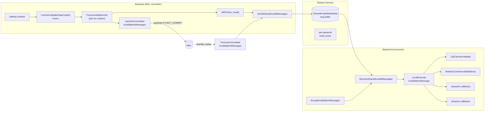

# 06 — Cache Invalidation

[Up: index.md](index.md)  |  [Prev: 05 catalog caches](05_catalog_caches.md)  |  [Next: 07 relmapper](07_relmapper.md)


## Prerequisites

- [05](05_catalog_caches.md) — the caches being invalidated.

## Overview

Catalog mutations made by one backend must reach every other backend's caches
before the mutator's view of the world becomes the canonical one. PostgreSQL
solves this with three cooperating layers:

1. **`inval.c`** — per-transaction invalidation outbox; collects messages as
   the backend mutates catalogs.
2. **`sinval.c` / `sinvaladt.c`** — the shared-memory ring buffer and
   per-backend cursors that distribute messages.
3. **Local executor**: `LocalExecuteInvalidationMessage`, which actually
   evicts catcache and relcache entries.

The contract is: messages are emitted at well-defined points
(CommandCounterIncrement, transaction end, AcceptInvalidationMessages) and
**never** in the middle of catalog code. Mutators only *queue* messages.

## Architecture



## Per-transaction outbox (inval.c)

### TransInvalidationInfo

```c
typedef struct TransInvalidationInfo
{
    struct TransInvalidationInfo *parent;       /* subxact stack */
    SubTransactionId my_level;                   /* subxact level */
    InvalidationMsgsGroup CurrentCmdInvalidMsgs; /* current command's */
    InvalidationMsgsGroup PriorCmdInvalidMsgs;   /* previous commands' */
    bool RelcacheInitFileInval;                   /* invalidate pg_internal.init? */
} TransInvalidationInfo;
```

The split between `CurrentCmdInvalidMsgs` and `PriorCmdInvalidMsgs` matters at
CCI time. A mutation made during the current command should *not* be
visible to the current command (we're in the middle of it), but should be
visible to all subsequent commands. CCI moves
`CurrentCmdInvalidMsgs → PriorCmdInvalidMsgs` and applies the moved messages
locally.

### PrepareInvalidationState

Called lazily on first invalidation. Allocates a `TransInvalidationInfo` for
the current subtransaction level if not yet allocated. Subtransaction begin /
end is reflected by pushing/popping these structs.

### AddCatcacheInvalidationMessage / AddRelcacheInvalidationMessage / AddSnapshotInvalidationMessage

Three message kinds:

| Message            | Trigger                                                  | Effect                                |
|--------------------|----------------------------------------------------------|---------------------------------------|
| `SHAREDINVALCATCACHE_ID` | one row in a catcached relation changed             | invalidate matching catcache entries  |
| `SHAREDINVALCATALOG_ID`  | many rows / structural change to a catcached relation | invalidate every entry of one CatCache|
| `SHAREDINVALRELCACHE_ID` | pg_class row changed (or RELOID-cached pg_class change)  | RelationClearRelation                 |
| `SHAREDINVALSMGR_ID`     | relfilenode forgotten                                   | smgr close / relmap reload            |
| `SHAREDINVALRELMAP_ID`   | pg_filenode.map changed                                 | RelationMapInvalidate                 |
| `SHAREDINVALSNAPSHOT_ID` | catalog needing fresh snapshots changed                 | bump snapshot cmin/cmax counters      |

## Mutator-side hooks

### CacheInvalidateHeapTuple  (importance 0.92, Tier 1)

**Signature** (`inval.c`):
```c
void CacheInvalidateHeapTuple(Relation relation,
                              HeapTuple tuple,
                              HeapTuple newtuple);
```

**Logic**:

1. If `relation->rd_id == RelationRelationId` (i.e., the modified tuple is a
   pg_class row), emit a relcache invalidation for the relation whose pg_class
   row changed.
2. If `RelationHasSysCache(relation->rd_id)`, queue a CatCache invalidation for
   every CatCache that indexes this relation. The hash value is computed from
   the old and (if non-NULL) new tuple keys.
3. Special cases: pg_attribute → emit relcache invalidation for the relation
   that owns the column; pg_index → emit relcache invalidation for the indexed
   relation and the index itself; pg_policy → relcache invalidation; pg_proc →
   plancache invalidation via `PlanCacheCallback`.

This is the *one* hook that catalog mutators must call. `CatalogTupleInsert`,
`CatalogTupleUpdate`, and `CatalogTupleDelete` all funnel through
`simple_heap_insert/update/delete`, which call this for catalog relations.

### CacheInvalidateHeapTupleByRelid

A variant that takes a relid + tuple, used when only the tuple's owning
relation OID is known.

### CacheInvalidateRelcache / CacheInvalidateRelcacheByRelid / CacheInvalidateRelcacheAll

Convenience wrappers. `CacheInvalidateRelcache(relation)` queues a relcache
invalidation for one relation. `CacheInvalidateRelcacheAll()` queues a global
relcache wipe (used by RELMAP changes, where every relcache entry might be
stale). `CacheInvalidateRelcacheByRelid(relid)` is the variant by OID.

### CacheInvalidateCatalog

Queues a `SHAREDINVALCATALOG_ID` message — wipe an entire CatCache. Used when
a structural change makes the per-tuple invalidations impractical (e.g.,
TRUNCATE on a system catalog during pg_upgrade — never normally allowed).

### CacheInvalidateSmgr

Queues `SHAREDINVALSMGR_ID`. Tells every backend to close its cached
SMgrRelation for a particular RelFileLocator. Triggered by relfilenode
recycling (VACUUM FULL, CLUSTER, TRUNCATE on permanent rel) and by DROP.

### CacheInvalidateRelmap

Queues `SHAREDINVALRELMAP_ID`. Tells every backend to re-read pg_filenode.map.
Emitted by `relmapper.c` after a write_relmap_file.

## Commit-time emission

### xactGetCommittedInvalidationMessages  (importance 0.78)

**Signature** (`inval.c`):
```c
int xactGetCommittedInvalidationMessages(SharedInvalidationMessage **msgs,
                                          bool *RelcacheInitFileInval);
```

Builds a flat array of every queued message in the outbox so it can be packed
into `xl_xact_commit`. Used by `RecordTransactionCommit`.

### RecordTransactionCommit ordering

`xact.c::RecordTransactionCommit`:

1. `xactGetCommittedInvalidationMessages(&msgs, &RelcacheInitFileInval)`.
2. Build `xl_xact_commit` containing CLOG XIDs, dropped relfilenodes, the
   sinval messages array, the commit timestamp, replication-origin info.
3. `XLogInsert(RM_XACT_ID, XLOG_XACT_COMMIT)` — durable commit.
4. `XLogFlush(commitLSN)` if synchronous_commit demands it.
5. `TransactionIdCommitTree(...)` — write CLOG bits.
6. `TransactionTreeSetCommitTsData(...)` — write commit_ts entries.
7. `ProcArrayEndTransaction()` — make committed XID visible.
8. `AtEOXact_Inval(true)` — flush our outbox; send messages to other backends.

Step 8 happens *after* the commit is durable, so other backends never see a
"this XID is committed" CLOG bit before they receive the corresponding sinval
messages.

### AtEOXact_Inval

Walks the outbox. For each message:
1. Pushes it onto the shared sinval ring (`SendSharedInvalidMessages`).
2. Locally applies it (`LocalExecuteInvalidationMessage`).

If `RelcacheInitFileInval` was set, also unlinks (renames) the
`pg_internal.init` files.

### AtEOSubXact_Inval

Subtransaction commit/abort. On commit, merges the subxact's outbox into the
parent's outbox. On abort, discards the subxact's outbox.

### CommandEndInvalidationMessages

Called from `CommandCounterIncrement`. Locally applies (only) the
`CurrentCmdInvalidMsgs`, then moves them to `PriorCmdInvalidMsgs`. Other
backends do not see CCI-only changes; we keep them in the outbox until commit.

### LocalExecuteInvalidationMessage

The dispatcher that turns a `SharedInvalidationMessage` into actual cache
operations:

| Message ID                | Action                                        |
|---------------------------|-----------------------------------------------|
| SHAREDINVALCATCACHE_ID    | `CatCacheInvalidate`                          |
| SHAREDINVALCATALOG_ID     | `SysCacheInvalidate`                          |
| SHAREDINVALRELCACHE_ID    | `RelationCacheInvalidateEntry`                |
| SHAREDINVALSMGR_ID        | `smgrcloserellocator`                         |
| SHAREDINVALRELMAP_ID      | `RelationMapInvalidate`                       |
| SHAREDINVALSNAPSHOT_ID    | bump global snapshot counters                  |

### Remote replay

#### ProcessCommittedInvalidationMessages  (importance 0.78)

Called by `xact_redo_commit` on the standby (and by hot-standby's startup
process). Takes the messages array embedded in `xl_xact_commit` and:

1. Calls `SendSharedInvalidMessages(msgs, n)` — pushes them into the
   standby's local sinval ring.
2. Optionally unlinks pg_internal.init.

This guarantees a standby applies the *same* invalidations the primary did,
in the same order.

## Shared ring buffer (sinval.c, sinvaladt.c)

### SharedInvalidStateData

```c
typedef struct SharedInvalidStateData
{
    int    minMsgNum;     /* oldest message still in the buffer */
    int    maxMsgNum;     /* one past newest */
    int    nextThreshold; /* trigger SICleanupQueue when >= */
    int    lastBackend;   /* highest in-use backend number */
    int    maxBackends;
    LWLock SInvalReadLock;
    LWLock SInvalWriteLock;
    int    numFreeBackends;

    SharedInvalidationMessage buffer[MAXNUMMESSAGES];
    ProcState procState[FLEXIBLE_ARRAY_MEMBER];
} SharedInvalidStateData;
```

`MAXNUMMESSAGES = 4096 * MaxBackends` (approximately) — sized for the worst
case. Each backend's `ProcState` has:

```c
typedef struct ProcState
{
    int        nextMsgNum;     /* next message I have not yet read */
    bool       resetState;     /* true: I missed messages, reset all */
    bool       signaled;       /* set if backend signaled */
    bool       hasMessages;    /* fast-path bool */
    pid_t      pid;
    int        proc;
    bool       sendOnly;       /* WAL sender writes but never reads */
} ProcState;
```

### SendSharedInvalidMessages  (importance 0.78)

**Signature** (`sinval.c`):
```c
void SendSharedInvalidMessages(const SharedInvalidationMessage *msgs, int n);
```

**Logic**:

1. Acquire `SInvalWriteLock` exclusive.
2. If `maxMsgNum + n > MAXNUMMESSAGES`, call `SICleanupQueue` to drop
   already-read messages from the head.
3. If still no room (every backend is too far behind), set `resetState = true`
   for every blocked backend and fall through.
4. Copy the n messages into `buffer[maxMsgNum..maxMsgNum + n]`.
5. Update `maxMsgNum`.
6. For each backend whose `nextMsgNum < maxMsgNum`, set `hasMessages = true`
   and signal them (PROCSIG_CATCHUP_INTERRUPT).
7. Release `SInvalWriteLock`.

### ReceiveSharedInvalidMessages  (importance 0.78)

**Signature** (`sinval.c`):
```c
void ReceiveSharedInvalidMessages(
    void (*invalFunction) (SharedInvalidationMessage *msg),
    void (*resetFunction) (void));
```

**Logic**:

1. Take `SInvalReadLock` shared.
2. If our `resetState` is set: release lock, call `resetFunction()`, clear
   our cache state, set `nextMsgNum = maxMsgNum`, return.
3. Loop: copy `buffer[nextMsgNum]` to a local array, increment our
   `nextMsgNum`, until we hit `maxMsgNum`.
4. Release `SInvalReadLock`.
5. For each copied message: call `invalFunction(msg)` (i.e.,
   `LocalExecuteInvalidationMessage`).

### SICleanupQueue

Walks the buffer, finds `globalMinMsgNum = min(every backend's nextMsgNum)`,
shifts the buffer by that amount.

### Overflow → SI_RESET

When a backend has fallen too far behind (its `nextMsgNum` is older than the
oldest message we want to keep), `SendSharedInvalidMessages` sets that
backend's `resetState = true`. The next `ReceiveSharedInvalidMessages` will
call `resetFunction`, which is `InvalidateSystemCachesExtended` — wipe **all**
catcache and relcache entries.

This is correct because over-invalidation is safe (we just rebuild) while
under-invalidation is not (we'd serve stale data). The cost is a transient
performance dip when a catch-up happens.

### HandleCatchupInterrupt / ProcessCatchupInterrupt

When a backend is signaled via PROCSIG_CATCHUP_INTERRUPT (sent by the writer),
it sets a latch so the next `CHECK_FOR_INTERRUPTS` will call
`ProcessCatchupInterrupt`, which calls `AcceptInvalidationMessages` even if
the backend was idle. This keeps idle backends from delaying queue cleanup.

## On-arrival path

### AcceptInvalidationMessages  (importance 0.85, Tier 1)

**Signature** (`inval.c`):
```c
void AcceptInvalidationMessages(void);
```

The single entry point that drains the sinval queue. Called from:

- `LockRelationOid` — every relation lock
- `RelationIdGetRelation` — every relation open
- `assign_search_path` — search_path change
- transaction begin
- explicit `CHECK_FOR_INTERRUPTS` paths (catch-up)

Just calls:
```c
ReceiveSharedInvalidMessages(LocalExecuteInvalidationMessage,
                             InvalidateSystemCachesExtended);
```

## Extension hooks

### CacheRegisterSyscacheCallback / CacheRegisterRelcacheCallback

```c
void CacheRegisterSyscacheCallback(int cacheid, SyscacheCallbackFunction func, Datum arg);
void CacheRegisterRelcacheCallback(RelcacheCallbackFunction func, Datum arg);
```

Extensions and core code (e.g., plancache.c, partcache.c, typcache.c) register
callbacks that are invoked from `CatCacheInvalidate` /
`RelationCacheInvalidateEntry`. The callback receives the cache identifier
and the affected key (hash value or relid).

A maximum of `MAX_SYSCACHE_CALLBACKS` and `MAX_RELCACHE_CALLBACKS` are
allowed (compile-time constants — currently 64 each).

### CallSyscacheCallbacks / CallRelcacheCallbacks

Iterate the registered callbacks. Used internally; not normally called by
extensions.

## The commit-time invalidation contract (deep dive)

Why must `ProcessCommittedInvalidationMessages` run **after** the CLOG bit is
set but **before** any other backend can witness the committed state?

If a standby reader sees CLOG.committed before it processes the sinval
messages, it could:

1. read pg_class via a stale relcache,
2. see the new (committed) row but with old-format tuple descriptor,
3. mis-decode the tuple.

The primary's `RecordTransactionCommit` enforces this by ordering:
`XLogInsert(commit) -> XLogFlush -> TransactionIdCommitTree -> AtEOXact_Inval`.

Standby's `xact_redo_commit` mirrors it:
`TransactionIdCommitTree -> ProcessCommittedInvalidationMessages -> smgrDoPendingDeletes`.

The CLOG bit ordering with respect to the sinval push is implicit: standby
processes proceed serially through WAL, so the standby's
`xact_redo_commit` finishes invalidation before the next replayer reads any
new tuple.

## sinval queue overflow → SI_RESET (deep dive)

Why is over-invalidation correct?

A SI_RESET wipes every catcache and relcache entry. The next access will
rebuild from the canonical pg_catalog. Because the catalog itself is
MVCC-correct, the rebuilt entry will be at least as fresh as the messages we
missed. The cost is rebuild time, never staleness.

Why is under-invalidation incorrect?

A missed sinval message means we keep using a stale CatCache row. Subsequent
queries see "the type's pg_type row" with old typmod/typname/typoutput, leading
to incorrect type behavior or even incorrect query results.

## Cross-references

- `[05 Catalog Caches](05_catalog_caches.md)` — what gets invalidated.
- `[04 Catalog Modification APIs](04_catalog_modification_apis.md)` — who triggers
  CacheInvalidateHeapTuple.
- `[15 Persistence and WAL Records](15_persistence_and_wal_records.md)` — XLOG_XACT_COMMIT carries the
  invalidation messages payload.
- `[07 Relmapper](07_relmapper.md)` — when XLOG_RELMAP_UPDATE fires
  CacheInvalidateRelmap.

## Source references

- `src/backend/utils/cache/inval.c` — entire file
- `src/backend/storage/ipc/sinval.c` — Send / Receive
- `src/backend/storage/ipc/sinvaladt.c` — ring buffer
- `src/include/storage/sinval.h` — `SharedInvalidationMessage`
- `src/include/storage/sinvaladt.h` — `SharedInvalidStateData`, `ProcState`

---

[Up: index.md](index.md)  |  [Prev](05_catalog_caches.md)  |  [Next](07_relmapper.md)
