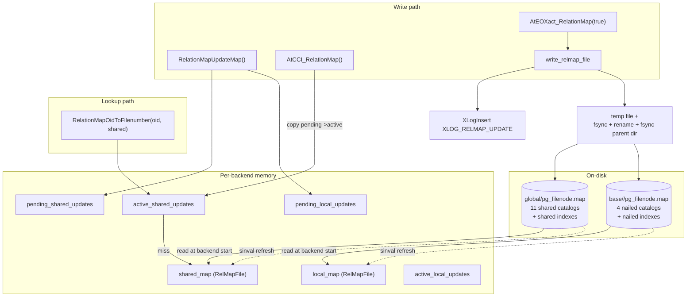

# 07 — Relmapper

[Up: index.md](index.md)  |  [Prev: 06 cache invalidation](06_cache_invalidation.md)  |  [Next: 08 slru framework](08_slru_framework.md)


## Prerequisites

- [03](03_catalog_data_model_and_bootstrap.md) — nailed and shared catalogs; [05](05_catalog_caches.md) — `RelationInitPhysicalAddr`.

## Overview

A *relfilenode* is the per-relation integer that names the on-disk file
(`base/<dbid>/<relfilenode>`). For ordinary relations, `pg_class.relfilenode`
records this. But pg_class itself cannot record its own relfilenode — that
would require reading pg_class to find pg_class. The same problem applies to
the four nailed catalogs and to all eleven shared catalogs.

The `relmapper` resolves this with a tiny side file:

- `$PGDATA/global/pg_filenode.map` — for the eleven shared catalogs,
- `$PGDATA/base/<dbid>/pg_filenode.map` — for the four nailed local catalogs.

This file is a small fixed-size record listing `(catalog OID → relfilenode)`
pairs, written atomically and replicated via `XLOG_RELMAP_UPDATE`.

## Why we need a relmapper at all

The bootstrap problem (verbatim spirit of `relmapper.c`'s top comment):

```
For most relations, the OID and relfilenode are the same. (Initially
they're equal but VACUUM FULL or CLUSTER changes relfilenode while keeping
the OID stable.) For nailed catalogs, the relcache must read pg_class to
discover relfilenode, but pg_class itself is one of the nailed catalogs.
For shared catalogs, there is one physical file across all databases, but
each database has its own pg_class, so we cannot agree on a single
pg_class.relfilenode value to point at it.

Solution: a small "map" file (pg_filenode.map) listing
(catalog OID -> relfilenode) for these special relations. The relcache
consults the map instead of pg_class.relfilenode for them.
```

## Architecture



## Data structures

### RelMapping

```c
/* relmapper.c:83 */
typedef struct RelMapping
{
    Oid           mapoid;          /* OID of a catalog */
    RelFileNumber mapfilenumber;   /* its rel file number */
} RelMapping;
```

### RelMapFile

```c
/* relmapper.c:89 */
typedef struct RelMapFile
{
    int32       magic;             /* always RELMAPPER_FILEMAGIC = 0x592717 */
    int32       num_mappings;      /* number of valid RelMapping entries */
    RelMapping  mappings[MAX_MAPPINGS];   /* MAX_MAPPINGS = 64 */
    pg_crc32c   crc;
} RelMapFile;
```

The whole file is exactly:

```
4 bytes magic + 4 bytes count + 64 * 8 bytes mappings + 4 bytes crc
= 4 + 4 + 512 + 4
= 524 bytes
```

This is intentionally small enough that a single sector write is atomic (most
hardware sectors are 512 bytes; PostgreSQL pads up to 8192 bytes via
`SizeOfRelMapFile` to make read errors easier to diagnose).

### Active vs pending state

Six in-memory `RelMapFile` instances (relmapper.c:112-134):

| Variable                     | Meaning                                                  |
|------------------------------|----------------------------------------------------------|
| `shared_map`                 | last known on-disk content of global/pg_filenode.map     |
| `local_map`                  | last known on-disk content of base/<dbid>/pg_filenode.map|
| `active_shared_updates`      | uncommitted changes already CCI-published                |
| `active_local_updates`       | same for local                                            |
| `pending_shared_updates`     | uncommitted changes NOT YET CCI-published                |
| `pending_local_updates`      | same for local                                            |

The pending → active transition happens at CCI; the active → on-disk
transition happens at commit.

## API

### RelationMapOidToFilenumber  (importance 0.85, Tier 1)

**Signature** (`relmapper.h:38`):
```c
RelFileNumber RelationMapOidToFilenumber(Oid relationId, bool shared);
```

**Logic**:

1. Walk `active_*_updates` (most recent CCI). If an entry matches `relationId`,
   return its `mapfilenumber`.
2. Walk `*_map` (last on-disk read). If an entry matches, return.
3. Return `InvalidRelFileNumber`.

`formrdesc` calls this for each nailed catalog so `RelationInitPhysicalAddr`
can populate `rd_node`. Without this call, the relcache would have no idea
where pg_class lives.

**Performance**: linear scan of up to 64 entries × two arrays. Negligible.

### RelationMapFilenumberToOid

Reverse lookup. Used by debugging tools (`pg_filenode_relation()`).

### RelationMapUpdateMap

**Signature** (`relmapper.h:45`):
```c
void RelationMapUpdateMap(Oid relationId, RelFileNumber fileNumber,
                          bool shared, bool immediate);
```

**Logic**:

- If `immediate`, store directly into `active_*_updates` (used during
  bootstrap / standalone backend, where there is no transaction context).
- Otherwise store into `pending_*_updates`. CCI will move it to active.

Callers: `RelationSetNewRelfilenumber` for mapped relations (VACUUM FULL,
CLUSTER, REINDEX). Other catalog mutations never touch the relmapper.

### AtCCI_RelationMap

Called from `CommandCounterIncrement`. Copies pending → active in both
local and shared. Pending arrays are reset.

### AtEOXact_RelationMap  (importance 0.78)

```c
void AtEOXact_RelationMap(bool isCommit, bool isParallelWorker);
```

On commit:
1. Merge `active_*_updates` into `*_map`.
2. Call `perform_relmap_update(true /*shared*/)` and
   `perform_relmap_update(false)` if either had pending changes — actually
   writes the file and emits `XLOG_RELMAP_UPDATE`.
3. Clear the active arrays.

On abort:
1. Discard active and pending.
2. Re-read `*_map` from on-disk (in case a partially-applied write happened
   and we want a clean slate; in practice this is rare).

### perform_relmap_update / write_relmap_file  (importance 0.78)

The atomic-write protocol (relmapper.c):

1. Compute the new `RelMapFile` content (merge of map + active updates),
   compute CRC.
2. `fd = open("pg_filenode.map.tmp", O_WRONLY | O_CREAT | O_EXCL)`.
3. `write(fd, &newmap, sizeof(RelMapFile))`.
4. `pg_fsync(fd)` — make the new file's bytes durable.
5. `XLogBeginInsert`; pack `xl_relmap_update {dbid, tsid, nbytes, data}`;
   `XLogInsert(RM_RELMAP_ID, XLOG_RELMAP_UPDATE)`. **The WAL goes BEFORE
   the rename**, so a standby always sees the new map.
6. `XLogFlush(commitLSN)` — make the WAL durable.
7. `rename("pg_filenode.map.tmp", "pg_filenode.map")`.
8. `pg_fsync` the parent directory so the rename is durable.
9. Send `CacheInvalidateRelmap` so other backends re-read.

Step 5 ordering matters: a crash between rename and fsync of the directory
would leave the new file present but not in the directory metadata, but the
WAL replay would re-emit and rewrite it on recovery anyway.

### relmap_redo  (importance 0.78)

```c
void relmap_redo(XLogReaderState *record);
```

Called during WAL replay for `XLOG_RELMAP_UPDATE`:

1. Validate the record's payload (length, dbid).
2. `write_relmap_file_internal(buffer, dbid, tsid)` — same atomic-write
   protocol as the primary, except we skip the `XLogInsert` (we are replaying
   one).
3. Update in-memory `*_map`.
4. Send `CacheInvalidateRelmap` so caches refresh.

This is what makes nailed/shared catalog relfilenode reassignments
(VACUUM FULL on pg_class, CLUSTER on pg_database) propagate to standbys.

### CheckPointRelationMap

Acquires `RelationMappingLock`. Releases immediately. The lock is held
throughout `perform_relmap_update`, so this is a synchronization point: any
in-flight relmap write completes before the checkpoint proceeds. After the
checkpoint, no half-applied state can be partially-on-disk.

### Initialization

Three-phase, mirroring the relcache:

#### RelationMapInitialize

Phase 1: zero the in-memory structs. No I/O.

#### RelationMapInitializePhase2

Read `global/pg_filenode.map` into `shared_map`. Validate magic + CRC.
Now relcache Phase 2 (formrdesc of shared catalogs) can resolve relfilenodes.

#### RelationMapInitializePhase3

Read `base/<dbid>/pg_filenode.map` into `local_map`. Now per-database mapped
catalogs can be opened.

If a map file is missing or invalid: the backend FATAL-aborts. Recovery
requires `pg_resetwal` or restoring from backup.

### RelationMapFinishBootstrap

Called once at `postgres --boot` end. Forces `perform_relmap_update` for
both maps so the initial set of mappings is on disk before we exit
bootstrap mode.

### Parallel-worker support

`EstimateRelationMapSpace`, `SerializeRelationMap`, `RestoreRelationMap`
serialize the active+pending state into a parallel-worker startup snapshot
(via `SerializedActiveRelMaps`). Workers do not perform relmap updates;
they only need the active state for relfilenode lookups.

## Why mapped relations cannot be relocated by transactional commands

A mapped relation can only change its relfilenode via
`RelationSetNewRelfilenumber`, called from `cluster_rel`,
`vacuum_rel(... VACUUM FULL ...)`, `reindex_relation`, and
`pg_class_aclmask` related rewrites. These commands write the new file
*before* committing the relmap update. If the new file write fails, the old
file is untouched and the transaction aborts — no half-committed state.

Plain `ALTER TABLE ... SET TABLESPACE` is *not* allowed for mapped relations.
The check is in `tablecmds.c::ATPrepSetTableSpace`.

## Persistence invariants

1. The map file write protocol is `WAL → tmp file → fsync tmp → rename →
   fsync dir`. A crash anywhere is recoverable: the WAL record alone is
   enough to rebuild the file.
2. `XLOG_RELMAP_UPDATE` is small (≤ 524 bytes payload + WAL framing) and
   fits trivially in one WAL page.
3. Every backend that participates in a relmap-changing transaction must see
   the same final map. `CacheInvalidateRelmap` ensures this.
4. The lock `RelationMappingLock` serializes writes — only one transaction
   at a time can advance the relmap. `CheckPointRelationMap` takes this lock
   so checkpoints synchronize with writers.

## Cross-references

- `[05 Catalog Caches](05_catalog_caches.md)` — `formrdesc` and `RelationInitPhysicalAddr`.
- `[15 Persistence and WAL Records](15_persistence_and_wal_records.md)` — `XLOG_RELMAP_UPDATE`.
- `[16 Checkpoints and Recovery](16_checkpoints_and_recovery.md)` — `CheckPointRelationMap`.
- `[20 WAL Record Catalog](20_wal_record_catalog.md) — see relmap_records.md` — WAL record format.

## Source references

- `src/include/utils/relmapper.h:25` — `XLOG_RELMAP_UPDATE`
- `src/include/utils/relmapper.h:27` — `xl_relmap_update`
- `src/backend/utils/cache/relmapper.c:70` — `RELMAPPER_FILENAME = "pg_filenode.map"`
- `src/backend/utils/cache/relmapper.c:73` — `RELMAPPER_FILEMAGIC = 0x592717`
- `src/backend/utils/cache/relmapper.c:81` — `MAX_MAPPINGS = 64`
- `src/backend/utils/cache/relmapper.c:83` — `RelMapping`
- `src/backend/utils/cache/relmapper.c:89` — `RelMapFile`
- `src/backend/utils/cache/relmapper.c::RelationMapOidToFilenumber`
- `src/backend/utils/cache/relmapper.c::RelationMapUpdateMap`
- `src/backend/utils/cache/relmapper.c::AtEOXact_RelationMap`
- `src/backend/utils/cache/relmapper.c::write_relmap_file`
- `src/backend/utils/cache/relmapper.c::relmap_redo`
- `src/backend/utils/cache/relmapper.c::CheckPointRelationMap`
- `src/backend/utils/cache/relmapper.c::RelationMapInitialize{,Phase2,Phase3}`

---

[Up: index.md](index.md)  |  [Prev](06_cache_invalidation.md)  |  [Next](08_slru_framework.md)
