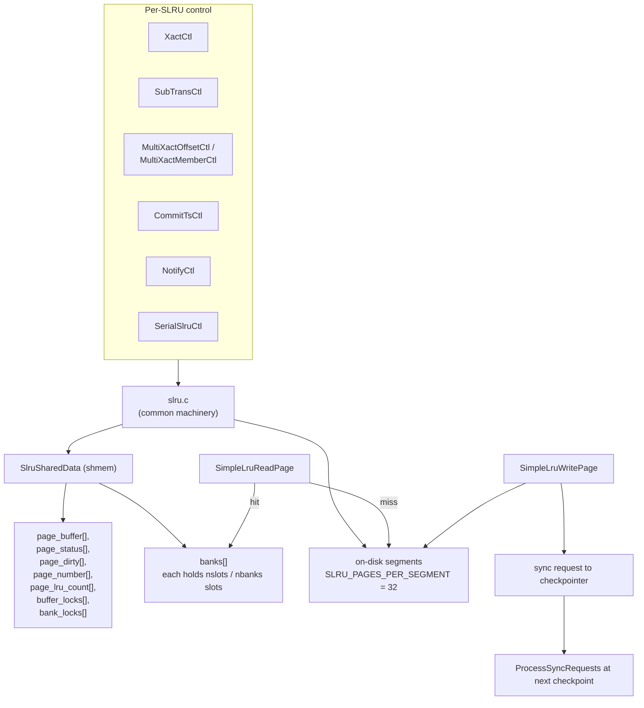

# 08 — SLRU Framework

[Up: index.md](index.md)  |  [Prev: 07 relmapper](07_relmapper.md)  |  [Next: 09 clog](09_clog.md)


## Prerequisites

- [02](02_architecture_overview.md) — domain 2 of the metadata subsystem.

## Overview

The Simple Least-Recently-Used (SLRU) framework is the in-memory cache + on-
disk file format shared by:

| SLRU                  | Directory               | What it stores                  |
|-----------------------|-------------------------|---------------------------------|
| CLOG (XactCtl)        | `pg_xact`               | 2 b/XID commit/abort status     |
| SUBTRANS              | `pg_subtrans`           | 4 B/XID parent XID              |
| MultiXact offsets     | `pg_multixact/offsets`  | 4 B/multi → first member offset |
| MultiXact members     | `pg_multixact/members`  | (xid, status) members           |
| CommitTs              | `pg_commit_ts`          | 10 B/XID timestamp + origin     |
| Notify (LISTEN/NOTIFY)| `pg_notify`             | NOTIFY queue                    |
| Serial (SSI)          | `pg_serial`             | predicate-lock SeqNo per XID    |

Every SLRU shares the same `slru.c` machinery:

- A small in-memory pool of `BLCKSZ`-sized pages.
- 32-page on-disk segment files.
- A per-bank LWLock partition.
- A page-status state machine.
- An optional async-commit LSN array.

## Architecture



## Data structures

### SlruSharedData  (importance 0.85, Tier 1)

`src/include/access/slru.h:61`:

```c
typedef struct SlruSharedData
{
    int            num_slots;
    char         **page_buffer;            /* num_slots BLCKSZ buffers */
    SlruPageStatus *page_status;
    bool          *page_dirty;
    int64         *page_number;
    int           *page_lru_count;

    LWLockPadded  *buffer_locks;           /* per-slot I/O lock */
    LWLockPadded  *bank_locks;             /* per-bank slot-access lock */

    int           *bank_cur_lru_count;     /* per-bank LRU clock */

    XLogRecPtr    *group_lsn;              /* CLOG only: async-commit LSNs */
    int            lsn_groups_per_page;    /* CLOG: 32, others: 0 */

    pg_atomic_uint64 latest_page_number;   /* hint to avoid evicting last page */

    int            slru_stats_idx;          /* pg_stat_slru index */
} SlruSharedData;
```

### SlruCtlData  (importance 0.92, Tier 1)

`src/include/access/slru.h:127`:

```c
typedef struct SlruCtlData
{
    SlruShared shared;                    /* shmem state */
    uint16     nbanks;                    /* number of bank partitions */
    bool       long_segment_names;         /* multixact uses 64-bit segment names */
    SyncRequestHandler sync_handler;       /* SYNC_HANDLER_CLOG, _MULTIXACT_OFFSET, etc. */
    bool     (*PagePrecedes) (int64, int64); /* age comparator (modular) */
    char       Dir[64];                    /* relative to PGDATA */
} SlruCtlData;
```

`PagePrecedes(a, b)` returns true iff every entry on page `a` is older than
every entry on page `b`. Modular arithmetic: with 32-bit XIDs, "older" means
"on the older side of the wraparound boundary", typically computed as
`((b - a) > 0 && (b - a) < 0x80000000U)`.

### SlruPageStatus enum

`slru.h:47`:

```c
typedef enum
{
    SLRU_PAGE_EMPTY,             /* buffer is not in use */
    SLRU_PAGE_READ_IN_PROGRESS,  /* page is being read in */
    SLRU_PAGE_VALID,              /* page is valid and not being written */
    SLRU_PAGE_WRITE_IN_PROGRESS,  /* page is being written out */
} SlruPageStatus;
```

`page_dirty` is a separate bool because a slot can be `VALID` and dirty
or `WRITE_IN_PROGRESS` and dirty (re-dirtied during the write). `dirty + status`
gives 8 logical states, of which only 5 are reachable.

### Sizing

```
SLRU_PAGES_PER_SEGMENT = 32         (slru.h:39)
SLRU_BANK_BITSHIFT     = 4          (slru.c — 16 slots per bank)
SLRU_MAX_ALLOWED_BUFFERS = 1 GiB / BLCKSZ = 131072  (slru.h:24)
```

The default `nslots` per SLRU comes from the user-tunable
`{xact,multixact_offset,multixact_member,commit_timestamp,subtransaction,
notify,serializable}_buffers` GUCs, or is auto-tuned via
`SimpleLruAutotuneBuffers()` if the GUC is set to -1.

`nbanks = max(1, nslots / 16)` so each bank holds at most 16 slots.

## Bank-lock partitioning

The most important scalability tweak in recent PostgreSQL. Earlier versions
serialized every SLRU access on a single `XactSLRULock` — bad for many cores.
Now:

```c
/* slru.h:174 (inline) */
static inline LWLock *
SimpleLruGetBankLock(SlruCtl ctl, int64 pageno)
{
    int bankno = pageno % ctl->nbanks;
    return &(ctl->shared->bank_locks[bankno].lock);
}
```

Each bank lock guards exactly `nslots / nbanks` slots. Two backends accessing
different banks can proceed in parallel.

The hash function (`pageno % nbanks`) does not depend on slot identity, so
moving a page from one slot to another within the same bank does not change
the lock. (Cross-bank moves cannot happen — a page belongs to its bank.)

`buffer_locks` is per-slot and only held during actual I/O; it is dropped
before the bank lock is reacquired for state-machine transitions.

## SimpleLruInit  (importance 0.85, Tier 1)

**Signature** (slru.h:185):
```c
void SimpleLruInit(SlruCtl ctl, const char *name,
                   int nslots, int nlsns,
                   const char *subdir,
                   int buffer_tranche_id, int bank_tranche_id,
                   SyncRequestHandler sync_handler,
                   bool long_segment_names);
```

**Logic**:

1. `ctl->nbanks = nslots / 16` (rounded down to power of 2).
2. `shared = ShmemInitStruct(name, ...)` — find or create the shmem block.
3. If `!found`: zero everything, allocate page buffers (one per slot),
   initialize buffer_locks and bank_locks via `LWLockRegisterTranche`,
   initialize `latest_page_number`.
4. `ctl->Dir = subdir` (e.g., "pg_xact"). Create the directory if missing
   (only happens during initdb / first run).
5. `ctl->sync_handler = sync_handler` (for fsync routing).
6. `ctl->PagePrecedes = NULL` — caller fills in.
7. `ctl->long_segment_names = long_segment_names` (true for multixact members
   only, where 64-bit-ish segment numbers are needed).

**Performance**: O(nslots) startup, called once per backend boot.

## SimpleLruZeroPage

```c
int SimpleLruZeroPage(SlruCtl ctl, int64 pageno);
```

Used by `Extend*` paths (CLOG, MultiXact, CommitTs) and bootstrap. Selects an
LRU slot, marks it `VALID`, dirty, with `page_number = pageno` and contents
all zero. Caller is expected to immediately fill in the relevant entry; the
zeropage WAL record makes this durable.

## SimpleLruReadPage  (importance 0.78)

**Signature** (slru.h:190):
```c
int SimpleLruReadPage(SlruCtl ctl, int64 pageno, bool write_ok, TransactionId xid);
```

**Logic**:

1. Take `bank_lock = SimpleLruGetBankLock(ctl, pageno)` exclusive.
2. Walk the bank's slots looking for a slot with `page_number == pageno`.
3. **Hit, status VALID**: return slotno.
4. **Hit, status READ_IN_PROGRESS**: release bank_lock, take
   `buffer_locks[slotno]` shared, release, retake bank_lock, retry.
5. **Hit, status WRITE_IN_PROGRESS**: if `write_ok`, return slotno; else
   wait on `buffer_locks[slotno]` for the write to finish.
6. **Miss**: call `SlruSelectLRUPage(ctl, pageno, bank_lock)`. This finds an
   evictable slot in this bank; if the chosen slot is dirty, releases bank_lock,
   calls `SimpleLruWritePage(slotno)` (which acquires buffer_locks), then
   reacquires bank_lock. Mark status `READ_IN_PROGRESS`, set `page_number`.
7. Release bank_lock; acquire `buffer_locks[slotno]` exclusive.
8. Read the page from disk (`SlruPhysicalReadPage`). On error, status →
   EMPTY, raise.
9. Reacquire bank_lock, status → VALID, release `buffer_locks`, return slotno.

The double-locking dance (bank_lock vs buffer_locks) avoids serializing on
slow I/O: while one slot is being read, another backend can still access
other slots in the same bank.

`xid` is used only for error reporting ("could not access status of
transaction %u") so the user can identify which transaction triggered the
failure.

`write_ok = false` is used by readers who do not want to be stuck behind a
write — they immediately return a `WRITE_IN_PROGRESS` slot's data, which is
safe because writes never modify the slot's payload.

## SimpleLruReadPage_ReadOnly

Same as `SimpleLruReadPage` but takes `bank_lock` shared first. If the slot
is hit with `VALID` status, we return immediately under shared lock. If miss
or other-status, escalate to exclusive. This is the path used by every
visibility check (`TransactionIdGetStatus`).

## SimpleLruWritePage

**Signature** (slru.h:194):
```c
void SimpleLruWritePage(SlruCtl ctl, int slotno);
```

**Logic**:

1. Status must be `VALID` and `page_dirty = true`. Else early return.
2. Status → `WRITE_IN_PROGRESS`.
3. Compute fdata: open the segment file (`SlruFileName(pageno)`), seek to
   page offset.
4. **WAL flush**: if `group_lsn != NULL` (CLOG only), find the maximum LSN in
   `group_lsn[slotno * lsn_groups_per_page .. +lsn_groups_per_page]` and
   `XLogFlush(maxLsn)`. This is the "WAL before data" rule for async-commit:
   we cannot write a CLOG page that records a commit whose WAL is not yet
   durable.
5. `pg_pwrite(fd, page_buffer[slotno], BLCKSZ, offset)`.
6. `RegisterSyncRequest(SLRU_FILE, ...)` — ask the checkpointer to fsync
   this segment at next checkpoint.
7. `page_dirty = false`. Status → `VALID`. (If dirty was re-set during step 5,
   leave dirty true.)

## SlruSelectLRUPage

Per-bank scan: among slots in the requested bank, choose the one with the
largest `bank_cur_lru_count[bankno] - page_lru_count[slotno]` (oldest age).
Skip slots whose `page_number == latest_page_number` (avoid evicting the live
write tail). Skip pages that are `READ_IN_PROGRESS`.

If the chosen slot is `WRITE_IN_PROGRESS`: wait on its `buffer_locks` for the
write to finish, then retry the selection (under the bank lock again).

## SimpleLruWriteAll

**Signature** (slru.h:195):
```c
void SimpleLruWriteAll(SlruCtl ctl, bool allow_redirtied);
```

Walk every slot. For each dirty `VALID` slot, call `SimpleLruWritePage`.
This is the checkpoint hook (called from `CheckPointCLOG`,
`CheckPointMultiXact`, etc.).

`allow_redirtied = true` means: it is OK if a slot got re-dirtied between
the loop's read of `page_dirty` and the call to write. The caller will sync
again next checkpoint.

## SimpleLruTruncate

**Signature** (slru.h:201):
```c
void SimpleLruTruncate(SlruCtl ctl, int64 cutoffPage);
```

Removes segment files containing only pages older than `cutoffPage`. "Older"
is determined via `ctl->PagePrecedes`, which uses modular arithmetic for
32-bit XID wraparound.

**Logic**:

1. Walk every slot; for any with `PagePrecedes(page_number, cutoffPage)`,
   discard it (mark EMPTY, do not write back even if dirty — the data is
   no longer needed).
2. `SlruScanDirectory(ctl, SlruScanDirCbDeleteCutoff, &cutoff)` — walks the
   on-disk segment files. For each file whose pages are all older than
   cutoffPage, `SlruInternalDeleteSegment` removes it.
3. Issue a sync request so the directory mtime is durable.

## SlruScanDirectory

Walks `ctl->Dir` and invokes a callback for every segment file. Built-in
callbacks:

- `SlruScanDirCbReportPresence` — used to discover the highest existing
  segment at startup.
- `SlruScanDirCbDeleteAll` — used by pg_notify (volatile across restarts;
  wiped at boot).
- `SlruScanDirCbDeleteCutoff` — internal to `SimpleLruTruncate`.

## SimpleLruDoesPhysicalPageExist

```c
bool SimpleLruDoesPhysicalPageExist(SlruCtl ctl, int64 pageno);
```

Probes the on-disk file without reading it. Used during recovery to decide
whether a TruncateCLOG record refers to a still-extant range.

## Sync-request integration

When `SimpleLruWritePage` finishes, the dirty data is in the kernel buffer
cache but not necessarily on disk. The fsync request is queued to the
checkpointer via `RegisterSyncRequest(... SLRU_FILE ...)`. At
`ProcessSyncRequests` (called from `CheckPointGuts`), the checkpointer issues
one `fsync` per (SLRU, segment) pair.

Per-SLRU sync handlers (`SyncRequestHandler`):

| Handler                              | Resolved by                          |
|--------------------------------------|--------------------------------------|
| SYNC_HANDLER_CLOG                    | `clogsyncfiletag` -> SlruSyncFileTag |
| SYNC_HANDLER_MULTIXACT_OFFSET        | `multixactoffsetssyncfiletag`         |
| SYNC_HANDLER_MULTIXACT_MEMBER        | `multixactmemberssyncfiletag`         |
| SYNC_HANDLER_COMMIT_TS               | `committssyncfiletag`                 |
| SYNC_HANDLER_NONE                    | (pg_notify, pg_serial)                |

`SlruSyncFileTag` (slru.c) takes a (Oid handler, int64 segno) tag and
returns the path; the checkpointer's mdsync loop opens that file and fsyncs.

## Page-state machine details

```
                    SimpleLruInit
                          │
                          ▼
                       EMPTY ─────► (SimpleLruZeroPage)
                          │                │
                          │                ▼
                          │            VALID + dirty
                          │                │
              SimpleLruReadPage             │
                          │                ▼
                          ▼          SimpleLruWritePage
                 READ_IN_PROGRESS           │
                          │                ▼
                I/O done? │         WRITE_IN_PROGRESS
                          ▼            (re-dirtied?)
                       VALID ◄───────────┐
                          │              │
                          ▼              │
                   SlruSelectLRUPage     │
                          │              │
                          ▼              │
                   (write back) ─────────┘
                          │
                          ▼
                       EMPTY (slot reused)
```

## SLRU bank-lock partitioning (deep dive)

Why bank-lock?

- A single global lock serializes every SLRU read+write on the entire
  cluster's catalog cache load. With 64+ cores, lock contention is fatal.
- Per-slot locking is too fine — the state-machine transitions touch shared
  state (`bank_cur_lru_count`).
- Per-bank locking is the sweet spot: 16 slots per bank means most of the
  state is bank-local, and `pageno % nbanks` is a uniform hash.

Why this works for CLOG specifically:

- CLOG access is dominated by recent transactions (small page-number range),
  but the "live" pages at the head of the log rotate quickly. The hash
  spreads contention across banks even when access is concentrated on
  recent pages.
- Group-commit batching (`TransactionGroupUpdateXidStatus`) further reduces
  the number of bank-lock acquisitions per commit: many committers can
  batch their updates under a single lock.

## Performance characteristics

| Operation                  | Cost                                              |
|----------------------------|---------------------------------------------------|
| Read hit (slot present)    | bank lock + memcpy                                |
| Read miss (warm)           | bank lock + LRU scan + page I/O (8 KB)            |
| Read miss (cold)           | + segment file open + lseek                       |
| Write (page evict)         | bank lock + I/O + sync-request register           |
| Truncate                   | per-slot scan + per-segment unlink                |
| Checkpoint sync            | one fsync per dirty segment                       |

Per-bank lock contention dominates only when many backends hammer the same
bank, which happens at the live-tail of CLOG. The group-commit optimization
addresses exactly this case.

## Persistence invariants

1. **WAL before data**: For SLRUs with `group_lsn` (CLOG only),
   `SimpleLruWritePage` calls `XLogFlush(group_max_lsn)` before writing.
   Other SLRUs rely on their own WAL records (XLOG_MULTIXACT_CREATE_ID, etc.)
   to reach disk before the SLRU page would.
2. **Atomicity of single-page write**: `pg_pwrite(8 KB)` is non-atomic across
   power loss. SLRUs are protected by `XLOG_*_ZEROPAGE` records: a page is
   either fully present (so its zeroed prefix can be filled in) or fully
   absent (and the `XLOG_*_ZEROPAGE` will recreate it).
3. **Truncation never advances `oldestXid` faster than `vac_truncate_clog`**:
   the truncate WAL records carry the new cutoff; replay applies them in
   the same order as the primary.

## Cross-references

- `[09 CLOG](09_clog.md)`, `[10 SUBTRANS](10_subtrans.md)`, `[12 MultiXact](12_multixact.md)`,
  `[11 Commit Timestamps](11_commit_timestamps.md)` — the SLRU users.
- `[19 SLRU Users Catalog](19_slru_users_catalog.md) — see *.md` — per-SLRU on-disk inventory.
- `[15 Persistence and WAL Records](15_persistence_and_wal_records.md)` — per-SLRU WAL records.

## Source references

- `src/include/access/slru.h:24` — `SLRU_MAX_ALLOWED_BUFFERS`
- `src/include/access/slru.h:39` — `SLRU_PAGES_PER_SEGMENT = 32`
- `src/include/access/slru.h:47` — `SlruPageStatus`
- `src/include/access/slru.h:61` — `SlruSharedData`
- `src/include/access/slru.h:127` — `SlruCtlData`
- `src/include/access/slru.h:174` — `SimpleLruGetBankLock`
- `src/include/access/slru.h:185` — `SimpleLruInit`
- `src/backend/access/transam/slru.c::SimpleLruInit`
- `src/backend/access/transam/slru.c::SimpleLruReadPage`
- `src/backend/access/transam/slru.c::SimpleLruWritePage`
- `src/backend/access/transam/slru.c::SlruSelectLRUPage`
- `src/backend/access/transam/slru.c::SimpleLruWriteAll`
- `src/backend/access/transam/slru.c::SimpleLruTruncate`
- `src/backend/access/transam/slru.c::SlruScanDirectory`
- `src/backend/access/transam/slru.c::SlruSyncFileTag`

---

[Up: index.md](index.md)  |  [Prev](07_relmapper.md)  |  [Next](09_clog.md)
