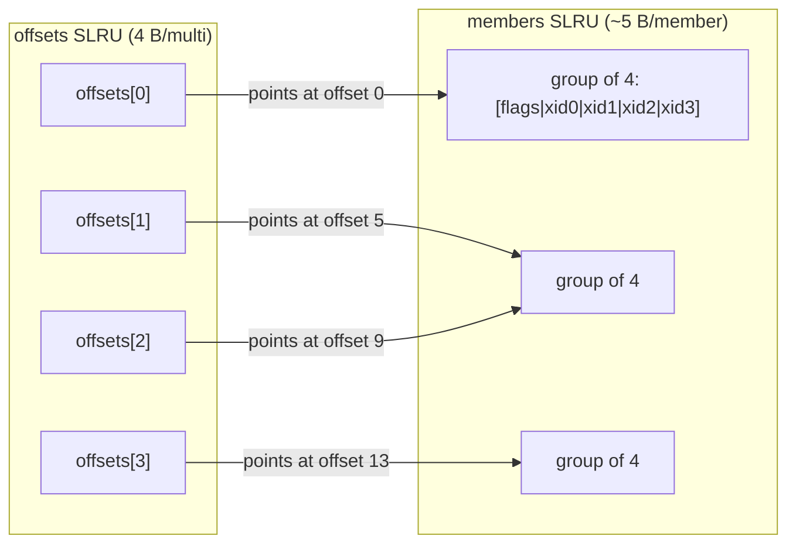

# 12 — MultiXact

[Up: index.md](index.md)  |  [Prev: 11 commit timestamps](11_commit_timestamps.md)  |  [Next: 13 visibility map](13_visibility_map.md)


## Prerequisites

- [08](08_slru_framework.md) — the SLRU machinery; [09](09_clog.md) — wraparound concepts.

## Overview

When a row is locked by more than one transaction at once (e.g., two
backends both `SELECT ... FOR KEY SHARE` of the same row), the row's
`xmax` cannot store a single TransactionId. Instead, `xmax` holds a
*MultiXactId* — a small integer that indexes into a side table listing the
actual member transactions and their lock modes.

MultiXact is implemented as **two** SLRUs:

- `pg_multixact/offsets` — for each MultiXactId, the offset of its first
  member entry in the members file (4 B per multi).
- `pg_multixact/members` — variable-length array of (TransactionId, status)
  pairs, packed in 4-entry groups with a status flag byte.

```
MULTIXACT_OFFSETS_PER_PAGE        = BLCKSZ / sizeof(MultiXactOffset) = 2048
MULTIXACT_MEMBERS_PER_PAGE        ~ 1635 (variable due to flag-byte packing)
MULTIXACT_MEMBER_SAFE_MULTIPLIER  = ~5 B per member
```

## Two-SLRU duality

`offsets`: simple lookup table. `multi → first_member_offset`.
`members`: dense packed records.

Reading a multi:
1. Look up `offset` in offsets SLRU.
2. Look up `nmembers` (could be `next_offset - offset` if next multi exists,
   else stored elsewhere).
3. Read members[offset..offset+nmembers] from members SLRU.



## Data structures

### MultiXactStatus

```c
/* multixact.h:37 */
typedef enum
{
    MultiXactStatusForKeyShare = 0x00,
    MultiXactStatusForShare,
    MultiXactStatusForNoKeyUpdate,
    MultiXactStatusForUpdate,
    /* update + lock combinations */
    MultiXactStatusNoKeyUpdate = 0x04,
    MultiXactStatusUpdate
} MultiXactStatus;

#define ISUPDATE_from_mxstatus(status) (((status) & 0x04) != 0)
```

The high bit indicates "this member actually wrote a new tuple version" vs
"this member only locked the row".

### MultiXactMember

```c
typedef struct MultiXactMember
{
    TransactionId xid;
    MultiXactStatus status;
} MultiXactMember;
```

In the members SLRU, members are stored as 4-element groups: 1 flag-byte
holding 4 status values (2 bits each), followed by 4 TransactionIds (16 bytes).
So 17 bytes per 4-member group, ~4.25 B per member; the safe multiplier is 5
to leave room for partial groups.

## Multixact creation

### MultiXactIdCreate  (importance 0.78, Tier 1)

**Signature** (`multixact.c`):
```c
MultiXactId MultiXactIdCreate(TransactionId xid1, MultiXactStatus status1,
                              TransactionId xid2, MultiXactStatus status2);
```

The typical xmax-promotion path. Called from `heap_lock_tuple` when a tuple
is locked by an xid different from the existing xmax holder.

**Logic**:
```c
MultiXactMember members[2] = {{xid1, status1}, {xid2, status2}};
MultiXactId multi;

/* Pre-validate: members must not be passed-in MultiXactIds; resolve them first */
multi = MultiXactIdCreateFromMembers(2, members);
return multi;
```

### MultiXactIdExpand

```c
MultiXactId MultiXactIdExpand(MultiXactId multi, TransactionId xid,
                              MultiXactStatus status);
```

Used when a tuple's xmax is already a multi and a new locker needs to be added.

**Logic**:
1. `members = GetMultiXactIdMembers(multi)`.
2. Append `{xid, status}` to the array (deduplicating on xid).
3. `MultiXactIdCreateFromMembers(nmembers, members)`.

The size grows linearly with the number of distinct lockers.

### MultiXactIdCreateFromMembers

The actual creator. Calls `GetNewMultiXactId` to allocate a new MultiXactId
and a member-region offset, then fills both SLRUs.

### GetNewMultiXactId  (Tier 1 — wraparound logic is critical)

**Signature** (`multixact.c`):
```c
static MultiXactId GetNewMultiXactId(int nmembers, MultiXactOffset *offset);
```

**Logic**:
1. Take `MultiXactGenLock` exclusive.
2. `result = ShmemVariableCache->nextMulti` (current next-to-allocate multi).
3. `*offset = ShmemVariableCache->nextMultiOffset`.
4. Check wraparound:
   - If `result + 1 >= MultiXactState->multiVacLimit`: wraparound danger.
     If autovacuum is *not* already running, signal it. If we are very close
     to wrap (`result >= multiStopLimit`), `ereport(ERROR, ...)` — refuse the
     allocation.
5. Check member-space wraparound:
   - The members file's offset wraps independently. Compute
     `nextMultiOffset + nmembers`; if it would cross `offsetStopLimit`,
     ereport.
6. Increment `nextMulti` and `nextMultiOffset`.
7. If a fresh offsets/members page is needed, emit
   `XLOG_MULTIXACT_ZERO_OFF_PAGE` / `XLOG_MULTIXACT_ZERO_MEM_PAGE` and zero
   the page.
8. Release the lock.

**The wraparound logic** is the hardest part. MultiXactId is 32-bit and wraps
at 4 billion; member offsets also wrap at 4 billion. Vacuum must keep
`oldestMulti` advancing to free both. If members run out before
multixacts (because long-lived multis hold many members), vacuum must be
extra-aggressive on members. The thresholds are:

- `multiVacLimit`: 200 million multis ahead of `oldestMulti`. Triggers
  emergency vacuum.
- `multiWarnLimit`: 100 million ahead. Logs a warning.
- `multiStopLimit`: very close to wrap. Refuses new multis.
- Same triplet for member offsets.

### RecordNewMultiXact

Performs the actual offsets+members SLRU writes:

1. Compute the offsets-SLRU page for `multi`.
2. `slotno_off = SimpleLruReadPage(MultiXactOffsetCtl, pageno_off, true, multi)`.
3. `((MultiXactOffset*) page_buffer[slotno_off])[entry] = offset`.
4. Mark dirty.
5. For each member, compute its members-SLRU page:
6. `slotno_mem = SimpleLruReadPage(MultiXactMemberCtl, pageno_mem, true, multi)`.
7. Write the flag-byte + xid into the appropriate group offset.
8. Mark dirty.

The WAL record (`XLOG_MULTIXACT_CREATE_ID`) was already emitted before this
function; this is just the in-memory SLRU update.

## Multixact reading

### GetMultiXactIdMembers  (Tier 2)

```c
int GetMultiXactIdMembers(MultiXactId multi, MultiXactMember **members,
                          bool from_pgupgrade, bool isLockOnly);
```

Returns the array of members for `multi`. Used by every visibility check that
sees a multi xmax.

**Logic**:
1. Check the per-process cache `mXactCache` (linked list of recent reads).
2. If hit: copy & return.
3. Else: read `offsets[multi]`, then `offsets[multi + 1]` to compute nmembers
   (or get nmembers from a special trailer for the live tail).
4. Read members[offset..offset+nmembers] from the members SLRU.
5. Insert into `mXactCache` (LRU eviction).
6. Return.

### mXactCacheGetById / mXactCacheGetBySet

The per-process cache:
- `mXactCacheGetById(multi)` — quick hash lookup.
- `mXactCacheGetBySet(nmembers, members)` — given a desired set of members,
  find an existing multi that already represents them. Used by
  `MultiXactIdCreateFromMembers` to avoid creating duplicates.

The cache is unbounded but reaped at end-of-transaction
(`AtEOXact_MultiXact`).

### MultiXactIdIsRunning

```c
bool MultiXactIdIsRunning(MultiXactId multi, bool isLockOnly);
```

Used by `HeapTupleSatisfiesMVCC`. Iterates members; if any member's xid is
in-progress, returns true. If isLockOnly is true and every member is a
lock-only status, returns false even if there are running members (because
lock-only doesn't change the tuple).

### MultiXactIdGetUpdateXid

If any member of `multi` is an UPDATE-er, return that xid; else return
InvalidTransactionId. Used to find which xid actually wrote the new tuple
version when a multi is the xmax.

## Wraparound

### SetOffsetVacuumLimit

Computes `multiVacLimit`, `multiWarnLimit`, `multiStopLimit` based on the
current `oldestMulti` (`pg_control` value). Called periodically by autovacuum
to update the thresholds.

The "members can wrap independently" property: a long-running multi with many
members occupies a long stretch of the members file. As `nextMultiOffset`
advances, even if `nextMulti` is well behind the wrap point, the members
file can still wrap. Vacuum must therefore advance `oldestMulti` aggressively
when members are pressured, even if multis themselves are not.

### MultiXactMemberFreezeThreshold

```c
MultiXactOffset MultiXactMemberFreezeThreshold(void);
```

Returns the safe distance ahead of `oldestMulti` such that vacuum should
freeze any tuple whose xmax is a multi older than (oldestMulti +
threshold). The function approximates "how much member space is consumed
per multi" so vacuum can decide based on the members-file pressure rather
than the multi-id-space pressure.

### MultiXactAdvanceOldest

```c
void MultiXactAdvanceOldest(MultiXactId oldestMulti, Oid oldestMultiDB);
```

Updates `pg_control.oldestMulti` and `oldestMultiDB`. Called during
checkpoint after the highest-known-safe oldestMulti is computed.

## pg_control fields

`pg_control` carries:
- `nextMulti` — next MultiXactId to assign
- `nextMultiOffset` — next member-file offset to use
- `oldestMulti` — cluster-wide minimum datminmxid
- `oldestMultiDB` — database that contains oldestMulti

Tracked separately from `nextXid`/`oldestXid` because they can wrap
independently of XIDs.

## Lifecycle

### MultiXactShmemInit, BootStrapMultiXact, StartupMultiXact, TrimMultiXact

`SimpleLruInit` is called twice: once at `multixact.c:1965` for offsets,
once at `multixact.c:1972` for members.

`StartupMultiXact()`:
1. Reads `nextMulti`, `nextMultiOffset`, `oldestMulti` from pg_control.
2. Sets `latest_page_number` for both SLRUs.

`TrimMultiXact()`:
1. Zeros the trailing portion of the offsets page beyond nextMulti.
2. Zeros the trailing portion of the members page beyond nextMultiOffset.

### CheckPointMultiXact

Drives both SLRUs:

```c
void CheckPointMultiXact(void)
{
    SimpleLruWriteAll(MultiXactOffsetCtl, true);
    SimpleLruWriteAll(MultiXactMemberCtl, true);
}
```

In addition, the checkpoint reads `MultiXactGetCheckptMulti(...)` and updates
`pg_control` fields `nextMulti`, `nextMultiOffset`, `oldestMulti`,
`oldestMultiDB`.

### TruncateMultiXact

Called from `vac_truncate_clog` after vacuum advances `oldestMulti`.

```c
void TruncateMultiXact(MultiXactId newOldestMulti, Oid newOldestMultiDB);
```

1. Find the offset belonging to `newOldestMulti`.
2. Build `xl_multixact_truncate { oldestMultiDB, startTruncOff, endTruncOff,
   startTruncMemb, endTruncMemb }`.
3. `XLogInsert(RM_MULTIXACT_ID, XLOG_MULTIXACT_TRUNCATE_ID)`.
4. `SimpleLruTruncate(MultiXactOffsetCtl, ...)`.
5. `SimpleLruTruncate(MultiXactMemberCtl, ...)`.

## WAL records

### XLOG_MULTIXACT_ZERO_OFF_PAGE  (info 0x00)

Payload: `int64 pageno`. Replay zeroes an offsets page.

### XLOG_MULTIXACT_ZERO_MEM_PAGE  (info 0x10)

Payload: `int64 pageno`. Replay zeroes a members page.

### XLOG_MULTIXACT_CREATE_ID  (info 0x20)

```c
typedef struct xl_multixact_create
{
    MultiXactId  mid;
    MultiXactOffset moff;
    int32        nmembers;
    MultiXactMember members[FLEXIBLE_ARRAY_MEMBER];
} xl_multixact_create;
```

Replay calls `RecordNewMultiXact(mid, moff, nmembers, members)` and
advances `nextMulti` / `nextMultiOffset` cursors.

### XLOG_MULTIXACT_TRUNCATE_ID  (info 0x30)

```c
typedef struct xl_multixact_truncate
{
    Oid              oldestMultiDB;
    MultiXactId      startTruncOff;
    MultiXactId      endTruncOff;
    MultiXactOffset  startTruncMemb;
    MultiXactOffset  endTruncMemb;
} xl_multixact_truncate;
```

Replay calls SimpleLruTruncate on both SLRUs and updates `oldestMulti`.

### multixact_redo

Dispatches by info-byte to one of the four replay paths above.

## 2PC support

- `multixact_twophase_recover` — at recovery, resolve any prepared
  transactions' multi memberships.
- `multixact_twophase_postcommit` / `_postabort` — finalize the multi membership
  changes when a prepared txn is finalized.

## Persistence invariants

1. The members SLRU page is written **only after** `XLOG_MULTIXACT_CREATE_ID`
   has been WAL-flushed. SimpleLruWritePage on members has no special
   group_lsn handshake; the durability comes from the prior WAL flush.
2. `nextMulti`, `nextMultiOffset` in pg_control are advanced **before** the
   first member of a new multi is written, so a crash after the WAL but
   before the SLRU write leaves `nextMulti` ahead — replay re-zeros the
   pages.
3. `oldestMulti` may not regress. Truncation is gated on the cluster-wide
   minimum across pg_database.datminmxid.

## Cross-references

- `[08 SLRU Framework](08_slru_framework.md)` — bank-locking shared by both MultiXact SLRUs.
- `[15 Persistence and WAL Records](15_persistence_and_wal_records.md)` — XLOG_MULTIXACT_*.
- `[19 SLRU Users Catalog](19_slru_users_catalog.md) — see multixact_offsets.md`, `multixact_members.md`.
- `[20 WAL Record Catalog](20_wal_record_catalog.md) — see multixact_records.md`.

## Source references

- `src/include/access/multixact.h:37` — `MultiXactStatus`
- `src/include/access/multixact.h:68-71` — info-byte constants
- `src/backend/access/transam/multixact.c:1965` — offsets SimpleLruInit
- `src/backend/access/transam/multixact.c:1972` — members SimpleLruInit
- `src/backend/access/transam/multixact.c::MultiXactIdCreate`
- `src/backend/access/transam/multixact.c::MultiXactIdExpand`
- `src/backend/access/transam/multixact.c::MultiXactIdCreateFromMembers`
- `src/backend/access/transam/multixact.c::GetNewMultiXactId`
- `src/backend/access/transam/multixact.c::RecordNewMultiXact`
- `src/backend/access/transam/multixact.c::GetMultiXactIdMembers`
- `src/backend/access/transam/multixact.c::MultiXactIdIsRunning`
- `src/backend/access/transam/multixact.c::MultiXactIdGetUpdateXid`
- `src/backend/access/transam/multixact.c::SetOffsetVacuumLimit`
- `src/backend/access/transam/multixact.c::MultiXactMemberFreezeThreshold`
- `src/backend/access/transam/multixact.c::TruncateMultiXact`
- `src/backend/access/transam/multixact.c::CheckPointMultiXact`
- `src/backend/access/transam/multixact.c::multixact_redo`

---

[Up: index.md](index.md)  |  [Prev](11_commit_timestamps.md)  |  [Next](13_visibility_map.md)
