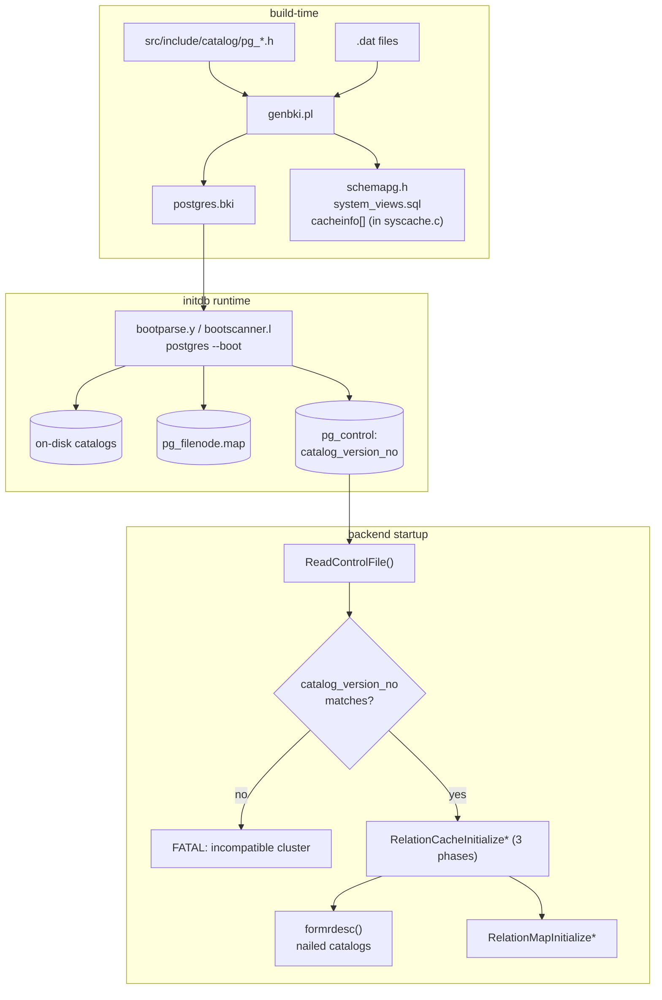

# Component: Catalog Data Model and Bootstrap

[Top: ../README.md](../../README.md)

## Overview

PostgreSQL's system catalogs are ordinary heap tables that happen to describe
the database itself. Every relation, every column, every type, every function,
every dependency is a row in some `pg_catalog` table. This component covers
the on-disk shape of those tables, the build pipeline that bootstraps them
into a fresh cluster, and the few "metadata of metadata" structures that
allow the catalogs themselves to be read before any catalog is open.

There are three persisted things at this layer:

1. **The catalog header files** (`src/include/catalog/pg_*.h`) — they declare
   the C `FormData_<name>` struct, the `CATALOG()` macro, BKI flags
   (`BKI_BOOTSTRAP`, `BKI_SHARED_RELATION`, `BKI_ROWTYPE_OID`), and the
   `DECLARE_*INDEX*` macros.
2. **The bootstrap data files** (`src/include/catalog/pg_*.dat`) — the rows
   that ship in every cluster (built-in types, built-in functions, system
   collations, default access methods, etc.).
3. **The `pg_control` file** (`src/include/catalog/pg_control.h`) — although
   not a heap relation, it is filed under `catalog/` because it carries
   `catalog_version_no` and the cluster-wide cursors that make catalog access
   meaningful (`nextOid`, `nextXid`, `nextMulti`, etc.).

## Architecture



## The CATALOG macro

Every system catalog begins its `.h` file with one of:

```c
CATALOG(name, oid, oidmacro)                                 /* most catalogs */
CATALOG(pg_class, 1259, RelationRelationId) BKI_BOOTSTRAP    /* nailed       */
CATALOG(pg_authid, 1260, AuthIdRelationId) BKI_SHARED_RELATION /* shared    */
```

These macros are interpreted by `src/backend/catalog/genbki.pl` to produce
`postgres.bki`. The same `.h` declares `FormData_<name>` and a forward
typedef `Form<Name> = FormData_<name>*`, which the C code uses to read tuples.

Flags that genbki.pl recognizes:

| Flag                       | Meaning                                                                |
|----------------------------|------------------------------------------------------------------------|
| `BKI_BOOTSTRAP`            | Nailed catalog: relcache builds the descriptor in C via formrdesc.     |
| `BKI_SHARED_RELATION`      | Shared (cluster-wide) relation; lives in pg_global tablespace.         |
| `BKI_ROWTYPE_OID(oid, m)`  | Pin a particular OID for the composite rowtype in pg_type.             |
| `BKI_SCHEMA_MACRO`         | Use the schemapg.h-supplied schema (used by pg_attribute itself).      |
| `BKI_FORCE_NULL`           | Force-null at bootstrap (e.g. relfrozenxid for early bootstrap).       |
| `BKI_FORCE_NOT_NULL`       | Force not-null.                                                        |
| `BKI_DEFAULT(value)`       | Default value used in .dat parsing.                                    |

## DECLARE_*INDEX* macros

System indexes are declared inline in the catalog header alongside the table
definition. For example, `pg_class`:

```c
DECLARE_UNIQUE_INDEX_PKEY(pg_class_oid_index,
        2662, ClassOidIndexId, pg_class, btree(oid oid_ops));
DECLARE_UNIQUE_INDEX(pg_class_relname_nsp_index,
        2663, ClassNameNspIndexId, pg_class,
        btree(relname name_ops, relnamespace oid_ops));
DECLARE_INDEX(pg_class_tblspc_relfilenode_index,
        3455, ClassTblspcRelfilenodeIndexId, pg_class,
        btree(reltablespace oid_ops, relfilenode oid_ops));
```

These macros expand into entries in `postgres.bki`'s `INDEX` directives.
The `*IndexId` C macros become canonical OID references usable from the
catalog modification path (e.g., `CatalogTupleInsert` looks up
`pg_class_oid_index` by `ClassOidIndexId`).

## The four nailed catalogs

```
pg_class         OID 1259   BKI_BOOTSTRAP, mapped
pg_attribute     OID 1249   BKI_BOOTSTRAP, mapped
pg_proc          OID 1255   BKI_BOOTSTRAP, mapped
pg_type          OID 1247   BKI_BOOTSTRAP, mapped
```

A catalog is *nailed* when the relcache must be able to read it before any
catalog is open — a chicken-and-egg situation. `formrdesc` constructs hard-coded
relcache descriptors for these four, plus the shared-catalog variants below.
See `src/backend/utils/cache/relcache.c:formrdesc` and the static
descriptor tables (`Schema_pg_class`, `Schema_pg_attribute`, `Schema_pg_proc`,
`Schema_pg_type`).

## The eleven shared catalogs

From `src/backend/catalog/catalog.c::IsSharedRelation()`:

```
pg_authid              1260
pg_auth_members        1261
pg_database            1262
pg_db_role_setting     2964
pg_parameter_acl       6243
pg_replication_origin  6000
pg_shdepend            1214
pg_shdescription       2396
pg_shseclabel          3592
pg_subscription        6100
pg_tablespace          1213
```

Shared catalogs live in the `pg_global` tablespace; they are visible from every
database. They are also *mapped* — see `component_relmapper.md`.

## The .dat files

`pg_*.dat` files are Perl data dumps consumed by `genbki.pl`. Format:

```perl
{ oid => '23', oid_symbol => 'INT4OID', array_type_oid => '1007',
  descr => 'integer, range -2147483648 to +2147483647',
  typname => 'int4', typlen => '4', typbyval => 't',
  typcategory => 'N', typinput => 'int4in', typoutput => 'int4out',
  typreceive => 'int4recv', typsend => 'int4send', typalign => 'i', },
```

Catalogs that ship .dat files include `pg_proc.dat` (every built-in function),
`pg_type.dat` (every built-in type), `pg_operator.dat`, `pg_amproc.dat`,
`pg_amop.dat`, `pg_aggregate.dat`, `pg_cast.dat`, `pg_collation.dat`,
`pg_language.dat`, `pg_namespace.dat`, `pg_ts_*.dat`, etc.

## CATALOG_VERSION_NO

```c
/* src/include/catalog/catversion.h */
#define CATALOG_VERSION_NO  ...
```

This monotonic integer is bumped any time:

- a header file changes the schema of a catalog,
- a `DECLARE_*INDEX*` is added/removed,
- a built-in type/function is added/removed,
- bootstrap data semantics change.

`ReadControlFile()` (`xlog.c`) compares the incoming
`ControlFileData::catalog_version_no` against the binary's compile-time
`CATALOG_VERSION_NO` and rejects the cluster on mismatch — this is what makes
"upgrade requires initdb" mandatory for binary-incompatible catalog changes.

## pg_control as the recovery anchor

Even though it is not a heap relation, `pg_control`
(`src/include/catalog/pg_control.h:104`) carries the *only* anchor a backend
has at startup. It is sized so that `sizeof(ControlFileData) <= 512` (one disk
sector) so the write is atomic on common hardware:

```c
StaticAssertDecl(sizeof(ControlFileData) <= PG_CONTROL_MAX_SAFE_SIZE,
                 "pg_control is too large for atomic disk writes");
```

Key fields:

| Field                       | Anchors                                                   |
|-----------------------------|-----------------------------------------------------------|
| `system_identifier`         | unique cluster ID, used for WAL file matching             |
| `pg_control_version`        | `PG_CONTROL_VERSION = 1700`                               |
| `catalog_version_no`        | identifies catalog header layout                          |
| `state`                     | DBState (DB_STARTUP, DB_IN_PRODUCTION, DB_SHUTDOWNED, ...)|
| `checkPoint`                | LSN of last checkpoint record                              |
| `checkPointCopy`            | inline `CheckPoint` struct (redo, nextXid, nextOid, ...)  |
| `unloggedLSN`               | counter for unlogged-relation init-fork recreation         |
| `minRecoveryPoint`          | latest replay LSN needed to reach consistency              |
| `backupStartPoint/EndPoint` | online-backup state                                        |
| WAL parameters              | `wal_level`, `wal_log_hints`, `MaxConnections`, ...        |
| Architecture compatibility  | `maxAlign`, `floatFormat`, `blcksz`, `relseg_size`, ...    |
| `data_checksum_version`     | non-zero iff data checksums enabled                        |
| `mock_authentication_nonce` | 32-byte cluster-unique random nonce for SASL               |
| `crc`                       | CRC-32C of all preceding bytes                             |

The physical file is `PG_CONTROL_FILE_SIZE = 8192` bytes, but only the first
~512 are used; the rest is zero-padded so a wrong-version file produces
"version mismatch" rather than a short-read error.

## Bootstrap path: initdb to running cluster

```
initdb
  -> postgres --boot   (bootstrap.c)
       reads postgres.bki:
         - emits the boot bki commands
         - inserts every .dat row into the appropriate catalog
       writes:
         - global/pg_control                    (catalog_version_no, sysid)
         - global/pg_filenode.map                (shared mapped catalogs)
         - base/<dbid>/pg_filenode.map            (local mapped catalogs)
         - per-catalog files
  -> postgres --single  (run system_views.sql, etc.)
```

The C-side counterpart is in `src/backend/bootstrap/`:
- `bootparse.y` / `bootscanner.l` parse postgres.bki commands.
- `bootstrap.c` provides `BootstrapProcessing` and the `boot_yyparse` driver.
- `BootStrapXLOG`, `BootStrapCLOG`, `BootStrapMultiXact`, `BootStrapCommitTs`,
  `BootStrapSUBTRANS` initialize the on-disk SLRU files.
- `RelationMapFinishBootstrap()` flushes the initial pg_filenode.map.

## Per-catalog C-side helpers

`src/backend/catalog/pg_*.c` files provide higher-level helpers for callers
that don't want to drive heap.c directly:

| File                     | Notable exports                                             |
|--------------------------|-------------------------------------------------------------|
| `pg_proc.c`              | `ProcedureCreate`                                           |
| `pg_type.c`              | `TypeCreate`, `TypeShellMake`, `GenerateTypeDependencies`   |
| `pg_constraint.c`        | `CreateConstraintEntry`, `RemoveConstraintById`             |
| `pg_depend.c`            | `recordDependencyOn`, `recordMultipleDependencies`          |
| `pg_shdepend.c`          | `recordSharedDependencyOn`, `changeDependencyOnOwner`       |
| `pg_namespace.c`         | `NamespaceCreate`                                            |
| `pg_publication.c`       | `publication_add_relation`, `RemovePublicationRelById`      |
| `pg_subscription.c`      | `GetSubscription`, `DropSubscription`                       |
| `pg_inherits.c`          | `StoreSingleInheritance`, `find_inheritance_children`       |
| `pg_class.c`             | `RelationGetSerialSequenceName`                             |
| `pg_attrdef.c`           | `StoreAttrDefault`, `RemoveAttrDefault`                     |
| `pg_operator.c`          | `OperatorCreate`, `OperatorShellMake`                       |
| `pg_aggregate.c`         | `AggregateCreate`                                            |
| `pg_collation.c`         | `CollationCreate`                                            |
| `pg_conversion.c`        | `ConversionCreate`                                           |
| `pg_db_role_setting.c`   | `AlterSetting`                                               |
| `pg_enum.c`              | `EnumValuesCreate`, `AddEnumLabel`                          |
| `pg_largeobject.c`       | `LargeObjectCreate`, `LargeObjectExists`                    |
| `pg_parameter_acl.c`     | `ParameterAclLookup`, `ParameterAclCreate`                  |
| `pg_range.c`             | `RangeCreate`                                                |
| `pg_subscription.c`      | (above)                                                     |

Every helper ultimately funnels through `CatalogTupleInsert` /
`CatalogTupleUpdate` / `CatalogTupleDelete` (see
`component_catalog_modification_apis.md`).

## Static-build infrastructure

Apart from genbki.pl, several auxiliary tables are produced at build time:

- `syscache_info.h` — generated cacheinfo[] table for syscache.c.
- `schemapg.h` — generated `Schema_pg_*` arrays used by formrdesc.
- `system_views.sql`, `system_functions.sql` — applied during initdb after the
  bki phase.
- `pg_*_d.h` — distilled "data" headers (constants only) safe to include from
  client-side code (e.g., `pg_type_d.h` for INT4OID).

## Persistence invariants

- The catalog header and the cluster's `catalog_version_no` are inseparable.
  Removing/adding a column without bumping `CATALOG_VERSION_NO` is a bug;
  the cluster will read on-disk tuples using the wrong tuple descriptor.
- Bootstrap-time data is written before any WAL is replayed; after bootstrap,
  every catalog change goes through ordinary heap WAL records (heap_insert,
  heap_update, heap_delete) plus the catalog-specific records (XLOG_RELMAP_UPDATE,
  XLOG_SMGR_CREATE) and XLOG_XACT_COMMIT for invalidation broadcast.
- `pg_control.system_identifier` is generated once at initdb and never changes.
  Clusters with different system_identifiers cannot share WAL.

## Cross-references

- Every individual catalog: `catalog_inventory/*.md`.
- Mapped-catalog mechanism: `component_relmapper.md`.
- Mutation entry points: `component_catalog_modification_apis.md`.
- Cache rebuild after mutation: `component_catalog_caches.md`,
  `component_cache_invalidation.md`.
- pg_control in the persistence story: `component_checkpoints_and_recovery.md`.

## Source references

- `src/include/catalog/pg_control.h:35` — `CheckPoint`
- `src/include/catalog/pg_control.h:104` — `ControlFileData`
- `src/include/catalog/pg_control.h:241` — `PG_CONTROL_MAX_SAFE_SIZE = 512`
- `src/include/catalog/pg_control.h:250` — `PG_CONTROL_FILE_SIZE = 8192`
- `src/include/catalog/catversion.h` — `CATALOG_VERSION_NO`
- `src/backend/catalog/genbki.pl` — bki generator
- `src/backend/catalog/catalog.c::IsSharedRelation` — the eleven shared catalogs
- `src/backend/utils/cache/relcache.c::formrdesc` — nailed-catalog descriptors
- `src/backend/bootstrap/bootstrap.c` — postgres --boot
- `src/backend/bootstrap/bootparse.y` — bki parser
