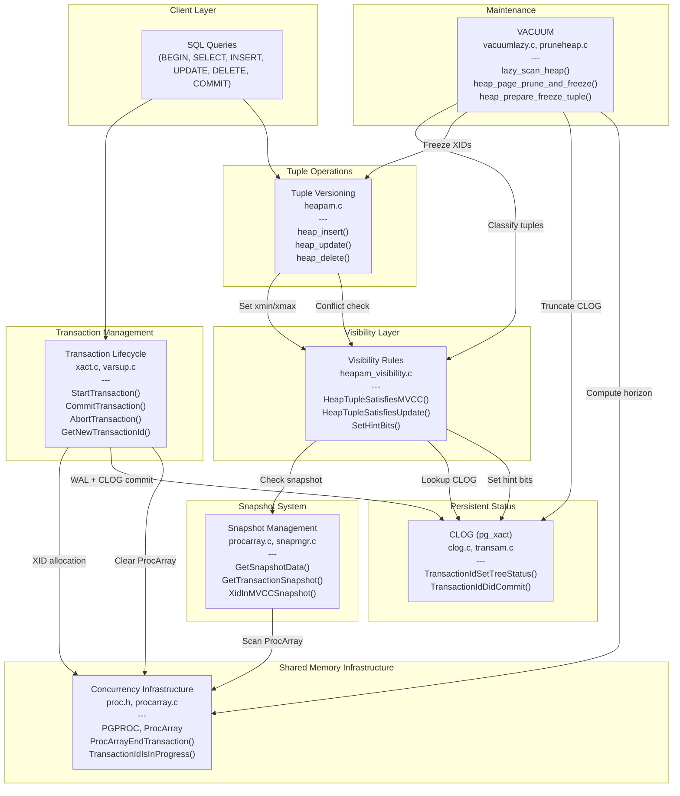

# Architecture Overview

> MVCC Documentation > Architecture Overview

**Prerequisites:** [Executive Summary](01_executive_summary.md)

---

## System-Wide Component Interaction

PostgreSQL's MVCC system comprises seven tightly integrated subsystems. Each subsystem has a distinct responsibility, but they share data structures and collaborate through well-defined interfaces. The diagram below shows how data flows between subsystems during normal operation.



## Data Flow Through the MVCC System

### Write Path (INSERT/UPDATE/DELETE)

When a transaction performs a write operation, data flows through the following sequence:

1. **Transaction Layer** (`xact.c`): If this is the first write, `GetNewTransactionId()` allocates a real XID from `TransamVariables->nextXid` and stores it in `PGPROC.xid` and the `ProcGlobal->xids[]` dense array.

2. **Tuple Layer** (`heapam.c`): The operation stamps the tuple with MVCC metadata:
   - INSERT: Sets `t_xmin = CurrentXID`, `t_xmax = InvalidTransactionId`
   - UPDATE: Creates new version with `t_xmin = CurrentXID`, marks old version with `t_xmax = CurrentXID`, links via `t_ctid`
   - DELETE: Sets `t_xmax = CurrentXID` on the existing tuple

3. **Visibility Check** (`heapam_visibility.c`): For UPDATE/DELETE, `HeapTupleSatisfiesUpdate()` first verifies the tuple can be modified. If another transaction holds it, the caller waits.

4. **WAL**: The operation is logged for crash recovery.

5. **Commit** (`xact.c`): `RecordTransactionCommit()` writes the commit WAL record, updates CLOG via `TransactionIdCommitTree()`, then `ProcArrayEndTransaction()` clears the XID from shared memory.

### Read Path (SELECT)

When a transaction reads data:

1. **Snapshot Acquisition** (`snapmgr.c`, `procarray.c`): `GetTransactionSnapshot()` calls `GetSnapshotData()`, which scans the `ProcGlobal->xids[]` dense array under shared `ProcArrayLock` to determine which transactions are in-progress, setting `xmin`, `xmax`, and populating the `xip[]` array.

2. **Tuple Scan** (`heapam.c`): The heap access method reads tuples from pages.

3. **Visibility Check** (`heapam_visibility.c`): For each tuple, `HeapTupleSatisfiesMVCC()` checks:
   - Is `t_xmin` (the inserter) committed and visible per the snapshot?
   - Is `t_xmax` (the deleter) absent, uncommitted, or invisible per the snapshot?
   - Hint bits in `t_infomask` short-circuit CLOG lookups for previously checked tuples.

4. **Snapshot Comparison** (`snapmgr.c`): `XidInMVCCSnapshot()` tests XIDs against the snapshot boundaries (`xmin`, `xmax`) and the `xip[]` in-progress array.

### Garbage Collection Path (VACUUM)

VACUUM is the deferred cleanup process that reclaims space from dead tuple versions:

1. **Cutoff Computation** (`vacuum.c`): `vacuum_get_cutoffs()` computes `OldestXmin` (the oldest XID any backend might need) and `FreezeLimit` (the threshold below which XIDs must be frozen).

2. **Heap Scan** (`vacuumlazy.c`): `lazy_scan_heap()` visits each page, calling `heap_page_prune_and_freeze()`.

3. **Tuple Classification** (`heapam_visibility.c`): `HeapTupleSatisfiesVacuumHorizon()` classifies each tuple as LIVE, RECENTLY_DEAD, DEAD, or IN_PROGRESS.

4. **Pruning and Freezing** (`pruneheap.c`): Dead HOT chain members are removed, pages are defragmented, and eligible XIDs are frozen by replacing them with `FrozenTransactionId`.

5. **Index Cleanup** (`vacuumlazy.c`): Index entries pointing to dead tuples are removed.

6. **Space Reclamation** (`vacuumlazy.c`): `lazy_vacuum_heap_rel()` converts LP_DEAD line pointers to LP_UNUSED.

7. **CLOG Truncation** (`vacuum.c`): After all relations are vacuumed, `vac_truncate_clog()` removes CLOG segment files for XIDs that have been frozen everywhere.

## Shared Memory Structures

The MVCC system relies on several shared memory structures for coordination between backends. See [diagrams/shared_memory_layout.mermaid](diagrams/shared_memory_layout.mermaid) for a visual layout.

### ProcGlobal and Dense Arrays

The `PROC_HDR` structure (`ProcGlobal`) maintains cache-friendly dense arrays that mirror per-backend MVCC state:

| Array | Mirrors | Used By |
|-------|---------|---------|
| `ProcGlobal->xids[]` | `PGPROC.xid` | `GetSnapshotData()`, `TransactionIdIsInProgress()` |
| `ProcGlobal->subxidStates[]` | `PGPROC.subxidStatus` | `GetSnapshotData()` (subtransaction overflow detection) |
| `ProcGlobal->statusFlags[]` | `PGPROC.statusFlags` | `GetSnapshotData()` (VACUUM/logical decoding filtering) |

These arrays are indexed by `PGPROC.pgxactoff` and are valid only while holding `ProcArrayLock` or `XidGenLock`. The dense layout avoids the cache-unfriendly indirection of scanning full PGPROC structures.

### TransamVariables

Global transaction state variables in shared memory:

| Variable | Purpose |
|----------|---------|
| `nextXid` | Next XID to assign (monotonically increasing `FullTransactionId`) |
| `latestCompletedXid` | Newest XID that has finished (basis for snapshot `xmax`) |
| `xactCompletionCount` | Monotonic counter for snapshot reuse optimization |
| `oldestClogXid` | Oldest XID with CLOG data still on disk |

### CLOG (pg_xact)

Two-bit-per-transaction status store, backed by the SLRU buffer pool. Statuses: IN_PROGRESS (00), COMMITTED (01), ABORTED (10), SUB_COMMITTED (11). Pages hold 32,768 transaction statuses each (8KB pages, 2 bits per XID).

## Key Interactions Between Subsystems

### Commit Path Ordering

The commit path follows a strict ordering that is essential for correctness:

```
WAL commit record --> CLOG update --> ProcArray clear --> Lock release
```

If CLOG were updated before WAL flush, a crash could lose the commit record while the CLOG shows committed. If ProcArray were cleared before CLOG update, concurrent transactions could see the XID as "not running" but also "not committed" in CLOG, which would be misinterpreted as aborted. See [Transaction Lifecycle](03_transaction_lifecycle.md) for details.

### Snapshot-Visibility Contract

A snapshot freezes the set of in-progress transactions at a point in time. The visibility rules use the snapshot to answer questions about transaction status without consulting the live ProcArray, which would be both slower (lock contention) and incorrect (the ProcArray state may have changed since the query began). See [Visibility Rules](05_visibility_rules.md) and [Snapshot Management](06_snapshot_management.md) for details.

### Hint Bit Amortization

The first transaction to check a tuple's visibility after the inserting/deleting transaction completes will set hint bits in `t_infomask`, caching the CLOG lookup result directly in the tuple header. All subsequent visibility checks on that tuple avoid the CLOG entirely. This lazy amortization is critical for performance. See [Visibility Rules](05_visibility_rules.md) for the `SetHintBits()` safety protocol.

### VACUUM and the Visibility Horizon

VACUUM's ability to remove dead tuples is bounded by the oldest snapshot held by any backend. The `OldestXmin` value (computed from all backends' `PGPROC.xmin` and `PGPROC.xid` fields, plus replication slot minimums) prevents VACUUM from removing tuples that might still be visible to any active query. See [VACUUM and Freezing](09_vacuum_and_freezing.md) and [Concurrency Infrastructure](07_concurrency_infrastructure.md) for details.

## Cross-Reference Map

The following table shows the primary data flows between subsystems:

| From | To | Data / Interface |
|------|----|-----------------|
| Transaction Lifecycle | Concurrency Infrastructure | XID via `PGPROC.xid`, cleared by `ProcArrayEndTransaction()` |
| Transaction Lifecycle | CLOG | Commit/abort status via `TransactionIdCommitTree()` / `TransactionIdAbortTree()` |
| Tuple Versioning | Visibility Rules | Tuple headers checked by `HeapTupleSatisfiesUpdate()` |
| Visibility Rules | Snapshot Management | `XidInMVCCSnapshot()` for snapshot-based XID status |
| Visibility Rules | CLOG | `TransactionIdDidCommit()` for persistent status lookup |
| Snapshot Management | Concurrency Infrastructure | `GetSnapshotData()` scans `ProcGlobal->xids[]` |
| VACUUM | Visibility Rules | `HeapTupleSatisfiesVacuumHorizon()` for tuple classification |
| VACUUM | Concurrency Infrastructure | `GetOldestNonRemovableTransactionId()` for horizon computation |
| VACUUM | CLOG | `vac_truncate_clog()` for CLOG truncation after freezing |

---

Previous: [Executive Summary](01_executive_summary.md) | Next: [Transaction Lifecycle](03_transaction_lifecycle.md)
